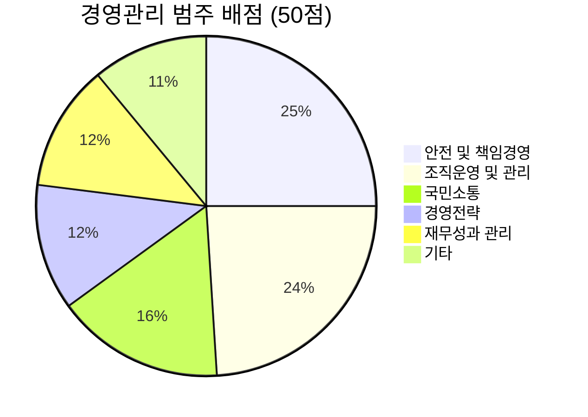
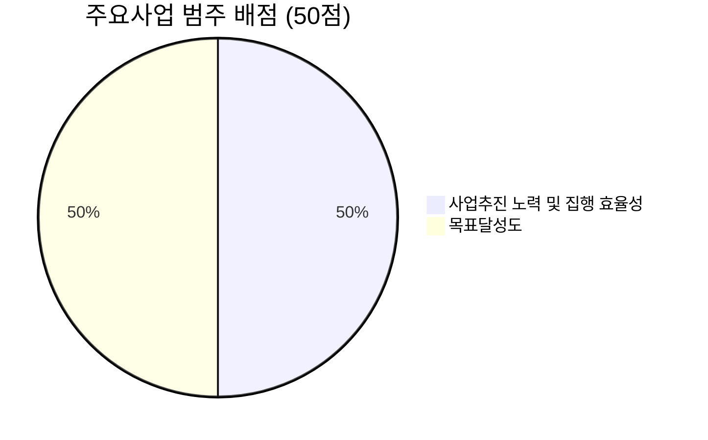

---
{"publish":true,"aliases":"경영평가분석 2025경평","title":"2025년 경영평가 세부평가 내용 분석","created":"2025-11-12","modified":"2025-12-10T21:01:25.920+09:00","tags":["#경영평가","#KOFIC","#2025년","#표준모형","#정책집행","#영화진흥위원회","#경영평가편람","#세부평가내용","#기획전략팀","#경영실적평가"],"cssclasses":""}
---


# 2025년 경영평가 세부평가 내용 분석

> [!info] 문서 정보
> - **대상기관**: 영화진흥위원회
> - **평가모형**: 표준모형(정책집행·민간지원)
> - **총점**: 100점 (경영관리 50점 + 주요사업 50점)
> - **작성일**: 2025-11-12

---

## 목차

- [[25년 경평/1_공통 자료/01_편람_및_지침/2025년_경영평가_세부평가내용_분석#1. 경영관리 범주 (50점)\|경영관리 범주]]
	- [[25년 경평/1_공통 자료/01_편람_및_지침/2025년_경영평가_세부평가내용_분석#1-1. 경영전략\|경영전략]]
	- [[25년 경평/1_공통 자료/01_편람_및_지침/2025년_경영평가_세부평가내용_분석#1-2. 안전 및 책임경영\|안전 및 책임경영]]
	- [[25년 경평/1_공통 자료/01_편람_및_지침/2025년_경영평가_세부평가내용_분석#1-3. 재무성과 관리\|재무성과 관리]]
	- [[25년 경평/1_공통 자료/01_편람_및_지침/2025년_경영평가_세부평가내용_분석#1-4. 조직운영 및 관리\|조직운영 및 관리]]
	- [[25년 경평/1_공통 자료/01_편람_및_지침/2025년_경영평가_세부평가내용_분석#1-5. 국민소통\|국민소통]]
- [[25년 경평/1_공통 자료/01_편람_및_지침/2025년_경영평가_세부평가내용_분석#2. 주요사업 범주 (50점)\|주요사업 범주]]
- [[25년 경평/1_공통 자료/01_편람_및_지침/2025년_경영평가_세부평가내용_분석#배점 구조 및 전략\|배점 구조 및 전략]]

---

## 1. 경영관리 범주 (50점)

### 1-1. 경영전략 (6점)

#### (1) 경영 비전 실행 전략 및 노력

> [!abstract] 지표 개요
> - **배점**: 비계량 3점
> - **지표정의**: 기관의 설립목적에 부합되는 비전, 경영목표, 경영전략의 수립과 이를 실행하기 위한 노력과 성과를 평가

##### 📋 세부평가내용

**① 비전·경영목표·경영전략 수립 및 이행**
- 기관의 설립목적, 환경변화에 부합하는 비전･핵심가치･경영목표의 설정 및 이와 연계된 경영전략의 체계적 수립 및 이행을 위한 기관의 노력과 성과
	- 효율성과 공공성의 균형
	- 핵심업무와 연계성
	- 국정과제 반영
	- ESG 등을 고려한 경영목표 및 경영전략 수립
	- 대내외 이해관계자와 비전·핵심가치 공유

**② 경영혁신 및 경영성과 개선**
- 경영혁신 및 경영성과 개선을 위한 계획 수립과 이행을 위한 기관의 노력과 성과
	- 적극행정, 대국민 공공서비스 혁신 등 규제개선 노력 및 실적
	- 경영평가 및 컨설팅 결과 등에 따른 경영혁신 계획 수립을 위한 노력 및 성과

> [!tip] 해설 및 작성 포인트
> 
> **핵심 평가 포인트**
> - ✅ **비전-전략-실행의 일관성**: 설립목적 → 비전 → 경영목표 → 세부전략의 유기적 연결
> - ✅ **국정과제 연계**: 영화진흥위원회의 경우 문화정책, 콘텐츠산업 육성 등과 정합성
> - ✅ **ESG 반영**: 2025년 평가에서 강조되는 환경·사회·지배구조 요소의 구체적 반영
> - ✅ **이해관계자 소통**: 영화산업 종사자, 관객, 정부 등과 비전 공유 실적
> 
> **작성 시 유의사항**
> 1. 단순한 계획 나열 ❌ → 실제 이행 실적과 성과 구체적 제시 ✅
> 2. 전년도 경영평가 지적사항에 대한 개선 노력 명확히 서술
> 3. 적극행정, 규제개선 사례를 정량적·정성적으로 입증

---

#### (2) 공공기관 혁신 노력과 성과

> [!abstract] 지표 개요
> - **배점**: 비계량 3점
> - **지표정의**: 공공기관 혁신방안 실행을 위한 노력과 성과를 평가

##### 📋 세부평가내용

**① 안전한 일터 조성**
- 사내외 협력업체의 안전역량 강화, 지원 및 보호, 안전문화 확산 및 소통 강화 등

**② AI 활용을 통한 혁신** 🆕
- AI 활용을 통한 '기관 생산성'·'대국민 공공서비스'·'근로자 안전' 혁신 등을 위한 노력과 성과
	- AI 활용을 통한 생산성·업무효율 향상
	- 국민 생활편의 증진
	- 근로자 안전 제고 등

**③ 국정과제 등 핵심정책 이행**
- 국정과제 등 정부정책 적극 수행 및 대국민 홍보
	- 물가 안정, 주거·교육·의료·금융 등 필수서비스 공급을 통해 국민생활 안정에 기여
	- 업무혁신을 통해 공공서비스에 대한 국민 체감도 향상
	- 대국민 체감형 서비스 개선 과제 (기재부) 반영

> [!tip] 해설 및 작성 포인트
> 
> **2025년 신규 강화: AI 혁신이 핵심**
> 
> **AI 활용 사례**
> - 🤖 내부 업무효율화: 보조금 심사, 데이터 분석 등에 AI 도입
> - 🤖 대국민 서비스: 영화정보 추천, 챗봇 상담 등
> - 🤖 근로자 안전: AI 기반 안전관리 시스템
> 
> **국정과제 이행**
> - 한국영화 진흥
> - 영화산업 지원
> - 기재부 선정 '대국민 체감형 서비스 개선과제' 이행
> 
> **작성 시 주의**
> - AI 활용은 구체적 도입 사례와 성과(업무시간 절감율, 서비스 만족도 등) 제시 필수
> - 단순 계획 아닌 실제 국민 체감 변화 중심으로 작성

---

### 1-2. 안전 및 책임경영 (12.5점)

#### (1) 일자리 및 균등한 기회

> [!abstract] 지표 개요
> - **배점**: 비계량 2점
> - **지표정의**: 좋은 일자리 창출과 고용의 질 개선, 사회형평적 인력 활용과 균등한 기회보장을 위한 노력과 성과를 평가

##### 📋 세부평가내용

**① 신규채용 및 공정채용**
- 공공기관의 채용 확대 및 조기채용, 인턴제도 운영 내실화 및 국민취업지원제도 일경험프로그램 참여
- 블라인드 채용 및 직무수행능력중심평가
- 최종 탈락자에 대한 탈락 사유 피드백 제공
- 고졸자·여성·무기계약직·별도직군 등에 대한 차별 해소 및 적절한 처우개선
- 비정규직 채용 사전심사제 운영 등 비정규직 운영의 적정성

**② 일자리 창출 노력**
- 정·현원차 관리, 일하는 방식 개선 등 다양한 근로형태의 도입
	- 교대제 변경, 시간선택제, 유연근무제 및 탄력정원제 실시 등

**③ 민간부문 일자리 창출**
- 사내벤처 활성화 등 혁신적 수단을 통한 직접적 민간의 일자리 창출
- 금융지원, 컨설팅 등 간접적 지원을 통한 민간 일자리 창출

**④ 사회형평적 인력 활용**
- 장애인 채용 노력 및 청년 의무고용 준수
- 비수도권 인재 채용·지방이전 기관의 이전지역 인재 채용 비율
- 여성임원･관리자 및 여성채용 확대 등 여성인력 활용
- 여성대표성 제고 및 양성평등실현
	- 여성임원: 본부직제상 기관장, 이사, 감사
	- 여성관리자: 비상임·상임 포함, 부서장 이상 임용이 가능한 직급

**⑤ 표준계약서 사용** ⭐
- 기관 경영활동 및 사업 추진 시 문화․예술․방송․콘텐츠 등 제 분야의 표준계약서 사용 여부

> [!tip] 해설 및 작성 포인트
> 
> **영화진흥위원회 특화 포인트**
> - 📌 **표준계약서 사용**: 영화·방송·콘텐츠 분야 표준계약서는 영화진흥위원회의 고유 미션과 직결
> - 📌 **민간 일자리**: 영화산업 종사자 지원, 제작사 지원 등이 민간 일자리 창출로 연결
> - 📌 **여성인력**: 영화계는 여성 진출이 상대적으로 낮은 편 → 개선 노력 강조
> 
> **작성 시 유의사항**
> 1. 단순 채용 인원 아닌 청년·여성·장애인 등 세부 비율 제시
> 2. 영화제작 지원사업에서 표준계약서 사용 의무화 등 구체적 사례
> 3. 영화산업 종사자의 고용안정성 제고 (프리랜서 보호 등)

---

#### (1-1) 균등한 기회와 사회통합

> [!abstract] 지표 개요
> - **배점**: 계량 1점
> - **지표정의**: 사회적 약자에 대한 고용과 보호 등 사회통합 노력과 성과를 평가

##### 📋 세부평가내용

**가중치 설정 (총 합계 1점)**
- 장애인 의무고용: 0.3~0.6
- 국가유공자 우선채용: 0.2~0.5
- 용역근로자 보호지침 준수: 0.2~0.5

> [!tip] 해설 및 작성 포인트
> 
> **계량지표 - 명확한 수치 달성 요구**
> - ✅ 장애인 의무고용: 법정의무고용률(3.6%) 달성 필수
> - ✅ 국가유공자: 채용계획 대비 실제 채용 실적
> - ✅ 용역근로자: 생활임금 적용, 처우개선
> 
> **가중치 설정 전략**
> - 기관이 강점을 가진 분야에 높은 가중치 배분
> - 단, 모든 항목에서 최소 기준은 충족해야 함

---

#### (2) 윤리 경영 노력과 활동 🔥

> [!warning] 중요 변경사항
> - **배점 2배 증가**: 1.5점 → 3점
> - **인권경영 신규 통합**
> - 권익위 종합청렴도 평가 직접 반영

> [!abstract] 지표 개요
> - **배점**: 비계량 3점
> - **지표정의**: 윤리경영 지원을 위한 내부통제시스템 구축 및 운영 노력과 성과, 경제적·법적 책임과 더불어 사회적 통념으로 기대되는 윤리적 책임 준수 노력과 성과를 평가

##### 📋 세부평가내용

**① 윤리경영체계 구축·운영**
- 윤리경영 관련 전담조직(담당자 지정)과 지침(윤리헌장, 윤리강령, 행동강령 등) 마련․운영
- 비윤리적 행위 신고 및 조치 결과
- 반부패․청렴 교육 실적
- ⭐ **권익위 종합청렴도 평가 결과 반영**

**② 성희롱․성폭력 예방 및 근절** 🆕
- 법령 및 표준안을 반영한 예방지침 및 매뉴얼 개정
- 고충상담원 전문교육 이수
- 직원 예방교육 참여율
- 고충심의위원회 구성 및 외부전문가 위촉 등 상시 대응체계 구축
- 사건처리절차(조사, 고충심의위원회 개최, 재발방지대책 수립 등) 적절성
- **성희롱ㆍ성폭력 대응체계 점검결과(매년) 시정조치 요구사항 이행여부**

**③ 이해충돌방지** 🆕
- 이해충돌방지법 제2조 제4호에 따른 이해충돌 방지를 위한 노력과 성과

**④ 인권경영** 🆕
- 인권경영 추진을 위한 조직 및 제도의 적정성
- 인권 정책 및 확산 활동의 적정성
- 인권경영 교육을 위한 교육체계 구축과 교육 성과의 적정성
- 기관의 인권이슈 도출, 대응계획 수립 및 실행의 적정성
- 고충처리제도 운영 등 근로자 및 대내외 이해관계자 인권보호

> [!danger] 0점 가능 사항
> 중대한 사회적 기본책무 위반행위 및 위법행위가 발생한 경우 0점 부여 가능

> [!tip] 해설 및 작성 포인트
> 
> **2025년 최대 강화 지표**
> 
> **청렴도 관리** 🎯
> - 권익위 종합청렴도 평가 결과가 직접 반영
> - 평가 결과 낮으면 치명적 → 사전 대비 필수
> 
> **성희롱·성폭력 예방** 🎯
> - 예방교육 100% 이수
> - 고충심의위원회 구성 및 실제 운영
> - 여성가족부 점검 시정조치 이행
> - 사건 발생 시 처리 과정의 적절성 평가
> 
> **인권경영** 🎯
> - 인권경영 전담조직 및 체계
> - 인권영향평가 실시
> - 영화산업 종사자 인권보호 (촬영현장, 성평등, 노동권 등)
> 
> **영화진흥위원회 특화**
> - 영화계 특성상 촬영현장 인권, 성평등 이슈에 대한 선제적 대응 필요
> - 프리랜서 영화인 권리 보호
> - 제작현장 갑질 근절
> 
> **⚠️ 리스크 관리**
> - 중대 위반 시 0점 가능
> - 권익위 청렴도, 여가부 점검 결과 사전 확인 필수

---

#### (3) 안전 및 재난관리

> [!abstract] 지표 개요
> - **배점**: 비계량 3점
> - **지표정의**: 산업재해 및 재난·사고로부터 안전한 근로·생활환경을 유지하기 위한 노력과 성과를 평가

##### 📋 세부평가내용

**① 산업재해 등 근로자 피해방지**
- 근로자(간접고용, 하청업체 근로자 포함) 피해방지 및 사업장(발주현장 포함) 안전관리
- 시설물(청사, 다중이용시설 등) 관리 및 건설과정에서의 안전확보
- 근로자 내부제안제도 운영
- 근로자의 업무상 부상·질병 예방
- 임산부·장애인 등 취약근로자 보호

**② 재난관리시스템**
- 재난관리시스템(예방·대비·대응·복구) 구축·운영
- 재난·사고 발생 여부 및 피해 정도
- 재난대비계획 수립·이행 실적
- 관계자 교육
- 재난대비 관련 예산·조직·인력 현황
- ⭐ **공공기관 재난관리평가 결과(행안부) 반영**

**③ 개인정보 보호 및 사이버 안전**
- 정보보안 관리체계 구축·운영
- ⭐ **개인정보 보호수준 평가(개보위) 반영**
- ⭐ **공공기관 정보보안관리 실태평가(국정원) 반영**
- ⭐ **정보보안감사(문체부) 반영**

> [!danger] 0점 가능 사항
> 중대재해가 발생하였고, 해당 재해 발생과정에서 안전법령을 위반한 경우 0점 부여 가능
> - 중대재해: ｢중대재해처벌법｣상 중대산업재해
> - 안전법령 위반: 「산업안전보건법」「공공기관 안전관리지침」 등

> [!tip] 해설 및 작성 포인트
> 
> **중대재해처벌법 시행 이후 안전관리 중요성 증대**
> 
> **산업안전** 🏗️
> - 영화진흥위원회 직원 + 지원사업 협력업체 근로자 안전
> - 영화 촬영현장 안전관리 지원 (스턴트, 고위험 촬영 등)
> - 영화관, 영상센터 등 시설 안전점검
> 
> **재난관리** 🚨
> - 행안부 재난관리평가 결과 직접 반영
> - 영화제 등 대규모 행사 시 재난대응체계
> 
> **정보보안** 🔒
> - 개보위, 국정원, 문체부의 3개 기관 평가 결과 모두 반영
> - 영화진흥위원회는 대규모 개인정보 보유 (영화관객, 사업자 등)
> 
> **⚠️ 중요 주의사항**
> - 중대재해 발생 시 0점 가능 → 예방이 최우선
> - 외부 평가 결과 사전 확인 및 대비 필수
> - 영화 촬영현장 안전은 특화 영역으로 강조 가능

---

#### (4) 상생·협력 및 지역발전

> [!abstract] 지표 개요
> - **배점**: 비계량 2.5점
> - **지표정의**: 지역사회 발전 및 지역경제 활성화와 중소기업․소상공인 등과의 상생·협력을 위한 노력과 성과를 평가

##### 📋 세부평가내용

**① 중소기업·소상공인 상생협력**
- 사회적 기업, 협동조합, 마을기업, 자활기업 등에 대한 협력사업 발굴
- 공정한 경제질서 확립

**② 지역사회 참여 및 지역경제 활성화**
- 기부·봉사활동 등 지역사회 참여
- 지자체·지역기업·지역대학과의 협력사업(지역문제해결 플랫폼 등) 발굴
- 지역농산물 등 지역생산품 구매확대
- 지역 및 국제행사 참여
- 공공기관 선도지역 활성화 추진

**③ 친환경·탄소중립**
- 기관 자체의 친환경·탄소중립 관련 계획 및 활동

**④ 문화예술체육 분야 저변확대**
- 비인기 체육종목 경기단체 후원·운영
- 문화예술분야 후원·지원

> [!tip] 해설 및 작성 포인트
> 
> **영화진흥위원회 강점 활용 가능 지표**
> 
> **중소기업 상생** 🤝
> - 영화 제작사, 배급사는 대부분 중소기업
> - 사회적 기업 형태의 문화예술단체 지원
> 
> **지역발전** 🌆
> - ⭐ **부산 본부 소재 강점**
> 	- 지역경제 기여도 높음
> 	- 지역 영화 제작 지원
> 	- 지역 영화제 지원
> 	- 부산국제영화제 등 국제행사 참여
> 
> **탄소중립** 🌱
> - 그린필름 촉진 (친환경 영화 제작 지원)
> - 기관 자체 탄소배출 감축 계획
> 
> **문화예술 지원** 🎬
> - 영화진흥위원회의 고유 미션
> - 다양성영화, 독립영화 지원
> 
> **작성 전략**
> 1. 영화산업 특성을 살린 지역발전 기여 강조
> 2. 부산 소재 강점 최대한 활용
> 3. 영화 제작 과정의 탄소배출 감축은 선도적 사례로 부각

---

#### (4-1) 지역경제 활성화 및 상생협력

> [!abstract] 지표 개요
> - **배점**: 계량 1.5점
> - **지표정의**: 지역경제 활성화와 중소기업, 소상공인, 사회적 경제 기업 등과의 상생·협력을 위한 실적을 평가

##### 📋 세부평가내용

**구매실적 항목 및 가중치**
- 중소기업생산품: 0.4
- 기술개발생산품: 0.15
- 사회적기업‧협동조합생산품: 0.15
- 전통시장 온누리 상품권: 0.2
- 여성기업생산품: 0.15
- 장애인생산품: 0.3
- 국가유공자자활용사촌생산품: 0.15

> [!tip] 해설 및 작성 포인트
> 
> **명확한 구매실적 수치로 평가**
> - 각 항목별 구매비율 목표 달성
> - 중소기업생산품(0.4)과 장애인생산품(0.3)이 가중치 높음
> 
> **작성 시 유의사항**
> - 구매실적은 조달시스템에서 자동 집계 → 정확성 필수
> - 영화 제작 지원사업 등에서도 해당 제품 우선 구매 유도

---

### 1-3. 재무성과 관리 (6점)

#### (1) 재무예산 관리

> [!abstract] 지표 개요
> - **배점**: 비계량 6점 (경영관리에서 가장 높은 배점)
> - **지표정의**: 건전한 재무구조 및 합리적 예산운용을 위한 재무예산 관리시스템 구축 및 운영 성과를 평가

##### 📋 세부평가내용

**① 재무구조의 안정성 및 건전성**
- 경영환경 변동성 확대 등 미래위험 예측 및 대응
- 부채 및 유동성 관리
- 현금성 자산의 연기금투자풀 예탁 활성화 등 효율적 자산운용
- 재무구조개선을 위한 재무계획 및 운영의 적정성과 이행 노력
- 금융비용 관리 등 연간 자금조달·운용 계획 수립 및 이행
- **중장기재무관리계획의 적정성과 실행**
- 중장기 사업·투자계획의 적정성(재무전망 수립 근거의 적합성) 및 이행

**② 예산편성 및 집행의 합리성**
- 사업 선정 및 신규 사업별 재무 안정성·수익성 등 타당성 확보(예비타당성 조사 등)
- 합리적이고 효율적인 예산편성
- 투명한 집행

**③ 재무성과 개선**
- 당해년도 예산운용지침, 관계 법령 준수
- 집행 투명성 제고
- 공정한 계약 체결 등 투명한 예산운용
- 원가 및 경비 절감, 경영 효율화 등 재무관리 자구 노력
- 재무성과 목표의 구체성 및 적정성과 목표 달성 노력
- 재무성과 수준의 적정성
- **재정사업 추진체계 개선**: 보조사업 의존도 완화 노력 및 성과

> [!tip] 해설 및 작성 포인트
> 
> **재무관리의 종합 역량 평가 (6점 = 경영관리 최고 배점)**
> 
> **재무건전성** 💰
> - 영화진흥위원회는 기금 운용기관 → 자산운용의 안정성 중요
> - 영화발전기금 효율적 운용
> - 부채비율 관리 (일반적으로 낮은 수준 유지 필요)
> 
> **예산편성 및 집행** 📊
> - 신규사업 타당성 분석 (예: 새로운 지원사업 도입 시)
> - 예산운용지침 준수
> - 집행률과 함께 집행의 적정성 평가
> 
> **재무성과** 📈
> - 경비절감 노력
> - 보조사업 외 자체사업 확대 등 재원 다변화
> 
> **재정사업 개선** 🔄
> - 보조금 중심 → 융자, 투자 등 다양한 지원방식 도입
> - 성과 중심의 재정사업 운영
> 
> **작성 시 유의사항**
> 1. 중장기재무관리계획과 실제 이행실적의 일치 중요
> 2. 예산집행의 효율성 + 투명성 동시 입증
> 3. 영화발전기금의 공익적 운용과 수익성 확보의 균형

---

### 1-4. 조직운영 및 관리 (12점)

#### (1) 조직 및 인적자원관리

> [!abstract] 지표 개요
> - **배점**: 비계량 4점
> - **지표정의**: 조직 및 인적자원 관리와 성과관리 체계의 구축·운영 노력과 성과를 평가

##### 📋 세부평가내용

**① 조직 및 인적자원 운용계획**
- 중장기 경영전략과 연계된 조직 및 인적자원 운용계획 수립
- 핵심업무를 고려한 단위조직의 역할과 책임 설정
- 적절한 인력 배분과 관리
	- 경영전략 실행을 위한 조직·인력 배분, 기능조정 발굴
	- 기관 특성에 맞는 인력 배분 및 관리 등 인력운영 과정의 공정성 제고

**② 성과평가시스템**
- 합리적 조직‧개인 성과평가시스템 구축
- 기관 특성을 반영한 직무수행능력중심평가의 도입 및 운영 성과

**③ 구성원 역량개발**
- 인사교류·특별승진 제도기반 구축
- 보직관리(CDP) 및 전보관리 합리화
- 개방형계약직제 및 전문직위제 운영

**④ 일·가정 양립**
- 육아휴직 활용 등
- 가족친화인증 여부
- 남성근로자 육아휴직이용률
- 유연근무제(탄력근무제, 원격근무제 등) 활용실적

**⑤ 임금피크제**
- 연령구조, 임금체계, 직무특성 등을 고려한 제도설계의 적절성
- 임금피크제 관련 신규채용 목표 달성 여부
- 임금피크 대상자의 활용도
- 복무·성과관리 등 인력관리의 적절성

> [!tip] 해설 및 작성 포인트
> 
> **조직관리의 효율성과 구성원 성장 동시 평가**
> 
> **조직·인력 운용** 🏢
> - 영화진흥 정책 변화에 따른 조직 개편
> - 핵심업무(영화진흥, K-콘텐츠 지원 등)에 인력 집중
> 
> **성과평가** 📋
> - NCS 기반 직무능력평가
> - 성과와 보상의 연계
> 
> **역량개발** 📚
> - 영화산업 전문성 강화 교육
> - 타 기관·민간 인사교류
> 
> **일·가정 양립** 👨‍👩‍👧‍👦
> - 가족친화인증 획득 및 유지
> - ⭐ **남성 육아휴직 활성화** (정부 강조사항)
> - 유연근무제 실질적 운영
> 
> **임금피크제** 📊
> - 신규채용 창출 효과
> - 임금피크 대상자의 생산적 활용
> 
> **작성 시 유의사항**
> - 단순 제도 나열 ❌ → 실제 운영 성과 제시 ✅
> - 남성 육아휴직률은 매년 상승 추세여야 함
> - 임금피크제를 통한 실제 신규채용 실적 제시

---

#### (2) 노사관계

> [!abstract] 지표 개요
> - **배점**: 비계량 2점
> - **지표정의**: 노사관계 합리성 제고를 위한 노력과 성과를 평가 (노조유무 관계없이 협력적 노사관계 구축 평가)

##### 📋 세부평가내용

**① 노사간 협의체계**
- 노사 간 협력체계, 근로시간 면제제도 운영 등 ｢노동조합 및 노동관계조정법｣ 등 노동관계법령 준수
- 행정관청의 시정명령 이행여부

**② 의사소통 및 역량 강화**
- 노사 간의 공감대 형성을 위한 의사소통
- 노사관계 관리 역량 강화

**③ 근로조건 향상**
- 노사협의를 통한 근로조건의 실질적 향상과 구체적 성과

> [!tip] 해설 및 작성 포인트
> 
> **협력적 노사관계 = 안정적 운영 기반**
> 
> **노동법령 준수** ⚖️
> - 근로시간 면제 한도 준수
> - 단체협약의 적법성
> - 노동위원회 시정명령 이행
> 
> **의사소통** 💬
> - 노사협의회 정기 개최
> - 주요 경영사항 사전 협의
> - 노사 공동 워크숍, 교육
> 
> **근로조건 향상** 📈
> - 임금, 복지 개선
> - 작업환경 개선
> - 교육·훈련 기회 확대
> 
> **⚠️ 리스크**
> - 노사갈등(파업, 분쟁) 발생 시 감점
> - 노조 없어도 협력적 노사문화 구축 노력 평가
> - 노동법령 위반은 치명적 → 사전 점검 필수

---

#### (3) 보수 및 복리후생 🔥

> [!warning] 2025년 신규 강화
> **직무중심 보수체계 개편** 항목 추가

> [!abstract] 지표 개요
> - **배점**: 비계량 3점
> - **지표정의**: 합리적인 보수 및 복리후생 제도 구축을 위한 노력과 성과를 평가

##### 📋 세부평가내용

**① 관련 규정 준수**
- 예산운용지침, 혁신지침 등 인건비, 복리후생비, 각종 경비 규정 준수
- 복리후생비 관련 규정 준수
	- 교육비, 의료비, 경조금, 특별휴가, 퇴직금, 복무행태, 고용세습 등
	- 과도한 복리후생 항목 존재 여부
- 경영 여건이나 국민 눈높이 대비 과도한 운용 여부
- ⭐ **자체점검 체크리스트 작성 및 외부점검단 확인**
- 전년 대비 복리후생비 과도 집행 여부

**② 직무중심 보수체계 개편** 🆕
- **통상임금판단기준변경판례('24.12.)의 영향을 총인건비 관리제도 내 최소화**
- 직무분석 등 사전절차의 이행
- 직무급 도입을 위한 보수규정 개정, 노사협의 등 직무중심 보수체계 개편 노력과 성과
- 기 도입 기관의 경우: 직무성과급제 적용대상 확대, 직무급 비중확대, 직무분석 고도화
- ⭐ **직무중심 보수체계 개편 점검(기재부) 결과 반영**

> [!danger] 0점 가능 사항
> 중대한 규정 위반 및 위법행위가 발생한 경우 0점 부여 가능

> [!tip] 해설 및 작성 포인트
> 
> **2025년 핵심 변화: 직무중심 보수체계 개편 신규 추가**
> 
> **규정 준수** 📜
> - 기재부 예산운용지침 준수
> - 고용세습, 과도한 복리후생 금지
> - 자체점검 체크리스트 + 외부점검단 확인 필수
> 
> **복리후생 적정성** 💰
> - 국민 눈높이 고려 (과도한 복지는 여론 악화)
> - 전년 대비 급증 지양
> 
> **직무중심 보수체계** 🆕 (정부 강조)
> - 호봉제 → 직무급 전환
> - 직무분석 실시
> - 직무급 도입 계획 수립
> - 기재부 점검 대비
> 
> **작성 시 유의사항**
> 1. 복리후생 관련 언론 보도, 국회 지적 등은 치명적
> 2. 직무중심 보수체계는 중장기 과제 → 단계적 접근
> 3. 기재부 외부점검단 사전 대비 필수

---

#### (4) 총인건비 관리

> [!abstract] 지표 개요
> - **배점**: 계량 3점
> - **지표정의**: 공기업․준정부기관 예산편성 지침의 총인건비 인상률 준수여부를 평가

##### 📋 세부평가내용

**총인건비 인상률 산출**
```
총인건비 인상률 = (평가년도 총인건비 - 전년도 총인건비) / 전년도 총인건비
```

**평가 기준**
- 총인건비 정의: 공기업․준정부기관 예산운용지침에 따름
- 평가 대상연도의 총인건비 인상률 위반 여부만 평가
- 2025년도 차등 적용 기관은 차등인상률에 따라 평가

> [!danger] 원칙적 지표
> **위반 시 0점 처리**

> [!tip] 해설 및 작성 포인트
> 
> **명확한 계량지표 - 위반 불가**
> 
> **인상률 준수** 📊
> - 기재부 지침상 인상률 한도 내 관리
> 
> **총인건비 범위** 💼
> - 기본급, 제수당, 상여금, 퇴직급여 등 포함
> - 복리후생비는 별도
> 
> **예외 인정** ✅
> - 법정 인상분(최저임금 등)은 별도 가산
> - 신규채용에 따른 증가는 일부 인정
> 
> **⚠️ 중요**
> - 연초 예산편성 시 인상률 한도 반드시 확인
> - 기금직원과 일반직의 인건비 산정 기준 명확히 구분
> - 위반 시 0점 → 보수적 관리 필수

---

### 1-5. 국민소통 (8점)

#### (1) 고객관리 활동

> [!abstract] 지표 개요
> - **배점**: 비계량 3.5점
> - **지표정의**: 기관의 핵심업무와 관련한 고객의 만족도 향상을 위한 노력과 성과를 평가

##### 📋 세부평가내용

**① 고객 정의 및 구분**
- 기관의 핵심업무와 연계한 고객의 정의와 구분
- 고객별 관리 전략의 적절성

**② 의견수렴 및 반영 체계**
- 고객의 의견을 수렴하고 기관의 경영 및 주요사업 추진에 반영하기 위한 체계 구축 노력 및 성과

> [!tip] 해설 및 작성 포인트
> 
> **고객관리의 전략적 접근**
> 
> **고객 정의** (영화진흥위원회) 🎬
> - **1차 고객**: 영화 제작자, 배급사, 영화관 등 업계
> - **2차 고객**: 영화 관객, 국민
> - **3차 고객**: 문체부 등 정책당국
> - → 고객군별 차별화된 관리 전략 수립
> 
> **의견수렴 체계** 📢
> - 정기적 간담회, 설문조사
> - 홈페이지·앱 VOC 시스템
> - 고객 제안의 정책 반영 사례
> - 고객 불만처리 프로세스
> 
> **작성 시 유의사항**
> - 영화진흥위원회의 고객은 매우 다양 → 세분화 필수
> - 고객 의견 수렴 → 정책 반영의 구체적 사례 제시
> - 단순 만족도 조사 ❌ → 실질적 개선 사례 중심 ✅

---

#### (2) 고객만족도

> [!abstract] 지표 개요
> - **배점**: 계량 2점
> - **지표정의**: 고객만족도 조사결과 나타난 고객만족도의 수준과 개선 실적을 평가

##### 📋 세부평가내용

**평가 방식**
- 고객만족도 지수: 40%
- 전년 대비 향상도: 60%

**고객만족도 지수 계산**
```
지수 = 100 - (90 - 평가년도 조사결과) × 2
```

**전년대비 향상도 계산**
- 전년대비 상승 시:
```
90(기준점수) + [(평가년도 - 전년도) × (100-90)] / [(100 - 전년도) × 10%]
```
- 전년대비 하락 시:
```
90(기준점수) + [(평가년도 - 전년도) × (100-90)] / [전년도 × 10%]
```

> [!tip] 해설 및 작성 포인트
> 
> **외부 조사기관의 객관적 평가**
> 
> **조사 주체** 🏛️
> - 기재부 또는 문체부 지정 기관
> 
> **평가 구조** 📊
> - 절대값 40% + 전년대비 향상도 60%
> - → 향상도가 더 중요 = 지속적 개선 필요
> 
> **조사 내용** 📝
> - 서비스 품질
> - 업무처리 속도
> - 친절도 등
> 
> **작성 시 유의사항**
> - 조사 시기 사전 준비 (고객 접점 부서 교육 강화)
> - 전년 대비 하락 시 설명 자료 준비
> - 조사 결과가 직접 점수로 반영

---

#### (3) 공공정보 개방 및 활용

> [!abstract] 지표 개요
> - **배점**: 비계량 1점
> - **지표정의**: 정보공개, 데이터 개방, 정보공유, 수요자 맞춤형 서비스 제공 등 공공정보 개방 및 활용을 위한 노력과 성과를 평가

##### 📋 세부평가내용

**공공정보 개방 노력**
- 공공저작물(공공누리) 개방 실적 및 관리 노력
- 사전정보공표 실적
- 정보공개 실적 등

> [!tip] 해설 및 작성 포인트
> 
> **정부 공공데이터 개방 정책 이행**
> 
> **공공누리** 📂
> - 영화 통계, 정책자료 등 공공누리로 개방
> - 데이터포털(data.go.kr) 등록
> 
> **사전정보공표** 📢
> - 주요 정책, 사업계획 등 사전 공개
> - 공표 항목 수 및 충실도
> 
> **정보공개** 🔓
> - 정보공개청구 처리 실적
> - 청구 대비 공개율
> - 처리기한 준수율
> 
> **영화진흥위원회 특화**
> - 영화 관련 통계 데이터는 수요 높음 → 적극 개방
> - 정보공개 거부 시 명확한 사유 필요
> - 개인정보 포함 자료는 비식별화 후 개방

---

#### (3-1) 공공정보 개방 및 활용 (문화정보화)

> [!abstract] 지표 개요
> - **배점**: 계량 1점
> - **지표정의**: 기관의 문화정보서비스 활용 수준, 정보보호체계 수준을 평가

##### 📋 세부평가내용

**평가 방식**
- 문화체육관광부(정보화담당관) 실시 문화정보화 수준평가 결과 환산
- 최종점수(100점 만점) → 1점으로 환산
- 기준점수: 90 (전년도 90 이상 시 전년도 결과 사용)

**평가 영역**
- 정보화 전략
- 정보시스템 운영
- 정보보호
- 정보화 성과

> [!tip] 해설 및 작성 포인트
> 
> **문체부 외부 평가 직접 반영**
> 
> **대비 전략** 🎯
> - 문체부 평가 일정 사전 확인
> - 전년도 평가 지적사항 개선
> - IT 시스템 및 정보보안 투자 필요
> 
> **평가 대비**
> - 정보시스템 안정성 확보
> - 정보보호 체계 강화
> - 데이터 개방 확대

---

#### (4) 경영정보 공시

> [!abstract] 지표 개요
> - **배점**: 계량 0.5점
> - **지표정의**: 경영투명성 제고를 위해 경영정보 공개시스템(알리오)에 공시하는 자료의 정확성 및 적시성 점검‧평가

##### 📋 세부평가내용

**벌점 구간별 득점**

| 벌점 범위 | 득점 |
|---------|-----|
| 0.0 | 0.5점 |
| 0.0초과 ~ 1.5이하 | 0.4점 |
| 1.5초과 ~ 5.0이하 | 0.3점 |
| 5.0초과 ~ 10.0이하 | 0.2점 |
| 10.0초과 ~ 20.0이하 | 0.1점 |
| 20.0초과 | 0.0점 |

**평가 대상**
- "공공기관의 통합공시에 관한 기준"에 따른 통합공시항목
- 기획재정부 점검자료 활용

> [!tip] 해설 및 작성 포인트
> 
> **알리오(ALIO) 공시 정확성·적시성 평가**
> 
> **공시 항목** 📋
> - 기관 일반현황
> - 경영실적
> - 인사·조직
> - 재무정보
> - 사업내용
> - 총 50여 개 항목
> 
> **평가 기준** ✅
> - 공시기한 준수
> - 내용의 정확성
> - 자료의 충실성
> 
> **벌점 방식** ⚠️
> - 미공시, 지연공시, 오류 등에 벌점 부과
> - 벌점 누적에 따라 감점
> 
> **관리 포인트**
> 1. 알리오 담당자 지정 및 교육
> 2. 공시 일정 관리 시스템 구축
> 3. 내부 검토 절차 강화 (오류 방지)
> 4. ⚠️ 작은 실수가 감점으로 이어짐 → 철저한 관리 필요

---

## 2. 주요사업 범주 (50점)

### 2-1. 사업추진 노력 및 집행 효율성

> [!abstract] 지표 개요
> - **배점**: 비계량 25점 (경영평가 최고 배점)
> - **지표정의**: 추진계획 수립·집행·성과·환류 등 주요사업의 전반적인 추진 성과를 평가

##### 📋 세부평가내용

**① 추진계획 수립**
- 주요사업별 추진계획은 구체적이고 적정하게 수립되었는가?

**② 추진계획 집행**
- 주요사업별 실행계획에 따른 추진활동 실적의 적정성
- 주요사업 수행을 위한 조직․인력․예산 운용 등 효율성 제고 노력의 적정성
- 사업추진 과정에서 발생한 환경변화, 문제점 등에 대한 대응의 적절성

**③ 성과 수준**
- 주요사업별 성과는 적정한 수준인가?

**④ 환류 활동**
- 사업추진과정에 대한 주기적 모니터링 활동
- 환류 시스템 구축 적절성
- 주요사업의 집행 및 성과에 대한 평가 및 환류와 개선 노력 및 성과

> [!info] 평가 시 고려사항
> - 주요사업별 계량지표의 한계 지표 여부
> - 난이도(투입․과정 / 산출․결과 지표 여부 등) 고려

> [!tip] 해설 및 작성 포인트
> 
> **영화진흥위원회 본연의 업무 성과 종합 평가 (최고 배점 25점)**
> 
> **계획의 구체성** 📝
> - 주요사업별 연간 계획의 명확성
> 	- 한국영화 지원
> 	- 영화산업 진흥
> 	- 영화문화 확산 등
> - 목표-전략-세부과제의 논리적 연계
> - 성과지표 설정의 적정성
> 
> **집행의 적절성** ⚙️
> - 예산 집행률
> - 인력·조직의 효율적 배치
> - 사업 추진 과정의 애로사항 해결
> 
> **성과의 수준** 📊
> - 계량지표 목표 달성률
> - 정성적 성과 (정책 기여도, 영화산업 발전 기여)
> 
> **환류** 🔄
> - 중간점검 및 모니터링
> - 문제점 발견 시 개선조치
> - 차년도 사업에 반영
> 
> **작성 전략**
> 1. 영화진흥위원회 고유 사업의 특성과 성과를 명확히 부각
> 2. 단순 실적 나열 ❌ → 사업의 사회적 영향력 강조 ✅
> 3. 환경 변화 대응
> 	- OTT 시대
> 	- 코로나19 이후 관객 행태 변화
> 	- 글로벌 콘텐츠 경쟁 심화
> 4. 사업 간 시너지 효과 제시

---

### 2-2. 목표달성도

> [!abstract] 지표 개요
> - **배점**: 계량 25점
> - **지표정의**: 주요사업별 경영성과가 목표대로 달성되었는지를 평가

##### 📋 세부평가내용

**평가 방식**
- 성과지표의 목표치를 어느 정도 달성하였는지 여부를 평가

**주요 계량지표 예시 (영화진흥위원회)**
- 한국영화 제작 지원 편수
- 영화산업 종사자 교육 인원
- 영화관입장권 통합전산망 가동률
- 다양성영화 관객 수
- 해외 영화제 진출 지원 실적
- 영화발전기금 집행률
- 영화문화 확산 프로그램 참여자 수

**평가 방식 유형**
- 목표대실적
- 목표부여(편차)
- 글로벌실적비교

> [!tip] 해설 및 작성 포인트
> 
> **각 주요사업의 계량지표 목표 달성률 종합 평가**
> 
> **목표 설정** 🎯
> - 도전적이되 달성 가능한 수준
> - 과거 3개년 추세 분석
> - 외부 환경 변화 고려
> 
> **실적 관리** 📈
> - 월별·분기별 모니터링
> - 목표 미달 예상 시 조기 대응
> - 외부 요인 발생 시 증빙자료 준비
> 
> **작성 시 유의사항**
> 1. 목표 설정 시 도전적이되 달성 가능한 수준
> 2. 외부 요인 (관객 수 변화, 정책 변경 등) 설명 준비
> 3. 계량지표의 한계 보완하는 정성적 성과 병행 제시
> 4. 투입·과정지표보다 산출·결과지표 강조

---

### 2-3. 주요사업 계량지표 구성의 적정성 및 목표의 도전성

> [!abstract] 지표 개요
> - **배점**: 비계량 5점
> - **지표정의**: 주요사업 계량지표 구성의 적정성 및 목표의 도전성을 평가 (메타 평가)

##### 📋 세부평가내용

**① 계량지표 구성의 적정성**
- 기관의 설립목적과의 연계 등 지표의 대표성
- 기관의 사업비중 및 정책 중요도를 고려한 가중치 배분의 적정성
- 투입(Input)·과정(Process)지표보다는 산출(Output)· 결과(Outcome)지표로 구성하기 위한 노력
- 중장기적 관점을 고려한 지표설정 노력
- 평가 데이터의 신뢰성 확보

**② 목표의 도전성**
- 평가방식, 산식구성 및 목표치 설정, 사업여건 변화 등에 따른 목표의 도전성을 종합적으로 평가
	- 목표부여(편차), 목표부여, 목표대실적, 글로벌실적비교 등 평가방식에 따른 난이도 차이
	- 산식구성 및 목표치 설정에 따른 난이도 차이
	- 사업환경, 가용자원 등 대내외 사업여건 변화에 따른 난이도 차이

> [!tip] 해설 및 작성 포인트
> 
> **주요사업 계량지표의 질적 수준 평가**
> 
> **지표의 대표성** 🎯
> - 영화진흥위원회 설립목적 달성 측정 가능 여부
> 	- 한국영화 및 영화산업의 진흥
> - 기관 미션과 지표의 논리적 연계
> 
> **가중치 배분** ⚖️
> - 예산 규모, 정책 중요도에 따른 합리적 배분
> - 편중되지 않은 균형적 구성
> 
> **지표 유형** 📊
> - 산출·결과지표 비중 확대
> - 투입·과정지표 최소화
> - 예시:
> 	- ❌ "교육 실시 횟수" (과정)
> 	- ✅ "교육 만족도 및 현업 적용률" (결과)
> 
> **중장기 관점** 🔭
> - 단년도 실적이 아닌 지속가능성 고려
> - 중장기 목표와의 연계
> 
> **목표의 도전성** 🚀
> - 전년 대비 향상 목표
> - 과거 추세 대비 도전적 수준
> - 단, 달성 불가능한 무리한 목표는 감점 요인
> 
> **작성 시 유의사항**
> 1. 목표 설정 시 기재부·문체부와 사전 협의
> 2. 지표 변경 시 충분한 근거 제시
> 3. 데이터 수집 방법론의 타당성 확보 (제3자 검증 등)

---

## 배점 구조 및 전략

### 📊 배점 구조 분석

> [!summary] 총점 100점 구성 (표준모형-정책집행/민간지원)

**경영관리 범주: 50점**



**주요사업 범주: 50점**



---

### 🎯 2025년 평가 핵심 변화사항

> [!warning] 중요 변경사항

#### 1. 윤리경영 배점 2배 증가 🔥
- **1.5점 → 3점** (100% 증가)
- 인권경영 통합
- 권익위 청렴도 평가 직접 반영

#### 2. AI 혁신 신규 강화 🤖
- 업무효율화
- 대국민 서비스
- 근로자 안전
- → AI 활용 실적 필수

#### 3. 직무중심 보수체계 개편 신규 추가 💼
- 호봉제 → 직무급 전환
- 기재부 점검 대비 필수
- 통상임금판단기준 변경 대응

#### 4. 안전관리 강화 ⚠️
- 중대재해처벌법 연계
- 안전법령 위반 시 0점 가능
- 촬영현장 안전관리 중요

---

### 💡 영화진흥위원회 특화 전략

> [!tip] KOFIC 강점 활용 전략

#### 1. 문화예술 분야 특성 활용 🎬

**표준계약서 사용**
- 영화·방송·콘텐츠 표준계약서 의무화
- 공정거래 실적 강조

**영화산업 종사자 인권보호**
- 촬영현장 인권 가이드라인
- 프리랜서 영화인 권리 보호
- 제작현장 갑질 근절

**촬영현장 안전관리**
- 스턴트, 고위험 촬영 안전지침
- 협력업체 안전교육 지원

#### 2. 부산 소재 강점 🌆

**지역발전 기여**
- 부산 본부 소재 → 지역경제 기여도 높음
- 지역 영화 제작 지원
- 지역 영화제 지원

**국제행사 연계**
- 부산국제영화제 협력
- 국제영화제 참여 지원
- 글로벌 네트워크 구축

#### 3. 정책 연계성 🔗

**K-콘텐츠 글로벌 진출**
- 한국영화 해외진출 지원
- 국제 공동제작 활성화
- OTT 플랫폼 협력

**OTT 시대 대응**
- 극장-OTT 상생 모델
- 다양성영화 유통 지원
- 영화산업 구조 고도화

#### 4. 데이터 강점 📊

**영화관입장권 통합전산망**
- 영화 통계 인프라
- 실시간 데이터 분석
- 정책 수립 근거 제공

**공공데이터 개방**
- 영화 통계 개방 선도
- 문화정보화 수준 우수
- 데이터 기반 의사결정

---

### 📈 고득점 전략

> [!success] 평가 대응 전략

#### 단계별 준비 로드맵

**1단계: 기초 다지기 (1~3월)**
- [ ] 전년도 평가 결과 분석 및 개선과제 도출
- [ ] 외부 평가 일정 확인 (권익위, 행안부, 개보위, 국정원, 문체부)
- [ ] 자체점검 체크리스트 작성
- [ ] 주요사업 계량지표 목표 설정

**2단계: 실행 및 모니터링 (4~10월)**
- [ ] 월별/분기별 성과 모니터링
- [ ] 외부 평가 대비 (청렴도, 재난관리, 정보보안 등)
- [ ] AI 혁신, 인권경영 등 신규 과제 이행
- [ ] 중간점검 및 보완 조치

**3단계: 마무리 (11~12월)**
- [ ] 실적 데이터 수집 및 검증
- [ ] 경영실적보고서 작성
- [ ] 증빙자료 준비
- [ ] 최종 점검

#### 리스크 관리 체크리스트

> [!danger] 0점 가능 사항 주의

- [ ] 윤리경영: 중대한 사회적 기본책무 위반행위 없음
- [ ] 안전관리: 중대재해 발생 및 안전법령 위반 없음
- [ ] 보수 및 복리후생: 중대한 규정 위반 없음
- [ ] 총인건비: 인상률 한도 준수
- [ ] 노사관계: 노동법령 위반 없음

#### 가점 요소 적극 활용

- [ ] 권익위 종합청렴도 평가 1등급
- [ ] 행안부 재난관리평가 우수
- [ ] 개보위 개인정보 보호수준 평가 우수
- [ ] 국정원 정보보안관리 실태평가 우수
- [ ] 문체부 문화정보화 수준평가 90점 이상
- [ ] 가족친화인증 획득
- [ ] AI 혁신 우수사례 발굴

---

## 관련 문서

```dataview
LIST
FROM #경영평가 
WHERE file.name != this.file.name
SORT file.ctime DESC
LIMIT 10
```

---

## 태그

#경영평가 #KOFIC #영화진흥위원회 #2025년 #표준모형 #정책집행 #경영평가편람 #세부평가내용 #기획전략팀 #경영실적평가

---

> [!quote] 참고
> 이 문서는 2025년 경영평가 편람을 기반으로 작성되었습니다.
> 평가 기준은 매년 변경될 수 있으므로 최신 편람을 확인하시기 바랍니다.

---

**작성일**: 2025-11-12  
**최종 수정일**: 2025-11-12  
**작성자**: 기획전략팀