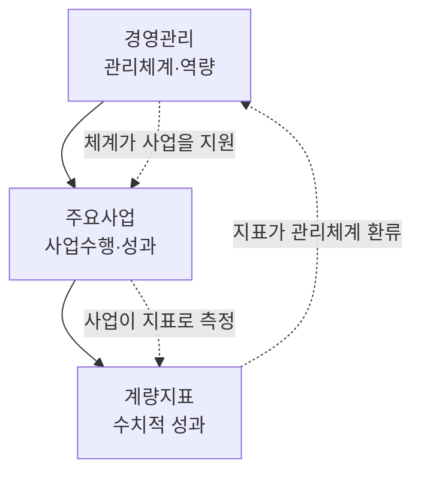

---
{"publish":true,"title":"제1장. 경영실적보고서의 구조","created":"2024-12-04","modified":"2025-12-10T21:01:25.844+09:00","tags":["#경영평가","#가이드","#보고서구조"],"cssclasses":""}
---


# 제1장. 경영실적보고서의 구조

> [!abstract] 이 장의 목표
> 경영실적보고서의 전체 구조와 각 부문별 구성을 이해하여, 보고서 작성의 큰 그림을 파악한다.

---

## 1.1 보고서 구성 체계

### 1.1.1 표준모형의 이해

경영실적보고서는 기획재정부가 제시하는 **표준모형**에 따라 작성한다. 표준모형은 모든 공공기관이 동일한 체계로 실적을 보고하도록 하여 평가의 공정성과 비교가능성을 확보하기 위한 것이다.

> [!important] 표준모형 준수의 중요성
> 표준모형을 벗어난 형식으로 작성할 경우, 평가위원이 해당 내용을 찾기 어려워 **실질적인 감점 요인**이 될 수 있다. 형식은 반드시 준수해야 한다.

### 1.1.2 장·절·항 체계

```
보고서 전체 구조
├── 제1편 경영관리
│   ├── 제1장 경영전략 및 리더십
│   ├── 제2장 사회적 가치 구현
│   │   ├── 제1절 윤리경영
│   │   ├── 제2절 안전 및 재난관리
│   │   └── ...
│   └── 제3장 조직·인사·재무관리
├── 제2편 주요사업
│   ├── 제1장 사업계획의 적정성
│   ├── 제2장 사업추진의 효율성
│   └── 제3장 사업성과
└── 제3편 계량지표
    └── 지표별 실적
```

### 1.1.3 분량 기준

| 구분       | 권장 분량      | 비고           |
| -------- | ---------- | ------------ |
| **경영관리** | 60~70페이지   | 지표 수에 따라 변동  |
| **주요사업** | 50~60페이지   | 사업 규모에 따라 변동 |
| **계량지표** | 10~15페이지   | 지표 수에 따라 변동  |
| **총 분량** | 120~130페이지 | 기관 유형별 상이    |

> [!warning] 분량 제한 확인
> 연도별 편람에서 **페이지 제한**을 명시하는 경우가 있다. 반드시 해당 연도 편람을 확인하고, 제한을 초과하지 않도록 주의한다.

### 1.1.4 페이지 레이아웃

| 항목 | 기준 |
|------|------|
| 용지 | A4 세로 |
| 여백 | 상하좌우 20mm 내외 |
| 글꼴 | 맑은고딕, 함초롬바탕 등 |
| 글자크기 | 본문 10~11pt |
| 줄간격 | 160~180% |
| 문단당 분량 | 2~3문단/페이지 (개조식 기준) |

---

## 1.2 경영관리 부문 구성

### 1.2.1 경영관리 평가체계

경영관리 부문은 기관의 **경영시스템과 관리역량**을 평가하는 영역이다. 사업 자체의 성과보다는 그 사업을 수행하기 위한 **기반과 체계**가 잘 갖춰져 있는지를 본다.

```
경영관리 평가체계 (2025년 영진위 기준, 총 45점)
├── 1. 경영전략 (6점)
│   ├── 경영비전 실행 전략 및 노력 (비계량 3점)
│   └── 공공기관 혁신 노력과 성과 (비계량 3점)
├── 2. 안전 및 책임경영 (13점)
│   ├── 일자리 및 균등한 기회 (비계량 2점 + 계량 1점)
│   ├── 윤리경영 노력과 활동 (비계량 3점)
│   ├── 안전 및 재난관리 (비계량 3점)
│   └── 상생·협력 및 지역발전 (비계량 2.5점 + 계량 1.5점)
├── 3. 재무성과관리 (6점)
│   └── 재무예산관리 (비계량 6점)
├── 4. 조직운영 및 관리 (12점)
│   ├── 조직 및 인적자원 관리 (비계량 4점)
│   ├── 노사관계 (비계량 2점)
│   ├── 보수 및 복리후생 (비계량 3점)
│   └── 총인건비 관리 (계량 3점)
└── 5. 국민소통 (8점)
    ├── 고객관리 활동 (비계량 3.5점)
    ├── 고객만족도 (계량 2점)
    ├── 공공정보 개방 및 활용 (비계량 1점 + 계량 1점)
    └── 경영정보 공시 (계량 0.5점)
```

### 1.2.2 2025년 주요 변경사항

> [!caution] 2025년 평가 주요 변경사항
>
> **1. 윤리경영 강화 (비계량 3점)**
> - 윤리경영체계 구축·운영 및 실현 노력과 성과
> - 권익위 종합청렴도 평가결과 반영
> - 성희롱·성폭력 예방 및 근절 노력 (성희롱·성폭력 대응체계 점검 결과 반영)
> - 이해충돌방지법에 따른 이해충돌방지 노력
> - 인권교육, 인권침해 구제절차 등 인권존중 노력
>
> **2. AI 활용 평가 (공공기관 혁신 노력과 성과 지표 내)**
> - AI 활용을 통한 '기관생산성'·'대국민공공서비스'·'근로자 안전' 혁신
> - AI 활용을 통한 생산성·업무효율 향상, 국민 생활 편의 증진
>
> **3. 안전 및 재난관리 강화 (비계량 3점)**
> - 산업재해 등 근로자 피해방지 및 사업장 안전관리
> - 재난관리시스템(예방·대비·대응·복구) 구축·운영
> - 개인정보 보호 및 사이버안전을 위한 정보보안 관리체계
> - 개인정보 보호수준 평가(개보위), 정보보안관리 실태평가(국정원), 정보보안감사(문체부) 결과 반영
>
> **4. 보수체계 관련 변경**
> - 통상임금 판단기준 변경 판례('24.12.)의 영향을 총인건비 관리제도 내 최소화
> - 직무중심 보수체계 개편 노력과 성과 평가

### 1.2.3 지표별 핵심 평가요소

#### 윤리경영 노력과 활동 (비계량 3점)

| 평가요소 | 핵심 내용 |
|----------|----------|
| 윤리경영체계 | 전담조직·지침(윤리헌장, 윤리강령, 행동강령) 마련·운영, 비윤리적행위 신고 및 조치결과, 반부패·청렴교육 실적 |
| 종합청렴도 | 권익위 종합청렴도 평가 결과 반영 |
| 성희롱·성폭력 예방 | 예방지침 및 매뉴얼 개정, 고충상담원 전문교육, 직원 예방교육 참여율, 고충심의위원회 구성, 사건처리절차 적절성 |
| 이해충돌방지 | 이해충돌방지법 제2조 제4호에 따른 이해충돌방지 노력 |
| 인권경영 | 인권경영 추진 조직 및 제도, 인권정책 및 확산활동, 인권경영 교육체계, 고충처리제도 운영 |

#### 안전 및 재난관리 (비계량 3점)

| 평가요소 | 핵심 내용 |
|----------|----------|
| 근로자 안전 | 산업재해 등 근로자(간접고용, 하청업체 포함) 피해방지, 사업장 안전관리, 근로환경 개선 |
| 재난관리시스템 | 예방·대비·대응·복구 시스템 구축·운영, 재난대비 계획 수립·이행 실적, 관계자 교육, 공공기관 재난관리 평가 결과(행안부) |
| 정보보안 | 개인정보 보호 및 사이버안전을 위한 정보보안 관리체계 구축·운영 |
| 외부평가 반영 | 개인정보 보호수준 평가(개보위), 정보보안관리 실태평가(국정원), 정보보안감사(문체부) |

> [!warning] 0점 부여 가능 사례
> 중대재해가 발생하였고, 해당 재해 발생 과정에서 안전법령(산업안전보건법, 공공기관안전관리지침 등)을 위반한 경우

---

## 1.3 주요사업 부문 구성

### 1.3.1 주요사업 평가체계

주요사업 부문은 기관 **고유 사업의 수행과정과 성과**를 평가하는 핵심 영역이다. 기관의 설립목적에 부합하는 사업을 얼마나 효과적으로 수행했는지를 종합적으로 평가한다.

```
주요사업 평가체계 (2025년 영진위 기준, 총 55점)
├── 1. 한국영화 제작·유통 활성화 (20점)
│   ├── 사업추진 노력 및 집행 효율성 (비계량 10점)
│   └── 목표달성도 (계량 10점)
│       ├── (1) 한국영화 기획·제작 활성화 (5점)
│       └── (2) 지원작품 영화제 초청 성과 (5점)
├── 2. 한국영화의 혁신성장기반 강화 (18점)
│   ├── 사업추진 노력 및 집행 효율성 (비계량 9점)
│   └── 목표달성도 (계량 9점)
│       ├── (1) 한국영화 국제교류 지원 성과 (4점)
│       └── (2) 영화분야 공공데이터 개방 성과 (5점)
├── 3. 영화문화의 가치확산 (12점)
│   ├── 사업추진 노력 및 집행 효율성 (비계량 6점)
│   └── 목표달성도 (계량 6점)
│       ├── (1) 문화소외계층 관람환경 개선 (4점)
│       └── (2) 지역 영화문화 향유권 강화 성과 (2점)
└── 4. 주요사업 계량지표 구성의 적정성 및 목표의 도전성 (비계량 5점)
```

### 1.3.2 영진위 주요사업 영역

> [!example] 영화진흥위원회 주요사업 영역 (2025년 편람 기준)
>
> **1. 한국영화 제작·유통 활성화** (평가범위)
> - **영화 창작·제작 지원**: 한국영화 기획개발지원, 독립예술영화 제작지원, 한국영화 투자지원
> - **영화 투자·출자**: S#1(씬원) 운영, 인디그라운드 운영, 한국영화아카데미 운영
> - **영화유통지원**: 부산촬영소 건립, 영화기술 연구 및 확산
>
> **2. 한국영화의 혁신성장기반 강화** (평가범위)
> - **영화유통지원**: 한국영화 해외수출지원, 국제교류 및 네트워크 지원, 영화영상 로케이션 인센티브 지원
> - **영화정보시스템 운영**: 영화관입장권·온라인상영관 통합전산망 운영, 온라인 불법유통 모니터링
> - **영화정책지원**: 영화정책 및 산업연구, 통계조사, 공정환경조성사업
>
> **3. 영화문화의 가치확산** (평가범위)
> - **문화소외계층 관람환경 개선**: 장애인 관람환경 개선사업, 찾아가는 영화관, 작은영화관 기획전 지원
> - **영화유통지원**: 독립예술영화 유통배급 지원, 국내 및 국제영화제 육성지원
> - **차세대 미래관객 육성**: 차세대 미래관객 육성

### 1.3.3 사업부문 서술의 4요소

주요사업 서술 시 반드시 포함해야 할 4가지 요소 (세부평가내용 기준):


| 요소 | 핵심 질문 | 서술 포인트 |
|------|----------|------------|
| **계획** | 추진계획은 구체적이고 적정하게 수립되었는가? | 환경분석, 정책연계, 목표설정 근거, 자원배분 계획 |
| **집행** | 추진계획이 적절하게 집행되었는가? | 실행계획에 따른 추진활동 실적, 조직·인력·예산운용 효율성, 환경변화·문제점 대응 |
| **성과** | 성과는 적정한 수준인가? | 정량실적, 정성효과, 목표 대비 달성률 |
| **환류** | 환류활동은 적절하게 수행되었는가? | 주기적 모니터링, 환류시스템 구축, 집행 및 성과에 대한 평가 및 개선노력 |

---

## 1.4 계량지표 부문 구성

### 1.4.1 계량지표의 이해

계량지표는 **수치로 측정 가능한 성과**를 객관적으로 평가하는 지표이다. 목표 대비 달성률로 점수가 산정되므로, 목표 설정의 적정성과 실적의 정확성이 매우 중요하다.

> [!note] 계량지표 vs 비계량지표
> - **계량지표**: 수치로 측정, 목표 대비 달성률로 평가
> - **비계량지표**: 서술로 평가, 평가위원 판단으로 등급 부여

### 1.4.2 계량지표 구성요소

```
계량지표 구성
├── 공통지표
│   ├── 재무예산 관련 (부채비율, 총수입 등)
│   ├── 조직인사 관련 (정원관리, 인건비 등)
│   └── 정부권장 관련 (일자리창출, 균형인사 등)
└── 기관고유지표
    ├── 사업성과 지표
    └── 정책목표 지표
```

### 1.4.3 지표 정의서 구조

각 계량지표는 **지표 정의서**에 따라 측정된다. 정의서의 구조를 이해해야 정확한 실적 산출이 가능하다.

| 항목 | 내용 |
|------|------|
| 지표명 | 지표의 공식 명칭 |
| 지표정의 | 지표가 측정하는 내용 |
| 산식 | 실적 계산 공식 |
| 측정단위 | %, 건, 억원 등 |
| 가중치 | 지표별 배점 |
| 목표설정방법 | 추세치, 목표부여, 협의 등 |
| 적용대상 | 해당 기관 유형 |

### 1.4.4 계량지표 서술 구조

```
■ 지표명: ○○○○ ────────────────────────────

 ○ (지표정의) 본 지표는 ~를 측정하는 지표로, ~을 목적으로 함
    - 산식: (A/B) × 100
    - 측정단위: %

 ○ (목표설정) '24년 목표를 ○○%로 설정
    - (설정근거) 최근 3개년 추세(○→○→○%) 및 환경변화 고려
    - (도전성) 전년 실적(○%) 대비 ○%p 상향 설정

 ○ (추진노력) 목표 달성을 위한 주요 추진사항
    - ~
    - ~

 ○ (실적현황) '24년 실적 ○○% 달성(목표 대비 ○○%)
    - A값: ○○건 (전년 ○○건 대비 +○%)
    - B값: ○○건
    - 달성률: ○○% (목표 ○○% 대비 +○%p)
```

---

## 1.5 부문 간 연계성

### 1.5.1 세 부문의 관계

경영관리, 주요사업, 계량지표는 서로 **독립적이면서도 연계**되어 있다. 일관성 있는 스토리라인이 중요하다.



### 1.5.2 일관성 유지 포인트

> [!tip] 부문 간 일관성 체크포인트
> 
> **1. 전략-사업-지표 연계**
> - 경영전략에서 제시한 목표가 주요사업으로 구현되고
> - 그 성과가 계량지표로 측정되어야 함
> 
> **2. 수치의 일관성**
> - 경영관리에서 언급한 수치와 주요사업의 수치가 일치해야 함
> - 계량지표 실적과 주요사업 실적의 정합성 확인
> 
> **3. 용어의 통일**
> - 동일한 사업·제도를 지칭하는 용어는 보고서 전체에서 통일

---

## 핵심 정리

> [!summary] 제1장 핵심 정리
>
> **1. 보고서 구성 (총 100점)**
> - 표준모형(정책집행·민간지원)에 따른 장·절·항 체계 준수
> - 경영관리 45점 (비계량 36점 + 계량 9점)
> - 주요사업 55점 (비계량 30점 + 계량 25점)
>
> **2. 경영관리 부문 (5개 범주)**
> - 경영전략 (6점), 안전및책임경영 (13점), 재무성과관리 (6점)
> - 조직운영및관리 (12점), 국민소통 (8점)
> - 2025년: AI 활용 평가 신설, 정보보안 강화, 보수체계 개편 평가
>
> **3. 주요사업 부문 (4개 범주)**
> - 계획 → 집행 → 성과 → 환류의 흐름
> - 한국영화 제작·유통 활성화, 혁신성장기반 강화, 영화문화 가치확산
> - 계량지표 구성의 적정성 및 목표의 도전성 (5점)
>
> **4. 계량지표 평가방식**
> - 목표부여(편차): 최고목표(기준치+1.5×표준편차), 최저목표(기준치-2×표준편차)
> - 기준치: 전년도 실적과 직전 3개년 평균 실적 중 높은 값
>
> **5. 부문 간 연계**
> - 전략-사업-지표의 일관된 스토리라인
> - 수치와 용어의 정합성 유지

---

## 다음 장 안내

[[25년 경평/1_공통 자료/02_작성가이드/02_작성_전_준비사항\|제2장. 작성 전 준비사항]]에서는 본격적인 보고서 작성에 앞서 준비해야 할 사항들을 다룬다.
- 평가편람 분석 방법
- 전년도 보고서 분석
- 자료 수집 체계 구축
- 작성 일정 수립
