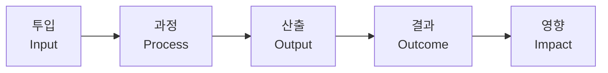

---
{"publish":true,"title":"제3장. 분석기법 활용","created":"2024-12-05","modified":"2025-12-05T13:55:16.508+09:00","tags":["#경영평가","#가이드","#분석기법"],"cssclasses":""}
---


# 제3장. 분석기법 활용

> [!abstract] 이 장의 목표
> 경영실적보고서 작성에 필요한 다양한 분석 기법을 습득하여, 논리적이고 설득력 있는 보고서를 작성할 수 있는 역량을 확보한다.

---

## 3.1 환경분석 기법

### 3.1.1 환경분석의 목적

환경분석은 **사업 추진의 당위성**과 **전략 수립의 합리성**을 입증하기 위한 핵심 도구이다. 평가위원에게 "왜 이 사업을 추진했는가"에 대한 명확한 근거를 제시한다.


### 3.1.2 SWOT 분석

SWOT 분석은 내부역량(강점/약점)과 외부환경(기회/위협)을 종합적으로 분석하는 기법이다.

| 구분 | 내부 요인 | 외부 요인 |
|------|----------|----------|
| 긍정적 | **S**trengths (강점) | **O**pportunities (기회) |
| 부정적 | **W**eaknesses (약점) | **T**hreats (위협) |

> [!example] 영진위 SWOT 분석 예시
>
> | 강점 (S) | 약점 (W) |
> |----------|----------|
> | • 영화산업 전문성 보유 | • 제한된 예산 규모 |
> | • 통합전산망 인프라 구축 | • 급변하는 미디어 환경 대응 한계 |
> | • 영화인 네트워크 확보 | • 조직 규모 대비 사업 범위 과다 |
>
> | 기회 (O) | 위협 (T) |
> |----------|----------|
> | • K-콘텐츠 글로벌 위상 강화 | • OTT 플랫폼 확산에 따른 극장 위축 |
> | • 정부 문화산업 지원 확대 | • 글로벌 경쟁 심화 |
> | • AI 등 신기술 활용 가능성 | • 영화산업 투자 위축 |

#### SWOT 교차분석 (SO/ST/WO/WT 전략)

| 전략 | 설명 | 예시 |
|------|------|------|
| **SO 전략** | 강점으로 기회 활용 | 전문성을 활용한 K-영화 해외진출 지원 강화 |
| **ST 전략** | 강점으로 위협 대응 | 통합전산망 기반 온라인 유통 데이터 분석 |
| **WO 전략** | 약점 보완하여 기회 활용 | 민간 협력을 통한 사업 역량 확대 |
| **WT 전략** | 약점·위협 최소화 | 선택과 집중을 통한 핵심사업 효율화 |

### 3.1.3 PEST 분석

PEST 분석은 거시환경 요인을 체계적으로 분석하는 기법이다.

| 요인 | 분석 내용 | 영진위 적용 예시 |
|------|----------|-----------------|
| **P**olitical (정치적) | 정부 정책, 법규, 규제 | 문화정책 방향, 영화법 개정, 국정과제 |
| **E**conomic (경제적) | 경기, 산업 동향, 투자 | 영화산업 투자 규모, OTT 시장 성장 |
| **S**ocial (사회적) | 인구, 트렌드, 문화 | 관객 소비 패턴 변화, MZ세대 선호 |
| **T**echnological (기술적) | 기술 발전, 혁신 | AI 활용, 버추얼 프로덕션, 실감콘텐츠 |

### 3.1.4 환경분석 서술 패턴

> [!tip] 환경분석 서술 구조
>
> ```
> ■ 사업환경 분석
>
>  ○ (외부환경) 환경 변화 및 시사점
>     - (정책환경) 정부 정책 방향 및 국정과제 연계
>     - (산업환경) 영화산업 동향 및 전망
>     - (기술환경) 기술 변화 및 활용 가능성
>
>  ○ (내부역량) 기관 역량 및 한계
>     - (강점) 활용 가능한 핵심 역량
>     - (약점) 보완이 필요한 영역
>
>  ○ (전략방향) 환경분석에 기반한 추진전략
>     - 환경변화 대응 방향
>     - 중점 추진과제 도출
> ```

---

## 3.2 성과분석 기법

### 3.2.1 성과분석의 기본 구조

성과분석은 **투입-과정-산출-결과**의 논리모형(Logic Model)에 따라 체계적으로 수행한다.



| 단계 | 정의 | 측정 지표 예시 |
|------|------|---------------|
| **투입** | 사업에 투입된 자원 | 예산, 인력, 시간 |
| **과정** | 사업 수행 활동 | 심사 건수, 교육 횟수 |
| **산출** | 직접적 결과물 | 지원 편수, 참가자 수 |
| **결과** | 산출의 효과 | 관객 수, 수출액 |
| **영향** | 장기적 파급효과 | 산업 성장, 고용 창출 |

### 3.2.2 정량적 성과분석

#### 목표 대비 달성률 분석

| 지표 | 목표 | 실적 | 달성률 | 평가 |
|------|------|------|--------|------|
| 제작지원 편수 | 50편 | 55편 | 110% | 초과달성 |
| 영화제 초청 | 30건 | 28건 | 93% | 미달 |

#### 전년 대비 증감 분석

| 지표 | 2023년 | 2024년 | 증감 | 증감률 |
|------|--------|--------|------|--------|
| 온라인 관람건수 | 1,200만 | 1,450만 | +250만 | +20.8% |
| 해외수출 계약 | 85건 | 102건 | +17건 | +20.0% |

#### 추세 분석 (3~5개년)

```
연도별 추세 분석 예시

지표: 한국영화 기획·제작 활성화 성과

| 연도 | 실적 | 전년비 | 비고 |
|------|------|--------|------|
| 2020 | 8.2% | - | 코로나19 영향 |
| 2021 | 9.5% | +1.3%p | 회복세 |
| 2022 | 11.2% | +1.7%p | 성장 |
| 2023 | 12.8% | +1.6%p | 성장 지속 |
| 2024 | 14.5% | +1.7%p | 목표 초과 |

→ 5개년 연평균 성장률: 15.3%
```

### 3.2.3 정성적 성과분석

정성적 성과는 **구체적 사례**와 **객관적 평가**를 통해 서술한다.

> [!important] 정성적 성과 서술 원칙
>
> **1. 구체성**: 추상적 표현 대신 구체적 사례 제시
> - ❌ "영화산업 발전에 기여"
> - ✅ "지원작 '○○○' 칸영화제 경쟁부문 진출, 관객 300만 돌파"
>
> **2. 객관성**: 주관적 평가 대신 외부 인정 실적
> - ❌ "우수한 성과를 거둠"
> - ✅ "문체부 우수사업 선정, 국정감사 우수사례 보고"
>
> **3. 인과성**: 기관 노력과 성과의 연결고리 명시
> - ❌ "한국영화 해외진출 증가"
> - ✅ "마켓 참가지원(120편) → 해외판매 계약 102건 체결"

### 3.2.4 성과분석 서술 패턴

> [!example] 성과분석 서술 예시
>
> ```
> ■ 사업성과
>
>  ○ (정량적 성과) 목표 대비 실적
>     - (목표) '24년 목표 ○○건 설정
>     - (실적) ○○건 달성 (목표 대비 ○○%)
>     - (추세) 최근 3년 연평균 ○○% 성장
>
>  ○ (정성적 성과) 주요 성과 사례
>     - (사례1) ○○○ 사업 추진으로 ○○ 효과 창출
>     - (사례2) ○○ 지원작 국제영화제 ○○ 수상
>
>  ○ (외부평가) 객관적 성과 인정
>     - 문화체육관광부 우수기관 선정 ('24.○월)
>     - 언론보도 ○○건 (긍정 ○○%, 부정 ○○%)
> ```

---

## 3.3 비교분석 기법

### 3.3.1 비교분석의 유형

| 유형 | 비교 대상 | 활용 목적 |
|------|----------|----------|
| **시계열 비교** | 과거 실적 | 성장·개선 추이 입증 |
| **목표 비교** | 설정 목표 | 목표 달성도 평가 |
| **동종기관 비교** | 유사 기관 | 상대적 우수성 입증 |
| **벤치마킹** | 우수 사례 | 개선 노력 및 성과 제시 |

### 3.3.2 시계열 비교분석

최근 3~5개년 데이터를 활용하여 **개선 추이**를 입증한다.

```
시계열 비교 예시: 청렴도 변화

| 연도 | 종합청렴도 | 외부청렴도 | 내부청렴도 | 등급 |
|------|-----------|-----------|-----------|------|
| 2021 | 7.82 | 8.12 | 7.45 | 3등급 |
| 2022 | 8.15 | 8.35 | 7.89 | 2등급 |
| 2023 | 8.42 | 8.58 | 8.21 | 2등급 |
| 2024 | 8.68 | 8.75 | 8.56 | 1등급 |

→ 4년간 종합청렴도 0.86점 상승, 3등급→1등급 도약
```

### 3.3.3 동종기관 비교분석

유사 기관과의 비교를 통해 **상대적 우수성**을 입증한다.

> [!tip] 동종기관 비교 시 유의사항
>
> **1. 비교 가능성 확보**
> - 기관 규모, 사업 특성이 유사한 기관 선정
> - 동일한 산출 기준 적용
>
> **2. 객관적 데이터 활용**
> - 공식 통계, 공시 자료 활용
> - 알리오 공시 데이터 등 검증 가능한 자료
>
> **3. 맥락 설명**
> - 단순 수치 비교가 아닌 배경 설명
> - 차이 발생 원인 분석

| 기관 | 인력(명) | 예산(억) | 지원 건수 | 건당 비용 |
|------|---------|---------|----------|----------|
| 영진위 | 150 | 1,200 | 850 | 1.4억 |
| A기관 | 180 | 1,500 | 720 | 2.1억 |
| B기관 | 120 | 900 | 550 | 1.6억 |

→ 영진위: 인력 대비 지원 건수 최다, 건당 비용 최저 (효율성 우수)

### 3.3.4 벤치마킹 분석

우수 사례를 분석하고 도입한 노력과 성과를 제시한다.

```
벤치마킹 분석 구조

1. 벤치마킹 대상 선정
   └── 선정 기준 및 대상 기관

2. 우수사례 분석
   ├── 대상 기관의 우수 요인
   └── 자기관과의 차이점

3. 도입 및 적용
   ├── 벤치마킹 내용
   └── 자기관 적용 방안

4. 적용 성과
   └── 도입 후 개선 효과
```

---

## 3.4 정책연계 분석

### 3.4.1 정책연계의 중요성

경영평가에서 **정부 정책과의 연계성**은 사업의 정당성과 기여도를 입증하는 핵심 요소이다.

> [!important] 정책연계가 중요한 이유
>
> 1. **정당성 확보**: 사업 추진의 명분과 근거 제시
> 2. **성과 인정**: 정책 목표 달성 기여도 평가
> 3. **평가 가점**: 국정과제 이행 실적 가산점 반영

### 3.4.2 연계 대상 정책

```
정책연계 대상 체계

├── 국정과제
│   ├── 문화강국 실현
│   └── 한류 확산 및 글로벌 진출
├── 정부 정책
│   ├── 문화비전 2030
│   ├── 콘텐츠산업 진흥계획
│   └── 공공기관 혁신방안
├── 부처 정책
│   ├── 문체부 업무계획
│   ├── 영화진흥 기본계획
│   └── 영화발전 중장기 계획
└── 기관 정책
    ├── 중장기 경영전략
    └── 연도별 경영목표
```

### 3.4.3 정책-사업 연계표 작성

| 정책 | 정책 목표 | 연계 사업 | 기여 내용 |
|------|----------|----------|----------|
| 국정과제 "문화강국" | K-콘텐츠 경쟁력 강화 | 영화제작지원 | 한국영화 다양성 확보 |
| 문화비전 2030 | 문화 향유 기회 확대 | 작은영화관 지원 | 영화접근성 사각지대 해소 |
| 공공기관 혁신 | AI 활용 혁신 | 통합전산망 고도화 | 영화데이터 AI 분석 |
| 탄소중립 정책 | 친환경 경영 | 그린오피스 운영 | 에너지 절감, 친환경 조달 |

### 3.4.4 정책연계 서술 패턴

> [!example] 정책연계 서술 예시
>
> ```
> ■ 정책 연계
>
>  ○ (국정과제) "문화강국 도약" 과제 이행
>     - (연계내용) K-콘텐츠 글로벌 경쟁력 강화
>     - (추진사업) 한국영화 해외진출 지원 확대
>     - (기여성과) 해외수출 ○○억 원 (전년비 +○○%)
>
>  ○ (정부정책) 공공기관 혁신방안 이행
>     - (연계내용) AI 활용 업무혁신
>     - (추진사업) 영화데이터 AI 분석 시스템 구축
>     - (기여성과) 정책분석 소요시간 ○○% 단축
>
>  ○ (부처정책) 영화진흥 기본계획 연계
>     - (연계내용) 영화문화 향유기회 확대
>     - (추진사업) 작은영화관·찾아가는 영화관 운영
>     - (기여성과) 문화소외지역 ○○만 명 관람
> ```

### 3.4.5 정책 환경변화 대응 분석

정책 환경 변화에 대한 **기관의 선제적 대응**을 분석하여 서술한다.

| 정책 변화 | 대응 전략 | 추진 내용 | 성과 |
|----------|----------|----------|------|
| OTT 시장 확대 | 온라인 유통 지원 강화 | 온라인 배급 지원사업 신설 | 지원작 OTT 공개 ○○편 |
| ESG 경영 강화 | 친환경 영화제작 지원 | 그린 프로덕션 가이드 개발 | ○○편 적용 |
| AI 기술 발전 | AI 활용 서비스 개발 | 영화추천 AI 시스템 구축 | 이용자 ○○만 명 |

---

## 3.5 분석기법 종합 활용

### 3.5.1 분석기법 선택 가이드

| 서술 목적 | 적합한 분석기법 |
|----------|----------------|
| 사업 추진 배경 설명 | 환경분석 (SWOT, PEST) |
| 목표 달성 여부 입증 | 성과분석 (목표-실적 비교) |
| 성장·개선 추이 제시 | 비교분석 (시계열) |
| 효율성·우수성 입증 | 비교분석 (동종기관) |
| 정책 기여도 설명 | 정책연계 분석 |

### 3.5.2 지표별 분석기법 적용

| 지표 유형 | 주요 분석기법 | 활용 예시 |
|----------|-------------|----------|
| 경영전략 | 환경분석 + 정책연계 | SWOT 기반 전략수립, 국정과제 연계 |
| 사회적 가치 | 비교분석 + 성과분석 | 청렴도 추이, 안전사고 감소 |
| 주요사업 | 성과분석 + 정책연계 | 목표달성률, 정책기여도 |
| 계량지표 | 성과분석 + 비교분석 | 목표-실적, 전년비 증감 |

---

## 핵심 정리

> [!summary] 제3장 핵심 정리
>
> **1. 환경분석 기법**
> - SWOT: 내부역량(S/W) + 외부환경(O/T) 종합 분석
> - PEST: 정치·경제·사회·기술 거시환경 분석
> - 교차분석으로 전략방향 도출 (SO/ST/WO/WT)
>
> **2. 성과분석 기법**
> - 논리모형: 투입→과정→산출→결과→영향
> - 정량분석: 목표달성률, 전년비, 추세분석
> - 정성분석: 구체성·객관성·인과성 원칙 준수
>
> **3. 비교분석 기법**
> - 시계열: 3~5개년 추이로 개선 입증
> - 동종기관: 상대적 우수성 입증
> - 벤치마킹: 우수사례 도입 노력과 성과
>
> **4. 정책연계 분석**
> - 국정과제 → 정부정책 → 부처정책 → 기관정책 연계
> - 정책-사업-성과 연결고리 명확화
> - 정책 환경변화에 대한 선제적 대응 서술

---

## 다음 장 안내

[[25년 경평/1_공통 자료/02_작성가이드/04_서술_기법\|제4장. 서술 기법]]에서는 경영실적보고서의 효과적인 서술 방법을 다룬다.
- 개조식 작성 원칙
- 문장 작성 기법
- 수치 표현 기법
- 문단 시작 패턴
- 피해야 할 표현
