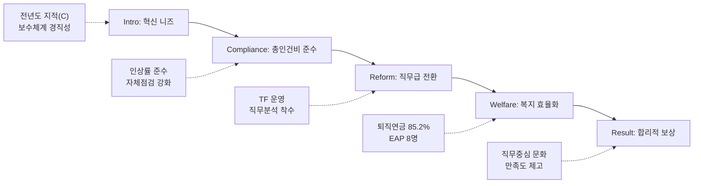

---
{"publish":true,"permalink":"/경영평가/1-10/5_지표작성방안","title":"5_지표 작성 방안","created":"2025-12-09","modified":"2025-12-14T13:16:26.671+09:00","tags":["#경영평가","#보수","#복리후생","#비계량","#작성방안","#지표_1-10"],"cssclasses":""}
---

# [1-10 보수 및 복리후생] 세부평가내용 작성 방안

> [!abstract] 문서 개요
> 본 문서는 '1.10 보수 및 복리후생' 지표의 2025년도 경영평가보고서 작성을 위한 논리적 흐름(Storyline)과 문단별 세부 작성 방안을 제안합니다.
> 
> **핵심 목표**: [[25년 경평/2_지표별 자료/1-10_보수_및_복리후생/3_전년도_지적사항_및_개선실적\|전년도 지적사항(C 등급)]]을 극복하고, **'직무 중심 보수체계로의 전환(Job-based)'**과 **'복리후생 효율화(Efficiency)'**를 통해 목표 등급(B등급 이상)을 달성하는 데 중점을 두었습니다.
>
> **핵심 메시지**: "직무급 지급기준 개정(보직자 직무중심 단일화)과 노사공동 TF 운영으로 직무중심 보수체계 전환 기반을 마련하고, 퇴직연금 적립비율 85.2% 달성(+10.7%p) 및 EAP 심리상담 프로그램 운영으로 재정 건전성과 직원 복지를 동시에 강화"

---

## 1. 문단 구성 요약

| 세부평가내용 | 문단 | 핵심 내용 |
|-------------|------|----------|
| **① 관련 규정 준수** | 1-1 | 예산운용지침 및 인건비 관리 철저 |
|  | 1-2 | 투명한 복리후생비 집행 |
| **② 보수체계 합리화** | 2-1 | 직무 중심 보수체계 개편 추진 **(핵심 성과)** |
|  | 2-2 | 성과 중심의 합리적 보상 |
| **③ 복리후생 제도 개선** | 3-1 | 수요자 맞춤형 복리후생 운영 |
|  | 3-2 | 일·가정 양립 지원 강화 |

---

## 2. Storyline 구성안 비교

### Option A: 평가요소 순차형 (Sequential)

| 구분 | 내용 |
|------|------|
| **구조** | 관련 규정 준수 → 보수체계 합리화 → 복리후생 개선 |
| **장점** | 편람의 3개 평가요소를 빠짐없이 순서대로 다루기에 용이 |
| **단점** | 단순 나열식으로 보여 기관의 '혁신 의지'가 약해 보일 수 있음 |
| **적합도** | ★★☆ |

### Option B: 직무급 도입 중심형 (Innovation) ⭐추천

| 구분 | 내용 |
|------|------|
| **구조** | 직무분석 → 보수체계 개편(직무급) → 성과 연동 → 복리후생 효율화 |
| **장점** | 정부 권장사항인 '직무급 도입' 노력을 최우선으로 강조 |
| **단점** | 실제 도입이 완료되지 않았을 경우 성과 부풀리기로 비칠 우려 |
| **적합도** | ★★★ |

### Option C: 효율성 및 합리화형 (Efficiency)

| 구분 | 내용 |
|------|------|
| **구조** | 재정 건전성 확보(인건비 관리) → 보수체계 합리화(직무급) → 복지제도 내실화 |
| **장점** | 기금 위기 등 긴축 경영 기조에 맞는 '효율성' 강조 |
| **단점** | 직원 사기 저하 등 부정적 뉘앙스를 최소화해야 함 |
| **적합도** | ★★★ |

---

## 3. 추천 Storyline: 직무 중심 혁신 및 효율적 관리

> [!tip] 추천 구조
> **"정부 혁신 기조에 맞춰 직무 중심 보수체계(Job-based) 개편을 착실히 준비하고, 철저한 규정 준수와 효율화(Efficiency)로 재정 건전성을 확보"**하는 구조
>
> **Core Message**: "직무급 지급기준 개정(보직자 직무중심 단일화)과 노사공동 직무분석분과(8명) 운영으로 2026년 전직원 직무급 도입 기반 마련, 퇴직연금 적립비율 85.2% 달성으로 재정건전성 확보"

### 전체 흐름

---

## 4. 문단별 작성 방안

### 세부평가내용① 관련 규정 준수

#### 문단 1-1: 예산운용지침 및 인건비 관리 철저

| 항목 | 내용 |
|------|------|
| **Core Message** | 정부 예산운용지침을 100% 준수하고 총인건비 인상률 관리 |
| **주요 근거** | 인건비 집행 내역, 자체점검 결과, 외부점검단 확인 |
| **담당 부서** | 인사총무팀, 재무회계팀 |

| 구분 | 실적 | 성과 |
|------|------|------|
| 총인건비 인상률 | 정부 지침 범위 내 편성·집행 | 가이드라인 100% 준수 |
| 규정 준수 | 예산운용지침·혁신지침 이행 | 위반사항 0건 |
| 자체점검 | 체크리스트 운영 및 외부점검단 확인 | 지적사항 0건 |
| 성과급 지급 | 경영평가 등급 연동 지급 | 적정 집행 |

> [!example] 추천 스토리라인
> **"정부 가이드라인 준수 → 자체점검 체계 운영 → 외부점검 완료 → 위반사항 ZERO"**

#### 문단 1-2: 투명한 복리후생비 집행

| 항목 | 내용 |
|------|------|
| **Core Message** | 과도한 복리후생 항목을 점검하고 국민 눈높이에 맞는 제도 운영 |
| **주요 근거** | 복리후생비 집행 내역, 자체점검 체크리스트 |
| **담당 부서** | 인사총무팀 |

| 구분 | 실적 | 성과 |
|------|------|------|
| 과도한 항목 | 자체점검 체크리스트 이행 | 해당 항목 없음 |
| 고용세습 금지 | 친인척 채용 제한 | 규정 준수 |
| 복무행태 | 외부점검단 확인 | 양호 |
| 투명 공개 | 복리후생비 세부 집행 내역 공개 | 국민 눈높이 충족 |
| 가족수당 | 전수조사 76건 실시 | 초과지급·환수 0건 |

> [!example] 추천 스토리라인
> **"복리후생 제도 점검 → 과도한 항목 없음 확인 → 가족수당 전수조사 → 투명 운영"**

---

### 세부평가내용② 보수체계 합리화

#### 문단 2-1: 직무 중심 보수체계 개편 추진 (핵심 성과)

| 항목 | 내용 |
|------|------|
| **Core Message** | 보수체계 개선 TF 운영 및 직무분석을 통해 직무급 도입 기반 마련 |
| **주요 근거** | TF 운영 실적, 직무급 지급기준 개정, 직무분석분과 운영 |
| **담당 부서** | 인사총무팀 |

| 구분 | 실적 | 성과 |
|------|------|------|
| 직무급 지급기준 개정 | 보직자 직무중심 단일화 (본부장 100만원, 팀장 70만원) | 직급별 차등 폐지 |
| 노사공동 TF | 직무분석분과 구성 (노측 4명 + 사측 4명 = 8명) | 12월 논의 3회 진행 |
| 추진 경과 | 1분기 TF 직제 심의 → 2분기 방향성 논의 → 3분기 분과 구성 → 4분기 직무분석 착수 | 단계적 이행 |
| 통상임금 판례 대응 | '24.12월 대법원 판례 영향 분석 완료 | 보수체계 개편으로 영향 최소화 |
| 2026년 목표 | 전직원 대상 직무급 확대 | 직무중심 보수체계 정착 |

> [!example] 추천 스토리라인
> **"보수체계 경직성 지적 → TF 구성 및 직무급 기준 개정 → 노사공동 직무분석분과 운영 → 2026년 직무급 전면 도입 기반 마련"**

#### 문단 2-2: 성과 중심의 합리적 보상

| 항목 | 내용 |
|------|------|
| **Core Message** | 연공서열을 탈피하고 성과와 역량에 따른 차등 보상 강화 |
| **주요 근거** | 성과급 차등폭, 승급제도 개선안, 직무급 지급기준 |
| **담당 부서** | 인사총무팀 |

| 구분 | 실적 | 성과 |
|------|------|------|
| 성과연봉 | 경영평가 등급 연동 차등 지급 | 성과 중심 보상 |
| 승급제도 | 운영지침 개정 (포인트 합리화) | 심사 강화 |
| 보직자 직무급 | 직급별 차등 폐지 → 직무중심 단일 기준 | 연공서열 탈피 |
| 초과근로 | 보직자(팀장 이상) 초과근로수당 미지급 | 효율적 인건비 관리 |

> [!example] 추천 스토리라인
> **"연공서열 탈피 필요 → 직무급 지급기준 개정 → 성과연봉 차등 → 성과 중심 보상 문화"**

---

### 세부평가내용③ 복리후생 제도 개선

#### 문단 3-1: 수요자 맞춤형 복리후생 운영

| 항목 | 내용 |
|------|------|
| **Core Message** | 퇴직연금 재정건전성 확보 및 직원 심리건강 지원 강화 |
| **주요 근거** | 퇴직연금 적립비율, EAP 프로그램 운영 실적 |
| **담당 부서** | 인사총무팀 |

| 구분 | 실적 | 성과 |
|------|------|------|
| 퇴직연금 적립비율 | 74.5% → **85.2%** (+10.7%p) | 당기 목표(83.1%) 초과달성 |
| 추가납입 | 6월 500백만원 (6,058→6,558백만원) | 부족비율 25.5%→14.8% 개선 |
| EAP 심리상담 | 마주심리상담소 위탁, 8명(28회기) 이용 | 직원 심리건강 지원 |
| 보건상담 | 대한산업보건협회 위탁, 41명 참여 | 월 1회 간호사·분기 1회 의사 방문 |
| 건강검진 | 전 직원 연 1회 실시 | 예방접종 지원 |

> [!example] 추천 스토리라인
> **"퇴직연금 적립부족 해소 → EAP 심리상담 확대 → 보건상담 강화 → 재정건전성+직원건강 동시 확보"**

#### 문단 3-2: 일·가정 양립 지원 강화

| 항목 | 내용 |
|------|------|
| **Core Message** | 유연근무 확대 및 가족친화 제도로 워라밸 실현 |
| **주요 근거** | 유연근무 활용 통계, 육아휴직 실적, 가족친화인증 |
| **담당 부서** | 인사총무팀 |

| 구분 | 실적 | 성과 |
|------|------|------|
| 유연근무 | 월별 101명 + 일별 69명 + 스마트워크 17명 = **187명** | 시간대 4개 확대 |
| 육아휴직 | **10명** (남성 2명 포함) | 모성보호 강화 |
| 육아시간 | 6명 활용 | 임신기·육아기 근로시간 단축 시행 |
| 가족돌봄휴가 | 25명 사용 | 상시 운영 |
| 출산전후휴가 | 대위신청 10건, 지원금 45백만원 수령 | 직원 행정부담 경감 |
| 가족친화인증 | 11년 연속 유지 | 여성가족부 인증 |

> [!example] 추천 스토리라인
> **"유연근무 187명 확대 → 육아휴직 10명(남성 2명) → 가족친화인증 11년 → 워라밸 실현"**

---

## 5. 차별화 포인트

### 가. 편람 대응 전략

| 편람 요구사항 | 대응 문단 | 핵심 내용 | 정량 실적 |
|-------------|----------|----------|----------|
| 예산운용지침 준수 | 1-1 | 총인건비 인상률 가이드라인 준수 | 위반 0건 |
| 복리후생비 투명성 | 1-2 | 과도한 항목 점검, 가족수당 전수조사 | 76건 점검, 환수 0건 |
| 통상임금 판례 대응 | 2-1 | 영향 분석 및 보수체계 개편 | 영향 최소화 |
| 직무급 도입 | 2-1 | TF 운영, 직무분석분과 구성, 기준 개정 | 8명 분과, 3회 논의 |
| 성과 중심 보상 | 2-2 | 성과연봉 차등, 승급제도 개선 | 직급 차등 폐지 |
| 퇴직연금 관리 | 3-1 | 적립비율 개선 | 74.5%→85.2% |
| 일·가정 양립 | 3-2 | 유연근무 확대, 모성보호 강화 | 187명, 10명 |

### 나. 전년도 C등급 개선 전략

| 지적사항 | 개선 방안 | 핵심 성과 |
|---------|----------|----------|
| 보수체계 경직성 | **직무급 지급기준 개정** | 보직자 직무중심 단일화 |
| 직무급 도입 지연 | **노사공동 직무분석분과** 운영 | 8명 구성, 12월 3회 논의 |
| 복리후생 재정 부담 | **퇴직연금 적립비율** 개선 | 74.5%→85.2% (+10.7%p) |

### 다. 기관 특수성 강조

| 영역 | 기존 (연공/일률) | 혁신 (직무/맞춤) |
|------|----------------|----------------|
| 보수 | 호봉 중심, 연공서열 | **직무가치, 성과 중심** |
| 복지 | 일률적 제공 | **EAP 심리상담, 생애주기별** |
| 관리 | 단순 집행 | **퇴직연금 85.2%, 데이터 기반** |

---

## 6. 핵심 정량 데이터 Quick Reference

### 가. 규정 준수

| 지표 | 실적 | 비고 |
|------|:----:|------|
| 총인건비 인상률 | 정부 지침 내 | 예산운용지침 준수 |
| 위반사항 | **0건** | 자체점검 + 외부점검 |
| 가족수당 전수조사 | **76건** | 초과지급·환수 0건 |

### 나. 보수체계 합리화

| 지표 | 실적 | 비고 |
|------|:----:|------|
| 직무급 지급기준 개정 | **완료** | 보직자 직무중심 단일화 |
| 노사공동 TF | **8명** | 노측 4 + 사측 4 |
| 직무분석분과 논의 | **3회** | 12월 진행 |
| 본부장 직무급 | **100만원** | 직급 차등 폐지 |
| 팀장 직무급 | **70만원** | 직급 차등 폐지 |

### 다. 퇴직연금

| 지표 | 2023년 | 2024년 | 개선폭 |
|------|:------:|:------:|:------:|
| 적립비율 | 74.5% | **85.2%** | +10.7%p |
| 부족비율 | 25.5% | **14.8%** | -10.7%p |
| 당기 목표 | 78.4% | 83.1% | **초과달성** |
| 추가납입 | - | 500백만원 | 6월 적립 |

### 라. 직원 복지

| 지표 | 실적 | 비고 |
|------|:----:|------|
| EAP 심리상담 | **8명(28회기)** | 마주심리상담소 |
| 보건상담 참여 | **41명** | 월 1회 간호사 |
| 건강검진 | 전 직원 | 연 1회 |

### 마. 일·가정 양립

| 지표 | 실적 | 비고 |
|------|:----:|------|
| 유연근무 합계 | **187명** | 월별 101 + 일별 69 + 스마트 17 |
| 육아휴직 | **10명** | 남성 2명 포함 |
| 육아시간 | **6명** | 근로시간 단축 |
| 가족돌봄휴가 | **25명** | 상시 운영 |
| 출산전후휴가 대위신청 | **10건** | 45백만원 수령 |
| 가족친화인증 | **11년** | 여성가족부 인증 |

---

## 7. 작성 시 유의사항

### 가. 편람 키워드 체크리스트

> [!warning] 필수 확인
> - [ ] 총인건비 인상률 준수 여부 (절대적 감점 요인)
> - [ ] 통상임금 판례 대응 노력
> - [ ] 직무급 도입·확대 계획 수립
> - [ ] 퇴직연금 적립비율 개선
> - [ ] 과도한 복리후생 항목 없음

### 나. 세부평가요소별 비중

| 세부평가요소 | 배분 비중 | 주요 부서 |
|-------------|----------|----------|
| ① 관련 규정 준수 | 40% | 인사총무, 재무회계 |
| ② 보수체계 합리화 | 30% | 인사총무 |
| ③ 복리후생 개선 | 30% | 인사총무 |

### 다. 증빙자료 연계

| 문단 | 핵심 증빙 |
|------|----------|
| 규정준수 | 총인건비 산출 내역서, 외부점검단 점검 결과 |
| 보수체계 | 직무급 지급기준 개정 자료, TF 운영 회의록 |
| 복리후생 | 퇴직연금 적립비율 개선 자료, EAP 운영 실적 |

---

## 8. 관련 자료

| 구분 | 문서명 | 비고 |
|------|--------|------|
| 편람 분석 | [[25년 경평/2_지표별 자료/1-10_보수_및_복리후생/2_편람_내용_분석]] | 세부평가 요소별 가이드 |
| 지적사항 | [[25년 경평/2_지표별 자료/1-10_보수_및_복리후생/3_전년도_지적사항_및_개선실적]] | C등급 원인 및 개선방향 |
| 부서실적 | [[25년 경평/2_지표별 자료/1-10_보수_및_복리후생/부서별 실적 분석/인사총무팀 실적 분석]] | 정량 데이터 출처 |
| 공통 자료 | [[01_편람_및_지침]] | 작성 가이드 |

---

*작성일: 2025-12-09*
*최종수정: 2025-12-14*
*검증상태: 부서실적 데이터 반영 완료*
