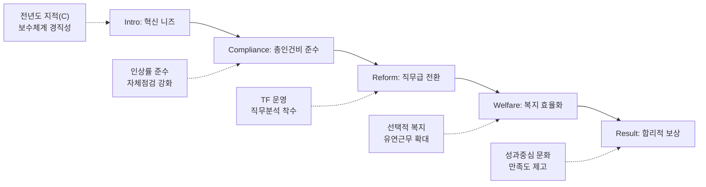

---
{"publish":true,"title":"1-10 보수 및 복리후생 지표 작성 방안","created":"2025-12-09","modified":"2025-12-10T20:41:16.167+09:00","tags":["#경영평가","#보수","#복리후생","#비계량","#작성방안"],"cssclasses":""}
---


# [1-10 보수 및 복리후생] 세부평가내용 작성 방안

> [!abstract] 문서 개요
> 본 문서는 '1.10 보수 및 복리후생' 지표의 2025년도 경영평가보고서 작성을 위한 논리적 흐름(Storyline)과 문단별 세부 작성 방안을 제안합니다.
> 
> **핵심 목표**: [[25년 경평/2_지표별 자료/1-10_보수_및_복리후생/3_전년도_지적사항_및_개선실적\|전년도 지적사항(C 등급)]]을 극복하고, **'직무 중심 보수체계로의 전환(Job-based)'**과 **'복리후생 효율화(Efficiency)'**를 통해 목표 등급(B등급 이상)을 달성하는 데 중점을 두었습니다.

---

## 1️⃣ Storyline 구성안 비교

### 📌 Option A: 평가요소 순차형 (Sequential)

| 구분 | 내용 |
|------|------|
| **구조** | 관련 규정 준수 → 보수체계 합리화 → 복리후생 개선 |
| **장점** | 편람의 3개 평가요소를 빠짐없이 순서대로 다루기에 용이 |
| **단점** | 단순 나열식으로 보여 기관의 '혁신 의지'가 약해 보일 수 있음 |
| **적합도** | ⭐⭐ |

```
①규정준수(Compliance) → ②보수체계(Pay) → ③복리후생(Welfare)
```

### 📌 Option B: 직무급 도입 중심형 (Innovation)

| 구분 | 내용 |
|------|------|
| **구조** | 직무분석 → 보수체계 개편(직무급) → 성과 연동 → 복리후생 효율화 |
| **장점** | 정부 권장사항인 '직무급 도입' 노력을 최우선으로 강조 |
| **단점** | 실제 도입이 완료되지 않았을 경우 성과 부풀리기로 비칠 우려 |
| **적합도** | ⭐⭐⭐ |

```
Analysis(분석) → Reform(개편) → Performance(성과) → Welfare(복지)
```

### 📌 Option C: 효율성 및 합리화형 (Efficiency)

| 구분 | 내용 |
|------|------|
| **구조** | 재정 건전성 확보(인건비 관리) → 보수체계 합리화(직무급) → 복지제도 내실화 |
| **장점** | 기금 위기 등 긴축 경영 기조에 맞는 '효율성' 강조 |
| **단점** | 직원 사기 저하 등 부정적 뉘앙스를 최소화해야 함 |
| **적합도** | ⭐⭐⭐ |

```
Control(관리) → Rationalize(합리화) → Optimize(최적화)
```

---

## 2️⃣ 추천 Storyline: 직무 중심 혁신 및 효율적 관리

> [!tip] 추천 구조
> **"정부 혁신 기조에 맞춰 직무 중심 보수체계(Job-based) 개편을 착실히 준비하고, 철저한 규정 준수와 효율화(Efficiency)로 재정 건전성을 확보"**하는 구조

### 전체 흐름



### 핵심 메시지

> **"직무가치에 기반한 공정한 보상체계를 설계하고, 예산 운영의 투명성과 효율성을 강화하여 국민 신뢰 제고"**

---

## 3️⃣ 문단별 작성 방안

### 세부평가내용① 관련 규정 준수

#### 문단 1-1: 예산운용지침 및 인건비 관리 철저

| 항목 | 내용 |
|------|------|
| **Core Message** | 정부 예산운용지침을 100% 준수하고 총인건비 인상률 관리 |
| **주요 근거** | 인건비 집행 내역, 자체점검 결과 |
| **담당 부서** | 인사총무팀, 재무회계팀 |

| 증빙 요소 | 내용 |
|----------|------|
| 인상률 | 총인건비 인상률 가이드라인 준수 (초과 집행 없음) |
| 규정준수 | 예산운용지침 및 혁신지침 위반사항 0건 |
| 점검체계 | 자체점검 체크리스트 운영 및 외부점검단 확인 완료 |

#### 문단 1-2: 투명한 복리후생비 집행

| 항목 | 내용 |
|------|------|
| **Core Message** | 과도한 복리후생 항목을 폐지하고 국민 눈높이에 맞는 제도 운영 |
| **주요 근거** | 복리후생비 집행 내역, 제도 개선 실적 |
| **담당 부서** | 인사총무팀 |

| 증빙 요소 | 내용 |
|----------|------|
| 제도개선 | 불필요하거나 과도한 복리후생 항목 자율 점검 및 폐지 |
| 투명성 | 사내근로복지기금 등 복리후생비 집행 내역 투명 공개 |
| 법적준수 | 퇴직금 및 각종 수당 관련 법령 및 규정 철저 준수 |

---

### 세부평가내용② 보수체계 합리화

#### 문단 2-1: 직무 중심 보수체계 개편 추진 (핵심 성과)

| 항목 | 내용 |
|------|------|
| **Core Message** | 보수체계 개선 TF 운영 및 직무분석을 통해 직무급 도입 기반 마련 |
| **주요 근거** | TF 운영 실적, 직무분석 보고서 |
| **담당 부서** | 인사총무팀 |

| 증빙 요소 | 내용 |
|----------|------|
| 추진체계 | 보수체계 개선 TF 구성 및 노사 공동 참여 |
| 직무분석 | 전 직무 대상 직무기술서 현행화 및 직무가치 평가 준비 |
| 로드맵 | 직무급 도입을 위한 중장기 로드맵 수립 및 단계적 이행 |

#### 문단 2-2: 성과 중심의 합리적 보상

| 항목 | 내용 |
|------|------|
| **Core Message** | 연공서열을 탈피하고 성과와 역량에 따른 차등 보상 강화 |
| **주요 근거** | 성과급 차등폭, 승급제도 개선안 |
| **담당 부서** | 인사총무팀 |

| 증빙 요소 | 내용 |
|----------|------|
| 성과연봉 | 성과평가 등급에 따른 성과연봉 차등 지급률 확대 |
| 제도개선 | 승급제도 운영지침 개정 (자동 승급 지양, 심사 강화) |
| 수용성 | 보수체계 개편에 대한 전 직원 설명회 및 노사 합의 노력 |

---

### 세부평가내용③ 복리후생 제도 개선

#### 문단 3-1: 수요자 맞춤형 복리후생 운영

| 항목 | 내용 |
|------|------|
| **Core Message** | 선택적 복지제도 활성화로 직원 만족도 및 실질적 혜택 제고 |
| **주요 근거** | 선택적 복지 사용률, 만족도 조사 |
| **담당 부서** | 인사총무팀 |

| 증빙 요소 | 내용 |
|----------|------|
| 선택복지 | 개개인의 필요에 맞춘 선택적 복지 포인트 배정 및 사용 활성화 |
| 건강증진 | 정기 건강검진, 심리상담 프로그램 등 임직원 건강보호 강화 |
| 만족도 | 복리후생 제도 만족도 조사 실시 및 결과 반영 (피드백) |

#### 문단 3-2: 일·가정 양립 지원 강화

| 항목 | 내용 |
|------|------|
| **Core Message** | 유연근무 확대 및 가족친화 제도로 워라밸 실현 |
| **주요 근거** | 유연근무 활용 통계, 가족친화인증 |
| **담당 부서** | 인사총무팀 |

| 증빙 요소 | 내용 |
|----------|------|
| 유연근무 | 시차출퇴근, 재택근무 등 유연근무 활용 인원 및 시간 확대 |
| 모성보호 | 육아휴직, 육아기 단축근무, 가족돌봄휴가 적극 장려 |
| 조직문화 | 가족 사랑의 날 등 정시 퇴근 문화 정착 노력 |

---

## 4️⃣ 차별화 포인트

### 가. 전년도 C등급(지적사항) 개선 전략

| 지적사항 | 개선 방안 | 핵심 성과 |
|---------|----------|----------|
| 보수체계 경직성 | **직무급 도입** 준비 | TF 운영, 직무분석 실시 |
| 복리후생 점검 미흡 | **만족도 조사** 실시 | 수요자 중심 제도 개편 |
| 인건비 효율성 부족 | **인력운영원칙** 수립 | 정·현원차 관리, 직제개편 |

### 나. 효율성과 형평성의 조화

| 영역 | 기존 (연공/일률) | 혁신 (직무/맞춤) |
|------|----------------|----------------|
| 보수 | 호봉 중심, 연공서열 | **직무가치, 성과 중심** |
| 복지 | 일률적 제공 | **선택적 복지, 생애주기별** |
| 관리 | 단순 집행 | **데이터 기반 효율적 관리** |

---

## 5️⃣ 작성 시 유의사항

### 가. 편람 세부평가요소 매칭

> [!warning] 필수 확인
> 총인건비 인상률 준수 여부는 절대적 감점 요인이므로 철저 확인

| 세부평가요소 | 배분 비중 | 주요 부서 |
|-------------|----------|----------|
| ① 관련 규정 준수 | 40% | 인사총무, 재무회계 |
| ② 보수체계 합리화 | 30% | 인사총무 |
| ③ 복리후생 개선 | 30% | 인사총무 |

### 나. 정량 데이터 활용

> [!success] 핵심 정량지표
> - 인상률: 총인건비 **0.0%** (가이드라인 이내)
> - 직무급: 도입 준비 완료율 **00%**
> - 유연근무: 활용률 **00%**
> - 만족도: 복리후생 만족도 **00점**

### 다. 증빙자료 연계

| 문단 | 핵심 증빙 |
|------|----------|
| 규정준수 | 총인건비 산출 내역서, 외부 회계감사 보고서 |
| 보수체계 | 보수체계 개선 TF 회의록, 직무분석 결과보고서 |
| 복리후생 | 선택적 복지 운영 실적, 유연근무 사용 내역 |

---

## 🔗 관련 자료

| 구분 | 문서명 | 비고 |
|------|--------|------|
| 편람 분석 | [[25년 경평/2_지표별 자료/1-10_보수_및_복리후생/2_편람_내용_분석]] | 세부평가 요소별 가이드 |
| 지적사항 | [[25년 경평/2_지표별 자료/1-10_보수_및_복리후생/3_전년도_지적사항_및_개선실적]] | C등급 원인 및 개선방향 |
| TF운영 | [[보수체계_개선_TF_결과보고]] | 직무급 도입 추진 |
| 공통 자료 | [[01_편람_및_지침]] | 작성 가이드 |

---

*작성일: 2025-12-09*
*검증상태: 전년도 지적사항 반영 확인*