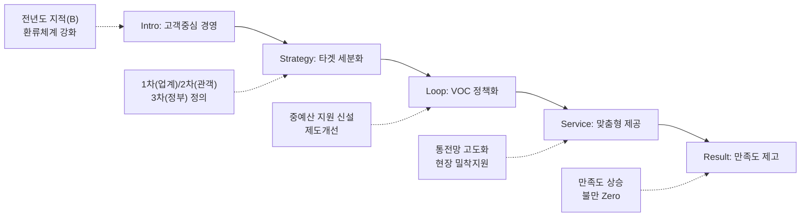

---
{"publish":true,"title":"1-11 고객관리 활동 지표 작성 방안","created":"2025-12-09","modified":"2025-12-10T21:01:27.172+09:00","tags":["#경영평가","#고객관리","#국민소통","#비계량","#작성방안"],"cssclasses":""}
---


# [1-11 고객관리 활동] 세부평가내용 작성 방안

> [!abstract] 문서 개요
> 본 문서는 '1.11 고객관리 활동' 지표의 2025년도 경영평가보고서 작성을 위한 논리적 흐름(Storyline)과 문단별 세부 작성 방안을 제안합니다.
> 
> **핵심 목표**: [[25년 경평/2_지표별 자료/1-11_고객관리_활동/3_전년도_지적사항_및_개선실적\|전년도 지적사항(B 등급)]]을 넘어, **'VOC 기반의 정책 환류(Feedback Loop)'**와 **'고객 맞춤형 서비스(Customization)'**를 통해 목표 등급(A등급)을 달성하는 데 중점을 두었습니다.

---

## 1. Storyline 구성안 비교

### 📌 Option A: 평가요소 순차형 (Sequential)

| 구분 | 내용 |
|------|------|
| **구조** | 관리전략 수립 → 의견수렴(VOC) → 만족도 향상(서비스) |
| **장점** | 편람의 3개 평가요소를 빠짐없이 순서대로 다루기에 용이 |
| **단점** | 단순 나열식으로 보여 전략적 연계성이 약해 보일 수 있음 |
| **적합도** | ⭐⭐ |

```
①전략(Strategy) → ②수렴(Listening) → ③개선(Action)
```

### 📌 Option B: VOC 환류 중심형 (Feedback Loop)

| 구분 | 내용 |
|------|------|
| **구조** | VOC 수집 → 분석 → 정책 반영 → 성과 창출 → 환류 |
| **장점** | 전년도 지적사항(VOC 정책 반영 미흡)을 정면으로 해소하는 구조 |
| **단점** | 관리전략 부분이나 일반 서비스 개선 내용이 축소될 수 있음 |
| **적합도** | ⭐⭐⭐ |

```
Listening(듣기) → Thinking(분석) → Acting(반영) → Checking(확인)
```

### 📌 Option C: 고객 여정형 (Customer Journey)

| 구분 | 내용 |
|------|------|
| **구조** | 인지(홍보) → 탐색(정보제공) → 이용(서비스) → 평가(만족도) |
| **장점** | 고객 관점에서의 서비스 흐름을 보여주기에 용이 |
| **단점** | 기관의 정책 반영 노력보다는 단순 서비스 개선에 치중될 수 있음 |
| **적합도** | ⭐⭐ |

```
Awareness → Consideration → Usage → Loyalty
```

---

## 2. 추천 Storyline: 전략적 환류 및 맞춤형 서비스

> [!tip] 추천 구조
> **"고객 특성에 맞는 차별화된 전략(Segmentation)을 수립하고, VOC를 정책으로 실현(Realization)하여 고객 가치를 창출"**하는 구조

### 전체 흐름



### 핵심 메시지

> **"현장의 목소리(VOC)를 정책으로 실현하여 영화인에게는 실질적 지원을, 국민에게는 향유 기회를 제공"**

---

## 3. 문단별 작성 방안

### 세부평가내용① 고객 정의 및 관리전략

#### 문단 1-1: 데이터 기반의 고객 세분화 및 차별화 전략

| 항목 | 내용 |
|------|------|
| **Core Message** | 고객을 업계(1차), 관객(2차), 정부(3차)로 명확히 정의하고 맞춤 전략 수립 |
| **주요 근거** | 고객 정의 체계도, 고객별 전략 |
| **담당 부서** | 기획전략팀 |

| 증빙 요소 | 내용 |
|----------|------|
| 고객정의 | 1차(영화인/단체), 2차(관객/국민), 3차(정부/지자체) 재정립 |
| 전략수립 | 고객군별 니즈 분석에 따른 차별화된 관리 전략 수립 |
| CS체계 | 전사적 CS 추진체계 및 CS 리더 운영 현황 |

#### 문단 1-2: 고객관리 인프라(CRM) 고도화

| 항목 | 내용 |
|------|------|
| **Core Message** | 통합전산망 등 디지털 플랫폼을 활용한 고객 데이터 관리 및 분석 |
| **주요 근거** | CRM 운영 실적, 데이터 분석 활용 |
| **담당 부서** | 디지털혁신팀 |

| 증빙 요소 | 내용 |
|----------|------|
| 시스템 | 고객 DB 통합 관리 및 이력 관리 시스템 운영 |
| 분석활용 | 고객 이용 패턴 빅데이터 분석을 통한 서비스 개선 인사이트 도출 |

---

### 세부평가내용② 고객 의견 수렴 및 반영 체계

#### 문단 2-1: 온·오프라인 소통 채널의 다각화

| 항목 | 내용 |
|------|------|
| **Core Message** | 현장 간담회부터 SNS까지 다양한 채널로 사각지대 없는 소통 구현 |
| **주요 근거** | 채널별 운영 실적, 소통 횟수 |
| **담당 부서** | 홍보팀, 사업부서 |

| 증빙 요소 | 내용 |
|----------|------|
| 현장소통 | 영화인 직능단체, 제작가협회 등 정기 현장 간담회 개최 |
| 디지털 | 홈페이지, SNS, 챗봇 등을 통한 24시간 소통 창구 운영 |
| 참여확대 | 국민참여혁신단, 옴부즈만 등 고객 참여형 위원회 운영 |

#### 문단 2-2: VOC의 실질적 정책 환류 (핵심 성과)

| 항목 | 내용 |
|------|------|
| **Core Message** | 단순 민원 처리를 넘어, VOC를 분석하여 신규 사업 및 제도 개선으로 연결 |
| **주요 근거** | 제도개선 사례, 중예산 지원 신설 |
| **담당 부서** | 기획전략팀, 지원사업부서 |

| 증빙 요소 | 내용 |
|----------|------|
| 정책반영 | 현장 VOC(허리라인 붕괴) → 중예산 영화 제작지원 사업 신설 (예산 확보) |
| 제도개선 | 불필요한 행정절차 간소화 및 지원금 지급 시기 단축 |
| 피드백 | VOC 조치 결과의 신속한 안내 및 해피콜 실시 |

---

### 세부평가내용③ 고객 만족도 향상 노력

#### 문단 3-1: 수요자 중심의 맞춤형 서비스 제공

| 항목 | 내용 |
|------|------|
| **Core Message** | 영화인과 국민 각각의 니즈에 부합하는 특화 서비스 제공 |
| **주요 근거** | 서비스 개선 실적, 이용자 만족도 |
| **담당 부서** | 사업부서 |

| 증빙 요소 | 내용 |
|----------|------|
| 영화인 | 기획-제작-배급 전 단계 원스톱 지원 및 법률/노무 컨설팅 |
| 국민 | 통합전산망을 통한 영화 정보 제공, 관람료 할인권 등 향유권 확대 |
| 사회약자 | 장애인 관람환경 개선(가치봄), 찾아가는 영화관 운영 |

#### 문단 3-2: 서비스 품질 관리 및 성과 점검

| 항목 | 내용 |
|------|------|
| **Core Message** | 정기적인 만족도 조사와 서비스 품질 점검으로 지속적 개선 |
| **주요 근거** | PCSI 조사 결과, 개선계획 이행 |
| **담당 부서** | 기획전략팀 |

| 증빙 요소 | 내용 |
|----------|------|
| 만족도조사 | 자체 및 외부(PCSI) 고객만족도 조사 실시 및 결과 분석 |
| 품질개선 | 전화친절도 점검, CS 교육 실시 등을 통한 접점 서비스 품질 제고 |
| 성과관리 | 고객만족도 목표 달성도 점검 및 부서평가 반영 |

---

## 4. 차별화 포인트

### 가. 전년도 B등급(지적사항) 개선 전략

| 지적사항 | 개선 방안 | 핵심 성과 |
|---------|----------|----------|
| VOC 환류 미흡 | **정책 연계** 프로세스 | 중예산 지원사업 신설 |
| 세분화 전략 부족 | **고객군 재정의** | 3단계 고객 정의 및 전략 |
| 만족도 개선 필요 | **피드백** 강화 | 서비스 이행표준 점검 |

### 나. 영화산업 특화 고객관리

| 영역 | 일반 공공기관 | 영진위 차별화 |
|------|-------------|--------------|
| 고객 정의 | 일반 국민 중심 | **창작자/산업계/관객** 다층 구조 |
| 소통 방식 | 민원 응대 중심 | **현장 간담회, 영화제** 연계 소통 |
| 서비스 | 행정 서비스 | **제작/유통 지원, DB 정보 제공** |

---

## 5. 작성 시 유의사항

### 가. 편람 세부평가요소 매칭

> [!warning] 필수 확인
> VOC가 실제 정책으로 이어진 구체적 사례(Evidence)가 필수적임

| 세부평가요소 | 배분 비중 | 주요 부서 |
|-------------|----------|----------|
| ① 관리전략 수립 | 30% | 기획전략 |
| ② 의견수렴 및 환류 | 40% | 홍보팀, 사업부서 |
| ③ 만족도 향상 노력 | 30% | 전 부서 |

### 나. 정량 데이터 활용

> [!success] 핵심 정량지표
> - VOC: 처리율 **100%**, 정책반영 **0건**
> - 만족도: PCSI **00.0점** (전년 대비 +%)
> - 소통: 간담회 **00회**, 참여인원 **000명**

### 다. 증빙자료 연계

| 문단 | 핵심 증빙 |
|------|----------|
| 고객전략 | CS 전략체계도, 고객만족도 조사 계획 |
| VOC환류 | VOC 분석 보고서, 제도개선 실적 증빙 |
| 서비스개선 | 통합전산망 고도화 결과, 지원사업 공고문 |

---

## 🔗 관련 자료

| 구분 | 문서명 | 비고 |
|------|--------|------|
| 편람 분석 | [[25년 경평/2_지표별 자료/1-11_고객관리_활동/2_편람_내용_분석]] | 세부평가 요소별 가이드 |
| 지적사항 | [[25년 경평/2_지표별 자료/1-11_고객관리_활동/3_전년도_지적사항_및_개선실적]] | B등급 원인 및 개선방향 |
| 부서 매핑 | [[25년 경평/2_지표별 자료/1-7_재무예산_관리/6_부서별_실적_통합_매핑표]] | 부서별 실적 종합 |
| 공통 자료 | [[01_편람_및_지침]] | 작성 가이드 |

---

*작성일: 2025-12-09*
*검증상태: 전년도 지적사항 반영 확인*