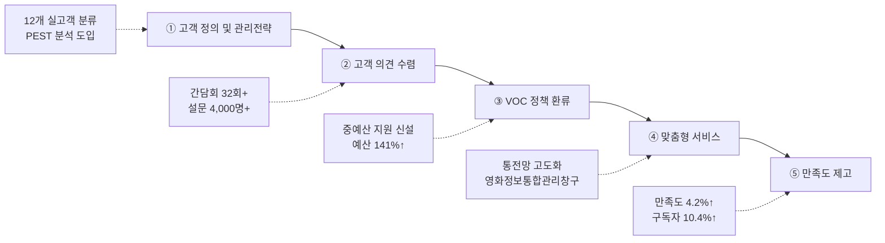

---
{"publish":true,"permalink":"/경영평가/1-11/5_지표작성방안","title":"5_지표 작성 방안","created":"2025-12-14","modified":"2025-12-15T22:35:03.057+09:00","tags":["#경영평가","#고객관리","#국민소통","#비계량","#작성방안","#지표_1-11"],"cssclasses":""}
---


# [1-11 고객관리 활동] 세부평가내용 작성 방안

> [!abstract] 문서 개요
> 본 문서는 '1.11 고객관리 활동' 지표의 2025년도 경영평가보고서 작성을 위한 논리적 흐름(Storyline)과 문단별 세부 작성 방안을 제안합니다.
> 
> **핵심 목표**: [[25년 경평/2_지표별 자료/1-11_고객관리_활동/3_전년도_지적사항_및_개선실적\|전년도 지적사항(C 등급)]]을 넘어, **'VOC 기반의 정책 환류(Feedback Loop)'**와 **'고객 맞춤형 서비스(Customization)'**를 통해 목표 등급(A등급)을 달성하는 데 중점을 두었습니다.

---

## 1. Storyline 구성안 비교

### 📌 Option A: 평가요소 순차형 (Sequential)

| 구분 | 내용 |
|------|------|
| **구조** | 관리전략 수립 → 의견수렴(VOC) → 만족도 향상(서비스) |
| **장점** | 편람의 3개 평가요소를 빠짐없이 순서대로 다루기에 용이 |
| **단점** | 단순 나열식으로 보여 전략적 연계성이 약해 보일 수 있음 |
| **적합도** | ⭐⭐ |

```
①전략(Strategy) → ②수렴(Listening) → ③개선(Action)
```

### 📌 Option B: VOC 환류 중심형 (Feedback Loop)

| 구분 | 내용 |
|------|------|
| **구조** | VOC 수집 → 분석 → 정책 반영 → 성과 창출 → 환류 |
| **장점** | 전년도 지적사항(VOC 정책 반영 미흡)을 정면으로 해소하는 구조 |
| **단점** | 관리전략 부분이나 일반 서비스 개선 내용이 축소될 수 있음 |
| **적합도** | ⭐⭐⭐ |

```
Listening(듣기) → Thinking(분석) → Acting(반영) → Checking(확인)
```

### 📌 Option C: 고객 여정형 (Customer Journey)

| 구분 | 내용 |
|------|------|
| **구조** | 인지(홍보) → 탐색(정보제공) → 이용(서비스) → 평가(만족도) |
| **장점** | 고객 관점에서의 서비스 흐름을 보여주기에 용이 |
| **단점** | 기관의 정책 반영 노력보다는 단순 서비스 개선에 치중될 수 있음 |
| **적합도** | ⭐⭐ |

```
Awareness → Consideration → Usage → Loyalty
```

---

## 2. 추천 Storyline (VOC 기반 정책 환류 및 맞춤형 서비스)

> [!tip] 추천 구조
> **"고객 특성에 맞는 차별화된 전략(Segmentation)을 수립하고, VOC를 정책으로 실현(Realization)하여 고객 가치를 창출"**하는 구조

### 전체 흐름



### 핵심 메시지

> **"현장의 목소리(VOC)를 정책으로 실현하여 영화인에게는 실질적 지원을, 국민에게는 향유 기회를 제공"**

---

## 3. 문단별 작성 방안

### 세부평가내용① 고객 정의 및 관리전략

#### 문단 1-1: 데이터 기반의 고객 세분화 및 차별화 전략

| 항목 | 내용 |
|------|------|
| **Core Message** | PEST 분석 도입 및 12개 실고객 분류로 고객관리 전략체계 고도화 |
| **주요 근거** | 고객관리 전략체계 재수립, 고객감동추진단 운영 |
| **담당 부서** | 기획전략팀 |

| 구분 | 실적 | 성과 |
|------|------|------|
| 고객관리 전략체계 | **2025.10.1.** 조기 수립 | 중장기 경영전략 연계 |
| 환경분석 혁신 | **PEST 분석** 도입 | 거시/미시 환경 통합 분석 |
| 고객 재분류 | **12개 실고객** 분류 | 직관적 실고객 중심 전환 |
| 고객감동추진단 | **3회** 운영 | 8개 부서 참여 |
| CS 비전 | **고객 중심 서비스** | 모호한 표현 제거, 의지 강화 |
| 3대 CS 전략 | **수립** | 지원체계·소통·지속가능성 |

> [!example] 추천 스토리라인
> **"고객관리 전략체계 부재 진단 → PEST 분석 도입 → 12개 실고객 분류 → 3대 CS 전략 수립"**
> 
> - 도입: 영화산업 급변으로 고객관리 전략체계 고도화 필요
> - 전개: PEST 분석(거시환경) + 미시환경 분석 도입, 12개 실고객 분류 체계 구축
> - 성과: 고객감동추진단 3회 운영, 3대 CS 전략 및 성과지표 수립

#### 문단 1-2: 고객관리 인프라(CRM) 고도화

| 항목 | 내용 |
|------|------|
| **Core Message** | 통합전산망 등 디지털 플랫폼을 활용한 고객 데이터 관리 및 분석 |
| **주요 근거** | KOBIS 이용자 관리, 영화인 DB, OPEN-API |
| **담당 부서** | 디지털혁신팀 |

| 구분 | 실적 | 성과 |
|------|------|------|
| KOBIS 이용자 | **5,813,268명** | 전년 대비 +1.1% |
| 신규 방문수 | **+9.73%** | 신규 고객 유입 증가 |
| OPEN-API 발급 | **30,366건** | 전년 대비 +35% |
| 영화인 신규등록 | **2,728명** | 영화인 DB 확대 |
| 영화인 신규가입 | **1,442명** | 서비스 이용자 증가 |
| 전송사업자 연동 | **16개** | 신규 1개 추가 |

> [!example] 추천 스토리라인
> **"고객관리 인프라 필요 → KOBIS 이용자 관리 → 빅데이터 분석 → 서비스 개선"**
> 
> - 도입: 디지털 플랫폼을 활용한 고객 데이터 관리 필요
> - 전개: KOBIS 이용자 581만명 관리, OPEN-API 35% 증가
> - 성과: 영화인 DB 확대, 전송사업자 16개 연동

---

### 세부평가내용② 고객 의견 수렴 및 반영 체계

#### 문단 2-1: 온·오프라인 소통 채널의 다각화

| 항목 | 내용 |
|------|------|
| **Core Message** | 현장 간담회부터 SNS까지 다양한 채널로 사각지대 없는 소통 구현 |
| **주요 근거** | 간담회 32회+, 설문조사 4,000명+, SNS 채널 |
| **담당 부서** | 홍보협력팀, 창작제작팀, 정책개발팀 |

| 구분 | 실적 | 성과 |
|------|------|------|
| 기획개발 간담회 | **4회** | 영화인·제작사 의견 수렴 |
| 독립예술영화소위원회 | **5회** | 독립영화계 협치 |
| 다큐멘터리 TF | **6회** (신규) | 3단계 지원체계 도입 |
| 투자환경 개선 간담회 | **6회** | VC·영화산업 관계자 |
| 투자조합 운용사 간담회 | **11회** | 투자유치 피드백 |
| 연구과제 수요조사 | **25건** | 대국민·유관기관·내부 |
| 설문조사 응답자 | **3,989명** | 소비트렌드 등 |
| KOBIS 이용자 조사 | **189명** | 통계집계기준 개편 |
| 전문가 자문 | **27명** | 심층인터뷰·FGI |

> [!example] 추천 스토리라인
> **"소통 채널 다각화 필요 → 현장 간담회 32회+ → 설문조사 4,000명+ → 사각지대 해소"**
> 
> - 도입: 현장 간담회부터 SNS까지 다양한 채널로 사각지대 없는 소통 필요
> - 전개: 기획개발 간담회 4회, 독립예술영화소위 5회, 다큐멘터리 TF 6회(신규)
> - 성과: 연구과제 수요조사 25건, 설문조사 3,989명, 전문가 자문 27명

#### 문단 2-2: VOC의 실질적 정책 환류 (핵심 성과)

| 항목 | 내용 |
|------|------|
| **Core Message** | 단순 민원 처리를 넘어, VOC를 분석하여 신규 사업 및 제도 개선으로 연결 |
| **주요 근거** | 중예산 지원 신설, 예산 141%↑, 신규사업 2건 |
| **담당 부서** | 기획전략팀, 창작제작팀 |

| 구분 | 실적 | 성과 |
|------|------|------|
| 중예산 영화 지원 | **신설** | VOC(허리라인 붕괴) → 정책화 |
| '26년 기획개발 예산 | **141.1%↑** | 62.8억원 증액 |
| 신규사업 설계 | **2건** | 차기작·IP라인업 지원 |
| S#1 네트워킹 | 0회→**6회** | 작가 네트워크 부족 해소 |
| 작가부문 지원 | **85편** 확대 | 자격 완화, 공모 2회 |
| 다큐멘터리 지원 | **3단계** 체계 | TF 6회 운영 결과 |
| 통전망 개편 | **매출액+관객수** 병기 | 이용자 조사 189명 반영 |

> [!example] 추천 스토리라인
> **"VOC 환류 미흡 지적 → VOC 분석 → 정책 반영 → 중예산 지원사업 신설"**
> 
> - 도입: 단순 민원 처리를 넘어 VOC를 정책으로 연결 필요(지적사항 대응)
> - 전개: 현장 VOC(허리라인 붕괴) 분석, 간담회 32회+ 의견 수렴
> - 성과: 중예산 영화 지원 신설, 예산 141%↑, 신규사업 2건, 다큐멘터리 3단계 체계

---

### 세부평가내용③ 고객 만족도 향상 노력

#### 문단 3-1: 수요자 중심의 맞춤형 서비스 제공

| 항목 | 내용 |
|------|------|
| **Core Message** | 영화인과 국민 각각의 니즈에 부합하는 특화 서비스 제공 |
| **주요 근거** | 영화정보통합관리창구 신설, 이중행정 해소, 대표홈페이지 개선 |
| **담당 부서** | 디지털혁신팀, 홍보협력팀 |

| 구분 | 실적 | 성과 |
|------|------|------|
| 영화정보통합관리창구 | **'25.12. 신설** | 4개 전용 창구 분리 |
| 영등위 연계 | **API 연계** | 이중행정 해소 |
| 대표홈페이지 개선 | **4건** | 개인정보 비공개, 접수 개선 등 |
| 사업진행매뉴얼 | **신규 제작** | 보조사업자 집행 가이드 |
| 약정체결 설명회 | **대면 OT** | 사업 이해도 제고 |
| 예술인고용보험 교육 | **11/20** | 근로복지공단 초청 |

> [!example] 추천 스토리라인
> **"수요자 맞춤형 서비스 필요 → 영화정보통합관리창구 신설 → 이중행정 해소 → 편의성 제고"**
> 
> - 도입: 영화인과 국민 각각의 니즈에 부합하는 특화 서비스 필요
> - 전개: 영화정보통합관리창구 4개 창구 신설, 영등위 API 연계
> - 성과: 대표홈페이지 4건 개선, 사업진행매뉴얼 신규 제작

#### 문단 3-2: 고객 소통 채널 확대 및 성과

| 항목 | 내용 |
|------|------|
| **Core Message** | SNS 채널 확대 및 콘텐츠 다각화로 고객 접점 강화 |
| **주요 근거** | 구독자 증가, 뉴스레터 열람수 증가, BIFF 홍보부스 |
| **담당 부서** | 홍보협력팀 |

| 구분 | 실적 | 성과 |
|------|------|------|
| 인스타그램 팔로워 | **21,750명** | 전년 대비 +10.4% |
| 네이버 블로그 이웃 | **1,146명** | 전년 대비 +43.8% |
| 뉴스레터 열람수 | **3,632회** | 전년 대비 +36.9% |
| 숏폼 평균 조회수 | **369회** | 전년 대비 +29.0% |
| BIFF 이벤트 참여 | **834명** | 야외 공간 확대 |
| 종합 구독자 증가 | **2,563명** | 전 채널 합계 |

> [!example] 추천 스토리라인
> **"고객 소통 채널 확대 필요 → SNS 콘텐츠 다각화 → 구독자 10.4%↑ → 접점 강화"**
> 
> - 도입: 고객 접점 확대 및 정보 접근성 향상 필요
> - 전개: 인스타그램·블로그·뉴스레터 콘텐츠 다각화, BIFF 홍보부스 확대
> - 성과: 인스타그램 +10.4%, 블로그 +43.8%, 뉴스레터 +36.9%

#### 문단 3-3: 서비스 품질 관리 및 성과 점검

| 항목 | 내용 |
|------|------|
| **Core Message** | 정기적인 만족도 조사와 서비스 품질 점검으로 지속적 개선 |
| **주요 근거** | 통전망 만족도 조사, CS 교육, 프로그램 만족도 |
| **담당 부서** | 기획전략팀, 디지털혁신팀, 창작제작팀 |

| 구분 | 실적 | 성과 |
|------|------|------|
| 통전망 홈페이지 만족도 | **8.10점** | 전년 대비 +4.2% |
| CS 교육 참여 | **77인** | 전 직원 대상 |
| 고객만족도 조사 대상 | **2개 사업** 추가 | 글로벌과정, 차세대 미래관객 |
| S#1 비즈워크 만족도 | **4.6점** | 5점 만점 |
| S#1 마스터클래스 | **4.7점** | 5점 만점 |
| 웹매거진 독자 만족도 | **90% 이상** | 디자인·콘텐츠 |
| 학술정보원 이용건수 | **19,881건** | DBpia+KISS |

> [!example] 추천 스토리라인
> **"서비스 품질 관리 필요 → 만족도 조사 실시 → CS 교육 77인 → 지속적 개선"**
> 
> - 도입: 정기적인 만족도 조사와 서비스 품질 점검으로 지속적 개선 필요
> - 전개: 통전망 만족도 조사, CS 교육 전 직원 77인, 조사 대상 2개 사업 추가
> - 성과: 통전망 만족도 +4.2%, S#1 프로그램 만족도 4.6점 이상


---

## 4. 문단 구성 요약

| 문단 | 핵심 주제 | 담당 부서 | 핵심 성과 |
|------|----------|----------|----------|
| **1-1** | 고객 세분화 및 차별화 전략 | 기획전략팀 | PEST 분석, 12개 실고객, 추진단 3회 |
| **1-2** | 고객관리 인프라(CRM) 고도화 | 디지털혁신팀 | KOBIS 581만명, API 35%↑ |
| **2-1** | 온·오프라인 소통 채널 다각화 | 홍보협력팀, 창작제작팀, 정책개발팀 | 간담회 32회+, 설문 4,000명+ |
| **2-2** | VOC의 실질적 정책 환류 | 기획전략팀, 창작제작팀 | 중예산 신설, 예산 141%↑ |
| **3-1** | 수요자 중심 맞춤형 서비스 | 디지털혁신팀, 홍보협력팀 | 통합관리창구 신설, 이중행정 해소 |
| **3-2** | 고객 소통 채널 확대 | 홍보협력팀 | 인스타 +10.4%, 블로그 +43.8% |
| **3-3** | 서비스 품질 관리 및 성과 점검 | 기획전략팀, 디지털혁신팀, 창작제작팀 | 만족도 +4.2%, CS 교육 77인 |

---

## 5. 차별화 포인트

### 📌 편람 대응 전략

| 평가요소 | 편람 요구사항 | 대응 전략 |
|---------|-------------|----------|
| ① 고객 정의 | 핵심업무 연계 고객 정의 | PEST 분석 + 12개 실고객 분류 + 3대 CS 전략 |
| ① 관리전략 | 고객별 관리전략 적절성 | 고객감동추진단 3회 + CS 교육 77인 |
| ② 의견수렴 | 의견수렴 체계 구축 | 간담회 32회+ + 설문 4,000명+ + TF 6회 |
| ② 정책반영 | 경영·사업 반영 성과 | 중예산 신설 + 예산 141%↑ + 신규사업 2건 |
| ③ 만족도 향상 | 구체적 노력과 성과 | 통합관리창구 + 만족도 +4.2% + 구독자 +10.4% |

### 📌 전년도 B등급 개선 전략

| 지적사항 | 개선 내용 |
|---------|----------|
| VOC 환류 미흡 | 중예산 지원 신설 + 예산 141%↑ + 신규사업 2건 |
| 세분화 전략 부족 | PEST 분석 도입 + 12개 실고객 분류 |
| 만족도 개선 필요 | 통전망 +4.2% + CS 교육 77인 + 조사 대상 확대 |

### 📌 영화산업 특화 고객관리

```
[고객 세분화]                      [VOC 정책 환류]
12개 실고객 분류 ─────────────→ 중예산 영화 지원 신설
PEST 분석 도입 ───────────────→ 예산 141%↑ (62.8억원)
고객감동추진단 3회 ───────────→ 신규사업 2건 (차기작, IP)
                    ↓
            [맞춤형 서비스]
            영화정보통합관리창구 신설
            이중행정 해소 (영등위 연계)
            통전망 만족도 +4.2%
```

---

## 6. 핵심 정량 데이터 Quick Reference

### 📊 고객관리 전략체계 (기획전략팀)

| 지표 | 수치 | 비고 |
|------|------|------|
| 고객관리 전략체계 수립 | **2025.10.1.** | 조기 수립 |
| 환경분석 | **PEST 분석** 도입 | 거시/미시 통합 |
| 고객 분류 | **12개** 실고객 | 직관적 분류 |
| 고객감동추진단 | **3회** | 8개 부서 참여 |
| CS 교육 참여 | **77인** | 전 직원 |
| 고객만족도 조사 대상 | **2개 사업** 추가 | 글로벌과정, 차세대 미래관객 |

### 📊 고객관리 인프라 (디지털혁신팀)

| 지표 | 수치 | 비고 |
|------|------|------|
| KOBIS 이용자 | **5,813,268명** | +1.1% |
| 신규 방문수 증가율 | **+9.73%** | 신규 고객 유입 |
| OPEN-API 발급 | **30,366건** | +35% |
| 영화인 신규등록 | **2,728명** | DB 확대 |
| 전송사업자 연동 | **16개** | 신규 1개 |
| 통전망 만족도 | **8.10점** | +4.2% |
| 영화정보통합관리창구 | **'25.12. 신설** | 4개 창구 |
| 대표홈페이지 개선 | **4건** | 편의성 향상 |

### 📊 고객 의견수렴 (창작제작팀, 정책개발팀)

| 지표 | 수치 | 비고 |
|------|------|------|
| 기획개발 간담회 | **4회** | 영화인·제작사 |
| 독립예술영화소위원회 | **5회** | 독립영화계 협치 |
| 다큐멘터리 TF | **6회** (신규) | 3단계 체계 도입 |
| 투자환경 개선 간담회 | **6회** | VC·영화산업 |
| 투자조합 운용사 간담회 | **11회** | 투자유치 피드백 |
| 연구과제 수요조사 | **25건** | 대국민·유관기관 |
| 설문조사 응답자 | **3,989명** | 소비트렌드 등 |
| KOBIS 이용자 조사 | **189명** | 통계집계기준 |
| 전문가 자문 | **27명** | 심층인터뷰·FGI |

### 📊 VOC 정책 환류 (창작제작팀)

| 지표 | 수치 | 비고 |
|------|------|------|
| 중예산 영화 지원 | **신설** | VOC 정책화 |
| '26년 기획개발 예산 | **141.1%↑** | 62.8억원 증액 |
| 신규사업 설계 | **2건** | 차기작, IP라인업 |
| S#1 네트워킹 | 0회→**6회** | 작가 네트워크 |
| 작가부문 지원 | **85편** 확대 | 자격 완화 |
| 다큐멘터리 지원 | **3단계** 체계 | TF 결과 반영 |
| S#1 비즈워크 만족도 | **4.6점** | 5점 만점 |
| S#1 마스터클래스 | **4.7점** | 5점 만점 |

### 📊 고객 소통 채널 (홍보협력팀)

| 지표 | 수치 | 비고 |
|------|------|------|
| 인스타그램 팔로워 | **21,750명** | +10.4% |
| 유튜브 구독자 | **10,967명** | +1.6% |
| 네이버 블로그 이웃 | **1,146명** | +43.8% |
| 뉴스레터 열람수 | **3,632회** | +36.9% |
| 숏폼 평균 조회수 | **369회** | +29.0% |
| BIFF 이벤트 참여 | **834명** | 야외 확대 |
| 종합 구독자 증가 | **2,563명** | 전 채널 |
| 언론사 인용 기사 | **266건** | 3분기 기준 |

---

## 7. 작성 시 유의사항

### ✅ 강조할 점

1. **VOC 정책 환류**: 중예산 영화 지원 신설, 예산 141%↑, 신규사업 2건
2. **고객 세분화 고도화**: PEST 분석 도입, 12개 실고객 분류, 3대 CS 전략
3. **의견수렴 다각화**: 간담회 32회+, 설문조사 4,000명+, TF 6회(신규)
4. **맞춤형 서비스**: 영화정보통합관리창구 신설, 이중행정 해소
5. **만족도 향상**: 통전망 +4.2%, 인스타그램 +10.4%, 블로그 +43.8%
6. **CS 역량 강화**: 전 직원 CS 교육 77인, 고객감동추진단 3회

### ⚠️ 주의할 점

1. 전년도 B등급 지적사항(VOC 환류 미흡) 개선 노력 명확히 서술
2. VOC가 실제 정책으로 이어진 구체적 사례(Evidence) 필수
3. 정량적 성과(예산 141%↑, 만족도 +4.2% 등) 적극 활용

### 📝 편람 키워드 체크리스트

- [x] 기관 핵심업무 연계 고객 정의
- [x] 고객 세분화 및 분류 체계
- [x] 고객별 맞춤형 관리전략
- [x] 고객관계관리(CRM) 시스템
- [x] 고객 의견 수렴 채널 다양화
- [x] VOC 정책 반영 환류 체계
- [x] 고객만족도 조사 및 개선
- [x] 서비스 품질 관리 및 점검
- [x] 영화인 의견 적극 청취

---

## 관련 자료

| 구분 | 문서명 | 링크 |
|------|--------|------|
| 편람 분석 | 편람 내용 분석 | [바로가기](/경영평가/1-11/2_편람내용분석) |
| 지적사항 | 전년도 지적사항 및 개선실적 | [바로가기](/경영평가/1-11/3_전년도지적사항) |
| 부서 실적 | 기획전략팀 실적 분석 | [바로가기](/부서성과평가/1-5-1/기획전략팀) |
| 부서 실적 | 디지털혁신팀 실적 분석 | [바로가기](/부서성과평가/1-5-1/디지털혁신팀) |
| 부서 실적 | 정책개발팀 실적 분석 | [바로가기](/부서성과평가/1-5-1/정책개발팀) |
| 부서 실적 | 창작제작팀 실적 분석 | [바로가기](/부서성과평가/1-5-1/창작제작팀) |
| 부서 실적 | 홍보협력팀 실적 분석 | [바로가기](/부서성과평가/1-5-1/홍보협력팀) |

---

*작성일: 2025-12-14*
*검증상태: 부서실적 대조 완료*
