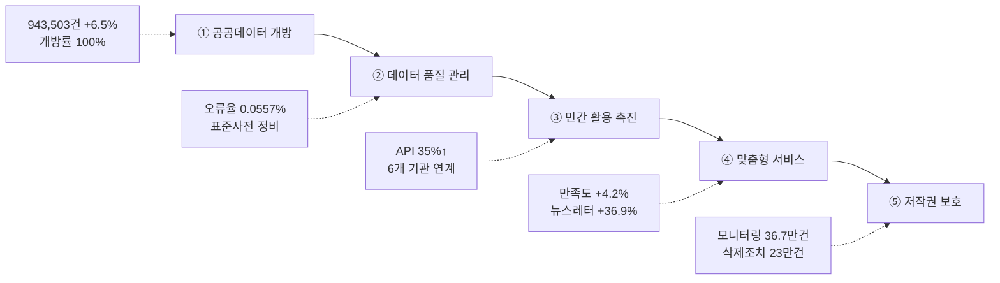

---
{"publish":true,"permalink":"/경영평가/1-12/5_지표작성방안","title":"5_지표 작성 방안","created":"2025-12-14","modified":"2025-12-14T13:41:03.602+09:00","tags":["#경영평가","#공공정보","#국민소통","#비계량","#작성방안","#지표_1-12"],"cssclasses":""}
---


# [1-12 공공정보 개방 및 활용] 세부평가내용 작성 방안

> [!abstract] 문서 개요
> 본 문서는 '1.12 공공정보 개방 및 활용' 지표의 2025년도 경영평가보고서 작성을 위한 논리적 흐름(Storyline)과 문단별 세부 작성 방안을 제안합니다.
> 
> **핵심 목표**: [[25년 경평/2_지표별 자료/1-12_공공정보_개방_및_활용/3_전년도_지적사항_및_개선실적\|전년도 지적사항(C 등급)]]을 극복하고, **'영화통계(KOBIS) 데이터 개방 확대'**와 **'데이터 품질 관리 체계화'**를 통해 목표 등급(B등급 이상)을 달성하는 데 중점을 두었습니다.

---

## 1. Storyline 구성안 비교

### 📌 Option A: 평가요소 순차형 (Sequential)

| 구분 | 내용 |
|------|------|
| **구조** | 공공저작물 개방 → 데이터 개방 및 활용 → 정보공유 및 서비스 |
| **장점** | 편람의 3개 평가요소를 빠짐없이 순서대로 다루기에 용이 |
| **단점** | 단순 나열식으로 보여 핵심 성과인 KOBIS 데이터 개방이 묻힐 수 있음 |
| **적합도** | ⭐⭐ |

```
①공공저작물(Open) → ②데이터(Data) → ③서비스(Service)
```

### 📌 Option B: 데이터 가치 창출형 (Value Creation)

| 구분 | 내용 |
|------|------|
| **구조** | 고품질 데이터 생산 → 전면적 개방 → 민간 활용 지원 → 산업적 가치 창출 |
| **장점** | 영진위가 보유한 영화 데이터의 '산업적 가치'를 강조하기 좋음 |
| **단점** | 공공저작물이나 사전정보공표 등 기본 의무 사항이 소홀해 보일 수 있음 |
| **적합도** | ⭐⭐⭐ |

```
Quality(품질) → Openness(개방) → Usage(활용) → Value(가치)
```

### 📌 Option C: 수요자 맞춤형 개방 (On-Demand)

| 구분 | 내용 |
|------|------|
| **구조** | 수요 조사 → 맞춤형 개방(API/Raw) → 활용 편의성 제고 → 만족도 향상 |
| **장점** | 수요자 중심의 적극 행정 노력을 부각하기 좋음 |
| **단점** | 개방 실적(양적 지표) 확대 노력이 덜 강조될 수 있음 |
| **적합도** | ⭐⭐ |

```
Needs(수요) → Customizing(맞춤) → Convenience(편의)
```

---

## 2. 추천 Storyline (고품질 데이터 개방 및 산업 활용)

> [!tip] 추천 구조
> **"영화통계(KOBIS) 등 핵심 데이터의 품질을 고도화(Quality)하고, 수요자 맞춤형으로 전면 개방(Openness)하여 민간 활용을 극대화"**하는 구조

### 전체 흐름



### 핵심 메시지

> **"KOBIS의 방대한 영화 데이터를 고품질로 개방하여 K-무비 산업 성장을 뒷받침하는 데이터 플랫폼 구현"**

---

## 3. 문단별 작성 방안

### 세부평가내용① 공공정보 개방

#### 문단 1-1: 공공데이터 전면 개방 및 확대

| 항목 | 내용 |
|------|------|
| **Core Message** | KOBIS 데이터 943,503건 개방, 전년 대비 6.5% 증가 |
| **주요 근거** | 공공데이터 개방건수, 개방률 100%, 신규 데이터 등록 |
| **담당 부서** | 디지털혁신팀 |

| 구분 | 실적 | 성과 |
|------|------|------|
| 공공데이터 개방 | **943,503건** | 전년 대비 +6.5% |
| 박스오피스 DB | **650,935건** | +7.5% |
| 영화정보 DB | **108,398건** | +9.4% |
| 영화인 DB | **170,758건** | +1.6% |
| 데이터 등록/개방 | **176건** | 개방률 100% |
| 신규 데이터 | **8건** | 신규 등록 |
| 대국민 설문조사 | **실시** (신규) | 수요 파악 |

> [!example] 추천 스토리라인
> **"공공데이터 개방 확대 필요 → KOBIS 데이터 전면 개방 → 943,503건 달성 → 개방률 100%"**
> 
> - 도입: 영화산업 핵심 데이터(KOBIS) 개방 확대 필요(지적사항 대응)
> - 전개: 박스오피스·영화정보·영화인 DB 전면 개방, 신규 데이터 8건 등록
> - 성과: 공공데이터 943,503건(+6.5%), 개방률 100%, 대국민 설문조사 실시

#### 문단 1-2: 사전정보공표 및 정보공개 확대

| 항목 | 내용 |
|------|------|
| **Core Message** | 보도자료 63건 배포, KOFIC뉴스 129건 게시로 정보 공개 확대 |
| **주요 근거** | 보도자료 배포, KOFIC뉴스 운영, 뉴스레터 |
| **담당 부서** | 홍보협력팀 |

| 구분 | 실적 | 성과 |
|------|------|------|
| 보도자료 배포 | **63건** | 전년 대비 +3.3% |
| 보도자료 인용 | **571건** | 언론 활용 |
| KOFIC뉴스 게시 | **129건** | 11월 기준 |
| KOFIC뉴스 조회수 | **265회** | 전년 대비 +30.5% |
| 뉴스레터 열람수 | **3,632회** | 전년 대비 +36.9% |
| 사업설명회 영상 | **제작** | 온라인 정보 접근 |

> [!example] 추천 스토리라인
> **"사전정보공표 충실화 필요 → 보도자료 63건 → KOFIC뉴스 129건 → 정보 접근성 향상"**
> 
> - 도입: 국민 관심 정보의 선제적 공개 확대 필요(지적사항 대응)
> - 전개: 보도자료 63건 배포, KOFIC뉴스 129건 게시, 사업설명회 영상 제작
> - 성과: KOFIC뉴스 조회수 +30.5%, 뉴스레터 열람수 +36.9%

---

### 세부평가내용② 데이터 개방 및 활용

#### 문단 2-1: 데이터 품질 제고 및 관리 체계화 (핵심 성과)

| 항목 | 내용 |
|------|------|
| **Core Message** | KOBIS 데이터 오류율 0.0557%, 표준사전 정비로 품질 관리 체계화 |
| **주요 근거** | 품질진단 결과, 표준사전 정비, 평가 결과 |
| **담당 부서** | 디지털혁신팀 |

| 구분 | 실적 | 성과 |
|------|------|------|
| KOBIS 품질진단 | **오류율 0.0557%** | 품질 유지 |
| 표준사전 정비 | **KOBIS 개정** ('25.9) | 표준화 완료 |
| ERP 표준사전 | **신규 제정** ('25.9) | 신규 평가 대응 |
| 공공데이터 제공 평가 | **52.02점** | 개선계획 수립 |
| 데이터기반행정 평가 | **82.1점** | +9.8점, 등급 상향 |
| 개방건수 목표 | **990,678건** | 5% 확대 목표 |

> [!example] 추천 스토리라인
> **"데이터 품질 관리 미흡 지적 → 품질진단 정례화 → 표준사전 정비 → 오류율 0.0557%"**
> 
> - 도입: 데이터 표준화 및 정기적 품질 점검으로 고품질 데이터 제공 필요(지적사항 대응)
> - 전개: KOBIS 품질진단, 표준사전 개정·제정, 데이터기반행정 평가 대응
> - 성과: 오류율 0.0557%, 데이터기반행정 평가 +9.8점 등급 상향

#### 문단 2-2: 민간 활용 촉진 및 활성화 지원

| 항목 | 내용 |
|------|------|
| **Core Message** | OPEN-API 발급 35% 증가, 6개 공공기관 + 다수 민간기업 데이터 연계 |
| **주요 근거** | API 발급 현황, 데이터 연계 현황, 이용자 현황 |
| **담당 부서** | 디지털혁신팀 |

| 구분 | 실적 | 성과 |
|------|------|------|
| OPEN-API 발급 | **30,366건** | 전년 대비 +35% |
| 웹/모바일 이용자 | **5,813,268명** | +1.1% |
| 신규 방문수 증가율 | **+9.73%** | 신규 고객 유입 |
| 공공기관 연계 | **6개 기관** | 콘진원, 저작권위 등 |
| 민간 연계 | **다수** | CGV, 네이버, wavve 등 |
| 전송사업자 연동 | **16개** | 신규 1개 추가 |

> [!example] 추천 스토리라인
> **"민간 활용 지원 부족 지적 → OPEN-API 확대 → 35% 증가 → 민간 활용 활성화"**
> 
> - 도입: 오픈 API 확대 및 활용 가이드 제공으로 민간 데이터 활용 장려 필요
> - 전개: OPEN-API 발급 35% 증가, 6개 공공기관 연계, 민간 포털·OTT 연계
> - 성과: 웹/모바일 이용자 581만명, 신규 방문수 +9.73%

---

### 세부평가내용③ 정보공유 및 수요자 맞춤형 서비스

#### 문단 3-1: 수요자 맞춤형 정보 서비스 제공

| 항목 | 내용 |
|------|------|
| **Core Message** | 통전망 홈페이지 만족도 8.10점(+4.2%), 다채널 정보 제공 체계 구축 |
| **주요 근거** | 만족도 조사, SNS 채널, 콘텐츠 다각화 |
| **담당 부서** | 디지털혁신팀, 홍보협력팀 |

| 구분 | 실적 | 성과 |
|------|------|------|
| 통전망 홈페이지 만족도 | **8.10점** | 전년 대비 +4.2% |
| DB서비스 만족도 | **7.8점** | +8% |
| 박스오피스 만족도 | **8.3점** | +5% |
| 인스타그램 팔로워 | **21,750명** | +10.4% |
| 네이버 블로그 이웃 | **1,146명** | +43.8% |
| 유튜브 영상 제작 | **69건** | +19% |
| 숏폼 평균 조회수 | **369회** | +29% |

> [!example] 추천 스토리라인
> **"수요자 맞춤형 서비스 필요 → 다채널 정보 제공 → 만족도 +4.2% → 접근성 향상"**
> 
> - 도입: 이용자 편의성을 고려한 맞춤형 정보 제공 및 접근성 개선 필요
> - 전개: 통전망 만족도 조사, SNS 채널 확대, 콘텐츠 다각화
> - 성과: 만족도 +4.2%, 인스타그램 +10.4%, 블로그 +43.8%

#### 문단 3-2: 홈페이지 기능 개선 및 접근성 향상

| 항목 | 내용 |
|------|------|
| **Core Message** | 대표홈페이지 6건 개선, 개인정보 보호 강화 |
| **주요 근거** | 기능 개선 실적, 개인정보 보호 조치 |
| **담당 부서** | 디지털혁신팀 |

| 구분 | 실적 | 성과 |
|------|------|------|
| 콘텐츠 현행화 | **2025.1.** | 부서별 담당 페이지 반영 |
| 개인정보 비공개 | **2025.2.** | 국민제안/묻고답하기 |
| 해외 거주자 가입 | **2025.2.** | 방법 마련·안내 |
| 지원사업 마감 기능 | **2025.4.** | 기능 개선 |
| 성평등센터 페이지 | **2025.9.** | 안내페이지 생성 |
| 대표번호 운영시간 | **2025.11.** | 표기 기재 |

> [!example] 추천 스토리라인
> **"정보 접근성 개선 필요 → 홈페이지 기능 개선 6건 → 개인정보 보호 강화 → 편의성 향상"**
> 
> - 도입: 홈페이지 기능 개선 및 개인정보 보호 강화 필요
> - 전개: 콘텐츠 현행화, 개인정보 비공개 설정, 지원사업 마감 기능 개선
> - 성과: 대표홈페이지 6건 개선, 개인정보 보호 강화

---

### 세부평가내용④ 저작권 보호 (특화 성과)

#### 문단 4-1: 영화 온라인 불법유통 대응

| 항목 | 내용 |
|------|------|
| **Core Message** | 모니터링 367,059건, 삭제조치 230,149건으로 저작권 보호 |
| **주요 근거** | 모니터링 실적, 삭제조치, 협력 체계 |
| **담당 부서** | 공정환경조성팀 |

| 구분 | 실적 | 성과 |
|------|------|------|
| 모니터링 | **367,059건** | 전년 대비 +18% |
| 삭제조치 | **230,149건** | 권리자 보호 |
| 참여작품 | **1,295편** | 전년 대비 +50% |
| 모니터링 대상 사이트 | **692개** | +60개 |
| 중화권 모니터링 | **100개** | +40개 |
| 동남아 모니터링 | **143,261건** | +43% |
| 저작권보호원 MOU | **12월 체결** | 공동 대응 체계 |
| 피해예방 효과 | **16,145%** | 집행예산 대비 |

> [!example] 추천 스토리라인
> **"저작권 보호 필요 → 모니터링 36.7만건 → 삭제조치 23만건 → 피해예방 16,145%"**
> 
> - 도입: 영화 온라인 불법유통 대응 및 저작권 보호 필요
> - 전개: 모니터링 367,059건, 중화권·동남아 확대, 숏폼·폐쇄형 SNS 신규 대응
> - 성과: 삭제조치 230,149건, 저작권보호원 MOU 체결, 피해예방 효과 16,145%


---

## 4. 문단 구성 요약

| 문단 | 핵심 주제 | 담당 부서 | 핵심 성과 |
|------|----------|----------|----------|
| **1-1** | 공공데이터 전면 개방 | 디지털혁신팀 | 943,503건 +6.5%, 개방률 100% |
| **1-2** | 사전정보공표 및 정보공개 | 홍보협력팀 | 보도자료 63건, 뉴스레터 +36.9% |
| **2-1** | 데이터 품질 관리 체계화 | 디지털혁신팀 | 오류율 0.0557%, 평가 +9.8점 |
| **2-2** | 민간 활용 촉진 | 디지털혁신팀 | API +35%, 6개 기관 연계 |
| **3-1** | 수요자 맞춤형 서비스 | 디지털혁신팀, 홍보협력팀 | 만족도 +4.2%, 인스타 +10.4% |
| **3-2** | 홈페이지 기능 개선 | 디지털혁신팀 | 6건 개선, 개인정보 보호 |
| **4-1** | 저작권 보호 (특화) | 공정환경조성팀 | 모니터링 36.7만건, 삭제 23만건 |

---

## 5. 차별화 포인트

### 📌 편람 대응 전략

| 평가요소 | 편람 요구사항 | 대응 전략 |
|---------|-------------|----------|
| ① 공공정보 개방 | 공공저작물·데이터 개방 | 943,503건 +6.5% + 개방률 100% + 신규 8건 |
| ① 사전정보공표 | 정보공개 실적 | 보도자료 63건 + KOFIC뉴스 129건 + 뉴스레터 +36.9% |
| ② 데이터 품질 | 품질 관리 체계 | 오류율 0.0557% + 표준사전 정비 + 평가 +9.8점 |
| ② 민간 활용 | 활용 촉진 지원 | API +35% + 6개 기관 연계 + 581만명 이용 |
| ③ 맞춤형 서비스 | 수요자 맞춤 정보 | 만족도 +4.2% + SNS +10.4% + 홈페이지 6건 개선 |
| ④ 저작권 보호 | 특화 성과 | 모니터링 36.7만건 + 삭제 23만건 + MOU 체결 |

### 📌 전년도 C등급 개선 전략

| 지적사항 | 개선 내용 |
|---------|----------|
| 공공데이터 개방 확대 필요 | 943,503건 개방 (+6.5%), 개방률 100% |
| 사전정보공표 충실화 필요 | 보도자료 63건, KOFIC뉴스 129건, 뉴스레터 +36.9% |
| 공공데이터 품질 제고 필요 | 오류율 0.0557%, 표준사전 정비, 평가 +9.8점 |

### 📌 영화산업 데이터 허브(Data Hub)

```
[공공데이터 개방]                   [민간 활용 촉진]
943,503건 (+6.5%) ─────────────→ OPEN-API 35%↑
개방률 100% ───────────────────→ 6개 공공기관 연계
신규 데이터 8건 ────────────────→ 민간 포털·OTT 연계
                    ↓
            [품질 관리 체계]
            오류율 0.0557%
            표준사전 정비
            데이터기반행정 +9.8점
```

---

## 6. 핵심 정량 데이터 Quick Reference

### 📊 공공데이터 개방 (디지털혁신팀)

| 지표 | 수치 | 비고 |
|------|------|------|
| 공공데이터 개방 | **943,503건** | +6.5% |
| 박스오피스 DB | **650,935건** | +7.5% |
| 영화정보 DB | **108,398건** | +9.4% |
| 영화인 DB | **170,758건** | +1.6% |
| 데이터 등록/개방 | **176건** | 개방률 100% |
| 신규 데이터 | **8건** | 신규 등록 |

### 📊 데이터 품질 관리 (디지털혁신팀)

| 지표 | 수치 | 비고 |
|------|------|------|
| KOBIS 품질진단 | **오류율 0.0557%** | 품질 유지 |
| 표준사전 정비 | **KOBIS 개정** | '25.9 완료 |
| ERP 표준사전 | **신규 제정** | '25.9 완료 |
| 공공데이터 제공 평가 | **52.02점** | 개선계획 수립 |
| 데이터기반행정 평가 | **82.1점** | +9.8점, 등급 상향 |

### 📊 민간 활용 촉진 (디지털혁신팀)

| 지표 | 수치 | 비고 |
|------|------|------|
| OPEN-API 발급 | **30,366건** | +35% |
| 웹/모바일 이용자 | **5,813,268명** | +1.1% |
| 신규 방문수 증가율 | **+9.73%** | 신규 고객 유입 |
| 공공기관 연계 | **6개 기관** | 콘진원, 저작권위 등 |
| 전송사업자 연동 | **16개** | 신규 1개 추가 |

### 📊 정보공개 및 소통 (홍보협력팀)

| 지표 | 수치 | 비고 |
|------|------|------|
| 보도자료 배포 | **63건** | +3.3% |
| 보도자료 인용 | **571건** | 언론 활용 |
| KOFIC뉴스 게시 | **129건** | 11월 기준 |
| KOFIC뉴스 조회수 | **265회** | +30.5% |
| 뉴스레터 열람수 | **3,632회** | +36.9% |
| 인스타그램 팔로워 | **21,750명** | +10.4% |
| 네이버 블로그 이웃 | **1,146명** | +43.8% |

### 📊 저작권 보호 (공정환경조성팀)

| 지표 | 수치 | 비고 |
|------|------|------|
| 모니터링 | **367,059건** | +18% |
| 삭제조치 | **230,149건** | 권리자 보호 |
| 참여작품 | **1,295편** | +50% |
| 모니터링 대상 사이트 | **692개** | +60개 |
| 중화권 모니터링 | **100개** | +40개 |
| 동남아 모니터링 | **143,261건** | +43% |
| 저작권보호원 MOU | **12월 체결** | 공동 대응 |
| 피해예방 효과 | **16,145%** | 집행예산 대비 |

### 📊 만족도 조사 (디지털혁신팀)

| 지표 | 수치 | 비고 |
|------|------|------|
| 통전망 홈페이지 만족도 | **8.10점** | +4.2% |
| DB서비스 만족도 | **7.8점** | +8% |
| 박스오피스 만족도 | **8.3점** | +5% |
| 통계서비스 만족도 | **8.1점** | +4% |
| 서비스 내용·품질 | **8.3점** | +8% |

---

## 7. 작성 시 유의사항

### ✅ 강조할 점

1. **공공데이터 개방 확대**: 943,503건(+6.5%), 개방률 100%, 신규 8건
2. **데이터 품질 관리**: 오류율 0.0557%, 표준사전 정비, 평가 +9.8점 등급 상향
3. **민간 활용 촉진**: OPEN-API +35%, 6개 공공기관 연계, 581만명 이용
4. **정보공개 확대**: 보도자료 63건, KOFIC뉴스 129건, 뉴스레터 +36.9%
5. **만족도 향상**: 통전망 +4.2%, 인스타그램 +10.4%, 블로그 +43.8%
6. **저작권 보호**: 모니터링 36.7만건, 삭제조치 23만건, MOU 체결

### ⚠️ 주의할 점

1. 전년도 C등급 지적사항(개방 확대, 품질 관리) 개선 노력 명확히 서술
2. 공공데이터 개방 실적뿐만 아니라 '품질 관리' 노력 반드시 기술
3. 정량적 성과(+6.5%, +35%, +4.2% 등) 적극 활용

### 📝 편람 키워드 체크리스트

- [x] 공공저작물(공공누리) 개방실적
- [x] 사전정보공표 실적
- [x] 정보공개 실적
- [x] 공공데이터 개방 및 활용
- [x] 데이터 품질 관리
- [x] 민간 활용 촉진
- [x] 수요자 맞춤형 서비스
- [x] 정보 접근성 개선
- [x] 문화정보화 수준 향상

---

## 관련 자료

| 구분 | 문서명 | 링크 |
|------|--------|------|
| 편람 분석 | 편람 내용 분석 | [바로가기](/경영평가/1-12/2_편람내용분석) |
| 지적사항 | 전년도 지적사항 및 개선실적 | [바로가기](/경영평가/1-12/3_전년도지적사항) |
| 부서 실적 | 디지털혁신팀 실적 분석 | [바로가기](/부서성과평가/1-5-2/디지털혁신팀) |
| 부서 실적 | 공정환경조성팀 실적 분석 | [바로가기](/부서성과평가/1-5-2/공정환경조성팀) |
| 부서 실적 | 홍보협력팀 실적 분석 | [바로가기](/부서성과평가/1-5-2/홍보협력팀) |

---

*작성일: 2025-12-14*
*검증상태: 부서실적 대조 완료*
