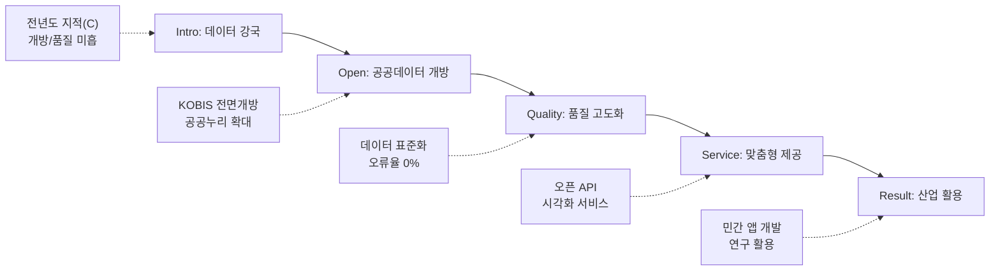

---
{"publish":true,"permalink":"/경영평가/1-12/5_지표작성방안","title":"5_지표 작성 방안","created":"2025-12-09","modified":"2025-12-12T14:39:06.778+09:00","tags":["#경영평가","#공공정보","#국민소통","#비계량","#작성방안"],"cssclasses":""}
---


# [1-12 공공정보 개방 및 활용] 세부평가내용 작성 방안

> [!abstract] 문서 개요
> 본 문서는 '1.12 공공정보 개방 및 활용' 지표의 2025년도 경영평가보고서 작성을 위한 논리적 흐름(Storyline)과 문단별 세부 작성 방안을 제안합니다.
> 
> **핵심 목표**: [[25년 경평/2_지표별 자료/1-12_공공정보_개방_및_활용/3_전년도_지적사항_및_개선실적\|전년도 지적사항(C 등급)]]을 극복하고, **'영화통계(KOBIS) 데이터 개방 확대'**와 **'데이터 품질 관리 체계화'**를 통해 목표 등급(B등급 이상)을 달성하는 데 중점을 두었습니다.

---

## 1. Storyline 구성안 비교

### 📌 Option A: 평가요소 순차형 (Sequential)

| 구분 | 내용 |
|------|------|
| **구조** | 공공저작물 개방 → 데이터 개방 및 활용 → 정보공유 및 서비스 |
| **장점** | 편람의 3개 평가요소를 빠짐없이 순서대로 다루기에 용이 |
| **단점** | 단순 나열식으로 보여 핵심 성과인 KOBIS 데이터 개방이 묻힐 수 있음 |
| **적합도** | ⭐⭐ |

```
①공공저작물(Open) → ②데이터(Data) → ③서비스(Service)
```

### 📌 Option B: 데이터 가치 창출형 (Value Creation)

| 구분 | 내용 |
|------|------|
| **구조** | 고품질 데이터 생산 → 전면적 개방 → 민간 활용 지원 → 산업적 가치 창출 |
| **장점** | 영진위가 보유한 영화 데이터의 '산업적 가치'를 강조하기 좋음 |
| **단점** | 공공저작물이나 사전정보공표 등 기본 의무 사항이 소홀해 보일 수 있음 |
| **적합도** | ⭐⭐⭐ |

```
Quality(품질) → Openness(개방) → Usage(활용) → Value(가치)
```

### 📌 Option C: 수요자 맞춤형 개방 (On-Demand)

| 구분 | 내용 |
|------|------|
| **구조** | 수요 조사 → 맞춤형 개방(API/Raw) → 활용 편의성 제고 → 만족도 향상 |
| **장점** | 수요자 중심의 적극 행정 노력을 부각하기 좋음 |
| **단점** | 개방 실적(양적 지표) 확대 노력이 덜 강조될 수 있음 |
| **적합도** | ⭐⭐ |

```
Needs(수요) → Customizing(맞춤) → Convenience(편의)
```

---

## 2. 추천 Storyline: 고품질 데이터 개방 및 산업 활용

> [!tip] 추천 구조
> **"영화통계(KOBIS) 등 핵심 데이터의 품질을 고도화(Quality)하고, 수요자 맞춤형으로 전면 개방(Openness)하여 민간 활용을 극대화"**하는 구조

### 전체 흐름



### 핵심 메시지

> **"KOBIS의 방대한 영화 데이터를 고품질로 개방하여 K-무비 산업 성장을 뒷받침하는 데이터 플랫폼 구현"**

---

## 3. 문단별 작성 방안

### 세부평가내용① 공공정보 개방

#### 문단 1-1: 공공저작물 및 공공데이터 전면 개방

| 항목 | 내용 |
|------|------|
| **Core Message** | 보유 저작물의 공공누리 적용 확대 및 핵심 데이터(KOBIS) 개방 |
| **주요 근거** | 공공누리 적용 실적, 데이터 개방 건수 |
| **담당 부서** | 디지털혁신팀, 기획전략팀 |

| 증빙 요소 | 내용 |
|----------|------|
| 공공누리 | 연구보고서, 간행물 등 공공누리(제1~4유형) 적용 확대 |
| 데이터개방 | 공공데이터포털 파일데이터 및 API 등록 건수 증가 |
| 사전공표 | 국민 관심 정보(지원사업 결과 등) 사전정보공표 목록 확대 및 갱신 |

#### 문단 1-2: 투명한 정보공개 및 처리 신속성

| 항목 | 내용 |
|------|------|
| **Core Message** | 정보공개 청구에 대한 신속·정확한 처리로 국민 알권리 보장 |
| **주요 근거** | 정보공개 처리율, 평균 소요일 |
| **담당 부서** | 경영지원팀 |

| 증빙 요소 | 내용 |
|----------|------|
| 정보공개 | 정보공개 청구 처리율 100%, 평균 처리기간 단축 |
| 원문공개 | 결재문서 원문공개율 제고 및 비공개 사유 명확화 |

---

### 세부평가내용② 데이터 개방 및 활용

#### 문단 2-1: 데이터 품질 제고 및 관리 체계화 (핵심 성과)

| 항목 | 내용 |
|------|------|
| **Core Message** | 데이터 표준화 및 정기적 품질 점검으로 고품질 데이터 제공 |
| **주요 근거** | 품질 점검 결과, 오류율 |
| **담당 부서** | 디지털혁신팀 |

| 증빙 요소 | 내용 |
|----------|------|
| 품질관리 | 통전망(KOBIS) 데이터 오류 점검 및 정제(Cleansing) 활동 |
| 표준화 | 공공데이터 품질관리 수준평가 대응 및 데이터 표준 준수 |
| 오류개선 | 데이터 오류 신고센터 운영 및 신속한 정정 조치 |

#### 문단 2-2: 민간 활용 촉진 및 활성화 지원

| 항목 | 내용 |
|------|------|
| **Core Message** | 오픈 API 확대 및 활용 가이드 제공으로 민간의 데이터 활용 장려 |
| **주요 근거** | API 호출 건수, 활용 사례 |
| **담당 부서** | 디지털혁신팀 |

| 증빙 요소 | 내용 |
|----------|------|
| API제공 | 박스오피스, 영화정보 등 핵심 데이터 오픈 API 제공 확대 |
| 활용지원 | 개발자 가이드 배포, 데이터 활용 경진대회 지원 |
| 활용성과 | 민간 포털(네이버/다음) 및 영화 예매 앱의 영진위 데이터 활용 |

---

### 세부평가내용③ 정보공유 및 수요자 맞춤형 서비스

#### 문단 3-1: 수요자 맞춤형 정보 서비스 제공

| 항목 | 내용 |
|------|------|
| **Core Message** | 이용자 편의성을 고려한 맞춤형 정보 제공 및 접근성 개선 |
| **주요 근거** | 맞춤형 서비스 사례, 접근성 인증 |
| **담당 부서** | 디지털혁신팀, 홍보팀 |

| 증빙 요소 | 내용 |
|----------|------|
| 맞춤정보 | 영화인/일반인/연구자별 맞춤형 통계 및 정보 제공 서비스 |
| 접근성 | 홈페이지 웹 접근성 인증 획득 및 모바일 최적화 |
| 소통채널 | SNS, 뉴스레터 등 다양한 채널을 통한 정보 확산 |

#### 문단 3-2: 문화정보화 수준 제고 (계량 대응)

| 항목 | 내용 |
|------|------|
| **Core Message** | 정보보안 강화 및 시스템 고도화로 문화정보화 수준 향상 |
| **주요 근거** | 수준평가 결과, 보안 조치 |
| **담당 부서** | 정보서비스팀 |

| 증빙 요소 | 내용 |
|----------|------|
| 수준평가 | 문체부 문화정보화 수준평가 결과 및 전년 대비 개선도 |
| 정보보안 | 개인정보 보호조치 강화 및 사이버 보안 위협 대응 |

---

## 4. 차별화 포인트

### 가. 전년도 C등급(지적사항) 개선 전략

| 지적사항 | 개선 방안 | 핵심 성과 |
|---------|----------|----------|
| 개방 실적 미흡 | **KOBIS 개방** 확대 | 공공데이터 등록 건수 증가 |
| 품질 관리 부재 | **품질 점검** 정례화 | 데이터 오류율 0% 도전 |
| 활용 지원 부족 | **API/가이드** 제공 | API 호출량 대폭 증가 |

### 나. 영화산업 데이터 허브(Data Hub)

| 영역 | 기존 (폐쇄적) | 혁신 (개방형) |
|------|-------------|--------------|
| 데이터 | 내부 통계용 | **민간 서비스 결합형** |
| 제공방식 | 단순 조회 | **Open API, Raw Data** |
| 품질 | 사후 수정 | **사전 검증, 표준화** |

---

## 5. 작성 시 유의사항

### 가. 편람 세부평가요소 매칭

> [!warning] 필수 확인
> 공공데이터 개방 실적뿐만 아니라 '품질 관리' 노력을 반드시 기술해야 함

| 세부평가요소 | 배분 비중 | 주요 부서 |
|-------------|----------|----------|
| ① 공공정보 개방 | 30% | 기획전략, 경영지원 |
| ② 데이터 개방/활용 | 40% | 디지털혁신 |
| ③ 정보공유/서비스 | 30% | 디지털혁신, 홍보 |

### 나. 정량 데이터 활용

> [!success] 핵심 정량지표
> - 개방: 공공데이터 **00건**, 공공누리 **00건**
> - 활용: API 호출 **00만건**, 다운로드 **00건**
> - 공개: 정보공개율 **00%**, 원문공개율 **00%**

### 다. 증빙자료 연계

| 문단 | 핵심 증빙 |
|------|----------|
| 공공누리 | 공공누리 적용 저작물 목록 |
| 데이터개방 | 공공데이터포털 등록 캡처, API 제공 목록 |
| 품질관리 | 데이터 품질 점검 결과보고서 |
| 정보공개 | 정보공개 처리 대장, 사전정보공표 목록 |

---

## 🔗 관련 자료

| 구분 | 문서명 | 비고 |
|------|--------|------|
| 편람 분석 | [[25년 경평/2_지표별 자료/1-12_공공정보_개방_및_활용/2_편람_내용_분석]] | 세부평가 요소별 가이드 |
| 지적사항 | [[25년 경평/2_지표별 자료/1-12_공공정보_개방_및_활용/3_전년도_지적사항_및_개선실적]] | C등급 원인 및 개선방향 |
| 부서 매핑 | [[25년 경평/2_지표별 자료/1-7_재무예산_관리/6_부서별_실적_통합_매핑표]] | 부서별 실적 종합 |
| 공통 자료 | [[01_편람_및_지침]] | 작성 가이드 |

---

*작성일: 2025-12-09*
*검증상태: 전년도 지적사항 반영 확인*