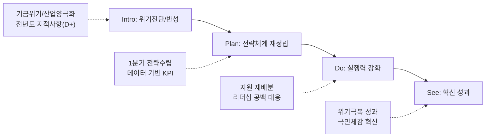

---
{"publish":true,"permalink":"경영평가/경영전략/지표작성방안","title":"1-1 경영 비전 실행 전략 및 노력 지표 작성 방안","created":"2025-05-13","modified":"2025-12-12T14:05:53.548+09:00","tags":["#경영평가","#전략기획","#비계량","#작성방안"],"cssclasses":""}
---


# [1-1 경영 비전 실행 전략 및 노력] 세부평가내용 작성 방안

> [!abstract] 문서 개요
> 본 문서는 '1.1 경영 비전 실행 전략 및 노력' 지표의 2025년도 경영평가보고서 작성을 위한 논리적 흐름(Storyline)과 문단별 세부 작성 방안을 제안합니다.
> 
> **핵심 목표**: [[25년 경평/2_지표별 자료/1-1_경영_비전_실행_전략_및_노력/3_전년도_지적사항_및_개선실적\|전년도 지적사항(D+ 등급)]]을 완벽히 극복하고, **'영화발전기금 위기'**와 **'산업 양극화'**라는 대내외 환경 변화에 대한 **전략적 대응(Selection & Concentration)**을 부각하여 목표 등급(B+ 이상)을 달성하는 데 중점을 두었습니다.

---

## 1. Storyline 구성안 비교

### 📌 Option A: 프로세스 중심 (Process-Oriented)

| 구분 | 내용 |
|------|------|
| **구조** | 환경분석 → 전략수립 → 실행체계 → 성과점검 → 환류 |
| **장점** | 편람의 평가체계(P-D-C-A)에 가장 충실하며 논리적 완결성 높음 |
| **단점** | 위기 대응의 긴박함이 묻히고 평이하게 보일 우려 |
| **적합도** | ⭐⭐ |

```
환경분석 → 전략수립(Plan) → 실행체계(Do) → 성과점검(Check) → 환류(Act)
```

### 📌 Option B: 위기극복/이슈 해결 중심 (Problem-Solving)

| 구분 | 내용 |
|------|------|
| **구조** | 위기진단(기금/산업) → 비상경영 전략 → 자원 집중투입 → 체질개선 |
| **장점** | 기금 고갈 등 현 위기 상황과 기관의 치열한 '노력'을 강조하기 좋음 |
| **단점** | 편람에서 요구하는 '비전체계의 일반적 수립 절차' 기술이 소홀해 보일 수 있음 |
| **적합도** | ⭐⭐⭐ |

```
위기진단 → 비상전략수립 → 자원집중 → 체질개선 및 성과
```

### 📌 Option C: 지적사항 개선 중심 (Feedback-Response)

| 구분 | 내용 |
|------|------|
| **구조** | 전년도 한계(지적사항) → 개선조치(시기/논리) → 전략체계 가동 → 변화 |
| **장점** | D+ 등급 만회를 위한 '개선 실적'을 가장 명확히 드러냄 |
| **단점** | 기관의 본원적 미션보다 '평가 대응'에만 급급했다는 인상을 줄 우려 |
| **적합도** | ⭐⭐ |

```
전년도 지적 → 개선조치 → 新전략체계 가동 → 실질적 변화
```

---

## 2. 추천 Storyline (개선 기반의 위기극복)

> [!tip] 추천 구조
> **전년도 지적사항(논리성/시기)을 완벽히 보완한 체계** 위에서, **위기(기금/산업)를 극복하는 전략을 실행**했다는 서사

### 전체 흐름



### 핵심 메시지

> **"전년도 지적사항을 완벽히 보완하여 1분기에 전략을 수립하고, 기금 위기 속에서도 선택과 집중으로 성과 창출"**

---

## 3. 문단별 작성 방안

### 세부평가내용① 비전·경영목표·경영전략 수립 및 이행

#### 문단 1-1: 설립목적 기반의 전략체계 고도화 (지적사항 이행)

| 항목 | 내용 |
|------|------|
| **Core Message** | 법적 설립목적을 계승하되, '기금 고갈'과 '산업 양극화' 위기를 반영하여 비전 재해석 |
| **주요 근거** | 핵심 이슈(Key Issue) 3가지, '24년 1분기 내 환경분석 완료 |
| **담당 부서** | 기획전략팀 |

| 증빙 요소 | 내용 |
|----------|------|
| 환경분석 | 단순 나열 지양 → 핵심 이슈(재원절벽, OTT성장) 도출 |
| 시기조정 | 전략 수립 시점을 '연초(1분기)'로 앞당겨 명시 (지적사항 해소) |
| 적합성 | New 비전/핵심가치 적합성 진단 결과 (수치화) |

#### 문단 1-2: 데이터 기반의 과학적 목표 설정

| 항목 | 내용 |
|------|------|
| **Core Message** | 데이터 기반의 과학적 비전·목표 설정으로 객관성 확보 |
| **주요 근거** | 경영목표 KPI 설정 근거(추세선, 벤치마킹) |
| **담당 부서** | 기획전략팀 |

| 증빙 요소 | 내용 |
|----------|------|
| 목표설정 | KPI 목표치 설정 근거 도표화 (지적사항 해소) |
| 연계성 | 비전-목표-전략과제 간 논리적 연계성 매핑 |

#### 문단 1-3: 전략과제 중심의 자원 배분

| 항목 | 내용 |
|------|------|
| **Core Message** | 수립된 전략이 구호에 그치지 않도록 예산·인력을 전략과제 중심으로 재편 |
| **주요 근거** | 핵심과제 예산 비중 확대, 인력 재배치 |
| **담당 부서** | 기획전략팀, 경영지원팀 |

| 증빙 요소 | 내용 |
|----------|------|
| 예산배분 | 긴축 재정 속 핵심과제 예산 비중 확대 실적 |
| 인력운영 | 전략부서 인력 우선 배치, TF 구성 등 |
| 리더십 | 기관장 공백 시 직무대행 체계 및 의사결정 매뉴얼 가동 |

---

### 세부평가내용② 경영혁신 및 경영성과 개선

#### 문단 2-1: 위기 극복을 위한 능동적 경영혁신

| 항목 | 내용 |
|------|------|
| **Core Message** | 관행적인 행정 절차를 수요자(영화인) 관점에서 과감히 개선 |
| **주요 근거** | 적극행정 사례, 규제개선 실적 |
| **담당 부서** | 기획전략팀, 사업부서 |

| 증빙 요소 | 내용 |
|----------|------|
| 적극행정 | 중예산 지원사업 신설 과정의 규정 개정 |
| 규제개선 | 불필요한 제출 서류 감축, 정산 절차 간소화 |
| 서비스혁신 | 디지털 자산(KOBIS) 활용 대국민 서비스 질 제고 |

#### 문단 2-2: 성과 점검 및 환류(Feedback)

| 항목 | 내용 |
|------|------|
| **Core Message** | 체계적인 성과관리(PDCA) 및 전년도 지적사항 100% 이행 |
| **주요 근거** | 경영목표 달성도 점검, 지적사항 조치결과 |
| **담당 부서** | 기획전략팀 |

| 증빙 요소 | 내용 |
|----------|------|
| 성과관리 | 분기별 경영목표 달성도 점검 회의 및 조치 |
| 지적사항 | 전략시점, KPI근거, 공백대응 등 조치결과 요약표 |
| 환류계획 | 2025년도 전략 수립을 위한 환류 계획 |

---

## 4. 차별화 포인트

### 가. 전년도 D+등급(지적사항) 개선 전략

| 지적사항 | 개선 방안 | 핵심 성과 |
|---------|----------|----------|
| 전략수립 시기 부적절(연말) | **1분기 내** 전략체계 확정 | 연초 수립된 전략에 따른 실행 |
| 비전/목표 객관성 부족 | **데이터 기반** 진단 및 목표설정 | 적합도 진단결과, KPI 산출근거 명시 |
| 전략-과제 연계성 미흡 | **매핑표** 작성 및 논리 보강 | 비전-전략-과제 일관성 확보 |

### 나. 위기(Crisis)를 기회로

| 영역 | 위기 요인 | 대응 전략 |
|------|----------|----------|
| 재무 | 영화발전기금 고갈 위기 | **선택과 집중**, 재원 효율화 |
| 산업 | 양극화 심화, 투자 위축 | **중예산 영화** 집중 지원 전략 |

---

## 5. 작성 시 유의사항

### 가. 논리적 완결성 점검

> [!warning] 필수 확인
> [환경분석 결과]와 [도출된 전략과제]가 논리적으로 1:1 대응이 되는지 확인하십시오. 환경은 'A'라고 분석해놓고 전략은 엉뚱한 'B'를 내세우면 감점 요인입니다.

### 나. 정량 데이터 활용

> [!success] 증빙 강화
> "노력했다", "제고했다"는 표현보다는 **"00회를 개최하여 000명이 참여했고, 만족도가 0.0점 상승했다"**는 식의 정량적 기술이 필수적입니다.

## 🔗 관련 자료

| 구분 | 문서명 | 비고 |
|------|--------|------|
| 편람 분석 | [[25년 경평/2_지표별 자료/1-1_경영_비전_실행_전략_및_노력/2_편람_내용_분석]] | 세부평가 요소별 가이드 |
| 지적사항 | [[25년 경평/2_지표별 자료/1-1_경영_비전_실행_전략_및_노력/3_전년도_지적사항_및_개선실적]] | D+등급 원인 및 개선방향 |
| 부서 매핑 | [[25년 경평/2_지표별 자료/1-1_경영_비전_실행_전략_및_노력/6_부서별_실적_통합_매핑표]] | 부서별 실적 종합 |
| 목차안 | [[25년 경평/2_지표별 자료/1-1_경영_비전_실행_전략_및_노력/1_목차_구성안]] | 전체 목차 구조 |

---

*작성일: 2025-05-13*
*검증상태: 전년도 지적사항 반영 확인*