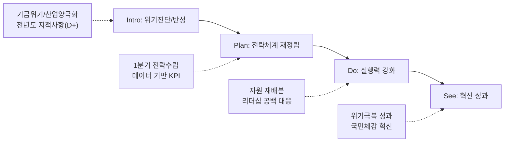

---
{"publish":true,"permalink":"/경영평가/1-1/5_지표작성방안","title":"5_지표 작성 방안","created":"2025-05-13","modified":"2025-12-17T11:02:14.192+09:00","tags":["#경영평가","#전략기획","#비계량","#작성방안"],"cssclasses":""}
---


# [1-1 경영 비전 실행 전략 및 노력] 세부평가내용 작성 방안

> [!abstract] 문서 개요
> 본 문서는 '1.1 경영 비전 실행 전략 및 노력' 지표의 2025년도 경영평가보고서 작성을 위한 논리적 흐름(Storyline)과 문단별 세부 작성 방안을 제안합니다.
> 
> **핵심 목표**: [[25년 경평/2_지표별 자료/1-1_경영_비전_실행_전략_및_노력/3_전년도_지적사항_및_개선실적\|전년도 지적사항(D+ 등급)]]을 완벽히 극복하고, **'영화발전기금 위기'**와 **'산업 양극화'**라는 대내외 환경 변화에 대한 **전략적 대응(Selection & Concentration)**을 부각하여 목표 등급(B+ 이상)을 달성하는 데 중점을 두었습니다.

---

## 1. Storyline 구성안 비교

### 📌 Option A: 프로세스 중심 (Process-Oriented)

| 구분 | 내용 |
|------|------|
| **구조** | 환경분석 → 전략수립 → 실행체계 → 성과점검 → 환류 |
| **장점** | 편람의 평가체계(P-D-C-A)에 가장 충실하며 논리적 완결성 높음 |
| **단점** | 위기 대응의 긴박함이 묻히고 평이하게 보일 우려 |
| **적합도** | ⭐⭐ |

```
환경분석 → 전략수립(Plan) → 실행체계(Do) → 성과점검(Check) → 환류(Act)
```

### 📌 Option B: 위기극복/이슈 해결 중심 (Problem-Solving)

| 구분 | 내용 |
|------|------|
| **구조** | 위기진단(기금/산업) → 비상경영 전략 → 자원 집중투입 → 체질개선 |
| **장점** | 기금 고갈 등 현 위기 상황과 기관의 치열한 '노력'을 강조하기 좋음 |
| **단점** | 편람에서 요구하는 '비전체계의 일반적 수립 절차' 기술이 소홀해 보일 수 있음 |
| **적합도** | ⭐⭐⭐ |

```
위기진단 → 비상전략수립 → 자원집중 → 체질개선 및 성과
```

### 📌 Option C: 지적사항 개선 중심 (Feedback-Response)

| 구분 | 내용 |
|------|------|
| **구조** | 전년도 한계(지적사항) → 개선조치(시기/논리) → 전략체계 가동 → 변화 |
| **장점** | D+ 등급 만회를 위한 '개선 실적'을 가장 명확히 드러냄 |
| **단점** | 기관의 본원적 미션보다 '평가 대응'에만 급급했다는 인상을 줄 우려 |
| **적합도** | ⭐⭐ |

```
전년도 지적 → 개선조치 → 新전략체계 가동 → 실질적 변화
```

---

## 2. 추천 Storyline (개선 기반의 위기극복)

> [!tip] 추천 구조
> **전년도 지적사항(논리성/시기)을 완벽히 보완한 체계** 위에서, **위기(기금/산업)를 극복하는 전략을 실행**했다는 서사

### 전체 흐름



### 핵심 메시지

> **"전년도 지적사항을 완벽히 보완하여 1분기에 전략을 수립하고, 기금 위기 속에서도 선택과 집중으로 성과 창출"**

---

## 3. 문단별 작성 방안

### 세부평가내용① 비전·경영목표·경영전략 수립 및 이행

#### 문단 1-1: 설립목적 기반의 전략체계 고도화 (지적사항 이행)

| 항목 | 내용 |
|------|------|
| **Core Message** | 법적 설립목적을 계승하되, '기금 고갈'과 '산업 양극화' 위기를 반영, **국정과제 연계** 비전 재해석 |
| **주요 근거** | 4대 전략방향-12대 전략과제-27개 실행과제 체계화, 9월 조기 확정, K-컬처 전략산업화 연계 |
| **담당 부서** | 기획전략팀 |

> [!success] 국정과제 연계
> **"K-콘텐츠의 국가전략산업화"** → 위원회 추진목표: **"K무비 공감 확산"**, 영화·영상 종합 지원기구 도약

| 구분      | 실적                                          | 성과                 |
| ------- | ------------------------------------------- | ------------------ |
| 전략체계 수립 | 4대 전략방향, 12대 전략과제, **27개 실행과제** 도출          | 전략-실행 연계성 강화       |
| 수립 시기   | **2025년 9월** 경영전략체계 확정                      | 전년도 지적사항(연말 수립) 개선 |
| 환경분석    | 4가지 혁신적 분석 방법론 도입 (STEEP, 시나리오 플래닝, PBMC 등) | 데이터 기반 전략 수립       |
| 비전 재정립  | "K-무비의 변화와 도약을 함께하는 파트너"                    | 설립목적 기반 비전 재해석     |
| 국정과제 연계 | K-컬처 전략산업화 → 영화산업 위기극복, 글로벌 경쟁력 강화 | 정부 정책방향 적극 반영 |

> [!example] 추천 스토리라인
> **"전년도 지적사항(전략수립 시기 부적절) 개선 → 6~9월 단계별 전략 수립 → 4대 전략방향-12대 전략과제-27개 실행과제 체계화 → 9월 조기 확정"**
> 
> - 도입: 영화발전기금 고갈 위기, 산업 양극화 심화 등 대내외 환경 급변
> - 전개: 준비단계(6~7월) → 전략수립단계(7~8월, TF 4회) → 확정공유단계(9월, TF 5차+전직원 공유회)
> - 성과: 2025~2029 중장기 경영전략체계 9월 확정, 전략-실행과제 연계성 확보

> [!quote] 📚 연구보고서 활용 (환경분석 근거)
> **「2024년 한국 영화산업 결산」(KOFIC 연구2025-02)**
> - 극장 매출액 **1조 1,945억 원** (코로나19 이전 대비 **65.3%** 수준)
> - 한국영화 매출 점유율 **57.8%**, 천만 영화 2편(파묘, 범죄도시4)
> - 세계 박스오피스 **9위**, 회복 속도 **53.3%** (주요국 중 가장 더딤)
> 
> **「2024 한국 영화산업 주요 쟁점 연구」(KOFIC 연구2025-04)**
> - 코로나19 이후 구조적 변화: 양극화 심화, OTT 활성화, 제작비 상승, 투자 위축
> - 2024년 영화관 입장권 매출 1조 2,693억원 (2019년 대비 **66%** 수준)
> 
> **「한국영화 투자 활성화를 위한 정책금융 활용 방안 연구」(KOFIC 연구2025-06)**
> - 2024년 한국영화 관객수 **7,147만명** (2019년 대비 **61.8%**)
> - 상업영화 평균수익률 **-31.0%** (2023년), 투자배급사 신규 투자 **절반 이하** 감소

#### 문단 1-2: 데이터 기반의 과학적 목표 설정

| 항목               | 내용                                   |
| ---------------- | ------------------------------------ |
| **Core Message** | 혁신적 분석 방법론 도입 및 시나리오 플래닝으로 과학적 목표 설정 |
| **주요 근거**        | 4가지 분석 방법론, 3가지 시나리오별 대응전략           |
| **담당 부서**        | 기획전략팀                                |

| 구분 | 실적 | 성과 |
|------|------|------|
| 분석 방법론 | **4가지** 혁신적 분석 도입 (산업생태계 변화, 새로운 가치사슬, STEEP+시나리오, PBMC) | 데이터 기반 의사결정 체계 구축 |
| 시나리오 플래닝 | 낙관(30%)/현실(50%)/비관(20%) **3가지 시나리오** 수립 | 불확실성 대응 전략 마련 |
| 경영목표 전환 | 계량 목표 → **비계량적·질적 지향점** 중심 전환 | 목표 체계 고도화 |
| 핵심가치 재정립 | 4대 핵심가치 재설정 (성장과 균형, 도전과 성과, 공정과 확산, 책임과 신뢰) | 시의적절한 가치 재정립 |
| **효율성-공공성 균형** | 기금 위기 속 선택과 집중 + 영화문화 향유권 확대 병행 | 공공성과 효율성 조화 |

> [!example] 추천 스토리라인
> **"전년도 지적사항(KPI 객관성 부족) 개선 → 4가지 혁신적 분석 방법론 도입 → 3가지 시나리오별 대응전략 수립 → 경영목표 질적 전환"**
> 
> - 도입: 전년도 경영목표 KPI 설정 근거 미흡 지적, 불확실한 산업 환경
> - 전개: Porter의 5 Forces + 플랫폼 경제학 융합, STEEP + 시나리오 플래닝 적용
> - 성과: 낙관/현실/비관 시나리오별 전략 대응, 핵심가치 4대 재정립

> [!quote] 📚 연구보고서 활용 (KPI 설정 근거 데이터)
> **「2024년 한국 영화산업 결산」(KOFIC 연구2025-02)**
> - 1인당 관람횟수 **2.40회** (세계 8위) → 관람 저변 확대 KPI 설정 근거
> - 독립예술영화 매출 **237억 원** (+133.2%), 관객 **261만 명** (+129.4%)
> - 해외 수출 총액 **8,605만 달러** (+13.4%) → 해외진출 KPI 설정 근거
> 
> **「한국영화 투자 활성화를 위한 정책금융 활용 방안 연구」(KOFIC 연구2025-06)**
> - 영화계정 투자영화 **271편** (상업영화 643편 중 **42.1%**) → 펀드 투자 KPI 근거
> - 2024년 영화계정 투자액 비중 **20.5%** (총제작비 대비) → 정책금융 역할 확대

#### 문단 1-3: 전략과제 중심의 자원 배분

| 항목 | 내용 |
|------|------|
| **Core Message** | 4대 전략방향에 따른 예산·인력 재편 및 TF 중심 실행체계 구축 |
| **주요 근거** | 전략수립 TF 5회 운영, 전 본부 참여, 실행과제 27개 도출 |
| **담당 부서** | 기획전략팀, 경영지원팀 |

| 구분 | 실적 | 성과 |
|------|------|------|
| TF 운영 | 전략수립 TF **5회** 개최 (7/2, 7/10, 7/16, 8/4, 9/1) | 전 본부 의견 수렴 완료 |
| 전략-예산 연계 | 4대 전략방향별 예산 재편성 | 선택과 집중 실현 |
| 실행과제 배분 | **27개 실행과제** 부서별 배분 | 전략-실행 연계성 확보 |
| 리더십 체계 | 위원장 주재 전직원 공유회 (9/29) | 전사적 전략 공감대 형성 |

> [!example] 추천 스토리라인
> **"기금 위기 속 선택과 집중 → TF 5회 운영으로 전 본부 의견 수렴 → 4대 전략방향별 예산 재편 → 27개 실행과제 부서별 배분"**
> 
> - 도입: 영화발전기금 고갈로 긴축 재정 불가피, 전략적 자원 배분 필요
> - 전개: TF 5회 개최(7~9월), 전 본부 참여, 4대 전략방향-12대 전략과제-27개 실행과제 체계화
> - 성과: 위원장 주재 전직원 공유회로 전사적 공감대 형성, 실행과제 부서별 배분 완료

> [!quote] 📚 연구보고서 활용 (자원 배분 정당성)
> **「한국영화 투자 활성화를 위한 정책금융 활용 방안 연구」(KOFIC 연구2025-06)**
> - 업계 **77.6%**가 '정책금융 투자 펀드 확대' 필요 응답 → 펀드 예산 확대 근거
> - 2025년 체육기금 **600억원** + 복권기금 **45억원** = 총 **645억원** 확보 (전년대비 **82.2%** 증가)
> - 역량 강화 우선 주체: 제작사 → 투자배급사 → 정부(영진위) → VC 순
> 
> **「2024 한국 영화산업 주요 쟁점 연구」(KOFIC 연구2025-04)**
> - 투자 위축: 2024년 주요 투배사 촬영 준비 작품 약 **10편** 불과
> - 제작비 상승: 인건비, 배우 개런티, 물가 상승 → 중예산 제작지원 **100억** 집행 정당성

#### 문단 1-4: 이해관계자와의 비전·전략 공유

| 항목 | 내용 |
|------|------|
| **Core Message** | 내부 TF·전직원 공유회, 외부 전문가 자문, 대외 소통으로 전방위 참여형 전략 수립 |
| **주요 근거** | 외부 전문가 5인 자문, 전직원 공유회, 언론 간담회 11회, 국회 업무협의 521회 |
| **담당 부서** | 기획전략팀, 홍보협력팀, 정책개발팀 |

| 구분 | 실적 | 성과 |
|------|------|------|
| 외부 전문가 자문 | **5인 이상** 전문가 자문 진행 | 객관적 전략 검증 |
| 내부 TF 회의 | **5회** 개최 (전체 본부 의견 수렴) | 부서 간 전략 공감대 형성 |
| 전직원 공유회 | **9월 29일** 위원장 주재 개최 | 전사적 비전 내재화 |
| 글로벌 벤치마킹 | 프랑스 CNC 등 주요 선진국 정책사례 분석 | 글로벌 Best Practice 반영 |
| **언론 간담회** | **11회 이상** 개최, 주요 매체 **210명** 기자 네트워킹 | 영화계 정책 파트너 역할 강화 |
| **국회 업무협의** | **521회** (전년 대비 **36%↑**), 의원실 민원 **12건** 해결 | 정책환경 선제 대응 |
| **대국민 소통** | BIFF 계기 이벤트 **834명** 참여, SNS 구독자 **35,886명** | 국민 접점 확대 |
| **연구과제 수요조사** | 대국민 포함 **25건** 접수 ('25년 신규 시행) | 아이디어 개발 접근성 확대 |

> [!example] 추천 스토리라인
> **"외부 전문가 5인 자문 → 내부 TF 5회 운영 → 전직원 공유회 개최 → 글로벌 벤치마킹 반영"**
> 
> - 도입: 전략의 실효성 확보를 위해 내외부 이해관계자 참여 필수
> - 전개: 외부 전문가 5인 자문, TF 5회(전 본부 참여), 프랑스 등 선진국 벤치마킹
> - 성과: 9/29 위원장 주재 전직원 공유회로 비전 내재화, 전사적 공감대 형성

> [!quote] 📚 연구보고서 활용 (이해관계자 의견수렴)
> **「2024 한국 영화산업 주요 쟁점 연구」(KOFIC 연구2025-04)**
> - **FGI 6회, 26명** 참여 (제작사, 배급사, 극장, 작가, 협단체 등 가치사슬 전 단계)
> - 구성원 간 신뢰 붕괴 진단 → 정기 협의체 운영, 소통 채널 강화 필요
> - 동반성장협약(2012) 유명무실 → 협약 가이드라인 현행화 추진 근거
> 
> **「한국영화 투자 활성화를 위한 정책금융 활용 방안 연구」(KOFIC 연구2025-06)**
> - 전문가 자문회의 **14명** (투자사, 투자배급사, 제작사 관계자)
> - 업계 설문조사 **49개사** (제작사 35, 투자배급사 6, VC 8)
> - 투자환경 현 상황 진단: '신작 투자 축소, 보수적 투자 경향' **4.59점**/5점

---

### 세부평가내용② 경영혁신 및 경영성과 개선

> [!info] 편람 대응 구조 (Option B)
> 편람의 4대 세부 평가요소에 직접 대응하는 문단 구조로 재편
> - **문단 2-1**: 적극행정 추진 (우수사례, 면책제도)
> - **문단 2-2**: 대국민 공공서비스 혁신 (영화인 서비스, 민원처리)
> - **문단 2-3**: 규제개선 노력 및 실적 (서류감축, 제도개선)
> - **문단 2-4**: 경영평가 환류 및 혁신 성과 (지적사항 해소, ESG)

---

#### 문단 2-1: 적극행정 추진

| 항목 | 내용 |
|------|------|
| **Core Message** | 영화산업 위기 극복을 위한 선제적·능동적 적극행정 추진 및 현장 중심 문제해결 |
| **주요 근거** | 표준보수지침 10년 만 합의, 안전보건협약 산업 최초, 공정채용 이의신청 ZERO |
| **담당 부서** | 공정환경조성팀, 인사총무팀, 홍보협력팀 |

| 구분 | 실적 | 성과 |
|------|------|------|
| **공정환경 제도화** | 노사정 실무협의회 **4회** 운영, 표준보수지침 **4자 합의** (2025.10.01 공표) | **법개정 10년 만** 최초 합의 |
| **안전보건 적극행정** | **6개 기관** 노사정 공동협약 체결 (2025.11.20) | **산업단위 최초** 안전보건 협약 |
| **공정채용 추진** | 외부위원 50% 이상 위촉, 채용점검위원회 운영 | 채용 이의신청 **ZERO**, **7년 연속** 비정규직 전환대상 없음 |
| **국회 협력** | 업무협의 **521회** (전년 대비 **36%↑**), 의원실 민원 **12건** 해결 | 영비법 개정, 예산 확보 지원 |
| **현장 소통** | 언론 간담회 **11회 이상**, BIFF 계기 이벤트 **834명** 참여 | 영화계 정책 파트너 역할 강화 |

> [!success] 적극행정 우수사례
> 1. **표준보수지침 10년 만 합의**: 2015년 법개정 이후 10년간 부재했던 표준보수지침을 노사정 4자 합의로 제정
> 2. **안전보건협약 산업 최초**: 영화산업 전체를 아우르는 최초의 안전보건 공동협약 체결
> 3. **공정채용 Zero 이의신청**: 전형단계별 공정성 확보로 채용비리 민원 ZERO 달성

> [!example] 추천 스토리라인
> **"영화산업 현장 목소리 청취 → 노사정 실무협의회 4회 운영 → 표준보수지침 10년 만 합의 + 안전보건협약 산업 최초 → 공정환경 제도화 완성"**

> [!quote] 📚 연구보고서 활용 (적극행정 필요성)
> **「2024 한국 영화산업 주요 쟁점 연구」(KOFIC 연구2025-04)**
> - 임금체불 증가: 2023년 체불액 **13.25억 원**, 건수 전년 대비 **2배** 증가
> - 표준계약서 무력화: OTT 시리즈 등에서 표준근로계약 미사용 확산
> - 업계 핵심 요청: 공정한 근로환경, 투명한 정산체계

---

#### 문단 2-2: 대국민 공공서비스 혁신

| 항목 | 내용 |
|------|------|
| **Core Message** | 영화인·국민 대상 맞춤형 서비스 혁신 및 디지털 전환으로 접근성 극대화 |
| **주요 근거** | 통합전산망 우수등급, 인사시스템 개편, SNS 채널 확대, 민원처리 개선 |
| **담당 부서** | 디지털혁신팀, 인사총무팀, 홍보협력팀, 정책개발팀 |

| 구분 | 실적 | 성과 |
|------|------|------|
| **통합전산망 고도화** | 재정사업 자율평가 **100점(우수)** | '보통'→'우수' **등급 상향**, 문체부 **2위** |
| **데이터 연계** | 영진위-영등위 **업무협약** 체결 (2025.11.24) | 기관 간 칸막이 해소, API 개발 완료 |
| **인사시스템 개편** | 클라우드형 인사관리시스템 「오이사공」 도입, **860여건** 데이터 이관 | 휴먼에러 방지, 선택적 데이터 조회 |
| **홍보채널 확대** | SNS 구독자 **35,886명** (전년 대비 **8.2%↑**), 인스타그램 팔로워 **737명↑** | 국민 접근성 제고 |
| **민원처리 개선** | e-나라도움 **FAQ 및 간편 매뉴얼** 배포, 채용문의 **26건** 답변 | 행정절차 간소화 |
| **찾아가는 서비스** | KAFA+ KOFIC TALK (72명 신청), 국립세종도서관 교육 **71명** 참여 | 현장 중심 맞춤형 서비스 |

> [!tip] 서비스 혁신 주요 성과
> - **디지털 전환**: 통합전산망 '보통'→'우수' 등급 상향, 오픈API **31개 항목** 제공
> - **AI 인프라 구축**: AI 이동형 CCTV, 5Gas 장비, **100G 네트워크** 확정 (1G→100G, 100배 향상)
> - **행정 간소화**: e-나라도움 FAQ 배포, 응시결과 **13건** 공개로 환류기회 제공

> [!example] 추천 스토리라인
> **"영화인 행정 부담 경감 필요 → 통합전산망 운영 개선 로드맵 이행 → 재정사업 100점(우수) 달성 → 찾아가는 서비스로 현장 접근성 확대"**

> [!quote] 📚 연구보고서 활용 (서비스 혁신)
> **「영화관입장권통합전산망 운영 개선 로드맵 수립 컨설팅 연구」(KOFIC 연구2025-08)**
> - **4대 추진과제, 11개 세부 이행과제** 도출
> - 오픈API **31개 항목** 제공, 박스오피스 DB **650,935건** 보유
> - BI 플랫폼 도입 계획: 사용자 주도 통계 분석 및 시각화 기능
>
> **「AI 영화기술 현황과 전망」(KOFIC 현안보고 2025-01)**
> - AI 기본법 통과(2024.12) → 2026년 1월 시행 예정
> - 'Utility AI' 관점: 반복 노동 자동화로 업무 효율성 제고

---

#### 문단 2-3: 규제개선 노력 및 실적

| 항목 | 내용 |
|------|------|
| **Core Message** | 영화인 행정 부담 경감을 위한 규제 발굴·개선 및 제도 혁신 |
| **주요 근거** | 영화화 조건 완화, 서류 간소화, 통전망 집계기준 개편 확정 |
| **담당 부서** | 기획전략팀, 창작제작팀, 정책개발팀 |

| 구분 | 실적 | 성과 |
|------|------|------|
| **영화화 조건 완화** | OTT 경력 인정, 자기부담금 폐지 | 영화인 진입장벽 완화 |
| **서류 감축** | 채용 시 편견요소(외국어 성적) 수집 금지, 계약직 채용 기재란 삭제 | 불필요 서류 감축 |
| **절차 간소화** | 서류전형 합격배수 30배수→**50배수** 확대, 장애인 편의제공 신청제도 **신설** | 응시기회 확대, 접근성 강화 |
| **통전망 개편** | 통전망 매출액 기준 전환 **'26년 확정** | 연구결과 직접 반영으로 제도개선 |
| **제도개선 건의** | 영비법 개정 촉구 (법사위원장 등 **14회** 방문), 정책토론회 **5회** 참석 | 영화기금 조성 기반 마련 |
| **공공저작물 개방** | 간행물 **1,435건** 저작권 상태 확인, 공공누리 1유형 개방 계획 | 공공정보 접근성 확대 |

> [!warning] 규제개선 주요 실적
> | 개선 영역 | 기존 | 개선 |
> |----------|------|------|
> | 서류전형 배수 | 30배수 | **50배수** 확대 |
> | 장애인 편의제공 | 제도 부재 | **신청제도 신설** |
> | 영화화 조건 | OTT 경력 미인정 | **OTT 경력 인정** |
> | 자기부담금 | 부담금 존재 | **폐지** |

> [!example] 추천 스토리라인
> **"영화인 현장 의견 수렴 → 불필요 규제 발굴 → 영화화 조건 완화 + 서류 간소화 → 통전망 집계기준 개편 확정"**

> [!quote] 📚 연구보고서 활용 (규제개선 근거)
> **「한국영화 투자 활성화를 위한 정책금융 활용 방안 연구」(KOFIC 연구2025-06)**
> - 영화계정 규제 완화 필요 영역: 기획개발 투자 의무, 투자 대상 제한 등
> - 업계 요구: 대기업 계열사 규제, 중저예산 투자 의무 등 재검토
>
> **「2024 한국 영화산업 주요 쟁점 연구」(KOFIC 연구2025-04)**
> - 정산 단계 이슈: 깜깜이 정산, 부율 변경, 써차지 비용, 부금정산시기 문제
> - 정책제언: 정산 투명성 강화, 검증 위원회 설치 검토

---

#### 문단 2-4: 경영평가 환류 및 혁신 성과

| 항목 | 내용 |
|------|------|
| **Core Message** | 전년도 지적사항 100% 이행, ESG 경영 우수성과, 국정과제 연계 혁신 성과 창출 |
| **주요 근거** | 지적사항 3건 조치, 인권경영 6년 연속 인증, 온실가스 감축 초과달성 |
| **담당 부서** | 기획전략팀, 인사총무팀, 홍보협력팀, 전 부서 |

##### (1) 경영평가 지적사항 100% 이행

| 지적사항 | 개선 조치 | 이행 성과 |
|---------|----------|----------|
| 전략수립 시기 부적절 | **9월** 경영전략체계 확정 (조기 수립) | 연말→9월 **3개월** 조기 완료 |
| KPI 객관성 부족 | **4가지 혁신적 분석 방법론** 도입, 시나리오 플래닝 | 데이터 기반 의사결정 체계 구축 |
| 전략-과제 연계성 미흡 | **4대 전략방향-12대 전략과제-27개 실행과제** 체계화 | 비전-전략-실행 논리적 연계 |

##### (2) ESG 경영 성과 (국정과제 연계)

> [!success] 국정과제 연계: K-컬처 전략산업화
> - **K-무비 글로벌 확산**: 프랑스 CNC 자매결연 (아시아 최초), KO-PICK **8개국** 확대 (167%↑)
> - **세계 영화제 성과**: 칸영화제 라시네프 **1등상**, 베를린영화제 **공식초청**
> - **인프라 구축**: 부산기장촬영소 공정률 **110%** 초과, 중대재해 **ZERO**

| ESG 영역 | 실적 | 성과 |
|----------|------|------|
| **E (환경)** | 온실가스 감축 목표 13.2% → 실적 **38.66%** | 정부목표 **초과달성** (약 3배) |
| | 친환경 차량 임차 | **100% 달성** (3대) |
| | 탄소절감 | 온라인 회의 등 **4.32 tCO₂** 절감 (나무 200그루 해당) |
| **S (사회)** | 인권경영 인증 | 문체부 산하 **유일 6년 연속** 인증 (7년 연속 추진 중) |
| | 고충접수 | **0건** (5개년 연속 감소) |
| | 소외계층 초청 행사 | CC/AD 상영행사 **385명** 참여, 만족도 **4.9점** |
| **G (지배구조)** | 사회공헌 활동 | 역대 최다 **32건** |
| | 센텀지구 ESG 협의체 | **18개 기관** 참여 업무협약 |

##### (3) 연구-제도 환류 체계

| 구분 | 실적 | 성과 |
|------|------|------|
| 연구과제 생산 | 정책연구 **37건** (목표 28건 초과달성) | 정책 근거 강화 |
| 피인용율 | 목표 25건 → **30건** 달성 | 학술적 영향력 제고 |
| 언론 인용 | **266건** ('25년 3분기 기준) | 산업 이해도 제고 |
| 사업요강 환류 | 표준보수액·안전관리비 **의무조항 2건** 반영 | 2026년 사업요강 개선 |
| 재원 환원 | 수익 발생 시 지원금 일부 회수 조항 도입 | 영화기금 재원 환원 구조 |

> [!example] 추천 스토리라인
> **"전년도 D+ 등급 분석 → 지적사항 3건 전량 조치 → ESG 경영 우수성과(인권경영 6년 연속, 온실가스 초과달성) → K-무비 글로벌 성과(CNC 자매결연, 칸 1등상)"**

> [!quote] 📚 연구보고서 활용 (성과 입증 데이터)
> **「2024년 한국 영화산업 결산」(KOFIC 연구2025-02)**
> - 한국영화 매출액 **6,910억 원** (+15.5%), 관객 **7,147만 명** (+17.6%)
> - 한국 독립예술영화 매출 **237억 원** (+133.2%), 관객 **261만 명** (+129.4%)
> - 지역 촬영 지원 **858편**, **5,305일** (전년대비 +89편)
>
> **「한국영화 투자 활성화를 위한 정책금융 활용 방안 연구」(KOFIC 연구2025-06)**
> - 모태펀드 영화계정 총 투자액 **3,820억 원** (2011-2024년)
> - 코로나19 이후 영화계정 비중 **20.5%**로 상승 → 산업 위기 시 정책금융 역할 확대

---

## 4. 문단 구성 요약

> [!note] 총 8개 문단 구성
> 
> **세부평가내용① 비전·경영목표·경영전략 수립 및 이행** (4개 문단)
> - 문단 1-1: 설립목적 기반의 전략체계 고도화 (지적사항 이행)
> - 문단 1-2: 데이터 기반의 과학적 목표 설정
> - 문단 1-3: 전략과제 중심의 자원 배분
> - 문단 1-4: 이해관계자와의 비전·전략 공유
> 
> **세부평가내용② 경영혁신 및 경영성과 개선** (4개 문단) ← **편람 4대 요소 직접 대응**
> - 문단 2-1: 적극행정 추진 (우수사례, 공정채용, 현장소통)
> - 문단 2-2: 대국민 공공서비스 혁신 (디지털 전환, 민원처리, 찾아가는 서비스)
> - 문단 2-3: 규제개선 노력 및 실적 (서류감축, 조건완화, 제도개선)
> - 문단 2-4: 경영평가 환류 및 혁신 성과 (지적사항 해소, ESG, 국정과제 연계)

---

## 5. 차별화 포인트

### 가. 편람 요구사항 대응 현황

| 편람 요구사항 | 대응 문단 | 핵심 내용 |
|-------------|----------|----------|
| 설립목적 및 환경변화 분석 | 문단 1-1 | 기금 위기, 산업 양극화 등 핵심 이슈 도출 |
| 비전·핵심가치·경영목표 설정 | 문단 1-2 | 데이터 기반 KPI 설정, 연계성 매핑 |
| 경영전략의 체계적 수립 | 문단 1-3 | 선택과 집중, 자원 재배분 |
| 이해관계자와의 공유 | 문단 1-4 | 직원 워크숍, 영화인 간담회 |
| 적극행정·규제개선 | 문단 2-1 | 규정 개정, 서류 감축, 절차 간소화 |
| 공공서비스 혁신·디지털 전환 | 문단 2-2 | KOBIS 고도화, 업무 자동화, 민원처리 단축 |
| 경영평가 결과 반영/환류 | 문단 2-3 | 지적사항 100% 이행, PDCA |
| 추진 성과 | 문단 2-4 | KPI 달성, 전년대비 개선, 향후 계획 |

### 나. 전년도 D+등급(지적사항) 개선 전략

| 지적사항 | 개선 방안 | 핵심 성과 |
|---------|----------|----------|
| 전략수립 시기 부적절(연말) | **9월** 경영전략체계 확정 (조기 수립) | 6~9월 단계별 추진, TF 5회 운영 |
| 비전/목표 객관성 부족 | **4가지 혁신적 분석 방법론** 도입 | 시나리오 플래닝, PBMC 분석 적용 |
| 전략-과제 연계성 미흡 | **4대 전략방향-12대 전략과제-27개 실행과제** 체계화 | 비전-전략-실행 일관성 확보 |

### 다. 위기(Crisis)를 기회로

| 영역 | 위기 요인 | 대응 전략 | 성과 |
|------|----------|----------|------|
| 재무 | 영화발전기금 고갈 위기 | 선택과 집중, 재원 효율화 | 투자조합 **598억** 출자(84%↑) |
| 산업 | 양극화 심화, 투자 위축 | 중예산 영화 집중 지원 | 중예산 **99억** 신설, 베를린 초청 |
| 공정환경 | 근로환경 불안정 | 노사정 협의체 운영 | 표준보수지침 **10년 만** 합의 |
| 글로벌 | 해외 진출 체계 미흡 | KO-PICK 확대, CNC 협력 | **8개국** 진출(167%↑), 아시아 최초 자매결연 |

---

## 6. 작성 시 유의사항

### 가. 논리적 완결성 점검

> [!warning] 필수 확인
> [환경분석 결과]와 [도출된 전략과제]가 논리적으로 1:1 대응이 되는지 확인하십시오. 환경은 'A'라고 분석해놓고 전략은 엉뚱한 'B'를 내세우면 감점 요인입니다.

### 나. 정량 데이터 활용

> [!success] 증빙 강화
> "노력했다", "제고했다"는 표현보다는 **"00회를 개최하여 000명이 참여했고, 만족도가 0.0점 상승했다"**는 식의 정량적 기술이 필수적입니다.

### 다. 핵심 정량 데이터 Quick Reference

| 지표 | 수치 | 비고 |
|------|:----:|------|
| 전략방향 | **4대** | K-무비 기반강화/공급확대/수요창출/책임경영 |
| 전략과제 | **12대** | 전략방향별 3개씩 |
| 실행과제 | **27개** | 부서별 배분 완료 |
| TF 회의 | **5회** | 7/2, 7/10, 7/16, 8/4, 9/1 |
| 외부 자문 | **5인 이상** | 전문가 자문 진행 |
| 전직원 공유회 | **1회** | 9/29 위원장 주재 |
| 전략체계 확정 | **2025.9월** | 조기 수립 (지적사항 개선) |
| 분석 방법론 | **4가지** | STEEP, 시나리오, PBMC 등 |
| 시나리오 | **3가지** | 낙관(30%)/현실(50%)/비관(20%) |
| 노사정 합의 | **2건** | 표준보수지침 + 안전보건협약 |
| 재정사업 평가 | **100점(우수)** | 문체부 2위 |

## 🔗 관련 자료

| 구분 | 문서명 | 비고 |
|------|--------|------|
| 편람 분석 | [[25년 경평/2_지표별 자료/1-1_경영_비전_실행_전략_및_노력/2_편람_내용_분석]] | 세부평가 요소별 가이드 |
| 지적사항 | [[25년 경평/2_지표별 자료/1-1_경영_비전_실행_전략_및_노력/3_전년도_지적사항_및_개선실적]] | D+등급 원인 및 개선방향 |
| 부서 매핑 | [[25년 경평/2_지표별 자료/1-1_경영_비전_실행_전략_및_노력/6_부서별_실적_통합_매핑표]] | 부서별 실적 종합 |
| 목차안 | [[25년 경평/2_지표별 자료/1-1_경영_비전_실행_전략_및_노력/1_목차_구성안]] | 전체 목차 구조 |

### 📚 활용 연구보고서

| 보고서명 | 문서번호 | 주요 활용 문단 |
|---------|---------|---------------|
| 2024년 한국 영화산업 결산 | KOFIC 연구2025-02 | 문단 1-1, 1-2, 2-4 (환경분석, KPI 근거, 성과 데이터) |
| 2024 한국 영화산업 주요 쟁점 연구 | KOFIC 연구2025-04 | 문단 1-1, 1-4, 2-1, 2-3 (산업 쟁점, 이해관계자 의견, 규제개선, 환류) |
| 한국영화 투자 활성화를 위한 정책금융 활용 방안 연구 | KOFIC 연구2025-06 | 문단 1-2, 1-3, 1-4, 2-3, 2-4 (KPI 근거, 자원배분, 의견수렴, 정책방향, 성과) |
| 영화관입장권통합전산망 운영 개선 로드맵 수립 컨설팅 연구 | KOFIC 연구2025-08 | 문단 2-2, 2-4 (디지털 전환, 성과 데이터) |
| AI 영화기술 현황과 전망 | KOFIC 현안보고 2025-01 | 문단 2-2 (디지털 전환, AI 활용) |

---

*작성일: 2025-05-13*
*검증상태: 전년도 지적사항 반영 확인*
*연구보고서 연계: 2025-12-13 추가*