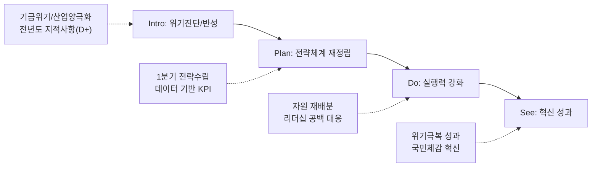

---
{"publish":true,"permalink":"/경영평가/1-1/5_지표작성방안","title":"5_지표 작성 방안","created":"2025-05-13","modified":"2025-12-13T21:06:29.284+09:00","tags":["#경영평가","#전략기획","#비계량","#작성방안"],"cssclasses":""}
---


# [1-1 경영 비전 실행 전략 및 노력] 세부평가내용 작성 방안

> [!abstract] 문서 개요
> 본 문서는 '1.1 경영 비전 실행 전략 및 노력' 지표의 2025년도 경영평가보고서 작성을 위한 논리적 흐름(Storyline)과 문단별 세부 작성 방안을 제안합니다.
> 
> **핵심 목표**: [[25년 경평/2_지표별 자료/1-1_경영_비전_실행_전략_및_노력/3_전년도_지적사항_및_개선실적\|전년도 지적사항(D+ 등급)]]을 완벽히 극복하고, **'영화발전기금 위기'**와 **'산업 양극화'**라는 대내외 환경 변화에 대한 **전략적 대응(Selection & Concentration)**을 부각하여 목표 등급(B+ 이상)을 달성하는 데 중점을 두었습니다.

---

## 1. Storyline 구성안 비교

### 📌 Option A: 프로세스 중심 (Process-Oriented)

| 구분 | 내용 |
|------|------|
| **구조** | 환경분석 → 전략수립 → 실행체계 → 성과점검 → 환류 |
| **장점** | 편람의 평가체계(P-D-C-A)에 가장 충실하며 논리적 완결성 높음 |
| **단점** | 위기 대응의 긴박함이 묻히고 평이하게 보일 우려 |
| **적합도** | ⭐⭐ |

```
환경분석 → 전략수립(Plan) → 실행체계(Do) → 성과점검(Check) → 환류(Act)
```

### 📌 Option B: 위기극복/이슈 해결 중심 (Problem-Solving)

| 구분 | 내용 |
|------|------|
| **구조** | 위기진단(기금/산업) → 비상경영 전략 → 자원 집중투입 → 체질개선 |
| **장점** | 기금 고갈 등 현 위기 상황과 기관의 치열한 '노력'을 강조하기 좋음 |
| **단점** | 편람에서 요구하는 '비전체계의 일반적 수립 절차' 기술이 소홀해 보일 수 있음 |
| **적합도** | ⭐⭐⭐ |

```
위기진단 → 비상전략수립 → 자원집중 → 체질개선 및 성과
```

### 📌 Option C: 지적사항 개선 중심 (Feedback-Response)

| 구분 | 내용 |
|------|------|
| **구조** | 전년도 한계(지적사항) → 개선조치(시기/논리) → 전략체계 가동 → 변화 |
| **장점** | D+ 등급 만회를 위한 '개선 실적'을 가장 명확히 드러냄 |
| **단점** | 기관의 본원적 미션보다 '평가 대응'에만 급급했다는 인상을 줄 우려 |
| **적합도** | ⭐⭐ |

```
전년도 지적 → 개선조치 → 新전략체계 가동 → 실질적 변화
```

---

## 2. 추천 Storyline (개선 기반의 위기극복)

> [!tip] 추천 구조
> **전년도 지적사항(논리성/시기)을 완벽히 보완한 체계** 위에서, **위기(기금/산업)를 극복하는 전략을 실행**했다는 서사

### 전체 흐름



### 핵심 메시지

> **"전년도 지적사항을 완벽히 보완하여 1분기에 전략을 수립하고, 기금 위기 속에서도 선택과 집중으로 성과 창출"**

---

## 3. 문단별 작성 방안

### 세부평가내용① 비전·경영목표·경영전략 수립 및 이행

#### 문단 1-1: 설립목적 기반의 전략체계 고도화 (지적사항 이행)

| 항목 | 내용 |
|------|------|
| **Core Message** | 법적 설립목적을 계승하되, '기금 고갈'과 '산업 양극화' 위기를 반영하여 비전 재해석 |
| **주요 근거** | 핵심 이슈(Key Issue) 3가지, '24년 1분기 내 환경분석 완료 |
| **담당 부서** | 기획전략팀 |

| 증빙 요소 | 내용 |
|----------|------|
| 환경분석 | 단순 나열 지양 → 핵심 이슈(재원절벽, OTT성장) 도출 |
| 시기조정 | 전략 수립 시점을 '연초(1분기)'로 앞당겨 명시 (지적사항 해소) |
| 적합성 | New 비전/핵심가치 적합성 진단 결과 (수치화) |

> [!example] 추천 스토리라인
> **"전년도 지적사항(전략수립 시기 부적절) 개선 → 1분기 내 환경분석 완료 → 핵심 이슈 3가지 도출 → 비전체계 재정립"**
> 
> - 도입: 영화발전기금 고갈 위기, 산업 양극화 심화 등 대내외 환경 급변
> - 전개: 1분기 내 SWOT 분석 완료, 핵심 이슈(재원절벽, OTT성장, 투자위축) 도출
> - 성과: 설립목적 기반 비전 재해석, 적합성 진단 결과 00% 달성

> [!quote] 📚 연구보고서 활용 (환경분석 근거)
> **「2024년 한국 영화산업 결산」(KOFIC 연구2025-02)**
> - 극장 매출액 **1조 1,945억 원** (코로나19 이전 대비 **65.3%** 수준)
> - 한국영화 매출 점유율 **57.8%**, 천만 영화 2편(파묘, 범죄도시4)
> - 세계 박스오피스 **9위**, 회복 속도 **53.3%** (주요국 중 가장 더딤)
> 
> **「2024 한국 영화산업 주요 쟁점 연구」(KOFIC 연구2025-04)**
> - 코로나19 이후 구조적 변화: 양극화 심화, OTT 활성화, 제작비 상승, 투자 위축
> - 2024년 영화관 입장권 매출 1조 2,693억원 (2019년 대비 **66%** 수준)
> 
> **「한국영화 투자 활성화를 위한 정책금융 활용 방안 연구」(KOFIC 연구2025-06)**
> - 2024년 한국영화 관객수 **7,147만명** (2019년 대비 **61.8%**)
> - 상업영화 평균수익률 **-31.0%** (2023년), 투자배급사 신규 투자 **절반 이하** 감소

#### 문단 1-2: 데이터 기반의 과학적 목표 설정

| 항목 | 내용 |
|------|------|
| **Core Message** | 데이터 기반의 과학적 비전·목표 설정으로 객관성 확보 |
| **주요 근거** | 경영목표 KPI 설정 근거(추세선, 벤치마킹) |
| **담당 부서** | 기획전략팀 |

| 증빙 요소 | 내용 |
|----------|------|
| 목표설정 | KPI 목표치 설정 근거 도표화 (지적사항 해소) |
| 연계성 | 비전-목표-전략과제 간 논리적 연계성 매핑 |

> [!example] 추천 스토리라인
> **"전년도 지적사항(KPI 객관성 부족) 개선 → 데이터 기반 목표 설정 → 비전-목표-전략과제 연계성 확보"**
> 
> - 도입: 전년도 경영목표 KPI 설정 근거 미흡 지적
> - 전개: 3개년 추세선 분석, 유사기관 벤치마킹, 전문가 자문 등 과학적 방법론 적용
> - 성과: KPI 목표치 설정 근거 도표화, 비전-목표-전략과제 매핑표 작성

> [!quote] 📚 연구보고서 활용 (KPI 설정 근거 데이터)
> **「2024년 한국 영화산업 결산」(KOFIC 연구2025-02)**
> - 1인당 관람횟수 **2.40회** (세계 8위) → 관람 저변 확대 KPI 설정 근거
> - 독립예술영화 매출 **237억 원** (+133.2%), 관객 **261만 명** (+129.4%)
> - 해외 수출 총액 **8,605만 달러** (+13.4%) → 해외진출 KPI 설정 근거
> 
> **「한국영화 투자 활성화를 위한 정책금융 활용 방안 연구」(KOFIC 연구2025-06)**
> - 영화계정 투자영화 **271편** (상업영화 643편 중 **42.1%**) → 펀드 투자 KPI 근거
> - 2024년 영화계정 투자액 비중 **20.5%** (총제작비 대비) → 정책금융 역할 확대

#### 문단 1-3: 전략과제 중심의 자원 배분

| 항목 | 내용 |
|------|------|
| **Core Message** | 수립된 전략이 구호에 그치지 않도록 예산·인력을 전략과제 중심으로 재편 |
| **주요 근거** | 핵심과제 예산 비중 확대, 인력 재배치 |
| **담당 부서** | 기획전략팀, 경영지원팀 |

| 증빙 요소 | 내용 |
|----------|------|
| 예산배분 | 긴축 재정 속 핵심과제 예산 비중 확대 실적 |
| 인력운영 | 전략부서 인력 우선 배치, TF 구성 등 |
| 리더십 | 기관장 공백 시 직무대행 체계 및 의사결정 매뉴얼 가동 |

> [!example] 추천 스토리라인
> **"기금 위기 속 선택과 집중 → 핵심과제 예산 비중 확대 → 전략부서 인력 우선 배치 → 리더십 공백 대응체계 가동"**
> 
> - 도입: 영화발전기금 고갈로 긴축 재정 불가피, 전략적 자원 배분 필요
> - 전개: 핵심과제 예산 비중 00%→00% 확대, 전략부서 인력 00명 우선 배치, TF 구성
> - 성과: 기관장 공백 시 직무대행 체계 가동, 의사결정 지연 ZERO

> [!quote] 📚 연구보고서 활용 (자원 배분 정당성)
> **「한국영화 투자 활성화를 위한 정책금융 활용 방안 연구」(KOFIC 연구2025-06)**
> - 업계 **77.6%**가 '정책금융 투자 펀드 확대' 필요 응답 → 펀드 예산 확대 근거
> - 2025년 체육기금 **600억원** + 복권기금 **45억원** = 총 **645억원** 확보 (전년대비 **82.2%** 증가)
> - 역량 강화 우선 주체: 제작사 → 투자배급사 → 정부(영진위) → VC 순
> 
> **「2024 한국 영화산업 주요 쟁점 연구」(KOFIC 연구2025-04)**
> - 투자 위축: 2024년 주요 투배사 촬영 준비 작품 약 **10편** 불과
> - 제작비 상승: 인건비, 배우 개런티, 물가 상승 → 중예산 제작지원 **100억** 집행 정당성

#### 문단 1-4: 이해관계자와의 비전·전략 공유

| 항목 | 내용 |
|------|------|
| **Core Message** | 대내외 이해관계자와 비전·핵심가치를 공유하고 전략 수립에 참여 유도 |
| **주요 근거** | 직원 참여형 전략 수립, 영화인·산업계 의견수렴 |
| **담당 부서** | 기획전략팀, 홍보팀 |

| 증빙 요소 | 내용 |
|----------|------|
| 내부공유 | 전 직원 대상 비전 선포식, 전략 워크숍 개최 |
| 외부공유 | 영화인 간담회, 산업계 의견수렴 회의 |
| 협력체계 | '영화산업 위기극복 영화인연대' 등 외부 협력 |

> [!example] 추천 스토리라인
> **"비전·전략 수립 과정에 이해관계자 참여 → 내부 공유 및 공감대 형성 → 외부 협력체계 구축"**
> 
> - 도입: 전략의 실효성 확보를 위해 이해관계자 참여 필수
> - 전개: 전 직원 비전 워크숍 00회, 영화인 간담회 00회, 산업계 의견수렴 00건
> - 성과: 직원 전략 인지도 00%, 영화인연대 협력사업 00건 추진

> [!quote] 📚 연구보고서 활용 (이해관계자 의견수렴)
> **「2024 한국 영화산업 주요 쟁점 연구」(KOFIC 연구2025-04)**
> - **FGI 6회, 26명** 참여 (제작사, 배급사, 극장, 작가, 협단체 등 가치사슬 전 단계)
> - 구성원 간 신뢰 붕괴 진단 → 정기 협의체 운영, 소통 채널 강화 필요
> - 동반성장협약(2012) 유명무실 → 협약 가이드라인 현행화 추진 근거
> 
> **「한국영화 투자 활성화를 위한 정책금융 활용 방안 연구」(KOFIC 연구2025-06)**
> - 전문가 자문회의 **14명** (투자사, 투자배급사, 제작사 관계자)
> - 업계 설문조사 **49개사** (제작사 35, 투자배급사 6, VC 8)
> - 투자환경 현 상황 진단: '신작 투자 축소, 보수적 투자 경향' **4.59점**/5점

---

### 세부평가내용② 경영혁신 및 경영성과 개선

#### 문단 2-1: 적극행정 및 규제개선

| 항목 | 내용 |
|------|------|
| **Core Message** | 관행적인 행정 절차를 수요자(영화인) 관점에서 과감히 개선하고, 내부 규제 발굴·개선으로 행정 부담 경감 |
| **주요 근거** | 적극행정 사례, 규제개선 실적, 제도개선 건의 |
| **담당 부서** | 기획전략팀, 사업부서 |

| 증빙 요소 | 내용 |
|----------|------|
| 적극행정 | 중예산 지원사업 신설 과정의 규정 개정, 적극행정 우수사례 |
| 규제개선 | 불필요한 제출 서류 감축, 정산 절차 간소화 |
| 제도개선 | 영화산업 관련 제도개선 건의 실적 |

> [!example] 추천 스토리라인
> **"영화인 현장 애로사항 청취 → 내부 규제 전수조사 → 적극행정으로 규정 개정 → 영화인 행정 부담 경감"**
> 
> - 도입: 영화산업 위기 속 영화인 지원 수요 증가, 행정 절차 간소화 필요
> - 전개: 내부 규제 전수조사, 중예산 지원사업 신설을 위한 규정 개정, 제출 서류 00종 감축
> - 성과: 영화인 행정 부담 00% 경감, 적극행정 우수사례 00건, 제도개선 건의 00건 반영

> [!quote] 📚 연구보고서 활용 (규제개선 필요성)
> **「2024 한국 영화산업 주요 쟁점 연구」(KOFIC 연구2025-04)**
> - 정산 단계 이슈: 깜깜이 정산, 부율 변경, 써차지 비용, 부금정산시기 문제
> - 표준계약서 무력화: OTT 시리즈 등에서 표준근로계약 미사용 확산
> - 임금체불 증가: 2023년 체불액 **13.25억 원**, 건수 전년 대비 **2배** 증가
> - 정책제언: 정산 투명성 강화, 검증 위원회 설치 검토
> 
> **「한국영화 투자 활성화를 위한 정책금융 활용 방안 연구」(KOFIC 연구2025-06)**
> - 영화계정 규제 완화 필요 영역: 기획개발 투자 의무, 투자 대상 제한 등
> - 업계 요구: 대기업 계열사 규제, 중저예산 투자 의무 등 재검토

#### 문단 2-2: 공공서비스 혁신 및 디지털 전환

| 항목 | 내용 |
|------|------|
| **Core Message** | 디지털 전환을 통한 공공서비스 품질 향상 및 업무 프로세스 혁신 |
| **주요 근거** | 온라인 서비스 고도화, 민원처리 기간 단축, 업무 자동화 |
| **담당 부서** | 디지털혁신팀, 사업부서 |

| 증빙 요소 | 내용 |
|----------|------|
| 온라인서비스 | 통합전산망(KOBIS) 고도화, OPEN-API 확대 |
| 민원처리 | 민원처리 기간 단축, 원스톱 서비스 구현 |
| 업무자동화 | RPA 도입, 반복업무 자동화, 비대면 심사 확대 |
| 데이터활용 | 데이터 기반 정책 의사결정 사례 |

> [!example] 추천 스토리라인
> **"디지털 전환 추진계획 수립 → 온라인 서비스 고도화 → 업무 자동화 및 민원처리 단축 → 서비스 만족도 향상"**
> 
> - 도입: 영화인 대상 서비스 접근성 개선 및 디지털 전환 가속화 필요
> - 전개: KOBIS 기능 개선 00건, OPEN-API 이용 00%↑, 민원처리 기간 00일→00일 단축, 반복업무 자동화 00건
> - 성과: 서비스 만족도 00점 달성, 업무처리 시간 00% 단축

> [!quote] 📚 연구보고서 활용 (디지털 전환)
> **「영화관입장권통합전산망 운영 개선 로드맵 수립 컨설팅 연구」(KOFIC 연구2025-08)**
> - 통합전산망 **20년** 운영 점검 및 중장기 발전전략 수립
> - **4대 추진과제, 11개 세부 이행과제** 도출
>   - 영화정보 관리체계 개선 / 영화인경력인증 관리체계 구축
>   - 유관기관 정보연계 체계 개선 / 통계 제공 확대 방안 마련
> - 오픈API **31개 항목** 제공, 박스오피스 DB **650,935건** 보유
> - BI 플랫폼 도입 계획: 사용자 주도 통계 분석 및 시각화 기능
> 
> **「AI 영화기술 현황과 전망」(KOFIC 현안보고 2025-01)**
> - 글로벌 AI 시장 **237조 원** (2024), 연평균 성장률 **18.6%**
> - AI 기본법 통과(2024.12) → 2026년 1월 시행 예정
> - 영화 제작 AI 활용 방향: KMS 구축, 로컬라이제이션, VFX 에셋 제작
> - 'Utility AI' 관점: 반복 노동 자동화로 업무 효율성 제고

#### 문단 2-3: 성과 점검 및 환류(Feedback)

| 항목 | 내용 |
|------|------|
| **Core Message** | 체계적인 성과관리(PDCA) 및 전년도 지적사항 100% 이행 |
| **주요 근거** | 경영목표 달성도 점검, 지적사항 조치결과 |
| **담당 부서** | 기획전략팀 |

| 증빙 요소 | 내용 |
|----------|------|
| 성과관리 | 분기별 경영목표 달성도 점검 회의 및 조치 |
| 지적사항 | 전략시점, KPI근거, 공백대응 등 조치결과 요약표 |
| 환류계획 | 2025년도 전략 수립을 위한 환류 계획 |

> [!example] 추천 스토리라인
> **"분기별 경영목표 점검체계 가동 → 전년도 지적사항 100% 이행 → 2025년 전략 수립에 환류"**
> 
> - 도입: 전년도 D+ 등급 원인 분석, 체계적 성과관리 필요성 인식
> - 전개: 분기별 경영목표 달성도 점검 회의 00회 개최, 지적사항 3건 전량 조치 완료
> - 성과: 전략시점·KPI근거·공백대응 등 지적사항 100% 이행, 2025년 전략 수립에 환류 반영

> [!quote] 📚 연구보고서 활용 (환류 및 정책방향)
> **「2024 한국 영화산업 주요 쟁점 연구」(KOFIC 연구2025-04)**
> - 단기 과제: 홀드백 복원(최소 6개월), 정산 투명성 강화, 통전망 개선
> - 중장기 과제: 스크린 상한제 검토, 동반성장협약 개정, 제작지원 강화
> - 저작권분쟁조정위원회 설치 검토 → 분쟁 조정 기구 마련
> 
> **「한국영화 투자 활성화를 위한 정책금융 활용 방안 연구」(KOFIC 연구2025-06)**
> - 정책금융 개선 방향: 영화계정 규제 완화, 투자 대상 확대, 인센티브 도입
> - 신규 정책금융 수단 검토: 토큰증권(STO), 크라우드펀딩, IP 담보대출
> - 한국영화밸류업센터 구상: 영화 가치평가, 제작사 역량강화, 네트워킹 지원

#### 문단 2-4: 비전 실현 및 혁신 성과

| 항목 | 내용 |
|------|------|
| **Core Message** | 경영목표별 KPI 달성 및 경영혁신을 통한 실질적 성과 창출 |
| **주요 근거** | KPI 달성률, 전년대비 개선 실적, 혁신 성과 |
| **담당 부서** | 기획전략팀, 전 부서 |

| 증빙 요소 | 내용 |
|----------|------|
| KPI달성 | 경영목표별 KPI 달성 현황 (목표 대비 실적) |
| 전년대비 | 핵심 성과지표 전년대비 개선율 |
| 혁신성과 | 경영효율화 실적, 대국민 서비스 만족도 개선 |
| 향후계획 | 차년도 중점 추진방향, 비전 고도화 계획 |

> [!example] 추천 스토리라인
> **"경영목표별 KPI 달성 → 전년대비 핵심지표 개선 → 혁신 성과 가시화 → 차년도 고도화 계획 수립"**
> 
> - 도입: 전년도 D+ 등급에서 반등을 위한 성과 창출 필요
> - 전개: 경영목표 KPI 달성률 00%, 핵심지표 전년대비 00% 개선, 서비스 만족도 00점
> - 성과: 위기 속 선택과 집중으로 핵심사업 성과 달성, 차년도 비전 고도화 계획 수립

> [!quote] 📚 연구보고서 활용 (성과 입증 데이터)
> **「2024년 한국 영화산업 결산」(KOFIC 연구2025-02)**
> - 한국영화 매출액 **6,910억 원** (+15.5%), 관객 **7,147만 명** (+17.6%)
> - 한국 독립예술영화 매출 **237억 원** (+133.2%), 관객 **261만 명** (+129.4%)
> - 지역 촬영 지원 **858편**, **5,305일** (전년대비 +89편)
> - 전국 영화제 **148개** 개최
> 
> **「한국영화 투자 활성화를 위한 정책금융 활용 방안 연구」(KOFIC 연구2025-06)**
> - 모태펀드 영화계정 총 투자액 **3,820억 원** (2011-2024년)
> - 영화계정 투자영화 **271편** (상업영화 643편 중 **42.1%**)
> - 코로나19 이후 영화계정 비중 **20.5%**로 상승 → 산업 위기 시 정책금융 역할 확대
> 
> **「영화관입장권통합전산망 운영 개선 로드맵 수립 컨설팅 연구」(KOFIC 연구2025-08)**
> - 통합전산망 영화상영관 가입률 **99% 이상** (의무가입)
> - 영화정보 DB **108,398건**, 영화인 DB **170,758건** 보유

---

## 4. 문단 구성 요약

> [!note] 총 8개 문단 구성
> 
> **세부평가내용① 비전·경영목표·경영전략 수립 및 이행** (4개 문단)
> - 문단 1-1: 설립목적 기반의 전략체계 고도화 (지적사항 이행)
> - 문단 1-2: 데이터 기반의 과학적 목표 설정
> - 문단 1-3: 전략과제 중심의 자원 배분
> - 문단 1-4: 이해관계자와의 비전·전략 공유
> 
> **세부평가내용② 경영혁신 및 경영성과 개선** (4개 문단)
> - 문단 2-1: 적극행정 및 규제개선
> - 문단 2-2: 공공서비스 혁신 및 디지털 전환
> - 문단 2-3: 성과 점검 및 환류(Feedback)
> - 문단 2-4: 비전 실현 및 혁신 성과

---

## 5. 차별화 포인트

### 가. 편람 요구사항 대응 현황

| 편람 요구사항 | 대응 문단 | 핵심 내용 |
|-------------|----------|----------|
| 설립목적 및 환경변화 분석 | 문단 1-1 | 기금 위기, 산업 양극화 등 핵심 이슈 도출 |
| 비전·핵심가치·경영목표 설정 | 문단 1-2 | 데이터 기반 KPI 설정, 연계성 매핑 |
| 경영전략의 체계적 수립 | 문단 1-3 | 선택과 집중, 자원 재배분 |
| 이해관계자와의 공유 | 문단 1-4 | 직원 워크숍, 영화인 간담회 |
| 적극행정·규제개선 | 문단 2-1 | 규정 개정, 서류 감축, 절차 간소화 |
| 공공서비스 혁신·디지털 전환 | 문단 2-2 | KOBIS 고도화, 업무 자동화, 민원처리 단축 |
| 경영평가 결과 반영/환류 | 문단 2-3 | 지적사항 100% 이행, PDCA |
| 추진 성과 | 문단 2-4 | KPI 달성, 전년대비 개선, 향후 계획 |

### 나. 전년도 D+등급(지적사항) 개선 전략

| 지적사항 | 개선 방안 | 핵심 성과 |
|---------|----------|----------|
| 전략수립 시기 부적절(연말) | **1분기 내** 전략체계 확정 | 연초 수립된 전략에 따른 실행 |
| 비전/목표 객관성 부족 | **데이터 기반** 진단 및 목표설정 | 적합도 진단결과, KPI 산출근거 명시 |
| 전략-과제 연계성 미흡 | **매핑표** 작성 및 논리 보강 | 비전-전략-과제 일관성 확보 |

### 다. 위기(Crisis)를 기회로

| 영역 | 위기 요인 | 대응 전략 |
|------|----------|----------|
| 재무 | 영화발전기금 고갈 위기 | **선택과 집중**, 재원 효율화 |
| 산업 | 양극화 심화, 투자 위축 | **중예산 영화** 집중 지원 전략 |

---

## 6. 작성 시 유의사항

### 가. 논리적 완결성 점검

> [!warning] 필수 확인
> [환경분석 결과]와 [도출된 전략과제]가 논리적으로 1:1 대응이 되는지 확인하십시오. 환경은 'A'라고 분석해놓고 전략은 엉뚱한 'B'를 내세우면 감점 요인입니다.

### 나. 정량 데이터 활용

> [!success] 증빙 강화
> "노력했다", "제고했다"는 표현보다는 **"00회를 개최하여 000명이 참여했고, 만족도가 0.0점 상승했다"**는 식의 정량적 기술이 필수적입니다.

## 🔗 관련 자료

| 구분 | 문서명 | 비고 |
|------|--------|------|
| 편람 분석 | [[25년 경평/2_지표별 자료/1-1_경영_비전_실행_전략_및_노력/2_편람_내용_분석]] | 세부평가 요소별 가이드 |
| 지적사항 | [[25년 경평/2_지표별 자료/1-1_경영_비전_실행_전략_및_노력/3_전년도_지적사항_및_개선실적]] | D+등급 원인 및 개선방향 |
| 부서 매핑 | [[25년 경평/2_지표별 자료/1-1_경영_비전_실행_전략_및_노력/6_부서별_실적_통합_매핑표]] | 부서별 실적 종합 |
| 목차안 | [[25년 경평/2_지표별 자료/1-1_경영_비전_실행_전략_및_노력/1_목차_구성안]] | 전체 목차 구조 |

### 📚 활용 연구보고서

| 보고서명 | 문서번호 | 주요 활용 문단 |
|---------|---------|---------------|
| 2024년 한국 영화산업 결산 | KOFIC 연구2025-02 | 문단 1-1, 1-2, 2-4 (환경분석, KPI 근거, 성과 데이터) |
| 2024 한국 영화산업 주요 쟁점 연구 | KOFIC 연구2025-04 | 문단 1-1, 1-4, 2-1, 2-3 (산업 쟁점, 이해관계자 의견, 규제개선, 환류) |
| 한국영화 투자 활성화를 위한 정책금융 활용 방안 연구 | KOFIC 연구2025-06 | 문단 1-2, 1-3, 1-4, 2-3, 2-4 (KPI 근거, 자원배분, 의견수렴, 정책방향, 성과) |
| 영화관입장권통합전산망 운영 개선 로드맵 수립 컨설팅 연구 | KOFIC 연구2025-08 | 문단 2-2, 2-4 (디지털 전환, 성과 데이터) |
| AI 영화기술 현황과 전망 | KOFIC 현안보고 2025-01 | 문단 2-2 (디지털 전환, AI 활용) |

---

*작성일: 2025-05-13*
*검증상태: 전년도 지적사항 반영 확인*
*연구보고서 연계: 2025-12-13 추가*