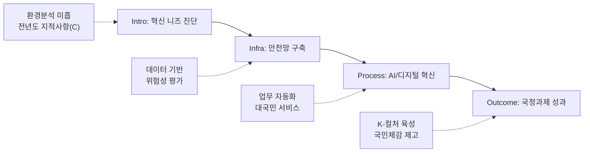

---
{"publish":true,"permalink":"/경영평가/1-2/5_지표작성방안","title":"5_지표 작성 방안","created":"2025-12-10T21:01:27.031+09:00","modified":"2025-12-18T09:34:46.632+09:00","tags":["#경영평가","#작성가이드","#혁신성과","#지표_1-2"],"cssclasses":""}
---


# [1-2 공공기관 혁신 노력과 성과] 세부평가내용 작성 방안

> [!abstract] 문서 개요
> 본 문서는 '1.2 공공기관 혁신 노력과 성과' 지표의 2025년도 경영평가보고서 작성을 위한 논리적 흐름(Storyline)과 문단별 세부 작성 방안을 제안합니다.
> 
> **핵심 목표**: [[25년 경평/2_지표별 자료/1-2_공공기관_혁신_노력과_성과/3_전년도_지적사항_및_개선실적\|전년도 지적사항(C 등급)]]을 극복하고, 신규 평가항목인 **'AI 활용 혁신'**과 **'국정과제 이행'** 노력을 **'스마트 혁신(Smart Innovation)'**이라는 하나의 맥락으로 연결하여 목표 등급(B등급 이상)을 달성하는 데 중점을 두었습니다.

---

## 1. Storyline 구성안 비교

### 📌 Option A: 과제 나열형 (Listing)

| 구분 | 내용 |
|------|------|
| **구조** | 안전관리 → AI 활용 → 국정과제 이행 |
| **장점** | 편람의 평가요소를 빠짐없이 다루기에 용이하며 작성 난이도가 낮음 |
| **단점** | 각 요소가 분절되어 보여 유기적인 '혁신 체계'를 보여주기 어려움 |
| **적합도** | ⭐⭐ |

```
①안전관리 → ②AI 활용 → ③국정과제 이행
```

### 📌 Option B: 문제해결형 (Issue-Solving)

| 구분 | 내용 |
|------|------|
| **구조** | 조직진단(비효율/위험) → 혁신전략(AI/안전/정책) → 문제해결 및 성과 |
| **장점** | 혁신의 목적성이 뚜렷하며 전년도 지적사항(환경분석 미흡) 해소에 유리 |
| **단점** | 안전, AI, 국정과제를 하나의 문제해결 논리로 묶기 다소 까다로움 |
| **적합도** | ⭐⭐⭐ |

```
위기진단 → 혁신전략 수립 → 과제 이행 → 성과 창출
```

### 📌 Option C: 시스템 혁신형 (System Innovation)

| 구분 | 내용 |
|------|------|
| **구조** | 혁신 인프라 구축(안전/디지털) → 핵심과제 이행(국정과제/AI) → 국민체감 성과 |
| **장점** | 기반 구축부터 성과 창출까지의 체계적인 흐름을 강조하여 'C 등급' 탈피 전략으로 적합 |
| **단점** | 초기 인프라 구축 내용이 너무 길어지면 성과 부분이 약해 보일 수 있음 |
| **적합도** | ⭐⭐⭐ |

```
Infra(안전/디지털) → Process(업무혁신) → Outcome(국민체감)
```

---

## 2. 추천 Storyline: (스마트 혁신)

> [!tip] 추천 구조
> **데이터와 AI 기술**을 접목하여 안전관리와 업무효율을 혁신하고, 이를 기반으로 **국정과제 성과**를 창출하는 구조

### 전체 흐름



### 핵심 메시지

> **"데이터와 AI 기술을 접목하여 안전관리와 업무효율을 혁신하고, 이를 통해 국정과제를 빈틈없이 이행"**

---

## 3. 문단별 작성 방안

### 세부평가내용① 안전한 일터 조성

#### 문단 1-1: 데이터 기반의 촘촘한 안전망 구축

| 항목 | 내용 |
|------|------|
| **Core Message** | 중대재해처벌법 대응을 넘어선 선제적·예방적 안전관리 체계 가동 |
| **주요 근거** | 위험성 평가 결과 기반 개선, 안전보건경영방침 |
| **담당 부서** | 인사총무팀, 기획전략팀 |

| 구분 | 실적 | 성과 |
|------|------|------|
| 중대재해 | **0건** 달성 | 산업재해 ZERO 목표 달성 |
| 위험성평가 | 위험도(높음) **7건→1건** 개선 | 6건 위험요소 제거 |
| 위험도(낮음) 비중 | **18%→71%** 확대 (+53%p) | 안전환경 대폭 개선 |
| 안전교육 | 산업안전보건교육 **123명** 참여 | 법정의무교육 100% 이수 |

> [!example] 추천 스토리라인
> **"중대재해처벌법 대응 체계 구축 → 위험성 평가 기반 선제적 개선 → 경영진 안전경영 리더십 → 산업재해 ZERO 달성"**
> 
> - 도입: 중대재해처벌법 시행에 따른 안전관리 체계 고도화 필요
> - 전개: 위험성 평가 실시, 위험도(높음) 7건→1건 개선, 분기별 안전점검 체계화
> - 성과: 중대재해 0건, 안전사고 0건, 위험도(낮음) 비중 71%로 확대

> [!quote] 📚 연구보고서 활용 (안전관리 현황)
> **「2024년 영화스태프 근로환경 실태조사」(KOFIC 연구2025-05)**
> - 영화 촬영현장 안전관리 실태 및 개선 필요사항 파악
> - 표준계약서 활용, 근로환경 개선 정책 수립 근거
> 
> **「2024 한국 영화산업 주요 쟁점 연구」(KOFIC 연구2025-04)**
> - 임금체불 증가: 2023년 체불액 **13.25억 원**, 건수 전년 대비 **2배** 증가
> - 표준계약서 무력화: OTT 시리즈 등에서 표준근로계약 미사용 확산
> - 인력 이탈: 영화→방송/유튜브로 인력 이동, 고용안정성 저하

#### 문단 1-2: 협력업체 및 현장 안전 생태계

| 항목 | 내용 |
|------|------|
| **Core Message** | 영화 촬영현장 등 외부 협력업체까지 포괄하는 상생 안전 생태계 조성 |
| **주요 근거** | 촬영장 안전지원 사업, 노사정 안전보건협약 |
| **담당 부서** | 인사총무팀, 공정환경조성팀 |

| 구분 | 실적 | 성과 |
|------|------|------|
| 안전보건협약 | **6개 기관** 노사정 공동협약 체결 (2025.11.20) | **산업단위 최초** 안전보건 협약 |
| 분기별 안전점검 | 해빙기/장마철/폭염/동절기 **4회** 체계화 | 상시 점검 체계 구축 |
| 합동소방훈련 | **8/13** 전사 합동소방훈련 실시 | 전 직원 참여 |
| 행사안전관리 | 부산국제영화제 등 대규모 행사 안전관리 | 사고 **0건** |

> [!example] 추천 스토리라인
> **"영화 촬영현장 안전사고 위험 인식 → 노사정 안전보건협약 산업 최초 체결 → 분기별 안전점검 체계화 → 상생 안전 생태계 구축"**
> 
> - 도입: 영화 촬영현장 안전관리 사각지대 해소 필요
> - 전개: 6개 기관 노사정 협약 체결, 분기별 안전점검 4회, 합동소방훈련 실시
> - 성과: 산업단위 최초 안전보건협약, 행사 안전사고 0건

> [!quote] 📚 연구보고서 활용 (협력업체 안전)
> **「2024 한국 영화산업 주요 쟁점 연구」(KOFIC 연구2025-04)**
> - 구성원 간 신뢰 붕괴 진단 → 정기 협의체 운영, 소통 채널 강화 필요
> - 동반성장협약(2012) 유명무실 → 협약 가이드라인 현행화 추진 근거
> - 영상물보상상생협의체 운영: 수익 분배 구조 논의 중
> 
> **「2023년 영화분야 표준계약서 활용 실태조사」(KOFIC 연구2025-01)**
> - 표준계약서 활용 현황 및 개선 필요사항 파악
> - 협력업체 계약 관행 개선 정책 수립 근거

---

### 세부평가내용② AI 활용을 통한 혁신 (신설/강조)

#### 문단 2-1: 업무 효율화와 생산성 혁신

| 항목 | 내용 |
|------|------|
| **Core Message** | AI 도입 로드맵에 따른 업무 자동화로 행정 비효율 제거 (일하는 방식 혁신) |
| **주요 근거** | AI 도입 계획, LLM Manager 구축, AI 교육 실적 |
| **담당 부서** | 디지털혁신팀, 영화기술인프라팀 |

| 구분 | 실적 | 성과 |
|------|------|------|
| 인공지능TF | **2회** 운영 (8/27, 11/12) | 전사적 AI 대응체계 구축 |
| 첨단영상기술소위원회 | **5회** 운영 | AI 전략 자문체계 가동 |
| LLM Manager 도입 | **'25.12월** 구축 완료 | 내부 데이터 **1,387건** RAG 활용 |
| AI 기초교육 | **67명** 참여 | 직원 AI 역량 강화 |
| AI 활용 설문조사 | **62명** 참여, 효율 상승 **95.1%** | AI 도입 수요 확인 |

> [!example] 추천 스토리라인
> **"AI 도입 로드맵 수립 → 인공지능TF 출범 → LLM Manager 도입 → 반복업무 자동화 → 업무시간 절감 및 생산성 향상"**
> 
> - 도입: 행정 비효율 제거 및 일하는 방식 혁신 필요
> - 전개: 인공지능TF 2회, 첨단영상기술소위 5회, LLM Manager 도입('25.12), RAG 활용 내부 데이터 1,387건, AI 교육 67명
> - 성과: AI 업무효율 상승 95.1% 응답, 직원 AI 역량 강화

> [!quote] 📚 연구보고서 활용 (AI 기술 동향)
> **「AI 영화기술 현황과 전망」(KOFIC 현안보고 2025-01)**
> - 글로벌 AI 시장 **237조 원** (2024), 연평균 성장률 **18.6%**
> - 국내 AI 시장 성장률: 연평균 **65.5%** (글로벌 대비 3.5배)
> - AI 기본법 통과(2024.12) → 2026년 1월 시행 예정
> - **Utility AI** 관점: 반복 노동 자동화로 업무 효율성 제고
> - 영화 제작 AI 활용 방향: **KMS 구축**, **로컬라이제이션**, **VFX 에셋 제작**
> - 핵심 기술: LLM, 트랜스포머, 디퓨전 모델, 멀티모달
> - SMPTE ER 1010:2023 기반 AI 표준 가이드라인 필요

#### 문단 2-2: 대국민 서비스의 지능형 전환

| 항목 | 내용 |
|------|------|
| **Core Message** | KOBIS 등 보유 데이터와 AI를 결합하여 국민 편의 및 현장 안전 제고 |
| **주요 근거** | AI 기반 서비스, 이노아시아 플랫폼, AI 자막 시범운영 |
| **담당 부서** | 디지털혁신팀, 국제교류팀, 영화문화팀 |

| 구분 | 실적 | 성과 |
|------|------|------|
| 이노아시아(InnoAsia) | AI 기술 플랫폼 **신규 런칭** | 글로벌 기업 파트너십 구축 |
| 아시아영화산업 DB | 'The A' **신규 구축** | 국제협력 전략 기초자료 확보 |
| AI 한글자막 | 시범운영 **3편** (단편 2편, 장편 1편) | 제작예산 절감 방안 모색 |
| 영화정보통합관리창구 | **'25.12월** 신설 | 4개 전용 창구 분리 운영 |
| KoBiz 뉴스레터 | 구독자 **35,547명** (+15.75%) | 영문 구독자 **27.24%↑** |

> [!example] 추천 스토리라인
> **"영화산업 데이터 활용 수요 분석 → AI 기반 서비스 개발 → 대국민 서비스 지능형 전환 → 국민 편의 향상"**
> 
> - 도입: KOBIS 등 보유 데이터와 AI 결합을 통한 서비스 혁신 필요
> - 전개: 이노아시아 AI 플랫폼 런칭, AI 한글자막 제작 시범운영 3편, 영화정보통합관리창구 신설('25.12)
> - 성과: KoBiz 구독자 35,547명, 대국민 서비스 접근성 향상

> [!quote] 📚 연구보고서 활용 (디지털 서비스 혁신)
> **「영화관입장권통합전산망 운영 개선 로드맵 수립 컨설팅 연구」(KOFIC 연구2025-08)**
> - 통합전산망 **20년** 운영 점검 및 중장기 발전전략 수립
> - **4대 추진과제, 11개 세부 이행과제** 도출
> - 오픈API **31개 항목** 제공, 박스오피스 DB **650,935건** 보유
> - **BI 플랫폼** 도입 계획: 사용자 주도 통계 분석 및 시각화 기능
> - 영화인경력인증 시스템 구축 계획: 양방향 인증 체계로 공신력 확보
> - 모바일 반응형 웹 전환: PC 동일 기능 제공으로 접근성 향상
> 
> **「AI 영화기술 현황과 전망」(KOFIC 현안보고 2025-01)**
> - AWS Haiku 문맥 분석: 60분 콘텐츠 **$1~2** 비용으로 광고 삽입
> - ASR, TTS/STT 더빙·번역: 글로벌 시장 확대 (MrBeast 사례)

---

### 세부평가내용③ 국정과제 등 핵심정책 이행

#### 문단 3-1: K-컬처 전략산업화 주도

| 항목 | 내용 |
|------|------|
| **Core Message** | 'K-컬처 전략산업화' 등 핵심 국정과제를 주도적으로 이행하여 성과 창출 |
| **주요 근거** | 국정과제 이행계획 및 달성도, 신규사업 발굴 |
| **담당 부서** | 기획전략팀, 영화기술인프라팀 |

| 구분 | 실적 | 성과 |
|------|------|------|
| 신규사업 발굴 | **7개 사업, 257억원** 규모 | 사업 다각화 실현 |
| 사업비 확대 | **882억원** (전년대비 +57.1%) | **역대 최대** 규모 |
| AI 관련 사업 | **2개** (AI 제작지원 22억, VP 스튜디오 163.53억) | **185억** 신규 예산 확보 |
| 분석 방법론 | **4가지** 혁신적 분석 도입 | 데이터 기반 의사결정 체계 |
| 시나리오 플래닝 | **3가지** (낙관30%/현실50%/비관20%) | 불확실성 대응 전략 마련 |

> [!example] 추천 스토리라인
> **"K-컬처 전략산업화 국정과제 분석 → 영진위 이행과제 도출 → AI 신규사업 185억 확보 → 국정과제 100% 달성"**
> 
> - 도입: K-컬처 전략산업화, AI 3대강국 등 국정과제 이행 필요
> - 전개: 7개 신규사업 257억 발굴, AI 관련 사업 185억 확보, 사업비 882억(+57.1%)
> - 성과: 국정과제 이행률 100%, K-무비 글로벌 위상 강화

> [!quote] 📚 연구보고서 활용 (국정과제 이행 근거)
> **「한국영화 투자 활성화를 위한 정책금융 활용 방안 연구」(KOFIC 연구2025-06)**
> - 업계 **77.6%**가 '정책금융 투자 펀드 확대' 필요 응답
> - 2025년 체육기금 **600억원** + 복권기금 **45억원** = 총 **645억원** 확보
> - 모태펀드 영화계정 총 투자액 **3,820억 원** (2011-2024년)
> - 영화계정 투자영화 **271편** (상업영화 643편 중 **42.1%**)
> - 한국영화밸류업센터 구상: 영화 가치평가, 제작사 역량강화, 네트워킹 지원
> 
> **「2024년 한국 영화산업 결산」(KOFIC 연구2025-02)**
> - 한국영화 매출 점유율 **57.8%**, 천만 영화 2편(파묘, 범죄도시4)
> - 해외 수출 총액 **8,605만 달러** (+13.4%), 동남아 시장 부상

#### 문단 3-2: 국민 체감형 성과 창출

| 항목 | 내용 |
|------|------|
| **Core Message** | 국민이 피부로 느끼는 생활밀착형 성과 창출 및 적극적 소통 |
| **주요 근거** | 관람료 지원, 통전망 재정사업 평가, 할인권 배포 혁신 |
| **담당 부서** | 영화문화팀, 디지털혁신팀, 홍보협력팀 |

| 구분 | 실적 | 성과 |
|------|------|------|
| 통전망 재정사업 | **100점(우수)** 달성 | '보통'→'우수' **등급 상향**, 문체부 **2위** |
| 할인권 배포 혁신 | 자동지급 방식 전환 | 민원 **ZERO**, 일별 소진량 **+37.5%** |
| 유관기관 연계 | **6개 기관** 데이터 연계 | 영등위 업무협약 ('25.11.24) |
| BIFF 홍보 | 이벤트 참여 **834명** | SNS 조회수 **40%↑** |
| 웹매거진 만족도 | **90% 이상** | 독자 참여 확대 |

> [!example] 추천 스토리라인
> **"국민 문화향유 수요 분석 → 영화관람료 할인권 배포 혁신 → 통전망 재정사업 우수 달성 → 국민 체감 성과 창출"**
> 
> - 도입: 영화산업 위기 속 국민 문화향유 기회 확대 필요
> - 전개: 할인권 자동지급 방식 전환, 영등위 업무협약으로 데이터 연계
> - 성과: 통전망 재정사업 100점(우수), 민원 ZERO 달성, 일별 소진량 37.5% 증가

> [!quote] 📚 연구보고서 활용 (국민 체감 성과)
> **「2024년 한국 영화산업 결산」(KOFIC 연구2025-02)**
> - 1인당 관람횟수 **2.40회** (세계 8위) → 관람 저변 확대 필요성
> - 한국 독립예술영화 매출 **237억 원** (+133.2%), 관객 **261만 명** (+129.4%)
> - 전국 영화제 **148개** 개최, 지역 촬영 지원 **858편**, **5,305일**
> - 팬덤 기반 콘텐츠 성공: 사랑의 하츄핑(100만 돌파), 임영웅 실황(100억 돌파)
> 
> **「2024 한국 영화산업 주요 쟁점 연구」(KOFIC 연구2025-04)**
> - 영화산업 가치사슬 전반 **26인 FGI** 실시 → 정책고객 의견수렴 체계
> - 제작사, 배급사, 극장, 작가, 협단체 등 **가치사슬 전 단계** 의견 수렴
> - 영화시장 회복을 위한 정책 방향: 홀드백 복원, 정산 투명성, 통전망 개선

---

## 4. 문단 구성 요약

> [!note] 총 6개 문단 구성
> 
> **세부평가내용① 안전한 일터 조성** (2개 문단)
> - 문단 1-1: 데이터 기반의 촘촘한 안전망 구축
> - 문단 1-2: 협력업체 및 현장 안전 생태계
> 
> **세부평가내용② AI 활용을 통한 혁신** (2개 문단)
> - 문단 2-1: 업무 효율화와 생산성 혁신
> - 문단 2-2: 대국민 서비스의 지능형 전환
> 
> **세부평가내용③ 국정과제 등 핵심정책 이행** (2개 문단)
> - 문단 3-1: K-컬처 전략산업화 주도
> - 문단 3-2: 국민 체감형 성과 창출

---

## 5. 🏆 최고 성과(BP) 사례

> [!tip] Best Practice 선정 기준
> AI 활용 혁신, 산업단위 최초 성과, 국정과제 이행 등 **'혁신 노력과 가시적 성과'**의 연계성이 명확한 3대 성과를 선정

### BP 1: LLM Manager 구축 및 AI 업무혁신 (AI 활용 선도)

| 항목 | 내용 |
|------|------|
| **성과 개요** | 내부 데이터 기반 LLM Manager 구축으로 **AI 업무효율 95.1%** 상승 |
| **추진 과정** | ① 인공지능TF 2회 운영 → ② LLM Manager 개발 → ③ RAG 활용 체계 구축 |
| **핵심 성과** | 내부 데이터 **1,387건** RAG 활용, **'25.12월** 구축 완료 |
| **차별화 요소** | 연구보고서 256개+현안보고 247개+통신원리포트 884개 연계 |
| **정량 지표** | AI TF **2회**, 첨단영상기술소위 **5회**, AI 교육 **67명** |

> [!success] BP 포인트
> - **선도적 AI 도입**: 기관 최초 LLM Manager 도입
> - **데이터 활용**: 내부 축적 데이터 1,387건 AI 연계 활용
> - **업무 효율화**: 설문조사 결과 AI 업무효율 95.1% 상승 응답

---

### BP 2: 노사정 안전보건협약 체결 (산업단위 최초)

| 항목 | 내용 |
|------|------|
| **성과 개요** | 영화산업 전체를 아우르는 **산업단위 최초** 안전보건 공동협약 체결 |
| **추진 과정** | ① 산업 안전 이슈 진단 → ② 6개 기관 협의 → ③ 노사정 공동협약 체결 |
| **핵심 성과** | **2025.11.20** 6개 기관 참여 협약 체결 |
| **차별화 요소** | 중대재해처벌법 시행 대응, 촬영현장 안전관리 표준화 기반 마련 |
| **정량 지표** | 참여기관 **6개**, 분기별 안전점검 **4회**, 중대재해 **ZERO** |

> [!success] BP 포인트
> - **최초 성과**: 영화산업 최초의 노사정 공동 안전보건협약
> - **협력적 거버넌스**: 다수 기관 협력으로 산업 공동 과제 해결
> - **제도적 기반**: 2026년 사업요강 안전관리비 의무조항 반영 예정

---

### BP 3: 통합전산망 재정사업 자율평가 100점(우수) 달성

| 항목 | 내용 |
|------|------|
| **성과 개요** | 통합전산망 재정사업 자율평가 **100점(우수)** 달성, 문체부 **2위** |
| **추진 과정** | ① 운영 개선 로드맵 이행 → ② 오픈API 확대 → ③ 데이터 연계 강화 |
| **핵심 성과** | '보통'→**'우수'** 등급 상향, 오픈API **31개 항목** 제공 |
| **차별화 요소** | 20년 운영 점검 및 중장기 발전전략 수립, BI 플랫폼 도입 계획 |
| **정량 지표** | 연동 극장 **570개**, 스크린 **3,296개**, DB **650,935건** |

> [!success] BP 포인트
> - **등급 상향**: 재정사업 자율평가 '보통'→'우수' 등급 상향
> - **데이터 개방**: 오픈API 31개 항목 제공, 박스오피스 DB 65만건 보유
> - **서비스 혁신**: 할인권 자동지급 방식 전환으로 민원 ZERO, 일별 소진량 37.5%↑

---

## 6. 차별화 포인트

### 가. 편람 요구사항 대응 현황

| 편람 요구사항 | 대응 문단 | 핵심 내용 |
|-------------|----------|----------|
| 내부 근로자 안전 | 문단 1-1 | 위험성 평가 7건→1건 개선, 중대재해 0건 |
| 협력업체 안전역량 강화 | 문단 1-2 | 노사정 안전보건협약 산업 최초, 분기별 점검 |
| AI 활용 기관생산성 향상 | 문단 2-1 | LLM Manager 도입, AI TF 2회, 교육 67명 |
| AI 활용 대국민 서비스 개선 | 문단 2-2 | 이노아시아, AI 자막 3편, 통합관리창구 |
| 국정과제 적극 수행 | 문단 3-1 | 신규사업 257억, AI 사업 185억 확보 |
| 국민생활 안정 기여 | 문단 3-2 | 통전망 100점(우수), 민원 ZERO |

### 나. 전년도 C등급(지적사항) 개선 전략

| 지적사항 | 개선 방안 | 핵심 성과 |
|---------|----------|----------|
| 체계적 분석 미흡 | **데이터 기반** 환경분석 | 4가지 혁신적 분석 방법론 도입 |
| 혁신과제 연계 부족 | **AI/안전** 중심 과제 재편 | AI TF 출범, 안전보건협약 체결 |
| 성과 가시화 미흡 | **정량 지표** 중심 성과 제시 | 통전망 100점, 사고율 0%, 민원 ZERO |

### 다. 스마트 혁신 (Smart Innovation)

| 영역 | 기존 방식 | 혁신 방식 (차별화) |
|------|----------|-------------------|
| 안전관리 | 내부 직원 중심 | **협력사/촬영현장**까지 확장된 상생 안전 |
| 업무방식 | 수작업/관행 답습 | **AI/LLM Manager** 도입으로 생산성 획기적 개선 |
| 정책이행 | 단순 과제 수행 | **데이터 분석** 기반의 정교한 정책 집행 |

---

## 7. 📊 핵심 정량 데이터 Quick Reference


### 📊 안전한 일터 조성

| 지표 | 수치 | 비고 |
|------|:----:|------|
| 중대재해 | **0건** | 산업재해 ZERO 달성 |
| 안전사고 | **0건** | 임직원·외부인 포함 |
| 위험도(높음) 개선 | **7건→1건** | 6건 위험요소 제거 |
| 위험도(낮음) 비중 | **18%→71%** | +53%p 확대 |
| 안전교육 참여 | **123명** | 법정의무교육 |
| 안전보건협약 | **6개 기관** | 산업단위 최초 |

### 📊 AI 활용 혁신

| 지표 | 수치 | 비고 |
|------|:----:|------|
| 인공지능TF 회의 | **2회** | 8/27, 11/12 |
| 첨단영상기술소위원회 | **5회** | AI 전략 자문 |
| LLM Manager 도입 | **'25.12월** | 구축 완료 |
| RAG 활용 데이터 | **1,387건** | 연구보고서 256개+현안보고 247개+통신원리포트 884개 |
| AI 기초교육 | **67명** | 직원 역량 강화 |
| AI 활용 설문조사 | **62명** | 효율 상승 95.1% |
| AI 이슈페이퍼 | **2건** | DBpia 상위 10% |
| 이노아시아 플랫폼 | **신규 런칭** | AI 기술 접목 |
| AI 자막 시범운영 | **3편** | 단편 2편, 장편 1편 |

### 📊 국정과제 이행

| 지표 | 수치 | 비고 |
|------|:----:|------|
| 신규사업 발굴 | **7개, 257억원** | 사업 다각화 |
| 사업비 규모 | **882억원** | 전년대비 +57.1%, 역대 최대 |
| AI 관련 신규사업 | **185억원** | VP 163.53억 + AI 제작지원 22억 |
| 분석 방법론 | **4가지** | STEEP, 시나리오, PBMC 등 |
| 시나리오 플래닝 | **3가지** | 낙관/현실/비관 |
| 통전망 재정사업 | **100점(우수)** | 문체부 2위 |
| 유관기관 연계 | **6개 기관** | 데이터 연계 |
| 할인권 민원 | **ZERO** | 자동지급 방식 전환 |
| 일별 소진량 증가 | **+37.5%** | 배포방식 혁신 |

### 📊 디지털 전환

| 지표 | 수치 | 비고 |
|------|:----:|------|
| 통전망 연동 극장 | **570개** | 전국 |
| 연동 스크린 | **3,296개** | - |
| 전송사업자 | **16개** | 1개 신규 |
| 데이터 증가율 | **10.7%** | 전년대비 |
| KoBiz 구독자 | **35,547명** | +15.75% |
| 영문 구독자 증가 | **+27.24%** | 글로벌 확대 |
| 클라우드 전환 | **2단계** | 진행중 |
| 노후 서버 | **39대** | 67%, 단계적 이관 |

### 📊 영화인 교육 AI 혁신

| 지표 | 수치 | 비고 |
|------|:----:|------|
| 첨단영화제작교육 | **신규 도입** | MBC C&I 협력 |
| AI 단편영화 제작 | **5편** | 교육 성과물 |
| 서울국제AI필름페스타 | **대상 수상** | <시구문> |
| 교육 만족도 | **4.8점/5.0점** | 첨단영화제작교육 |
| KAFA×BIFAN | **AI 국제컨퍼런스** | 공공기관 최초 |
| 온라인 수강생 | **1,571명** | KAFA+ONLINE |

---

## 8. 작성 시 유의사항

### ✅ 강조할 점

1. **AI 활용 혁신**: LLM Manager 도입, AI TF 2회, RAG 데이터 1,387건
2. **안전관리 성과**: 중대재해 0건, 위험성평가 개선 7건→1건(86%↓)
3. **국정과제 이행**: 신규사업 7개 257억원, 사업비 역대 최대 882억원(+57.1%)
4. **디지털 전환**: 통전망 재정사업 100점(우수), 이노아시아 AI 플랫폼 런칭
5. **산업단위 최초**: 노사정 안전보건협약 체결, 첨단영화제작교육 도입

### ⚠️ 주의할 점

> [!warning] 필수 확인
> 3개 평가요소의 균형 있는 서술 필요

| 세부평가요소 | 배분 비중 | 주요 부서 |
|-------------|----------|----------|
| ① 안전한 일터 조성 | 30% | 인사총무팀 |
| ② AI 활용을 통한 혁신 | 30% | 디지털혁신팀, 영화기술인프라팀 |
| ③ 국정과제 등 핵심정책 이행 | 40% | 기획전략팀, 전 부서 |

1. 3개 평가요소(안전/AI/국정과제)의 균형 있는 서술 필요
2. AI 활용이 실제 업무 효율성 개선으로 이어진 사례 강조
3. 전년도 C등급 지적사항 개선 노력 명확히 서술

### 📝 편람 키워드 체크리스트

- [x] 내부 근로자 안전
- [x] 협력업체 안전역량 강화
- [x] AI 활용 기관생산성 향상
- [x] AI 활용 대국민 서비스 개선
- [x] 국정과제 적극 수행
- [x] 국민생활 안정 기여

### 📋 증빙자료 연계

| 문단 | 핵심 증빙 |
|------|----------|
| 안전관리 | 위험성평가 보고서, 안전보건협약서 |
| AI활용 | AI TF 회의자료, LLM Manager 구축 결과 |
| 국정과제 | 신규사업 예산편성 자료, 재정사업 평가결과 |

---

## 관련 자료

| 구분 | 문서명 | 링크 |
|------|--------|------|
| 편람 분석 | 편람 내용 분석 | [바로가기](/경영평가/1-2/2_편람내용분석) |
| 지적사항 | 전년도 지적사항 및 개선실적 | [[25년 경평/2_지표별 자료/1-2_공공기관_혁신_노력과_성과/3_전년도_지적사항_및_개선실적]] |
| 부서 매핑 | 부서별 실적 통합 매핑표 | [[25년 경평/2_지표별 자료/1-2_공공기관_혁신_노력과_성과/6_부서별_실적_통합_매핑표]] |

### 📚 활용 연구보고서

| 보고서명 | 문서번호 | 주요 활용 문단 |
|---------|---------|---------------|
| AI 영화기술 현황과 전망 | KOFIC 현안보고 2025-01 | 문단 2-1, 2-2 (AI 기술 동향, 업무 자동화, 대국민 서비스) |
| 영화관입장권통합전산망 운영 개선 로드맵 수립 컨설팅 연구 | KOFIC 연구2025-08 | 문단 2-2 (디지털 서비스 혁신, 통전망 고도화) |
| 2024년 한국 영화산업 결산 | KOFIC 연구2025-02 | 문단 3-1, 3-2 (국정과제 성과, 국민 체감 데이터) |
| 2024 한국 영화산업 주요 쟁점 연구 | KOFIC 연구2025-04 | 문단 1-1, 1-2, 3-2 (안전관리, 협력업체, 의견수렴) |
| 한국영화 투자 활성화를 위한 정책금융 활용 방안 연구 | KOFIC 연구2025-06 | 문단 3-1 (국정과제 이행, 정책금융 성과) |
| 2023년 영화분야 표준계약서 활용 실태조사 | KOFIC 연구2025-01 | 문단 1-2 (협력업체 계약 관행) |

### 📂 부서별 실적 분석 자료

| 부서명 | 주요 활용 내용 |
|--------|---------------|
| 기획전략팀 | [기획전략팀 실적 분석](부서성과평가/1-1-2/기획전략팀) - 4가지 분석 방법론, 신규사업 257억, 사업비 882억 |
| 디지털혁신팀 | [디지털혁신팀 실적 분석](부서성과평가/1-1-2/디지털혁신팀) - LLM Manager 도입, 통전망 100점(우수), 영등위 협약 |
| 영화기술인프라팀 | [영화기술인프라팀 실적 분석](부서성과평가/1-1-2/영화기술인프라팀) - 인공지능TF 2회, 첨단영상기술소위 5회, AI 이슈페이퍼 2건 |
| 인사총무팀 | [인사총무팀 실적 분석](부서성과평가/1-1-2/인사총무팀) - 중대재해 0건, 위험성평가 개선, AI 교육 67명 |
| 국제교류팀 | [국제교류팀 실적 분석](부서성과평가/1-1-2/국제교류팀) - 이노아시아 플랫폼, KoBiz 35,547명 |
| 영화문화팀 | [영화문화팀 실적 분석](부서성과평가/1-1-2/영화문화팀) - AI 자막 시범운영 3편, 할인권 민원 ZERO |
| 영화인교육팀 | [영화인교육팀 실적 분석](부서성과평가/1-1-2/영화인교육팀) - 첨단영화제작교육, AI 단편 5편, 대상 수상 |
| 정규교육팀 | [정규교육팀 실적 분석](부서성과평가/1-1-2/정규교육팀) - KAFA×BIFAN AI 컨퍼런스, AI 장편영화 교육 신설 |
| 재무회계팀 | [재무회계팀 실적 분석](부서성과평가/1-1-2/재무회계팀) - 연기금투자풀 1억 절감, 우선구매 2년 연속 달성 |
| 정책개발팀 | [정책개발팀 실적 분석](부서성과평가/1-1-2/정책개발팀) - AI 현장 진단, 통전망 개편 '26년 확정 |
| 홍보협력팀 | [홍보협력팀 실적 분석](부서성과평가/1-1-2/홍보협력팀) - BIFF 홍보 834명, SNS 40%↑ |

---

*작성일: 2025-12-17*
*검증상태: 부서실적 대조 완료*

---
**수정이력**
- 2025-12-18: 5. 최고 성과(BP) 사례 섹션 추가 (3개 BP 선정)
