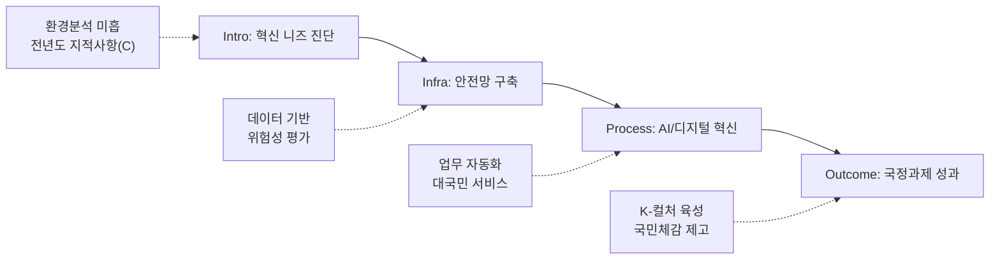

---
{"publish":true,"permalink":"/경영평가/1-2/5_지표작성방안","title":"5_지표 작성 방안","created":"2025-12-09","modified":"2025-12-13T21:12:36.371+09:00","tags":["#경영평가","#작성가이드","#혁신성과","#지표_1-2"],"cssclasses":""}
---


# [1-2 공공기관 혁신 노력과 성과] 세부평가내용 작성 방안

> [!abstract] 문서 개요
> 본 문서는 '1.2 공공기관 혁신 노력과 성과' 지표의 2025년도 경영평가보고서 작성을 위한 논리적 흐름(Storyline)과 문단별 세부 작성 방안을 제안합니다.
> 
> **핵심 목표**: [[25년 경평/2_지표별 자료/1-2_공공기관_혁신_노력과_성과/3_전년도_지적사항_및_개선실적\|전년도 지적사항(C 등급)]]을 극복하고, 신규 평가항목인 **'AI 활용 혁신'**과 **'국정과제 이행'** 노력을 **'스마트 혁신(Smart Innovation)'**이라는 하나의 맥락으로 연결하여 목표 등급(B등급 이상)을 달성하는 데 중점을 두었습니다.

---

## 1. Storyline 구성안 비교

### 📌 Option A: 과제 나열형 (Listing)

| 구분 | 내용 |
|------|------|
| **구조** | 안전관리 → AI 활용 → 국정과제 이행 |
| **장점** | 편람의 평가요소를 빠짐없이 다루기에 용이하며 작성 난이도가 낮음 |
| **단점** | 각 요소가 분절되어 보여 유기적인 '혁신 체계'를 보여주기 어려움 |
| **적합도** | ⭐⭐ |

```
①안전관리 → ②AI 활용 → ③국정과제 이행
```

### 📌 Option B: 문제해결형 (Issue-Solving)

| 구분 | 내용 |
|------|------|
| **구조** | 조직진단(비효율/위험) → 혁신전략(AI/안전/정책) → 문제해결 및 성과 |
| **장점** | 혁신의 목적성이 뚜렷하며 전년도 지적사항(환경분석 미흡) 해소에 유리 |
| **단점** | 안전, AI, 국정과제를 하나의 문제해결 논리로 묶기 다소 까다로움 |
| **적합도** | ⭐⭐⭐ |

```
위기진단 → 혁신전략 수립 → 과제 이행 → 성과 창출
```

### 📌 Option C: 시스템 혁신형 (System Innovation)

| 구분 | 내용 |
|------|------|
| **구조** | 혁신 인프라 구축(안전/디지털) → 핵심과제 이행(국정과제/AI) → 국민체감 성과 |
| **장점** | 기반 구축부터 성과 창출까지의 체계적인 흐름을 강조하여 'C 등급' 탈피 전략으로 적합 |
| **단점** | 초기 인프라 구축 내용이 너무 길어지면 성과 부분이 약해 보일 수 있음 |
| **적합도** | ⭐⭐⭐ |

```
Infra(안전/디지털) → Process(업무혁신) → Outcome(국민체감)
```

---

## 2. 추천 Storyline: (스마트 혁신)

> [!tip] 추천 구조
> **데이터와 AI 기술**을 접목하여 안전관리와 업무효율을 혁신하고, 이를 기반으로 **국정과제 성과**를 창출하는 구조

### 전체 흐름



### 핵심 메시지

> **"데이터와 AI 기술을 접목하여 안전관리와 업무효율을 혁신하고, 이를 통해 국정과제를 빈틈없이 이행"**

---

## 3. 문단별 작성 방안

### 세부평가내용① 안전한 일터 조성

#### 문단 1-1: 데이터 기반의 촘촘한 안전망 구축

| 항목 | 내용 |
|------|------|
| **Core Message** | 중대재해처벌법 대응을 넘어선 선제적·예방적 안전관리 체계 가동 |
| **주요 근거** | 위험성 평가 결과 기반 개선, 안전보건경영방침 |
| **담당 부서** | 안전관리팀, 기획전략팀 |

| 증빙 요소 | 내용 |
|----------|------|
| 안전체계 | 단순 매뉴얼 나열 지양 → 위험성 평가 결과 기반 개선 조치 |
| 리더십 | 경영진의 안전경영 의지(현장점검 횟수) 및 방침 선포 |
| 인증/평가 | 안전보건경영시스템(ISO 45001) 등 인증 유지/갱신 |

> [!example] 추천 스토리라인
> **"중대재해처벌법 대응 체계 구축 → 위험성 평가 기반 선제적 개선 → 경영진 안전경영 리더십 → 산업재해 ZERO 달성"**
> 
> - 도입: 중대재해처벌법 시행에 따른 안전관리 체계 고도화 필요
> - 전개: 위험성 평가 00건 실시, 개선조치 00건 완료, 경영진 현장점검 00회
> - 성과: 산업재해율 0%, 안전보건경영시스템 인증 유지

> [!quote] 📚 연구보고서 활용 (안전관리 현황)
> **「2024년 영화스태프 근로환경 실태조사」(KOFIC 연구2025-05)**
> - 영화 촬영현장 안전관리 실태 및 개선 필요사항 파악
> - 표준계약서 활용, 근로환경 개선 정책 수립 근거
> 
> **「2024 한국 영화산업 주요 쟁점 연구」(KOFIC 연구2025-04)**
> - 임금체불 증가: 2023년 체불액 **13.25억 원**, 건수 전년 대비 **2배** 증가
> - 표준계약서 무력화: OTT 시리즈 등에서 표준근로계약 미사용 확산
> - 인력 이탈: 영화→방송/유튜브로 인력 이동, 고용안정성 저하

#### 문단 1-2: 협력업체 및 현장 안전 생태계

| 항목 | 내용 |
|------|------|
| **Core Message** | 영화 촬영현장 등 외부 협력업체까지 포괄하는 상생 안전 생태계 조성 |
| **주요 근거** | 촬영장 안전지원 사업, 노사 안전보건협의체 |
| **담당 부서** | 안전관리팀, 사업부서 |

| 증빙 요소 | 내용 |
|----------|------|
| 협력지원 | 촬영장 안전지원 사업, 협력사 안전교육 및 컨설팅 실적 |
| 소통참여 | 노사 안전보건협의체 운영 실적 및 근로자 제안 반영 |
| 상생협력 | 도급/용역 업체 대상 안전보건 공생협력 프로그램 |

> [!example] 추천 스토리라인
> **"영화 촬영현장 안전사고 위험 인식 → 협력업체 안전지원 확대 → 노사 안전보건협의체 운영 → 상생 안전 생태계 구축"**
> 
> - 도입: 영화 촬영현장 안전관리 사각지대 해소 필요
> - 전개: 촬영장 안전지원 00건, 협력사 안전교육 00회, 노사협의체 00회 운영
> - 성과: 협력업체 안전사고 00% 감소, 근로자 제안 00건 반영

> [!quote] 📚 연구보고서 활용 (협력업체 안전)
> **「2024 한국 영화산업 주요 쟁점 연구」(KOFIC 연구2025-04)**
> - 구성원 간 신뢰 붕괴 진단 → 정기 협의체 운영, 소통 채널 강화 필요
> - 동반성장협약(2012) 유명무실 → 협약 가이드라인 현행화 추진 근거
> - 영상물보상상생협의체 운영: 수익 분배 구조 논의 중
> 
> **「2023년 영화분야 표준계약서 활용 실태조사」(KOFIC 연구2025-01)**
> - 표준계약서 활용 현황 및 개선 필요사항 파악
> - 협력업체 계약 관행 개선 정책 수립 근거

---

### 세부평가내용② AI 활용을 통한 혁신 (신설/강조)

#### 문단 2-1: 업무 효율화와 생산성 혁신

| 항목 | 내용 |
|------|------|
| **Core Message** | AI 도입 로드맵에 따른 업무 자동화로 행정 비효율 제거 (일하는 방식 혁신) |
| **주요 근거** | AI 도입 계획, 업무 자동화(RPA 등) 실적 |
| **담당 부서** | 디지털혁신팀 |

| 증빙 요소 | 내용 |
|----------|------|
| 전략수립 | AI 도입 단계별 계획 및 윤리 가이드라인 수립 여부 |
| 성과측정 | 반복업무(회의록, 번역 등) 자동화를 통한 시간 절감률(%) |
| 내부확산 | 직원 대상 AI 활용 교육 및 아이디어 공모전 |

> [!example] 추천 스토리라인
> **"AI 도입 로드맵 수립 → LLM Manager 도입 → 반복업무 자동화 → 업무시간 절감 및 생산성 향상"**
> 
> - 도입: 행정 비효율 제거 및 일하는 방식 혁신 필요
> - 전개: AI 도입 기본계획 수립, LLM Manager 도입('25.12), RAG 활용 내부 데이터 1,387건, AI 교육 67명
> - 성과: 반복업무 자동화 00건, 업무시간 00% 절감, 직원 AI 활용률 00%

> [!quote] 📚 연구보고서 활용 (AI 기술 동향)
> **「AI 영화기술 현황과 전망」(KOFIC 현안보고 2025-01)**
> - 글로벌 AI 시장 **237조 원** (2024), 연평균 성장률 **18.6%**
> - 국내 AI 시장 성장률: 연평균 **65.5%** (글로벌 대비 3.5배)
> - AI 기본법 통과(2024.12) → 2026년 1월 시행 예정
> - **Utility AI** 관점: 반복 노동 자동화로 업무 효율성 제고
> - 영화 제작 AI 활용 방향: **KMS 구축**, **로컬라이제이션**, **VFX 에셋 제작**
> - 핵심 기술: LLM, 트랜스포머, 디퓨전 모델, 멀티모달
> - SMPTE ER 1010:2023 기반 AI 표준 가이드라인 필요

#### 문단 2-2: 대국민 서비스의 지능형 전환

| 항목 | 내용 |
|------|------|
| **Core Message** | KOBIS 등 보유 데이터와 AI를 결합하여 국민 편의 및 현장 안전 제고 |
| **주요 근거** | AI 기반 서비스(챗봇, 추천 등) 운영 실적 |
| **담당 부서** | 디지털혁신팀, 정보서비스팀 |

| 증빙 요소 | 내용                                |
| ----- | --------------------------------- |
| 서비스개선 | 챗봇 민원응대, AI 기반 영화 추천 등 체감형 서비스 사례 |
| 안전접목  | AI 기반 위험요소 예측/분석 시스템 활용 사례 (가능 시) |
| 데이터개방 | AI 학습용 데이터 개방 및 민간 활용 지원 실적       |

> [!example] 추천 스토리라인
> **"영화산업 데이터 활용 수요 분석 → AI 기반 서비스 개발 → 대국민 서비스 지능형 전환 → 국민 편의 향상"**
> 
> - 도입: KOBIS 등 보유 데이터와 AI 결합을 통한 서비스 혁신 필요
> - 전개: 이노아시아(InnoAsia) AI 플랫폼 런칭, AI 한글자막 제작 시범운영 3편, 영화정보통합관리창구 신설('25.12)
> - 성과: 대국민 서비스 만족도 00점, AI 서비스 이용건수 00건

> [!quote] 📚 연구보고서 활용 (디지털 서비스 혁신)
> **「영화관입장권통합전산망 운영 개선 로드맵 수립 컨설팅 연구」(KOFIC 연구2025-08)**
> - 통합전산망 **20년** 운영 점검 및 중장기 발전전략 수립
> - **4대 추진과제, 11개 세부 이행과제** 도출
> - 오픈API **31개 항목** 제공, 박스오피스 DB **650,935건** 보유
> - **BI 플랫폼** 도입 계획: 사용자 주도 통계 분석 및 시각화 기능
> - 영화인경력인증 시스템 구축 계획: 양방향 인증 체계로 공신력 확보
> - 모바일 반응형 웹 전환: PC 동일 기능 제공으로 접근성 향상
> 
> **「AI 영화기술 현황과 전망」(KOFIC 현안보고 2025-01)**
> - AWS Haiku 문맥 분석: 60분 콘텐츠 **$1~2** 비용으로 광고 삽입
> - ASR, TTS/STT 더빙·번역: 글로벌 시장 확대 (MrBeast 사례)

---

### 세부평가내용③ 국정과제 등 핵심정책 이행

#### 문단 3-1: K-컬처 전략산업화 주도

| 항목 | 내용 |
|------|------|
| **Core Message** | 'K-컬처 전략산업화' 등 핵심 국정과제를 주도적으로 이행하여 성과 창출 |
| **주요 근거** | 국정과제 이행계획 및 달성도 |
| **담당 부서** | 기획전략팀 |

| 증빙 요소 | 내용 |
|----------|------|
| 이행성과 | 국정과제 이행계획 대비 달성률 100% 강조 |
| 정책연계 | 영화산업 위기극복 정책(중예산 지원 등)과 국정과제 연계성 |
| 대표성과 | K-무비 글로벌 위상 강화 기여 성과 |

> [!example] 추천 스토리라인
> **"K-컬처 전략산업화 국정과제 분석 → 영진위 이행과제 도출 → 중예산 영화 지원 등 정책 추진 → 국정과제 100% 달성"**
> 
> - 도입: K-컬처 전략산업화, AI 3대강국 등 국정과제 이행 필요
> - 전개: 국정과제 이행계획 수립, 중예산 영화 지원 100억, 글로벌 진출 지원 확대
> - 성과: 국정과제 이행률 100%, K-무비 글로벌 위상 강화

> [!quote] 📚 연구보고서 활용 (국정과제 이행 근거)
> **「한국영화 투자 활성화를 위한 정책금융 활용 방안 연구」(KOFIC 연구2025-06)**
> - 업계 **77.6%**가 '정책금융 투자 펀드 확대' 필요 응답
> - 2025년 체육기금 **600억원** + 복권기금 **45억원** = 총 **645억원** 확보
> - 모태펀드 영화계정 총 투자액 **3,820억 원** (2011-2024년)
> - 영화계정 투자영화 **271편** (상업영화 643편 중 **42.1%**)
> - 한국영화밸류업센터 구상: 영화 가치평가, 제작사 역량강화, 네트워킹 지원
> 
> **「2024년 한국 영화산업 결산」(KOFIC 연구2025-02)**
> - 한국영화 매출 점유율 **57.8%**, 천만 영화 2편(파묘, 범죄도시4)
> - 해외 수출 총액 **8,605만 달러** (+13.4%), 동남아 시장 부상

#### 문단 3-2: 국민 체감형 성과 창출

| 항목 | 내용 |
|------|------|
| **Core Message** | 국민이 피부로 느끼는 생활밀착형 성과 창출 및 적극적 소통 |
| **주요 근거** | 관람료 지원, 소외계층 향유권 확대 |
| **담당 부서** | 사업부서, 홍보팀 |

| 증빙 요소 | 내용 |
|----------|------|
| 국민체감 | 영화관람료 할인권 배포 성과 (수혜 인원, 관객 증가) |
| 사회적가치 | 문화소외계층 향유권 확대 실적 및 지원 만족도 |
| 소통홍보 | 혁신 성과에 대한 대국민 홍보 도달률 및 인지도 |

> [!example] 추천 스토리라인
> **"국민 문화향유 수요 분석 → 영화관람료 할인권 배포 → 문화소외계층 지원 확대 → 국민 체감 성과 창출"**
> 
> - 도입: 영화산업 위기 속 국민 문화향유 기회 확대 필요
> - 전개: 영화관람료 할인권 450만장 배포, 문화소외계층 지원 00건, 민원 ZERO 달성
> - 성과: 수혜인원 00만명, 서비스 만족도 00점, 통전망 재정사업 100점(우수)

> [!quote] 📚 연구보고서 활용 (국민 체감 성과)
> **「2024년 한국 영화산업 결산」(KOFIC 연구2025-02)**
> - 1인당 관람횟수 **2.40회** (세계 8위) → 관람 저변 확대 필요성
> - 한국 독립예술영화 매출 **237억 원** (+133.2%), 관객 **261만 명** (+129.4%)
> - 전국 영화제 **148개** 개최, 지역 촬영 지원 **858편**, **5,305일**
> - 팬덤 기반 콘텐츠 성공: 사랑의 하츄핑(100만 돌파), 임영웅 실황(100억 돌파)
> 
> **「2024 한국 영화산업 주요 쟁점 연구」(KOFIC 연구2025-04)**
> - 영화산업 가치사슬 전반 **26인 FGI** 실시 → 정책고객 의견수렴 체계
> - 제작사, 배급사, 극장, 작가, 협단체 등 **가치사슬 전 단계** 의견 수렴
> - 영화시장 회복을 위한 정책 방향: 홀드백 복원, 정산 투명성, 통전망 개선

---

## 4. 문단 구성 요약

> [!note] 총 6개 문단 구성
> 
> **세부평가내용① 안전한 일터 조성** (2개 문단)
> - 문단 1-1: 데이터 기반의 촘촘한 안전망 구축
> - 문단 1-2: 협력업체 및 현장 안전 생태계
> 
> **세부평가내용② AI 활용을 통한 혁신** (2개 문단)
> - 문단 2-1: 업무 효율화와 생산성 혁신
> - 문단 2-2: 대국민 서비스의 지능형 전환
> 
> **세부평가내용③ 국정과제 등 핵심정책 이행** (2개 문단)
> - 문단 3-1: K-컬처 전략산업화 주도
> - 문단 3-2: 국민 체감형 성과 창출

---

## 5. 차별화 포인트

### 가. 편람 요구사항 대응 현황

| 편람 요구사항 | 대응 문단 | 핵심 내용 |
|-------------|----------|----------|
| 내부 근로자 안전 | 문단 1-1 | 위험성 평가, 안전보건경영시스템 |
| 협력업체 안전역량 강화 | 문단 1-2 | 촬영장 안전지원, 노사협의체 |
| AI 활용 기관생산성 향상 | 문단 2-1 | LLM Manager, RAG, AI 교육 |
| AI 활용 대국민 서비스 개선 | 문단 2-2 | 이노아시아, AI 자막, 통합관리창구 |
| 국정과제 적극 수행 | 문단 3-1 | K-컬처 전략산업화, 중예산 지원 |
| 국민생활 안정 기여 | 문단 3-2 | 할인권 450만장, 민원 ZERO |

### 나. 전년도 C등급(지적사항) 개선 전략

| 지적사항       | 개선 *방안*            | 핵심 성과                    |
| ---------- | ------------------ | ------------------------ |
| 체계적 분석 미흡  | **데이터 기반** 환경분석    | 위험성평가, 내부역량 진단 강화        |
| 혁신과제 연계 부족 | **AI/안전** 중심 과제 재편 | AI 로드맵 수립, 안전망 확대        |
| 성과 가시화 미흡  | **정량 지표** 중심 성과 제시 | 시간절감률, 사고율 0%, 국정과제 100% |

### 다. 스마트 혁신 (Smart Innovation)

| 영역 | 기존 방식 | 혁신 방식 (차별화) |
|------|----------|-------------------|
| 안전관리 | 내부 직원 중심 | **협력사/촬영현장**까지 확장된 상생 안전 |
| 업무방식 | 수작업/관행 답습 | **AI/RPA** 도입으로 생산성 획기적 개선 |
| 정책이행 | 단순 과제 수행 | **데이터 분석** 기반의 정교한 정책 집행 |

---

---

## 6. 작성 시 유의사항

### 가. 편람 세부평가요소 매칭

> [!warning] 필수 확인
> 3개 평가요소의 균형 있는 서술 필요

| 세부평가요소 | 배분 비중 | 주요 부서 |
|-------------|----------|----------|
| ① 안전한 일터 조성 | 30% | 안전관리팀 |
| ② AI 활용을 통한 혁신 | 30% | 디지털혁신팀 |
| ③ 국정과제 등 핵심정책 이행 | 40% | 기획전략팀 |

### 나. 정량 데이터 활용

> [!success] 핵심 정량지표
> - 안전: 위험성평가 개선율 **00%**, 사고율 **0%**
> - AI: 업무시간 절감 **00시간**, 자동화 **00건**
> - 국정과제: 이행률 **100%**, 수혜인원 **00명**

### 다. 증빙자료 연계

| 문단 | 핵심 증빙 |
|------|----------|
| 안전관리 | 위험성평가 보고서, 안전보건경영시스템 인증서 |
| AI활용 | AI 도입 기본계획, 성과분석 보고서 |
| 국정과제 | 국정과제 이행 실적 보고서 |

---

## 🔗 관련 자료

| 구분 | 문서명 | 비고 |
|------|--------|------|
| 편람 분석 | [[25년 경평/2_지표별 자료/1-2_공공기관_혁신_노력과_성과/2_편람_내용_분석]] | 세부평가 요소별 가이드 |
| 지적사항 | [[25년 경평/2_지표별 자료/1-2_공공기관_혁신_노력과_성과/3_전년도_지적사항_및_개선실적]] | C등급 원인 및 개선방향 |
| 부서 매핑 | [[25년 경평/2_지표별 자료/1-2_공공기관_혁신_노력과_성과/6_부서별_실적_통합_매핑표]] | 부서별 실적 종합 |
| 공통 자료 | [[01_편람_및_지침]] | 작성 가이드 |

### 📚 활용 연구보고서

| 보고서명 | 문서번호 | 주요 활용 문단 |
|---------|---------|---------------|
| AI 영화기술 현황과 전망 | KOFIC 현안보고 2025-01 | 문단 2-1, 2-2 (AI 기술 동향, 업무 자동화, 대국민 서비스) |
| 영화관입장권통합전산망 운영 개선 로드맵 수립 컨설팅 연구 | KOFIC 연구2025-08 | 문단 2-2 (디지털 서비스 혁신, 통전망 고도화) |
| 2024년 한국 영화산업 결산 | KOFIC 연구2025-02 | 문단 3-1, 3-2 (국정과제 성과, 국민 체감 데이터) |
| 2024 한국 영화산업 주요 쟁점 연구 | KOFIC 연구2025-04 | 문단 1-1, 1-2, 3-2 (안전관리, 협력업체, 의견수렴) |
| 한국영화 투자 활성화를 위한 정책금융 활용 방안 연구 | KOFIC 연구2025-06 | 문단 3-1 (국정과제 이행, 정책금융 성과) |
| 2023년 영화분야 표준계약서 활용 실태조사 | KOFIC 연구2025-01 | 문단 1-2 (협력업체 계약 관행) |

---

*작성일: 2025-12-09*
*검증상태: 전년도 지적사항 반영 확인*
*연구보고서 연계: 2025-12-13 추가*