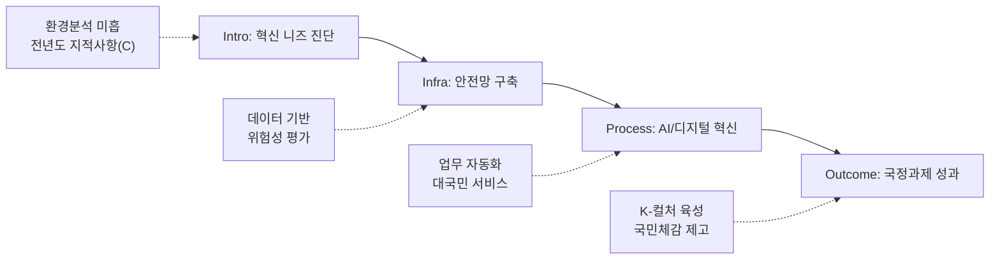

---
{"publish":true,"title":"1-2 공공기관 혁신 노력과 성과 지표 작성 방안","created":"2025-12-09","modified":"2025-12-10T21:01:27.036+09:00","tags":["#경영평가","#작성가이드","#혁신성과","#지표_1-2"],"cssclasses":""}
---


# [1-2 공공기관 혁신 노력과 성과] 세부평가내용 작성 방안

> [!abstract] 문서 개요
> 본 문서는 '1.2 공공기관 혁신 노력과 성과' 지표의 2025년도 경영평가보고서 작성을 위한 논리적 흐름(Storyline)과 문단별 세부 작성 방안을 제안합니다.
> 
> **핵심 목표**: [[25년 경평/2_지표별 자료/1-2_공공기관_혁신_노력과_성과/3_전년도_지적사항_및_개선실적\|전년도 지적사항(C 등급)]]을 극복하고, 신규 평가항목인 **'AI 활용 혁신'**과 **'국정과제 이행'** 노력을 **'스마트 혁신(Smart Innovation)'**이라는 하나의 맥락으로 연결하여 목표 등급(B등급 이상)을 달성하는 데 중점을 두었습니다.

---

## 1. Storyline 구성안 비교

### 📌 Option A: 과제 나열형 (Listing)

| 구분 | 내용 |
|------|------|
| **구조** | 안전관리 → AI 활용 → 국정과제 이행 |
| **장점** | 편람의 평가요소를 빠짐없이 다루기에 용이하며 작성 난이도가 낮음 |
| **단점** | 각 요소가 분절되어 보여 유기적인 '혁신 체계'를 보여주기 어려움 |
| **적합도** | ⭐⭐ |

```
①안전관리 → ②AI 활용 → ③국정과제 이행
```

### 📌 Option B: 문제해결형 (Issue-Solving)

| 구분 | 내용 |
|------|------|
| **구조** | 조직진단(비효율/위험) → 혁신전략(AI/안전/정책) → 문제해결 및 성과 |
| **장점** | 혁신의 목적성이 뚜렷하며 전년도 지적사항(환경분석 미흡) 해소에 유리 |
| **단점** | 안전, AI, 국정과제를 하나의 문제해결 논리로 묶기 다소 까다로움 |
| **적합도** | ⭐⭐⭐ |

```
위기진단 → 혁신전략 수립 → 과제 이행 → 성과 창출
```

### 📌 Option C: 시스템 혁신형 (System Innovation)

| 구분 | 내용 |
|------|------|
| **구조** | 혁신 인프라 구축(안전/디지털) → 핵심과제 이행(국정과제/AI) → 국민체감 성과 |
| **장점** | 기반 구축부터 성과 창출까지의 체계적인 흐름을 강조하여 'C 등급' 탈피 전략으로 적합 |
| **단점** | 초기 인프라 구축 내용이 너무 길어지면 성과 부분이 약해 보일 수 있음 |
| **적합도** | ⭐⭐⭐ |

```
Infra(안전/디지털) → Process(업무혁신) → Outcome(국민체감)
```

---

## 2. 추천 Storyline: (스마트 혁신)

> [!tip] 추천 구조
> **데이터와 AI 기술**을 접목하여 안전관리와 업무효율을 혁신하고, 이를 기반으로 **국정과제 성과**를 창출하는 구조

### 전체 흐름



### 핵심 메시지

> **"데이터와 AI 기술을 접목하여 안전관리와 업무효율을 혁신하고, 이를 통해 국정과제를 빈틈없이 이행"**

---

## 3. 문단별 작성 방안

### 세부평가내용① 안전한 일터 조성

#### 문단 1-1: 데이터 기반의 촘촘한 안전망 구축

| 항목 | 내용 |
|------|------|
| **Core Message** | 중대재해처벌법 대응을 넘어선 선제적·예방적 안전관리 체계 가동 |
| **주요 근거** | 위험성 평가 결과 기반 개선, 안전보건경영방침 |
| **담당 부서** | 안전관리팀, 기획전략팀 |

| 증빙 요소 | 내용 |
|----------|------|
| 안전체계 | 단순 매뉴얼 나열 지양 → 위험성 평가 결과 기반 개선 조치 |
| 리더십 | 경영진의 안전경영 의지(현장점검 횟수) 및 방침 선포 |
| 인증/평가 | 안전보건경영시스템(ISO 45001) 등 인증 유지/갱신 |

#### 문단 1-2: 협력업체 및 현장 안전 생태계

| 항목 | 내용 |
|------|------|
| **Core Message** | 영화 촬영현장 등 외부 협력업체까지 포괄하는 상생 안전 생태계 조성 |
| **주요 근거** | 촬영장 안전지원 사업, 노사 안전보건협의체 |
| **담당 부서** | 안전관리팀, 사업부서 |

| 증빙 요소 | 내용 |
|----------|------|
| 협력지원 | 촬영장 안전지원 사업, 협력사 안전교육 및 컨설팅 실적 |
| 소통참여 | 노사 안전보건협의체 운영 실적 및 근로자 제안 반영 |
| 상생협력 | 도급/용역 업체 대상 안전보건 공생협력 프로그램 |

---

### 세부평가내용② AI 활용을 통한 혁신 (신설/강조)

#### 문단 2-1: 업무 효율화와 생산성 혁신

| 항목 | 내용 |
|------|------|
| **Core Message** | AI 도입 로드맵에 따른 업무 자동화로 행정 비효율 제거 (일하는 방식 혁신) |
| **주요 근거** | AI 도입 계획, 업무 자동화(RPA 등) 실적 |
| **담당 부서** | 디지털혁신팀 |

| 증빙 요소 | 내용 |
|----------|------|
| 전략수립 | AI 도입 단계별 계획 및 윤리 가이드라인 수립 여부 |
| 성과측정 | 반복업무(회의록, 번역 등) 자동화를 통한 시간 절감률(%) |
| 내부확산 | 직원 대상 AI 활용 교육 및 아이디어 공모전 |

#### 문단 2-2: 대국민 서비스의 지능형 전환

| 항목 | 내용 |
|------|------|
| **Core Message** | KOBIS 등 보유 데이터와 AI를 결합하여 국민 편의 및 현장 안전 제고 |
| **주요 근거** | AI 기반 서비스(챗봇, 추천 등) 운영 실적 |
| **담당 부서** | 디지털혁신팀, 정보서비스팀 |

| 증빙 요소 | 내용 |
|----------|------|
| 서비스개선 | 챗봇 민원응대, AI 기반 영화 추천 등 체감형 서비스 사례 |
| 안전접목 | AI 기반 위험요소 예측/분석 시스템 활용 사례 (가능 시) |
| 데이터개방 | AI 학습용 데이터 개방 및 민간 활용 지원 실적 |

---

### 세부평가내용③ 국정과제 등 핵심정책 이행

#### 문단 3-1: K-컬처 전략산업화 주도

| 항목 | 내용 |
|------|------|
| **Core Message** | 'K-컬처 전략산업화' 등 핵심 국정과제를 주도적으로 이행하여 성과 창출 |
| **주요 근거** | 국정과제 이행계획 및 달성도 |
| **담당 부서** | 기획전략팀 |

| 증빙 요소 | 내용 |
|----------|------|
| 이행성과 | 국정과제 이행계획 대비 달성률 100% 강조 |
| 정책연계 | 영화산업 위기극복 정책(중예산 지원 등)과 국정과제 연계성 |
| 대표성과 | K-무비 글로벌 위상 강화 기여 성과 |

#### 문단 3-2: 국민 체감형 성과 창출

| 항목 | 내용 |
|------|------|
| **Core Message** | 국민이 피부로 느끼는 생활밀착형 성과 창출 및 적극적 소통 |
| **주요 근거** | 관람료 지원, 소외계층 향유권 확대 |
| **담당 부서** | 사업부서, 홍보팀 |

| 증빙 요소 | 내용 |
|----------|------|
| 국민체감 | 영화관람료 할인권 배포 성과 (수혜 인원, 관객 증가) |
| 사회적가치 | 문화소외계층 향유권 확대 실적 및 지원 만족도 |
| 소통홍보 | 혁신 성과에 대한 대국민 홍보 도달률 및 인지도 |

---

## 4. 차별화 포인트

### 가. 전년도 C등급(지적사항) 개선 전략

| 지적사항 | 개선 방안 | 핵심 성과 |
|---------|----------|----------|
| 체계적 분석 미흡 | **데이터 기반** 환경분석 | 위험성평가, 내부역량 진단 강화 |
| 혁신과제 연계 부족 | **AI/안전** 중심 과제 재편 | AI 로드맵 수립, 안전망 확대 |
| 성과 가시화 미흡 | **정량 지표** 중심 성과 제시 | 시간절감률, 사고율 0%, 국정과제 100% |

### 나. 스마트 혁신 (Smart Innovation)

| 영역 | 기존 방식 | 혁신 방식 (차별화) |
|------|----------|-------------------|
| 안전관리 | 내부 직원 중심 | **협력사/촬영현장**까지 확장된 상생 안전 |
| 업무방식 | 수작업/관행 답습 | **AI/RPA** 도입으로 생산성 획기적 개선 |
| 정책이행 | 단순 과제 수행 | **데이터 분석** 기반의 정교한 정책 집행 |

---

## 5. 작성 시 유의사항

### 가. 편람 세부평가요소 매칭

> [!warning] 필수 확인
> 3개 평가요소의 균형 있는 서술 필요

| 세부평가요소 | 배분 비중 | 주요 부서 |
|-------------|----------|----------|
| ① 안전한 일터 조성 | 30% | 안전관리팀 |
| ② AI 활용을 통한 혁신 | 30% | 디지털혁신팀 |
| ③ 국정과제 등 핵심정책 이행 | 40% | 기획전략팀 |

### 나. 정량 데이터 활용

> [!success] 핵심 정량지표
> - 안전: 위험성평가 개선율 **00%**, 사고율 **0%**
> - AI: 업무시간 절감 **00시간**, 자동화 **00건**
> - 국정과제: 이행률 **100%**, 수혜인원 **00명**

### 다. 증빙자료 연계

| 문단 | 핵심 증빙 |
|------|----------|
| 안전관리 | 위험성평가 보고서, 안전보건경영시스템 인증서 |
| AI활용 | AI 도입 기본계획, 성과분석 보고서 |
| 국정과제 | 국정과제 이행 실적 보고서 |

---

## 🔗 관련 자료

| 구분 | 문서명 | 비고 |
|------|--------|------|
| 편람 분석 | [[25년 경평/2_지표별 자료/1-2_공공기관_혁신_노력과_성과/2_편람_내용_분석]] | 세부평가 요소별 가이드 |
| 지적사항 | [[25년 경평/2_지표별 자료/1-2_공공기관_혁신_노력과_성과/3_전년도_지적사항_및_개선실적]] | C등급 원인 및 개선방향 |
| 부서 매핑 | [[25년 경평/2_지표별 자료/1-2_공공기관_혁신_노력과_성과/6_부서별_실적_통합_매핑표]] | 부서별 실적 종합 |
| 공통 자료 | [[01_편람_및_지침]] | 작성 가이드 |

---

*작성일: 2025-12-09*
*검증상태: 전년도 지적사항 반영 확인*