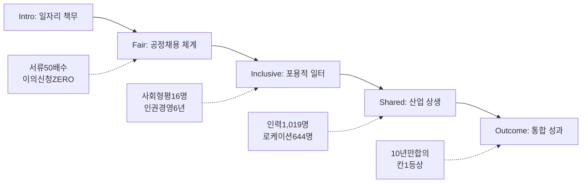

---
{"publish":true,"permalink":"/경영평가/1-3/4_중장기경영전략연계","title":"4_중장기 경영전략 연계","created":"2025-12-10T21:01:27.806+09:00","modified":"2025-12-17T16:29:36.888+09:00","tags":["#경영평가","#경영전략","#비계량","#중장기전략","#일자리","#균등한기회"],"cssclasses":""}
---


# 일자리 및 균등한 기회 - 중장기 경영전략 연계

> [!abstract] 문서 개요
> **지표번호**: 1.3  
> **배점**: 비계량 2점 + 계량 1점 = 총 3점  
> **연계문서**: 영화진흥위원회 중장기 경영전략체계 수립(2025-2029)  
> **작성목적**: 중장기 경영전략과 지표 간 연계방안 도출
> 
> 본 문서는 '1.3 일자리 및 균등한 기회' 지표와 **중장기 경영전략체계(2025-2029)**의 연계 포인트를 분석하여 보고서 작성 시 전략적 근거로 활용할 수 있도록 합니다.
>
> **핵심 연계**: 전략방향 IV. 책임 있는 공공경영 (⑪ 고객 중심 경영 → 상생 협력 일자리 창출)

---

## 📋 중장기 경영전략체계 연계 개요

### 가. 핵심 연계 전략방향

| 구분 | 내용 |
|------|------|
| **전략방향** | IV. 책임 있는 공공경영 |
| **연계 전략과제** | ⑪ 고객 중심 경영 → 상생 협력 일자리 창출 |
| **핵심가치** | 성장과 균형 \| 공정과 확산 |
| **경영목표** | 책임과 합리적 조직경영 실현 |

### 나. 전략과제-실행과제 연계

| 전략과제 | 실행과제 | 일자리·균등 기회 연계 포인트 | 2025년 핵심 성과 |
|---------|---------|--------------------------|--------------------|
| **⑪ 고객 중심 경영** | 1) 상생 협력 일자리 창출 | 공공기관 일자리 창출, 청년·취약계층 고용 | **21명 채용**, 사회형평 **16명(76%)** |
| **① K-무비 창제작인력 양성** | 1) 교육시스템 혁신<br>2) 창작자 지원 강화 | 영화산업 일자리 기여, 신진인력 양성 | **1,019명** 양성 (KAFA 50 + 영화인교육 950 + S#1 19) |
| **⑩ 열린 성과 중심 경영** | 3) 성과중심 조직관리 | 균형인사, 다양성 존중, 차별 없는 조직 | 인권경영 **6년 연속**, 가족친화 **11년 연속** |

---

## 🔗 세부평가내용과 전략 연계

### 가. 세부평가내용①: 일자리 창출 및 공정채용

> **평가내용**: 정규직 전환, 청년 고용, 신규 채용 등 공공기관 일자리 창출 노력

#### 1) 기관 직접 일자리 (공공일자리)

| 일자리 유형 | 중장기 전략 연계 | 2025년 실적 | 성과 |
|------------|----------------|------------|------|
| **정규직 채용** | ⑪ 상생 협력 일자리 창출 | **5명** | 연간 채용계획 100% 달성 |
| **비정규직 채용** | ⑪ 상생 협력 일자리 창출 | **16명** (인턴 5 포함) | 7년 연속 전환대상 Zero |
| **청년 고용** | 핵심가치: 성장과 균형 | **10명** (정규직 5 + 인턴 5) | 청년 정규직 **100%** 전환 |
| **취약계층 고용** | 핵심가치: 공정과 확산 | **6명** (보훈 3 + 지역 2 + 장애 1) | 장애인 편의제공 **신설** |

#### 2) 공정채용 체계 (Fair)

| 공정채용 영역 | 중장기 전략 연계 | 2025년 실적 | 성과 |
|-------------|----------------|------------|------|
| **서류전형 확대** | ⑫ 청렴 공정한 윤리경영 | **30→50배수** | 응시기회 확대 |
| **면접 외부위원** | ⑫ 청렴 공정한 윤리경영 | **50% 이상** | 공정성 강화 |
| **채용점검위원회** | ⑫ 청렴 공정한 윤리경영 | 외부위원 포함 운영 | 이의신청 **ZERO** |
| **2026년 조기채용** | ⑪ 상생 협력 일자리 창출 | **1분기 내** 협의완료 | 청년고용 조기 기여 |

---

### 나. 세부평가내용②: 다양한 근로형태

> **평가내용**: 유연근무제, 일·가정 양립 등 포용적 일터 조성

#### 1) 유연하고 포용적인 일터 (Inclusive)

| 근로형태 | 중장기 전략 연계 | 2025년 실적 | 성과 |
|---------|----------------|------------|------|
| **유연근무** | ⑩ 성과중심 조직관리 | **187명** (월별 101 + 일별 69 + 스마트 17) | 전 직원 활용 가능 |
| **시간대 확대** | ⑩ 성과중심 조직관리 | **4개 시간대** (월·금 확대) | 선택권 확대 |
| **육아휴직** | 핵심가치: 성장과 균형 | **10명** (여 8 + 남 2) | 남성 육아휴직 확대 |
| **가족친화인증** | ⑪ 고객 중심 경영 | **재인증 신청** | **11년 연속** 유지 |
| **직장어린이집** | 핵심가치: 성장과 균형 | 센터가온어린이집 운영 | 임직원 양육 지원 |
| **EAP 상담** | ⑩ 성과중심 조직관리 | **8명/28회기** + 보건 41명 | 멘탈헬스 강화 |

#### 2) 인권경영 및 조직문화

| 조직문화 영역 | 중장기 전략 연계 | 2025년 실적 | 성과 |
|-------------|----------------|------------|------|
| **인권경영시스템** | ⑫ 청렴 공정한 윤리경영 | **6년 연속** 인증 | 문체부 산하 **유일** |
| **고충접수** | ⑫ 청렴 공정한 윤리경영 | **5년 연속 감소** → **0건** | 고충상담원 4명 운영 |
| **AI 기초교육** | ⑩ 성과중심 조직관리 | **67명** 참여 | 차세대 역량 강화 |

---

### 다. 세부평가내용③: 민간 일자리 창출 기여

> **평가내용**: 영화산업 일자리 창출에 기여하기 위한 노력과 성과

#### 1) 영화산업 일자리 생태계 (Shared - 산업 상생)

| 일자리 유형 | 중장기 전략 연계 | 2025년 실적 | 성과 |
|------------|----------------|------------|------|
| **S#1 아카데미** | ④ 기획개발 역량 강화 | 졸업작가 **19명** | 신진 시나리오 작가 양성 |
| **S#1 비즈매칭** | ④ 기획개발 역량 강화 | **427건** 미팅 | 작가-산업 연계 |
| **시나리오 공모전** | ④ 기획개발 역량 강화 | **963편** (+27.9%↑) | 신인 발굴 확대 |
| **제작지원** | ⑤ 중예산영화 지원확대 | **88편** (독립 50 + 중예산 38) | 현장 일자리 창출 |
| **신인 데뷔** | ① 창제작인력 양성 | **7건** (S#1 2 + 공모전 5) | 산업 진입 성과 |

#### 2) 영화전문인력 양성 파이프라인

| 양성 영역 | 중장기 전략 연계 | 2025년 실적 | 성과 |
|----------|----------------|------------|------|
| **KAFA 핵심인재** | ① K-무비 창제작인력 양성 | **50명** 양성, **34편** 제작 | 교육생 +22%, 제작편수 +13% |
| **영화인교육팀** | ① K-무비 창제작인력 양성 | **30개 과정** **950명** | 연출/제작/촬영부 양성 |
| **영화제 수상** | ① K-무비 창제작인력 양성 | 초청 **161건**, 수상 **26건** | 칸영화제 라시네프 **1등상** |
| **졸업생 산업활동** | ① K-무비 창제작인력 양성 | **1,222작품** 참여 (+15%) | 산업 수요 부합 인재 |
| **글로벌 교육** | ③ 글로벌 진출 강화 | **70명** (10개국 60 + 베트남 14) | 글로벌 경쟁력 강화 |

#### 3) 국제협력을 통한 일자리 창출

| 국제협력 유형 | 중장기 전략 연계 | 2025년 실적 | 성과 |
|-------------|----------------|------------|------|
| **로케이션 인센티브** | ③ 글로벌 진출 강화 | 한국스태프 **644명** 고용 | 국내집행 **211.8억원** |
| **프로듀서 진출** | ③ 글로벌 진출 강화 | **8개국 33인** 선발 | KO-PICK 쇼케이스 |
| **비즈매칭** | ③ 글로벌 진출 강화 | **289건** 완료 | 글로벌 네트워크 확충 |
| **해외마켓 상담** | ③ 글로벌 진출 강화 | **3,949건** (+32%↑) | 세일즈 인력 활동 확대 |

---

### 라. 세부평가내용④: 사회형평적 인력 활용

> **평가내용**: 성별, 장애, 지역 등에 따른 차별 없이 균등한 기회 보장

#### 1) 사회형평적 채용 (Inclusive)

| 사회형평 유형 | 중장기 전략 연계 | 2025년 실적 | 성과 |
|-------------|----------------|------------|------|
| **청년 채용** | ⑪ 상생 협력 일자리 창출 | **10명** (정규직 5 + 인턴 5) | 청년 정규직 **100%** |
| **보훈 채용** | 핵심가치: 공정과 확산 | **3명** | 보훈특별고용 연계 |
| **지역인재** | 핵심가치: 공정과 확산 | **2명** | 부산시 연계 채용설명회 |
| **장애인** | 핵심가치: 공정과 확산 | **1명** + 편의제공 **신설** | 장애포용 강화 |
| **사회형평 합계** | ⑪ 상생 협력 일자리 창출 | **16명** | **전체 채용의 76%** |

#### 2) 문화접근성 (영화산업 균등기회)

| 접근성 영역 | 중장기 전략 연계 | 2025년 실적 | 성과 |
|-----------|----------------|------------|------|
| **가치봄 영화** | ② 독립예술영화 기반 조성 | **146편** (동시개봉 12편) | 장애인 문화접근성 |
| **찾아가는 영화관** | ⑥ 영화문화 다양성 제고 | **17개 행정구역** | 도서·산간 대상 |
| **영화제 지원** | ⑥ 영화문화 다양성 제고 | **20개처** | 전년대비 2배 |

---

### 마. 세부평가내용⑤: 표준계약서 사용

> **평가내용**: 문화·예술·방송·콘텐츠 분야 표준계약서 사용 여부

#### 1) 공정환경 조성 (Shared - 산업 상생)

| 공정환경 영역 | 중장기 전략 연계 | 2025년 실적 | 성과 |
|-------------|----------------|------------|------|
| **표준보수지침** | ⑫ 청렴 공정한 윤리경영 | 문체부 공식 **공표** (2025.10.1.) | **10년 만** 첫 노사정 합의 |
| **노사정 협의회** | ⑫ 청렴 공정한 윤리경영 | 실무협의회 **4회** 개최 | 합의 도출 |
| **안전보건협약** | ⑪ 상생 협력 일자리 창출 | 노사정 공동협약 **체결** (2025.11.20.) | 산업단위 **최초** |
| **근로표준계약서** | ⑫ 청렴 공정한 윤리경영 | 사용률 **67.9%** (5억 이상 82.4%) | 전년 대비 +2.6%p |
| **성평등센터 교육** | ⑫ 청렴 공정한 윤리경영 | **2,977명** 수강 (63회) | 만족도 4.75점 |
| **피해자 지원** | ⑫ 청렴 공정한 윤리경영 | 법률지원 **134건** | 지원기준 확대 |

---

## 📊 핵심가치와 일자리 정책 연계

### 가. 성장과 균형

| 핵심가치 의미 | 일자리 정책 연계 | 2025년 대표 성과 |
|-------------|----------------|-----------------|
| 영화산업 성장과 구성원 균형 발전 | 양질의 일자리 + 일·생활 균형 | 유연근무 **187명**, 육아휴직 **10명** |
| 다양성 존중 | 성별, 세대, 장애 등 다양성 포용 | 사회형평 **16명** (76%), 남성 육아휴직 **2명** |

### 나. 공정과 확산

| 핵심가치 의미 | 일자리 정책 연계 | 2025년 대표 성과 |
|-------------|----------------|-----------------|
| 공정한 기회 제공 | 블라인드 채용, 균형인사 | 이의신청 **ZERO**, 서류 **50배수** |
| 성과의 확산 | 취약계층 고용, 지역인재 채용 | 장애인 편의제공 **신설**, 지역인재 **2명** |

---

## 🎬 영화산업 일자리 기여 성과 요약

### 가. 공공-민간 상생 모델

```
[공공기관 책무]                    [영화산업 기여]
공정채용 21명 ─────────────────→ KAFA 50명 + 영화인교육 950명 = 1,019명 양성
사회형평 16명 (76%) ───────────→ 비즈매칭 716건, 신인 데뷔 7건
유연근무 187명 ────────────────→ 로케이션 인센티브 644명 고용
                    ↓
            [상생의 일자리 생태계]
            표준보수지침 10년 만 합의
            노사정 안전보건협약 체결
            칸영화제 라시네프 1등상 수상
```

### 나. 일자리 기여 성과 측정

| 측정 지표 | 연계 전략과제 | 2025년 성과 |
|----------|-------------|------------|
| **영화인력 양성** | ① 창제작인력 양성 | **1,019명** (KAFA 50 + 영화인교육 950 + S#1 19) |
| **졸업생 산업활동** | ① 창제작인력 양성 | **1,222작품** 참여 (+15%↑) |
| **로케이션 고용** | ③ 글로벌 진출 강화 | 한국스태프 **644명** (211.8억원) |
| **비즈매칭** | ③④ 글로벌+기획개발 | **716건** (S#1 427 + 국제 289) |
| **신인 데뷔** | ④ 기획개발 역량 강화 | **7건** (칸영화제 1등상 포함) |

---

## ✍️ 보고서 작성 시 활용 가이드

### 가. 전년도 지적사항 해소 연계

| 지적사항 | 개선 조치 | 중장기 전략 연계 |
|---------|----------|-----------------|
| 채용 공정성 미흡 | 서류 50배수 + 외부위원 50% + 이의신청 ZERO | ⑫ 청렴 공정한 윤리경영 |
| 비정규직 관리 | 사전심사제 운영, 7년 연속 전환대상 Zero | ⑪ 상생 협력 일자리 창출 |
| 민간 일자리 연계 부족 | **1,019명 양성** + 로케이션 644명 + 비즈매칭 716건 | ①③④ 창제작+글로벌+기획개발 |

### 나. 스토리라인 구조 (Fair-Inclusive-Shared)



### 다. 핵심 작성 포인트

#### 1) 일자리 창출 기술 시

```
✓ 기관 직접 일자리: 채용 21명, 정규직 전환 2년 연속, 사회형평 76%
✓ 영화산업 간접 일자리: 인력 1,019명 양성, 로케이션 644명 고용
✓ 전략과제 ①③④와 연계한 일자리 기여 성과 (졸업생 1,222작품 참여)
```

#### 2) 균등한 기회 기술 시

```
✓ 사회형평 5대 영역: 청년 10 + 보훈 3 + 지역 2 + 장애 1 = 16명(76%)
✓ 핵심가치(공정과 확산) 연계: 장애인 편의제공 신청제도 신설
✓ 인권경영 6년 연속, 가족친화 11년 연속 → 조직문화 우수성
```

#### 3) 표준계약서 기술 시

```
✓ 표준보수지침: 10년 만 노사정 합의 → 문체부 공표 (2025.10.1.)
✓ 안전보건협약: 산업단위 최초 노사정 공동협약 (2025.11.20.)
✓ 사용률: 67.9% (5억 이상 82.4%) → 전년대비 +2.6%p
```

---

## 🔗 관련 자료

| 구분 | 문서명 | 비고 |
|------|--------|------|
| 목차 구성 | [[25년 경평/2_지표별 자료/1-3_일자리_및_균등한_기회/1_목차_구성안]] | 보고서 목차 골격 |
| 편람 분석 | [[25년 경평/2_지표별 자료/1-3_일자리_및_균등한_기회/2_편람_내용_분석]] | 세부평가 요소별 작성 가이드 |
| 지적사항 | [[25년 경평/2_지표별 자료/1-3_일자리_및_균등한_기회/3_전년도_지적사항_및_개선실적]] | 전년도 지적사항 대응 |
| 작성방안 | [[25년 경평/2_지표별 자료/1-3_일자리_및_균등한_기회/5_지표_작성_방안]] | 문단별 세부 작성 방안 |

---

*작성일: 2025-12-17*
*검증상태: 5_지표_작성_방안.md 기반 업데이트 완료*
