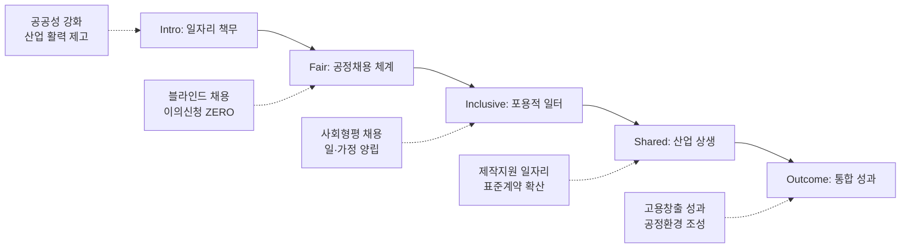

---
{"publish":true,"title":"1-3 일자리 및 균등한 기회 지표 작성 방안","created":"2025-12-04","modified":"2025-12-09T15:01:05.000+09:00","tags":["경영평가","작성가이드","일자리","균등한기회","지표_1-3"],"cssclasses":""}
---


# [1-3 일자리 및 균등한 기회] 세부평가내용 작성 방안

> [!abstract] 문서 개요
> 본 문서는 '1.3 일자리 및 균등한 기회' 지표의 2025년도 경영평가보고서 작성을 위한 논리적 흐름(Storyline)과 문단별 세부 작성 방안을 제안합니다.
> 
> **핵심 목표**: [[25년 경평/2_지표별 자료/1-3_일자리_및_균등한_기회/3_전년도_지적사항_및_개선실적\|전년도 지적사항(C 등급)]]을 극복하고, **'공정채용 체계 고도화'**와 **'영화산업 일자리 창출 기여'**를 부각하여 목표 등급(B등급 이상)을 달성하는 데 중점을 두었습니다.

---

## 1️⃣ Storyline 구성안 비교

### 📌 Option A: 평가요소 순차형 (Sequential)

| 구분 | 내용 |
|------|------|
| **구조** | 일자리 창출 → 근로형태 → 민간 일자리 → 사회형평 → 표준계약서 |
| **장점** | 편람의 5개 평가요소를 빠짐없이 순서대로 다루기에 용이 |
| **단점** | 요소 간 연계성이 보이지 않아 단순 나열로 느껴질 수 있음 |
| **적합도** | ⭐⭐ |

```
①공공일자리 → ②근로형태(유연) → ③민간일자리 → ④사회형평 → ⑤표준계약서
```

### 📌 Option B: 기관-산업 이원화형 (Dual Track)

| 구분 | 내용 |
|------|------|
| **구조** | 기관 내 일자리(채용+균형인사) + 영화산업 일자리(민간창출+표준계약서) |
| **장점** | 공공기관으로서의 책무와 영화진흥기관으로서의 역할을 명확히 구분 |
| **단점** | 두 트랙 간의 유기적 연결고리가 약해 보일 수 있음 |
| **적합도** | ⭐⭐⭐ |

```
Track 1(내부): 공정채용/워라밸 + Track 2(외부): 제작지원/표준계약 → 통합 성과
```

### 📌 Option C: 가치 중심형 (Value-Based)

| 구분 | 내용 |
|------|------|
| **구조** | 공정(Fair) + 포용(Inclusive) + 상생(Shared) → 지속가능 성장 |
| **장점** | 핵심가치와 연계하여 일관된 메시지 전달력 높음 |
| **단점** | 개별 실적을 가치 프레임에 억지로 맞추면 부자연스러울 수 있음 |
| **적합도** | ⭐⭐ |

```
Fair(채용) → Inclusive(형평/유연) → Shared(산업생태계)
```

---

## 2️⃣ 추천 Storyline (공정-상생의 일자리 생태계)

> [!tip] 추천 구조
> **"공정한 채용으로 양질의 공공일자리를 창출(Fair & Inclusive)하고, 영화산업 일자리 확대를 통해 상생의 생태계를 구축(Shared)"**하는 구조

### 전체 흐름



### 핵심 메시지

> **"시스템으로 완성한 공정채용과 포용적 조직문화 위에서, 영화산업 현장의 좋은 일자리를 만드는 선순환 구조 확립"**

---

## 3️⃣ 문단별 작성 방안

### 세부평가내용① 일자리 창출 및 공정채용

#### 문단 1-1: 공정채용 체계의 완성

| 항목 | 내용 |
|------|------|
| **Core Message** | 전형 전 과정에 외부위원·감사부서 참여로 채용 공정성 확보 |
| **주요 근거** | 외부위원 확대, 이의신청 0건 |
| **담당 부서** | 인사총무팀 |

| 증빙 요소 | 내용 |
|----------|------|
| 공정성 | 서류전형 50배수 확대, 면접 외부위원 50% 이상 |
| 투명성 | 채용점검위원회 운영, 이의신청 ZERO 달성 |
| 채용실적 | 신규 채용 21명 (정규직 5 + 비정규직 16), 조기채용 |

#### 문단 1-2: 비정규직 관리의 적정성

| 항목 | 내용 |
|------|------|
| **Core Message** | 사전심사제 운영으로 불필요한 비정규직 채용 방지 |
| **주요 근거** | 사전심사제 운영 실적, 전환대상 0명 |
| **담당 부서** | 인사총무팀 |

| 증빙 요소 | 내용 |
|----------|------|
| 사전통제 | 비정규직 채용사전심사제 운영 (내·외부 위원) |
| 정규직화 | 정규직 전환 대상 비정규직 7년 연속 Zero 유지 |

---

### 세부평가내용② 다양한 근로형태 및 사회형평적 인력 (요소 ②④)

#### 문단 2-1: 유연하고 포용적인 일터 조성

| 항목 | 내용 |
|------|------|
| **Core Message** | 다양한 유연근무제 및 일·가정 양립 지원으로 균형 실현 |
| **주요 근거** | 유연근무 활용률, 가족친화인증 |
| **담당 부서** | 인사총무팀 |

| 증빙 요소 | 내용 |
|----------|------|
| 유연근무 | 활용 187명, 시간대 4개로 확대 |
| 모성보호 | 육아휴직 10명(남성 2명), 가족돌봄휴가 25명 |
| 인증획득 | 가족친화인증기업 재인증 신청 |

#### 문단 2-2: 사회형평적 채용으로 포용적 성장

| 항목 | 내용 |
|------|------|
| **Core Message** | 장애인·청년·지역인재 채용으로 사회적 가치 실현 |
| **주요 근거** | 사회형평적 채용 실적, 장애인 편의제공 |
| **담당 부서** | 인사총무팀 |

| 증빙 요소 | 내용 |
|----------|------|
| 형평채용 | 사회형평적 채용 11명 (청년5+보훈3+지역2+장애인1) |
| 장애포용 | 장애인 편의제공 신청제도 신설 |
| 인사제도 | 무기계약직 6명 승단 및 인사평가 대상 포함 |

---

### 세부평가내용③ 민간 일자리 창출 기여

#### 문단 3-1: 영화산업 일자리 생태계 구축

| 항목 | 내용 |
|------|------|
| **Core Message** | 신진 영화인 양성 및 제작지원으로 산업 인력 파이프라인 구축 |
| **주요 근거** | S#1 아카데미, 제작지원 편수 |
| **담당 부서** | 인재양성팀, 지원사업부서 |

| 증빙 요소 | 내용 |
|----------|------|
| 인력양성 | S#1 아카데미 졸업작가 19명, 비즈매칭 427건 |
| 제작지원 | 기획개발 141편, 제작지원 88편 (현장 일자리) |
| 데뷔지원 | 신인 크레딧 데뷔 7건 (S#1 2건 + 공모전 5건) |

---

### 세부평가내용④ 표준계약서 사용 (요소 ⑤)

#### 문단 4-1: 영화산업 공정환경 조성

| 항목 | 내용 |
|------|------|
| **Core Message** | 표준계약서 보급과 표준보수지침 공표로 공정환경 선도 |
| **주요 근거** | 표준보수지침 합의, 사용률 |
| **담당 부서** | 공정환경조성팀 |

| 증빙 요소 | 내용 |
|----------|------|
| 표준보수 | 영화산업 표준보수지침 공표 (10년 만 첫 노사정 합의) |
| 계약확산 | 근로표준계약서 사용률 67.9%, 사업요강 권고 명시 |
| 안전협약 | 노사정 공동협약 체결 ('25.11.), 명예감독관 도입 준비 |

---

## 4️⃣ 차별화 포인트

### 가. 전년도 C등급(지적사항) 개선 전략

| 지적사항 | 개선 방안 | 핵심 성과 |
|---------|----------|----------|
| 채용점검 객관성 부족 | **점검위원회** 내실화 | 응시결과 13건 공개, 이의신청 0건 |
| 장애인 적합직무 부재 | **편의제공** 제도 신설 | 장애인 1명 채용, 편의지원 체계 구축 |
| 일자리 연계성 미흡 | **비즈매칭** 강화 | S#1 비즈매칭 427건, 데뷔 7건 |

### 나. 공공-민간 상생 모델

| 영역 | 공공 부문 (Internal) | 민간 부문 (External) |
|------|-------------------|-------------------|
| 채용/고용 | 블라인드 채용, 유연근무 | 제작지원 일자리, 신진인력 양성 |
| 공정/안전 | 채용 비리 ZERO | 표준보수지침, 안전보건협약 |

---

## 5️⃣ 작성 시 유의사항

### 가. 편람 세부평가요소 매칭

> [!warning] 필수 확인
> 5개 평가요소의 균형 있는 서술 및 계량지표 정합성 확인

| 세부평가요소 | 배분 비중 | 주요 부서 |
|-------------|----------|----------|
| ① 일자리 창출 및 공정채용 | 25% | 인사총무팀 |
| ② 다양한 근로형태 | 15% | 인사총무팀 |
| ③ 민간 일자리 창출 | 30% | 사업부서 |
| ④ 사회형평적 인력 | 15% | 인사총무팀 |
| ⑤ 표준계약서 | 15% | 공정환경조성팀 |

### 나. 정량 데이터 활용

> [!success] 핵심 정량지표
> - 채용: 신규 **21명**, 이의신청 **0건**
> - 유연근무: 활용 **187명**, 육아휴직 **10명**
> - 민간지원: 매칭 **427건**, 데뷔 **7건**
> - 표준계약: 사용률 **67.9%**

### 다. 증빙자료 연계

| 문단 | 핵심 증빙 |
|------|----------|
| 공정채용 | 채용점검위원회 회의록, 외부위원 위촉 현황 |
| 유연근무 | 유연근무 사용 내역서, 가족친화인증서 |
| 민간일자리 | S#1 아카데미 운영결과, 제작지원작 크레딧 |
| 표준계약 | 표준보수지침 합의문, 안전보건협약서 |

---

## 🔗 관련 자료

| 구분 | 문서명 | 비고 |
|------|--------|------|
| 편람 분석 | [[25년 경평/2_지표별 자료/1-3_일자리_및_균등한_기회/2_편람_내용_분석]] | 세부평가 요소별 가이드 |
| 지적사항 | [[25년 경평/2_지표별 자료/1-3_일자리_및_균등한_기회/3_전년도_지적사항_및_개선실적]] | C등급 원인 및 개선방향 |
| 부서 매핑 | [[25년 경평/2_지표별 자료/1-3_일자리_및_균등한_기회/6_부서별_실적_통합_매핑표]] | 부서별 실적 종합 |
| 공통 자료 | [[01_편람_및_지침]] | 작성 가이드 |

---

*작성일: 2025-12-04*
*검증상태: 전년도 지적사항 반영 확인*