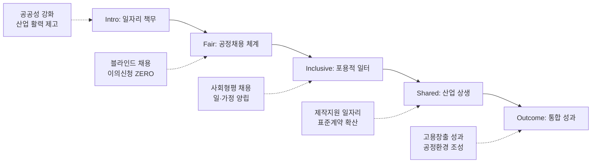

---
{"publish":true,"permalink":"/경영평가/1-3/5_지표작성방안","title":"5_지표 작성 방안","created":"2025-12-14","modified":"2025-12-14T11:37:27.792+09:00","tags":["#경영평가","#작성가이드","#일자리","#균등한기회","#지표_1-3"],"cssclasses":""}
---


# [1-3 일자리 및 균등한 기회] 세부평가내용 작성 방안

> [!abstract] 문서 개요
> 본 문서는 '1.3 일자리 및 균등한 기회' 지표의 2025년도 경영평가보고서 작성을 위한 논리적 흐름(Storyline)과 문단별 세부 작성 방안을 제안합니다.
> 
> **핵심 목표**: [[25년 경평/2_지표별 자료/1-3_일자리_및_균등한_기회/3_전년도_지적사항_및_개선실적\|전년도 지적사항(C 등급)]]을 극복하고, **'공정채용 체계 고도화'**와 **'영화산업 일자리 창출 기여'**를 부각하여 목표 등급(B등급 이상)을 달성하는 데 중점을 두었습니다.

---

## 1. Storyline 구성안 비교

### 📌 Option A: 평가요소 순차형 (Sequential)

| 구분 | 내용 |
|------|------|
| **구조** | 일자리 창출 → 근로형태 → 민간 일자리 → 사회형평 → 표준계약서 |
| **장점** | 편람의 5개 평가요소를 빠짐없이 순서대로 다루기에 용이 |
| **단점** | 요소 간 연계성이 보이지 않아 단순 나열로 느껴질 수 있음 |
| **적합도** | ⭐⭐ |

```
①공공일자리 → ②근로형태(유연) → ③민간일자리 → ④사회형평 → ⑤표준계약서
```

### 📌 Option B: 기관-산업 이원화형 (Dual Track)

| 구분 | 내용 |
|------|------|
| **구조** | 기관 내 일자리(채용+균형인사) + 영화산업 일자리(민간창출+표준계약서) |
| **장점** | 공공기관으로서의 책무와 영화진흥기관으로서의 역할을 명확히 구분 |
| **단점** | 두 트랙 간의 유기적 연결고리가 약해 보일 수 있음 |
| **적합도** | ⭐⭐⭐ |

```
Track 1(내부): 공정채용/워라밸 + Track 2(외부): 제작지원/표준계약 → 통합 성과
```

### 📌 Option C: 가치 중심형 (Value-Based)

| 구분 | 내용 |
|------|------|
| **구조** | 공정(Fair) + 포용(Inclusive) + 상생(Shared) → 지속가능 성장 |
| **장점** | 핵심가치와 연계하여 일관된 메시지 전달력 높음 |
| **단점** | 개별 실적을 가치 프레임에 억지로 맞추면 부자연스러울 수 있음 |
| **적합도** | ⭐⭐ |

```
Fair(채용) → Inclusive(형평/유연) → Shared(산업생태계)
```


---

## 2. 추천 Storyline (공정-상생의 일자리 생태계)

> [!tip] 추천 구조
> **"공정한 채용으로 양질의 공공일자리를 창출(Fair & Inclusive)하고, 영화산업 일자리 확대를 통해 상생의 생태계를 구축(Shared)"**하는 구조

### 전체 흐름



### 핵심 메시지

> **"시스템으로 완성한 공정채용과 포용적 조직문화 위에서, 영화산업 현장의 좋은 일자리를 만드는 선순환 구조 확립"**

---

## 3. 문단별 작성 방안

### 세부평가내용① 일자리 창출 및 공정채용

#### 문단 1-1: 공정채용 체계의 완성

| 항목 | 내용 |
|------|------|
| **Core Message** | 전형 전 과정에 외부위원·감사부서 참여로 채용 공정성 확보 |
| **주요 근거** | 외부위원 확대, 이의신청 0건, 채용점검위원회 운영 |
| **담당 부서** | 인사총무팀 |

| 구분 | 실적 | 성과 |
|------|------|------|
| 신규 채용 | 총 **21명** (정규직 5 + 비정규직 16) | 연간 채용계획 100% 달성 |
| 서류전형 | 합격배수 **30→50배수** 확대 | 응시기회 확대 |
| 면접전형 | 외부위원 **50% 이상** 참여 | 공정성 강화 |
| 채용점검위원회 | 외부위원 포함 **점검위원회** 운영 | 이의신청 **ZERO** |
| 응시결과 공개 | **13건** 정보공개 | 투명성 확보 |

> [!example] 추천 스토리라인
> **"채용 공정성 강화 필요 → 서류전형 50배수 확대 + 면접 외부위원 50% 이상 → 채용점검위원회 운영 → 이의신청 ZERO 달성"**
> 
> - 도입: 공공기관 채용 비리 근절 및 공정성 확보 필요
> - 전개: 서류전형 50배수 확대, 면접 외부위원 50% 이상, 채용점검위원회 운영, 응시결과 13건 공개
> - 성과: 신규 채용 21명 완료, 이의신청 0건, 채용 비리 ZERO

#### 문단 1-2: 비정규직 관리의 적정성

| 항목 | 내용 |
|------|------|
| **Core Message** | 사전심사제 운영으로 불필요한 비정규직 채용 방지 및 처우 개선 |
| **주요 근거** | 사전심사제 운영 실적, 전환대상 0명, 무기계약직 승단 |
| **담당 부서** | 인사총무팀 |

| 구분 | 실적 | 성과 |
|------|------|------|
| 사전심사제 | 내·외부 위원 구성 심사 | 불필요한 채용 방지 |
| 정규직 전환 대상 | **7년 연속 Zero** 유지 | 적정 인력 운영 |
| 무기계약직 승단 | **6명** 승단 발령 ('25.3월) | 처우 개선 |
| 인사평가 확대 | 무기계약직 인사평가 대상 **포함** | 공정한 평가 체계 |

> [!example] 추천 스토리라인
> **"비정규직 남용 방지 필요 → 사전심사제 운영 → 무기계약직 처우 개선 → 정규직 전환 대상 7년 연속 ZERO"**
> 
> - 도입: 공공기관 비정규직 적정 관리 및 정규직 전환 정책 이행 필요
> - 전개: 비정규직 채용사전심사제 운영, 무기계약직 6명 승단, 인사평가 대상 포함
> - 성과: 정규직 전환 대상 비정규직 7년 연속 Zero 유지, 처우 개선 실현


---

### 세부평가내용② 다양한 근로형태를 통한 일자리 창출

#### 문단 2-1: 유연하고 포용적인 일터 조성

| 항목 | 내용 |
|------|------|
| **Core Message** | 다양한 유연근무제 및 일·가정 양립 지원으로 균형 실현 |
| **주요 근거** | 유연근무 활용률, 가족친화인증, 육아휴직 실적 |
| **담당 부서** | 인사총무팀 |

| 구분 | 실적 | 성과 |
|------|------|------|
| 유연근무 활용 | 총 **187명** (월별 101 + 일별 69 + 스마트워크 17) | 전 직원 활용 가능 |
| 시간대 확대 | **4개 시간대** 모두 가능 (월·금 확대) | 선택권 확대 |
| 육아휴직 | **10명** (여 8명, 남 2명) | 남성 육아휴직 확대 |
| 가족돌봄휴가 | **25명** 활용 | 돌봄 지원 강화 |
| 가족친화인증 | **재인증 신청** (2014년 최초 인증) | 11년 연속 유지 |

> [!example] 추천 스토리라인
> **"일·가정 양립 수요 증가 → 유연근무 시간대 4개로 확대 → 육아휴직 10명(남성 2명 포함) → 가족친화인증 재인증"**
> 
> - 도입: MZ세대 유입 및 일·가정 양립 지원 확대 필요
> - 전개: 유연근무 시간대 4개로 확대, 활용 187명, 육아휴직 10명(남성 2명), 가족돌봄휴가 25명
> - 성과: 가족친화인증기업 재인증 신청, 직원 만족도 6.4점/7점

---

### 세부평가내용③ 민간 일자리 창출 기여

#### 문단 3-1: 영화산업 일자리 생태계 구축

| 항목 | 내용 |
|------|------|
| **Core Message** | 신진 영화인 양성 및 제작지원으로 산업 인력 파이프라인 구축 |
| **주요 근거** | S#1 아카데미, 비즈매칭, 제작지원 편수, 신인 데뷔 |
| **담당 부서** | 창작제작팀, 영화인교육팀 |

| 구분 | 실적 | 성과 |
|------|------|------|
| S#1 아카데미 | 졸업작가 **19명** 배출 | 신진 시나리오 작가 양성 |
| S#1 비즈매칭 | **427건** 미팅 성사 | 작가-산업 연계 |
| 시나리오 공모전 | **963편** 접수 (+27.9%↑) | 신인 발굴 확대 |
| 기획개발지원 | **141편** 지원 | 작가 창작기회 제공 |
| 제작지원 | **88편** (독립예술 50 + 중예산 38) | 현장 일자리 창출 |
| 신인 크레딧 데뷔 | **7건** (S#1 2건 + 공모전 5건) | 산업 진입 성과 |

> [!example] 추천 스토리라인
> **"영화산업 인력 양성 필요 → S#1 아카데미 19명 졸업 → 비즈매칭 427건 → 신인 크레딧 데뷔 7건"**
> 
> - 도입: 영화산업 신진인력 양성 및 현장 일자리 창출 필요
> - 전개: S#1 아카데미 졸업작가 19명, 비즈매칭 427건, 기획개발 141편, 제작지원 88편
> - 성과: 신인 크레딧 데뷔 7건, <홈캠> 극장 개봉(관객 10만), <서울 자가에 대기업 다니는 김부장 이야기> JTBC 방영

---

### 세부평가내용④ 사회형평적 인력 활용과 균등한 기회

#### 문단 4-1: 사회형평적 채용으로 포용적 성장

| 항목 | 내용 |
|------|------|
| **Core Message** | 장애인·청년·지역인재 채용으로 사회적 가치 실현 |
| **주요 근거** | 사회형평적 채용 실적, 장애인 편의제공 제도 신설 |
| **담당 부서** | 인사총무팀 |

| 구분 | 실적 | 성과 |
|------|------|------|
| 청년 채용 | **10명** (정규직 5 + 인턴 5) | 청년 정규직 **100%** |
| 보훈 채용 | **3명** (보훈특별고용 연계) | 취업지원대상자 우대 |
| 지역인재 | **2명** (부산시 연계 채용설명회) | 비수도권 인재 확대 |
| 장애인 | **1명** + 편의제공 신청제도 **신설** | 장애포용 강화 |
| 청년인턴 전환 | **2년 연속** 정규직 전환 | 인턴제도 내실화 |
| 사회형평 합계 | **16명** | 전체 채용의 76% |

> [!example] 추천 스토리라인
> **"사회적 가치 실현 필요 → 사회형평적 채용 16명 → 장애인 편의제공 제도 신설 → 청년인턴 2년 연속 정규직 전환"**
> 
> - 도입: 공공기관 사회적 책임 강화, 균형인사 정책 이행 필요
> - 전개: 사회형평적 채용 16명(청년10+보훈3+지역2+장애인1), 장애인 편의제공 신청제도 신설
> - 성과: 청년인턴 2년 연속 정규직 전환, 무기계약직 6명 승단, 포용적 조직문화 정착


---

### 세부평가내용⑤ 표준계약서 사용 - 영화산업 공정환경 조성

#### 문단 5-1: 표준보수지침과 공정환경 확산

| 항목 | 내용 |
|------|------|
| **Core Message** | 10년 만의 노사정 합의로 영화산업 공정환경 기반 마련 |
| **주요 근거** | 표준보수지침 공표, 노사정 안전보건협약, 표준계약서 사용률 |
| **담당 부서** | 공정환경조성팀 |

| 구분 | 실적 | 성과 |
|------|------|------|
| 표준보수지침 | 문체부 공식 **공표** (2025.10.1.) | **10년 만** 첫 노사정 합의 |
| 노사정 협의회 | 실무협의회 **4회** 개최 | 합의 도출 |
| 안전보건협약 | 노사정 공동협약 **체결** (2025.11.20.) | 산업단위 최초 |
| 근로표준계약서 | 사용률 **67.9%** (5억 이상 82.4%) | 전년 대비 +2.6%p |
| 성평등센터 교육 | **2,977명** 수강 (63회) | 만족도 4.75점 |
| 피해자 지원 | 법률지원 **134건** | 지원기준 확대 |

> [!example] 추천 스토리라인
> **"영화산업 공정환경 조성 필요 → 노사정 협의회 4회 → 표준보수지침 10년 만 합의 → 안전보건협약 체결"**
> 
> - 도입: 영비법 개정(2015년) 이후 표준보수지침 미공표 상태 지속
> - 전개: 노사정 실무협의회 4회 개최, 연구발표→수정합의→동의서 작성→문체부 의견 반영
> - 성과: 문체부 공식 공표(2025.10.1.), 노사정 안전보건협약 체결(2025.11.20.), 근로표준계약서 사용률 67.9%

---

## 4. 문단 구성 요약

| 문단 | 핵심 주제 | 담당 부서 | 핵심 성과 |
|------|----------|----------|----------|
| **1-1** | 공정채용 체계의 완성 | 인사총무팀 | 채용 21명, 이의신청 ZERO |
| **1-2** | 비정규직 관리의 적정성 | 인사총무팀 | 7년 연속 전환대상 Zero |
| **2-1** | 유연하고 포용적인 일터 | 인사총무팀 | 유연근무 187명, 육아휴직 10명 |
| **3-1** | 영화산업 일자리 생태계 | 창작제작팀 | 비즈매칭 427건, 신인 데뷔 7건 |
| **4-1** | 사회형평적 채용 | 인사총무팀 | 사회형평 16명, 청년 100% |
| **5-1** | 표준보수지침과 공정환경 | 공정환경조성팀 | 10년 만 합의, 협약 체결 |

---

## 5. 차별화 포인트

### 📌 편람 대응 전략

| 평가요소 | 편람 요구사항 | 대응 전략 |
|---------|-------------|----------|
| ① 일자리 창출 | 공정채용 노력 | 서류 50배수 + 외부위원 50% + 이의신청 ZERO |
| ② 근로형태 | 유연근무 활용 | 4개 시간대 + 187명 활용 + 가족친화인증 |
| ③ 민간 일자리 | 산업 일자리 기여 | S#1 아카데미 + 비즈매칭 427건 + 신인 데뷔 7건 |
| ④ 사회형평 | 균형인사 실적 | 사회형평 16명 + 장애인 편의제공 신설 |
| ⑤ 표준계약서 | 사용 촉진 | 10년 만 합의 + 사용률 67.9% |

### 📌 전년도 지적사항 개선

| 지적사항 | 개선 내용 |
|---------|----------|
| 채용 공정성 미흡 | 서류전형 50배수 확대, 외부위원 50% 이상, 이의신청 ZERO |
| 비정규직 관리 | 사전심사제 운영, 7년 연속 전환대상 Zero |
| 민간 일자리 연계 부족 | S#1 비즈매칭 427건, 신인 크레딧 데뷔 7건 |

### 📌 공공-민간 상생 모델

```
[공공기관 책무]                    [영화산업 기여]
공정채용 21명 ─────────────────→ 신진인력 양성 19명
사회형평 16명 ─────────────────→ 비즈매칭 427건
유연근무 187명 ────────────────→ 제작지원 88편
                    ↓
            [상생의 일자리 생태계]
            표준보수지침 10년 만 합의
            노사정 안전보건협약 체결
```

---

## 6. 핵심 정량 데이터 Quick Reference

### 📊 공공일자리 (인사총무팀)

| 지표 | 수치 | 비고 |
|------|------|------|
| 신규 채용 | **21명** | 정규직 5 + 비정규직 16 |
| 서류전형 배수 | **50배수** | 30→50 확대 |
| 외부위원 비율 | **50% 이상** | 면접전형 |
| 이의신청 | **ZERO** | 채용점검위원회 운영 |
| 정규직 전환 대상 | **7년 연속 Zero** | 적정 인력 운영 |
| 무기계약직 승단 | **6명** | 처우 개선 |

### 📊 일·가정 양립 (인사총무팀)

| 지표 | 수치 | 비고 |
|------|------|------|
| 유연근무 활용 | **187명** | 월별 101 + 일별 69 + 스마트워크 17 |
| 시간대 | **4개** | 월·금 확대 |
| 육아휴직 | **10명** | 여 8 + 남 2 |
| 가족돌봄휴가 | **25명** | 돌봄 지원 |
| 가족친화인증 | **11년 연속** | 2014년 최초 인증 |

### 📊 사회형평 채용 (인사총무팀)

| 지표 | 수치 | 비고 |
|------|------|------|
| 사회형평 합계 | **16명** | 전체 채용의 76% |
| 청년 | **10명** | 정규직 5 + 인턴 5 |
| 보훈 | **3명** | 보훈특별고용 연계 |
| 지역인재 | **2명** | 부산시 연계 |
| 장애인 | **1명** | 편의제공 제도 신설 |

### 📊 민간 일자리 (창작제작팀)

| 지표 | 수치 | 비고 |
|------|------|------|
| S#1 졸업작가 | **19명** | 신진 시나리오 작가 |
| S#1 비즈매칭 | **427건** | 작가-산업 연계 |
| 시나리오 공모전 | **963편** | +27.9%↑ |
| 기획개발지원 | **141편** | 작가 창작기회 |
| 제작지원 | **88편** | 독립예술 50 + 중예산 38 |
| 신인 크레딧 데뷔 | **7건** | S#1 2건 + 공모전 5건 |

### 📊 공정환경 (공정환경조성팀)

| 지표 | 수치 | 비고 |
|------|------|------|
| 표준보수지침 | **공표** | 10년 만 첫 노사정 합의 |
| 노사정 협의회 | **4회** | 실무협의회 |
| 안전보건협약 | **체결** | 2025.11.20. |
| 근로표준계약서 | **67.9%** | 5억 이상 82.4% |
| 성평등 교육 | **2,977명** | 63회, 만족도 4.75점 |
| 피해자 지원 | **134건** | 법률지원 |

---

## 7. 작성 시 유의사항

### ✅ 강조할 점

1. **공정채용 시스템화**: 서류 50배수 + 외부위원 50% + 채용점검위원회 → 이의신청 ZERO
2. **사회형평 실적**: 16명 채용(전체의 76%), 장애인 편의제공 제도 신설
3. **민간 일자리 연계**: S#1 아카데미 → 비즈매칭 427건 → 신인 데뷔 7건 (파이프라인)
4. **역사적 성과**: 표준보수지침 10년 만 노사정 합의, 안전보건협약 체결

### ⚠️ 주의할 점

1. 채용 실적(21명)이 전년 대비 감소했다면 사유 설명 필요
2. 표준계약서 사용률(67.9%)이 2020년(76.9%) 대비 하락 → 5억 이상 82.4% 강조
3. 민간 일자리 창출 효과의 정량적 산출 근거 보완 필요

### 📝 편람 키워드 체크리스트

- [x] 일자리 창출 노력
- [x] 공정채용 체계
- [x] 비정규직 운용 적정성
- [x] 유연근무제 활용
- [x] 민간 일자리 창출 기여
- [x] 사회형평적 인력 활용
- [x] 균등한 기회 보장
- [x] 표준계약서 사용 촉진

---

## 관련 자료

| 구분 | 문서명 | 링크 |
|------|--------|------|
| 편람 분석 | 편람 내용 분석 | [바로가기](/경영평가/1-3/2_편람내용분석) |
| 지적사항 | 전년도 지적사항 및 개선실적 | [바로가기](/경영평가/1-3/3_전년도지적사항) |
| 부서 실적 | 인사총무팀 실적 분석 | [바로가기](/부서성과평가/1-3/인사총무팀) |
| 부서 실적 | 창작제작팀 실적 분석 | [바로가기](/부서성과평가/1-3/창작제작팀) |
| 부서 실적 | 공정환경조성팀 실적 분석 | [바로가기](/부서성과평가/1-2-1/공정환경조성팀) |

---

*작성일: 2025-12-14*
*검증상태: 부서실적 대조 완료*
