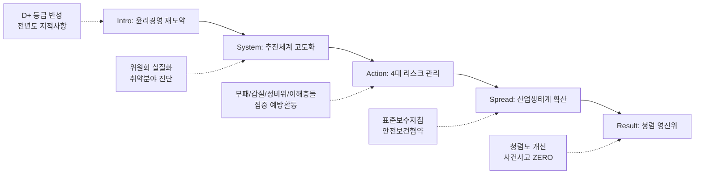

---
{"publish":true,"permalink":"/경영평가/1-4/5_지표작성방안","title":"5_지표 작성 방안","created":"2025-12-04","modified":"2025-12-13T19:35:46.194+09:00","tags":["경영평가","작성가이드","윤리경영","지표_1-4"],"cssclasses":""}
---


# [1-4 윤리 경영 노력과 활동] 세부평가내용 작성 방안

> [!abstract] 문서 개요
> 본 문서는 '1.4 윤리 경영 노력과 활동' 지표의 2025년도 경영평가보고서 작성을 위한 논리적 흐름(Storyline)과 문단별 세부 작성 방안을 제안합니다.
> 
> **핵심 목표**: [[25년 경평/2_지표별 자료/1-4_윤리_경영_노력과_활동/3_전년도_지적사항_및_개선실적\|전년도 지적사항(D+ 등급)]]을 극복하고, **'윤리경영 체계의 실질적 작동'**과 **'영화산업 특화 윤리경영'**을 부각하여 목표 등급(B등급 이상)을 달성하는 데 중점을 두었습니다.

---

## 1. Storyline 구성안 비교

### 📌 Option A: 평가요소 순차형 (Sequential)

| 구분 | 내용 |
|------|------|
| **구조** | 윤리경영체계 → 성희롱·성폭력 → 이해충돌 → 인권존중 |
| **장점** | 편람의 4개 평가요소를 빠짐없이 순서대로 다루기에 용이 |
| **단점** | 요소 간 유기적 연결 부족, 단순 나열식으로 보일 위험 |
| **적합도** | ⭐⭐ |

```
①윤리체계 → ②성희롱·성폭력 → ③이해충돌 → ④인권존중
```

### 📌 Option B: 이슈 해결 중심형 (Problem-Solving)

| 구분 | 내용 |
|------|------|
| **구조** | 취약점 진단(채용비위/이해충돌) → 시스템 개선 → 문화 확산 → 성과 창출 |
| **장점** | 전년도 지적사항(문제점 진단 미흡) 해소에 최적화 |
| **단점** | 성희롱 예방, 인권 등 예방적 차원의 활동이 부차적으로 보일 수 있음 |
| **적합도** | ⭐⭐⭐ |

```
Risk 진단 → System 개선 → Culture 확산 → Performance
```

### 📌 Option C: 전사적 내재화형 (Internalization)

| 구분 | 내용 |
|------|------|
| **구조** | 추진체계(거버넌스) → 제도 운영(실행) → 문화 확산(인식) → 산업 확산(상생) |
| **장점** | 내부 직원뿐만 아니라 영화산업계로 윤리경영을 확산하는 '영진위만의 역할' 강조 |
| **단점** | 각 단계별로 4개 평가요소를 적절히 배분해야 하는 작성 난이도 있음 |
| **적합도** | ⭐⭐⭐ |

```
Governance → Operation → Awareness → Expansion
```

---

## 2. 추천 Storyline (체계 고도화 & 산업 확산)

> [!tip] 추천 구조
> **"전년도 지적사항을 반영하여 윤리경영 체계를 고도화(System)하고, 이를 영화산업 현장으로 확산(Spread)하여 공정 생태계를 선도"**하는 구조

### 전체 흐름



### 핵심 메시지

> **"D+ 등급의 뼈아픈 반성을 토대로 윤리경영 시스템을 혁신하고, 영화산업 표준을 선도하여 신뢰받는 기관으로 도약"**

---

## 3. 문단별 작성 방안

### 세부평가내용① 윤리경영체계 구축·운영

#### 문단 1-1: 윤리경영 거버넌스의 실질화

| 항목 | 내용 |
|------|------|
| **Core Message** | 자문 기구에 그쳤던 위원회를 의결/심의 기구로 격상하여 실행력 확보 |
| **주요 근거** | 외부위원 확대, 국감 지적사항 조치 |
| **담당 부서** | 감사팀, 인사총무팀 |

| 증빙 요소 | 내용 |
|----------|------|
| 위원회 | 인사위원회 외부위원 과반(외부1·노조1·감사1·내부4) 운영 |
| 전문성 | 감사자문위원회(변호사·회계사) 운영 실적 |
| 환류체계 | 내부청렴도 조사 결과 반영 및 국감 지적사항(29건) 조치 완료 |

> [!example] 추천 스토리라인
> **"전년도 D+ 등급 반성 → 위원회 의결기구화 → 외부위원 과반 확대 → 국감 지적사항 100% 조치"**
> 
> - 도입: 전년도 윤리경영 D+ 등급, 위원회 역할 미흡 지적
> - 전개: 인사위원회 외부위원 과반 운영, 감사자문위원회(변호사·회계사) 전문성 강화
> - 성과: 국감 지적사항 29건 100% 조치 완료, 내부청렴도 조사 결과 환류

#### 문단 1-2: 반부패·청렴 활동의 내재화

| 항목 | 내용 |
|------|------|
| **Core Message** | 전 직원 대상 맞춤형 교육 및 익명 신고채널 활성화 |
| **주요 근거** | 교육 이수율 100%, 이의신청 0건 |
| **담당 부서** | 감사팀, 인사총무팀 |

| 증빙 요소 | 내용 |
|----------|------|
| 청렴교육 | 청렴교육 이수율 100%, 면접관 사전교육 등 직무별 특화 |
| 신고제도 | 내부신고 접수/처리 건수, 모의신고 훈련 실적 |
| 성과지표 | 채용비위 이의신청 ZERO 달성 |

> [!example] 추천 스토리라인
> **"청렴교육 체계 고도화 → 직무별 맞춤형 교육 → 익명 신고채널 활성화 → 채용비위 ZERO 달성"**
> 
> - 도입: 반부패·청렴 문화 내재화 필요, 전 직원 청렴의식 제고
> - 전개: 청렴교육 이수율 100%, 면접관 사전교육 등 직무별 특화, 익명 신고채널 운영
> - 성과: 채용비위 이의신청 ZERO, 내부신고 처리율 100%

---

### 세부평가내용② 성희롱·성폭력 예방 및 근절

#### 문단 2-1: 무관용 원칙의 예방 체계

| 항목 | 내용 |
|------|------|
| **Core Message** | 고충상담원 전문성 강화 및 2차 피해 방지 시스템 구축 |
| **주요 근거** | 전문교육 이수, 지침 개정 |
| **담당 부서** | 인사총무팀 |

| 증빙 요소 | 내용 |
|----------|------|
| 전문성 | 고충상담원 전문교육 이수증 보유 |
| 제도정비 | 성희롱·성폭력 예방지침 개정 (법령 개정사항 반영) |
| 산업확산 | 한국영화성평등센터 운영(상담 134건), 벡델데이 2025 개최 |

> [!example] 추천 스토리라인
> **"무관용 원칙 선언 → 고충상담원 전문성 강화 → 예방지침 개정 → 영화산업 성평등 문화 확산"**
> 
> - 도입: 성희롱·성폭력 예방 및 2차 피해 방지 체계 강화 필요
> - 전개: 고충상담원 전문교육 이수, 예방지침 개정(법령 반영), 예방교육 100% 이수
> - 성과: 한국영화성평등센터 상담 134건, 벡델데이 2025 개최, 영화산업 성평등 선도

---

### 세부평가내용③ 이해충돌 방지

#### 문단 3-1: 이해충돌 제로화 선언

| 항목 | 내용 |
|------|------|
| **Core Message** | 지원사업 심사 과정의 이해충돌 원천 차단 및 사전 예방 |
| **주요 근거** | 제척/회피 실적, 서약서 징구 |
| **담당 부서** | 감사팀, 사업부서 |

| 증빙 요소 | 내용 |
|----------|------|
| 심사공정 | 심사위원 제척/회피 신청 건수 및 승인 실적 |
| 사전예방 | 임직원 이해충돌 방지 서약서 징구율 100% |
| 채용비리 | 채용 전형별 이해관계자 확인서 징구 실적 |

> [!example] 추천 스토리라인
> **"이해충돌방지법 대응 체계 구축 → 서약서 100% 징구 → 심사위원 제척/회피 제도 운영 → 이해충돌 ZERO"**
> 
> - 도입: 지원사업 심사 공정성 확보 및 이해충돌 원천 차단 필요
> - 전개: 임직원 이해충돌 방지 서약서 100% 징구, 심사위원 제척/회피 신청 00건 승인
> - 성과: 채용 전형별 이해관계자 확인서 징구, 이해충돌 위반사례 ZERO

---

### 세부평가내용④ 인권존중 노력과 활동

#### 문단 4-1: 영화산업 특화 인권경영

| 항목 | 내용 |
|------|------|
| **Core Message** | 인권영향평가 실시 및 현장 인권 보호 표준 정립 |
| **주요 근거** | 인권경영 인증, 표준보수지침 |
| **담당 부서** | 기획전략팀, 공정환경조성팀 |

| 증빙 요소 | 내용 |
|----------|------|
| 인권경영 | 인권영향평가 결과 및 조치, 인권경영시스템 인증 6년 연속 |
| 현장인권 | 영화산업 표준보수지침 공표 (10년 만의 합의) |
| 안전협약 | 노사정 안전보건협약 체결 ('25.11.)로 현장 안전권 보장 |

> [!example] 추천 스토리라인
> **"인권경영 체계 고도화 → 인권영향평가 실시 → 영화산업 표준보수지침 공표 → 노사정 안전보건협약 체결"**
> 
> - 도입: 영화 제작 현장 근로환경 개선 및 영화인 인권 보호 필요성 증대
> - 전개: 인권영향평가 실시 및 조치, 인권경영시스템 인증 6년 연속 유지, 전 직원 인권교육 100% 이수
> - 성과: 영화산업 표준보수지침 공표(10년 만의 합의), 노사정 안전보건협약 체결('25.11.)로 현장 안전권 보장

---

## 4. 문단 구성 요약

> [!note] 총 5개 문단 구성
> 
> **세부평가내용① 윤리경영체계 구축·운영** (2개 문단)
> - 문단 1-1: 윤리경영 거버넌스의 실질화
> - 문단 1-2: 반부패·청렴 활동의 내재화
> 
> **세부평가내용② 성희롱·성폭력 예방 및 근절** (1개 문단)
> - 문단 2-1: 무관용 원칙의 예방 체계
> 
> **세부평가내용③ 이해충돌 방지** (1개 문단)
> - 문단 3-1: 이해충돌 제로화 선언
> 
> **세부평가내용④ 인권존중 노력과 활동** (1개 문단)
> - 문단 4-1: 영화산업 특화 인권경영

---

## 5. 차별화 포인트

### 가. 편람 요구사항 대응 현황

| 편람 요구사항 | 대응 문단 | 핵심 내용 |
|-------------|----------|----------|
| 윤리경영 전담조직 및 체계 구축 | 문단 1-1 | 위원회 의결기구화, 외부위원 과반 |
| 윤리경영 지침 마련·운영 | 문단 1-1 | 윤리헌장, 윤리강령, 행동강령 정비 |
| 비윤리적 행위 신고 및 조치 | 문단 1-2 | 익명 신고채널, 신고자 보호 |
| 반부패·청렴교육 | 문단 1-2 | 청렴교육 100%, 직무별 맞춤형 교육 |
| 성희롱·성폭력 예방지침 및 매뉴얼 | 문단 2-1 | 예방지침 개정, 고충상담원 전문성 |
| 상시대응 체계 구축 | 문단 2-1 | 고충심의위원회, 2차 피해 방지 |
| 영화산업 현장 성범죄 예방 | 문단 2-1 | 성평등센터 운영, 벡델데이 개최 |
| 이해충돌방지 제도 구축 | 문단 3-1 | 서약서 100% 징구, 제척/회피 제도 |
| 사전예방 조치 | 문단 3-1 | 심사위원 이해충돌 원천 차단 |
| 인권경영 추진 체계 | 문단 4-1 | 인권영향평가, 인권경영 인증 6년 연속 |
| 이해관계자 인권 보호 | 문단 4-1 | 표준보수지침, 안전보건협약 |

### 나. 전년도 D+등급(지적사항) 개선 전략

| 지적사항 | 개선 방안 | 핵심 성과 |
|---------|----------|----------|
| 위원회 역할 미흡 | **의결기구화** 및 권한 강화 | 외부위원 과반, 실질적 심의 |
| 취약점 진단 부족 | **데이터 기반** 환류체계 | 청렴도 조사, 국감 지적 100% 조치 |
| 추진과제 체계성 부족 | **4대 리스크** 집중 관리 | 부패/갑질/성비위/이해충돌 예방 |

### 다. 영화산업 표준(Standard) 정립

| 영역 | 내부 (Internal) | 외부 (Industry) |
|------|----------------|----------------|
| 윤리/인권 | 인권영향평가, 신고채널 | **표준보수지침**, 성평등센터 |
| 공정/안전 | 이해충돌 방지, 안전경영 | **표준계약서**, 안전보건협약 |

---

## 6. 작성 시 유의사항

### 가. 편람 세부평가요소 매칭

> [!warning] 필수 확인
> 4개 평가요소의 균형 있는 서술 필요

| 세부평가요소 | 배분 비중 | 주요 부서 |
|-------------|----------|----------|
| ① 윤리경영체계 | 30% | 감사팀, 기획전략 |
| ② 성희롱·성폭력 | 20% | 인사총무, 성평등센터 |
| ③ 이해충돌 방지 | 25% | 감사팀 |
| ④ 인권존중 노력 | 25% | 기획전략, 공정환경 |

### 나. 정량 데이터 활용

> [!success] 핵심 정량지표
> - 청렴교육: 이수율 **100%**
> - 성평등: 상담지원 **134건**
> - 신고처리: 이의신청 **0건**
> - 국감조치: 조치완료 **29건** (100%)

### 다. 증빙자료 연계

| 문단 | 핵심 증빙 |
|------|----------|
| 추진체계 | 윤리경영위원회 회의록, 외부위원 명부 |
| 예방활동 | 청렴교육 결과보고서, 이해충돌방지 서약서 |
| 산업확산 | 표준보수지침 합의문, 성평등센터 운영실적 |
| 성과점검 | 내부청렴도 조사보고서, 인권영향평가 결과 |

---

## 🔗 관련 자료

| 구분 | 문서명 | 비고 |
|------|--------|------|
| 편람 분석 | [[25년 경평/2_지표별 자료/1-4_윤리_경영_노력과_활동/2_편람_내용_분석]] | 세부평가 요소별 가이드 |
| 지적사항 | [[25년 경평/2_지표별 자료/1-4_윤리_경영_노력과_활동/3_전년도_지적사항_및_개선실적]] | D+등급 원인 및 개선방향 |
| 부서 매핑 | [[25년 경평/2_지표별 자료/1-4_윤리_경영_노력과_활동/6_부서별_실적_통합_매핑표]] | 부서별 실적 종합 |
| 공통 자료 | [[01_편람_및_지침]] | 작성 가이드 |

---

*작성일: 2025-12-04*
*검증상태: 전년도 지적사항 반영 확인*