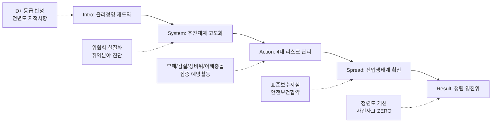

---
{"publish":true,"permalink":"/경영평가/1-4/5_지표작성방안","title":"5_지표 작성 방안","created":"2025-12-14","modified":"2025-12-14T11:40:57.367+09:00","tags":["#경영평가","#작성가이드","#윤리경영","#지표_1-4"],"cssclasses":""}
---


# [1-4 윤리 경영 노력과 활동] 세부평가내용 작성 방안

> [!abstract] 문서 개요
> 본 문서는 '1.4 윤리 경영 노력과 활동' 지표의 2025년도 경영평가보고서 작성을 위한 논리적 흐름(Storyline)과 문단별 세부 작성 방안을 제안합니다.
> 
> **핵심 목표**: [[25년 경평/2_지표별 자료/1-4_윤리_경영_노력과_활동/3_전년도_지적사항_및_개선실적\|전년도 지적사항(D+ 등급)]]을 극복하고, **'윤리경영 체계의 실질적 작동'**과 **'영화산업 특화 윤리경영'**을 부각하여 목표 등급(B등급 이상)을 달성하는 데 중점을 두었습니다.

---

## 1. Storyline 구성안 비교

### 📌 Option A: 평가요소 순차형 (Sequential)

| 구분 | 내용 |
|------|------|
| **구조** | 윤리경영체계 → 성희롱·성폭력 → 이해충돌 → 인권존중 |
| **장점** | 편람의 4개 평가요소를 빠짐없이 순서대로 다루기에 용이 |
| **단점** | 요소 간 유기적 연결 부족, 단순 나열식으로 보일 위험 |
| **적합도** | ⭐⭐ |

```
①윤리체계 → ②성희롱·성폭력 → ③이해충돌 → ④인권존중
```

### 📌 Option B: 이슈 해결 중심형 (Problem-Solving)

| 구분 | 내용 |
|------|------|
| **구조** | 취약점 진단(채용비위/이해충돌) → 시스템 개선 → 문화 확산 → 성과 창출 |
| **장점** | 전년도 지적사항(문제점 진단 미흡) 해소에 최적화 |
| **단점** | 성희롱 예방, 인권 등 예방적 차원의 활동이 부차적으로 보일 수 있음 |
| **적합도** | ⭐⭐⭐ |

```
Risk 진단 → System 개선 → Culture 확산 → Performance
```

### 📌 Option C: 전사적 내재화형 (Internalization)

| 구분 | 내용 |
|------|------|
| **구조** | 추진체계(거버넌스) → 제도 운영(실행) → 문화 확산(인식) → 산업 확산(상생) |
| **장점** | 내부 직원뿐만 아니라 영화산업계로 윤리경영을 확산하는 '영진위만의 역할' 강조 |
| **단점** | 각 단계별로 4개 평가요소를 적절히 배분해야 하는 작성 난이도 있음 |
| **적합도** | ⭐⭐⭐ |

```
Governance → Operation → Awareness → Expansion
```

---

## 2. 추천 Storyline (체계 고도화 & 산업 확산)

> [!tip] 추천 구조
> **"전년도 지적사항을 반영하여 윤리경영 체계를 고도화(System)하고, 이를 영화산업 현장으로 확산(Spread)하여 공정 생태계를 선도"**하는 구조

### 전체 흐름



### 핵심 메시지

> **"D+ 등급의 뼈아픈 반성을 토대로 윤리경영 시스템을 혁신하고, 영화산업 표준을 선도하여 신뢰받는 기관으로 도약"**

---

## 3. 문단별 작성 방안

### 세부평가내용① 윤리경영체계 구축·운영

#### 문단 1-1: 윤리경영 거버넌스의 실질화

| 항목 | 내용 |
|------|------|
| **Core Message** | 자문 기구에 그쳤던 위원회를 의결/심의 기구로 격상하여 실행력 확보 |
| **주요 근거** | 외부위원 확대, 국감 지적사항 조치, 위기관리 체계 구축 |
| **담당 부서** | 감사팀, 인사총무팀, 홍보협력팀 |

| 구분 | 실적 | 성과 |
|------|------|------|
| 인사위원회 | 외부위원 **과반** (외부1·노조1·감사1·내부4) | 의결기구 실질화 |
| 감사자문위원회 | 변호사·회계사 **전문가** 구성 | 전문성 강화 |
| 국감 지적사항 | **29건** 조치 완료 | 100% 이행 |
| 위기관리 매뉴얼 | **3단계** 프로세스 신규 수립 | 선제적 리스크 관리 |
| 9인위원회 거버넌스 | 운영 체계화, 소위원회 재편 | 투명성·책임성 강화 |

> [!example] 추천 스토리라인
> **"전년도 D+ 등급 반성 → 위원회 의결기구화 → 외부위원 과반 확대 → 국감 지적사항 100% 조치"**
> 
> - 도입: 전년도 윤리경영 D+ 등급, 위원회 역할 미흡 지적
> - 전개: 인사위원회 외부위원 과반 운영, 감사자문위원회 전문성 강화, 위기관리 매뉴얼 수립
> - 성과: 국감 지적사항 29건 100% 조치 완료, 9인위원회 거버넌스 체계화

#### 문단 1-2: 반부패·청렴 활동의 내재화

| 항목 | 내용 |
|------|------|
| **Core Message** | 전 직원 대상 맞춤형 교육 및 투명한 계약·재무 관리 체계 구축 |
| **주요 근거** | 교육 이수율 100%, 조달계약 확대, 클린카드 모니터링 |
| **담당 부서** | 감사팀, 인사총무팀, 재무회계팀 |

| 구분 | 실적 | 성과 |
|------|------|------|
| 청렴교육 | **98명** 참여 | 이수율 100% |
| 국가계약 설명회 | **전직원** 대상 (2025.9.29.) | 계약 전문성 제고 |
| 계약 안내 자료집 | **24페이지** 제작·배포 | 최초 제작 |
| 조달계약 비율 | **53.1%** (전년 26.4%) | +26.7%p 확대 |
| 수의계약 제한 | 동일업체 연 **3회** 제한 검토 | 청렴도 제고 |
| 클린카드 모니터링 | **매월** 실시 | 위반 시 소명서 요구 |
| 채용비리 | **ZERO** | 이의신청 0건 |

> [!example] 추천 스토리라인
> **"청렴교육 체계 고도화 → 계약 투명성 강화 → 조달계약 53.1% 확대 → 채용비위 ZERO 달성"**
> 
> - 도입: 반부패·청렴 문화 내재화 필요, 계약 투명성 강화 요구
> - 전개: 청렴교육 98명, 국가계약 설명회 전직원 대상, 조달계약 비율 53.1%로 확대
> - 성과: 채용비위 이의신청 ZERO, 클린카드 위반 소명서 관리 체계화

---

### 세부평가내용② 성희롱·성폭력 예방 및 근절

#### 문단 2-1: 무관용 원칙의 예방 체계

| 항목 | 내용 |
|------|------|
| **Core Message** | 고충상담원 전문성 강화 및 영화산업 현장까지 확산하는 예방 체계 |
| **주요 근거** | 전문교육 이수, 지침 개정, 성평등센터 운영, 인터미시 코디네이터 |
| **담당 부서** | 인사총무팀, 공정환경조성팀, 정규교육팀 |

| 구분 | 실적 | 성과 |
|------|------|------|
| 4대 폭력 예방교육 | **107명** 참여 | 법정의무교육 100% |
| 고충접수건 | **0건** (5개년 지속 감소) | 예방 효과 |
| 성평등센터 상담 | **134건** 지원 | 법률상담 25건 포함 |
| 성평등센터 교육 | **2,977명** 수강 (63회) | 만족도 4.75점 |
| 벡델데이 2025 | **373명** 참여 | 추천의향 100% |
| KAFA 예방교육 | **159명** (교육생+스태프) | 제작현장 확산 |
| 인터미시 코디네이터 | **국내 최초** 현장 적용 | BP 사례 |
| 고충처리 전문교육 | **11명** 이수 (KAFA) | 담당자 역량 강화 |

> [!example] 추천 스토리라인
> **"무관용 원칙 선언 → 고충상담원 전문성 강화 → 성평등센터 2,977명 교육 → 인터미시 코디네이터 국내 최초 적용"**
> 
> - 도입: 성희롱·성폭력 예방 및 2차 피해 방지 체계 강화 필요
> - 전개: 4대 폭력 예방교육 107명, 성평등센터 교육 2,977명, KAFA 인터미시 코디네이터 도입
> - 성과: 고충접수건 0건, 벡델데이 추천의향 100%, 영화산업 성평등 문화 선도

---

### 세부평가내용③ 이해충돌 방지

#### 문단 3-1: 이해충돌 제로화 선언

| 항목 | 내용 |
|------|------|
| **Core Message** | 지원사업 심사 과정의 이해충돌 원천 차단 및 공급망 청렴관리 |
| **주요 근거** | 제척/회피 실적, 서약서 징구, 협력업체 인권경영 점검 |
| **담당 부서** | 감사팀, 재무회계팀, 사업부서 |

| 구분 | 실적 | 성과 |
|------|------|------|
| 이해충돌 방지 서약서 | **100%** 징구 | 전 임직원 |
| 심사위원 제척/회피 | 제도 운영 | 이해충돌 원천 차단 |
| 채용 이해관계자 확인서 | 전형별 **징구** | 채용 공정성 확보 |
| 협력업체 인권경영 점검 | **8개 업체** (최초) | 회수율 100% |
| 입찰공고문 구제방안 | **전체 공고문** 적용 | 인권침해 구제절차 안내 |
| 퇴직자 재직 확인 | 수의계약 시 **확인서 제출** 의무화 | 공정한 계약 체결 |

> [!example] 추천 스토리라인
> **"이해충돌방지법 대응 체계 구축 → 서약서 100% 징구 → 협력업체 인권경영 최초 점검 → 이해충돌 ZERO"**
> 
> - 도입: 지원사업 심사 공정성 확보 및 이해충돌 원천 차단 필요
> - 전개: 임직원 이해충돌 방지 서약서 100% 징구, 협력업체 인권경영 이행점검 8개 업체 최초 실시
> - 성과: 이해충돌 위반사례 ZERO, 입찰공고문 구제방안 전체 적용

---

### 세부평가내용④ 인권존중 노력과 활동

#### 문단 4-1: 영화산업 특화 인권경영

| 항목 | 내용 |
|------|------|
| **Core Message** | 인권경영 인증 6년 연속 유지 및 영화산업 현장 인권 보호 표준 정립 |
| **주요 근거** | 인권경영 인증, 표준보수지침, 안전보건협약, 분쟁 중재 |
| **담당 부서** | 기획전략팀, 공정환경조성팀, 인사총무팀 |

| 구분 | 실적 | 성과 |
|------|------|------|
| 인권경영시스템 인증 | **6년 연속** | 문체부 산하 유일 |
| 장애인인식개선교육 | **127명** 참여 | 법정의무교육 |
| 장애인 편의제공 | 신청제도 **신설** | 채용 접근성 강화 |
| 표준보수지침 | 문체부 **공표** (2025.10.1.) | 10년 만 노사정 합의 |
| 안전보건협약 | 노사정 **체결** (2025.11.20.) | 산업단위 최초 |
| 영화인신문고 | **110건** 접수, 72건 종결 | 종결비율 65% |
| 저작권 중재위원회 | **신설**, 11회 운영 | 3심제 도입 |
| 성명표시권 가이드라인 | 연구 완료, 12월 발간 | 중재 기준 공식화 |
| 예술인권리보장법 교육 | 내부 교육 시행 | 블랙리스트 재발 방지 |

> [!example] 추천 스토리라인
> **"인권경영 체계 고도화 → 인권경영 6년 연속 인증 → 표준보수지침 10년 만 합의 → 노사정 안전보건협약 체결"**
> 
> - 도입: 영화 제작 현장 근로환경 개선 및 영화인 인권 보호 필요성 증대
> - 전개: 인권경영시스템 6년 연속 인증, 장애인 편의제공 신청제도 신설, 저작권 중재위원회 신설
> - 성과: 표준보수지침 공표(10년 만의 합의), 노사정 안전보건협약 체결, 영화인신문고 110건 처리


---

## 4. 문단 구성 요약

| 문단 | 핵심 주제 | 담당 부서 | 핵심 성과 |
|------|----------|----------|----------|
| **1-1** | 윤리경영 거버넌스 실질화 | 감사팀, 인사총무팀, 홍보협력팀 | 국감 29건 100% 조치, 위기관리 매뉴얼 |
| **1-2** | 반부패·청렴 활동 내재화 | 감사팀, 인사총무팀, 재무회계팀 | 조달계약 53.1%, 채용비위 ZERO |
| **2-1** | 무관용 원칙의 예방 체계 | 인사총무팀, 공정환경조성팀, 정규교육팀 | 성평등센터 2,977명, 인터미시 코디네이터 |
| **3-1** | 이해충돌 제로화 선언 | 감사팀, 재무회계팀 | 서약서 100%, 협력업체 점검 8개 |
| **4-1** | 영화산업 특화 인권경영 | 기획전략팀, 공정환경조성팀 | 인권경영 6년 인증, 표준보수지침 합의 |

---

## 5. 차별화 포인트

### 📌 편람 대응 전략

| 평가요소 | 편람 요구사항 | 대응 전략 |
|---------|-------------|----------|
| ① 윤리경영체계 | 전담조직, 지침, 청렴교육 | 외부위원 과반 + 청렴교육 98명 + 조달계약 53.1% |
| ② 성희롱·성폭력 | 예방교육, 고충처리 | 4대 폭력 107명 + 성평등센터 2,977명 + 인터미시 코디네이터 |
| ③ 이해충돌 방지 | 서약서, 제척/회피 | 서약서 100% + 협력업체 점검 8개 + 퇴직자 확인서 |
| ④ 인권존중 | 인권경영, 구제절차 | 6년 연속 인증 + 표준보수지침 + 영화인신문고 110건 |

### 📌 전년도 D+등급 개선 전략

| 지적사항 | 개선 내용 |
|---------|----------|
| 위원회 역할 미흡 | 인사위원회 외부위원 과반, 감사자문위원회 전문가 구성 |
| 취약점 진단 부족 | 국감 지적사항 29건 100% 조치, 위기관리 매뉴얼 수립 |
| 추진과제 체계성 부족 | 4대 리스크(부패/갑질/성비위/이해충돌) 집중 관리 |
| 산업 확산 미흡 | 성평등센터 2,977명, 표준보수지침 합의, 인터미시 코디네이터 |

### 📌 영화산업 표준(Standard) 정립

```
[내부 윤리경영]                    [산업 확산]
인권경영 6년 인증 ─────────────→ 표준보수지침 10년 만 합의
청렴교육 98명 ────────────────→ 성평등센터 2,977명 교육
고충접수 0건 ─────────────────→ 영화인신문고 110건 처리
                    ↓
            [영화산업 공정 생태계]
            노사정 안전보건협약 체결
            인터미시 코디네이터 국내 최초
            저작권 중재위원회 3심제 도입
```

---

## 6. 핵심 정량 데이터 Quick Reference

### 📊 윤리경영체계 (인사총무팀, 재무회계팀, 홍보협력팀)

| 지표 | 수치 | 비고 |
|------|------|------|
| 청렴교육 | **98명** | 이수율 100% |
| 국감 지적사항 | **29건** 조치 | 100% 완료 |
| 조달계약 비율 | **53.1%** | 전년 26.4% → +26.7%p |
| 계약 안내 자료집 | **24페이지** | 최초 제작 |
| 위기관리 매뉴얼 | **3단계** | 신규 수립 |
| 채용비위 | **ZERO** | 이의신청 0건 |

### 📊 성희롱·성폭력 예방 (인사총무팀, 공정환경조성팀, 정규교육팀)

| 지표 | 수치 | 비고 |
|------|------|------|
| 4대 폭력 예방교육 | **107명** | 법정의무교육 |
| 고충접수건 | **0건** | 5개년 지속 감소 |
| 성평등센터 교육 | **2,977명** | 63회, 만족도 4.75점 |
| 성평등센터 상담 | **134건** | 법률지원 25건 포함 |
| 벡델데이 2025 | **373명** | 추천의향 100% |
| KAFA 예방교육 | **159명** | 교육생+스태프 |
| 인터미시 코디네이터 | **국내 최초** | BP 사례 |
| 고충처리 전문교육 | **11명** | KAFA 담당자 |

### 📊 이해충돌 방지 (감사팀, 재무회계팀)

| 지표 | 수치 | 비고 |
|------|------|------|
| 이해충돌 방지 서약서 | **100%** | 전 임직원 |
| 협력업체 인권경영 점검 | **8개 업체** | 최초 실시, 회수율 100% |
| 수의계약 제한 | 연 **3회** | 동일업체 제한 검토 |
| 클린카드 모니터링 | **매월** | 위반 시 소명서 |
| 공인인증서 관리 | **13팀 26명** | 체계적 관리 |

### 📊 인권존중 (인사총무팀, 공정환경조성팀)

| 지표 | 수치 | 비고 |
|------|------|------|
| 인권경영시스템 인증 | **6년 연속** | 문체부 산하 유일 |
| 장애인인식개선교육 | **127명** | 법정의무교육 |
| 표준보수지침 | **공표** | 10년 만 노사정 합의 |
| 안전보건협약 | **체결** | 2025.11.20. |
| 영화인신문고 | **110건** 접수 | 종결 72건 (65%) |
| 저작권 중재위원회 | **11회** 운영 | 3심제 도입 |
| 성명표시권 가이드라인 | **연구 완료** | 12월 발간 |

### 📊 안전교육 (정규교육팀 - KAFA)

| 지표 | 수치 | 비고 |
|------|------|------|
| 안전교육 | **329명** | 촬영현장 안전사고 예방 |
| 인권교육 | **159명** | 인권감수성 향상 |
| 촬영현장 점검 | **22개팀** | 방문 점검 |

---

## 7. 작성 시 유의사항

### ✅ 강조할 점

1. **D+ 등급 극복 노력**: 국감 지적사항 29건 100% 조치, 위원회 의결기구화
2. **계약 투명성 혁신**: 조달계약 비율 26.4%→53.1% (+26.7%p), 수의계약 제한 강화
3. **영화산업 확산**: 성평등센터 2,977명 교육, 인터미시 코디네이터 국내 최초
4. **역사적 성과**: 표준보수지침 10년 만 합의, 노사정 안전보건협약 체결
5. **인권경영 선도**: 6년 연속 인증(문체부 유일), 협력업체 인권경영 점검 최초

### ⚠️ 주의할 점

1. 전년도 D+ 등급 원인 분석 및 개선 노력 명확히 서술
2. 내부 윤리경영과 산업 확산의 연계성 강조
3. 정량 데이터와 정성적 성과의 균형 있는 서술

### 📝 편람 키워드 체크리스트

- [x] 윤리경영 전담조직 및 체계 구축
- [x] 윤리경영 지침 마련·운영
- [x] 비윤리적 행위 신고 및 조치
- [x] 반부패·청렴교육
- [x] 성희롱·성폭력 예방지침 및 매뉴얼
- [x] 상시대응 체계 구축
- [x] 영화산업 현장 성범죄 예방
- [x] 이해충돌방지 제도 구축
- [x] 사전예방 조치
- [x] 인권경영 추진 체계
- [x] 이해관계자 인권 보호

---

## 관련 자료

| 구분 | 문서명 | 링크 |
|------|--------|------|
| 편람 분석 | 편람 내용 분석 | [바로가기](/경영평가/1-4/2_편람내용분석) |
| 지적사항 | 전년도 지적사항 및 개선실적 | [바로가기](/경영평가/1-4/3_전년도지적사항) |
| 부서 실적 | 인사총무팀 실적 분석 | [바로가기](/부서성과평가/1-2-2/인사총무팀) |
| 부서 실적 | 공정환경조성팀 실적 분석 | [바로가기](/부서성과평가/1-2-2/공정환경조성팀) |
| 부서 실적 | 재무회계팀 실적 분석 | [바로가기](/부서성과평가/1-2-2/재무회계팀) |
| 부서 실적 | 정규교육팀 실적 분석 | [바로가기](/부서성과평가/1-2-2/정규교육팀) |
| 부서 실적 | 홍보협력팀 실적 분석 | [바로가기](/부서성과평가/1-2-2/홍보협력팀) |

---

*작성일: 2025-12-14*
*검증상태: 부서실적 대조 완료*
