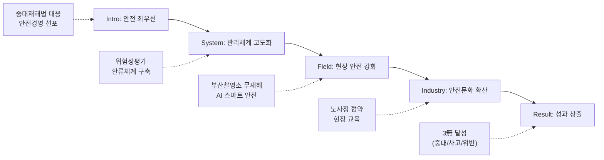

---
{"publish":true,"permalink":"/경영평가/1-5/5_지표작성방안","title":"5_지표 작성 방안","created":"2025-12-09","modified":"2025-12-12T14:34:36.951+09:00","tags":["#경영평가","#작성가이드","#안전관리","#재난관리","#정보보안","#지표_1-5"],"cssclasses":""}
---


# [1-5 안전 및 재난관리] 세부평가내용 작성 방안

> [!abstract] 문서 개요
> 본 문서는 '1.5 안전 및 재난관리' 지표의 2025년도 경영평가보고서 작성을 위한 논리적 흐름(Storyline)과 문단별 세부 작성 방안을 제안합니다.
> 
> **핵심 목표**: [[25년 경평/2_지표별 자료/1-5_안전_및_재난관리/3_전년도_지적사항_및_개선실적\|전년도 지적사항(C 등급)]]을 극복하고, **'체계적 안전관리 시스템'** 구축과 **'영화산업 현장 안전 확산'**을 부각하여 목표 등급(B등급 이상)을 달성하는 데 중점을 두었습니다.

---

## 1. Storyline 구성안 비교

### 📌 Option A: 평가요소 순차형 (Sequential)

| 구분 | 내용 |
|------|------|
| **구조** | 산업재해 예방 → 재난관리시스템 → 정보보안 |
| **장점** | 편람의 3개 평가요소를 빠짐없이 순서대로 다루기에 용이 |
| **단점** | 요소 간 연계성이 약해 단순 나열로 보일 수 있음 |
| **적합도** | ⭐⭐ |

```
①산업재해 예방 → ②재난관리시스템 → ③정보보안
```

### 📌 Option B: 리스크 관리형 (Risk Management)

| 구분 | 내용 |
|------|------|
| **구조** | 리스크 진단 → 예방체계 구축 → 대응·복구 → 환류 |
| **장점** | PDCA 사이클에 충실하며 체계적 관리 역량 부각 |
| **단점** | 정보보안 영역이 다소 부자연스럽게 연결될 수 있음 |
| **적합도** | ⭐⭐⭐ |

```
진단(Risk) → 예방(Prevent) → 대응(Response) → 환류(Feedback)
```

### 📌 Option C: 내부-외부 확장형 (Expansion)

| 구분 | 내용 |
|------|------|
| **구조** | 내부 안전(임직원) → 발주현장(촬영소) → 영화산업 현장 → 정보보안 |
| **장점** | 영진위의 안전관리 범위가 영화산업 전체로 확장되는 차별화 포인트 부각 |
| **단점** | 각 영역별 분량 조절이 필요 |
| **적합도** | ⭐⭐⭐ |

```
Internal(본사) → Site(촬영소) → Industry(영화계) → Digital(보안)
```

---

## 2. 추천 Storyline: (체계적 안전관리 & 영화산업 확산)

> [!tip] 추천 구조
> **"전년도 지적사항을 반영한 체계적 안전관리 시스템을 구축(System)하고, 이를 영화산업 현장까지 확산(Industry)하여 안전 생태계를 선도"**하는 구조

### 전체 흐름



### 핵심 메시지

> **"빈틈없는 안전관리 시스템으로 3無(중대재해·안전사고·법령위반 ZERO)를 달성하고, 영화산업 전반으로 안전문화를 확산"**

---

## 3. 문단별 작성 방안

### 세부평가내용① 산업재해 예방 및 안전관리

#### 문단 1-1: 체계적 안전관리 시스템 구축 (지적사항 해소)

| 항목 | 내용 |
|------|------|
| **Core Message** | 분기별 안전점검의 날 운영으로 체계적 점검-개선-재점검 사이클 확립 |
| **주요 근거** | 위험성평가 개선율, 3無 달성 |
| **담당 부서** | 안전관리팀 |

| 증빙 요소 | 내용 |
|----------|------|
| 점검체계 | 해빙기·장마철·폭염·동절기 테마별 점검 및 범위 확대 |
| 위험개선 | 위험도(높음) 7건→1건(86%↓), 위험도(낮음) 비중 18%→71% |
| 성과지표 | 중대재해 0건, 안전사고 0건, 법령위반 0건 (3無 달성) |

#### 문단 1-2: 발주현장 및 건설과정 안전확보

| 항목 | 내용 |
|------|------|
| **Core Message** | 부산기장촬영소 대규모 건설현장 무재해 달성 및 스마트 안전 도입 |
| **주요 근거** | 외부점검 결과, 스마트장비 도입 |
| **담당 부서** | 부산기장촬영소건립팀, 안전관리팀 |

| 증빙 요소 | 내용 |
|----------|------|
| 무재해 | 외부기관 안전점검 5회 대응, 중대 지적사항 ZERO |
| 스마트안전 | AI 이동형 CCTV, 5Gas 장비 네트워크 연동 |
| 근로보호 | 냉방휴게시설 3개동, 임시소방시설 예산 238% 확대 |

---

### 세부평가내용② 재난관리시스템 구축·운영

#### 문단 2-1: 재난 예방·대비·대응 체계

| 항목 | 내용 |
|------|------|
| **Core Message** | 계절별 재난대책 수립 및 훈련 정례화로 비상대응능력 확보 |
| **주요 근거** | 재난대책 4건, 훈련 실적 |
| **담당 부서** | 안전관리팀 |

| 증빙 요소 | 내용 |
|----------|------|
| 재난대비 | 해빙기·낙뢰·여름철 자연재난 대책 4건, TF 10명 운영 |
| 훈련실적 | 민방위(상·하), 합동소방훈련(8/13), 초기대응 교육 |
| 안전성과 | 풍수해·낙뢰 피해 0건, 제3종시설물 중대결함 없음 |

---

### 세부평가내용③ 개인정보 보호 및 정보보안

#### 문단 3-1: 정보보안 관리체계 고도화

| 항목 | 내용 |
|------|------|
| **Core Message** | 노후 인프라 정비 및 개인정보 유출 예방 조치 강화 |
| **주요 근거** | 인프라 교체, 점검 실적 |
| **담당 부서** | 정보서비스팀 |

| 증빙 요소 | 내용 |
|----------|------|
| 인프라 | DB서버 Linux 전환, 그룹웨어 서버 교체, Win11 업그레이드 |
| 개인정보 | 홈페이지 비공개 설정 강화, 패밀리사이트 안전성 점검 |
| 보안준수 | 과업심의·사전협의·보안성검토 미시행 0건, 사업자 인증관리 |

---

### 세부평가내용④ 영화산업 안전 확산 (특화 성과)

#### 문단 4-1: 영화 현장 안전문화 선도

| 항목 | 내용 |
|------|------|
| **Core Message** | 노사정 안전보건협약 체결로 영화산업 안전체계 구축 |
| **주요 근거** | 협약 체결, 교육 실적 |
| **담당 부서** | 공정환경조성팀, KAFA |

| 증빙 요소 | 내용 |
|----------|------|
| 안전협약 | 산업단위 최초 노사정 공동협약 체결 ('25.11.20.) |
| 현장교육 | KAFA 제작현장 안전교육 329명, 촬영현장 22개팀 점검 |
| 제도도입 | 인터미시 코디네이터 국내 최초 현장 적용 |

---

## 4. 차별화 포인트

### 가. 전년도 C등급(지적사항) 개선 전략

| 지적사항 | 개선 방안 | 핵심 성과 |
|---------|----------|----------|
| 추진방향 근거 미흡 | **테마형 점검체계** | 분기별/계절별 점검 정례화 |
| 성과 연계성 미흡 | **성과지표 관리** | 3無(중대/사고/법령) 달성 |
| 환류체계 부재 | **PDCA 사이클** | 위험성평가 개선율 86% |

### 나. 현장 중심 스마트 안전관리

| 영역 | 기존 방식 | 혁신 방식 (차별화) |
|------|----------|-------------------|
| 점검방식 | 육안 점검 | **AI CCTV, 스마트 센서** 활용 |
| 관리범위 | 내부 직원 | **대규모 건설현장(기장)**까지 확장 |
| 산업확산 | 단순 권고 | **노사정 협약**을 통한 제도화 |

---

## 5. 작성 시 유의사항

### 가. 편람 세부평가요소 매칭

> [!warning] 필수 확인
> 3개 평가요소의 균형 있는 서술 및 0점 부여 요건(법령위반) 확인

| 세부평가요소 | 배분 비중 | 주요 부서 |
|-------------|----------|----------|
| ① 산업재해 예방 | 40% | 안전관리팀 |
| ② 재난관리시스템 | 30% | 안전관리팀 |
| ③ 정보보안 | 30% | 정보서비스팀 |

### 나. 정량 데이터 활용

> [!success] 핵심 정량지표
> - 안전사고: **0건** (3無 달성)
> - 위험개선: 고위험 **86% 감소**
> - 예산확대: 소방시설 **238% 증액**
> - 교육훈련: **329명** 이수

### 다. 증빙자료 연계

| 문단 | 핵심 증빙 |
|------|----------|
| 안전체계 | 안전기본계획, 위험성평가 결과보고서 |
| 건설안전 | 외부기관 점검결과서, 스마트장비 도입 내역 |
| 재난관리 | 재난대응 매뉴얼, 훈련 결과보고서 |
| 정보보안 | 정보보안 수준진단 결과, 개인정보 점검표 |

---

## 🔗 관련 자료

| 구분 | 문서명 | 비고 |
|------|--------|------|
| 편람 분석 | [[25년 경평/2_지표별 자료/1-5_안전_및_재난관리/2_편람_내용_분석]] | 세부평가 요소별 가이드 |
| 지적사항 | [[25년 경평/2_지표별 자료/1-5_안전_및_재난관리/3_전년도_지적사항_및_개선실적]] | C등급 원인 및 개선방향 |
| 부서 매핑 | [[25년 경평/2_지표별 자료/1-5_안전_및_재난관리/6_부서별_실적_통합_매핑표]] | 부서별 실적 종합 |
| 공통 자료 | [[01_편람_및_지침]] | 작성 가이드 |

---

*작성일: 2025-12-09*
*검증상태: 전년도 지적사항 반영 확인*