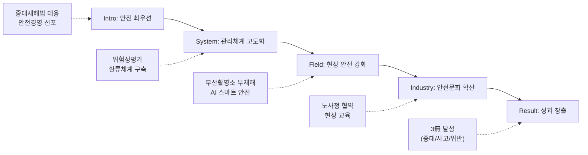

---
{"publish":true,"permalink":"/경영평가/1-5/5_지표작성방안","title":"5_지표 작성 방안","created":"2025-12-14","modified":"2025-12-14T11:45:33.884+09:00","tags":["#경영평가","#작성가이드","#안전관리","#재난관리","#정보보안","#지표_1-5"],"cssclasses":""}
---


# [1-5 안전 및 재난관리] 세부평가내용 작성 방안

> [!abstract] 문서 개요
> 본 문서는 '1.5 안전 및 재난관리' 지표의 2025년도 경영평가보고서 작성을 위한 논리적 흐름(Storyline)과 문단별 세부 작성 방안을 제안합니다.
> 
> **핵심 목표**: [[25년 경평/2_지표별 자료/1-5_안전_및_재난관리/3_전년도_지적사항_및_개선실적\|전년도 지적사항(C 등급)]]을 극복하고, **'체계적 안전관리 시스템'** 구축과 **'영화산업 현장 안전 확산'**을 부각하여 목표 등급(B등급 이상)을 달성하는 데 중점을 두었습니다.

---

## 1. Storyline 구성안 비교

### 📌 Option A: 평가요소 순차형 (Sequential)

| 구분 | 내용 |
|------|------|
| **구조** | 산업재해 예방 → 재난관리시스템 → 정보보안 |
| **장점** | 편람의 3개 평가요소를 빠짐없이 순서대로 다루기에 용이 |
| **단점** | 요소 간 연계성이 약해 단순 나열로 보일 수 있음 |
| **적합도** | ⭐⭐ |

```
①산업재해 예방 → ②재난관리시스템 → ③정보보안
```

### 📌 Option B: 리스크 관리형 (Risk Management)

| 구분 | 내용 |
|------|------|
| **구조** | 리스크 진단 → 예방체계 구축 → 대응·복구 → 환류 |
| **장점** | PDCA 사이클에 충실하며 체계적 관리 역량 부각 |
| **단점** | 정보보안 영역이 다소 부자연스럽게 연결될 수 있음 |
| **적합도** | ⭐⭐⭐ |

```
진단(Risk) → 예방(Prevent) → 대응(Response) → 환류(Feedback)
```

### 📌 Option C: 내부-외부 확장형 (Expansion)

| 구분 | 내용 |
|------|------|
| **구조** | 내부 안전(임직원) → 발주현장(촬영소) → 영화산업 현장 → 정보보안 |
| **장점** | 영진위의 안전관리 범위가 영화산업 전체로 확장되는 차별화 포인트 부각 |
| **단점** | 각 영역별 분량 조절이 필요 |
| **적합도** | ⭐⭐⭐ |

```
Internal(본사) → Site(촬영소) → Industry(영화계) → Digital(보안)
```

---

## 2. 추천 Storyline (체계적 안전관리 & 영화산업 확산)

> [!tip] 추천 구조
> **"전년도 지적사항을 반영한 체계적 안전관리 시스템을 구축(System)하고, 이를 영화산업 현장까지 확산(Industry)하여 안전 생태계를 선도"**하는 구조

### 전체 흐름



### 핵심 메시지

> **"빈틈없는 안전관리 시스템으로 3無(중대재해·안전사고·법령위반 ZERO)를 달성하고, 영화산업 전반으로 안전문화를 확산"**

---

## 3. 문단별 작성 방안

### 세부평가내용① 산업재해 예방 및 안전관리

#### 문단 1-1: 체계적 안전관리 시스템 구축

| 항목 | 내용 |
|------|------|
| **Core Message** | 분기별 안전점검의 날 운영으로 체계적 점검-개선-재점검 사이클 확립 |
| **주요 근거** | 위험성평가 개선율, 3無 달성, 자율안전점검 컨설팅 |
| **담당 부서** | 인사총무팀 |

| 구분 | 실적 | 성과 |
|------|------|------|
| 중대재해 | **0건** | 3無 달성 |
| 안전사고 | **0건** | 임직원·외부인 포함 |
| 법령위반 | **0건** | 산업안전보건법 준수 |
| 위험성평가 | **17건** 평가 | 위험도(높음) 7→1건 (86%↓) |
| 위험도(낮음) 비중 | **18%→71%** | +53%p 개선 |
| 자율안전점검 컨설팅 | **24개 항목** 적정 | 대한산업안전협회 |
| 산업안전보건교육 | **123명** 수료 | 법정의무교육 |

> [!example] 추천 스토리라인
> **"전년도 지적사항(추진방향 근거 미흡) 개선 → 테마별 점검체계 구축 → 위험성평가 개선율 86% → 3無 달성"**
> 
> - 도입: 중대재해처벌법 시행에 따른 체계적 안전관리 필요성 증대
> - 전개: 분기별 안전점검의 날 운영, 해빙기·장마철·폭염·동절기 테마별 점검, 위험도(높음) 7건→1건 개선
> - 성과: 중대재해 0건, 안전사고 0건, 법령위반 0건 (3無 달성), 자율안전점검 24개 항목 적정

#### 문단 1-2: 발주현장 및 건설과정 안전확보

| 항목 | 내용 |
|------|------|
| **Core Message** | 부산기장촬영소 대규모 건설현장 무재해 달성 및 스마트 안전 도입 |
| **주요 근거** | 외부점검 결과, 스마트장비 도입, 소방시설 확대 |
| **담당 부서** | 영화기술인프라팀, 인사총무팀 |

| 구분 | 실적 | 성과 |
|------|------|------|
| 외부기관 안전점검 | **5회** 대응 | 문체부·조달청·부산시·기장군·합동점검 |
| 중대 지적사항 | **ZERO** | 무재해 달성 |
| 책임감리 | **4인** 상주 | 건축·설비·토목·전기 |
| AI 이동형 CCTV | **도입** | VLM 기반 안전고리 미체결 감지 |
| 5Gas 장비 | **업그레이드** | CO₂ 검출 추가, 네트워크 연동 |
| 임시소방시설 예산 | **238%↑** | 16→54백만원 |
| 피난유도선 | **9→312개** | 3,367%↑ |
| 냉방휴게시설 | **3개동** 설치 | 온열질환 ZERO |
| 공정률 | **110%** 달성 | 147일 지연공기 극복 |

> [!example] 추천 스토리라인
> **"대규모 건설현장 안전관리 강화 → AI 스마트 안전장비 도입 → 외부점검 5회 대응 → 무재해 달성"**
> 
> - 도입: 부산기장촬영소 대규모 건설현장(163억 규모) 안전관리 필요
> - 전개: AI 이동형 CCTV·5Gas 장비 네트워크 연동, 임시소방시설 예산 238% 확대, 냉방휴게시설 3개동
> - 성과: 외부기관 안전점검 5회 대응, 중대 지적사항 ZERO, 온열질환 ZERO, 공정률 110% 달성

---

### 세부평가내용② 재난관리시스템 구축·운영

#### 문단 2-1: 재난 예방·대비·대응 체계

| 항목 | 내용 |
|------|------|
| **Core Message** | 계절별 재난대책 수립 및 훈련 정례화로 비상대응능력 확보 |
| **주요 근거** | 재난대책 4건, 훈련 실적, TF 운영 |
| **담당 부서** | 인사총무팀 |

| 구분 | 실적 | 성과 |
|------|------|------|
| 재난대책 수립 | **4건** | 해빙기·낙뢰·여름철·집중점검 |
| 재난대응 TF | **3개반 10명** | 본사/촬영소/아카데미/교육지원센터 |
| 민방위 훈련 | **상·하반기** | 전 직원 참여 |
| 합동소방훈련 | **1회** (8/13) | 관할 소방서 합동 |
| 풍수해·낙뢰 피해 | **0건** | 선제적 조치 |
| 제3종시설물 점검 | **중대결함 없음** | 대한산업안전협회 |
| 무더위쉼터 | **1개소** 운영 | 본사 2층 카페테리아 |

> [!example] 추천 스토리라인
> **"계절별 재난대책 수립 → 재난대응 TF 운영 → 정기 훈련 실시 → 재난피해 ZERO 달성"**
> 
> - 도입: 기후변화에 따른 자연재난 대비 필요성 증대
> - 전개: 해빙기·낙뢰·여름철 자연재난 대책 4건 수립, TF 3개반 10명 운영, 합동소방훈련 실시
> - 성과: 풍수해·낙뢰 피해 0건, 제3종시설물 중대결함 없음

---

### 세부평가내용③ 개인정보 보호 및 정보보안

#### 문단 3-1: 정보보안 관리체계 고도화

| 항목 | 내용 |
|------|------|
| **Core Message** | 노후 인프라 정비 및 개인정보 유출 예방 조치 강화 |
| **주요 근거** | 인프라 교체, 보안 절차 준수, 개인정보 점검 |
| **담당 부서** | 디지털혁신팀 |

| 구분 | 실적 | 성과 |
|------|------|------|
| DB서버 Linux 전환 | **3개 시스템** | 대표홈페이지·S#1·영사검정 |
| 그룹웨어 서버 | **신규 교체** | 2011~2013년→2025년 |
| Windows 11 업그레이드 | **전사 PC** | Win10 지원종료 대응 |
| 노후 서버 관리 | **39대** 단계적 이관 | 클라우드 전환 |
| 홈페이지 비공개 설정 | **강화** | 이메일·휴대전화 비공개 |
| 패밀리사이트 점검 | **전체** 대상 | 개인정보 안전성 점검 |
| 과업심의 미시행 | **0건** | 보안 절차 100% 준수 |
| 사전협의 미시행 | **0건** | 보안 절차 100% 준수 |
| 보안성검토 미시행 | **0건** | 보안 절차 100% 준수 |
| 통전망 연동 극장 | **570개** | 보안 전송 |
| 전송사업자 인증 | **16개** | 연동자격 관리 |

> [!example] 추천 스토리라인
> **"노후 인프라 현황 진단 → 보안 인프라 전면 교체 → 개인정보 보호 강화 → 보안사고 ZERO 달성"**
> 
> - 도입: 노후 인프라로 인한 보안 취약점 해소 필요
> - 전개: DB서버 Linux 전환 3개 시스템, 그룹웨어 서버 교체, Win11 업그레이드, 홈페이지 비공개 설정 강화
> - 성과: 과업심의·사전협의·보안성검토 미시행 0건, 개인정보 유출사고 ZERO

---

### 세부평가내용④ 영화산업 안전 확산 (특화 성과)

#### 문단 4-1: 영화 현장 안전문화 선도

| 항목 | 내용 |
|------|------|
| **Core Message** | 노사정 안전보건협약 체결로 영화산업 안전체계 구축 |
| **주요 근거** | 협약 체결, 현장 교육, 인터미시 코디네이터 |
| **담당 부서** | 공정환경조성팀, 정규교육팀 |

| 구분 | 실적 | 성과 |
|------|------|------|
| 노사정 안전보건협약 | **체결** (2025.11.20.) | 산업단위 최초 |
| 노사정 실무협의회 | **4회** 개최 | 합의 도출 |
| 국회 환노위 방문 | **3개 의원실** | 산업안전법 개정 논의 |
| 안전관리비 의무화 | **사업요강 반영** | 2026년 중예산 지원사업 |
| KAFA 안전교육 | **329명** 이수 | 7회 실시 |
| 촬영현장 점검 | **22개팀** 방문 | 현장 안전관리 |
| 인터미시 코디네이터 | **국내 최초** 현장 적용 | BP 사례 |
| 예술인고용보험 교육 | **32명** | 예술인 안전망 |

> [!example] 추천 스토리라인
> **"영화산업 안전 현황 진단 → 노사정 협의체 구성 → 안전보건협약 체결 → 현장 안전문화 확산"**
> 
> - 도입: 영화 제작 현장 안전사고 예방 및 근로환경 개선 필요
> - 전개: 노사정 실무협의회 4회 개최, 산업단위 최초 안전보건협약 체결, KAFA 안전교육 329명
> - 성과: 촬영현장 22개팀 점검, 인터미시 코디네이터 국내 최초 현장 적용, 안전관리비 의무화


---

## 4. 문단 구성 요약

| 문단 | 핵심 주제 | 담당 부서 | 핵심 성과 |
|------|----------|----------|----------|
| **1-1** | 체계적 안전관리 시스템 | 인사총무팀 | 3無 달성, 위험성평가 86% 개선 |
| **1-2** | 발주현장 건설과정 안전 | 영화기술인프라팀 | 외부점검 5회, AI 스마트 안전 |
| **2-1** | 재난 예방·대비·대응 | 인사총무팀 | TF 10명, 재난피해 ZERO |
| **3-1** | 정보보안 관리체계 | 디지털혁신팀 | Linux 전환, 보안절차 100% |
| **4-1** | 영화산업 안전 확산 | 공정환경조성팀, 정규교육팀 | 노사정 협약, 현장교육 329명 |

---

## 5. 차별화 포인트

### 📌 편람 대응 전략

| 평가요소 | 편람 요구사항 | 대응 전략 |
|---------|-------------|----------|
| ① 산업재해 예방 | 안전보건관리체계 | 위험성평가 86% 개선 + 3無 달성 + 자율점검 24항목 적정 |
| ① 발주현장 안전 | 건설과정 안전확보 | 외부점검 5회 + AI 스마트 안전 + 소방시설 238%↑ |
| ② 재난관리시스템 | 예방·대비·대응·복구 | 재난대책 4건 + TF 10명 + 훈련 정례화 |
| ③ 정보보안 | 개인정보·사이버안전 | Linux 전환 + Win11 업그레이드 + 보안절차 100% |
| ④ 영화산업 확산 | 특화 성과 | 노사정 협약 + 현장교육 329명 + 인터미시 코디네이터 |

### 📌 전년도 C등급 개선 전략

| 지적사항 | 개선 내용 |
|---------|----------|
| 추진방향 근거 미흡 | 테마형 점검체계 구축 (해빙기·장마철·폭염·동절기) |
| 성과 연계성 미흡 | 3無(중대재해·안전사고·법령위반) 성과지표 관리 |
| 환류체계 부재 | 위험성평가 PDCA 사이클 (위험도 86% 개선) |

### 📌 현장 중심 스마트 안전관리

```
[내부 안전관리]                    [영화산업 확산]
3無 달성 ─────────────────────→ 노사정 안전보건협약
위험성평가 86% 개선 ──────────→ KAFA 안전교육 329명
자율점검 24항목 적정 ─────────→ 촬영현장 22개팀 점검
                    ↓
            [스마트 안전 혁신]
            AI 이동형 CCTV 도입
            5Gas 네트워크 연동
            임시소방시설 238%↑
```

---

## 6. 핵심 정량 데이터 Quick Reference

### 📊 산업재해 예방 (인사총무팀)

| 지표 | 수치 | 비고 |
|------|------|------|
| 중대재해 | **0건** | 3無 달성 |
| 안전사고 | **0건** | 임직원·외부인 포함 |
| 법령위반 | **0건** | 산업안전보건법 준수 |
| 위험성평가 | **17건** | 위험도(높음) 86%↓ |
| 위험도(낮음) 비중 | **71%** | 18%→71% (+53%p) |
| 자율안전점검 | **24개 항목** 적정 | 대한산업안전협회 |
| 산업안전보건교육 | **123명** | 법정의무교육 |

### 📊 발주현장 안전 (영화기술인프라팀)

| 지표 | 수치 | 비고 |
|------|------|------|
| 외부기관 안전점검 | **5회** | 문체부·조달청·부산시·기장군·합동 |
| 중대 지적사항 | **ZERO** | 무재해 달성 |
| 책임감리 | **4인** 상주 | 건축·설비·토목·전기 |
| AI 이동형 CCTV | **도입** | VLM 기반 |
| 5Gas 장비 | **업그레이드** | 네트워크 연동 |
| 임시소방시설 예산 | **238%↑** | 16→54백만원 |
| 피난유도선 | **312개** | 9→312개 (3,367%↑) |
| 냉방휴게시설 | **3개동** | 온열질환 ZERO |
| 공정률 | **110%** | 147일 지연 극복 |

### 📊 재난관리시스템 (인사총무팀)

| 지표 | 수치 | 비고 |
|------|------|------|
| 재난대책 수립 | **4건** | 해빙기·낙뢰·여름철·집중점검 |
| 재난대응 TF | **10명** | 3개반 운영 |
| 합동소방훈련 | **1회** | 관할 소방서 합동 |
| 풍수해·낙뢰 피해 | **0건** | 선제적 조치 |
| 제3종시설물 | **중대결함 없음** | 대한산업안전협회 |

### 📊 정보보안 (디지털혁신팀)

| 지표 | 수치 | 비고 |
|------|------|------|
| DB서버 Linux 전환 | **3개 시스템** | 대표홈페이지·S#1·영사검정 |
| 그룹웨어 서버 | **신규 교체** | 2011~2013년→2025년 |
| Windows 11 | **전사 PC** | 업그레이드 완료 |
| 노후 서버 | **39대** | 단계적 클라우드 이관 |
| 과업심의 미시행 | **0건** | 보안절차 100% |
| 사전협의 미시행 | **0건** | 보안절차 100% |
| 보안성검토 미시행 | **0건** | 보안절차 100% |
| 통전망 연동 극장 | **570개** | 보안 전송 |
| 전송사업자 인증 | **16개** | 연동자격 관리 |

### 📊 영화산업 안전 확산 (공정환경조성팀, 정규교육팀)

| 지표 | 수치 | 비고 |
|------|------|------|
| 노사정 안전보건협약 | **체결** | 2025.11.20. 산업단위 최초 |
| 노사정 실무협의회 | **4회** | 합의 도출 |
| 국회 환노위 방문 | **3개 의원실** | 산업안전법 개정 논의 |
| KAFA 안전교육 | **329명** | 7회 실시 |
| 촬영현장 점검 | **22개팀** | 방문 점검 |
| 인터미시 코디네이터 | **국내 최초** | BP 사례 |
| 예술인고용보험 교육 | **32명** | 예술인 안전망 |

---

## 7. 작성 시 유의사항

### ✅ 강조할 점

1. **3無 달성**: 중대재해 0건 + 안전사고 0건 + 법령위반 0건
2. **위험성평가 개선**: 위험도(높음) 7건→1건 (86%↓), 위험도(낮음) 비중 18%→71%
3. **스마트 안전 혁신**: AI 이동형 CCTV, 5Gas 네트워크 연동, 임시소방시설 238%↑
4. **영화산업 확산**: 노사정 안전보건협약 산업단위 최초, KAFA 안전교육 329명
5. **정보보안 고도화**: Linux 전환 3개 시스템, 보안절차 100% 준수

### ⚠️ 주의할 점

1. 중대재해 발생 및 안전법령 위반 시 **0점 부여** 가능 (편람 규정)
2. 전년도 C등급 지적사항(추진방향 근거 미흡) 개선 노력 명확히 서술
3. 내부 안전관리와 영화산업 확산의 연계성 강조

### 📝 편람 키워드 체크리스트

- [x] 산업재해 예방 및 안전보건관리체계
- [x] 근로자 보호 및 안전교육
- [x] 발주현장 및 건설과정 안전확보
- [x] 시설물 안전관리
- [x] 재난 예방·대비·대응 체계
- [x] 재난관리 조직·예산·인력
- [x] 개인정보 보호 체계
- [x] 정보보안 관리체계
- [x] 영화산업 현장 안전 (특화)

---

## 관련 자료

| 구분 | 문서명 | 링크 |
|------|--------|------|
| 편람 분석 | 편람 내용 분석 | [바로가기](/경영평가/1-5/2_편람내용분석) |
| 지적사항 | 전년도 지적사항 및 개선실적 | [바로가기](/경영평가/1-5/3_전년도지적사항) |
| 부서 실적 | 인사총무팀 실적 분석 | [바로가기](/부서성과평가/1-2-3/인사총무팀) |
| 부서 실적 | 영화기술인프라팀 실적 분석 | [바로가기](/부서성과평가/1-2-3/영화기술인프라팀) |
| 부서 실적 | 디지털혁신팀 실적 분석 | [바로가기](/부서성과평가/1-2-3/디지털혁신팀) |
| 부서 실적 | 공정환경조성팀 실적 분석 | [바로가기](/부서성과평가/1-2-3/공정환경조성팀) |
| 부서 실적 | 정규교육팀 실적 분석 | [바로가기](/부서성과평가/1-2-3/정규교육팀) |

---

*작성일: 2025-12-14*
*검증상태: 부서실적 대조 완료*
