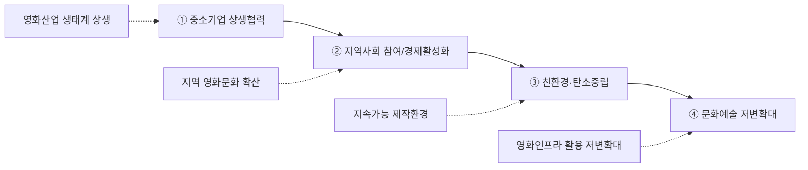

---
{"publish":true,"permalink":"/경영평가/1-6/5_지표작성방안","title":"5_지표 작성 방안","created":"2025-12-14","modified":"2025-12-18T09:35:28.959+09:00","tags":["#경영평가","#작성가이드","#상생협력","#지역발전","#지표_1-6"],"cssclasses":""}
---


# [1-6 상생협력 및 지역발전] 세부평가내용 작성 방안

> [!abstract] 문서 개요
> 본 문서는 '1.6 상생협력 및 지역발전' 지표의 2025년도 경영평가보고서 작성을 위한 논리적 흐름(Storyline)과 문단별 세부 작성 방안을 제안합니다.
> 
> **핵심 목표**: [[25년 경평/2_지표별 자료/1-6_상생협력_및_지역발전/3_전년도_지적사항_및_개선실적\|전년도 지적사항(C 등급)]]을 극복하고, **'영화산업 기반 상생 생태계'**와 **'지역 영화문화 확산'**을 부각하여 목표 등급(B등급 이상)을 달성하는 데 중점을 두었습니다.

---

## 1. Storyline 구성안 비교

### 📌 Option A: 세부평가요소 순차형

| 구분 | 내용 |
|------|------|
| **구조** | 편람 세부평가내용 순서대로 서술 |
| **장점** | 평가자 친화적, 누락 방지 |
| **단점** | 기관 특성 부각 어려움 |
| **적합도** | ⭐⭐⭐ |

```
① 중소기업 상생협력 → ② 지역사회 참여/경제활성화 → ③ 친환경·탄소중립 → ④ 문화예술 저변확대
```

### 📌 Option B: 성과 중심 역순형

| 구분 | 내용 |
|------|------|
| **구조** | 핵심 성과를 앞세우고 세부내용 후술 |
| **장점** | 강점 부각, 임팩트 있는 도입 |
| **단점** | 구조적 완결성 약함 |
| **적합도** | ⭐⭐ |

```
핵심성과(지역영화제 100% 확대) → 상생협력 체계 → 친환경·탄소중립 → 문화예술 저변확대
```

### 📌 Option C: 기관 미션 연계형

| 구분 | 내용 |
|------|------|
| **구조** | 영화진흥 미션과 상생협력 연계 |
| **장점** | 기관 특수성 강조 |
| **단점** | 일반 상생협력 요소 희석 우려 |
| **적합도** | ⭐⭐⭐ |

```
기관 미션(영화진흥) → 영화산업 상생 생태계 → 지역 영화문화 확산 → 친환경 제작환경 → 사회적 책임
```

---

## 2. 추천 Storyline (영화산업 기반 지역 상생 발전)

> [!tip] 추천 구조
> 편람 세부평가요소 순서를 기본으로 하되, 각 요소마다 **기관 미션(영화진흥)과의 연계성**을 강조하는 구조

### 전체 흐름



### 핵심 메시지

> **"영화산업 노사정 협력으로 공정 생태계를 조성하고, 지역 영화문화 확산과 친환경 제작환경 구축으로 지속가능한 상생 발전 실현"**

---

## 3. 문단별 작성 방안

### 세부평가내용① 중소기업 등과의 상생 협력

#### 문단 1-1: 우선구매 의무실적 달성

| 항목 | 내용 |
|------|------|
| **Core Message** | 중증장애인 생산품 의무구매 2년 연속 달성 및 우선구매 체계 고도화 |
| **주요 근거** | 의무구매 비율 초과 달성, 부서성과평가 지표 신설 |
| **담당 부서** | 재무회계팀 |

| 구분 | 실적 | 성과 |
|------|------|------|
| 중소기업 구매 | **88.5%** | 의무 50% 대비 초과달성 |
| 중증장애인 생산품 | **1.57%** | 2년 연속 달성 (의무 1.1%) |
| 사회적기업 | **3.26%** | 전년 대비 +1.06%p |
| 기술개발제품 | **21.41%** | 전년 대비 +12.0%p |
| 장애인표준사업장 | **2.56%** | 전년 대비 +0.76%p |
| 의무실적 달성 | **9개/11개** | 81.8% 달성 |
| 부서성과평가 지표 | **신설** | 우선구매 실적 0.5점 |
| 부서별 목표 달성률 | **168.6%** | 5개 본부/센터 |

> [!example] 추천 스토리라인
> **"의무구매 목표 설정 → 부서성과평가 지표 신설 → 구매 품목 다변화 → 2년 연속 목표 달성"**
> 
> - 도입: 중증장애인 생산품 우선구매 의무 이행 및 사회적 가치 실현
> - 전개: 부서성과평가 우선구매 지표 신설, 외부강사 교육 2년 연속, 부서별 목표 설정
> - 성과: 의무구매 비율 초과 달성, 2년 연속 목표 달성, 사회적기업·기술개발제품 전년 미달성→달성

#### 문단 1-2: 노사정 협력 거버넌스

| 항목 | 내용 |
|------|------|
| **Core Message** | 영화산업 노사정 실무협의회 통한 공정생태계 조성 |
| **주요 근거** | 협의회 4회, 표준보수지침 공표, 직배사·OTT 협력 |
| **담당 부서** | 공정환경조성팀 |

| 구분 | 실적 | 성과 |
|------|------|------|
| 노사정 실무협의회 | **4회** 개최 | 표준보수지침 합의 |
| 공정환경조성특위 | **6회** 개최 | 표준상영계약서 논의 |
| 직배사 협력 | **4개사** 협조 요청 | 표준계약서 사용 권고 |
| 넷플릭스 간담회 | **1회** | 홀드백, 표준계약서 협의 |
| 매니지먼트사 협의 | **2회** | 배우 개런티 자율협약 |
| 저작권파트 중재위 | **7인** 구성 | 3심제 도입 |

> [!example] 추천 스토리라인
> **"영화산업 공정생태계 조성 필요 → 노사정 협의체 구성 → 표준계약서 확산 → 공정거래 문화 정착"**
> 
> - 도입: 영화산업 불공정 거래 관행 개선 및 상생협력 필요
> - 전개: 노사정 실무협의회 4회, 공정환경조성특위 6회, 직배사 4개사 협조 요청
> - 성과: 표준보수지침 공표(10년 만의 합의), 저작권파트 중재위원회 신설

#### 문단 1-3: 유관기관 협력 네트워크

| 항목 | 내용 |
|------|------|
| **Core Message** | 저작권보호, 불법유통 대응 및 국제협력 체계 구축 |
| **주요 근거** | 한국저작권보호원 MOU, 불법유통대응협의체, AFAN |
| **담당 부서** | 공정환경조성팀, 국제교류팀 |

| 구분 | 실적 | 성과 |
|------|------|------|
| 한국저작권보호원 | **MOU 체결** (12월) | 불법유통 공동 대응 |
| 불법유통대응협의체 | **3회** 운영 | 11.4만건 모니터링 |
| 협력업체 인권경영 | **8개 업체** 점검 | 최초 실시, 회수율 100% |
| AFAN | **8개국** 네트워크 | 아시아 영화진흥 선도 |
| CNC 자매결연 | **체결** | 아시아 기관 최초 |
| 지역영상위 협력 | **14개 기관** | 전년 11개→14개 확대 |

> [!example] 추천 스토리라인
> **"저작권 보호 필요성 증대 → 유관기관 협력체계 구축 → 불법유통 모니터링 강화 → 공정 생태계 기반 마련"**
> 
> - 도입: 영화 저작권 보호 및 불법유통 대응 필요성 증대
> - 전개: 한국저작권보호원 MOU 체결, 불법유통대응협의체 3회 운영, 11.4만건 모니터링
> - 성과: AFAN 8개국 네트워크 구축, CNC 자매결연(아시아 최초), 협력업체 인권경영 점검 최초

---

### 세부평가내용② 지역사회 참여 및 경제 활성화

#### 문단 2-1: 지역 영화제 지원 확대

| 항목 | 내용 |
|------|------|
| **Core Message** | 지역영화제 지원 20개처(전년 10개 대비 100% 확대) |
| **주요 근거** | 예산 확대, 지원 대상 다변화 |
| **담당 부서** | 영화문화팀 |

| 구분 | 실적 | 성과 |
|------|------|------|
| 지역영화제 지원 | **20개처** | 전년 10개 대비 100%↑ |
| 지원금액 | **998백만원** | 중소규모 14개처 포함 |
| 독립예술영화 전용관 | **27개관** | 전년 대비 1개관↑ |
| 찾아가는 영화관 | **17개 행정구역** | 전수 방문 |
| 관객수 | **49,734명** | 10월 기준 |

> [!example] 추천 스토리라인
> **"지역 영화문화 활성화 필요 → 지원 대상 확대 → 전국 20개처 지원 → 지역경제 파급효과 창출"**
> 
> - 도입: 지역 영화문화 활성화 및 지역경제 기여 필요
> - 전개: 지역영화제 지원 대상 10개처→20개처 100% 확대, 찾아가는 영화관 17개 행정구역 전수 방문
> - 성과: 독립예술영화 전용관 27개관 지원, 관객 49,734명 문화향유

#### 문단 2-2: 부산기장촬영소 지역 협력

| 항목 | 내용 |
|------|------|
| **Core Message** | 문체부-부산시-기장군 3개 기관 협의체 구성 |
| **주요 근거** | 협의체 4회, 지역업체 참여, 경제효과 |
| **담당 부서** | 영화기술인프라팀 |

| 구분 | 실적 | 성과 |
|------|------|------|
| 3개 기관 협의체 | **공식 구성** (8.26) | 문체부·부산시·기장군 |
| 협의체 회의 | **4회** | 건립 현황 공유 |
| 연구보고서 배포 | **91개처 144부수** | 지역 포함 |
| KOFIC 컨퍼런스 | **벡스코** 개최 | 부산 지역 행사 |
| 100G 네트워크 | **확정** | 지역 첨단화 기여 |

> [!example] 추천 스토리라인
> **"부산기장촬영소 건립 추진 → 3개 기관 협의체 구성 → 지역업체 참여 확대 → 영화산업 클러스터 조성"**
> 
> - 도입: 부산기장촬영소 건립을 통한 지역경제 활성화 기대
> - 전개: 문체부-부산시-기장군 3개 기관 협의체 공식 구성(8.26), 협의체 4회 운영
> - 성과: 연구보고서 91개처 배포, KOFIC 컨퍼런스 부산 개최, 영화산업 클러스터 기반 마련

#### 문단 2-3: 로케이션 촬영 지역경제 기여

| 항목 | 내용 |
|------|------|
| **Core Message** | 외국영상물 국내 촬영으로 지역경제 211.8억원 집행 |
| **주요 근거** | 로케이션 인센티브, 경제효과 23.6배 |
| **담당 부서** | 국제교류팀 |

| 구분 | 실적 | 성과 |
|------|------|------|
| 촬영 지원 | **332건** | 국내 311 + 해외 21 |
| 국내 집행액 | **211.8억원** | 지역경제 기여 |
| 경제효과 | **23.6배** | 지원금 대비 |
| 한국스태프 참여 | **644명** | 지역 고용 창출 |
| 지역영상위 협력 | **14개 기관** | 신규 등록 519개소 |

> [!example] 추천 스토리라인
> **"외국영상물 국내 촬영 유치 → 로케이션 인센티브 지원 → 지역경제 211.8억원 집행 → 경제효과 23.6배 창출"**
> 
> - 도입: 외국영상물 국내 촬영 유치를 통한 지역경제 활성화
> - 전개: 로케이션 촬영 지원 332건, 14개 지역영상위 협력, 한국스태프 644명 참여
> - 성과: 지역경제 211.8억원 집행, 경제효과 23.6배 창출

---

### 세부평가내용③ 친환경·탄소중립

#### 문단 3-1: 그린슈팅 인증 확대

| 항목 | 내용 |
|------|------|
| **Core Message** | 그린슈팅 인증 11편 달성 (전년 6편 대비 83% 증가) |
| **주요 근거** | 인증 확대, 제작지원 연계, 컨설팅 |
| **담당 부서** | 창작제작팀 |

| 구분 | 실적 | 성과 |
|------|------|------|
| 그린슈팅 인증 | **11편** | 전년 6편 대비 83%↑ |
| 친환경 제작 가점 | **3점** | 제작지원 우대 |
| 그린 컨설팅 | **6편** | 친환경 제작 지원 |
| 녹색제품 구매 | **가이드라인** 배포 | PC·모니터 추천 |

> [!example] 추천 스토리라인
> **"친환경 영화제작 필요성 → 그린슈팅 인증제도 운영 → 가점 및 컨설팅 지원 → 인증 11편 달성(83%↑)"**
> 
> - 도입: 영화산업 친환경 제작환경 조성 필요
> - 전개: 그린슈팅 인증제도 운영, 친환경 제작 우대 3점 가점, 그린 컨설팅 6편 지원
> - 성과: 그린슈팅 인증 11편 달성(전년 6편 대비 83% 증가)

---

### 세부평가내용④ 문화예술 저변확대

#### 문단 4-1: 영화관 접근성 취약지역 지원

| 항목 | 내용 |
|------|------|
| **Core Message** | 작은영화관 23개관 운영, 취약계층 문화향유 기회 확대 |
| **주요 근거** | 작은영화관, 찾아가는 영화관, 배리어프리 |
| **담당 부서** | 영화문화팀 |

| 구분 | 실적 | 성과 |
|------|------|------|
| 작은영화관 | **23개관** | 전국 분포 |
| 작은영화관 기획전 | **15회** | 다양성영화 상영 |
| 가치봄 제작 | **146편** | 배리어프리 영화 |
| 동시개봉작 | **12편** | 결합형 6 + 폐쇄형 6 |
| 가치봄플러스 | **243회** | 9,232명 참여 |
| 오프라인 관람 | **54,345명** | 문화향유 |

> [!example] 추천 스토리라인
> **"영화관 접근성 취약지역 현황 파악 → 작은영화관 23개관 운영 → 배리어프리 영화 확대 → 문화향유 기회 제공"**
> 
> - 도입: 영화관 없는 지역 해소 및 문화 접근성 개선 필요
> - 전개: 작은영화관 23개관 전국 운영, 가치봄 146편 제작, 동시개봉작 12편
> - 성과: 오프라인 관람 54,345명, 가치봄플러스 243회 9,232명 참여

#### 문단 4-2: 사회적 취약계층 영화문화 지원

| 항목 | 내용 |
|------|------|
| **Core Message** | 노인일자리 창출과 장애인 문화접근성 동시 달성 |
| **주요 근거** | 노인인력개발원 협업, 복권기금 우수 |
| **담당 부서** | 영화문화팀 |

| 구분 | 실적 | 성과 |
|------|------|------|
| 노인인력개발원 협업 | **시범사업** | 경남 3개처 |
| 보건복지부 심사 | **전국화 통과** | '26년 확대 |
| 복권기금 평가 | **80.78점** (우수) | 사업 효과 인정 |
| '26년 예산 확보 | **1,300백만원** | 동일 금액 |
| 한글자막CC개봉관 | **76개관** | 전국 편성 |
| 지역미디어센터 협업 | **26편** | 가치봄 제작 |

> [!example] 추천 스토리라인
> **"취약계층 영화 접근성 현황 파악 → 노인인력개발원 협업 → 보건복지부 전국화 통과 → 사회적 가치 동시 창출"**
> 
> - 도입: 장애인·고령층 등 취약계층 영화 접근성 개선 필요
> - 전개: 노인인력개발원 협업 시범사업, 한글자막CC개봉관 76개관 편성
> - 성과: 보건복지부 전국화 심사 통과, 복권기금 평가 우수(80.78점), 노인 일자리+장애인 접근성 동시 달성


---

## 4. 문단 구성 요약

| 문단 | 핵심 주제 | 담당 부서 | 핵심 성과 |
|------|----------|----------|----------|
| **1-1** | 우선구매 의무실적 달성 | 재무회계팀 | 중증장애인 2년 연속, 사회적기업 +1.06%p |
| **1-2** | 노사정 협력 거버넌스 | 공정환경조성팀 | 협의회 4회, 표준보수지침 10년 만 합의 |
| **1-3** | 유관기관 협력 네트워크 | 공정환경조성팀, 국제교류팀 | MOU 체결, AFAN 8개국, CNC 자매결연 |
| **2-1** | 지역 영화제 지원 확대 | 영화문화팀 | 20개처 100%↑, 찾아가는 영화관 17개 |
| **2-2** | 부산기장촬영소 지역 협력 | 영화기술인프라팀 | 3개 기관 협의체, 회의 4회 |
| **2-3** | 로케이션 촬영 지역경제 기여 | 국제교류팀 | 211.8억원 집행, 경제효과 23.6배 |
| **3-1** | 그린슈팅 인증 확대 | 창작제작팀 | 11편 달성 (83%↑) |
| **4-1** | 영화관 접근성 취약지역 지원 | 영화문화팀 | 작은영화관 23개관, 가치봄 146편 |
| **4-2** | 사회적 취약계층 영화문화 지원 | 영화문화팀 | 복권기금 우수, 전국화 통과 |

---

## 5. 🏆 최고 성과(BP) 사례

> [!tip] Best Practice 선정 기준
> 지역발전 기여, 상생협력 성과, 친환경 영화제작 등 **'영화산업 기반 지역 상생 발전'** 성과를 선정

### BP 1: 지역영화제 지원 100% 확대 (10개처→20개처)

| 항목 | 내용 |
|------|------|
| **성과 개요** | 지역영화제 지원 전년 대비 **100% 확대** (10개처→20개처) |
| **추진 과정** | ① 지역 문화활성화 수요 분석 → ② 지원 대상 확대 → ③ 중소규모 영화제 포함 |
| **핵심 성과** | 지원금액 **998백만원**, 중소규모 영화제 **14개처** 신규 포함 |
| **차별화 요소** | 찾아가는 영화관 17개 행정구역 전수 방문, 독립예술영화 전용관 27개관 |
| **정량 지표** | 관객수 **49,734명**, 작은영화관 기획전 **15회** |

> [!success] BP 포인트
> - **100% 확대**: 지역영화제 지원 대상 10개처→20개처
> - **중소규모 포함**: 기존 미지원 중소규모 영화제 14개처 신규 지원
> - **접근성 확대**: 찾아가는 영화관 17개 행정구역 전수 방문

---

### BP 2: 로케이션 인센티브 경제효과 23.6배 창출

| 항목 | 내용 |
|------|------|
| **성과 개요** | 외국영상물 촬영 유치로 지역경제 **211.8억원** 집행, 경제효과 **23.6배** |
| **추진 과정** | ① 로케이션 인센티브 지원 → ② 14개 지역영상위 협력 → ③ 한국스태프 고용 |
| **핵심 성과** | 촬영 지원 **332건**, 한국스태프 **644명** 참여 |
| **차별화 요소** | 지역 고용 창출과 글로벌 K-무비 확산 동시 달성 |
| **정량 지표** | 지역영상위 **14개 기관** 협력(전년 11개→14개 확대), 신규 등록 **519개소** |

> [!success] BP 포인트
> - **경제 파급효과**: 지원금 대비 23.6배 경제효과 창출
> - **일자리 창출**: 한국스태프 644명 지역 고용
> - **지역 협력 확대**: 지역영상위 14개 기관 협력(+3개 확대)

---

### BP 3: 그린슈팅 인증 83% 확대 및 복권기금 평가 우수

| 항목 | 내용 |
|------|------|
| **성과 개요** | 그린슈팅 인증 **6편→11편** (83%↑), 복권기금 평가 **80.78점(우수)** |
| **추진 과정** | ① 친환경 제작 가점 3점 → ② 그린 컨설팅 지원 → ③ 취약계층 영화문화 지원 |
| **핵심 성과** | 보건복지부 **전국화 심사 통과**, 2026년 확대 예정 |
| **차별화 요소** | 노인 일자리 창출 + 장애인 문화접근성 동시 달성 |
| **정량 지표** | 가치봄 **146편** 제작, 동시개봉작 **12편**, 한글자막CC개봉관 **76개관** |

> [!success] BP 포인트
> - **친환경 확대**: 그린슈팅 인증 83% 증가(6편→11편)
> - **복권기금 우수**: 80.78점 우수 등급, 전국화 심사 통과
> - **사회적 가치**: 노인 일자리+장애인 접근성 동시 달성

---

## 6. 차별화 포인트

### 📌 편람 대응 전략

| 평가요소 | 편람 요구사항 | 대응 전략 |
|---------|-------------|----------|
| ① 중소기업 상생협력 | 우선구매, 협력업체 지원 | 의무구매 2년 연속 + 부서성과평가 지표 신설 + 인권경영 점검 |
| ② 지역사회 참여 | 지역경제 활성화 | 지역영화제 100%↑ + 로케이션 211.8억원 + 3개 기관 협의체 |
| ③ 친환경·탄소중립 | 환경경영 노력 | 그린슈팅 11편 (83%↑) + 친환경 제작 가점 3점 |
| ④ 문화예술 저변확대 | 취약계층 접근성 | 작은영화관 23개관 + 가치봄 146편 + 전국화 통과 |

### 📌 전년도 C등급 개선 전략

| 지적사항 | 개선 내용 |
|---------|----------|
| 상생협력 성과 미흡 | 노사정 협의회 4회 + 표준보수지침 10년 만 합의 |
| 지역발전 기여 부족 | 지역영화제 100% 확대 + 로케이션 211.8억원 집행 |
| 정량적 성과 부재 | 경제효과 23.6배, 한국스태프 644명 등 수치화 |

### 📌 기관 특수성 연계 전략

```
[영화산업 상생 생태계]              [지역 영화문화 확산]
노사정 협의회 4회 ─────────────→ 지역영화제 20개처 100%↑
표준보수지침 합의 ─────────────→ 찾아가는 영화관 17개 행정구역
저작권보호원 MOU ─────────────→ 작은영화관 23개관
                    ↓
            [지속가능 발전]
            그린슈팅 11편 (83%↑)
            로케이션 211.8억원 집행
            경제효과 23.6배
```

---

## 7. 📊 핵심 정량 데이터 Quick Reference

### 📊 우선구매 실적 (재무회계팀)

| 지표 | 수치 | 비고 |
|------|------|------|
| 중소기업 구매 | **88.5%** | 의무 50% 대비 초과달성 |
| 중증장애인 생산품 | **1.57%** | 2년 연속 달성 (의무 1.1%) |
| 사회적기업 | **3.26%** | 전년 대비 +1.06%p |
| 기술개발제품 | **21.41%** | 전년 대비 +12.0%p |
| 장애인표준사업장 | **2.56%** | 전년 대비 +0.76%p |
| 의무실적 달성 | **9개/11개** | 81.8% 달성 |
| 부서성과평가 지표 | **신설** | 우선구매 실적 0.5점 |

### 📊 노사정 협력 (공정환경조성팀)

| 지표 | 수치 | 비고 |
|------|------|------|
| 노사정 실무협의회 | **4회** | 표준보수지침 합의 |
| 공정환경조성특위 | **6회** | 표준상영계약서 논의 |
| 직배사 협력 | **4개사** | 표준계약서 사용 권고 |
| 넷플릭스 간담회 | **1회** | 홀드백, 표준계약서 협의 |
| 저작권파트 중재위 | **7인** | 3심제 도입 |
| 협력업체 인권경영 | **8개 업체** | 최초 실시, 회수율 100% |

### 📊 지역발전 기여 (영화문화팀, 국제교류팀, 영화기술인프라팀)

| 지표 | 수치 | 비고 |
|------|------|------|
| 지역영화제 지원 | **20개처** | 전년 10개 대비 100%↑ |
| 찾아가는 영화관 | **17개 행정구역** | 전수 방문 |
| 로케이션 촬영 | **332건** | 국내 311 + 해외 21 |
| 국내 집행액 | **211.8억원** | 지역경제 기여 |
| 경제효과 | **23.6배** | 지원금 대비 |
| 한국스태프 참여 | **644명** | 지역 고용 창출 |
| 3개 기관 협의체 | **공식 구성** | 문체부·부산시·기장군 |
| 지역영상위 협력 | **14개 기관** | 전년 11개→14개 확대 |

### 📊 친환경·탄소중립 (창작제작팀)

| 지표 | 수치 | 비고 |
|------|------|------|
| 그린슈팅 인증 | **11편** | 전년 6편 대비 83%↑ |
| 친환경 제작 가점 | **3점** | 제작지원 우대 |
| 그린 컨설팅 | **6편** | 친환경 제작 지원 |

### 📊 문화예술 저변확대 (영화문화팀)

| 지표 | 수치 | 비고 |
|------|------|------|
| 작은영화관 | **23개관** | 전국 분포 |
| 가치봄 제작 | **146편** | 배리어프리 영화 |
| 동시개봉작 | **12편** | 결합형 6 + 폐쇄형 6 |
| 가치봄플러스 | **243회** | 9,232명 참여 |
| 오프라인 관람 | **54,345명** | 문화향유 |
| 한글자막CC개봉관 | **76개관** | 전국 편성 |
| 복권기금 평가 | **80.78점** | 우수 등급 |
| 보건복지부 심사 | **전국화 통과** | '26년 확대 |

---

## 8. 작성 시 유의사항

### ✅ 강조할 점

1. **우선구매 2년 연속 달성**: 중증장애인 생산품 1.57%, 부서성과평가 지표 신설
2. **노사정 협력 성과**: 표준보수지침 10년 만의 합의, 저작권파트 중재위 신설
3. **지역영화제 100% 확대**: 10개처→20개처, 중소규모 영화제 14개처 포함
4. **로케이션 경제효과**: 211.8억원 집행, 경제효과 23.6배, 한국스태프 644명
5. **그린슈팅 83% 증가**: 6편→11편, 친환경 제작환경 선도
6. **취약계층 접근성**: 복권기금 우수, 보건복지부 전국화 통과

### ⚠️ 주의할 점

1. 전년도 C등급 지적사항(상생협력 성과 미흡) 개선 노력 명확히 서술
2. 영화산업 특수성과 일반 상생협력 요소의 균형 유지
3. 정량적 성과(경제효과 23.6배, 100% 확대 등) 적극 활용

### 📝 편람 키워드 체크리스트

- [x] 중소기업 우선구매 의무 이행
- [x] 사회적기업·장애인기업 구매 확대
- [x] 협력업체 인권경영 점검
- [x] 노사정 협력 거버넌스
- [x] 지역사회 참여 및 경제 활성화
- [x] 지역 영화제·영화관 지원
- [x] 친환경·탄소중립 노력
- [x] 문화예술 저변확대
- [x] 취약계층 문화접근성 개선

---

## 관련 자료

| 구분 | 문서명 | 링크 |
|------|--------|------|
| 편람 분석 | 편람 내용 분석 | [바로가기](/경영평가/1-6/2_편람내용분석) |
| 지적사항 | 전년도 지적사항 및 개선실적 | [바로가기](/경영평가/1-6/3_전년도지적사항) |
| 부서 실적 | 재무회계팀 실적 분석 | [바로가기](/부서성과평가/1-2-3/재무회계팀) |
| 부서 실적 | 공정환경조성팀 실적 분석 | [바로가기](/부서성과평가/1-2-3/공정환경조성팀) |
| 부서 실적 | 영화문화팀 실적 분석 | [바로가기](/부서성과평가/1-2-3/영화문화팀) |
| 부서 실적 | 국제교류팀 실적 분석 | [바로가기](/부서성과평가/1-2-3/국제교류팀) |
| 부서 실적 | 영화기술인프라팀 실적 분석 | [바로가기](/부서성과평가/1-2-3/영화기술인프라팀) |
| 부서 실적 | 창작제작팀 실적 분석 | [바로가기](/부서성과평가/1-2-3/창작제작팀) |

---

*작성일: 2025-12-14*
*검증상태: 부서실적 대조 완료*

---
**수정이력**
- 2025-12-18: 5. 최고 성과(BP) 사례 섹션 추가 (3개 BP 선정)
