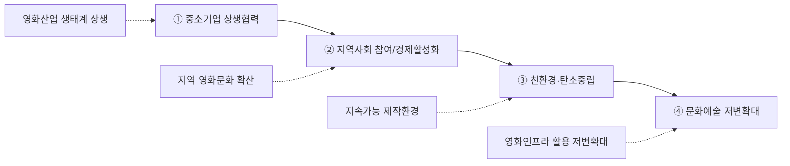

---
{"publish":true,"permalink":"/경영평가/1-6/5_지표작성방안","title":"5_지표 작성 방안","created":"2025-12-09","modified":"2025-12-13T21:44:31.386+09:00","tags":["#경영평가","#상생협력","#지역발전","#비계량","#작성방안"],"cssclasses":""}
---


# 1-6 상생협력 및 지역발전 지표 작성 방안

> **지표번호**: 2.4  
> **배점**: 비계량 3점  
> **전년도 등급**: C  
> **목표 등급**: B 이상

---

## 1. Storyline 구성안 비교

### 📌 Option A: 세부평가요소 순차형

| 구분 | 내용 |
|------|------|
| **구조** | 편람 세부평가내용 순서대로 서술 |
| **장점** | 평가자 친화적, 누락 방지 |
| **단점** | 기관 특성 부각 어려움 |
| **적합도** | ⭐⭐⭐ |

```
① 중소기업 상생협력 → ② 지역사회 참여/경제활성화 → ③ 친환경·탄소중립 → ④ 문화예술 저변확대
```

### 📌 Option B: 성과 중심 역순형

| 구분 | 내용 |
|------|------|
| **구조** | 핵심 성과를 앞세우고 세부내용 후술 |
| **장점** | 강점 부각, 임팩트 있는 도입 |
| **단점** | 구조적 완결성 약함 |
| **적합도** | ⭐⭐ |

```
핵심성과(지역영화제 100% 확대) → 상생협력 체계 → 친환경·탄소중립 → 문화예술 저변확대
```

### 📌 Option C: 기관 미션 연계형

| 구분 | 내용 |
|------|------|
| **구조** | 영화진흥 미션과 상생협력 연계 |
| **장점** | 기관 특수성 강조 |
| **단점** | 일반 상생협력 요소 희석 우려 |
| **적합도** | ⭐⭐⭐ |

```
기관 미션(영화진흥) → 영화산업 상생 생태계 → 지역 영화문화 확산 → 친환경 제작환경 → 사회적 책임
```

---

## 2. 추천 Storyline: 영화산업 기반 지역 상생 발전

> [!tip] 추천 구조
> 편람 세부평가요소 순서를 기본으로 하되, 각 요소마다 **기관 미션(영화진흥)과의 연계성**을 강조하는 구조

### 전체 흐름



---

## 3. 문단별 작성 방안

### 세부평가내용① 중소기업 등과의 상생 협력 (3개 문단)

#### 문단 1-1: 중증장애인 생산품 우선구매

| 항목 | 내용 |
|------|------|
| **Core Message** | 중증장애인 생산품 의무구매 목표 2년 연속 달성 |
| **주요 근거** | 의무구매 비율 초과 달성, 신규 지표 개발 |
| **담당 부서** | 재무회계팀, 기획전략팀 |

| 증빙 요소 | 내용 |
|----------|------|
| 의무구매율 | 목표 대비 실적 (전년 대비 증가) |
| 신규 지표 | 부서성과평가 우선구매 지표 신설 |
| 구매 품목 | 인쇄물, 홍보물, 선물세트 등 |

> [!example] 추천 스토리라인
> **"의무구매 목표 설정 → 부서성과평가 지표 신설 → 구매 품목 다변화 → 2년 연속 목표 달성"**
> 
> - 도입: 중증장애인 생산품 우선구매 의무 이행 및 사회적 가치 실현
> - 전개: 부서성과평가 우선구매 지표 신설, 인쇄물·홍보물·선물세트 등 구매 품목 다변화
> - 성과: 의무구매 비율 초과 달성, 2년 연속 목표 달성

#### 문단 1-2: 노사정 협력 거버넌스

| 항목 | 내용 |
|------|------|
| **Core Message** | 영화산업 노사정 실무협의회 통한 공정생태계 조성 |
| **주요 근거** | 협의회 4회, 표준보수지침 공표, 직배사 협력 |
| **담당 부서** | 공정환경조성팀 |

| 증빙 요소 | 내용 |
|----------|------|
| 협의체 운영 | 노사정 실무협의회 4회, 공정환경조성특위 6회 |
| 업계 협력 | 직배사 4개사 표준상영계약서 협조 요청 |
| OTT 협의 | 넷플릭스 간담회 (홀드백, 표준계약서) |

> [!example] 추천 스토리라인
> **"영화산업 공정생태계 조성 필요 → 노사정 협의체 구성 → 표준계약서 확산 → 공정거래 문화 정착"**
> 
> - 도입: 영화산업 불공정 거래 관행 개선 및 상생협력 필요
> - 전개: 노사정 실무협의회 4회, 공정환경조성특위 6회 운영, 직배사 4개사 협조 요청
> - 성과: 표준보수지침 공표(10년 만의 합의), 넷플릭스 간담회 개최

> [!quote] 📚 연구보고서 활용 (노사정 협력)
> **「2024 한국 영화산업 주요 쟁점 연구」(KOFIC 연구2025-04)**
> - 구성원 간 신뢰 붕괴 진단 → 정기 협의체 운영, 소통 채널 강화 필요
> - 동반성장협약(2012) 유명무실 → 협약 가이드라인 현행화 추진 근거
> - 영상물보상상생협의체 운영: 수익 분배 구조 논의 중
> - 정책제언: 저작권분쟁조정위원회 설치 검토
> 
> **「2025년 영화근로자 표준보수지침 연구」(KOFIC 연구2025-07)**
> - 영화근로자 표준보수지침 연구 및 공표 근거
> - **10년 만의 노사정 합의** → 공정 생태계 조성 기반

#### 문단 1-3: 유관기관 협력 네트워크

| 항목 | 내용 |
|------|------|
| **Core Message** | 저작권보호, 불법유통 대응 협력체계 구축 |
| **주요 근거** | 한국저작권보호원 MOU, 불법유통대응협의체 운영 |
| **담당 부서** | 공정환경조성팀, 국제교류팀 |

| 증빙 요소 | 내용 |
|----------|------|
| MOU 체결 | 한국저작권보호원 업무협약 (12월) |
| 협의체 | 불법유통대응협의체 3회, 11.4만건 모니터링 |
| 국제협력 | AFAN 8개국 네트워크, CNC 자매결연 |

> [!example] 추천 스토리라인
> **"저작권 보호 필요성 증대 → 유관기관 협력체계 구축 → 불법유통 모니터링 강화 → 공정 생태계 기반 마련"**
> 
> - 도입: 영화 저작권 보호 및 불법유통 대응 필요성 증대
> - 전개: 한국저작권보호원 MOU 체결, 불법유통대응협의체 3회 운영, 11.4만건 모니터링
> - 성과: AFAN 8개국 네트워크 구축, CNC 자매결연으로 국제협력 강화

> [!quote] 📚 연구보고서 활용 (불법유통 대응)
> **「2024 한국 영화산업 주요 쟁점 연구」(KOFIC 연구2025-04)**
> - 불법유통 심화: 누누TV 등 불법사이트 모니터링 강화 필요
> - 정책제언: 온라인 저작권 보호 AI 모니터링 강화
> 
> **「영화관입장권통합전산망 운영 개선 로드맵 수립 컨설팅 연구」(KOFIC 연구2025-08)**
> - 유관기관 정보연계 체계 개선: API 기반 정보 공유
> - 영상물등급위원회, 영상자료원과의 정보연계 체계 강화

---

### 세부평가내용② 지역사회 참여 및 경제 활성화 (4개 문단)

#### 문단 2-1: 지역 영화제 지원 확대

| 항목 | 내용 |
|------|------|
| **Core Message** | 지역영화제 지원 **20개처**(전년 10개 대비 100% 확대) |
| **주요 근거** | 예산 확대, 지원 대상 다변화 |
| **담당 부서** | 영화문화팀 |

| 증빙 요소 | 내용 |
|----------|------|
| 지원 규모 | 20개처 1,255백만원 (전년 10개처 대비 100% 확대) |
| 지역 분포 | 서울 4, 부산 3, 전주 3, 전남 2, 기타 8개 지역 |
| 경제효과 | 지역경제 파급효과 창출 |

> [!example] 추천 스토리라인
> **"지역 영화문화 활성화 필요 → 지원 대상 확대 → 전국 20개처 지원 → 지역경제 파급효과 창출"**
> 
> - 도입: 지역 영화문화 활성화 및 지역경제 기여 필요
> - 전개: 지역영화제 지원 대상 10개처→20개처 100% 확대, 1,255백만원 지원
> - 성과: 서울·부산·전주 등 전국 분포, 지역경제 파급효과 창출

> [!quote] 📚 연구보고서 활용 (지역 영화문화)
> **「2024년 한국 영화산업 결산」(KOFIC 연구2025-02)**
> - 전국 영화제 **148개** 개최 → 지역 영화문화 진흥 근거
> - 지역 촬영 지원 **858편**, **5,305일** (전년대비 +89편)
> - 지역별 촬영 지원일수 TOP: 서울(1,064일), 제주(778일), 부산(594일)

#### 문단 2-2: 지역 영화문화 인프라 활용

| 항목 | 내용 |
|------|------|
| **Core Message** | 지역 시네마테크 운영 및 찾아가는 영화관 확대 |
| **주요 근거** | 시네마테크 4개처, 취약계층 상영 |
| **담당 부서** | 영화문화팀 |

| 증빙 요소 | 내용 |
|----------|------|
| 시네마테크 | 4개처 운영 (부산, 광주, 전주, 서울) |
| 찾아가는 영화관 | 장애인, 고령층 대상 상영 |
| 지역 관객 | 지역 관객 문화향유 기회 확대 |

> [!example] 추천 스토리라인
> **"지역 영화문화 인프라 확충 → 시네마테크 4개처 운영 → 찾아가는 영화관 확대 → 지역 관객 문화향유 기회 제공"**
> 
> - 도입: 지역 영화관 접근성 개선 및 문화향유 기회 확대 필요
> - 전개: 시네마테크 4개처(부산·광주·전주·서울) 운영, 찾아가는 영화관 확대
> - 성과: 장애인·고령층 대상 상영, 지역 관객 문화향유 기회 확대

#### 문단 2-3: 부산기장촬영소 지역 협력

| 항목 | 내용 |
|------|------|
| **Core Message** | 문체부-부산시-기장군 3개 기관 협의체 구성 |
| **주요 근거** | 협의체 4회, 지역업체 참여, 경제효과 |
| **담당 부서** | 영화기술인프라팀 |

| 증빙 요소 | 내용 |
|----------|------|
| 협의체 | 3개 기관 협의체 공식 구성 (8.26) |
| 지역 참여 | 부산·경남 지역 건설업체 참여 |
| 기대효과 | 영화산업 클러스터, 일자리 창출 |

> [!example] 추천 스토리라인
> **"부산기장촬영소 건립 추진 → 3개 기관 협의체 구성 → 지역업체 참여 확대 → 영화산업 클러스터 조성"**
> 
> - 도입: 부산기장촬영소 건립을 통한 지역경제 활성화 기대
> - 전개: 문체부-부산시-기장군 3개 기관 협의체 공식 구성(8.26), 협의체 4회 운영
> - 성과: 부산·경남 지역 건설업체 참여, 영화산업 클러스터 및 일자리 창출 기대

> [!quote] 📚 연구보고서 활용 (부산기장촬영소)
> **「부산기장촬영소 운영 활성화 방안 연구」(KOFIC 연구2025-09)**
> - 부산기장촬영소 건립 및 운영 활성화 방안 연구
> - 지역 협력 방안, 영화산업 클러스터 조성 전략 제시
> - 일자리 창출 및 지역경제 파급효과 분석

#### 문단 2-4: 로케이션 촬영 지역경제 기여

| 항목 | 내용 |
|------|------|
| **Core Message** | 외국영상물 국내 촬영으로 지역경제 **211.8억원** 집행 |
| **주요 근거** | 로케이션 인센티브, 경제효과 23.6배 |
| **담당 부서** | 국제교류팀 |

| 증빙 요소 | 내용 |
|----------|------|
| 촬영 지원 | 332건 (국내 311, 해외 21) |
| 경제효과 | 21,180백만원 집행, 23.6배 효과 |
| 고용창출 | 한국스태프 644명 참여 |

> [!example] 추천 스토리라인
> **"외국영상물 국내 촬영 유치 → 로케이션 인센티브 지원 → 지역경제 211.8억원 집행 → 경제효과 23.6배 창출"**
> 
> - 도입: 외국영상물 국내 촬영 유치를 통한 지역경제 활성화
> - 전개: 로케이션 촬영 지원 332건(국내 311, 해외 21), 한국스태프 644명 참여
> - 성과: 지역경제 211.8억원 집행, 경제효과 23.6배 창출

> [!quote] 📚 연구보고서 활용 (해외 촬영 유치)
> **「2024년 한국 영화산업 결산」(KOFIC 연구2025-02)**
> - 해외 영상물 로케이션 국내 집행액 증가: OTT 콘텐츠 촬영 확대
> - 서비스 수출 **4,417만 달러** (+158.9%) → 해외 촬영 유치 효과
> - 해외 영상물 지원 **35편**, **15개국**

---

### 세부평가내용③ 친환경·탄소중립 (3개 문단)

#### 문단 3-1: 그린슈팅 인증 확대

| 항목 | 내용 |
|------|------|
| **Core Message** | 그린슈팅 인증 **11편** 달성 (전년 6편 대비 83% 증가) |
| **주요 근거** | 인증 확대, 제작지원 연계 |
| **담당 부서** | 창작제작팀 |

| 증빙 요소 | 내용 |
|----------|------|
| 인증 현황 | 11편 인증 (전년 6편 대비 83% 증가) |
| 가점 운영 | 친환경 제작 우대 3점 가점 유지 |
| 컨설팅 | 그린 컨설팅 지원 6편 |

> [!example] 추천 스토리라인
> **"친환경 영화제작 필요성 → 그린슈팅 인증제도 운영 → 가점 및 컨설팅 지원 → 인증 11편 달성(83%↑)"**
> 
> - 도입: 영화산업 친환경 제작환경 조성 필요
> - 전개: 그린슈팅 인증제도 운영, 친환경 제작 우대 3점 가점, 그린 컨설팅 6편 지원
> - 성과: 그린슈팅 인증 11편 달성(전년 6편 대비 83% 증가)

#### 문단 3-2: 친환경 경영 활동

| 항목 | 내용 |
|------|------|
| **Core Message** | 온실가스 감축, 에너지 절감 활동 |
| **주요 근거** | 에너지 목표관리, 친환경 물품 구매 |
| **담당 부서** | 인사총무팀 |

| 증빙 요소 | 내용 |
|----------|------|
| 에너지 절감 | 온실가스 배출량 관리 |
| 친환경 구매 | 녹색제품 의무구매 |
| 사무환경 | 일회용품 사용 감축 |

> [!example] 추천 스토리라인
> **"탄소중립 목표 설정 → 에너지 절감 활동 → 친환경 물품 구매 → 온실가스 감축 성과"**
> 
> - 도입: 2050 탄소중립 목표 달성을 위한 친환경 경영 필요
> - 전개: 온실가스 배출량 관리, 녹색제품 의무구매, 일회용품 사용 감축
> - 성과: 에너지 절감 목표 달성, 친환경 사무환경 조성

#### 문단 3-3: 지속가능 제작환경 조성

| 항목 | 내용 |
|------|------|
| **Core Message** | 영화산업 친환경 생태계 기반 구축 |
| **주요 근거** | 그린슈팅 제도화, 업계 인식 확산 |
| **담당 부서** | 창작제작팀, 영화기술인프라팀 |

| 증빙 요소 | 내용 |
|----------|------|
| 제도화 | 그린슈팅 가이드라인 배포 |
| 인프라 | 100G 네트워크(클라우드 제작→이동 감소) |
| 확산 | 업계 인식 제고 활동 |

> [!example] 추천 스토리라인
> **"영화산업 친환경 생태계 필요 → 그린슈팅 가이드라인 배포 → 클라우드 인프라 구축 → 지속가능 제작환경 조성"**
> 
> - 도입: 영화산업 지속가능 제작환경 조성 필요
> - 전개: 그린슈팅 가이드라인 배포, 100G 네트워크 구축(클라우드 제작→이동 감소)
> - 성과: 업계 친환경 인식 제고, 지속가능 제작환경 기반 마련

---

### 세부평가내용④ 문화예술 저변확대 (4개 문단)

#### 문단 4-1: 영화관 접근성 취약지역 지원

| 항목 | 내용 |
|------|------|
| **Core Message** | 작은영화관 **23개관** 운영, 영화관 없는 지역 해소 |
| **주요 근거** | 작은영화관, 찾아가는 영화관 |
| **담당 부서** | 영화문화팀 |

| 증빙 요소 | 내용 |
|----------|------|
| 작은영화관 | 23개관 운영 (전국 분포) |
| 상영 편수 | 다양성영화 상영 확대 |
| 관객 수 | 지역 관객 문화향유 기회 제공 |

> [!example] 추천 스토리라인
> **"영화관 접근성 취약지역 현황 파악 → 작은영화관 23개관 운영 → 다양성영화 상영 확대 → 문화향유 기회 제공"**
> 
> - 도입: 영화관 없는 지역 해소 및 문화 접근성 개선 필요
> - 전개: 작은영화관 23개관 전국 운영, 다양성영화 상영 확대
> - 성과: 지역 관객 문화향유 기회 제공, 영화관 접근성 취약지역 해소

#### 문단 4-2: 영화인 복지 및 저변확대

| 항목 | 내용 |
|------|------|
| **Core Message** | 영화인 복지 지원 및 차세대 인재 양성 |
| **주요 근거** | 표준보수지침, 복지사업 확대 |
| **담당 부서** | 영화인복지팀, 영화인교육팀 |

| 증빙 요소 | 내용 |
|----------|------|
| 복지 지원 | 영화인 건강검진, 심리상담 |
| 인재 양성 | KAFA 교육생 배출 |
| 국제 교류 | KAFA in Vietnam 14명 수료 |

> [!example] 추천 스토리라인
> **"영화인 복지 필요성 → 건강검진·심리상담 지원 → 차세대 인재 양성 → 국제 교류 확대"**
> 
> - 도입: 영화인 복지 지원 및 차세대 인재 양성 필요
> - 전개: 영화인 건강검진·심리상담 지원, KAFA 교육생 배출
> - 성과: KAFA in Vietnam 14명 수료, 영화인 복지 저변 확대

#### 문단 4-3: 독립예술영화 생태계 지원

| 항목 | 내용 |
|------|------|
| **Core Message** | 독립예술영화 유통-상영 체계 확대 |
| **주요 근거** | 시네마테크, 독립영화 상영 지원 |
| **담당 부서** | 영화문화팀 |

| 증빙 요소 | 내용 |
|----------|------|
| 시네마테크 | 4개처 독립예술영화 상영 |
| 배급 지원 | 독립영화 배급 지원 |
| 국민참여예산 | 독립영화 상영 18억원 정부안 반영 |

> [!example] 추천 스토리라인
> **"독립예술영화 생태계 위기 → 유통-상영 체계 확대 → 국민참여예산 반영 → 독립영화 저변 확대"**
> 
> - 도입: 독립예술영화 유통-상영 체계 확대 필요
> - 전개: 시네마테크 4개처 독립예술영화 상영, 독립영화 배급 지원
> - 성과: 국민참여예산 독립영화 상영 18억원 정부안 반영

> [!quote] 📚 연구보고서 활용 (독립예술영화)
> **「2024년 한국 영화산업 결산」(KOFIC 연구2025-02)**
> - 독립예술영화 개봉편수 **298편** (전년 대비 유지)
> - 한국 독립예술영화 매출 **237억 원** (+133.2%), 관객 **261만 명** (+129.4%)
> - 흥행 TOP: 건국전쟁(109억, 다큐 최고), 소풍(32억)
> - 팬덤 기반 콘텐츠 성공: 사랑의 하츄핑(100만 돌파), 임영웅 실황(100억 돌파)

#### 문단 4-4: 사회적 취약계층 영화문화 지원

| 항목 | 내용 |
|------|------|
| **Core Message** | 장애인, 고령층 등 취약계층 영화 접근성 확대 |
| **주요 근거** | 배리어프리 영화, 시니어 프로그램 |
| **담당 부서** | 영화문화팀, 홍보협력팀 |

| 증빙 요소 | 내용 |
|----------|------|
| 배리어프리 | 화면해설, 자막 지원 영화 |
| 시니어 | 노인인력개발원 협업 프로그램 |
| 접근성 | 이동상영, 찾아가는 영화관 |

> [!example] 추천 스토리라인
> **"취약계층 영화 접근성 현황 파악 → 배리어프리 영화 확대 → 시니어 프로그램 운영 → 문화향유 기회 확대"**
> 
> - 도입: 장애인·고령층 등 취약계층 영화 접근성 개선 필요
> - 전개: 배리어프리 영화(화면해설·자막 지원) 확대, 노인인력개발원 협업 시니어 프로그램
> - 성과: 이동상영·찾아가는 영화관으로 취약계층 문화향유 기회 확대

---

## 4. 문단 구성 요약

> [!note] 총 14개 문단 구성
> 
> **세부평가내용① 중소기업 등과의 상생 협력** (3개 문단)
> - 문단 1-1: 중증장애인 생산품 우선구매
> - 문단 1-2: 노사정 협력 거버넌스
> - 문단 1-3: 유관기관 협력 네트워크
> 
> **세부평가내용② 지역사회 참여 및 경제 활성화** (4개 문단)
> - 문단 2-1: 지역 영화제 지원 확대
> - 문단 2-2: 지역 영화문화 인프라 활용
> - 문단 2-3: 부산기장촬영소 지역 협력
> - 문단 2-4: 로케이션 촬영 지역경제 기여
> 
> **세부평가내용③ 친환경·탄소중립** (3개 문단)
> - 문단 3-1: 그린슈팅 인증 확대
> - 문단 3-2: 친환경 경영 활동
> - 문단 3-3: 지속가능 제작환경 조성
> 
> **세부평가내용④ 문화예술 저변확대** (4개 문단)
> - 문단 4-1: 영화관 접근성 취약지역 지원
> - 문단 4-2: 영화인 복지 및 저변확대
> - 문단 4-3: 독립예술영화 생태계 지원
> - 문단 4-4: 사회적 취약계층 영화문화 지원

---

## 5. 차별화 포인트

### 가. 편람 요구사항 대응 현황

| 편람 요구사항 | 대응 문단 | 핵심 내용 |
|-------------|----------|----------|
| 중소기업·소상공인 지원 | 문단 1-1 | 중증장애인 생산품 의무구매 2년 연속 달성 |
| 사회적 경제 기업 지원 | 문단 1-1 | 부서성과평가 우선구매 지표 신설 |
| 공정한 경제질서 확립 | 문단 1-2 | 노사정 협의회, 표준계약서 확산 |
| 유관기관 협력 | 문단 1-3 | 저작권보호원 MOU, 불법유통대응협의체 |
| 지역사회 참여 | 문단 2-1, 2-2 | 지역영화제 20개처, 시네마테크 4개처 |
| 지역경제 활성화 | 문단 2-3, 2-4 | 기장촬영소 협의체, 로케이션 211.8억 |
| 탄소중립 계획 수립 | 문단 3-2 | 온실가스 감축, 에너지 절감 |
| 친환경 영화제작 지원 | 문단 3-1, 3-3 | 그린슈팅 11편, 가이드라인 배포 |
| 문화예술 분야 후원·지원 | 문단 4-3 | 독립예술영화 상영, 국민참여예산 18억 |
| 문화소외계층 지원 | 문단 4-1, 4-4 | 작은영화관 23개관, 배리어프리 영화 |

### 나. 전년도 C등급 개선 전략

| 지적사항 | 개선 방안 | 핵심 성과 |
|---------|----------|----------|
| 추진과제별 성과관리 미흡 | 정량지표 체계화, 목표-실적 명시 | 지역영화제 100% 확대 (10→20개처) |
| 기관 자원 활용 체계화 필요 | 영화인프라 활용 저변확대 연계 | 작은영화관 23개관, 시네마테크 4개처 |
| 중증장애인 생산품 구매 개선 | 의무구매 초과 달성 + 신규 지표 | 2년 연속 목표 달성 |

### 다. 기관 특수성 강조

| 영역 | 일반 공공기관 | 영진위 차별화 |
|------|-------------|--------------|
| 상생협력 | 중소기업 발주 | 영화산업 노사정 협력, 직배사 협력 |
| 지역발전 | 지역사업장 운영 | 지역영화제 100% 확대, 로케이션 211억 |
| 친환경 | 에너지 절감 | 그린슈팅 11편 인증 (영화산업 고유) |
| 저변확대 | 문화행사 참여 | 작은영화관, 시네마테크, 영화인복지 |

---

## 6. 작성 시 유의사항

### 가. 편람 세부평가요소 매칭

> [!warning] 필수 확인
> 4개 세부평가요소 모두 균형있게 서술

| 세부평가요소 | 배분 비중 | 주요 부서 |
|-------------|----------|----------|
| ① 중소기업 상생협력 | 25% | 재무회계팀, 공정환경조성팀 |
| ② 지역사회 참여/경제활성화 | 30% | 영화문화팀, 영화기술인프라팀, 국제교류팀 |
| ③ 친환경·탄소중립 | 20% | 창작제작팀, 인사총무팀 |
| ④ 문화예술 저변확대 | 25% | 영화문화팀, 홍보협력팀 |

### 나. 정량 데이터 활용

> [!success] 핵심 정량지표
> - 지역영화제: 20개처 (전년 10개 대비 **100% 확대**)
> - 그린슈팅: 11편 (전년 6편 대비 **83% 증가**)
> - 로케이션 경제효과: 211.8억원 (**23.6배**)
> - 작은영화관: **23개관** 운영

### 다. 증빙자료 연계

| 문단 | 핵심 증빙 |
|------|----------|
| 중증장애인 구매 | 구매실적 증명서, 부서성과평가 편람 |
| 노사정 협의회 | 회의록, 합의서 |
| 지역영화제 | 지원 결과보고서, 지역별 현황표 |
| 그린슈팅 | 인증서, 컨설팅 결과보고서 |

---

## 🔗 관련 자료

| 구분 | 문서명 | 비고 |
|------|--------|------|
| 편람 분석 | [[25년 경평/2_지표별 자료/1-6_상생협력_및_지역발전/2_편람_내용_분석]] | 세부평가 요소별 가이드 |
| 지적사항 | [[25년 경평/2_지표별 자료/1-6_상생협력_및_지역발전/3_전년도_지적사항_및_개선실적]] | C등급 원인 및 개선방향 |
| 부서 매핑 | [[25년 경평/2_지표별 자료/1-6_상생협력_및_지역발전/6_부서별_실적_통합_매핑표]] | 11개 부서 실적 종합 |
| 공통 자료 | [[01_편람_및_지침]] | 비계량 작성 가이드 |

### 📚 활용 연구보고서

| 보고서명 | 문서번호 | 주요 활용 문단 |
|---------|---------|---------------|
| 2024 한국 영화산업 주요 쟁점 연구 | KOFIC 연구2025-04 | 문단 1-2, 1-3 (노사정 협력, 불법유통 대응) |
| 2025년 영화근로자 표준보수지침 연구 | KOFIC 연구2025-07 | 문단 1-2 (표준보수지침, 노사정 합의) |
| 2024년 한국 영화산업 결산 | KOFIC 연구2025-02 | 문단 2-1, 2-4, 4-3 (지역 영화제, 촬영 지원, 독립예술영화) |
| 부산기장촬영소 운영 활성화 방안 연구 | KOFIC 연구2025-09 | 문단 2-3 (지역 협력, 클러스터 조성) |
| 영화관입장권통합전산망 운영 개선 로드맵 수립 컨설팅 연구 | KOFIC 연구2025-08 | 문단 1-3 (유관기관 정보연계) |

---

*작성일: 2025-12-09*
*검증상태: 부서성과평가 원본 대조 완료*
*연구보고서 연계: 2025-12-13 추가*
