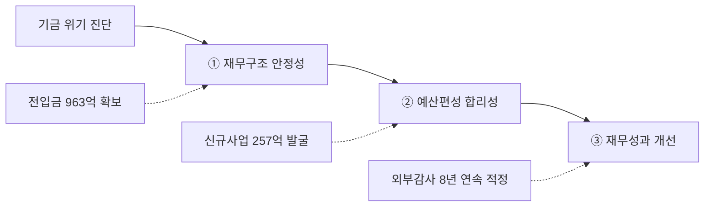

---
{"publish":true,"title":"1-7 재무예산 관리 지표 작성 방안","created":"2025-12-09","modified":"2025-12-09T14:55:16.000+09:00","tags":["경영평가","재무예산관리","비계량","작성방안"],"cssclasses":""}
---


# 1-7 재무예산 관리 지표 작성 방안

> **지표번호**: 3.1  
> **배점**: 비계량 6점  
> **전년도 등급**: C (득점 2.6/6점)  
> **목표 등급**: B 이상

---

## 1️⃣ Storyline 구성안 비교

### 📌 Option A: 세부평가요소 순차형

| 구분 | 내용 |
|------|------|
| **구조** | 편람 세부평가내용 순서대로 서술 |
| **장점** | 평가자 친화적, 누락 방지 |
| **단점** | 기관 고유 이슈 부각 어려움 |
| **적합도** | ⭐⭐⭐ |

```
① 재무구조 안정성·건전성 → ② 합리적·효율적 예산편성 → ③ 재무성과 및 개선노력
```

### 📌 Option B: 기금 위기 대응 중심형

| 구분 | 내용 |
|------|------|
| **구조** | 기금 고갈 위기 대응을 핵심으로 전개 |
| **장점** | 기관 고유 이슈 부각, 전년도 지적사항 직접 대응 |
| **단점** | 세부평가요소 균형 약화 우려 |
| **적합도** | ⭐⭐⭐ |

```
기금 위기 진단 → 재원 다각화(전입금 확보) → 효율적 운용 → 성과 창출
```

### 📌 Option C: 성과 강조형

| 구분 | 내용 |
|------|------|
| **구조** | 핵심 성과를 앞세우고 추진과정 후술 |
| **장점** | 임팩트 있는 도입, 성과 부각 |
| **단점** | 과정의 체계성 약화 |
| **적합도** | ⭐⭐ |

```
핵심성과(전입금 963억 역대최대) → 예산편성 체계 → 집행 효율화 → 재무건전성
```

---

## 2️⃣ 추천 Storyline: 기금 위기 대응 및 재정 건전성 확보

> [!tip] 추천 구조
> 편람 세부평가요소 순서를 기본으로 하되, **기금 위기 대응**을 핵심 축으로 각 요소를 연결하는 구조

### 전체 흐름




### 핵심 메시지

> **"기금 고갈 위기를 재원 다각화와 효율적 운용으로 극복, 역대 최대 사업규모 달성"**

---

## 3️⃣ 문단별 작성 방안

### 세부평가내용① 재무구조 안정성 및 건전성 (4개 문단)

#### 문단 1-1: 기금 위기 대응 및 재원 다각화

| 항목 | 내용 |
|------|------|
| **Core Message** | 전입금 3년 연속 확보, 2026년 **963억원 역대 최대** 달성 |
| **주요 근거** | 국민체육진흥기금 950억, 복권기금 13억 확보 |
| **담당 부서** | 기획전략팀 |

| 증빙 요소 | 내용 |
|----------|------|
| 전입금 추이 | 2024년 354억 → 2025년 645억 → 2026년 963억 |
| 확보 과정 | 국회·기재부·문체부 설득 활동 |
| 시뮬레이션 | 기금 고갈 시점 예측 및 대응 계획 |

#### 문단 1-2: 중장기 재정운용계획

| 항목 | 내용 |
|------|------|
| **Core Message** | 기금 고갈 시뮬레이션 기반 중장기 재정 안정화 전략 수립 |
| **주요 근거** | 연도별 수입-지출 예측, 여유자금 관리 |
| **담당 부서** | 기획전략팀 |

| 증빙 요소 | 내용 |
|----------|------|
| 수입 예측 | 부담금, 전입금, 기타 수입 연도별 추계 |
| 지출 계획 | 사업비·운영비 중장기 전망 |
| 위기 대응 | 여유자금 고갈 시점 예측 및 시나리오 |

#### 문단 1-3: 자산운용 효율화

| 항목 | 내용 |
|------|------|
| **Core Message** | 연기금투자풀 완전위탁형 도입으로 연간 **약 1억원** 비용 절감 |
| **주요 근거** | 위원회 운영비, 성과평가 위탁비 등 절감 |
| **담당 부서** | 재무회계팀 |

| 증빙 요소 | 내용 |
|----------|------|
| 제도 도입 | 주간운용사 선정 (2024.11.22) |
| 비용 절감 | 효익 1.03억 - 비용 0.04억 = 순효익 0.99억 |
| 규정 정비 | 자산운용 관련 규정·지침 전면 정비 |

#### 문단 1-4: 자체회계 수익성 제고

| 항목 | 내용 |
|------|------|
| **Core Message** | 고금리 예금 전략으로 이자수익 **33억원** 달성 |
| **주요 근거** | 분기별 자금 예측 기반 예금 운용 |
| **담당 부서** | 재무회계팀 |

| 증빙 요소 | 내용 |
|----------|------|
| 기존 예금 | 이자수익 22억원 |
| 신규 예치 | 450억원 예치, 이자수익 11억원 |
| 운용 전략 | 분기별 지출 예측 기반 만기 설정 |

---

### 세부평가내용② 합리적·효율적 예산편성 (4개 문단)

#### 문단 2-1: 신규사업 발굴 및 사업규모 확대

| 항목 | 내용 |
|------|------|
| **Core Message** | 2026년 사업비 **882억원** (전년 대비 +57.1%) 역대 최대 |
| **주요 근거** | 신규사업 7개, 257억원 규모 발굴 |
| **담당 부서** | 기획전략팀 |

| 증빙 요소 | 내용 |
|----------|------|
| 신규사업 | AI 영화제작 22억, 국제공동제작 30억 등 7개 |
| 확대사업 | 중예산영화 +100억, 기획개발 +20억 등 |
| 성장 추이 | 2024년 467억 → 2025년 562억 → 2026년 882억 |

#### 문단 2-2: 사업 구조조정 및 효율화

| 항목 | 내용 |
|------|------|
| **Core Message** | 완료·중복 사업 정리로 **46억원** 감액 및 재배분 |
| **주요 근거** | 일반회계 이관, 정부 지적 반영 |
| **담당 부서** | 기획전략팀 |

| 증빙 요소 | 내용 |
|----------|------|
| 이관 사업 | 장애인 관람환경 32억, 찾아가는 영화관 5억 |
| 조정 사업 | 로케이션 지원 △8.96억 (정부평가 지적 반영) |
| 효과 | 재원 효율화 및 신규사업 재원 확보 |

#### 문단 2-3: 체계적 예산편성 프로세스

| 항목 | 내용 |
|------|------|
| **Core Message** | 단계별 의사결정 프로세스로 투명한 예산편성 |
| **주요 근거** | 예산요구→심의→합의→TF심사→조정→최종심의 |
| **담당 부서** | 기획전략팀 |

| 증빙 요소 | 내용 |
|----------|------|
| 프로세스 | 6단계 체계적 심의 절차 |
| TF 운영 | 예산TF 심사 및 사업조정 |
| 투명성 | 부서별 합의 기반 편성 |

#### 문단 2-4: 부과금 수입 관리

| 항목 | 내용 |
|------|------|
| **Core Message** | 영비법 개정 대응, 부과금 징수 재개 및 미납관리 강화 |
| **주요 근거** | 미수부담금 회수 667백만원 (전년 대비 +185백만원) |
| **담당 부서** | 재무회계팀 |

| 증빙 요소 | 내용 |
|----------|------|
| 법 개정 대응 | 2025.3.25 징수 재개, 사전 점검 완료 |
| 미납 관리 | 압류 21건, 회수 667백만원 |
| 시스템 점검 | 부과금관리시스템 정상 가동 확인 |

---

### 세부평가내용③ 재무성과 및 개선 노력 (4개 문단)

#### 문단 3-1: 외부회계감사 8년 연속 적정

| 항목 | 내용 |
|------|------|
| **Core Message** | 외부회계감사 **8년 연속 적정** 의견, 자발적 감사 수감 |
| **주요 근거** | 2017~2024년 연속 적정, 전기오류수정손익 0 |
| **담당 부서** | 재무회계팀 |

| 증빙 요소 | 내용 |
|----------|------|
| 연속 적정 | 2017~2024년 8년 연속 |
| 자발적 감사 | 기타공공기관 의무 아님에도 자발적 수감 |
| 외부 지적 | 문체부·기재부·감사원 지적사항 0건 |

#### 문단 3-2: 국가회계체계 개편 선제 대응

| 항목 | 내용 |
|------|------|
| **Core Message** | 국가결산체계 개편 선제 대응, 가결산 **오류 0건** |
| **주요 근거** | 연계기관 회의 6회, 가결산 2회 정상 완료 |
| **담당 부서** | 재무회계팀 |

| 증빙 요소 | 내용 |
|----------|------|
| 회의 참석 | 기재부 연계기관 회의 6회 참석 |
| 가결산 | 1차·2차 모두 오류 없음 |
| 컨설팅 | 남강회계법인 현금흐름표 개발 |

#### 문단 3-3: 집행관리 효율화

| 항목 | 내용 |
|------|------|
| **Core Message** | 지급 기일 준수율 **100%**, 경상비 최근 5년 최저 |
| **주요 근거** | 출금통제 프로세스, 기금변경 적시 시행 |
| **담당 부서** | 기획전략팀, 재무회계팀 |

| 증빙 요소 | 내용 |
|----------|------|
| 지급 준수 | 지급 기일 준수율 100% |
| 경상비 절감 | 기금변경액 △21%, 국내여비 △28% |
| 모니터링 | 월별 집행률 공지, 오집행 사례 공유 |

#### 문단 3-4: 세무신고 및 재무공시 성실 이행

| 항목 | 내용 |
|------|------|
| **Core Message** | 무신고 가산세 **0원**, 재무공시 전체 이행 |
| **주요 근거** | 연말정산 152명 완료, 부가세 4회 정상 신고 |
| **담당 부서** | 재무회계팀 |

| 증빙 요소 | 내용 |
|----------|------|
| 연말정산 | 152명 전원 완료 (휴직자 포함) |
| 부가세 | 4회 정상 신고, 마감 평균 8일 조기 완료 |
| 재무공시 | ALIO 4건, 재정통계 5회, 재정정보 매일 공개 |

---

## 4️⃣ 차별화 포인트

### 가. 전년도 C등급 개선 전략

| 지적사항 | 개선 방안 | 핵심 성과 |
|---------|----------|----------|
| 기금 고갈 대응 미흡 | 전입금 확보 및 재원 다각화 | 963억원 역대 최대 (3년 연속 확보) |
| 예산 집행 효율성 제고 필요 | 집행률 모니터링 강화, 기금변경 적시 시행 | 지급 준수율 100%, 경상비 5년 최저 |
| 중장기 재정운용계획 고도화 | 기금 고갈 시뮬레이션, 시나리오 수립 | 연도별 수입-지출 예측 체계 구축 |
| 재무 리스크 관리 강화 | 외부감사, 가결산, 내부통제 강화 | 8년 연속 적정, 가결산 오류 0건 |

### 나. 기관 특수성 강조

| 영역 | 일반 공공기관 | 영진위 차별화 |
|------|-------------|--------------|
| 재원 구조 | 정부출연금 중심 | 기금 + 전입금 다각화 (부담금 감소 대응) |
| 위기 대응 | 안정적 수입 | 기금 고갈 위기 → 전입금 3년 연속 확보 |
| 사업 확대 | 정부 예산 범위 | 자체 재원 확보로 882억 역대 최대 |
| 회계 투명성 | 의무 감사 | 자발적 외부감사 8년 연속 적정 |

---

## 5️⃣ 작성 시 유의사항

### 가. 편람 세부평가요소 매칭

> [!warning] 필수 확인
> 3개 세부평가요소 모두 균형있게 서술

| 세부평가요소 | 배분 비중 | 주요 부서 |
|-------------|----------|----------|
| ① 재무구조 안정성·건전성 | 35% | 기획전략팀, 재무회계팀 |
| ② 합리적·효율적 예산편성 | 35% | 기획전략팀, 재무회계팀 |
| ③ 재무성과 및 개선노력 | 30% | 재무회계팀 |

### 나. 정량 데이터 활용

> [!success] 핵심 정량지표
> - 전입금: **963억원** (역대 최대, 3년 연속 확보)
> - 사업비: **882억원** (+57.1%)
> - 외부감사: **8년 연속 적정**
> - 이자수익: **33억원**
> - 비용절감: 연기금투자풀 **약 1억원**/년

### 다. 증빙자료 연계

| 문단 | 핵심 증빙 |
|------|----------|
| 전입금 확보 | 기금운용계획, 전입금 확보 공문 |
| 신규사업 | 2026년 예산편성 자료, 사업계획서 |
| 외부감사 | 2024회계연도 감사보고서 |
| 가결산 | 기재부 가결산 참여 결과 |

---

## 🔗 관련 자료

| 구분 | 문서명 | 비고 |
|------|--------|------|
| 편람 분석 | [[25년 경평/2_지표별 자료/1-7_재무예산_관리/2_편람_내용_분석]] | 세부평가 요소별 가이드 |
| 지적사항 | [[25년 경평/2_지표별 자료/1-7_재무예산_관리/3_전년도_지적사항_및_개선실적]] | C등급 원인 및 개선방향 |
| 부서 매핑 | [[25년 경평/2_지표별 자료/1-7_재무예산_관리/6_부서별_실적_통합_매핑표]] | 2개 부서 실적 종합 |
| 공통 자료 | [[01_편람_및_지침]] | 비계량 작성 가이드 |

---

*작성일: 2025-12-09*
*검증상태: 부서성과평가 원본 대조 완료*
