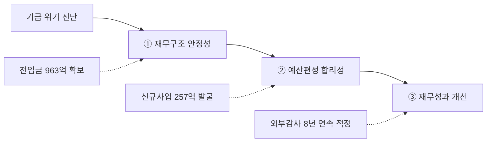

---
{"publish":true,"permalink":"/경영평가/1-7/5_지표작성방안","title":"5_지표 작성 방안","created":"2025-12-14","modified":"2025-12-14T13:03:04.474+09:00","tags":["#경영평가","#재무예산관리","#비계량","#작성방안","#지표_1-7"],"cssclasses":""}
---


# [1-7 재무예산 관리] 세부평가내용 작성 방안

> [!abstract] 문서 개요
> 본 문서는 '1.7 재무예산 관리' 지표의 2025년도 경영평가보고서 작성을 위한 논리적 흐름(Storyline)과 문단별 세부 작성 방안을 제안합니다.
> 
> **핵심 목표**: [[25년 경평/2_지표별 자료/1-7_재무예산_관리/3_전년도_지적사항_및_개선실적\|전년도 지적사항(C 등급)]]을 극복하고, **'기금 위기 대응을 통한 재정 안정성 확보'**와 **'역대 최대 사업규모 달성'**을 부각하여 목표 등급(B등급 이상)을 달성하는 데 중점을 두었습니다.

---

## 1. Storyline 구성안 비교

### Option A: 세부평가요소 순차형

| 구분 | 내용 |
|------|------|
| **구조** | 편람 세부평가내용 순서대로 서술 |
| **장점** | 평가자 친화적, 누락 방지 |
| **단점** | 기관 고유 이슈 부각 어려움 |
| **적합도** | ★★★ |

```
① 재무구조 안정성·건전성 → ② 합리적·효율적 예산편성 → ③ 재무성과 및 개선노력
```

### Option B: 기금 위기 대응 중심형

| 구분 | 내용 |
|------|------|
| **구조** | 기금 고갈 위기 대응을 핵심으로 전개 |
| **장점** | 기관 고유 이슈 부각, 전년도 지적사항 직접 대응 |
| **단점** | 세부평가요소 균형 약화 우려 |
| **적합도** | ★★★ |

```
기금 위기 진단 → 재원 다각화(전입금 확보) → 효율적 운용 → 성과 창출
```

### Option C: 성과 강조형

| 구분 | 내용 |
|------|------|
| **구조** | 핵심 성과를 앞세우고 추진과정 후술 |
| **장점** | 임팩트 있는 도입, 성과 부각 |
| **단점** | 과정의 체계성 약화 |
| **적합도** | ★★ |

```
핵심성과(전입금 963억 역대최대) → 예산편성 체계 → 집행 효율화 → 재무건전성
```

---

## 2. 추천 Storyline (기금 위기 대응 및 재정 건전성 확보)

> [!tip] 추천 구조
> 편람 세부평가요소 순서를 기본으로 하되, **기금 위기 대응**을 핵심 축으로 각 요소를 연결하는 구조
> **"기금 고갈 위기를 재원 다각화와 효율적 운용으로 극복, 역대 최대 사업규모 달성"**

### 전체 흐름



### 핵심 메시지

> **"기금 고갈 위기를 3년 연속 전입금 확보(354억→645억→963억)로 극복하고, 체계적 예산편성과 투명한 재무관리로 역대 최대 사업규모(882억원) 달성"**

---

## 3. 문단별 작성 방안

### 세부평가내용① 재무구조 안정성 및 건전성

#### 문단 1-1: 기금 위기 대응 및 재원 다각화

| 항목 | 내용 |
|------|------|
| **Core Message** | 전입금 3년 연속 확보, 2026년 **963억원 역대 최대** 달성 |
| **주요 근거** | 국민체육진흥기금 950억, 복권기금 13억 확보 |
| **담당 부서** | 기획전략팀 |

| 구분 | 실적 | 성과 |
|------|------|------|
| 전입금 확보 추이 | 2024년 354억 → 2025년 645억 → 2026년 **963억원** | **3년 연속 확보, 역대 최대** 달성 |
| 국민체육진흥기금 | 300억(24) → 600억(25) → **950억(26)** | 주요 재원으로 정착 |
| 복권기금 | 54억(24) → 45억(25) → 13억(26) | 지속적 확보 유지 |
| 확보 활동 | 국회·기재부·문체부 설득 활동 | 기금 고갈 위기 해소 |
| 재원 다각화 | 부담금 + 전입금 + 이자수입 다원화 | 재정 안정성 기반 구축 |

> [!example] 추천 스토리라인
> **"기금 고갈 위기 진단 → 재원 다각화 전략 수립 → 국회·기재부·문체부 설득 → 전입금 3년 연속 확보 → 963억원 역대 최대 달성"**
> 
> - 도입: 영화발전기금 고갈 위기, 부담금 수입 감소(515억→294억 평균)로 재정 안정성 위협
> - 전개: 국회·기재부·문체부 설득 활동, 기금 고갈 시뮬레이션 근거 제시
> - 성과: 국민체육진흥기금 950억+복권기금 13억 확보, 2026년 역대 최대 달성

#### 문단 1-2: 중장기 재정운용계획

| 항목 | 내용 |
|------|------|
| **Core Message** | 기금 고갈 시뮬레이션 기반 중장기 재정 안정화 전략 수립 |
| **주요 근거** | 연도별 수입-지출 예측, 여유자금 관리 |
| **담당 부서** | 기획전략팀 |

| 구분 | 실적 | 성과 |
|------|------|------|
| 수입 예측 체계 | 부담금·전입금·기타 수입 연도별 추계 | 재원 조달 계획 수립 |
| 지출 계획 | 사업비·운영비 중장기 전망 | 예산편성 기초자료 활용 |
| 위기 시뮬레이션 | 2026년 여유자금 고갈(△29억) 예측 | 전입금 확보 설득 근거 |
| 주기적 모니터링 | 예산 심의단계 시뮬레이션 활용 | 재정 안정성 모니터링 |

> [!example] 추천 스토리라인
> **"기금 고갈 시점 예측 → 시나리오별 대응 전략 → 주기적 모니터링 → 재정 안정성 확보"**

#### 문단 1-3: 자산운용 효율화 (연기금투자풀 완전위탁형 도입)

| 항목 | 내용 |
|------|------|
| **Core Message** | 연기금투자풀 완전위탁형 도입으로 연간 **약 1억원** 비용 절감 |
| **주요 근거** | 위원회 운영비, 성과평가 위탁비 등 절감 |
| **담당 부서** | 재무회계팀 |

| 구분 | 실적 | 성과 |
|------|------|------|
| 제도 도입 | 주간운용사 선정 (2024.11.22) | 자산운용 체계 고도화 |
| 규정 정비 | 자산운용규정·지침 전면 정비 | 완전위탁형 제도 정착 |
| 효익 산출 | 위원회 운영 1,060만 + 성과평가 위탁 4,100만 + 기금운용평가 350만 + 리스크관리 인력 4,800만 = **1.03억원** | 연간 비용 절감 |
| 추가 비용 | 완전위탁형펀드 추가수수료 382만원 | 최소화된 비용 |
| 순효익 | **9,928만원**/년 | **약 1억원 비용 절감** |

> [!example] 추천 스토리라인
> **"자산운용 효율화 필요 → 연기금투자풀 완전위탁형 검토 → 주간운용사 선정 → 규정 정비 → 연간 약 1억원 비용 절감"**

#### 문단 1-4: 자체회계 수익성 제고

| 항목 | 내용 |
|------|------|
| **Core Message** | 고금리 예금 전략으로 이자수익 **33억원** 달성 |
| **주요 근거** | 분기별 자금 예측 기반 예금 운용 |
| **담당 부서** | 재무회계팀 |

| 구분 | 실적 | 성과 |
|------|------|------|
| 기존 예금 이자수익 | 이전연도 고금리 확정형 상품 | **22억원** |
| 신규 예치 | 총 8건, **450억원** 예치 | **11억원** 이자수익 |
| 1분기 운용 | 100억원 (연 2.97%) | 이자수입 2.97억원 |
| 3분기 운용 | 250억원 (연 2.70%, 9개월) | 이자수입 5.02억원 |
| 4분기 운용 | 100억원 (연 2.90%, 1년) | 이자수입 2.89억원 |
| **이자수익 합계** | 기존 22억 + 신규 11억 | **33억원** |

> [!example] 추천 스토리라인
> **"자금 운용 전략 수립 → 분기별 지출 예측 기반 만기 설정 → 고금리 예금 450억원 예치 → 이자수익 33억원 달성"**

---

### 세부평가내용② 합리적·효율적 예산편성

#### 문단 2-1: 신규사업 발굴 및 사업규모 확대

| 항목 | 내용 |
|------|------|
| **Core Message** | 2026년 사업비 **882억원** (전년 대비 +57.1%) 역대 최대 |
| **주요 근거** | 신규사업 7개, 257억원 규모 발굴 |
| **담당 부서** | 기획전략팀 |

| 구분 | 실적 | 성과 |
|------|------|------|
| **신규사업 7개** | 총 **257억원** 규모 발굴 | 미래 동력 확보 |
| AI 영화제작 | **22억원** | 신기술 융합 선도 |
| 국제공동제작 | **30억원** | K-무비 글로벌 확산 |
| 차기작 기획개발 | **16.5억원** | 창작 기반 강화 |
| 독립예술영화 상영 | **18억원** | 영화문화 누림 확대 |
| 버추얼 프로덕션 | **163.53억원** | 첨단 인프라 구축 |
| 독립영화제 지원 | **4억원** | 다양성 영화 지원 |
| 부산기장촬영소 운영 | **2.86억원** | 신규 인프라 운영 |
| **사업비 성장** | 467억(24) → 562억(25) → **882억(26)** | **+57.1% 역대 최대** |

> [!example] 추천 스토리라인
> **"영화산업 위기 대응 필요 → 신규사업 7개(257억) 발굴 → 중예산영화 +100억 확대 → 882억원 역대 최대 달성"**

#### 문단 2-2: 사업 구조조정 및 효율화

| 항목 | 내용 |
|------|------|
| **Core Message** | 완료·중복 사업 정리로 **46억원** 감액 및 재배분 |
| **주요 근거** | 일반회계 이관, 정부 지적 반영 |
| **담당 부서** | 기획전략팀 |

| 구분 | 실적 | 성과 |
|------|------|------|
| 장애인 관람환경 개선 | 일반회계 이관 | **△32.23억원** 감액 |
| 찾아가는 영화관 | 일반회계 이관 | **△5억원** 감액 |
| 로케이션 지원 | 정부평가 지적 반영 | **△8.96억원** 조정 |
| **감액 합계** | 완료·중복사업 정리 | **46억원** 절감 |
| 구조조정 효과 | 절감액 재배분 | 신규사업 재원 확보 |

> [!example] 추천 스토리라인
> **"사업 효율성 점검 → 완료·중복 사업 정리 → 정부 지적사항 반영 → 46억원 감액 및 재배분"**

#### 문단 2-3: 체계적 예산편성 프로세스

| 항목 | 내용 |
|------|------|
| **Core Message** | 6단계 의사결정 프로세스로 투명한 예산편성 |
| **주요 근거** | 예산요구→심의→합의→TF심사→조정→최종심의 |
| **담당 부서** | 기획전략팀 |

| 구분 | 실적 | 성과 |
|------|------|------|
| 1단계 | 예산요구 접수 | 부서별 수요 파악 |
| 2단계 | 심의(1차) | 사업 타당성 검토 |
| 3단계 | 예산안 합의 | 부서별 협의 조정 |
| 4단계 | 예산TF 심사 | 전문적 사업 검토 |
| 5단계 | 사업조정 | 우선순위 반영 |
| 6단계 | 최종심의 | 예산안 확정 |
| **프로세스 효과** | 체계적 심의 절차 | 투명한 예산편성 |

> [!example] 추천 스토리라인
> **"투명한 예산편성 필요 → 6단계 심의 프로세스 수립 → 부서별 합의 기반 편성 → 예산 편성 투명성 확보"**

#### 문단 2-4: 부과금 수입 관리 강화

| 항목 | 내용 |
|------|------|
| **Core Message** | 영비법 개정 대응, 부과금 징수 재개 및 미납관리 강화 |
| **주요 근거** | 미수부담금 회수 667백만원 (전년 대비 +185백만원) |
| **담당 부서** | 재무회계팀 |

| 구분 | 실적 | 성과 |
|------|------|------|
| 영비법 개정 대응 | 2025.3.25 징수 재개 | 신속한 제도 대응 |
| 사전 점검 | 부과금관리시스템·가상계좌 점검 | 혼선 없는 재개 |
| 징수 재개 안내 | 공지 채널 다양화, 개별 통보 | 상영관 혼선 최소화 |
| 압류 건수 | 19건(24) → **21건(25)** | +2건 적극 집행 |
| **미수부담금 회수** | 482백만원(24) → **667백만원(25)** | **+185백만원 (+38.4%)** |
| 미납 잔액 관리 | 384백만원 (압류126+독촉258) | 적극 추진 중 |

> [!example] 추천 스토리라인
> **"영비법 개정 대응 → 부과금 징수 재개(3.25) → 미납관리 강화 → 미수부담금 667백만원 회수(+38.4%)"**

---

### 세부평가내용③ 재무성과 및 개선 노력

#### 문단 3-1: 외부회계감사 8년 연속 적정

| 항목 | 내용 |
|------|------|
| **Core Message** | 외부회계감사 **8년 연속 적정** 의견, 자발적 감사 수감 |
| **주요 근거** | 2017~2024년 연속 적정, 전기오류수정손익 0 |
| **담당 부서** | 재무회계팀 |

| 구분 | 실적 | 성과 |
|------|------|------|
| 외부감사 연속 적정 | 2017~2024년 | **8년 연속 적정** |
| 감사법인 | 경복회계법인 | 전문기관 감사 |
| 2024회계연도 | 2025.1.20~22(3일간) 감사 | **적정 의견** |
| 전기오류수정손익 | 발생사항 **없음** | 정확한 회계처리 |
| 외부기관 지적 | 문체부·기재부·감사원 | **지적사항 0건** |
| **특기사항** | 기타공공기관으로 의무 아님 | **자발적 감사** 수감 |

> [!example] 추천 스토리라인
> **"회계 투명성 강화 → 기타공공기관이나 자발적 외부감사 수감 → 8년 연속 적정 의견 → 외부기관 지적사항 ZERO"**

#### 문단 3-2: 국가회계체계 개편 선제 대응

| 항목 | 내용 |
|------|------|
| **Core Message** | 국가결산체계 개편 선제 대응, 가결산 **오류 0건** |
| **주요 근거** | 연계기관 회의 6회, 가결산 2회 정상 완료 |
| **담당 부서** | 재무회계팀 |

| 구분 | 실적 | 성과 |
|------|------|------|
| 회계컨설팅 | 남강회계법인 현금흐름표(직접법) 개발 | 선제적 대비 |
| 연계기관 회의 | 기재부 주최 회의 **6회** 참석 | 변경사항 적기 파악 |
| 1차 테스트 결산 | 2025.6.16~20 (3월 기준) | **오류 없음** |
| 2차 가결산 | 2025.7.21~8.1 (5월 기준) | **정상 완료** (7.30 제출) |
| ERP 업데이트 | 결산양식 변경, 예산과목 세부데이터 추가 | 시스템 정비 완료 |
| **주석항목 대응** | 128개 항목 신설 대응 | 결산체계 완비 |

> [!example] 추천 스토리라인
> **"국가회계체계 개편 대응 → 외부 컨설팅 + 연계기관 회의 6회 → ERP 시스템 정비 → 가결산 2회 오류 0건"**

#### 문단 3-3: 집행관리 효율화

| 항목 | 내용 |
|------|------|
| **Core Message** | 지급 기일 준수율 **100%**, 경상비 최근 5년 최저 |
| **주요 근거** | 출금통제 프로세스, 기금변경 적시 시행 |
| **담당 부서** | 기획전략팀, 재무회계팀 |

| 구분 | 실적 | 성과 |
|------|------|------|
| 출금통제 프로세스 | 4단계(자금준비→지출승인→출금집행→사후관리) | 부정방지 체계 구축 |
| 지급 기일 준수율 | 결제 지연 **0건** | **100% 달성** |
| 기금변경액 | 80백만(23)→39백만(24)→**31백만(25)** | **△21% 절감** |
| 국내여비 | 71백만(23)→68백만(24)→**49백만(25)** | **△28% 절감** |
| **경상비 합계** | 131백만(23)→107백만(24)→**95백만(25)** | **최근 5년 최저** |
| 기금변경 시행 | 1차(5.15)→2차(7.4)→3차(9.16)→4차(12월) | 적시 시행 |

> [!example] 추천 스토리라인
> **"집행관리 체계 강화 → 4단계 출금통제 프로세스 → 모니터링 강화 → 지급 준수율 100%, 경상비 5년 최저"**

#### 문단 3-4: 세무신고 및 재무공시 성실 이행

| 항목 | 내용 |
|------|------|
| **Core Message** | 무신고 가산세 **0원**, 재무공시 전체 이행 |
| **주요 근거** | 연말정산 152명 완료, 부가세 4회 정상 신고 |
| **담당 부서** | 재무회계팀 |

| 구분 | 실적 | 성과 |
|------|------|------|
| 연말정산 | 대상자 **152명** 전원 완료 (휴직자 포함) | 누락 ZERO |
| 부가가치세 | 4회 전체 정상 신고·납부 | 마감 평균 **8일 조기 완료** |
| **무신고 가산세** | 가산세 발생 | **0원** |
| ALIO 공시 | 재무상태표, 손익계산서 등 **4건** | 정상 공시 |
| 재정통계 | GDP편제자료 등 연 **5회** | 한국은행 제출 |
| 재정정보공개 | 일·월별 거래내역 | **매일 공개** |
| 자체공시 | 상품권, 기금운용, 결산서 등 | 투명성 제고 |

> [!example] 추천 스토리라인
> **"세무신고 체계 운영 → 연말정산 152명·부가세 4회 정상 → 재무공시 전체 이행 → 가산세 0원 달성"**

---

## 4. 문단 구성 요약

| 문단 | 핵심 주제 | 담당 부서 | 핵심 성과 |
|------|----------|----------|----------|
| **1-1** | 기금 위기 대응 및 재원 다각화 | 기획전략팀 | 전입금 963억 역대 최대 |
| **1-2** | 중장기 재정운용계획 | 기획전략팀 | 기금 고갈 시뮬레이션 |
| **1-3** | 자산운용 효율화 | 재무회계팀 | 연기금투자풀 약 1억원 절감 |
| **1-4** | 자체회계 수익성 제고 | 재무회계팀 | 이자수익 33억원 |
| **2-1** | 신규사업 발굴 및 사업규모 확대 | 기획전략팀 | 882억원 역대 최대(+57.1%) |
| **2-2** | 사업 구조조정 및 효율화 | 기획전략팀 | 46억원 감액 및 재배분 |
| **2-3** | 체계적 예산편성 프로세스 | 기획전략팀 | 6단계 심의 프로세스 |
| **2-4** | 부과금 수입 관리 강화 | 재무회계팀 | 미수부담금 667백만원 회수 |
| **3-1** | 외부회계감사 8년 연속 적정 | 재무회계팀 | 자발적 감사, 지적 0건 |
| **3-2** | 국가회계체계 개편 선제 대응 | 재무회계팀 | 가결산 오류 0건 |
| **3-3** | 집행관리 효율화 | 기획전략팀/재무회계팀 | 지급 준수율 100%, 경상비 5년 최저 |
| **3-4** | 세무신고 및 재무공시 성실 이행 | 재무회계팀 | 무신고 가산세 0원 |

---

## 5. 차별화 포인트

### 편람 대응 전략

| 평가요소 | 편람 요구사항 | 대응 전략 |
|---------|-------------|----------|
| ① 재무구조 안정성 | 경영환경 변동성 대응 | 전입금 3년 연속 확보, 963억 역대 최대 |
| ① 재무구조 안정성 | 중장기 재무관리계획 | 기금 고갈 시뮬레이션, 시나리오 수립 |
| ① 재무구조 안정성 | 효율적 자산운용 | 연기금투자풀 1억 절감, 이자수익 33억 |
| ② 예산편성 | 사업 타당성 확보 | 신규사업 7개 257억 발굴 |
| ② 예산편성 | 효율적 예산 편성 | 사업 구조조정 46억 감액 |
| ② 예산편성 | 투명한 예산 집행 | 6단계 심의 프로세스 |
| ② 예산편성 | 수입 관리 | 미수부담금 667백만원 회수 |
| ③ 재무성과 | 투명한 예산 운용 | 외부감사 8년 연속 적정 |
| ③ 재무성과 | 회계체계 대응 | 가결산 오류 0건 |
| ③ 재무성과 | 경비절감 | 경상비 5년 최저, 지급 준수율 100% |
| ③ 재무성과 | 재무공시 | ALIO 4건, 가산세 0원 |

### 전년도 C등급 개선 전략

| 지적사항 | 개선 내용 | 핵심 성과 |
|---------|----------|----------|
| 기금 고갈 대응 미흡 | 전입금 확보 및 재원 다각화 | 963억원 역대 최대 (3년 연속 확보) |
| 예산 집행 효율성 제고 필요 | 집행률 모니터링 강화, 기금변경 적시 시행 | 지급 준수율 100%, 경상비 5년 최저 |
| 중장기 재정운용계획 고도화 | 기금 고갈 시뮬레이션, 시나리오 수립 | 연도별 수입-지출 예측 체계 구축 |
| 재무 리스크 관리 강화 | 외부감사, 가결산, 내부통제 강화 | 8년 연속 적정, 가결산 오류 0건 |

### 기관 특수성 강조

| 영역 | 일반 공공기관 | 영진위 차별화 |
|------|-------------|--------------|
| 재원 구조 | 정부출연금 중심 | 기금 + 전입금 다각화 (부담금 감소 대응) |
| 위기 대응 | 안정적 수입 | 기금 고갈 위기 → 전입금 3년 연속 확보 |
| 사업 확대 | 정부 예산 범위 | 자체 재원 확보로 882억 역대 최대 |
| 회계 투명성 | 의무 감사 | 자발적 외부감사 8년 연속 적정 |

---

## 6. 핵심 정량 데이터 Quick Reference

### 재원 확보 (기획전략팀)

| 지표 | 수치 | 비고 |
|------|------|------|
| 2026년 전입금 | **963억원** | 역대 최대 |
| 전입금 추이 | 354억→645억→963억 | 3년 연속 확보 |
| 국민체육진흥기금 | **950억원** | 주요 재원 |
| 복권기금 | **13억원** | 지속 확보 |

### 예산편성 (기획전략팀)

| 지표 | 수치 | 비고 |
|------|------|------|
| 2026년 사업비 | **882억원** | 역대 최대 |
| 전년 대비 증가율 | **+57.1%** | 467억→562억→882억 |
| 신규사업 발굴 | **7개 사업** | 257억원 규모 |
| 사업 구조조정 | **46억원** | 감액 및 재배분 |

### 자산운용 (재무회계팀)

| 지표 | 수치 | 비고 |
|------|------|------|
| 연기금투자풀 비용 절감 | **약 1억원**/년 | 순효익 9,928만원 |
| 이자수익 합계 | **33억원** | 기존 22억 + 신규 11억 |
| 신규 예치 | **450억원** (8건) | 고금리 예금 활용 |

### 집행 효율화 (기획전략팀/재무회계팀)

| 지표 | 수치 | 비고 |
|------|------|------|
| 지급 기일 준수율 | **100%** | 결제 지연 0건 |
| 기금변경액 절감 | **△21%** | 80→31백만원 |
| 국내여비 절감 | **△28%** | 71→49백만원 |
| 경상비 | **95백만원** | 최근 5년 최저 |

### 재무 건전성 (재무회계팀)

| 지표 | 수치 | 비고 |
|------|------|------|
| 외부감사 연속 적정 | **8년 연속** | 2017~2024년 |
| 가결산 오류 | **0건** | 1차·2차 모두 |
| 연계기관 회의 | **6회** | 기재부 주최 |
| 외부기관 지적사항 | **0건** | 문체부·기재부·감사원 |

### 부과금 관리 (재무회계팀)

| 지표 | 수치 | 비고 |
|------|------|------|
| 미수부담금 회수 | **667백만원** | 전년 대비 +185백만원 |
| 회수 증가율 | **+38.4%** | 482백만→667백만 |
| 압류 건수 | **21건** | 전년 대비 +2건 |

### 세무·공시 (재무회계팀)

| 지표 | 수치 | 비고 |
|------|------|------|
| 연말정산 | **152명** | 전원 완료 |
| 부가세 신고 | **4회** | 평균 8일 조기 완료 |
| 무신고 가산세 | **0원** | 가산세 Zero |
| ALIO 공시 | **4건** | 정상 이행 |
| 재정정보 공개 | **매일** | 투명성 제고 |

---

## 7. 작성 시 유의사항

### 강조할 점

1. **기금 위기 극복**: 전입금 3년 연속 확보(354억→645억→963억), 역대 최대 달성
2. **역대 최대 사업규모**: 882억원(+57.1%), 신규사업 7개(257억) 발굴
3. **자산운용 효율화**: 연기금투자풀 약 1억원 절감, 이자수익 33억원
4. **회계 투명성**: 외부감사 8년 연속 적정(자발적 수감), 가결산 오류 0건
5. **집행 효율화**: 지급 준수율 100%, 경상비 최근 5년 최저

### 주의할 점

1. 부담금 수입 감소(515억→294억 평균) 원인 설명 시 외부 환경 요인 강조
2. 기금 고갈 시뮬레이션 결과 활용 시 위기감과 대응 노력 균형 있게 서술
3. 전입금 의존도 증가에 대한 장기적 대응 방안 언급 필요

### 편람 키워드 체크리스트

- [x] 경영환경 변동성 대응
- [x] 중장기 재무관리계획
- [x] 효율적 자산운용
- [x] 재원 다각화
- [x] 사업 타당성 확보
- [x] 합리적·효율적 예산 편성
- [x] 투명한 예산 집행
- [x] 원가 및 경비절감
- [x] 재무공시 이행
- [x] 공정한 계약체결

---

## 관련 자료

| 구분 | 문서명 | 링크 |
|------|--------|------|
| 편람 분석 | 편람 내용 분석 | [바로가기](/경영평가/1-7/2_편람내용분석) |
| 지적사항 | 전년도 지적사항 및 개선실적 | [[25년 경평/2_지표별 자료/1-7_재무예산_관리/3_전년도_지적사항_및_개선실적]] |
| 부서 실적 | 기획전략팀 실적 분석 | [[25년 경평/2_지표별 자료/1-7_재무예산_관리/부서별 실적 분석/기획전략팀 실적 분석]] |
| 부서 실적 | 재무회계팀 실적 분석 | [[25년 경평/2_지표별 자료/1-7_재무예산_관리/부서별 실적 분석/재무회계팀 실적 분석]] |
| 부서 매핑 | 부서별 실적 통합 매핑표 | [[25년 경평/2_지표별 자료/1-7_재무예산_관리/6_부서별_실적_통합_매핑표]] |

---

*작성일: 2025-12-14*
*검증상태: 부서실적 대조 완료*
