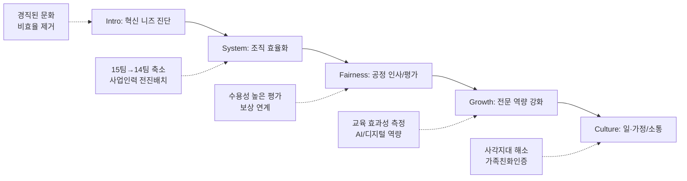

---
{"publish":true,"title":"1-8 조직 및 인적자원관리 지표 작성 방안","created":"2025-12-09","modified":"2025-12-09T14:56:11.000+09:00","tags":["경영평가","조직운영및관리","비계량","작성방안"],"cssclasses":""}
---


# [1-8 조직 및 인적자원관리] 세부평가내용 작성 방안

> [!abstract] 문서 개요
> 본 문서는 '1-8 조직 및 인적자원관리' 지표의 2025년도 경영평가보고서 작성을 위한 논리적 흐름(Storyline)과 문단별 세부 작성 방안을 제안합니다.
> 
> **핵심 목표**: [[25년 경평/2_지표별 자료/1-8_조직_및_인적자원관리/3_전년도_지적사항_및_개선실적\|전년도 지적사항(C 등급)]]을 극복하고, **'조직 효율화(Restructuring)'**와 **'데이터 기반의 인사 혁신'**을 통해 목표 등급(B등급 이상)을 달성하는 데 중점을 두었습니다.

---

## 1️⃣ Storyline 구성안 비교

### 📌 Option A: 세부평가요소 순차형

| 구분 | 내용 |
|------|------|
| **구조** | 편람 세부평가내용 순서대로 서술 |
| **장점** | 평가자 친화적, 누락 방지 |
| **단점** | 기관 고유 이슈 부각 어려움 |
| **적합도** | ⭐⭐ |

```
①운용계획(조직개편) → ②성과관리 → ③역량개발 → ④일·가정 양립 → ⑤임금피크제
```

### 📌 Option B: 문제해결형 (Issue-Solving)

| 구분 | 내용 |
|------|------|
| **구조** | 조직진단(비효율/경직) → 체질개선(개편) → 공정·전문성 강화 → 활력 제고 |
| **장점** | 전년도 지적사항(경직된 문화, 효과성 미흡) 정면 대응 |
| **단점** | 임금피크제 등 일부 요소의 연결고리 약할 수 있음 |
| **적합도** | ⭐⭐⭐ |

```
조직진단 → 구조개편(효율화) → 인사혁신(공정/전문) → 조직문화(소통/WLB)
```

### 📌 Option C: 가치 중심형 (Value-Based)

| 구분 | 내용 |
|------|------|
| **구조** | 효율성(조직) + 공정성(인사) + 전문성(역량) + 포용성(WLB) |
| **장점** | 핵심 가치별로 성과를 그룹핑하여 전달력 높음 |
| **단점** | 논리적 흐름보다는 병렬적 나열에 가까움 |
| **적합도** | ⭐⭐ |

```
Efficient(조직) + Fair(평가) + Expert(교육) + Happy(문화)
```

---

## 2️⃣ 추천 Storyline: 문제해결 기반의 체계적 혁신

> [!tip] 추천 구조
> **전년도 지적사항(효과성 측정, 사각지대)**을 해결하는 **"데이터 기반의 조직·인사 혁신"** 서사

### 전체 흐름



### 핵심 메시지

> **"조직 군살 빼기(Restructuring)로 효율성을 높이고, 데이터 기반의 인사관리로 공정성과 전문성을 확보"**

---

## 3️⃣ 문단별 작성 방안

### 세부평가내용① 조직 및 인적자원 운용계획

#### 문단 1-1: 전략 연계 조직개편 및 효율화 (핵심 성과)

| 항목 | 내용 |
|------|------|
| **Core Message** | 유사·중복 기능 통폐합(15팀→14팀)으로 보직자 줄이고 실무인력 확충 |
| **주요 근거** | 직제개편, 인력 재배치 실적 |
| **담당 부서** | 기획전략팀, 인사총무팀 |

| 증빙 요소 | 내용 |
|----------|------|
| 조직개편 | 15팀 → 14팀 축소 (유사기능 통폐합) |
| 인력효율 | 경영관리 인력 감축 → 사업부서 전진 배치 |
| 효과성 | 조직개편 전후 인당 업무량 및 생산성 분석 결과 (지적사항 대응) |

#### 문단 1-2: 적정 인력 배분 및 관리

| 항목 | 내용 |
|------|------|
| **Core Message** | 직무분석 기반의 합리적 정원 관리 및 탄력적 인력 운용 |
| **주요 근거** | 직무분석 결과, 정·현원차 관리 |
| **담당 부서** | 인사총무팀 |

| 증빙 요소 | 내용 |
|----------|------|
| 직무분석 | NCS 기반 직무량 분석 및 정원 산정 근거 |
| 탄력운용 | 신규사업(AI 등) 대응을 위한 TF 및 유동 정원제 |
| 법적준수 | 법정 의무고용 및 비정규직 관리 준수 |

---

### 세부평가내용② 성과관리 시스템

#### 문단 2-1: 공정하고 수용성 높은 평가체계

| 항목 | 내용 |
|------|------|
| **Core Message** | 평가 결과 공개 확대 및 이의신청 절차 내실화로 수용성 제고 |
| **주요 근거** | 평가운영 지침 개정, 이의신청 처리 |
| **담당 부서** | 인사총무팀 |

| 증빙 요소 | 내용 |
|----------|------|
| 제도개선 | 다면평가, 외부위원 참여 등 공정성 확보 장치 |
| 피드백 | 평가 결과 상시 피드백 및 이의신청 절차 활성화 |
| 지적개선 | 평가단 구성의 객관성 강화 (전년도 지적 반영) |

#### 문단 2-2: 성과 중심의 보상과 동기부여

| 항목 | 내용 |
|------|------|
| **Core Message** | 평가 결과와 승진·보상의 연계 강화로 성과주의 문화 확산 |
| **주요 근거** | 성과연봉 차등폭, 승진 심사 반영 비율 |
| **담당 부서** | 인사총무팀 |

| 증빙 요소 | 내용 |
|----------|------|
| 보상연계 | 성과급 등급별 차등 지급 실적 (최고-최저 격차) |
| 인사연계 | 승진 심사 시 성과평가 반영 비중 및 실적 |
| 저성과자 | 역량향상 프로그램(PIP) 운영 및 관리 실적 |

---

### 세부평가내용③ 역량개발

#### 문단 3-1: 실질적 효과 중심의 교육훈련 (지적사항 해소)

| 항목 | 내용 |
|------|------|
| **Core Message** | 단순 만족도를 넘어 현업 적용도(Level 3) 측정 등 교육 효과성 검증 |
| **주요 근거** | 교육훈련 체계도, 효과성 분석 보고서 |
| **담당 부서** | 인사총무팀 |

| 증빙 요소 | 내용 |
|----------|------|
| 효과성측정 | 현업적용도 평가 실시 및 상관관계 분석 (지적사항 핵심 대응) |
| 맞춤형교육 | 직급별·직무별 필수 역량 교육 이수율 |
| 전문성강화 | 영화산업 트렌드(AI, OTT) 대응 전문 교육 신설 |

#### 문단 3-2: 경력개발(CDP) 및 전문성 강화

| 항목 | 내용 |
|------|------|
| **Core Message** | 순환보직과 전문보직의 조화로 영화행정 전문가 육성 |
| **주요 근거** | CDP 운영 실적, 전문직위 운영 |
| **담당 부서** | 인사총무팀 |

| 증빙 요소 | 내용 |
|----------|------|
| 경력개발 | CDP 기반 보직 이동 실적 |
| 전문직위 | 개방형 직위 및 사내 전문직위 운영 성과 |
| 외부교류 | 타 기관 인사교류 및 파견 실적 |

---

### 세부평가내용④ 일·가정 양립 및 조직문화

#### 문단 4-1: 사각지대 없는 일·가정 양립 지원 (지적사항 해소)

| 항목 | 내용 |
|------|------|
| **Core Message** | 제도 이용의 사각지대 모니터링 및 남성 육아휴직 활성화 |
| **주요 근거** | 모니터링 결과, 남성 휴직 실적 |
| **담당 부서** | 인사총무팀 |

| 증빙 요소 | 내용 |
|----------|------|
| 사각지대 | 제도 미이용자 대상 설문/인터뷰 및 개선조치 (지적사항 대응) |
| 남성육아 | 남성 육아휴직 이용률 및 장려 캠페인 |
| 인증획득 | 가족친화인증 재인증 및 우수기관 선정 노력 |

#### 문단 4-2: 유연근무 및 소통하는 조직문화

| 항목 | 내용 |
|------|------|
| **Core Message** | 유연근무 활성화 및 세대 공감 소통 프로그램 운영 |
| **주요 근거** | 유연근무 활용률, 노사협의회 |
| **담당 부서** | 인사총무팀 |

| 증빙 요소 | 내용 |
|----------|------|
| 유연근무 | 시차출퇴근, 재택근무 활용 실적 (전년 대비 증가) |
| 소통문화 | 주니어보드, 리버스 멘토링 등 세대 융합 프로그램 |
| 노사협력 | 분기별 노사협의회 운영 및 안건 합의 실적 |

---

### 세부평가내용⑤ 임금피크제 운영

#### 문단 5-1: 임금피크제 운영 내실화

| 항목 | 내용 |
|------|------|
| **Core Message** | 임금피크 대상자의 전문성을 활용한 직무 개발 및 적합 배치 |
| **주요 근거** | 대상자 직무기술서, 멘토링 실적 |
| **담당 부서** | 인사총무팀 |

| 증빙 요소 | 내용 |
|----------|------|
| 직무개발 | 시니어 전문성을 활용한 자문/멘토링/심사 직무 배치 |
| 신규채용 | 임금피크제 별도 정원을 활용한 신규 채용 기여도 |
| 제도설계 | 노사 합의에 기반한 합리적 임금 감액률 적용 |

---

## 4️⃣ 차별화 포인트

### 가. 전년도 C등급(지적사항) 개선 전략

| 지적사항 | 개선 방안 | 핵심 성과 |
|---------|----------|----------|
| 교육 효과성 측정 미흡 | 현업적용도(Level 3) 측정 도입 | 교육-성과 상관관계 분석 |
| 일·가정 양립 사각지대 | 미이용자 심층 모니터링 | 사각지대 해소방안 마련 |
| 조직개편 효과 측정 부재 | 개편 전후 생산성/만족도 비교 | 정량적 개편 효과 제시 |
| 경직된 조직문화 | 리버스 멘토링, 소통채널 확대 | 소통 만족도 상승 |

### 나. 기관 특수성 강조

| 영역 | 일반 공공기관 | 영진위 차별화 |
|------|-------------|--------------|
| 조직운영 | 행정 효율화 중심 | **영화지원 사업부서 전진 배치** (현장 중심) |
| 역량개발 | 일반 직무교육 | **영화산업(AI/OTT) 특화 전문교육** 강화 |
| 근무형태 | 유연근무 일반 | **영화제/현장 지원** 등 특수성 고려한 근무제 |

---

## 5️⃣ 작성 시 유의사항

### 가. 편람 세부평가요소 매칭

> [!warning] 필수 확인
> 5개 평가요소의 균형 있는 서술 필요

| 세부평가요소 | 배분 비중 | 주요 부서 |
|-------------|----------|----------|
| ① 조직·인력 운용계획 | 25% | 기획전략, 인사총무 |
| ② 성과관리 시스템 | 20% | 인사총무 |
| ③ 역량개발 | 20% | 인사총무 |
| ④ 일·가정 양립 | 25% | 인사총무 |
| ⑤ 임금피크제 | 10% | 인사총무 |

### 나. 정량 데이터 활용

> [!success] 핵심 정량지표
> - 조직효율화: **1개팀 축소**, 사업인력 **00명 증원**
> - 교육훈련: 1인당 **00시간**, 현업적용도 **0.0점**
> - 유연근무: 활용률 **00%** (전년 대비 +%)
> - 육아휴직: 남성 이용자 **0명**, 복귀율 **100%**

### 다. 증빙자료 연계

| 문단 | 핵심 증빙 |
|------|----------|
| 조직개편 | 직제규정 개정안, 인력재배치 현황표 |
| 성과평가 | 성과평가 운영지침, 이의신청 처리대장 |
| 교육훈련 | 교육결과보고서(효과성 분석 포함) |
| 일가정 | 가족친화인증서, 유연근무 사용내역 |

---

## 🔗 관련 자료

| 구분 | 문서명 | 비고 |
|------|--------|------|
| 편람 분석 | [[25년 경평/2_지표별 자료/1-8_조직_및_인적자원관리/2_편람_내용_분석]] | 세부평가 요소별 가이드 |
| 지적사항 | [[25년 경평/2_지표별 자료/1-8_조직_및_인적자원관리/3_전년도_지적사항_및_개선실적]] | C등급 원인 및 개선방향 |
| 부서 매핑 | [[25년 경평/2_지표별 자료/1-8_조직_및_인적자원관리/6_부서별_실적_통합_매핑표]] | 부서별 실적 종합 |
| 공통 자료 | [[01_편람_및_지침]] | 작성 가이드 |

---

*작성일: 2025-12-09*
*검증상태: 부서성과평가 원본 대조 완료*