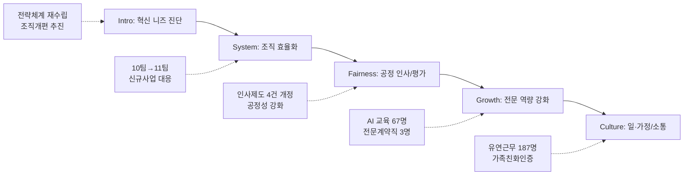

---
{"publish":true,"permalink":"/경영평가/1-8/5_지표작성방안","title":"5_지표 작성 방안","created":"2025-12-14","modified":"2025-12-18T09:35:47.374+09:00","tags":["#경영평가","#조직운영및관리","#비계량","#작성방안","#지표_1-8"],"cssclasses":""}
---


# [1-8 조직 및 인적자원관리] 세부평가내용 작성 방안

> [!abstract] 문서 개요
> 본 문서는 '1-8 조직 및 인적자원관리' 지표의 2025년도 경영평가보고서 작성을 위한 논리적 흐름(Storyline)과 문단별 세부 작성 방안을 제안합니다.
> 
> **핵심 목표**: [[25년 경평/2_지표별 자료/1-8_조직_및_인적자원관리/3_전년도_지적사항_및_개선실적\|전년도 지적사항(D+ 등급)]]을 극복하고, **'전략 연계 조직개편'**과 **'데이터 기반의 인사 혁신'**을 통해 목표 등급(B등급 이상)을 달성하는 데 중점을 두었습니다.

---

## 1. Storyline 구성안 비교

### 📌 Option A: 세부평가요소 순차형

| 구분 | 내용 |
|------|------|
| **구조** | 편람 세부평가내용 순서대로 서술 |
| **장점** | 평가자 친화적, 누락 방지 |
| **단점** | 기관 고유 이슈 부각 어려움 |
| **적합도** | ⭐⭐ |

```
①운용계획(조직개편) → ②성과관리 → ③역량개발 → ④일·가정 양립 → ⑤임금피크제
```

### 📌 Option B: 문제해결형 (Issue-Solving)

| 구분 | 내용 |
|------|------|
| **구조** | 조직진단(비효율/경직) → 체질개선(개편) → 공정·전문성 강화 → 활력 제고 |
| **장점** | 전년도 지적사항(경직된 문화, 효과성 미흡) 정면 대응 |
| **단점** | 임금피크제 등 일부 요소의 연결고리 약할 수 있음 |
| **적합도** | ⭐⭐⭐ |

```
조직진단 → 구조개편(효율화) → 인사혁신(공정/전문) → 조직문화(소통/WLB)
```

### 📌 Option C: 가치 중심형 (Value-Based)

| 구분 | 내용 |
|------|------|
| **구조** | 효율성(조직) + 공정성(인사) + 전문성(역량) + 포용성(WLB) |
| **장점** | 핵심 가치별로 성과를 그룹핑하여 전달력 높음 |
| **단점** | 논리적 흐름보다는 병렬적 나열에 가까움 |
| **적합도** | ⭐⭐ |

```
Efficient(조직) + Fair(평가) + Expert(교육) + Happy(문화)
```

---

## 2. 추천 Storyline (문제해결 기반의 체계적 혁신)

> [!tip] 추천 구조
> **전년도 지적사항(효과성 측정, 사각지대)**을 해결하는 **"데이터 기반의 조직·인사 혁신"** 서사
> **"중장기 전략 연계 조직개편으로 효율성을 높이고, 데이터 기반의 인사관리로 공정성과 전문성을 확보"**

### 전체 흐름



### 핵심 메시지

> **"2025~2029 중장기 전략 연계 조직개편으로 실행력을 강화하고, 인사제도 정비(4건)와 역량교육(AI 67명)으로 전문성과 공정성을 확보, 일·가정 양립(유연근무 187명)으로 조직 활력 제고"**

---

## 3. 문단별 작성 방안

### 세부평가내용① 조직 및 인적자원 운용계획

#### 문단 1-1: 전략 연계 조직개편 및 효율화

| 항목 | 내용 |
|------|------|
| **Core Message** | 2025~2029 중장기 경영전략 연계 조직개편으로 신규사업 대응력 강화 |
| **주요 근거** | 직제개편, 전략체계 재수립, 신규사업 대응 조직 신설 |
| **담당 부서** | 기획전략팀, 인사총무팀 |

| 구분 | 실적 | 성과 |
|------|------|------|
| 중장기 전략 수립 | 2025~2029 전략체계 재수립 (9월 확정) | 4대 전략방향, 12대 전략과제, 27개 실행과제 |
| 분석방법론 혁신 | STEEP+시나리오 플래닝, PBMC 분석 **신규 도입** | 전략 수립 전문성 제고 |
| 조직 개편 | 10팀 → **11팀** (1개팀 신설) | 신규사업 대응 조직 구축 |
| 전략 공유 | 위원장 주재 전 직원 공유회 (9.29) | 전사 공감대 형성 |
| 내부 TF | 총 **5회** 개최, 전 본부 의견 수렴 | 상향식(Bottom-up) 조직 설계 |

> [!example] 추천 스토리라인
> **"영화산업 환경 변화 진단 → 전략체계 재수립 → 조직개편(10팀→11팀) → 신규사업 대응력 강화"**
> 
> - 도입: OTT 성장, 플랫폼 경제 등 환경 변화 및 경영평가 지적사항(D+) 반영 필요
> - 전개: STEEP+시나리오 플래닝 도입, 내부 TF 5회+전 직원 공유회 1회 통한 상향식 설계
> - 성과: 2025~2029 전략체계 확정, 10팀→11팀 개편, 신규사업 대응 조직 구축

#### 문단 1-2: 적정 인력 배분 및 관리

| 항목 | 내용 |
|------|------|
| **Core Message** | 인건비 확보 기준 인력운영원칙 수립으로 적정 인력 운용 |
| **주요 근거** | 인력운영원칙 개선, 승급 실적, 휴직자 관리 |
| **담당 부서** | 인사총무팀 |

| 구분 | 실적 | 성과 |
|------|------|------|
| 인력운영원칙 개선 | 정·현원차 관리 → **인건비 확보 기준**으로 변경 | 3분기 노사협의회 의결 |
| 승급 실적 | 1급 2명, 2급 3명, 3급 4명 = **총 9명** | 정·현원 누적차 해소 |
| 신규채용 | 정규직 5명 + 비정규직 16명 = **총 21명** | 연간 채용계획 100% 달성 |
| 휴직자 관리 | 반기별 복무점검, 분기별 수요조사 | 대체인력 **6명** 적시 충원 |
| 2026년 대비 | 조기채용 협의완료 (1분기 내 예정) | 사업예산 증액 대응 |

> [!example] 추천 스토리라인
> **"인력운영원칙 개선 → 인사요소 선제 파악 → 승급 9명·신규채용 21명 → 적정 인력 확보"**
> 
> - 도입: 사업예산 대폭 증액에 따른 인력수급 필요
> - 전개: 인건비 확보 기준 원칙 수립, 휴직자 관리체계 구축
> - 성과: 승급 9명, 신규채용 21명, 2026년 조기채용 협의 완료

---

### 세부평가내용② 성과관리 시스템

#### 문단 2-1: 공정하고 수용성 높은 평가체계

| 항목 | 내용 |
|------|------|
| **Core Message** | 인사평가 운영지침 2회 개정으로 평가 공정성 및 대상 확대 |
| **주요 근거** | 인사평가 운영지침 개정, 무기계약직 포함, 평가 절차 정비 |
| **담당 부서** | 인사총무팀 |

| 구분 | 실적 | 성과 |
|------|------|------|
| 인사평가 운영지침 | **2회 개정** (2월, 11월) | 노사 협의 기반 개선 |
| 평가대상 확대 | 무기계약근로자(일반직) **포함** | 평가 형평성 제고 |
| 신규채용자 포함 | 연도 중 채용자 평가대상 **포함** | 사각지대 해소 |
| 평가절차 정비 | 평가자 공석 시 비중 **배분** 규정 신설 | 평가 연속성 확보 |
| 블라인드 채용 | **100%** 준수 | 고용노동부 모니터링 지적 **0건** |

> [!example] 추천 스토리라인
> **"평가 공정성 강화 필요 → 인사평가 지침 2회 개정 → 무기계약직 포함 → 평가 사각지대 해소"**
> 
> - 도입: 공정하고 수용성 높은 평가체계 필요
> - 전개: 인사평가 운영지침 2회 개정, 무기계약직·신규채용자 평가대상 포함
> - 성과: 블라인드 채용 100%, 고용노동부 모니터링 지적 0건

#### 문단 2-2: 성과 중심의 보상과 동기부여

| 항목 | 내용 |
|------|------|
| **Core Message** | 승급제도·무기계약직 관리규정 개정으로 성과-보상 연계 강화 |
| **주요 근거** | 승급제도 운영지침 개정, 무기계약직 승단, 신입 직무능력 평가 |
| **담당 부서** | 인사총무팀 |

| 구분 | 실적 | 성과 |
|------|------|------|
| 승급제도 운영지침 | 승급최소포인트 **50pt 하향** (4급→3급, 5급→4급) | 승진 기회 확대 |
| 가산포인트 합리화 | 석사 30→**15pt**, 어학 10→**5pt**, 외부활동 20→**10pt** | 직무능력 중심 전환 |
| 무기계약직 승단 | **6명** 승단 발령 ('25.3월) | 처우 개선 |
| 신입 직무능력 평가 | 역량평가 기반 인사위원회 심의 → **5인 정식임용** | 직무중심 인사 |
| 인사제도 개정 | **4건** (인사평가 2, 승급 1, 무기계약직 1) | 체계적 제도 정비 |

> [!example] 추천 스토리라인
> **"성과주의 문화 확산 필요 → 인사제도 4건 개정 → 무기계약직 6명 승단 → 공정한 보상체계"**
> 
> - 도입: 평가 결과와 보상의 연계 강화 필요
> - 전개: 승급제도·무기계약직 관리규정 개정, 가산포인트 합리화
> - 성과: 무기계약직 6명 승단, 신입 5명 정식임용, 인사제도 4건 개정

---

### 세부평가내용③ 역량개발

#### 문단 3-1: AI·디지털 역량 중심의 교육훈련

| 항목 | 내용 |
|------|------|
| **Core Message** | AI 기초교육 67명 등 미래 역량 강화로 영화정책 전문인 양성 |
| **주요 근거** | AI 기초교육, 리더십 교육, 교육훈련 만족도 |
| **담당 부서** | 인사총무팀 |

| 구분 | 실적 | 성과 |
|------|------|------|
| HRD 목표 | K-무비 성장과 확장을 함께하는 **영화정책 전문인** 양성 | 인재상·HRD 전략 체계화 |
| AI 기초교육 | **67명** 참여 (4.10) | AI 기본개념 및 영화산업 연계 활용 |
| 리더십 교육 | **10명** 참여 (5.22) | 보직자 소통·성과관리 역량 강화 |
| CS 역량 교육 | **77명** 참여 (11.12) | 민원응대 품질 개선 |
| 교육훈련 만족도 | **6.4점/7점** (전년 6.2점) | **+0.2점** 상승 |
| 다양한 프로그램 | 독서 672건, 자기주도 93명, 직무연계 183명 | 체계적 역량개발 |

> [!example] 추천 스토리라인
> **"미래 역량 강화 필요 → AI 기초교육 67명 → 리더십·CS 교육 → 교육만족도 6.4점 달성"**
> 
> - 도입: 영화산업 AI 전환 대응 및 전문성 강화 필요
> - 전개: AI 기초교육 67명, 리더십 10명, CS 77명 등 체계적 교육
> - 성과: 교육훈련 만족도 6.4점/7점(+0.2점), 다양한 프로그램 운영

#### 문단 3-2: 경력개발(CDP) 및 전문성 강화

| 항목 | 내용 |
|------|------|
| **Core Message** | 전문계약직 3명 채용으로 외부 전문성 확보 및 역량 강화 |
| **주요 근거** | 전문계약직 채용, 인사시스템 개편, 데이터 기반 인사 |
| **담당 부서** | 인사총무팀 |

| 구분 | 실적 | 성과 |
|------|------|------|
| 전문계약직 채용 | **3명** (센터장, 원장, 변호사) | 외부 전문성 확보 |
| 공정환경조성센터장 | '25.8월 채용 | 이해관계 조정능력 확보 |
| 한국영화아카데미 원장 | '25.8월 채용 | 인재양성 비전 제시 |
| 사내 변호사 | '25.10월 채용 | 법무/소송 체계적 대응 |
| 인사시스템 개편 | 클라우드형 **<오이사공>** 도입 | 데이터 기반 인사관리 |
| 데이터 이관 | **860여건** 개인별 인사데이터 이관 | 인사이력 체계화 |

> [!example] 추천 스토리라인
> **"전문성 확보 필요 → 전문계약직 3명 채용 → 인사시스템 개편 → 데이터 기반 인사관리"**
> 
> - 도입: 영화산업 전문성 및 법률·정책 역량 강화 필요
> - 전개: 센터장·원장·변호사 등 전문계약직 3명 채용, 인사시스템 개편
> - 성과: 외부 전문성 확보, 860여건 인사데이터 체계화

---

### 세부평가내용④ 일·가정 양립 및 조직문화

#### 문단 4-1: 유연근무 활성화 및 일·가정 양립

| 항목 | 내용 |
|------|------|
| **Core Message** | 유연근무 187명 활용, 가족친화인증 재인증으로 일·가정 양립 실현 |
| **주요 근거** | 유연근무 활용 실적, 육아휴직, 가족친화인증 |
| **담당 부서** | 인사총무팀 |

| 구분 | 실적 | 성과 |
|------|------|------|
| 유연근무 활용 | 월별 101명 + 일별 69명 + 스마트워크 17명 = **187명** | 전 직원 활용 가능 |
| 시간대 확대 | 월·금 **4개 시간대** 모두 가능으로 확대 | 선택권 확대 |
| 육아휴직 | **10명** (여 8명, **남 2명**) | 남성 육아휴직 확대 |
| 육아시간 | **6명** 이용 | 만 8세 이하 자녀 지원 |
| 가족돌봄휴가 | **25명** 활용 | 돌봄 지원 강화 |
| 가족친화인증 | **재인증 신청** (2014년 최초, 11년 연속) | 현장조사 완료, 12월 결과 발표 |

> [!example] 추천 스토리라인
> **"일·가정 양립 지원 강화 → 유연근무 시간대 확대 → 187명 활용 → 가족친화인증 재인증 신청"**
> 
> - 도입: MZ세대 유입 및 일·가정 양립 지원 확대 필요
> - 전개: 유연근무 시간대 4개로 확대, 육아휴직 10명(남성 2명), 육아시간 6명
> - 성과: 유연근무 187명 활용, 가족친화인증 재인증 신청(11년 연속)

#### 문단 4-2: 소통하는 조직문화

| 항목 | 내용 |
|------|------|
| **Core Message** | 내부고객 만족도 조사 및 노사협의회 운영으로 소통 문화 강화 |
| **주요 근거** | 내부만족도 조사, 노사협의회, 일·생활균형 캠페인 |
| **담당 부서** | 기획전략팀, 인사총무팀 |

| 구분 | 실적 | 성과 |
|------|------|------|
| 내부만족도 조사 | **1회** 실시 (12월) | 조직문화 진단 기초자료 |
| 노사협의회 | 정기 노사협의회 운영 | 인력운영원칙 의결 |
| 일·생활균형 캠페인 | 고용노동부 주관 **2024년 승인** | 2019년 최초 참여 |
| 전략 공유회 | 위원장 주재 **전 직원 공유회** | 전사 공감대 형성 |

> [!example] 추천 스토리라인
> **"소통 문화 강화 필요 → 내부만족도 조사 → 노사협의회 운영 → 조직문화 개선"**

---

### 세부평가내용⑤ 임금피크제 운영

#### 문단 5-1: 임금피크제 운영 내실화

| 항목 | 내용 |
|------|------|
| **Core Message** | 임금피크제 연계 정규직 5명 신규채용으로 세대 간 균형 실현 |
| **주요 근거** | 임금피크제 연계 채용, 인건비 활용, 조기채용 협의 |
| **담당 부서** | 인사총무팀 |

| 구분 | 실적 | 성과 |
|------|------|------|
| 임금피크제 연계 | 전환자 발생 → 정규직 **5명** 신규채용 | 청년 일자리 창출 |
| 인건비 활용 | 인건비 최대 확보 기준 원칙 수립 | 노사협의회 의결 |
| 2026년 조기채용 | **협의 완료** (1분기 내 예정) | 사업예산 증액 대응 |
| 비정규직 전환대상 | **7년 연속 Zero** 유지 | 적정 인력 운영 |

> [!example] 추천 스토리라인
> **"임금피크제 전환 → 정규직 5명 신규채용 → 2026년 조기채용 협의 → 세대 간 균형"**
> 
> - 도입: 임금피크제 전환에 따른 채용여력 발생
> - 전개: 정규직 5명 신규채용, 인건비 최대 확보 기준 원칙 수립
> - 성과: 청년 일자리 창출, 2026년 조기채용 협의 완료

---

## 4. 문단 구성 요약

| 문단 | 핵심 주제 | 담당 부서 | 핵심 성과 |
|------|----------|----------|----------|
| **1-1** | 전략 연계 조직개편 및 효율화 | 기획전략팀 | 10팀→11팀, 전략체계 재수립 |
| **1-2** | 적정 인력 배분 및 관리 | 인사총무팀 | 승급 9명, 신규채용 21명 |
| **2-1** | 공정하고 수용성 높은 평가체계 | 인사총무팀 | 인사평가 지침 2회 개정 |
| **2-2** | 성과 중심의 보상과 동기부여 | 인사총무팀 | 무기계약직 6명 승단 |
| **3-1** | AI·디지털 역량 중심의 교육훈련 | 인사총무팀 | AI 교육 67명, 만족도 6.4점 |
| **3-2** | 경력개발(CDP) 및 전문성 강화 | 인사총무팀 | 전문계약직 3명 채용 |
| **4-1** | 유연근무 활성화 및 일·가정 양립 | 인사총무팀 | 유연근무 187명, 가족친화인증 |
| **4-2** | 소통하는 조직문화 | 기획전략팀/인사총무팀 | 내부만족도 조사, 전략공유회 |
| **5-1** | 임금피크제 운영 내실화 | 인사총무팀 | 정규직 5명 신규채용 |

---

## 5. 🏆 최고 성과(BP) 사례

> [!tip] Best Practice 선정 기준
> 전략 연계 조직개편, 데이터 기반 인사혁신, 일·가정 양립 등 **'조직 효율화 & 인사 공정성'** 성과를 선정

### BP 1: 2025~2029 중장기 전략 연계 조직개편 (10팀→11팀)

| 항목 | 내용 |
|------|------|
| **성과 개요** | 중장기 경영전략 연계 조직개편 **10팀→11팀**, 신규사업 대응 조직 구축 |
| **추진 과정** | ① 전략체계 재수립 → ② 내부 TF 5회 운영 → ③ 전직원 공유회 개최 |
| **핵심 성과** | 4대 전략방향-12대 전략과제-**27개 실행과제** 체계화 |
| **차별화 요소** | STEEP+시나리오 플래닝, PBMC 분석 **신규 도입** |
| **정량 지표** | 내부 TF **5회**, 전직원 공유회 **1회** (9.29 위원장 주재) |

> [!success] BP 포인트
> - **전략 연계**: 중장기 전략과 조직개편 직접 연계
> - **상향식 설계**: TF 5회+전직원 공유회로 전사 공감대 형성
> - **신규 조직**: 신규사업 대응 1개팀 신설

---

### BP 2: 인사제도 4건 개정 및 전문계약직 3명 채용

| 항목 | 내용 |
|------|------|
| **성과 개요** | 인사제도 **4건 개정**, 전문계약직 **3명** 채용으로 공정성·전문성 강화 |
| **추진 과정** | ① 인사평가 지침 개정 → ② 승급제도 개정 → ③ 전문계약직 채용 |
| **핵심 성과** | 무기계약직 **6명 승단**, 신입 **5명 정식임용** |
| **차별화 요소** | 무기계약직 인사평가 대상 포함, 가산포인트 직무능력 중심 전환 |
| **정량 지표** | 인사평가 2회 + 승급 1회 + 무기계약직 1회 = **4건 개정** |

> [!success] BP 포인트
> - **체계적 정비**: 인사제도 4건 일괄 개정
> - **공정성 확대**: 무기계약직·신규채용자 평가대상 포함
> - **전문성 확보**: 센터장·원장·변호사 등 외부 전문가 3명 영입

---

### BP 3: AI 교육 67명 및 클라우드 인사시스템 도입

| 항목 | 내용 |
|------|------|
| **성과 개요** | AI 기초교육 **67명** 참여, 클라우드형 인사시스템 **<오이사공>** 도입 |
| **추진 과정** | ① HRD 전략 수립 → ② AI·리더십 교육 → ③ 인사시스템 개편 |
| **핵심 성과** | 교육훈련 만족도 **6.4점/7점** (+0.2점 상승), 인사데이터 **860여건** 이관 |
| **차별화 요소** | 영화정책 전문인 양성 목표, 데이터 기반 인사관리 체계 구축 |
| **정량 지표** | 리더십 교육 **10명**, CS 역량 교육 **77명**, 독서 **672건** |

> [!success] BP 포인트
> - **미래 역량**: AI 기초교육 67명, 영화산업 AI 대응 역량 강화
> - **만족도 상승**: 교육훈련 만족도 6.4점(전년 대비 +0.2점)
> - **시스템 혁신**: 클라우드형 인사시스템 도입, 860여건 데이터 체계화

---

## 6. 차별화 포인트

### 편람 대응 전략

| 평가요소 | 편람 요구사항 | 대응 전략 |
|---------|-------------|----------|
| ① 조직운용계획 | 중장기 전략 연계 | 2025~2029 전략체계 재수립, 10팀→11팀 개편 |
| ① 조직운용계획 | 인력 배분 및 관리 | 인건비 확보 기준 원칙, 승급 9명, 채용 21명 |
| ② 성과관리 | 공정한 평가 시스템 | 인사평가 지침 2회 개정, 무기계약직 포함 |
| ② 성과관리 | 성과-보상 연계 | 승급제도 개정, 무기계약직 6명 승단 |
| ③ 역량개발 | 교육훈련 효과성 | AI 교육 67명, 만족도 6.4점(+0.2점) |
| ③ 역량개발 | 전문성 강화 | 전문계약직 3명, 인사시스템 개편 |
| ④ 일·가정양립 | 유연근무 활성화 | 187명 활용, 시간대 4개 확대 |
| ④ 일·가정양립 | 가족친화인증 | 재인증 신청(11년 연속) |
| ⑤ 임금피크제 | 신규채용 목표 | 정규직 5명 채용, 조기채용 협의 |

### 전년도 C등급 개선 전략

| 지적사항 | 개선 내용 | 핵심 성과 |
|---------|----------|----------|
| 교육 효과성 측정 미흡 | 다양한 교육프로그램 + 만족도 조사 | 만족도 6.4점(+0.2점 상승) |
| 일·가정 양립 사각지대 | 유연근무 시간대 확대, 육아시간 제도 운영 | 187명 활용, 육아시간 6명 |
| 조직개편 효과 측정 부재 | 전략 연계 조직개편, TF 5회 운영 | 상향식 설계, 전 직원 공유회 |
| 경직된 조직문화 | 내부만족도 조사, 전략공유회 | 소통 채널 확대 |

### 기관 특수성 강조

| 영역 | 일반 공공기관 | 영진위 차별화 |
|------|-------------|--------------|
| 조직운영 | 행정 효율화 중심 | **영화산업 신규사업 대응** 조직 신설 |
| 역량개발 | 일반 직무교육 | **AI·영화산업 특화 전문교육** 강화 |
| 전문성 | 내부 인력 중심 | **전문계약직 3명** 외부 전문가 영입 |
| 인사시스템 | 기존 시스템 유지 | **클라우드형 인사시스템** 신규 도입 |

---

## 7. 📊 핵심 정량 데이터 Quick Reference


### 📊 조직운영 (기획전략팀)

| 지표 | 수치 | 비고 |
|------|------|------|
| 중장기 전략 수립 | **1건** (2025~2029) | 9월 확정 |
| 조직 개편 | **10팀→11팀** | 1개팀 신설 |
| 내부 TF | **5회** | 전 본부 의견 수렴 |
| 전략 공유회 | **1회** | 위원장 주재 |

### 📊 인력운영 (인사총무팀)

| 지표 | 수치 | 비고 |
|------|------|------|
| 승급 인원 | **9명** | 1급 2, 2급 3, 3급 4 |
| 신규채용 | **21명** | 정규직 5 + 비정규직 16 |
| 무기계약직 승단 | **6명** | '25.3월 발령 |
| 비정규직 전환대상 | **7년 연속 Zero** | 적정 인력 운영 |

### 📊 인사제도 (인사총무팀)

| 지표 | 수치 | 비고 |
|------|------|------|
| 인사평가 운영지침 개정 | **2회** | 2월, 11월 |
| 승급제도 운영지침 개정 | **1회** | 포인트 합리화 |
| 무기계약직 관리규정 개정 | **1회** | 승단 근거 마련 |
| 인사제도 개정 합계 | **4건** | 체계적 제도 정비 |

### 📊 역량개발 (인사총무팀)

| 지표 | 수치 | 비고 |
|------|------|------|
| AI 기초교육 | **67명** | 4.10 실시 |
| 리더십 교육 | **10명** | 5.22 실시 |
| CS 역량 교육 | **77명** | 11.12 실시 |
| 교육훈련 만족도 | **6.4점/7점** | 전년 대비 +0.2점 |
| 전문계약직 채용 | **3명** | 센터장, 원장, 변호사 |

### 📊 일·가정양립 (인사총무팀)

| 지표 | 수치 | 비고 |
|------|------|------|
| 유연근무 활용 | **187명** | 월별 101 + 일별 69 + 스마트워크 17 |
| 시간대 | **4개** | 월·금 전 시간대 확대 |
| 육아휴직 | **10명** | 여 8 + **남 2** |
| 육아시간 | **6명** | 만 8세 이하 자녀 |
| 가족돌봄휴가 | **25명** | 돌봄 지원 |
| 가족친화인증 | **11년 연속** | 재인증 신청 |

### 📊 인사시스템 (인사총무팀)

| 지표 | 수치 | 비고 |
|------|------|------|
| 인사시스템 도입 | **<오이사공>** | 클라우드형 |
| 데이터 이관 | **860여건** | 개인별 인사데이터 |
| 연간 비용 | **536만원** | 초기설정료 포함 |

---

## 8. 작성 시 유의사항

### ✅ 강조할 점

1. **전략 연계 조직개편**: 2025~2029 중장기 전략 재수립, 10팀→11팀 신규사업 대응 조직
2. **인사제도 체계적 정비**: 4건 개정(인사평가 2, 승급 1, 무기계약직 1)
3. **AI·디지털 역량 강화**: AI 기초교육 67명, 교육만족도 6.4점(+0.2점)
4. **전문성 확보**: 전문계약직 3명(센터장, 원장, 변호사) 외부 전문가 영입
5. **일·가정 양립**: 유연근무 187명, 가족친화인증 11년 연속

### ⚠️ 주의할 점

1. 조직개편(10팀→11팀)이 효율화가 아닌 '증설'이므로 신규사업 대응 필요성 강조
2. 교육훈련 효과성 측정(현업적용도 Level 3)은 구체적 실적 보강 필요
3. 전년도 지적사항(사각지대, 효과성) 대응 내용 명확히 서술

### 📝 편람 키워드 체크리스트

- [x] 중장기 경영전략 연계 조직운용
- [x] 핵심업무별 역할과 책임 설정
- [x] 적절한 인력 배분과 관리
- [x] 합리적 성과평가 시스템
- [x] 직무중심 평가
- [x] 성과평가 결과 활용
- [x] 구성원 역량개발
- [x] 교육훈련 계획 및 실적
- [x] 전문직위제 운영
- [x] 육아휴직 활성화
- [x] 가족친화인증
- [x] 유연근무제
- [x] 임금피크제 신규채용 연계

---

## 관련 자료

| 구분 | 문서명 | 링크 |
|------|--------|------|
| 편람 분석 | 편람 내용 분석 | [바로가기](/경영평가/1-8/2_편람내용분석) |
| 지적사항 | 전년도 지적사항 및 개선실적 | [[25년 경평/2_지표별 자료/1-8_조직_및_인적자원관리/3_전년도_지적사항_및_개선실적]] |
| 부서 실적 | 인사총무팀 실적 분석 | [[25년 경평/2_지표별 자료/1-8_조직_및_인적자원관리/부서별 실적 분석/인사총무팀 실적 분석]] |
| 부서 실적 | 기획전략팀 실적 분석 | [[25년 경평/2_지표별 자료/1-8_조직_및_인적자원관리/부서별 실적 분석/기획전략팀 실적 분석]] |
| 부서 매핑 | 부서별 실적 통합 매핑표 | [[25년 경평/2_지표별 자료/1-8_조직_및_인적자원관리/6_부서별_실적_통합_매핑표]] |

---

*작성일: 2025-12-17*
*검증상태: 부서실적 대조 완료*

---
**수정이력**
- 2025-12-18: 5. 최고 성과(BP) 사례 섹션 추가 (3개 BP 선정)
