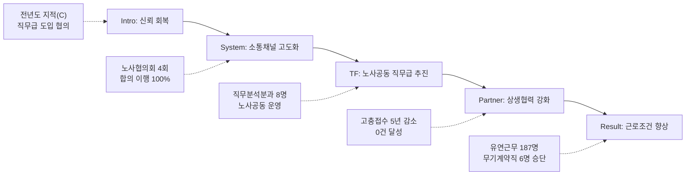

---
{"publish":true,"permalink":"/경영평가/1-9/5_지표작성방안","title":"5_지표 작성 방안","created":"2025-12-14","modified":"2025-12-14T13:11:12.938+09:00","tags":["#경영평가","#노사관계","#비계량","#작성방안","#지표_1-9"],"cssclasses":""}
---


# [1-9 노사관계] 세부평가내용 작성 방안

> [!abstract] 문서 개요
> 본 문서는 '1.9 노사관계' 지표의 2025년도 경영평가보고서 작성을 위한 논리적 흐름(Storyline)과 문단별 세부 작성 방안을 제안합니다.
> 
> **핵심 목표**: [[25년 경평/2_지표별 자료/1-9_노사관계/3_전년도_지적사항_및_개선실적\|전년도 지적사항(C 등급)]]을 극복하고, **'노사공동 TF를 통한 직무급 도입 추진'**과 **'협력적 노사관계 정착'**을 부각하여 목표 등급(B등급 이상)을 달성하는 데 중점을 두었습니다.

---

## 1. Storyline 구성안 비교

### Option A: 평가요소 순차형 (Sequential)

| 구분 | 내용 |
|------|------|
| **구조** | 협의체계 구축 → 노사 소통/역량 → 근로조건 향상 |
| **장점** | 편람의 3개 평가요소를 빠짐없이 순서대로 다루기에 용이 |
| **단점** | 단순 나열식으로 보여 전년도 C등급의 원인인 '갈등 해결' 노력이 묻힐 수 있음 |
| **적합도** | ★★ |

```
①협의체계(System) → ②소통/역량(Communication) → ③근로조건(Condition)
```

### Option B: 갈등 해결 중심형 (Conflict-Resolution)

| 구분 | 내용 |
|------|------|
| **구조** | 갈등 진단 → 대화와 타협 → 합의 도출 → 제도적 정착 |
| **장점** | 전년도 지적사항(갈등요인 해소 미흡)을 정면으로 돌파하는 서사 |
| **단점** | 갈등 해결 외의 일상적인 노사협력이나 근로조건 개선 성과가 약해 보일 수 있음 |
| **적합도** | ★★★ |

```
Conflict(쟁점) → Dialogue(대화) → Consensus(합의) → Settlement(정착)
```

### Option C: 상생 파트너십형 (Partnership)

| 구분 | 내용 |
|------|------|
| **구조** | 신뢰 구축(소통) → 현안 해결(갈등관리) → 공동 가치 창출(상생) |
| **장점** | 갈등 해결을 넘어 '영화산업 발전'이라는 공동 목표를 향한 파트너십 강조 |
| **단점** | 논리적 비약이 없도록 단계별 인과관계를 명확히 해야 함 |
| **적합도** | ★★★ |

```
Trust(신뢰) → Solution(해결) → Value(가치창출)
```

---

## 2. 추천 Storyline (갈등 해결 & 가치 창출)

> [!tip] 추천 구조
> **"전년도 노사 갈등을 대화와 타협으로 해결(Resolve)하고, 이를 바탕으로 직무급 도입 등 제도 혁신을 위한 상생 파트너십(Partnership)을 구축"**하는 구조
> **"노사협의회 4회 100% 개최와 직무분석분과 공동 운영으로 협력적 노사관계 정착"**

### 전체 흐름



### 핵심 메시지

> **"노사협의회 4회 100% 개최, 노사합의 이행률 100%, 노사공동 직무분석분과(8명) 운영으로 협력적 노사관계 정착 및 직무급 도입 기반 마련"**

---

## 3. 문단별 작성 방안

### 세부평가내용① 노사 협의체계 구축 및 운영

#### 문단 1-1: 노사협의회 정례화 및 합의사항 이행

| 항목 | 내용 |
|------|------|
| **Core Message** | 분기별 노사협의회 4회 100% 개최, 합의사항 100% 이행 |
| **주요 근거** | 노사협의회 운영 실적, 주요 안건 의결 |
| **담당 부서** | 인사총무팀 |

| 구분 | 실적 | 성과 |
|------|------|------|
| 노사협의회 구성 | 근로자위원 8명, 사용자위원 8명 | **16명** 구성 |
| 정기회의 개최 | **4회** (1~4분기) | **100%** 개최 |
| 1분기(3월) | 직무중심보수체계 TF 직제 구성(안) | **심의·의결** |
| 2분기(6월) | 직무급 도입 경과 및 하반기 방향성 | **방향성 합의** |
| 3분기(9월) | 보수체계 개편 TF 및 분과 구성 | **의결**, 인력운영원칙 수립 |
| 4분기(12월) | 직무분석분과 노사공동논의 | **진행중** (3회 예정) |
| **합의사항 이행률** | 노사협의회 의결사항 | **100%** 이행 |

> [!example] 추천 스토리라인
> **"노사협의회 정례화 필요 → 분기별 4회 100% 개최 → 주요 안건 의결 → 합의사항 100% 이행"**
> 
> - 도입: 협력적 노사관계를 위한 상시 소통 채널 구축 필요
> - 전개: 노사협의회 16명 구성, 분기별 정기회의 4회 100% 개최
> - 성과: 직무급 TF 구성 의결, 인력운영원칙 수립, 합의사항 100% 이행

#### 문단 1-2: 노동관계법령 준수 및 갈등요인 해소

| 항목 | 내용 |
|------|------|
| **Core Message** | 부당노동행위 0건, 시정명령 0건으로 법령 100% 준수 |
| **주요 근거** | 노동관계법령 준수 현황, 근로시간 면제제도 |
| **담당 부서** | 인사총무팀 |

| 구분 | 실적 | 성과 |
|------|------|------|
| 노동조합법 준수 | 준수 | 부당노동행위 **0건** |
| 근로기준법 준수 | 준수 | 시정명령 **0건** |
| 근로시간 면제제도 | 법정 한도 내 운영 | 타임오프 **투명 운영** |
| 단체협약 이행 | 합의사항 이행 | **100%** 이행 |
| 행정관청 시정명령 | 없음 (2024년) | 법령 위반 **Zero** |
| 인력운영원칙 | 인건비 확보 기준 노사 합의 수립 | 3분기 노사협의회 **의결** |

> [!example] 추천 스토리라인
> **"법령 준수 및 갈등요인 해소 필요 → 노동관계법령 100% 준수 → 합의사항 이행 → 부당노동행위 Zero"**
> 
> - 도입: 노동관계법령 준수 및 갈등요인 해소 필요
> - 전개: 노동조합법·근로기준법 준수, 타임오프 법정 한도 내 운영
> - 성과: 부당노동행위 0건, 시정명령 0건, 합의사항 100% 이행

---

### 세부평가내용② 노사 소통 및 역량 강화

#### 문단 2-1: 노사공동 직무중심 보수체계 TF 운영

| 항목 | 내용 |
|------|------|
| **Core Message** | 직무분석분과 노사공동 8명 구성, 직무급 도입 추진 |
| **주요 근거** | 직무중심 보수체계 TF 운영 경과, 분과 구성 |
| **담당 부서** | 인사총무팀 |

| 구분 | 실적 | 성과 |
|------|------|------|
| 추진 배경 | 기재부 직무중심 보수체계 개편 지침 | 노사 공감대 형성 |
| 1분기 | TF 직제 구성(안) 노사협의회 의결 | **노사 합의** |
| 2분기 | 직무급 도입 경과 및 방향성 논의 | **방향성 합의** |
| 3분기 | TF 및 분과 구성 구체화 | **구성 확정** |
| 10월 | 타기관 사례 조사, 기초 자료 작성·검토 | 자료 수집 완료 |
| 11월 | 직무분석분과 구성 (노측 4명 + 사측 4명) | **8명 구성** |
| 12월 | 직무분석분과 노사공동논의 | **총 3회** 예정 |
| 2026년 목표 | 직무중심 보수체계 초안 도출 | TF 지속 운영 계획 |

> [!example] 추천 스토리라인
> **"직무급 도입 필요 → 노사공동 TF 구성 → 직무분석분과 8명 운영 → 2026년 직무급 초안 도출"**
> 
> - 도입: 기재부 지침에 따른 직무중심 보수체계 개편 필요
> - 전개: TF 직제 구성 노사협의회 의결, 직무분석분과 노사 공동 8명 구성
> - 성과: 직무분석 착수, 2026년 직무급 초안 도출 목표

#### 문단 2-2: 고충처리 제도 및 소통 채널 운영

| 항목 | 내용 |
|------|------|
| **Core Message** | 고충접수 5년 연속 감소, 2025년 0건 달성 |
| **주요 근거** | 고충처리 제도 운영, 소통 채널 |
| **담당 부서** | 인사총무팀 |

| 구분 | 실적 | 성과 |
|------|------|------|
| 고충상담원 | 총 **4인** (본사 3인 + KAFA 1인 **신규 지정**) | 상담 채널 확대 |
| 접수 방식 | 대면, 서면, 내부건의함(익명) | 다양한 접수 채널 |
| 처리 기한 | 10일 이내 처리 원칙 | 신속 처리 |
| 2025년 접수 | **0건** | **5년 연속 감소** |
| 고충접수 추이 | 3건(21)→2건(22)→1건(23)→1건(24)→**0건(25)** | 지속적 감소 |
| 내부건의함 | 익명 건의 조치 및 결과 공유 | **6건** 처리 완료 |
| 경영정보 공유 | 경영현황 설명회 개최 | 투명한 정보 공유 |

> [!example] 추천 스토리라인
> **"고충처리 강화 필요 → 상담원 4인 확대 → 다양한 채널 운영 → 고충접수 0건 달성"**
> 
> - 도입: 직원 고충의 신속한 해결 필요
> - 전개: 고충상담원 4인 확대(KAFA 신규), 내부건의함 6건 처리
> - 성과: 고충접수 5년 연속 감소, 2025년 0건 달성

---

### 세부평가내용③ 근로조건 향상

#### 문단 3-1: 유연근무 확대 및 일터 혁신

| 항목 | 내용 |
|------|------|
| **Core Message** | 유연근무 187명 활용, 시간대 4개 확대로 직원 선택권 강화 |
| **주요 근거** | 유연근무제 운영 현황, 주 52시간제 준수 |
| **담당 부서** | 인사총무팀 |

| 구분 | 실적 | 성과 |
|------|------|------|
| 월별 유연근무 | **101명** | 매월 25일까지 차월 신청 |
| 일별 유연근무 | **69명** | 시행일 1일 전 신청 |
| 스마트워크 | **17명** | 별도 스마트워크센터 |
| **유연근무 합계** | **187명** | 전 직원 활용 가능 |
| 시간대 확대 | 월·금 **4개 시간대** 모두 가능 | 직원 선택권 **강화** |
| 주 52시간제 | 초과 근무자 **0명** | 연장근로 관리 시스템 |
| 근무환경 개선 | 노후 시설 개선, 휴게공간 확충 | 직원 편의 증진 |

> [!example] 추천 스토리라인
> **"유연근무 활성화 필요 → 시간대 4개 확대 → 187명 활용 → 직원 선택권 강화"**
> 
> - 도입: 일·가정 양립 및 유연한 근무환경 조성 필요
> - 전개: 유연근무 시간대 4개로 확대, 월별 101명+일별 69명+스마트워크 17명
> - 성과: 유연근무 187명 활용, 주 52시간 초과 0명

#### 문단 3-2: 일·가정 양립 및 고용안정

| 항목 | 내용 |
|------|------|
| **Core Message** | 육아휴직 10명(남성 2명), 무기계약직 6명 승단으로 고용안정 강화 |
| **주요 근거** | 일·가정 양립 제도, 무기계약직 처우 개선 |
| **담당 부서** | 인사총무팀 |

| 구분 | 실적 | 성과 |
|------|------|------|
| 육아휴직 | **10명** (여 8명, **남 2명**) | 남성 육아휴직 확대 |
| 육아시간 | **6명** | 만 8세 이하 자녀 지원 |
| 가족돌봄휴가 | **25명** | 유급휴가 |
| 가족친화인증 | **재인증 신청** (2014년 최초, 11년 연속) | 현장조사 완료 |
| 무기계약직 승단 | **6명** ('25.3월) | 기간제 → 무기계약 전환 |
| 비정규직 전환대상 | **7년 연속 0건** | 적정 인력 운영 |
| 정규직과 동등 복리후생 | 무기계약직 적용 | 처우 격차 해소 |

> [!example] 추천 스토리라인
> **"일·가정 양립 및 고용안정 필요 → 육아휴직 10명 → 무기계약직 6명 승단 → 고용안정 강화"**
> 
> - 도입: 가족친화적 제도 운영과 고용안정성 강화 필요
> - 전개: 육아휴직 10명(남성 2명 포함), 육아시간 6명, 가족돌봄휴가 25명
> - 성과: 가족친화인증 재인증 신청, 무기계약직 6명 승단, 비정규직 전환대상 7년 연속 Zero

---

## 4. 문단 구성 요약

| 문단 | 핵심 주제 | 담당 부서 | 핵심 성과 |
|------|----------|----------|----------|
| **1-1** | 노사협의회 정례화 및 합의사항 이행 | 인사총무팀 | 4회 100% 개최, 이행률 100% |
| **1-2** | 노동관계법령 준수 및 갈등요인 해소 | 인사총무팀 | 부당노동행위 0건, 시정명령 0건 |
| **2-1** | 노사공동 직무중심 보수체계 TF 운영 | 인사총무팀 | 직무분석분과 8명 구성 |
| **2-2** | 고충처리 제도 및 소통 채널 운영 | 인사총무팀 | 고충접수 5년 감소, 0건 달성 |
| **3-1** | 유연근무 확대 및 일터 혁신 | 인사총무팀 | 유연근무 187명, 시간대 4개 확대 |
| **3-2** | 일·가정 양립 및 고용안정 | 인사총무팀 | 육아휴직 10명, 무기계약직 6명 승단 |

---

## 5. 차별화 포인트

### 편람 대응 전략

| 평가요소 | 편람 요구사항 | 대응 전략 |
|---------|-------------|----------|
| ① 협의체계 | 노사협의회 운영 | 분기별 4회 100% 개최, 합의 이행 100% |
| ① 협의체계 | 노동관계법령 준수 | 부당노동행위 0건, 시정명령 0건 |
| ① 협의체계 | 근로시간 면제제도 | 타임오프 법정 한도 내 투명 운영 |
| ② 소통/역량 | 노사 소통 채널 | 노사협의회, 간담회, 고충처리 제도 |
| ② 소통/역량 | 노사 공동 프로그램 | 직무분석분과 8명 노사공동 운영 |
| ② 소통/역량 | 역량 강화 | 직무급 도입 TF 노사 공동 추진 |
| ③ 근로조건 | 유연근무제 확대 | 187명 활용, 시간대 4개 확대 |
| ③ 근로조건 | 일·가정 양립 | 육아휴직 10명(남 2명), 가족친화인증 |
| ③ 근로조건 | 고용 안정 | 무기계약직 6명 승단, 7년 연속 Zero |

### 전년도 C등급 개선 전략

| 지적사항 | 개선 내용 | 핵심 성과 |
|---------|----------|----------|
| 노사협력 강화 필요 | 노사공동 직무중심 보수체계 TF 구성·운영 | 직무분석분과 8명 노사공동 구성 |
| 직무급 도입 추진 | 직무분석분과 운영, 직무분석 착수 | 2026년 직무급 초안 도출 목표 |
| 갈등요인 해소 미흡 | 노사협의회 활성화, 고충처리 강화 | 고충접수 5년 연속 감소, 0건 달성 |

### 기관 특수성 강조

| 영역 | 일반 공공기관 | 영진위 차별화 |
|------|-------------|--------------|
| 노사협력 범위 | 기관 내 노사관계 | **직무급 도입** 노사공동 TF 운영 |
| 고충처리 | 일반적 제도 운영 | **5년 연속 감소**, 2025년 0건 달성 |
| 소통 채널 | 형식적 운영 | 내부건의함(익명) + **KOFIC 대나무 숲** 운영 |

---

## 6. 핵심 정량 데이터 Quick Reference

### 노사협의체 운영 (인사총무팀)

| 지표 | 수치 | 비고 |
|------|------|------|
| 노사협의회 구성 | **16명** | 근로자 8명 + 사용자 8명 |
| 정기회의 개최 | **4회** | 분기별 100% |
| 합의사항 이행률 | **100%** | 의결사항 전체 이행 |
| 부당노동행위 | **0건** | 법령 위반 Zero |
| 행정관청 시정명령 | **0건** | 2024년 |

### 노사공동 TF (인사총무팀)

| 지표 | 수치 | 비고 |
|------|------|------|
| 직무분석분과 구성 | **8명** | 노측 4명 + 사측 4명 |
| TF 논의 | **3회** | 12월 예정 |
| 목표 | 2026년 | 직무급 초안 도출 |

### 고충처리 (인사총무팀)

| 지표 | 수치 | 비고 |
|------|------|------|
| 고충상담원 | **4인** | KAFA 1인 신규 지정 |
| 2025년 고충접수 | **0건** | 5년 연속 감소 |
| 고충접수 추이 | 3건→2건→1건→1건→**0건** | 2021~2025년 |
| 내부건의함 처리 | **6건** | 익명 건의 |

### 유연근무 (인사총무팀)

| 지표 | 수치 | 비고 |
|------|------|------|
| 월별 유연근무 | **101명** | 매월 차월 신청 |
| 일별 유연근무 | **69명** | 시행일 전일 신청 |
| 스마트워크 | **17명** | 별도 센터 근무 |
| **유연근무 합계** | **187명** | 전 직원 활용 가능 |
| 시간대 | **4개** | 월·금 전 시간대 확대 |
| 주 52시간 초과 | **0명** | 연장근로 관리 |

### 일·가정 양립 (인사총무팀)

| 지표 | 수치 | 비고 |
|------|------|------|
| 육아휴직 | **10명** | 여 8 + **남 2** |
| 육아시간 | **6명** | 만 8세 이하 자녀 |
| 가족돌봄휴가 | **25명** | 유급휴가 |
| 가족친화인증 | **11년 연속** | 재인증 신청 |

### 고용안정 (인사총무팀)

| 지표 | 수치 | 비고 |
|------|------|------|
| 무기계약직 승단 | **6명** | '25.3월 |
| 비정규직 전환대상 | **7년 연속 0건** | 적정 인력 운영 |

---

## 7. 작성 시 유의사항

### 강조할 점

1. **노사협의회 활성화**: 분기별 4회 100% 개최, 합의사항 100% 이행
2. **법령 준수**: 부당노동행위 0건, 시정명령 0건, 타임오프 법정 한도 내 운영
3. **노사공동 TF**: 직무분석분과 8명 노사공동 구성, 2026년 직무급 초안 목표
4. **고충처리 개선**: 5년 연속 감소, 2025년 0건 달성
5. **근로조건 향상**: 유연근무 187명, 무기계약직 6명 승단

### 주의할 점

1. 법령 위반(부당노동행위 등) 여부 확인 및 소명 철저
2. 직무급 도입 TF가 2026년 목표이므로 '추진 중' 성과로 서술
3. 노사 갈등 요인이 있었다면 해결 과정 상세 서술 필요

### 편람 키워드 체크리스트

- [x] 노사협의회 구축 및 운영
- [x] 노동관계법령 준수
- [x] 근로시간 면제제도 운영
- [x] 노사합의 이행률
- [x] 노사 소통 채널 운영
- [x] 노사 공동 프로그램
- [x] 고충처리 제도 운영
- [x] 유연근무제 확대
- [x] 일·가정 양립 지원
- [x] 고용 안정

---

## 관련 자료

| 구분 | 문서명 | 링크 |
|------|--------|------|
| 편람 분석 | 편람 내용 분석 | [바로가기](/경영평가/1-9/2_편람내용분석) |
| 지적사항 | 전년도 지적사항 및 개선실적 | [[25년 경평/2_지표별 자료/1-9_노사관계/3_전년도_지적사항_및_개선실적]] |
| 부서 실적 | 인사총무팀 실적 분석 | [[25년 경평/2_지표별 자료/1-9_노사관계/부서별 실적 분석/인사총무팀 실적 분석]] |

---

*작성일: 2025-12-14*
*검증상태: 부서실적 대조 완료*
