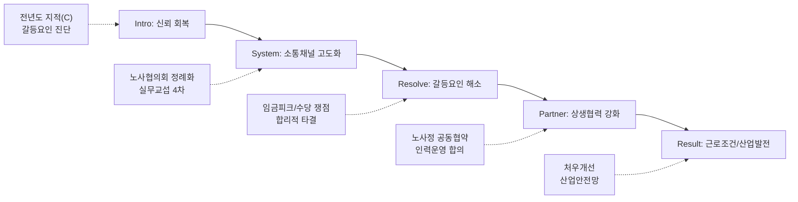

---
{"publish":true,"permalink":"/경영평가/1-9/5_지표작성방안","title":"5_지표 작성 방안","created":"2025-12-09","modified":"2025-12-13T19:36:04.432+09:00","tags":["경영평가","노사관계","비계량","작성방안"],"cssclasses":""}
---


# [1-9 노사관계] 세부평가내용 작성 방안

> [!abstract] 문서 개요
> 본 문서는 '1.9 노사관계' 지표의 2025년도 경영평가보고서 작성을 위한 논리적 흐름(Storyline)과 문단별 세부 작성 방안을 제안합니다.
> 
> **핵심 목표**: [[25년 경평/2_지표별 자료/1-9_노사관계/3_전년도_지적사항_및_개선실적\|전년도 지적사항(C 등급)]]을 극복하고, **'노사 갈등의 합리적 해결'**과 **'노사정 공동협약 체결'** 등 상생협력 성과를 부각하여 목표 등급(B등급 이상)을 달성하는 데 중점을 두었습니다.

---

## 1. Storyline 구성안 비교

### 📌 Option A: 평가요소 순차형 (Sequential)

| 구분 | 내용 |
|------|------|
| **구조** | 협의체계 구축 → 노사 소통/역량 → 근로조건 향상 |
| **장점** | 편람의 3개 평가요소를 빠짐없이 순서대로 다루기에 용이 |
| **단점** | 단순 나열식으로 보여 전년도 C등급의 원인인 '갈등 해결' 노력이 묻힐 수 있음 |
| **적합도** | ⭐⭐ |

```
①협의체계(System) → ②소통/역량(Communication) → ③근로조건(Condition)
```

### 📌 Option B: 갈등 해결 중심형 (Conflict-Resolution)

| 구분 | 내용 |
|------|------|
| **구조** | 갈등 진단 → 대화와 타협 → 합의 도출 → 제도적 정착 |
| **장점** | 전년도 지적사항(갈등요인 해소 미흡)을 정면으로 돌파하는 서사 |
| **단점** | 갈등 해결 외의 일상적인 노사협력이나 근로조건 개선 성과가 약해 보일 수 있음 |
| **적합도** | ⭐⭐⭐ |

```
Conflict(쟁점) → Dialogue(대화) → Consensus(합의) → Settlement(정착)
```

### 📌 Option C: 상생 파트너십형 (Partnership)

| 구분 | 내용 |
|------|------|
| **구조** | 신뢰 구축(소통) → 현안 해결(갈등관리) → 공동 가치 창출(상생) |
| **장점** | 갈등 해결을 넘어 '영화산업 발전'이라는 공동 목표를 향한 파트너십 강조 |
| **단점** | 논리적 비약이 없도록 단계별 인과관계를 명확히 해야 함 |
| **적합도** | ⭐⭐⭐ |

```
Trust(신뢰) → Solution(해결) → Value(가치창출)
```

---

## 2. 추천 Storyline (갈등 해결 & 가치 창출)

> [!tip] 추천 구조
> **"전년도 노사 갈등을 대화와 타협으로 해결(Resolve)하고, 이를 바탕으로 영화산업 위기극복을 위한 상생 파트너십(Partnership)을 구축"**하는 구조

### 전체 흐름



### 핵심 메시지

> **"지속적인 대화로 노사 쟁점을 합리적으로 해결하고, 영화산업 위기 극복을 위해 노사가 '원팀(One-Team)'으로 협력"**

---

## 3. 문단별 작성 방안

### 세부평가내용① 노사 협의체계 구축 및 운영

#### 문단 1-1: 상시적 소통 채널 가동 및 제도화

| 항목 | 내용 |
|------|------|
| **Core Message** | 분기별 노사협의회 정례화 및 실무교섭 활성화로 소통 채널 제도화 |
| **주요 근거** | 노사협의회 운영 실적, 교섭 진행 현황 |
| **담당 부서** | 인사총무팀, 노조 |

| 증빙 요소 | 내용 |
|----------|------|
| 협의운영 | 분기별 정기 노사협의회 100% 개최, 안건 의결 이행 |
| 실무교섭 | 단체협약 실무교섭 4차 진행, 비대위 운영을 통한 의견수렴 |
| 법령준수 | 근로시간 면제제도(타임오프) 법정 한도 준수 및 투명 운영 |

> [!example] 추천 스토리라인
> **"상시적 소통 채널 필요 → 노사협의회 정례화 → 실무교섭 활성화 → 소통 채널 제도화"**
> 
> - 도입: 노사 간 상시적 소통 채널 구축 필요
> - 전개: 분기별 노사협의회 100% 개최, 단체협약 실무교섭 4차 진행
> - 성과: 안건 의결 이행, 타임오프 법정 한도 준수

#### 문단 1-2: 갈등요인의 합리적 해소 (지적사항 대응)

| 항목 | 내용 |
|------|------|
| **Core Message** | 시간외근무수당 등 쟁점사항을 중재와 타협을 통해 합리적으로 해결 |
| **주요 근거** | 쟁점사항 합의문, 중재 절차 이행 |
| **담당 부서** | 인사총무팀 |

| 증빙 요소 | 내용 |
|----------|------|
| 쟁점해결 | 시간외근무수당 관련 중재 절차 진행 및 상호 합의 도출 |
| 인력운영 | 인건비 최대 확보 기준 인력운영원칙 노사 합의 수립 |
| 갈등관리 | 노사 쟁점사항(임금피크 등)에 대한 단계적 협의 로드맵 |

> [!example] 추천 스토리라인
> **"갈등요인 해소 미흡 지적 → 중재/조정 절차 이행 → 쟁점사항 합의 → 갈등 해소"**
> 
> - 도입: 시간외근무수당 등 쟁점사항 합리적 해결 필요(지적사항 대응)
> - 전개: 중재 절차 진행, 인력운영원칙 노사 합의 수립
> - 성과: 쟁점사항 상호 합의 도출, 단계적 협의 로드맵 수립

---

### 세부평가내용② 노사 소통 및 역량 강화

#### 문단 2-1: 노사 공동의 목표 설정과 공감대 형성

| 항목 | 내용 |
|------|------|
| **Core Message** | 경영현황 공유 및 위기 극복을 위한 노사 공감대 형성 |
| **주요 근거** | 경영설명회, 공동 선언문 |
| **담당 부서** | 기획전략팀, 인사총무팀 |

| 증빙 요소 | 내용 |
|----------|------|
| 경영공유 | 예산/인력 등 주요 경영현안 수시 공유 및 설명회 개최 |
| 공동선언 | 영화산업 위기극복을 위한 노사 공동 실천 결의 |
| 역량강화 | 노사 담당자 갈등관리 및 협상 전문가 교육 이수 |

> [!example] 추천 스토리라인
> **"경영현황 공유 필요 → 경영설명회 개최 → 노사 공감대 형성 → 공동 실천 결의"**
> 
> - 도입: 영화산업 위기 극복을 위한 노사 공감대 형성 필요
> - 전개: 예산/인력 등 경영현안 수시 공유, 경영설명회 개최
> - 성과: 영화산업 위기극복 노사 공동 실천 결의, 담당자 역량 강화

#### 문단 2-2: 사회적 가치 창출을 위한 파트너십

| 항목 | 내용 |
|------|------|
| **Core Message** | 내부를 넘어 영화산업 전반의 상생을 위한 노사 공동 노력 |
| **주요 근거** | 노사정 협약, 사회공헌 |
| **담당 부서** | 공정환경조성팀, 인사총무팀 |

| 증빙 요소 | 내용 |
|----------|------|
| 산업안전 | 산업단위 최초 '노사정 안전보건 공동협약' 체결 ('25.11.) |
| 지역상생 | 부산 지역사회 대상 노사 공동 봉사활동 및 기부 |
| 청년지원 | 노사 협력 기반 청년인턴 취업지원 프로그램 운영 |

> [!example] 추천 스토리라인
> **"내부 노사관계를 넘어 산업 상생 필요 → 노사정 협약 체결 → 사회공헌 활동 → 가치 창출"**
> 
> - 도입: 내부를 넘어 영화산업 전반의 상생을 위한 노사 공동 노력 필요
> - 전개: 산업단위 최초 노사정 안전보건 공동협약 체결('25.11.)
> - 성과: 부산 지역사회 공동 봉사활동, 청년인턴 취업지원 프로그램 운영

---

### 세부평가내용③ 근로조건 향상

#### 문단 3-1: 실질적 처우 개선 및 일터 혁신

| 항목 | 내용 |
|------|------|
| **Core Message** | 노사 합의에 기반한 합리적 임금인상 및 근무환경 개선 |
| **주요 근거** | 임금협약, 복리후생 개선 실적 |
| **담당 부서** | 인사총무팀 |

| 증빙 요소 | 내용 |
|----------|------|
| 임금복지 | 정부 가이드라인 준수 하에 합리적 임금인상률 합의 |
| 근무환경 | 노후 시설 개선, 휴게공간 확충 등 직원 편의 증진 |
| 유연근무 | 시차출퇴근 등 유연근무제 확대 운영 및 이용률 제고 |

> [!example] 추천 스토리라인
> **"실질적 처우 개선 필요 → 노사 합의 기반 임금인상 → 근무환경 개선 → 일터 혁신"**
> 
> - 도입: 노사 합의에 기반한 합리적 처우 개선 필요
> - 전개: 정부 가이드라인 준수 임금인상률 합의, 노후 시설 개선
> - 성과: 휴게공간 확충, 유연근무제 확대 운영

#### 문단 3-2: 일·가정 양립 및 고용안정

| 항목 | 내용 |
|------|------|
| **Core Message** | 가족친화적 제도 운영과 고용안정성 강화 |
| **주요 근거** | 가족친화인증, 정규직 전환 |
| **담당 부서** | 인사총무팀 |

| 증빙 요소 | 내용 |
|----------|------|
| 일가정 | 육아휴직, 가족돌봄휴가 사용 활성화 및 복직 지원 |
| 고용안정 | 무기계약직 처우 개선 및 승단 제도 운영 |
| 인사제도 | 인사제도 개선계획 수립을 통한 공정하고 투명한 평가 |

> [!example] 추천 스토리라인
> **"일·가정 양립 및 고용안정 필요 → 육아휴직 활성화 → 무기계약직 처우 개선 → 고용안정 강화"**
> 
> - 도입: 가족친화적 제도 운영과 고용안정성 강화 필요
> - 전개: 육아휴직·가족돌봄휴가 활성화, 무기계약직 처우 개선
> - 성과: 승단 제도 운영, 공정하고 투명한 인사제도 개선

---

## 4. 문단 구성 요약

> [!note] 총 6개 문단 구성
> 
> **세부평가내용① 노사 협의체계 구축 및 운영** (2개 문단)
> - 문단 1-1: 상시적 소통 채널 가동 및 제도화
> - 문단 1-2: 갈등요인의 합리적 해소
> 
> **세부평가내용② 노사 소통 및 역량 강화** (2개 문단)
> - 문단 2-1: 노사 공동의 목표 설정과 공감대 형성
> - 문단 2-2: 사회적 가치 창출을 위한 파트너십
> 
> **세부평가내용③ 근로조건 향상** (2개 문단)
> - 문단 3-1: 실질적 처우 개선 및 일터 혁신
> - 문단 3-2: 일·가정 양립 및 고용안정

---

## 5. 차별화 포인트

### 가. 편람 요구사항 대응 현황

| 편람 요구사항 | 대응 문단 | 핵심 내용 |
|-------------|----------|----------|
| 노사협의회 운영 | 문단 1-1 | 분기별 100% 개최, 안건 의결 이행 |
| 단체교섭 | 문단 1-1 | 실무교섭 4차 진행, 비대위 운영 |
| 갈등요인 해소 | 문단 1-2 | 중재 절차 이행, 쟁점 합의 도출 |
| 경영현황 공유 | 문단 2-1 | 경영설명회 개최, 공동 실천 결의 |
| 사회적 가치 창출 | 문단 2-2 | 노사정 안전보건협약, 공동 봉사 |
| 임금/복지 | 문단 3-1 | 합리적 임금인상률 합의 |
| 근무환경 개선 | 문단 3-1 | 노후 시설 개선, 유연근무 확대 |
| 고용안정 | 문단 3-2 | 무기계약직 처우 개선, 승단 제도 |

### 나. 전년도 C등급(지적사항) 개선 전략

| 지적사항 | 개선 방안 | 핵심 성과 |
|---------|----------|----------|
| 갈등요인 해소 미흡 | **중재/조정** 절차 이행 | 수당 쟁점 합의, 인력운영원칙 수립 |
| 협력적 관계 부족 | **공동협약** 체결 | 노사정 안전보건협약, 공동 봉사 |
| 조직문화 쇄신 미흡 | **소통채널** 확대 | 비대위 운영, 경영설명회 정례화 |

### 다. 산업 단위로 확장된 노사관계

| 영역 | 기존 (내부 중심) | 확장 (산업 중심) |
|------|----------------|----------------|
| 협력 범위 | 기관 내 임금/복지 | **영화산업 안전/표준** 정립 |
| 파트너십 | 사측 vs 노조 | **노(영화인)-사(제작사)-정(영진위)** |

---

## 6. 작성 시 유의사항

### 가. 편람 세부평가요소 매칭

> [!warning] 필수 확인
> 법령 위반(부당노동행위 등) 여부 확인 및 소명 철저

| 세부평가요소 | 배분 비중 | 주요 부서 |
|-------------|----------|----------|
| ① 노사 협의체계 | 40% | 인사총무팀 |
| ② 노사 소통/역량 | 30% | 인사총무팀 |
| ③ 근로조건 향상 | 30% | 인사총무팀 |

### 나. 정량 데이터 활용

> [!success] 핵심 정량지표
> - 노사협의회: 개최 **4회**, 안건 처리율 **100%**
> - 교섭: 실무교섭 **4차**, 쟁점 합의 **0건**
> - 협력: 공동 프로그램 **0회**, 사회공헌 **0회**

### 다. 증빙자료 연계

| 문단 | 핵심 증빙 |
|------|----------|
| 협의체계 | 노사협의회 회의록, 단체협약 합의서 |
| 갈등해결 | 쟁점사항 조정 회의록, 중재 합의문 |
| 상생협력 | 노사정 안전보건협약서, 공동선언문 |
| 근로조건 | 임금협약서, 유연근무 활용 통계 |

---

## 🔗 관련 자료

| 구분 | 문서명 | 비고 |
|------|--------|------|
| 편람 분석 | [[25년 경평/2_지표별 자료/1-9_노사관계/2_편람_내용_분석]] | 세부평가 요소별 가이드 |
| 지적사항 | [[25년 경평/2_지표별 자료/1-9_노사관계/3_전년도_지적사항_및_개선실적]] | C등급 원인 및 개선방향 |
| 교섭현황 | [[단체협약_실무교섭_현황]] | 교섭 진행 경과 |
| 공통 자료 | [[01_편람_및_지침]] | 작성 가이드 |

---

*작성일: 2025-12-09*
*검증상태: 전년도 지적사항 반영 확인*