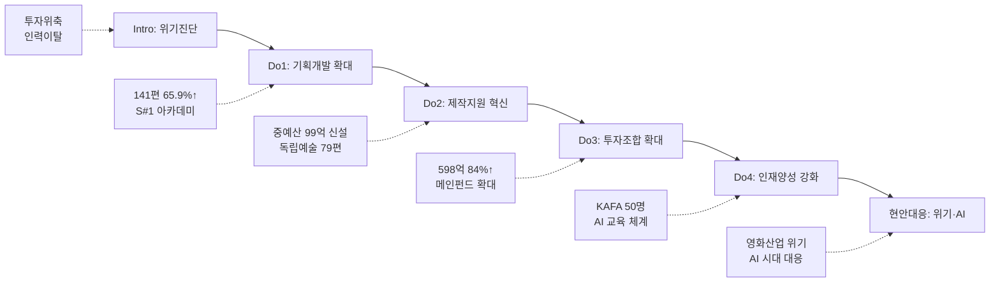

---
{"publish":true,"title":"2-1 한국영화 제작유통 활성화 지표 작성 방안","created":"2025-12-09","modified":"2025-12-09T15:12:44.000+09:00","tags":["경영평가","주요사업","제작유통활성화","비계량","작성방안"],"cssclasses":""}
---


# [2-1 한국영화 제작·유통 활성화] 세부평가내용 작성 방안

> [!abstract] 문서 개요
> 본 문서는 '2.1 한국영화 제작·유통 활성화' 지표의 2025년도 경영평가보고서 작성을 위한 논리적 흐름(Storyline)과 문단별 세부 작성 방안을 제안합니다.
> 
> **핵심 목표**: [[25년 경평/2_지표별 자료/2-1_제작유통_활성화/3_전년도_지적사항_및_개선실적\|전년도 지적사항(C 등급)]]을 극복하고, **'영화산업 위기 대응'**과 **'AI 시대 선제적 대응'**을 통해 목표 등급(B등급 이상)을 달성하는 데 중점을 두었습니다.

---

## 1️⃣ Storyline 구성안 비교

### 📌 Option A: 사업 중심 구조

| 구분 | 내용 |
|------|------|
| **구조** | 기획개발 → 제작지원 → 투자조합 → 인재양성 |
| **장점** | 사업 단위로 명확하게 구분, 평가위원 친화적 |
| **단점** | 부서 간 협업 성과 표현 어려움, 현안대응 분산 |
| **적합도** | ⭐⭐ |

```
기획개발 → 제작지원 → 투자조합 → 인재양성
```

### 📌 Option B: 밸류체인 중심 구조

| 구분 | 내용 |
|------|------|
| **구조** | IP 발굴 → 제작 → 투자 → 인력양성 |
| **장점** | 영화산업 생태계 관점 강조, 연계성 표현 용이 |
| **단점** | 매뉴얼 구조와 이질적, 경영자원 효율성 배치 곤란 |
| **적합도** | ⭐⭐ |

```
IP 발굴 → 제작 → 투자 → 인력양성
```

### 📌 Option C: 하이브리드 구조 (추천)

| 구분 | 내용 |
|------|------|
| **구조** | 사업별 집행 + 현안대응 종합 섹션 |
| **장점** | 매뉴얼 평가착안사항 3가지 모두 반영, BP 가시화 |
| **단점** | 구조 다소 복잡, 분량 증가 가능성 |
| **적합도** | ⭐⭐⭐ |

```
사업별 집행(기획·제작·투자·교육) + 현안대응 종합(영화위기·AI시대)
```

---

## 2️⃣ 추천 Storyline: 위기 극복 & 미래 대응

> [!tip] 추천 구조
> **"영화산업 위기(투자위축, 인력이탈)를 공적 지원 확대로 극복하고, AI 시대 변화에 선제적으로 대응하여 K-무비 지속가능 성장 기반 마련"**하는 구조

### 전체 흐름



### 핵심 메시지

> **"기금 고갈 위기 속에서도 전입금 확보로 사업규모를 대폭 확대하고, AI 교육 등 미래 변화에 선제 대응"**

---

## 3️⃣ 문단별 작성 방안 (Do 섹션)

### 세부평가내용② 계획의 적절한 집행

#### 문단 1: 기획개발지원 사업 집행 [창작제작팀]

| 항목 | 내용 |
|------|------|
| **Core Message** | 신규·우수 IP 대량 생산을 위해 기획개발 지원 대폭 확대 |
| **주요 근거** | 141편 선정(65.9%↑), 예산 2,525백만원(60.8%↑) |
| **담당 부서** | 창작제작팀 |

| 증빙 요소 | 내용 |
|----------|------|
| 집행규모 | 작가부문 76편, 초기기획 50편, 영화화 15편 총 **141편** |
| 전년대비 | 예산 1,570→2,525백만(+60.8%), 편수 85→141편(+65.9%) |
| 신진인력 | 시나리오 공모전 963편 접수(27.9%↑), S#1 아카데미 7기 19명 배출 |
| 효율성 | 편당 평균 지원금 17.9백만원 |
| 현안대응 | 영화산업 인력이탈 → 신진인력 진입 확대 |

#### 문단 2: 제작지원 사업 집행 [창작제작팀]

| 항목 | 내용 |
|------|------|
| **Core Message** | 독립예술영화 생태계 유지 + 중예산 영화 제작지원 신규 도입 |
| **주요 근거** | 독립예술 79편, 중예산 9편/99억 |
| **담당 부서** | 창작제작팀 |

| 증빙 요소 | 내용 |
|----------|------|
| 독립예술 | 극영화 단편 24편, 장편 16편, 다큐멘터리 16편, 인큐베이팅 24편 |
| 중예산 신설 | **99.3억원 9편 선정** (순제 20~80억 규모) ⭐BP |
| 민간연계 | 메인투자 연계 9편 중 6편 완료(66.7%) |
| 현안대응 | 상업영화 투자위축 → 공적 지원 확대로 허리 강화 |
| 제도개선 | 공모횟수 확대, 제작기간 보장 등 현장 의견 반영 |

#### 문단 3: 투자조합 출자 사업 집행 [창작제작팀]

| 항목 | 내용 |
|------|------|
| **Core Message** | 민간 자본경색 상황에서 공공자금 적시 공급으로 투자 활성화 |
| **주요 근거** | 598억원 출자(84%↑), 560억원 투자집행(83건) |
| **담당 부서** | 창작제작팀 |

| 증빙 요소 | 내용 |
|----------|------|
| 출자규모 | 메인펀드 298억, 중저예산 200억, 애니메이션 200억(신규) |
| 전년대비 | 325억→598억(+84%) |
| 투자실적 | 560억원/83건 투자집행 (전년동기대비 +27%) |
| 투자성과 | <야당> 박스오피스 2위, <히트맨2> 4위 |
| 현안대응 | 팬데믹 이후 투자 위축 → 조건 합리화 및 예산 확대 |

#### 문단 4: KAFA 정규교육 집행 [정규교육팀]

| 항목 | 내용 |
|------|------|
| **Core Message** | 신진 핵심인재 양성 및 AI 시대 대응 교육체계 구축 |
| **주요 근거** | 50명 양성, 34편 제작, AI 장편랩 신설 |
| **담당 부서** | 정규교육팀 |

| 증빙 요소 | 내용 |
|----------|------|
| 운영실적 | 교육생 50명(22%↑), 제작편수 34편(13%↑) |
| 교육혁신 | AI 장편랩 신설, KAFA Actors 전담교수 운용 ⭐BP |
| 효율성 | 인당 교육비 19%↓ (제작과정 효율화) |
| 성과 | 칸영화제 라시네프 1등상, 부산국제영화제 4관왕 |
| 현안대응 | AI 교육 실태조사(최초), BIFAN AI 컨퍼런스 개최 |

#### 문단 5: 현장영화인교육 집행 [영화인교육팀]

| 항목 | 내용 |
|------|------|
| **Core Message** | 현장영화인 재교육 및 첨단영화제작 교육으로 산업 경쟁력 강화 |
| **주요 근거** | 702명 수료(148%), AI 영화 5편 제작 |
| **담당 부서** | 영화인교육팀 |

| 증빙 요소 | 내용 |
|----------|------|
| 수료실적 | 목표 475명 대비 702명 수료(148%) |
| 첨단교육 | 생성형 AI 기반 영화제작 교육, AI 영화 5편 완성 ⭐BP |
| 만족도 | 교육 만족도 4.8점/5.0점 |
| 배급실적 | KAFA 작품 극장개봉 6편, 관객 32,741명 |
| 현안대응 | AI 쇼케이스 3회 순회 (부산·수원·서울) |

---

### 세부평가내용② 경영환경 변화 대응 (종합)

#### 문단 6-1: 영화산업 위기 대응

| 항목 | 내용 |
|------|------|
| **Core Message** | 투자위축·인력이탈 등 산업 위기를 공적 지원 확대로 극복 |
| **주요 근거** | 출자 84%↑, 중예산 99억 신설, 공모 27.9%↑ |
| **담당 부서** | 창작제작팀, 정규교육팀 |

| 증빙 요소 | 내용 |
|----------|------|
| 투자위축 | 투자조합 출자 325→598억(+84%), 중예산 지원 99억 신설 |
| 인력이탈 | 시나리오 공모전 963편(+27.9%), KAFA 교육생 50명(+22%) |
| 밸류체인 | 민간투자 연계율 66.7%, 개봉 14건 등 성과 창출 |

#### 문단 6-2: AI 기술 확산 대응 ⭐BP

| 항목 | 내용 |
|------|------|
| **Core Message** | AI 시대 변화에 선제적 대응, 스토리텔링 기반 AI 교육체계 구축 |
| **주요 근거** | AI 장편랩, 첨단교육, 실태조사 |
| **담당 부서** | 정규교육팀, 영화인교육팀 |

| 증빙 요소 | 내용 |
|----------|------|
| KAFA | AI 장편랩 신설, AI 장편 애니메이션 <보랏빛 밤> 제작 중 |
| 영화인교육 | 첨단영화제작교육 신규, AI 영화 5편 완성 |
| 연구 | AI 교육 실태조사(국내 최초), BIFAN AI 컨퍼런스 개최 |
| 홍보 | AI 쇼케이스 3회, 부천AI센터 협업 홍보콘텐츠 제작 |

---

## 4️⃣ 차별화 포인트

### 가. 전년도 C등급(지적사항) 개선 전략

| 지적사항 | 개선 방안 | 핵심 성과 |
|---------|----------|----------|
| 추진계획 구체성 미흡 | **환경분석 기반** 3대 핵심사업 전략체계 수립 | 성과목표 명확화, PDCA 환류체계 구축 |
| 질적 성과 제시 부족 | **영화제 수상** 등 질적 지표 관리 | 칸영화제 1등상, 박스오피스 2·4위 |
| 기획개발 확대 필요 | **기획개발 지원** 대폭 확대 | 141편(65.9%↑), 예산 60.8%↑ |
| 환류활동 체계 미흡 | **'26년 사업요강** 개선 반영 | 신규사업 설계, 예산 141.1%↑ 확보 |

### 나. 영화산업 위기 대응 모델

| 영역 | 위기 요인 | 대응 전략 | 성과 |
|------|----------|----------|------|
| 투자 | 민간 자본경색 | 투자조합 84%↑, 조건 합리화 | 560억/83건 투자 |
| 제작 | 상업영화 급감 | 중예산 지원 99억 신설 | 9편 선정, 민간연계 66.7% |
| 인력 | 타 산업 이탈 | 기획개발 65.9%↑, 교육 확대 | 공모 963편, KAFA 50명 |
| 기술 | AI 기술 확산 | AI 교육체계 구축 | AI 영화 5편, 장편랩 신설 |

---

## 5️⃣ 작성 시 유의사항

### 가. 매뉴얼 평가착안사항 대응

> [!warning] 필수 확인
> Do 섹션은 3가지 평가착안사항을 모두 반영해야 함

| 평가착안사항 | 대응 내용 |
|------------|----------|
| ① 추진계획 적절 집행 | 기획개발 141편, 제작지원 88편, 투자조합 598억 등 집행실적 |
| ② 경영자원 효율 활용 | 편당 지원금 17.9백만, 인당 교육비 19%↓ 등 효율성 지표 |
| ③ 현안과제 대응 적절성 | 영화산업 위기 대응, AI 시대 선제적 대응 종합 섹션 |

### 나. 정량 데이터 활용

> [!success] 핵심 정량지표
> - 기획개발: **141편** (65.9%↑)
> - 제작지원: 독립예술 **79편**, 중예산 **9편/99억**
> - 투자조합: **598억** (84%↑)
> - KAFA: **50명**, **34편**, 칸영화제 **1등상**
> - 영화인교육: **702명** (148%), AI 영화 **5편**

### 다. BP(Best Practice) 강조

| BP 후보 | 내용 | 강조 포인트 |
|---------|------|-----------|
| 중예산 지원 | 99억 신규사업 | 영화산업 위기 대응 핵심 정책 |
| AI 장편랩 | KAFA 신규과정 | 스토리텔링 기반 AI 교육 최초 |
| 첨단교육 | AI 영화 5편 | 생성형 AI 활용 실전 교육 |

---

## 🔗 관련 자료

| 구분 | 문서명 | 비고 |
|------|--------|------|
| 편람 분석 | [[25년 경평/2_지표별 자료/1-9_노사관계/2_편람_내용_분석]] | 세부평가 요소별 가이드 |
| 지적사항 | [[25년 경평/2_지표별 자료/2-1_제작유통_활성화/3_전년도_지적사항_및_개선실적]] | C등급 원인 및 개선방향 |
| 부서 매핑 | [[25년 경평/2_지표별 자료/2-1_제작유통_활성화/부서별 실적 분석/창작제작팀 실적 분석]], [[25년 경평/2_지표별 자료/2-1_제작유통_활성화/부서별 실적 분석/정규교육팀 실적 분석]], [[25년 경평/2_지표별 자료/2-1_제작유통_활성화/부서별 실적 분석/영화인교육팀 실적 분석]] | 부서별 실적 종합 |
| 목차구성안 | [[25년 경평/2_지표별 자료/1-9_노사관계/1_목차_구성안]] | 전체 목차 구조 |

---

*작성일: 2025-12-09*
*검증상태: 부서성과평가 원본 대조 완료*
