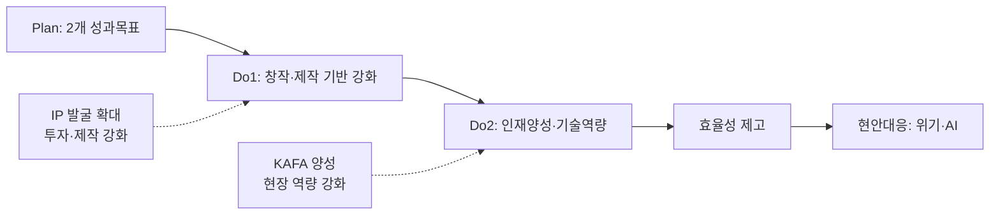

---
{"publish":true,"permalink":"/경영평가/주요사업1/실행","title":"6_실행(Do)","created":"2025-12-16","modified":"2025-12-16T11:27:05.206+09:00","tags":["#경영평가","#주요사업","#제작유통활성화","#비계량","#작성방안"],"cssclasses":""}
---

# [2-1 한국영화 제작·유통 활성화] 실행(Do) 작성 방안

> [!abstract] 문서 개요
> 본 문서는 '2-1 한국영화 제작·유통 활성화' 지표의 **세부평가내용② 추진활동 실적** 작성을 위한 구조와 세부 작성 방안을 제안합니다.
>
> **평가내용 02**: 주요사업별 추진활동은 적절히 수행되었는가?
> **주관부서**: 창작제작팀, 정규교육팀, 영화인교육팀
> **수정일**: 2025-12-16 (계획(Plan) 구조 및 부서성과평가보고서 기반 업데이트)

---

## 1. 개요

### 1.1 Do 세부 구조

> [!tip] Do 섹션 작성 가이드
> **이 섹션의 목적**: Plan에서 세운 계획을 **얼마나 잘 실행했는지** 보여주는 부분입니다.
> 
> **핵심 질문**: "계획대로 했나요? 효율적으로 했나요? 문제는 어떻게 해결했나요?"
> 
> **Do 섹션의 3가지 평가착안사항**:
> 1. **추진활동 실적**: 계획한 사업을 제대로 집행했는가?
> 2. **효율성 제고**: 자원(예산, 인력)을 효율적으로 활용했는가?
> 3. **긴급현안 대응**: 예상치 못한 문제에 적절히 대응했는가?
> 
> **작성 팁**: 숫자와 증빙이 핵심! 모든 실적에 **정량 데이터** 포함

| 구분 | 세부 항목 |
|------|----------|
| **1. 추진활동 실적** | 성과목표① 한국영화 창작·제작 기반 강화 성과목표② 창의인재 양성 및 첨단기술 역량 강화 |
| **2. 효율성 제고 노력 및 성과** | 가. 프로세스 개선 노력과 성과 나. 예산절감 노력과 성과 다. 협업·참여·소통확대 노력과 성과 |
| **3. 모니터링 긴급현안 대응** | 가. 한국 영화산업 재도약을 위한 제작지원·투자 강화 나. AI 시대 선제적 대응을 위한 교육체계 구축 |

---

### 1.2 Storyline 구성안

> [!note] 스토리라인 가이드
> **「영화산업 위기 극복 + AI 시대 선제적 대응 = K-무비 지속가능 성장 기반 마련」**
> 
> 투자위축·인력이탈 등 영화산업 위기를 공적 지원 확대로 극복하고, AI 시대 변화에 선제적으로 대응하여 K-무비 지속가능 성장 기반을 마련하는 구조

#### 전체 흐름

---

## 2. 추진활동 실적

> [!abstract] 성과목표별 실행과제 구조
> 
> **성과목표① 한국영화 창작·제작 기반 강화** (창작제작팀)
> - 실행과제 1: IP 발굴 및 기획개발 확대
> - 실행과제 2: 중소영화 투자·제작 기반 강화
> 
> **성과목표② 창의인재 양성 및 첨단기술 역량 강화** (정규교육팀, 영화인교육팀)
> - 실행과제 3: 신진 창의인재 양성
> - 실행과제 4: 현장 역량 강화 및 제작 기반 조성

---

### 2.1 성과목표① 한국영화 창작·제작 기반 강화

> [!note] 성과목표① 개요
> **담당부서**: 창작제작팀
> **핵심 목표**: 영화산업 위기 속 창작·제작 생태계 유지 및 강화
> **실행과제**: IP 발굴 및 기획개발 확대 / 중소영화 투자·제작 기반 강화
> 
> **성과지표**:
> - 계) 제작지원작 극장 개봉 편수: 목표 32편
> - 계) 영상전문투자조합 투자 건수: 목표 121건
> - 비) 미개봉 한국영화 개봉촉진 성과
> - 비) 중소영화 투자·제작 활성화 추진 노력

---

#### 2.1.1 실행과제①: IP 발굴 및 기획개발 확대 [창작제작팀]

> [!quote] 📊 환경 분석 (부서성과평가보고서)
> - 영화산업 인력 타 산업 이탈 가속화: 신진인력 진입한계 개선 및 육성 강화 필요
> - 신규·우수 IP 부족: 기획개발 지원의 지속적·안정적 공급 체계 강화 필요
> - 작가의 업계 내 입지·처우 열악: 성장지원 및 연계지원 강화 필요

##### (1) 기획개발지원 - 작가부문

| 항목 | 내용 |
|------|------|
| **Core Message** | 우수 IP 발굴을 위한 작가 중심 기획개발 지원 대폭 확대 |
| **주요 근거** | 작가부문 **76편** 선정(52.0%↑), 예산 **760백만원**(33.3%↑) |

| 구분 | 실적 | 성과 |
|------|------|------|
| 작가부문 지원 | 76편 선정, 760백만원 집행 | 전년대비 편수 52.0%↑, 예산 33.3%↑ |
| 1단계(트리트먼트) | 52편 선정 (경력초기 26편, 기성 26편) | 3개월간 시나리오 초고 개발 |
| 2단계(초고개발) | 24편 선정 (경력초기 12편, 기성 12편) | 3개월간 시나리오 2고 개발 |
| S#1 랩 연계 | 멘토링 3회, 미팅레슨 운영 | 작품개발 지속 지원 체계 구축 |
| S#1 비즈매칭 | 비즈워크 part2 개최 (9/30) | 41개 지원작, **134건** 미팅 성사 |

##### (2) 기획개발지원 - 제작사부문

| 항목 | 내용 |
|------|------|
| **Core Message** | 제작사 기반 기획개발로 제작 연계 가능성 제고 |
| **주요 근거** | 초기기획 **50편**(100%↑), 영화화 **15편**(50%↑) |

| 구분 | 실적 | 성과 |
|------|------|------|
| 초기기획 | 50편 선정, 1,000백만원 집행 | 전년대비 편수 **100%↑**, 예산 **100%↑** |
| 영화화 | 15편 선정, 765백만원 집행 | 전년대비 편수 **50%↑**, 예산 **53%↑** |
| 부문 세분화 | 트리트먼트 25편 / 시나리오 초고 25편 | 제작사 기획개발 단계별 맞춤 지원 체계 마련 |
| 영화화 조건완화 | OTT 경력 인정, 지원이력 작품 일부 인정 | 영화화 가능성 제고 |

##### (3) 신진인력 양성 (S#1 센터)

| 항목 | 내용 |
|------|------|
| **Core Message** | 시나리오 공모전·아카데미로 신진 창작인력 진입 확대 |
| **주요 근거** | 공모전 **963편**(27.9%↑), S#1 아카데미 **19명** 배출 |

| 구분 | 실적 | 성과 |
|------|------|------|
| 시나리오 공모전 | 963편 접수, 14편 선정 | 전년대비 지원율 **27.9%↑**, 시상금 102백만원 |
| 시상금 확대 | 대상 17백만→**30백만원** | 공모전 위상 제고, 우수 신인작가 발굴 |
| S#1 아카데미 | 7기 **19명** 졸업작가 배출 | 6개월 교육+창작개발금(인당 13.2백만원) |
| 신진제작자 인큐베이팅 | **14편** 선발 (신규사업) | S#1 랩 연계 작품개발 |
| S#1 비즈워크 | 총 3회 개최, 105개 작품 매칭 | **427건** 미팅 성사 (역대 최다, 전년대비 **123.6%↑**) |

> [!success] 실행과제① 핵심 성과
> - 기획개발지원 **141편** 선정 (전년대비 **65.9%↑**)
> - S#1 비즈매칭 **427건** 역대 최다 (전년대비 **123.6%↑**)
> - 신인작가 크레딧 데뷔 **2건**: 〈홈캠〉 관객 100,011명, JTBC 〈김부장 이야기〉

---

#### 2.1.2 실행과제②: 중소영화 투자·제작 기반 강화 [창작제작팀]

> [!quote] 📊 환경 분석 (부서성과평가보고서)
> - 상업영화 투자·제작 편수 급감: 중예산 한국영화 제작지원 신규 사업 필요
> - 독립예술영화 제작지원 수요 증가: 공모횟수 확대 및 제작기간 보장 필요
> - 영화산업 밸류체인 와해: 민간 투자연계 확대 도모 필요

##### (1) 독립예술영화 제작지원

| 항목 | 내용 |
|------|------|
| **Core Message** | 독립예술영화 생태계 유지 및 창작 다양성 확보 |
| **주요 근거** | **79편** 선정, **6,906백만원** 지원 |

| 구분 | 실적 | 성과 |
|------|------|------|
| 극영화 단편 | 24편 선정, 401백만원 | 신청 497건 (전년대비 **33.6%↑**) |
| 극영화 장편 | 16편 선정, 5,272백만원 | 신청 482건 (전년대비 **61.2%↑**) |
| 다큐멘터리 | 16편 선정, 993백만원 | 신청 156건 (전년대비 **54.5%↑**) |
| 인큐베이팅 | 24편 선정, 240백만원 | 서울독립영화제 연계 피칭 쇼케이스 |
| 공모횟수 확대 | 연 1회→**2회** (장편/다큐) | 제작 수요에 맞는 시기적절한 지원 |
| 자기부담금 폐지 | 10% 의무→**폐지** | 어려운 영화산업계 부담 완화 |

##### (2) 중예산 한국영화 제작지원 ⭐신규

> [!quote] 📊 연구보고서 근거: 2024년 한국 영화산업 결산 (KOFIC 연구 2025-02)
> - 상업영화 평균 추정수익률: **-16.44%** (여전히 마이너스)
> - 순제작비 30~50억 구간: **-79.18%** (최저 수익률)
> - **시사점**: 중예산 영화(순제 20~80억) 공백 심화 → 공적 지원으로 한국영화 허리 강화 필요

| 항목 | 내용 |
|------|------|
| **Core Message** | 민간투자 활성화를 위한 중예산 영화 공적지원 신규 도입 |
| **주요 근거** | **99.3억원** 9편 선정, 메인투자 연계 **66.7%** |

| 구분 | 실적 | 성과 |
|------|------|------|
| 지원예산 | **99.3억원** (2025년 신규사업) | 순제 20~80억 규모 중예산 영화 직접지원 |
| 순제 20~30억 미만 | 2편 선정 | 민간투자 촉진형 공적지원 |
| 순제 30~60억 미만 | 5편 선정 | 한국영화 허리 강화 |
| 순제 60~80억 미만 | 2편 선정 | 대형상업영화 연계 기반 |
| 메인투자 연계 | 9편 중 **6편 완료** | 민간투자 연계율 **66.7%** |
| 세계 영화제 성과 | 〈내 이름은〉 | **베를린영화제 공식초청** 확정 ⭐ |

##### (3) 투자조합 출자

> [!quote] 📊 연구보고서 근거: 한국영화 투자 활성화를 위한 정책금융 활용 방안 연구 (KOFIC 연구 2025-06)
> - 2024년 개봉영화 총제작비 중 영화계정 투자액 비중: **20.5%**까지 상승
> - 업계 **77.6%**가 '정책금융 투자 펀드 확대' 필요 응답
> - **시사점**: 민간 자본경색 상황에서 공공자금 적시 공급으로 투자 활성화 필수

| 항목 | 내용 |
|------|------|
| **Core Message** | 민간 자본경색 상황에서 공공자금 적시 공급으로 투자 활성화 |
| **주요 근거** | **598억원** 출자(84%↑), **560억원/83건** 투자집행 |

| 구분 | 실적 | 성과 |
|------|------|------|
| 메인펀드 | 298억원 출자 (재출자 포함) | 전년대비 **42%↑** |
| 중저예산펀드 | 200억원 출자 | 전년대비 **74%↑** |
| 애니메이션펀드 | **200억원** 출자 (신규) | K-애니 제작투자 기반 마련 |
| 총 출자규모 | 325억→**598억원** | 전년대비 **84%↑** |
| 투자집행 | **560억원 / 83건** | 전년동기대비 **27%↑** |
| 투자성과 | 〈야당〉 박스오피스 **2위**, 〈히트맨2〉 **4위** | 11개 조합 운용 중 |

> [!success] 실행과제② 핵심 성과
> - 독립예술영화 제작지원 **79편**, 중예산 제작지원 **9편/99.3억** (신규)
> - 투자조합 출자 **598억원** (전년대비 **84%↑**)
> - 지원작 〈내 이름은〉 **베를린영화제 공식초청** (세계 3대 영화제)

---

### 2.2 성과목표② 창의인재 양성 및 첨단기술 역량 강화

> [!note] 성과목표② 개요
> **담당부서**: 정규교육팀, 영화인교육팀
> **핵심 목표**: AI 시대 대응 신진 핵심인재 양성 및 현장 역량 강화
> **실행과제**: 신진 창의인재 양성 / 현장 역량 강화 및 제작 기반 조성
> 
> **성과지표**:
> - 계) 창작자 비즈매칭 실적: 목표 279건
> - 계) 현장영화인 교육 운영 실적: 목표 780명
> - 비) 차세대 인재 발굴 및 양성 확대
> - 비) 영화영상 제작 기반 조성 노력

---

#### 2.2.1 실행과제③: 신진 창의인재 양성 [정규교육팀]

> [!quote] 📊 환경 분석 (부서성과평가보고서)
> - 교육과정의 체계적인 구조화 필요, 도전적 목표설정 필요
> - 교육 노하우 축적·환류 체계 부재, 최근 기술 발전 대응 교육 필요
> - AI 등 신기술 전방위 확산에 따른 교육체계 대응 필요

##### (1) KAFA 정규과정 운영

| 항목 | 내용 |
|------|------|
| **Core Message** | 전공 간 협업 기반 단편영화 제작교육으로 신진 핵심인재 양성 |
| **주요 근거** | 교육생 **50명**(22%↑), 26학년도 지원율 **65%↑** |

| 구분 | 실적 | 성과 |
|------|------|------|
| 교육생 양성 | **26명** (5개 전공) | 전년대비 **22%↑** |
| 실습작품 제작 | **22편** 제작 (후반작업 중) | 전공 간 협업 강화 |
| 입시체계 고도화 | 연출 실기면접, PD 기획서 추가 | 26학년도 지원율 **65%↑** |
| 수업 확대 | 109개→**113개** (4개 신규) | 전공역량 심화 커리큘럼 |
| 제작관리 강화 | 세무/노무/인티머시 의무교육 신규 | 촬영현장 8개팀 방문 점검 |

##### (2) KAFA 장편과정 운영

| 항목 | 내용 |
|------|------|
| **Core Message** | 장편영화 제작교육 완성도 제고 및 국제영화제 성과 창출 |
| **주요 근거** | 장편 **8편** 제작, **칸영화제 1등상**, **부산국제영화제 4관왕** |

| 구분 | 실적 | 성과 |
|------|------|------|
| 실사극 장편 | 18기 **3편** 완성, 배급 진행 | **부산국제영화제 4관왕** 수상 |
| 애니메이션 장편 | 15기~18기 **5편** 메인프로덕션 관리 | '26년 상반기 3편 완성 예정 |
| 학사일정 개선 | 입학 2개월 조기 시행 | 후반작업 기간 확대로 완성도 제고 |
| 교육비 효율화 | 제작과정 통폐합 | 인당 교육비 **19%↓** |
| 영화제 성과 | 〈첫여름〉 칸영화제 라시네프 출품 | **1등상** 수상 ⭐⭐⭐ |

##### (3) KAFA LAB (AI 장편랩) ⭐신규

> [!quote] 📊 연구보고서 근거: AI 영화기술 현황과 전망 (KOFIC 현안보고 2025-01)
> - 2024년 전세계 AI 시장: **1,840억 달러**, 2030년 전망: **8,260억 달러**
> - 기술중심 AI 영화 관행의 한계 → **스토리텔링 기반 AI 교육체계** 구축 필요

| 항목 | 내용 |
|------|------|
| **Core Message** | 스토리텔링 기반 AI 장편영화 교육체계 국내 최초 구축 |
| **주요 근거** | AI 장편랩 신설, AI 장편 애니메이션 제작 추진 |

| 구분 | 실적 | 성과 |
|------|------|------|
| AI 장편랩 신설 | '24년 1개팀 → '25년 **2개팀** 확대 | 국내 영화학교 **최초** AI 장편교육 체계 |
| AI 장편 제작 | 〈보랏빛 밤〉 AI 장편 애니메이션 추진 | '26년 상반기 완성 목표 |
| 커리큘럼 개발 | KAFA 실습중심 노하우 기반 설계 | 스토리텔링 기반 AI 영화제작 교육 |
| KAFA Actors | 영화영상 배우 **6명** 양성 | KAFA 실습작품 **15편** 주·조연 참여 |

##### (4) KAFA 작품 배급운영

| 항목 | 내용 |
|------|------|
| **Core Message** | KAFA 작품 극장개봉 확대로 신진 창작자 데뷔 기회 제공 |
| **주요 근거** | **6편** 개봉, 관객 **32,741명**, 단편 최다관객 기록 |

| 작품명 | 개봉일 | 개봉관수 | 관객수 |
|--------|--------|---------|--------|
| 은빛살구 | 1.15 | 40개관 | 3,619명 |
| 프랑켄슈타인 아버지 | 4.2 | 72개관 | 2,380명 |
| 보이 인 더 풀 | 5.14 | 68개관 | 5,161명 |
| 된장이 | 7.2 | 52개관 | 3,284명 |
| **첫여름 (단편)** | 8.6 | 59개관 | **17,267명** |
| 넌센스 | 11.26 | 54개관 | 1,030명+ |
| **합계** | - | **345개관** | **32,741명** |

| 구분 | 실적 | 성과 |
|------|------|------|
| 영화제 초청 | 단편 **99회**, 장편 **60회** | 전년대비 **1.62배**, **2배** 증가 |
| 영화제 수상 | 단편 **11회**, 장편 **15회** | 전년대비 **2.75배**, **5배** 증가 |
| 해외배급 | 장편 18기 **3편** 해외세일즈 계약 | 〈광장〉 프랑스 개봉 확정 (2026.10) |
| 넷플릭스 계약 | KAFA 단편 **최초** 계약 **3편** | 〈남매의 집〉, 〈4학년 보경이〉, 〈미미공주와 남근킹〉 |

> [!success] 실행과제③ 핵심 성과
> - KAFA **50명** 양성, **34편** 제작 (교육생 +22%, 제작편수 +13%)
> - 영화제 초청 **161건**(+73%), 수상 **26건**(+333%) - 역대급 성과
> - 〈첫여름〉 **칸영화제 라시네프 1등상** (세계 최고 학생영화) ⭐⭐⭐

---

#### 2.2.2 실행과제④: 현장 역량 강화 및 제작 기반 조성 [영화인교육팀]

> [!quote] 📊 환경 분석 (부서성과평가보고서)
> - 현장영화인 재교육 수요 증가 (교육훈련 경험률 34.7%, 역대 최고치)
> - AI 등 신기술 대응 교육 필요
> - 글로벌 역량 강화 및 ESG 교육 수요

##### (1) 현장영화인교육 (KAFA+)

| 항목 | 내용 |
|------|------|
| **Core Message** | 현장영화인 재교육으로 산업 현장 역량 강화 |
| **주요 근거** | **702명** 수료(목표대비 148%), 만족도 **4.54점** |

| 구분 | 실적 | 성과 |
|------|------|------|
| 정규과정 수료 | 목표 475명 대비 **702명** 수료 | 목표대비 **148%** 달성 |
| 정규과정 구성 | 제작인력 양성 6개, 직무/인사이트 6개, KOFIC TALK 3개 | 총 **15개** 정규과정 운영 |
| 특화과정 신규 | AI 8개, 글로벌 3개, ESG 2개, 현장실습 2개 | **15개** 과정 신규 개설 |
| 온라인교육 | 7개 과정 운영 | **1,571명** 학습 |
| 교육 만족도 | 수료생 만족도 조사 실시 | **4.54점/5.0점** |
| 출석률 | 전년대비 상승 | **90.92%** (+3.06%p) |

##### (2) 첨단영화제작교육 (AI) ⭐신규

| 항목 | 내용 |
|------|------|
| **Core Message** | 생성형 AI 기반 영화제작 교육으로 AI 단편영화 5편 완성 |
| **주요 근거** | AI 영화 **5편** 제작, 전국 **3회** 쇼케이스, 만족도 **4.8점** |

| 구분 | 실적 | 성과 |
|------|------|------|
| 산학협력 | MBC C&I 업무협약 체결 | AI 영화제작 전문인력 공동 양성 |
| 교육운영 | 6월~9월 4개월, **13명** 수료 | 목표대비 86.7% 달성 |
| AI 도구 활용 | 미드저니, 카탈리스트, 동영상/사운드 생성 | 생성형 AI 영화제작 파이프라인 구축 |
| 제작성과 | AI 단편영화 **5편** 완성 | 전 과정 AI 도구 활용 제작 |
| AI 쇼케이스 | 부산(9.20), 수원(9.26), 서울(11.11) | **전국 3회** 순회 개최 |
| 영화제 성과 | 〈시구문〉 서울국제AI필름페스타 | **대상** 수상 ⭐ |
| 교육 만족도 | 수료생 만족도 조사 실시 | **4.8점/5.0점** (매우 우수) |

##### (3) 글로벌영화인교육

| 항목 | 내용 |
|------|------|
| **Core Message** | 베트남 영화인 교육으로 한-베 영화산업 협력모델 강화 |
| **주요 근거** | **14명** 교육, 만족도 **4.83점** |

| 구분 | 실적 | 성과 |
|------|------|------|
| KAFA in Vietnam | 14명 (5개 프로젝트), 5일간 교육 | CJ문화재단-CJ CGV베트남 3자 협력 |
| 멘토링 | KAFA 교수진 3인 + 베트남 멘토단 2인 | 연출/프로듀싱/촬영 크리틱 총 6회 |
| 교육 만족도 | 만족 이상 응답률 **100%** | **4.83점/5.0점** |
| 수료생 성과 | 응우옌 팜 탄 닷 감독 〈날아다니는 우유소〉 | 다낭아시아영화제 **최우수 장편영화상** |

> [!success] 실행과제④ 핵심 성과
> - 현장영화인 교육 **702명** 수료 (목표대비 **148%**)
> - AI 단편영화 **5편** 제작, 만족도 **4.8점**
> - 〈시구문〉 서울국제AI필름페스타 **대상** 수상

---

## 3. 효율성 제고 노력

### 3.1 프로세스 개선 노력과 성과

| 구분 | 노력 | 성과 |
|------|------|------|
| **기획개발 지원체계 개편** | 지원주체별(작가/제작사) 사업 분리, '성장지원' 체계 도입 | S#1 랩 멘토링 의무화로 제작지원 연계 강화 |
| **제작지원 공모체계 개선** | 연 1회→**2회** 공모 확대, 자기부담금 **폐지** | 현장 의견 반영으로 참여도 제고 |
| **KAFA 작품 배급 체계 개선** | 'KAFA Films' 기획전 도입, 온라인 배급 다각화 | **6편** 극장개봉, 관객 **32,741명** |
| **KAFA 교육과정 효율화** | 사전제작과정·장편과정 통폐합, 장편랩 신설 | 인당 교육비 **19%↓** |

### 3.2 예산집행 효율성 제고 노력과 성과

| 구분 | 노력 | 성과 |
|------|------|------|
| **기획개발지원 재원 환원** | 수익 발생 시 지원금 일부 회수 조항 도입 ('26년 반영) | 영화기금 재원 환원 구조 마련 |
| **투자조합 운용 효율화** | 투자조합 의무투자비율 합리화, 투자 조건 개선 | 투자금액 **560억 원**(전년동기대비 **27%↑**) |
| **국고보조금 관리 강화** | 전문 회계법인 검증 시스템 도입, 집행 가이드라인 마련 | 집행 투명성 강화, 부당집행 사전 방지 |

### 3.3 협업·참여·소통확대 노력과 성과

| 구분 | 노력 | 성과 |
|------|------|------|
| **독립예술영화 민간협업** | 서울독립영화제-인디그라운드 연계 피칭 쇼케이스 | 비즈매칭 **51건** 달성 |
| **중예산 제작지원 업무협의** | 투자배급사·창투사·제작사 간담회, 영화업계 토론회 | 업계 우려 해소, 사업 참여도 증진 |
| **S#1 비즈매칭 BIFF 연계** | 부산국제영화제 ACFM 공동 개최 | 미팅 **427건** 역대 최다 성사 |
| **AI 교육 외부 협력** | MBC C&I 업무협약, BIFAN AI 컨퍼런스 공동 개최 | AI 영화제작 전문인력 양성 |

---

## 4. 긴급현안 대응

### 4.1 영화산업 위기 대응

| 구분 | 내용 |
|------|------|
| **점검채널** | 분야별 간담회(투자배급사·창투사·제작사·IPTV·OTT), 협·단체 간담회, 문체부 업무보고 |
| **점검내용 및 이슈** | • 한국 영화산업 침체 장기화로 제작시장 위축, 독립·예술영화 중심 지원 체계 탈피 필요 • 영화상영관입장권 부과금 폐지 위기로 기금 고갈 상황, 신규 재원 확보 필요 |

#### 긴급현안 발생 및 해결 노력

| 현안과제 | 해결 노력 |
|---------|----------|
| 중예산 제작지원 사업 설계를 위한 긴급 현장 의견수렴 필요 | **현장 의견수렴**: 투자배급사(CJ ENM, 롯데엔터), 창투사, IPTV, 제작사, K-OTT 대상 설명회 |
| 영화기금 유일 자체수입인 부과금 폐지 위기 | **투자재원 확보**: 문체부·기재부 대상 업무협의, 영화계정 출자금 국고 편성 요청 |

#### 추진성과

| 성과 | 내용 |
|------|------|
| 중예산 제작지원 | **99.3억 원** 규모 사업계획 확정, 현장 의견 반영으로 업계 우려 해소 |
| 투자재원 확보 | 영화계정 출자금 국고 편성, **325억 원** 확보 |
| 베를린영화제 | 중예산 지원작 〈내 이름은〉 **베를린영화제 공식초청** 확정 |

---

### 4.2 AI 시대 선제적 대응

| 구분 | 내용 |
|------|------|
| **점검채널** | AI 교육 실태조사, KAFA×BIFAN AI 국제컨퍼런스, MBC C&I 업무협약 |
| **점검내용 및 이슈** | • AI 등 신기술 전방위 확산에 따른 영화영상 교육 대응 필요 • 기술중심 AI 영화 관행 → 스토리텔링 기반 AI 교육 체계 구축 필요 |

#### 긴급현안 발생 및 해결 노력

| 현안과제 | 해결 노력 |
|---------|----------|
| 국내 영화영상 AI 교육 체계 부재 | **AI 교육 실태조사**: 전국 영상 관련 학과 조사 보고서 발간 (**국내 최초**, 2025.6월) |
| AI 기술 활용 영화제작 인력 양성 필요 | **AI 국제컨퍼런스**: KAFA×BIFAN 공동 개최, AI 교육현황 분석 및 공생방안 논의 |
| | **AI 장편영화 교육**: KAFA LAB AI 커리큘럼 개발, 〈보랏빛 밤〉 제작 추진 |

#### 추진성과

| 성과 | 내용 |
|------|------|
| AI 교육 선도 | 국내 영화학교 **최초** AI 장편영화 교육 체계 구축 |
| AI 단편영화 제작 | 첨단영화제작교육 통해 AI 단편 **5편** 제작 완료 |
| AI 쇼케이스 | 전국 **3회** 쇼케이스 개최 (부산·수원·서울) |
| AI 영화제 성과 | 〈시구문〉 서울국제AI필름페스타 **대상** 수상 |

---

## 5. BP TOP 3

### 5.1 중예산 제작지원 (창작제작팀)

> [!success] 핵심 성과
> **신규 99.3억 원 사업 → 9편 지원 → 세계 3대 영화제 공식초청 확정**

| 구분 | 내용 |
|------|------|
| **사업 개요** | 순제작비 20~80억 원 규모 중예산 영화 직접 제작지원 (2025년 신규) |
| **지원 규모** | **99.3억 원**, 9편 선정 |
| **민간 연계** | 메인투자 연계 **6편/66.7%** 완료 |
| **세계 영화제** | 〈내 이름은〉 **베를린국제영화제 공식초청** 확정 (세계 3대 영화제) |

| BP 선정 이유 |
|-------------|
| **신규사업 즉시 성과**: 2025년 신규 도입 첫 해에 세계 3대 영화제 공식초청 확정 |
| **정책 적시성**: 영화산업 위기 상황에서 공적 지원 확대로 민간투자 촉진 |
| **현장 의견수렴**: 투자배급사·창투사·제작사 대상 긴급 의견수렴 후 사업 설계 |

---

### 5.2 KAFA 세계 석권 (정규교육팀)

> [!success] 핵심 성과
> **칸영화제 라시네프 1등상 (세계 최고 학생영화) + 부산국제영화제 4관왕**

| 구분 | 내용 |
|------|------|
| **칸영화제** | 〈첫여름〉 **라시네프 1등상** + 로레알상 (정규과정 41기 단편) |
| **부산국제영화제** | 〈지우러 가는 길〉 **뉴커런츠상**, 〈아코디언 도어〉 씨네21상 등 **4관왕** |
| **극장개봉 성과** | 6편 개봉, 총 **32,741명** 관객 동원 |
| **단편 최다 관객** | 〈첫여름〉 **17,267명** (2025년 단편 개봉작 최다) |

| 정량 성과 | 실적 | 전년대비 |
|----------|------|---------|
| 교육생 양성 | 50명 | **+22%** |
| 제작 편수 | 34편 | **+13%** |
| 영화제 초청 | 161건 | **+73%** |
| 영화제 수상 | 26건 | **+333%** |
| 졸업생 산업참여 | 1,222작품 | **+15%** |

---

### 5.3 AI 교육체계 구축 (정규교육팀, 영화인교육팀)

> [!success] 핵심 성과
> **AI 장편랩 신설 + AI 영화 6편 제작 + 전국 3회 쇼케이스 = 국내 최초 AI 영화교육 체계**

| 구분 | 내용 |
|------|------|
| **AI 교육 실태조사** | 전국 영상 관련 학과 AI 교육 현황 조사 (**국내 최초**, 2025.6월) |
| **AI 국제컨퍼런스** | KAFA×BIFAN "AI 교육: 창작의 미래를 묻다" 개최 (2025.7월) |
| **AI 장편랩 신설** | '24년 1개팀 → '25년 2개팀 확대, 〈보랏빛 밤〉 AI 장편 제작 추진 |
| **첨단영화제작교육** | MBC C&I 협업, AI 단편 **5편** 완성, 만족도 **4.8점/5.0점** |
| **AI 쇼케이스** | 부산·수원·서울 **전국 3회** 순회 개최 |

| BP 선정 이유 |
|-------------|
| **국내 최초**: 국내 영화학교 최초 AI 장편영화 교육 체계 구축 |
| **스토리텔링 기반**: 기술중심 AI 영화 관행 극복, KAFA 실습중심 교육 노하우 접목 |
| **정책 정합도**: AI시대 선제적 대응(문체부 정책), K-콘텐츠 국가전략산업화(국정과제 103) |

---

## 6. 정량 데이터 요약

### 6.1 성과목표① 창작·제작 기반 강화 (창작제작팀)

| 구분 | 실적 | 전년대비 |
|------|:----:|:-------:|
| 기획개발 우수작 선정 | **141편** | **+65.9%** |
| S#1 비즈워크 미팅 성사 | **427건** | **+123.6%** |
| 독립예술영화 제작지원 | **79편** | - |
| 중예산 제작지원 | **9편 / 99.3억** | **신규** |
| 투자조합 출자 | **598억 원** | **+84%** |
| 투자집행 | **560억 원 / 83건** | **+27%** |

### 6.2 성과목표② 인재양성·기술역량 (정규교육팀, 영화인교육팀)

| 구분 | 실적 | 전년대비 |
|------|:----:|:-------:|
| KAFA 신진 핵심인재 양성 | **50명** | **+22%** |
| KAFA 장·단편영화 제작 | **34편** | **+13%** |
| 영화제 초청건수 | **161건** | **+73%** |
| 영화제 수상건수 | **26건** | **+333%** |
| 현장영화인 교육 수료 | **702명** | 목표대비 **148%** |
| AI 단편영화 제작 | **5편** | **신규** |

---

## [부록] 부서별 실적 상세

### A. 창작제작팀

#### 기획개발지원 단계별 집행 실적

| 사업명 | '24년 예산/편수 | '25년 예산/편수 | 증감률 |
|--------|---------------|---------------|-------|
| 작가 부문 | 570백만 원 / 50편 | 760백만 원 / 76편 | 편수 **52.0%↑** |
| 초기기획 | 500백만 원 / 25편 | 1,000백만 원 / 50편 | 편수 **100.0%↑** |
| 영화화 | 500백만 원 / 10편 | 765백만 원 / 15편 | 편수 **50.0%↑** |
| **합계** | 1,570백만 원 / 85편 | 2,525백만 원 / 141편 | **전년대비 65.9%↑** |

#### 투자조합 출자 집행 실적

| 구분 | '24년 | '25년 | 증감 |
|------|-------|-------|------|
| 메인펀드 | 210억 원 | 298억 원 | **+42%** |
| 중저예산펀드 | 115억 원 | 200억 원 | **+74%** |
| 애니메이션펀드 | - | 200억 원 | **신규** |
| **합계** | 325억 원 | **598억 원** | **+84%** |

---

### B. 정규교육팀

#### 교육과정별 양성·제작 실적

| 교육과정 | 교육생(명) | 제작편수(편) |
|---------|:---------:|:----------:|
| 정규과정 | 26 | 22 |
| 장편과정 | 4 | 4 |
| KAFA LAB (장편랩) | 6 | 2 |
| KAFA LAB (액터스) | 6 | 2 |
| 글로벌과정 | 8 | 4 |
| **합계** | **50** | **34** |

#### 영화제 주요 수상 실적

| 영화제 | 작품명 | 수상 |
|--------|--------|------|
| **칸영화제** | 〈첫여름〉 | **라시네프 1등상** + 로레알상 |
| **부산국제영화제** | 〈지우러 가는 길〉 | **뉴커런츠상** |
| **부산국제영화제** | 〈아코디언 도어〉 | 씨네21상, 배우상 |
| **안시국제애니메이션영화제** | 〈광장〉 | 심사위원상 |

---

### C. 영화인교육팀

#### KAFA+영화인교육 집행 실적

| 과정 유형 | 목표 | 실적 | 달성률 |
|----------|------|------|:------:|
| 정규과정 | 475명 | 702명 | **148%** |
| 온라인교육 | - | 1,571명 | - |
| 만족도 | - | 4.54점 | - |

#### 첨단영화제작교육(AI) 집행 실적

| 항목 | 내용 |
|------|------|
| 협력기관 | MBC C&I (업무협약) |
| 교육 기간 | 6월~9월 (4개월) |
| 교육 인원 | 13명 수료 |
| AI 단편 제작 | **5편** 완성 |
| 만족도 | **4.8점/5.0점** |

---

## 관련 문서

- [[25년 경평/2_지표별 자료/2-1_제작유통_활성화/5_계획(Plan)_작성_방안]]
- [[25년 경평/2_지표별 자료/2-1_제작유통_활성화/7_성과(Check)_작성_방안]]
- [[25년 경평/2_지표별 자료/2-1_제작유통_활성화/8_환류(Act)_작성_방안]]
- [[25년 경평/2_지표별 자료/2-1_제작유통_활성화/부서별 실적 분석/창작제작팀 실적 분석]]
- [[25년 경평/2_지표별 자료/2-1_제작유통_활성화/부서별 실적 분석/정규교육팀 실적 분석]]
- [[25년 경평/2_지표별 자료/2-1_제작유통_활성화/부서별 실적 분석/영화인교육팀 실적 분석]]

---

> **작성일**: 2025-12-16
> **주관부서**: 창작제작팀, 정규교육팀, 영화인교육팀
> **검증상태**: 계획(Plan) 구조 및 부서성과평가보고서 기반 업데이트 완료
> **참고자료**: 
> - 「2025년도 부서 성과평가 실적보고서 (창작제작팀, 정규교육팀, 영화인교육팀)」
> - 「2024년 한국 영화산업 결산」(KOFIC 연구 2025-02)
> - 「한국영화 투자 활성화를 위한 정책금융 활용 방안 연구」(KOFIC 연구 2025-06)
> - 「AI 영화기술 현황과 전망」(KOFIC 현안보고 2025-01)
