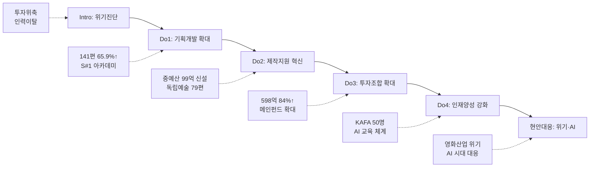

---
{"publish":true,"title":"실행(D) 작성 방안","created":"2025-12-09","modified":"2025-12-10T21:01:27.572+09:00","tags":["#경영평가","#주요사업","#제작유통활성화","#비계량","#작성방안"],"cssclasses":""}
---


# [2-1 한국영화 제작·유통 활성화] 세부평가내용 작성 방안

> [!abstract] 문서 개요
> 본 문서는 '2.1 한국영화 제작·유통 활성화' 지표의 2025년도 경영평가보고서 작성을 위한 논리적 흐름(Storyline)과 문단별 세부 작성 방안을 제안합니다.
>
> **평가내용 02**: 주요사업별 추진활동은 적절히 수행되었는가?
> **핵심 목표**: [[25년 경평/2_지표별 자료/2-1_제작유통_활성화/3_전년도_지적사항_및_개선실적\|전년도 지적사항(B0 등급)]]을 극복하고, **'영화산업 위기 대응'**과 **'AI 시대 선제적 대응'**을 통해 목표 등급(B등급 이상)을 달성하는 데 중점을 두었습니다.

---

## 📋 Do(D) 세부 구조

| 구분 | 세부 항목 |
|------|----------|
| **1. 추진활동 실적** | 가. 한국영화 기획개발 지원 확대<br>나. 중소영화 투자·제작 기반 강화<br>다. 창의인재 양성 및 현장 역량 강화<br>라. 영화영상 제작 기반 조성 및 첨단기술 확산 |
| **2. 효율성 제고 노력 및 성과** | 가. 프로세스 개선 노력과 성과<br>나. 예산절감 노력과 성과<br>다. 협업·참여·소통확대 노력과 성과 |
| **3. 모니터링 긴급현안 대응** | 가. 한국 영화산업 재도약을 위한 제작지원·투자 강화<br>나. KAFA AI 교육 체계 구축을 위한 산·학 협력 강화 |

---

## 1. Storyline 구성안 비교

### 📌 Option A: 사업 중심 구조

| 구분 | 내용 |
|------|------|
| **구조** | 기획개발 → 제작지원 → 투자조합 → 인재양성 |
| **장점** | 사업 단위로 명확하게 구분, 평가위원 친화적 |
| **단점** | 부서 간 협업 성과 표현 어려움, 현안대응 분산 |
| **적합도** | ⭐⭐ |

```
기획개발 → 제작지원 → 투자조합 → 인재양성
```

### 📌 Option B: 밸류체인 중심 구조

| 구분 | 내용 |
|------|------|
| **구조** | IP 발굴 → 제작 → 투자 → 인력양성 |
| **장점** | 영화산업 생태계 관점 강조, 연계성 표현 용이 |
| **단점** | 매뉴얼 구조와 이질적, 경영자원 효율성 배치 곤란 |
| **적합도** | ⭐⭐ |

```
IP 발굴 → 제작 → 투자 → 인력양성
```

### 📌 Option C: 하이브리드 구조 (추천)

| 구분 | 내용 |
|------|------|
| **구조** | 사업별 집행 + 현안대응 종합 섹션 |
| **장점** | 매뉴얼 평가착안사항 3가지 모두 반영, BP 가시화 |
| **단점** | 구조 다소 복잡, 분량 증가 가능성 |
| **적합도** | ⭐⭐⭐ |

```
사업별 집행(기획·제작·투자·교육) + 현안대응 종합(영화위기·AI시대)
```

---

## 2. 추천 Storyline: 위기 극복 & 미래 대응

> [!tip] 추천 구조
> **"영화산업 위기(투자위축, 인력이탈)를 공적 지원 확대로 극복하고, AI 시대 변화에 선제적으로 대응하여 K-무비 지속가능 성장 기반 마련"**하는 구조

### 전체 흐름



### 핵심 메시지

> **"기금 고갈 위기 속에서도 전입금 확보로 사업규모를 대폭 확대하고, AI 교육 등 미래 변화에 선제 대응"**

---

## 3. 문단별 작성 방안 (Do 섹션)

### 세부평가내용② 계획의 적절한 집행

#### 문단 1: 기획개발지원 사업 집행 [창작제작팀]

| 항목 | 내용 |
|------|------|
| **Core Message** | 신규·우수 IP 대량 생산을 위해 기획개발 지원 대폭 확대 |
| **주요 근거** | 141편 선정(65.9%↑), 예산 2,525백만원(60.8%↑) |
| **담당 부서** | 창작제작팀 |

| 증빙 요소 | 내용 |
|----------|------|
| 집행규모 | 작가부문 76편, 초기기획 50편, 영화화 15편 총 **141편** |
| 전년대비 | 예산 1,570→2,525백만(+60.8%), 편수 85→141편(+65.9%) |
| 신진인력 | 시나리오 공모전 963편 접수(27.9%↑), S#1 아카데미 7기 19명 배출 |
| 효율성 | 편당 평균 지원금 17.9백만원 |
| 현안대응 | 영화산업 인력이탈 → 신진인력 진입 확대 |

#### 문단 2: 제작지원 사업 집행 [창작제작팀]

| 항목 | 내용 |
|------|------|
| **Core Message** | 독립예술영화 생태계 유지 + 중예산 영화 제작지원 신규 도입 |
| **주요 근거** | 독립예술 79편, 중예산 9편/99억 |
| **담당 부서** | 창작제작팀 |

| 증빙 요소 | 내용 |
|----------|------|
| 독립예술 | 극영화 단편 24편, 장편 16편, 다큐멘터리 16편, 인큐베이팅 24편 |
| 중예산 신설 | **99.3억원 9편 선정** (순제 20~80억 규모) ⭐BP |
| 민간연계 | 메인투자 연계 9편 중 6편 완료(66.7%) |
| 현안대응 | 상업영화 투자위축 → 공적 지원 확대로 허리 강화 |
| 제도개선 | 공모횟수 확대, 제작기간 보장 등 현장 의견 반영 |

#### 문단 3: 투자조합 출자 사업 집행 [창작제작팀]

| 항목 | 내용 |
|------|------|
| **Core Message** | 민간 자본경색 상황에서 공공자금 적시 공급으로 투자 활성화 |
| **주요 근거** | 598억원 출자(84%↑), 560억원 투자집행(83건) |
| **담당 부서** | 창작제작팀 |

| 증빙 요소 | 내용 |
|----------|------|
| 출자규모 | 메인펀드 298억, 중저예산 200억, 애니메이션 200억(신규) |
| 전년대비 | 325억→598억(+84%) |
| 투자실적 | 560억원/83건 투자집행 (전년동기대비 +27%) |
| 투자성과 | <야당> 박스오피스 2위, <히트맨2> 4위 |
| 현안대응 | 팬데믹 이후 투자 위축 → 조건 합리화 및 예산 확대 |

#### 문단 4: KAFA 정규교육 집행 [정규교육팀]

| 항목 | 내용 |
|------|------|
| **Core Message** | 신진 핵심인재 양성 및 AI 시대 대응 교육체계 구축 |
| **주요 근거** | 50명 양성, 34편 제작, AI 장편랩 신설 |
| **담당 부서** | 정규교육팀 |

| 증빙 요소 | 내용 |
|----------|------|
| 운영실적 | 교육생 50명(22%↑), 제작편수 34편(13%↑) |
| 교육혁신 | AI 장편랩 신설, KAFA Actors 전담교수 운용 ⭐BP |
| 효율성 | 인당 교육비 19%↓ (제작과정 효율화) |
| 성과 | 칸영화제 라시네프 1등상, 부산국제영화제 4관왕 |
| 현안대응 | AI 교육 실태조사(최초), BIFAN AI 컨퍼런스 개최 |

#### 문단 5: 현장영화인교육 집행 [영화인교육팀]

| 항목 | 내용 |
|------|------|
| **Core Message** | 현장영화인 재교육 및 첨단영화제작 교육으로 산업 경쟁력 강화 |
| **주요 근거** | 702명 수료(148%), AI 영화 5편 제작 |
| **담당 부서** | 영화인교육팀 |

| 증빙 요소 | 내용 |
|----------|------|
| 수료실적 | 목표 475명 대비 702명 수료(148%) |
| 첨단교육 | 생성형 AI 기반 영화제작 교육, AI 영화 5편 완성 ⭐BP |
| 만족도 | 교육 만족도 4.8점/5.0점 |
| 배급실적 | KAFA 작품 극장개봉 6편, 관객 32,741명 |
| 현안대응 | AI 쇼케이스 3회 순회 (부산·수원·서울) |

---

### 세부평가내용② 경영환경 변화 대응 (종합)

#### 문단 6-1: 영화산업 위기 대응

| 항목 | 내용 |
|------|------|
| **Core Message** | 투자위축·인력이탈 등 산업 위기를 공적 지원 확대로 극복 |
| **주요 근거** | 출자 84%↑, 중예산 99억 신설, 공모 27.9%↑ |
| **담당 부서** | 창작제작팀, 정규교육팀 |

| 증빙 요소 | 내용 |
|----------|------|
| 투자위축 | 투자조합 출자 325→598억(+84%), 중예산 지원 99억 신설 |
| 인력이탈 | 시나리오 공모전 963편(+27.9%), KAFA 교육생 50명(+22%) |
| 밸류체인 | 민간투자 연계율 66.7%, 개봉 14건 등 성과 창출 |

#### 문단 6-2: AI 기술 확산 대응 ⭐BP

| 항목 | 내용 |
|------|------|
| **Core Message** | AI 시대 변화에 선제적 대응, 스토리텔링 기반 AI 교육체계 구축 |
| **주요 근거** | AI 장편랩, 첨단교육, 실태조사 |
| **담당 부서** | 정규교육팀, 영화인교육팀 |

| 증빙 요소 | 내용 |
|----------|------|
| KAFA | AI 장편랩 신설, AI 장편 애니메이션 <보랏빛 밤> 제작 중 |
| 영화인교육 | 첨단영화제작교육 신규, AI 영화 5편 완성 |
| 연구 | AI 교육 실태조사(국내 최초), BIFAN AI 컨퍼런스 개최 |
| 홍보 | AI 쇼케이스 3회, 부천AI센터 협업 홍보콘텐츠 제작 |

---

## 3-1. 사업 추진과정에서의 효율성 제고 노력 및 성과

> [!note] 구조 안내
> 2024년 경영실적보고서 기준 Do 섹션은 ①추진활동 실적 + ②효율성 제고 노력 + ③모니터링 긴급현안 대응 3개 파트로 구성

### 가. 프로세스 개선 노력과 성과

| 구분                   | 개선 노력                                                                             | 개선 효과                                                                    |
| -------------------- | --------------------------------------------------------------------------------- | ------------------------------------------------------------------------ |
| **기획개발 지원체계 개편**     | **기존**: 사업 신청→지원금 수령→시나리오 완성 일회성 지원<br>**개선**: '성장지원' 체계 도입, 선정작 대상 S#1 랩 멘토링 의무화 | • 지원주체별(작가/제작사) 사업 분리로 직관성 강화<br>• 성장지원 체계로 제작지원·역량지원 사업 간 시너지 강화        |
| **제작지원 공모체계 개선**     | **기존**: 연 1회 공모, 자기부담금 의무<br>**개선**: 연 **2회** 공모 확대, 자기부담금 **폐지**                 | • 창작자 사업 신청 제약 해소<br>• 현장 의견 반영으로 참여도 제고                                 |
| **KAFA 작품 배급 체계 개선** | **기존**: 극장 중심 배급으로 관객 접근 제한<br>**개선**: 'KAFA Films' 기획전 도입, 온라인 배급 다각화            | • 장편 **6편** 극장개봉, 관객 **32,741명**<br>• <첫여름> 단편 **17,267명** (2025년 단편 최다) |
| **국고보조금 관리 강화**      | **신규**: 전문 회계법인 검증 시스템 도입, 국고보조금 집행 가이드라인 마련                                      | • 집행 투명성 강화, 부당집행 사전 방지<br>• 보조사업자 정산 편의성 제고                             |

### 나. 예산절감 노력과 성과

| 구분                | 개선 노력                                                                                 | 개선 효과                                                  |
| ----------------- | ------------------------------------------------------------------------------------- | ------------------------------------------------------ |
| **기획개발지원 체계 개편**  | **기존**: 전작 흥행 기반 일괄 지급되는 차기작 기획개발지원<br>**개선**: 수익 발생 시 지원금 일부 회수 조항 도입 ('26년 사업요강 반영) | • 지원작 수익 발생 시 보조금 환원으로 재원 낭비 최소화<br>• 영화기금 재원 환원 구조 마련 |
| **KAFA 교육과정 효율화** | 사전제작과정·장편과정 통폐합, 장편랩 과정 신설로 그룹형 교육체계 도입                                               | • 교육과정 효율화로 예산 절감<br>• 인당 교육비 **19%↓**                 |
| **투자조합 운용 효율화**   | 투자조합 의무투자비율 합리화, 투자 조건 개선                                                             | • 운용사 부담 완화로 투자 활성화<br>• 투자금액 **560억 원**(전년동기대비 27%↑)  |

### 다. 협업·참여·소통확대 노력과 성과

| 구분 | 개선 노력 | 개선 효과 |
|------|----------|----------|
| **독립예술영화 민간협업 강화** | 독립예술영화 인큐베이팅 지원–서울독립영화제–인디그라운드 사업 간 협업<br>• KOFIC 인큐베이팅 피칭 쇼케이스 개최(서울독립영화제 부대행사) | • 민간 분야 관심 유도 및 투자 유치 기회 제공<br>• 비즈매칭 **51건** 달성 |
| **중예산 제작지원 업무협의** | 영화계 의견수렴 기반 심사제도 개선 추진<br>• '중예산영화 제작지원 파급효과' 연구 실시<br>• 「'25년 예산지원 관련 영화업계 토론회」 개최 | • 현장 수요 파악 및 산업·경제 파급효과 분석<br>• 업계 우려 해소 및 사업 참여도 증진 |
| **S#1 비즈매칭 BIFF 연계** | 부산국제영화제 ACFM 공동 개최<br>• 비즈워크 in 부산 3일간 운영 | • 미팅 **427건** 역대 최다 성사<br>• 시나리오 매매 **26건** 이상 계약 |
| **AI 교육 외부 협력** | MBC C&I 업무협약 체결, BIFAN AI 국제컨퍼런스 공동 개최<br>• 부천AI센터 협업 홍보콘텐츠 제작 | • AI 영화제작 전문인력 양성<br>• AI 교육 산업계 확산 기반 마련 |

---

## 3-2. 모니터링을 통한 긴급현안 대응 노력

### 가. 한국 영화산업 재도약을 위한 제작지원·투자 강화

| 구분 | 내용 |
|------|------|
| **점검채널** | 분야별 간담회(투자배급사·창투사·제작사·IPTV·OTT) 및 협·단체 간담회, 문체부 업무보고 및 현안 논의 |
| **점검내용 및 이슈** | • (핵심이슈 인식) 한국 영화산업 침체 장기화로 제작시장 위축, 독립·예술영화 중심 지원 체계 탈피 필요<br>• (경영환경 변화) 영화상영관입장권 부과금 폐지 위기로 기금 고갈 상황, 신규 재원 확보 필요 |

#### 긴급현안 발생 및 해결 노력

| 현안과제 | 해결 노력 |
|---------|----------|
| • 중예산 제작지원 사업('25년 신설) 정부안 반영, 안정적 설계를 위한 긴급 현장 의견수렴 필요<br>• 민생 안정을 위한 부담금 징수 폐지 정책으로 영화기금 유일 자체수입인 '영화상영관입장권 부과금' 폐지 위기 | **현장 의견수렴**<br>• 투자배급사(CJ ENM, 롯데엔터), 창투사, IPTV, 제작사, K-OTT, 창작·제작 관련 단체 대상 설명회<br>• 중예산영화 제작지원 사업 추진 경과, 민간투자 활성화 목적 및 개봉수익 환원 조항 설명<br><br>**투자재원 확보**<br>• 문체부·기재부 대상 업무협의, 영상전문펀드 운용 실적 바탕 한국영화 공적투자 확대 필요성 제기<br>• 영화계정 출자금 국고 편성 요청 |

#### 추진성과

| 성과 | 내용 |
|------|------|
| 중예산 제작지원 | **99.3억 원** 규모 사업계획 확정, 현장 의견 반영으로 업계 우려 해소 |
| 투자재원 확보 | 영화계정 출자금 국고 편성, **325억 원** 확보로 영화산업 공적자금 지속 공급 |
| 베를린영화제 | 중예산 지원작 <내 이름은> **베를린영화제 공식초청** 확정 |

---

### 나. KAFA AI 교육 체계 구축을 위한 산·학 협력 강화

| 구분 | 내용 |
|------|------|
| **점검채널** | AI 교육 실태조사, KAFA×BIFAN AI 국제컨퍼런스, MBC C&I 업무협약 |
| **점검내용 및 이슈** | • (핵심이슈 인식) AI 등 신기술 전방위 확산에 따른 영화영상 교육 대응 필요<br>• (경영환경 변화) 기술중심 AI 영화 관행 → 스토리텔링 기반 AI 교육 체계 구축 필요 |

#### 긴급현안 발생 및 해결 노력

| 현안과제                                              | 해결 노력                                                                                                                                                                                                                                                   |
| ------------------------------------------------- | ------------------------------------------------------------------------------------------------------------------------------------------------------------------------------------------------------------------------------------------------------- |
| • 국내 영화영상 AI 교육 체계 부재<br>• AI 기술 활용 영화제작 인력 양성 필요 | **AI 교육 실태조사**<br>• 전국 영상 관련 학과 AI 교육 실태조사 보고서 발간 (**국내 최초**, 2025.6월)<br><br>**AI 국제컨퍼런스**<br>• KAFA×BIFAN AI 국제컨퍼런스 개최 (2025.7월)<br>• "AI 교육: 창작의 미래를 묻다" 주제 논의<br><br>**AI 장편영화 교육**<br>• KAFA LAB AI 장편영화 제작 커리큘럼 개발<br>• AI 장편 애니메이션 <보랏빛 밤> 제작 추진 |

#### 추진성과

| 성과 | 내용 |
|------|------|
| AI 교육 선도 | 국내 영화학교 **최초** AI 장편영화 교육 체계 구축 |
| AI 단편영화 제작 | 첨단영화제작교육 통해 AI 단편 **5편** 제작 완료 |
| AI 쇼케이스 | 전국 **3회** 쇼케이스 개최 (부산·수원·서울) |
| 교육 만족도 | **4.8점/5.0점** (매우 우수) |

---

## 4. 차별화 포인트

### 가. 전년도 B등급(지적사항) 개선 전략

| 지적사항        | 개선 방안                       | 핵심 성과                   |
| ----------- | --------------------------- | ----------------------- |
| 추진계획 구체성 미흡 | **환경분석 기반** 3대 핵심사업 전략체계 수립 | 성과목표 명확화, PDCA 환류체계 구축  |
| 질적 성과 제시 부족 | **영화제 수상** 등 질적 지표 관리       | 칸영화제 1등상, 박스오피스 2·4위    |
| 기획개발 확대 필요  | **기획개발 지원** 대폭 확대           | 141편(65.9%↑), 예산 60.8%↑ |
| 환류활동 체계 미흡  | **'26년 사업요강** 개선 반영         | 신규사업 설계, 예산 141.1%↑ 확보  |

### 나. 영화산업 위기 대응 모델

| 영역 | 위기 요인 | 대응 전략 | 성과 |
|------|----------|----------|------|
| 투자 | 민간 자본경색 | 투자조합 84%↑, 조건 합리화 | 560억/83건 투자 |
| 제작 | 상업영화 급감 | 중예산 지원 99억 신설 | 9편 선정, 민간연계 66.7% |
| 인력 | 타 산업 이탈 | 기획개발 65.9%↑, 교육 확대 | 공모 963편, KAFA 50명 |
| 기술 | AI 기술 확산 | AI 교육체계 구축 | AI 영화 5편, 장편랩 신설 |

---

## 5. 작성 시 유의사항

### 가. 매뉴얼 평가착안사항 대응

> [!warning] 필수 확인
> Do 섹션은 3가지 평가착안사항을 모두 반영해야 함

| 평가착안사항        | 대응 내용                                 |
| ------------- | ------------------------------------- |
| ① 추진계획 적절 집행  | 기획개발 141편, 제작지원 88편, 투자조합 598억 등 집행실적 |
| ② 경영자원 효율 활용  | 편당 지원금 17.9백만, 인당 교육비 19%↓ 등 효율성 지표   |
| ③ 현안과제 대응 적절성 | 영화산업 위기 대응, AI 시대 선제적 대응 종합 섹션        |

### 나. 정량 데이터 활용

> [!success] 핵심 정량지표
> - 기획개발: **141편** (65.9%↑)
> - 제작지원: 독립예술 **79편**, 중예산 **9편/99억**
> - 투자조합: **598억** (84%↑)
> - KAFA: **50명**, **34편**, 칸영화제 **1등상**
> - 영화인교육: **702명** (148%), AI 영화 **5편**

### 다. BP(Best Practice) 강조

| BP 후보 | 내용 | 강조 포인트 |
|---------|------|-----------|
| 중예산 지원 | 99억 신규사업 | 영화산업 위기 대응 핵심 정책 |
| AI 장편랩 | KAFA 신규과정 | 스토리텔링 기반 AI 교육 최초 |
| 첨단교육 | AI 영화 5편 | 생성형 AI 활용 실전 교육 |

---

## 📊 부서별 실행(Do) 세부 내용

### 창작제작팀 - 기획개발·제작지원·투자조합 집행 실적

#### 기획개발지원 단계별 집행 실적

| 사업명 | '24년 예산/편수 | '25년 예산/편수 | 증감률 |
|--------|---------------|---------------|-------|
| **작가 부문** | 570백만 원 / 50편 | 760백만 원 / 76편 | 예산 33.3%↑, 편수 52.0%↑ |
| **초기기획** | 500백만 원 / 25편 | 1,000백만 원 / 50편 | 예산 100.0%↑, 편수 100.0%↑ |
| **영화화** | 500백만 원 / 10편 | 765백만 원 / 15편 | 예산 53.0%↑, 편수 50.0%↑ |
| **합계** | 1,570백만 원 / 85편 | 2,525백만 원 / 141편 | **전년대비 65.9%↑** |

#### 신진인력 양성 프로그램 실적

| 프로그램 | 실적 | 성과 |
|---------|------|------|
| **시나리오 공모전** | 963편 접수 (전년대비 27.9%↑) | 14편 선정, 시상금 102백만 원 |
| **S#1 시나리오 아카데미** | 7기 졸업작가 19명 배출 | 6개월 교육과정 + 창작개발금 지원 |
| **신진 제작자 인큐베이팅** | 14편 선발 **(신규)** | S#1 랩 연계 작품개발 |

#### 독립예술영화 제작지원 집행 실적

| 부문 | 신청건수 | 선정건수 | 지원금액 | 선정률 |
|------|---------|---------|---------|-------|
| 극영화(단편) | 497 | 24 (최종23) | 401백만 원 | 4.8% |
| 극영화(장편) | 482 | 16 | 5,272백만 원 | 3.3% |
| 다큐멘터리 | 156 | 16 | 993백만 원 | 10.0% |
| 인큐베이팅 | 168 | 24 | 240백만 원 | 14.3% |
| **합계** | 1,303 | 79 | 6,906백만 원 | - |

#### 중예산 한국영화 제작지원 집행 실적 ⭐신규

| 구분 | 실적 |
|------|------|
| 지원예산 | **99.3억 원** |
| 최종선정편수 | **9편** |
| 순제 20~30억 미만 | 2편 |
| 순제 30~60억 미만 | 5편 |
| 순제 60~80억 미만 | 2편 |
| 메인투자 연계 | 9편 중 **6편 완료** (66.7%) |

#### 투자조합 출자 집행 실적

| 구분 | '24년 | '25년 | 증감 |
|------|-------|-------|------|
| 총 출자예산 | 325억 원 | 598억 원 | **+84%** |
| 메인펀드 | 210억 원 | 298억 원 (재출자 포함) | +42% |
| 중저예산펀드 | 115억 원 | 200억 원 | +74% |
| 애니메이션펀드 | - | 200억 원 **(신규)** | - |

| 지표 | 실적 | 전년동기대비 |
|------|------|------------|
| 총 투자금액 | **560억 원 (83건)** | +27%↑ |
| 한국영화 투자 | 11개 조합 운용 중 | - |

---

### 정규교육팀 - KAFA 정규과정·장편과정 집행 실적

#### 교육과정 로드맵 재정비

| 과정명 | 교육단계 | 교육내용 |
|--------|---------|---------|
| **정규과정** | 베이직 | 전공 간 협업을 통한 단편영화 제작교육 |
| **장편과정** | 심화 | 장편영화 제작교육 (완성도 제고) |
| **장편랩** | 랩 | 장편영화 제작교육 (새로운 서사, 신기술 적용) |
| **KAFA Actors** | 프로그램 | 영화·영상 연기 전문/메커니즘 이해 교육 |

#### 정규과정 운영 실적

| 영역 | 추진내용 | 성과 |
|------|---------|------|
| **입시체계 고도화** | 연출 전공 실기면접 실시, PD 전공 지원서류 기획서 추가, 전공별 모집설명 영상 제작 | 26학년도 지원자 접수율 전년대비 **65%↑** |
| **교육품질 제고** | 사운드 전공 담당교수 운영, 연출/PD 전공 장편 기획 교육 확대, 수업 확대 ('24년 109개 → '25년 113개) | 전공 심화를 통한 실질적 제작 역량 강화 |
| **제작관리 강화** | 교수진/담당자 정기회의, 의무교육 확대 (세무/노무/인티머시 신규), 촬영현장 방문 확대 | 안정적인 제작환경 확립 |

#### 장편과정 운영 실적

| 부문 | 추진내용 | 성과 |
|------|---------|------|
| **실사극** | 학사일정 조정 (입학 2개월 조기), 촬영시기 다변화, 후반작업 기간 확대 | 18기 3편 완성 및 배급 진행, **부산국제영화제 4관왕** |
| **애니메이션** | 단계별 교육 전면 개편, 기획 PT 및 통합 크리틱 도입, 제작점검 평가표 도입 | 15기~18기 5편 메인 프로덕션 관리 ('26년 상반기 3편 완성 예정) |

#### KAFA LAB 운영 실적 ⭐신규

| 과정 | 추진내용 | 성과 |
|------|---------|------|
| **장편랩** | AI 영화 교육 신설 ('24년 1개팀 → '25년 2개팀), 학사일정 조정, AI 영화 커리큘럼 개발 | AI 장편 애니메이션 <보랏빛 밤> 제작 추진 ('26년 상반기 완성 목표) |
| **KAFA Actors** | 학사일정 조정, 작품분석·연기멘토링·제작워크숍 확대, 산업 관계자 네트워킹 | 영화영상 이해도 높은 배우 6명 양성, KAFA 실습작품 15편 주·조연 참여 |

#### 창·제작 환경변화 대응 ⭐신규

| 구분 | 추진내용 | 성과 |
|------|---------|------|
| **AI 교육 실태조사** | 전국 영상 관련 학과 AI 교육 실태조사 보고서 발간 ('25.6월) | 국내 영화영상 AI 교육 실태 조사 **최초** 시행 |
| **KAFA×BIFAN AI 컨퍼런스** | AI 교육: 창작의 미래를 묻다 국제컨퍼런스 개최 ('25.7월) | AI 교육현황 분석, 영화와 AI 기술 공생방안 논의 |
| **AI 장편영화 교육** | KAFA 실습중심 교육 노하우 기반 AI 영화제작 커리큘럼 개발 | 기술중심 AI 영화 관행 보완, 스토리텔링 기반 AI 장편 영화 교육체계 마련 |
| **미디어 환경 변화 대응** | KAFA+Netflix 리부트캠프 개최 ('25.1월), 할리우드 강사 초청 교육 | 글로벌 OTT 제작환경 이해도 향상, 기획 능력 함양 |

---

### 영화인교육팀 - 현장영화인 교육 집행 실적

#### KAFA+영화인교육 집행 실적

| 과정 유형 | 교육시간 | 교육인원 목표 | 실적 |
|----------|---------|-------------|------|
| **정규과정** | 210시간 | 475명 | 702명 |
| **특화과정** | 119시간 | 475명 | - |
| **온라인교육** | 7개 과정 | - | 1,571명 학습 |

#### 정규과정 세부 구성 (15개 과정)

- **제작인력 양성과정** (6개): 연출부/제작부/촬영부 Step1,2
- **직무/인사이트 과정** (6개): 영상 색보정, 후반작업, 프로젝트 개발 등
- **KOFIC TALK** (3개, 신규): 칸 필름마켓 리뷰, 한국영화 산업 결산, 저작권 분쟁

#### 특화과정 세부 구성 (15개 과정, 신규)

| 분야 | 과정 수 | 주요 내용 |
|------|--------|----------|
| AI 기술활용 | 8개 | AI 영화기술 현황, 워크숍, 포럼 등 |
| 글로벌 교육 | 3개 | 10개국 해외진출 노하우 (홍콩, 중국, 대만, 베트남 등) |
| ESG 교육 | 2개 | 근로계약, 영화산업 안전보건체계 |
| 현장실습 | 2개 | 수중촬영, VP촬영 등 |

#### 첨단영화제작교육(AI) 집행 실적 ⭐신규

| 항목 | 내용 |
|------|------|
| 협력기관 | MBC C&I (업무협약) |
| 교육 기간 | 6월~9월 (약 4개월) |
| 교육 인원 | 목표 15명 / 실적 13명 (86.7%) |
| 만족도 | **4.8점/5.0점** |

**AI 영화제작 파이프라인 교육**
- 이론교육 & 피칭 → 프리프로덕션 → 프로덕션 → 포스트프로덕션 → 배급
- 생성형 AI 도구 활용: 미드저니, 카탈리스트, 동영상/사운드 생성 등
- **5편 AI 단편영화 제작** 완료

**AI 쇼케이스 개최**

| 행사 | 일시 | 장소 |
|------|------|------|
| 부산 AI 쇼케이스 | 9.20~9.21 | 부산 표준시사실 |
| 대한민국 AI 콘텐츠 페스타 | 9.26~9.27 | 수원 컨벤션센터 |
| 서울 AI 쇼케이스 | 11.11 | 한국영상자료원 |

#### KAFA 작품 배급운영 실적

| 작품명 | 개봉일 | 개봉관수 | 관객수 |
|--------|--------|---------|--------|
| 은빛살구 | 1.15 | 40개관 | 3,619명 |
| 프랑켄슈타인 아버지 | 4.2 | 72개관 | 2,380명 |
| 보이 인 더 풀 | 5.14 | 68개관 | 5,161명 |
| 된장이 | 7.2 | 52개관 | 3,284명 |
| **첫여름 (단편)** | 8.6 | 59개관 | **17,267명** |
| 넌센스 | 11.26 | 54개관 | 1,030명+ |
| **합계** | - | **345개관** | **32,741명** |

> ✅ <첫여름> KAFA 최초 단편영화 극장개봉, 2025년 단편 개봉작 최다관객 기록!

---

## 🔗 관련 자료

| 구분 | 문서명 | 비고 |
|------|--------|------|
| 편람 분석 | [[25년 경평/2_지표별 자료/1-9_노사관계/2_편람_내용_분석]] | 세부평가 요소별 가이드 |
| 지적사항 | [[25년 경평/2_지표별 자료/2-1_제작유통_활성화/3_전년도_지적사항_및_개선실적]] | C등급 원인 및 개선방향 |
| 부서 매핑 | [[25년 경평/2_지표별 자료/2-1_제작유통_활성화/부서별 실적 분석/창작제작팀 실적 분석]], [[25년 경평/2_지표별 자료/2-1_제작유통_활성화/부서별 실적 분석/정규교육팀 실적 분석]], [[25년 경평/2_지표별 자료/2-1_제작유통_활성화/부서별 실적 분석/영화인교육팀 실적 분석]] | 부서별 실적 종합 |
| 목차구성안 | [[25년 경평/2_지표별 자료/1-9_노사관계/1_목차_구성안]] | 전체 목차 구조 |

---

*작성일: 2025-12-09*
*검증상태: 부서성과평가 원본 대조 완료*
