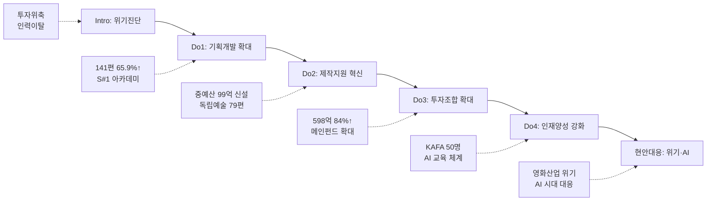

---
{"publish":true,"title":"2-1 실행(D) 작성 방안","created":"2025-12-09","modified":"2025-12-12T00:36:22.622+09:00","tags":["#경영평가","#주요사업","#제작유통활성화","#Do","#작성방안"],"cssclasses":""}
---

# [2-1 한국영화 제작·유통 활성화] 실행(D) 작성 방안

> [!abstract] 문서 개요
> 본 문서는 '2.1 한국영화 제작·유통 활성화' 지표의 2025년도 경영평가보고서 작성을 위한 논리적 흐름(Storyline)과 문단별 세부 작성 방안을 제안합니다.
>
> **평가내용 02**: 주요사업별 추진활동은 적절히 수행되었는가?
> **핵심 목표**: [[25년 경평/2_지표별 자료/2-1_제작유통_활성화/3_전년도_지적사항_및_개선실적\|전년도 지적사항(B0 등급)]]을 극복하고, **'영화산업 위기 대응'**과 **'AI 시대 선제적 대응'**을 통해 목표 등급(B등급 이상)을 달성하는 데 중점을 두었습니다.

---

## 1. 개요

### 1.1 Do 세부 구조

> [!tip] Do 섹션 작성 가이드
> **이 섹션의 목적**: Plan에서 세운 계획을 **얼마나 잘 실행했는지** 보여주는 부분입니다.
> 
> **핵심 질문**: "계획대로 했나요? 효율적으로 했나요? 문제는 어떻게 해결했나요?"
> 
> **Do 섹션의 3가지 평가착안사항**:
> 1. **추진활동 실적**: 계획한 사업을 제대로 집행했는가?
> 2. **효율성 제고**: 자원(예산, 인력)을 효율적으로 활용했는가?
> 3. **긴급현안 대응**: 예상치 못한 문제에 적절히 대응했는가?
> 
> **작성 팁**: 숫자와 증빙이 핵심! 모든 실적에 **정량 데이터** 포함

| 구분                    | 세부 항목                                                                                            |
| --------------------- | ------------------------------------------------------------------------------------------------ |
| **1. 추진활동 실적**        | 가. 한국영화 기획개발 지원 확대 나. 중소영화 투자·제작 기반 강화 다. 창의인재 양성 및 현장 역량 강화 라. 영화영상 제작 기반 조성 및 첨단기술 확산 |
| **2. 효율성 제고 노력 및 성과** | 가. 프로세스 개선 노력과 성과 나. 예산절감 노력과 성과 다. 협업·참여·소통확대 노력과 성과                                      |
| **3. 모니터링 긴급현안 대응**   | 가. 한국 영화산업 재도약을 위한 제작지원·투자 강화 나. KAFA AI 교육 체계 구축을 위한 산·학 협력 강화                               |

---

### 1.2 추천 Storyline: 위기 극복 & 미래 대응

> [!tip] 작성 가이드
> **"영화산업 위기(투자위축, 인력이탈)를 공적 지원 확대로 극복하고, AI 시대 변화에 선제적으로 대응하여 K-무비 지속가능 성장 기반 마련"**하는 구조

#### 전체 흐름

#### 핵심 메시지

> **"기금 고갈 위기 속에서도 전입금 확보로 사업규모를 대폭 확대하고, AI 교육 등 미래 변화에 선제 대응"**

---

## 2. 추진활동 실적

> [!tip] 작성 가이드
> **이 섹션의 목적**: 각 사업별로 **무엇을 어떻게 했는지** 구체적으로 서술합니다.
> 
> **문단 구성 원칙**:
> 1. **Core Message**: 이 사업의 핵심 성과를 한 줄로 요약
> 2. **주요 근거**: 핵심 수치 (편수, 예산, 증감률 등)
> 3. **추진 실적 및 성과**: 세부 실적, 전년 대비, 효율성, 현안대응 등
> 
> **작성 팁**:
> - 모든 수치에 **전년대비 증감률** 포함
> - **신규** 사업은 반드시 강조 표시
> - **현안대응** 연결고리 명시 (왜 이 사업을 했는지)

> [!abstract] 성과목표별 문단 구조 (총 14개)
> 
> **성과목표① 한국영화 창작·제작 기반 강화** (7개 문단)
> - 문단 1~3: 기획개발지원 (작가부문, 제작사부문, 신진인력양성)
> - 문단 4~5: 제작지원 (독립예술영화, 중예산영화)
> - 문단 6: 투자조합 출자
> - 문단 7: 영화산업 위기 대응 종합
> 
> **성과목표② 핵심인재 발굴 육성 및 산업 인프라 조성** (7개 문단)
> - 문단 8~10: KAFA 정규교육 (정규과정, 장편과정, AI장편랩)
> - 문단 11~12: 현장영화인교육 (KAFA+, 첨단AI교육)
> - 문단 13: KAFA 작품 배급운영
> - 문단 14: AI 기술 확산 대응 종합

---

### 2.1 성과목표① 한국영화 창작·제작 기반 강화 (문단 1~7)

> [!tip] 성과목표① 개요
> **담당부서**: 창작제작팀
> **핵심 목표**: 영화산업 위기 속 창작·제작 생태계 유지 및 강화
> **주요 사업**: 기획개발지원, 제작지원, 투자조합 출자

---

#### 문단 1: 기획개발지원 - 작가부문 [창작제작팀]

| 항목 | 내용 |
|------|------|
| **Core Message** | 우수 IP 발굴을 위한 작가 중심 기획개발 지원 확대 |
| **주요 근거** | 작가부문 76편 선정(52.0%↑), 예산 760백만원(33.3%↑) |
| **담당 부서** | 창작제작팀 |

| 구분         | 실적                        | 성과                        |
| ---------- | ------------------------- | ------------------------- |
| 작가부문 지원    | 76편 선정, 760백만원 집행         | 전년대비 편수 52.0%↑, 예산 33.3%↑ |
| 1단계(트리트먼트) | 52편 선정 (경력초기 26편, 기성 26편) | 3개월간 시나리오 초고 개발           |
| 2단계(초고개발)  | 24편 선정 (경력초기 12편, 기성 12편) | 3개월간 시나리오 2고 개발           |
| S#1 랩 연계   | 멘토링 3회, 미팅레슨 운영           | 작품개발 지속 지원 체계 구축          |
| S#1 비즈매칭   | 비즈워크 part2 개최 (9/30)      | 41개 지원작, 134건 미팅 성사       |
|            |                           |                           |

> [!example] 추천 스토리라인
> **"창작환경 실태조사 기반 사업규모 재조정 → 작가부문 지원 대폭 확대(52%↑) → S#1 랩 연계 성장지원 체계 구축 → 비즈매칭을 통한 산업 연계 강화"**
> 
> - 도입: 영화산업 인력이탈 및 작가 처우 열악 상황에서 창작기반 확보 필요성 대두
> - 전개: 창작환경 실태조사('24년 연구보고서) 기반 사업규모 재조정, 편수 확대로 더 많은 창작자에게 기회 제공
> - 성과: 76편 지원으로 신규·우수 IP 대량 생산 기반 마련, S#1 비즈워크 134건 미팅 성사로 영화화 가능성 제고

---

#### 문단 2: 기획개발지원 - 제작사부문 [창작제작팀]

| 항목 | 내용 |
|------|------|
| **Core Message** | 제작사 기반 기획개발로 제작 연계 가능성 제고 |
| **주요 근거** | 초기기획 50편(100%↑), 영화화 15편(50%↑) |
| **담당 부서** | 창작제작팀 |

| 구분 | 실적 | 성과 |
|------|------|------|
| 초기기획 | 50편 선정, 1,000백만원 집행 | 전년대비 편수 100%↑, 예산 100%↑ |
| 영화화 | 15편 선정, 765백만원 집행 | 전년대비 편수 50%↑, 예산 53%↑ |
| 부문 세분화 | 트리트먼트 25편 / 시나리오 초고 25편 | 제작사 기획개발 단계별 맞춤 지원 체계 마련 |
| 영화화 조건완화 | OTT 경력 인정, 지원이력 작품 일부 인정 | 영화화 가능성 제고 |
| 투자자 연계 | 투자자 업무 미팅 지원(업추비 허용) | 펀딩&패키징 단계 집중 지원 |

> [!example] 추천 스토리라인
> **"기획개발 단계별 맞춤형 지원체계 마련 → 초기기획·영화화 사업 대폭 확대(100%↑, 50%↑) → 영화화 조건 완화로 제작 연계 가능성 제고"**
> 
> - 도입: 제작비 상승으로 기획개발 단계 리스크 증가, 역량있는 제작사의 IP 개발지원 환경 필요
> - 전개: 지원주체별(작가/제작사) 사업 분리로 직관성 강화, 부문 세분화로 단계별 맞춤 지원
> - 성과: 초기기획 100% 증가, 영화화 조건 완화(OTT 경력 인정)로 민간투자 연계 기반 마련

---

#### 문단 3: 신진인력 양성 [창작제작팀]

| 항목 | 내용 |
|------|------|
| **Core Message** | 시나리오 공모전·아카데미로 신진 창작인력 진입 확대 |
| **주요 근거** | 공모전 963편(27.9%↑), S#1 아카데미 19명 배출 |
| **담당 부서** | 창작제작팀 |

| 구분 | 실적 | 성과 |
|------|------|------|
| 시나리오 공모전 | 963편 접수, 14편 선정 | 전년대비 지원율 27.9%↑, 시상금 102백만원 |
| 시상금 확대 | 대상 17백만→30백만원 | 공모전 위상 제고, 우수 신인작가 발굴 |
| S#1 아카데미 | 7기 19명 졸업작가 배출 | 6개월 교육+창작개발금(인당 13.2백만원) |
| 신진제작자 인큐베이팅 | 14편 선발 (신규사업) | S#1 랩 연계 작품개발 |
| S#1 비즈워크 | 총 3회 개최, 105개 작품 매칭 | **427건** 미팅 성사 (역대 최다, 전년대비 123.6%↑) |

> [!example] 추천 스토리라인
> **"공모전 시상금 확대(30백만원) → 지원율 27.9% 증가 → S#1 아카데미 연계 육성 → 비즈워크 427건 역대 최다 미팅 성사 → 신인작가 크레딧 데뷔 성과"**
> 
> - 도입: 영화산업 인력 타 산업 이탈 가속화, 신진인력 진입 한계 개선 필요
> - 전개: 공모전 위상 제고(시상금 확대), S#1 아카데미 체계적 교육, 비즈워크 전면 개편(연 1회→3회)
> - 성과: S#1 졸업작가 <홈캠> 극장개봉(관객 100,011명), 졸업작가 JTBC 극본 데뷔, 공모전 수상작 3건 개봉

---

#### 문단 4: 독립예술영화 제작지원 [창작제작팀]

| 항목 | 내용 |
|------|------|
| **Core Message** | 독립예술영화 생태계 유지 및 창작 다양성 확보 |
| **주요 근거** | 79편 선정, 6,906백만원 지원 |
| **담당 부서** | 창작제작팀 |

| 구분 | 실적 | 성과 |
|------|------|------|
| 극영화 단편 | 24편 선정, 401백만원 | 신청 497건 (전년대비 33.6%↑) |
| 극영화 장편 | 16편 선정, 5,272백만원 | 신청 482건 (전년대비 61.2%↑) |
| 다큐멘터리 | 16편 선정, 993백만원 | 신청 156건 (전년대비 54.5%↑) |
| 인큐베이팅 | 24편 선정, 240백만원 | 서울독립영화제 연계 피칭 쇼케이스 |
| 공모횟수 확대 | 연 1회→2회 (장편/다큐) | 제작 수요에 맞는 시기적절한 지원 |
| 자기부담금 폐지 | 10% 의무→폐지 | 어려운 영화산업계 부담 완화 |

> [!example] 추천 스토리라인
> **"현장 의견수렴 기반 제도개선(공모 2회, 자기부담금 폐지) → 신청 수요 대폭 증가(장편 61.2%↑) → 79편 지원으로 독립예술영화 생태계 유지 → 인큐베이팅-피칭 쇼케이스 연계 투자유치 기회 제공"**
> 
> - 도입: 상업영화 제작편수 급감 속 독립예술영화 신청 수요 증가(장편 61.2%↑, 다큐 54.5%↑)
> - 전개: 현장 의견 반영 제도개선(공모횟수 확대, 자기부담금 폐지, 제작기간 보장)
> - 성과: 79편 선정으로 창작 다양성 확보, 인큐베이팅 지원작 51건 비즈매칭 달성

---

#### 문단 5: 중예산 한국영화 제작지원 [창작제작팀] ⭐신규

| 항목 | 내용 |
|------|------|
| **Core Message** | 민간투자 활성화를 위한 중예산 영화 공적지원 신규 도입 |
| **주요 근거** | 99.3억원 9편 선정, 메인투자 연계 66.7% |
| **담당 부서** | 창작제작팀 |

| 구분 | 실적 | 성과 |
|------|------|------|
| 지원예산 | 99.3억원 (2025년 신규사업) | 순제 20~80억 규모 중예산 영화 직접지원 |
| 순제 20~30억 미만 | 2편 선정 | 민간투자 촉진형 공적지원 |
| 순제 30~60억 미만 | 5편 선정 | 한국영화 허리 강화 |
| 순제 60~80억 미만 | 2편 선정 | 대형상업영화 연계 기반 |
| 메인투자 연계 | 9편 중 6편 완료 | 민간투자 연계율 **66.7%** |
| 현장 의견수렴 | 투자배급사·제작사 간담회, 토론회 | 업계 우려 해소, 참여도 증진 |

> [!example] 추천 스토리라인
> **"영화산업 위기 진단 → 긴급 현장 의견수렴 → 중예산 제작지원 99억 신규사업 설계 → 9편 선정/민간연계 66.7% → 베를린영화제 공식초청 성과"**
> 
> - 도입: 한국 영화산업 침체 장기화, 독립·예술영화 중심 지원 체계 탈피 필요, 중예산 영화 제작 위축
> - 전개: 투자배급사(CJ ENM, 롯데엔터), 창투사, 제작사 대상 긴급 의견수렴, 우선손실충당형 직접지원 설계
> - 성과: 9편 선정 중 6편 메인투자 연계(66.7%), 지원작 <내 이름은> **베를린영화제 공식초청** 확정

---

#### 문단 6: 투자조합 출자 [창작제작팀]

| 항목 | 내용 |
|------|------|
| **Core Message** | 민간 자본경색 상황에서 공공자금 적시 공급으로 투자 활성화 |
| **주요 근거** | 598억원 출자(84%↑), 560억원/83건 투자집행 |
| **담당 부서** | 창작제작팀 |

| 구분 | 실적 | 성과 |
|------|------|------|
| 메인펀드 | 298억원 출자 (재출자 포함) | 전년대비 42%↑ |
| 중저예산펀드 | 200억원 출자 | 전년대비 74%↑ |
| 애니메이션펀드 | 200억원 출자 (신규) | K-애니 제작투자 기반 마련 |
| 총 출자규모 | 325억→598억원 | 전년대비 **84%↑** |
| 투자집행 | 560억원 / 83건 | 전년동기대비 **27%↑** |
| 투자성과 | <야당> 박스오피스 2위, <히트맨2> 4위 | 11개 조합 운용 중 |

> [!example] 추천 스토리라인
> **"기금고갈 위기 속 국고 편성 325억 확보 → 투자조합 출자 84% 대폭 확대 → 의무투자비율 합리화 → 560억/83건 투자집행(27%↑) → 박스오피스 성과 창출"**
> 
> - 도입: 영화상영관입장권 부과금 폐지 위기, 민간 자본경색 심화
> - 전개: 문체부·기재부 대상 업무협의, 영화계정 출자금 국고 편성 요청, 투자 조건 합리화
> - 성과: 598억 출자(84%↑), 560억/83건 투자집행, <야당> 박스오피스 2위 등 흥행 성과

---

#### 문단 7: 영화산업 위기 대응 종합 [창작제작팀]

| 항목 | 내용 |
|------|------|
| **Core Message** | 투자위축·인력이탈 등 산업 위기를 공적 지원 확대로 극복 |
| **주요 근거** | 출자 84%↑, 중예산 99억 신설, 공모 27.9%↑ |
| **담당 부서** | 창작제작팀 |

| 구분 | 실적 | 성과 |
|------|------|------|
| 투자위축 대응 | 투자조합 598억 출자(84%↑), 조건 합리화 | 560억/83건 투자, 박스오피스 2·4위 |
| 제작위축 대응 | 중예산 제작지원 99억 신설 | 9편 선정, 민간연계 66.7%, 베를린 초청 |
| 인력이탈 대응 | 기획개발 141편(65.9%↑), 공모전 963편 | 신진인력 진입 확대, 크레딧 데뷔 성과 |
| 재원확보 | 영화계정 출자금 국고 편성 | **325억 원** 확보 |
| 현장 의견수렴 | 분야별 간담회, 영화업계 토론회 | 업계 우려 해소, 정책 수용성 제고 |

> [!example] 추천 스토리라인
> **"영화산업 위기 진단(투자위축·제작급감·인력이탈) → 3대 영역별 대응 전략 수립 → 공적 지원 대폭 확대(출자 84%↑, 기획개발 65.9%↑, 중예산 99억 신설) → 민간투자 연계 성과 창출"**
> 
> - 도입: 팬데믹 이후 영화산업 위기 지속(민간투자 위축, 상업영화 급감, 인력 타산업 이탈)
> - 전개: 분야별 간담회(투자배급사·창투사·제작사·IPTV·OTT) 통해 현장 의견 수렴, 3대 영역별 대응
> - 성과: 투자 560억/83건, 제작지원 88편, 기획개발 141편 → 밸류체인 전 단계 공적 지원 확대로 산업 선순환 구조 마련

---

### 2.2 성과목표② 핵심인재 발굴 육성 및 산업 인프라 조성 (문단 8~14)

> [!tip] 성과목표② 개요
> **담당부서**: 정규교육팀, 영화인교육팀
> **핵심 목표**: AI 시대 대응 영화인재 양성 및 교육 인프라 구축
> **주요 사업**: KAFA 정규교육, 현장영화인교육, 작품 배급운영

---

#### 문단 8: KAFA 정규과정 [정규교육팀]

| 항목 | 내용 |
|------|------|
| **Core Message** | 전공 간 협업 기반 단편영화 제작교육으로 신진 핵심인재 양성 |
| **주요 근거** | 교육생 50명(22%↑), 26학년도 지원율 65%↑ |
| **담당 부서** | 정규교육팀 |

| 구분 | 실적 | 성과 |
|------|------|------|
| 교육생 양성 | 26명 (5개 전공) | 전년대비 22%↑ |
| 실습작품 제작 | 22편 제작 (후반작업 중) | 전공 간 협업 강화 |
| 입시체계 고도화 | 연출 실기면접, PD 기획서 추가 | 26학년도 지원율 **65%↑** |
| 수업 확대 | 109개→113개 (4개 신규) | 전공역량 심화 커리큘럼 |
| 전공심화 | 사운드 담당교수, 장편기획 교육 확대 | 실질적 제작역량 강화 |
| 제작관리 강화 | 세무/노무/인티머시 의무교육 신규 | 촬영현장 8개팀 방문 점검 |

> [!example] 추천 스토리라인
> **"교육과정 로드맵 재정비(베이직→심화→랩) → 입시체계 고도화(지원율 65%↑) → 전공역량 심화 커리큘럼 운영 → 22편 실습작품 제작 → <첫여름> 칸영화제 1등상 수상"**
> 
> - 도입: 교육과정 체계적 구조화 필요, 도전적 목표설정 요구(전년도 지적사항)
> - 전개: 정규(베이직)-장편(심화)-장편랩(도전) 로드맵 재정비, 전공별 담당교수 운영
> - 성과: 26명 핵심인재 양성, 실습작품 22편 제작, 칸영화제 라시네프 1등상(세계 최고 학생영화)

---

#### 문단 9: KAFA 장편과정 [정규교육팀]

| 항목 | 내용 |
|------|------|
| **Core Message** | 장편영화 제작교육 완성도 제고 및 국제영화제 성과 창출 |
| **주요 근거** | 장편 8편 제작, 칸영화제 1등상, 부산국제영화제 4관왕 |
| **담당 부서** | 정규교육팀 |

| 구분 | 실적 | 성과 |
|------|------|------|
| 실사극 장편 | 18기 3편 완성, 배급 진행 | 부산국제영화제 4관왕 수상 |
| 애니메이션 장편 | 15기~18기 5편 메인프로덕션 관리 | '26년 상반기 3편 완성 예정 |
| 학사일정 개선 | 입학 2개월 조기 시행 | 후반작업 기간 확대로 완성도 제고 |
| 촬영시기 다변화 | 촬영시기 자율화 | 계절감 있는 작품 제작 가능 |
| 교육비 효율화 | 제작과정 통폐합 | 인당 교육비 **19%↓** |
| 영화제 성과 | 칸영화제 라시네프 출품 | **1등상** 수상 (세계 최고 학생영화) |

> [!example] 추천 스토리라인
> **"학사일정 개선(입학 2개월 조기) → 후반작업 기간 확대 → 장편 완성도 제고 → 제작과정 통폐합으로 효율화(인당 교육비 19%↓) → 칸영화제 1등상/부산 4관왕 국제적 성과 달성"**
> 
> - 도입: 장편영화 제작교육의 체계적 고도화 필요, 국제영화제 수상을 통한 KAFA 위상 강화 목표
> - 전개: 학사일정 조정으로 촬영·후반 기간 확보, 애니메이션 단계별 교육 전면 개편, 통폐합으로 효율성 제고
> - 성과: 실사극 3편+애니메이션 5편 제작, 칸영화제 라시네프 1등상(세계 최고 학생영화), 부산국제영화제 4관왕 달성

---

#### 문단 10: KAFA LAB (AI 장편랩) [정규교육팀] ⭐신규

| 항목 | 내용 |
|------|------|
| **Core Message** | 스토리텔링 기반 AI 장편영화 교육체계 국내 최초 구축 |
| **주요 근거** | AI 장편랩 신설, AI 장편 애니메이션 제작 추진 |
| **담당 부서** | 정규교육팀 |

| 구분 | 실적 | 성과 |
|------|------|------|
| AI 장편랩 신설 | '24년 1개팀 → '25년 2개팀 확대 | 국내 영화학교 최초 AI 장편교육 체계 |
| AI 장편 제작 | <보랏빛 밤> AI 장편 애니메이션 추진 | '26년 상반기 완성 목표 |
| 커리큘럼 개발 | KAFA 실습중심 노하우 기반 설계 | 스토리텔링 기반 AI 영화제작 교육 |
| KAFA Actors | 영화영상 배우 6명 양성 | KAFA 실습작품 15편 주·조연 참여 |
| 현안대응 | 기술중심 AI 영화 관행 분석 | 스토리텔링 기반 교육체계 마련 |

> [!example] 추천 스토리라인
> **"AI 기술 확산 현안 진단 → KAFA 실습중심 교육 노하우 기반 커리큘럼 개발 → AI 장편랩 2개팀 신설 → <보랏빛 밤> AI 장편 제작 추진 → 국내 영화학교 최초 AI 장편교육 체계 구축"**
> 
> - 도입: AI 등 신기술 확산에 따른 영화영상 교육 대응 필요, 기술중심 AI 영화 관행의 한계 인식
> - 전개: KAFA 실습중심 교육 노하우를 AI 영화제작에 적용, 스토리텔링 기반 커리큘럼 개발
> - 성과: AI 장편랩 2개팀 확대 운영, AI 장편 애니메이션 <보랏빛 밤> 제작 추진으로 국내 영화학교 최초 AI 장편교육 체계 구축

---

#### 문단 11: 현장영화인교육 (KAFA+) [영화인교육팀]

| 항목 | 내용 |
|------|------|
| **Core Message** | 현장영화인 재교육으로 산업 현장 역량 강화 |
| **주요 근거** | 702명 수료(목표대비 148%), 만족도 4.8점 |
| **담당 부서** | 영화인교육팀 |

| 구분 | 실적 | 성과 |
|------|------|------|
| 정규과정 수료 | 목표 475명 대비 702명 수료 | 목표대비 **148%** 달성 |
| 정규과정 구성 | 제작인력 양성 6개, 직무/인사이트 6개, KOFIC TALK 3개 | 총 15개 정규과정 운영 |
| 특화과정 신규 | AI 8개, 글로벌 3개, ESG 2개, 현장실습 2개 | **15개 과정** 신규 개설 |
| 온라인교육 | 7개 과정 운영 | **1,571명** 학습 |
| 교육 만족도 | 수료생 만족도 조사 실시 | **4.8점/5.0점** (매우 우수) |

> [!example] 추천 스토리라인
> **"현장 수요 기반 교육과정 재편(15개 정규+15개 특화) → AI/글로벌/ESG 특화과정 신규 개설 → 702명 수료(목표 148% 달성) → 교육 만족도 4.8점 달성 → 현장영화인 역량 강화"**
> 
> - 도입: 영화산업 현장인력 역량강화 및 재교육 수요 증가, AI 등 신기술 대응 교육 필요
> - 전개: 정규과정 15개(제작인력/직무/KOFIC TALK), 특화과정 15개(AI 8개, 글로벌 3개 등) 신규 개설
> - 성과: 702명 수료(148% 초과달성), 온라인 1,571명 학습, 만족도 4.8점으로 현장영화인 역량 강화 기여

---

#### 문단 12: 첨단영화제작교육 (AI) [영화인교육팀] ⭐신규

| 항목 | 내용 |
|------|------|
| **Core Message** | 생성형 AI 기반 영화제작 교육으로 AI 단편영화 5편 완성 |
| **주요 근거** | AI 영화 5편 제작, 전국 3회 쇼케이스 |
| **담당 부서** | 영화인교육팀 |

| 구분 | 실적 | 성과 |
|------|------|------|
| 산학협력 | MBC C&I 업무협약 체결 | AI 영화제작 전문인력 공동 양성 |
| 교육운영 | 6월~9월 4개월, 13명 수료 | 목표대비 86.7% 달성 |
| AI 도구 활용 | 미드저니, 카탈리스트, 동영상/사운드 생성 | 생성형 AI 영화제작 파이프라인 구축 |
| 제작성과 | AI 단편영화 5편 완성 | 전 과정 AI 도구 활용 제작 |
| 쇼케이스 | 부산(9.20), 수원(9.26), 서울(11.11) | **전국 3회** 순회 개최 |
| 교육 만족도 | 수료생 만족도 조사 실시 | **4.8점/5.0점** (매우 우수) |

> [!example] 추천 스토리라인
> **"MBC C&I 산학협력 체결 → 생성형 AI 영화제작 파이프라인 교육 → AI 단편 5편 완성 → 전국 3회 쇼케이스 개최 → 산업계 AI 기술 확산 기반 마련"**
> 
> - 도입: AI 기술 활용 영화제작 인력 양성 필요, 현장영화인 대상 실전형 AI 교육 수요
> - 전개: MBC C&I 협업으로 전문성 확보, 미드저니·카탈리스트 등 생성형 AI 도구 활용 실습
> - 성과: AI 단편 5편 완성, 부산·수원·서울 전국 3회 쇼케이스로 성과 확산, 만족도 4.8점 달성

---

#### 문단 13: KAFA 작품 배급운영 [영화인교육팀]

| 항목 | 내용 |
|------|------|
| **Core Message** | KAFA 작품 극장개봉 확대로 신진 창작자 데뷔 기회 제공 |
| **주요 근거** | 6편 개봉, 관객 32,741명, 단편 최다관객 기록 |
| **담당 부서** | 영화인교육팀 |

| 구분 | 실적 | 성과 |
|------|------|------|
| 장편 극장개봉 | 5편 개봉 (345개관) | 관객 15,474명 동원 |
| 단편 극장개봉 | <첫여름> KAFA 최초 단편 개봉 | **17,267명** (2025년 단편 최다) |
| 총 배급 성과 | 6편 개봉, 345개관 | 총 관객 **32,741명** |
| KAFA Films 기획전 | 온라인 배급 다각화 도입 | 극장 중심 배급 한계 극복 |
| 영화제 성과 | 칸영화제 라시네프 출품 | **1등상** 수상 |

| 작품명 | 개봉일 | 개봉관수 | 관객수 |
|--------|--------|---------|--------|
| 은빛살구 | 1.15 | 40개관 | 3,619명 |
| 프랑켄슈타인 아버지 | 4.2 | 72개관 | 2,380명 |
| 보이 인 더 풀 | 5.14 | 68개관 | 5,161명 |
| 된장이 | 7.2 | 52개관 | 3,284명 |
| **첫여름 (단편)** | 8.6 | 59개관 | **17,267명** |
| 넌센스 | 11.26 | 54개관 | 1,030명+ |
| **합계** | - | **345개관** | **32,741명** |

> [!example] 추천 스토리라인
> **"KAFA Films 기획전 도입(온라인 배급 다각화) → 장편 5편+단편 1편 극장개봉 → 총 32,741명 관객 동원 → <첫여름> 단편 최초 개봉/17,267명(2025년 단편 최다) → 칸영화제 1등상 수상"**
> 
> - 도입: KAFA 작품의 산업 진출 기회 확대 필요, 극장 중심 배급의 한계 인식
> - 전개: KAFA Films 기획전 도입으로 온라인 배급 다각화, 단편영화 극장개봉 최초 시도
> - 성과: 6편 개봉/32,741명 관객, <첫여름> 2025년 단편 최다관객 기록, 칸영화제 라시네프 1등상으로 KAFA 위상 제고

---

#### 문단 14: AI 기술 확산 대응 종합 [정규교육팀, 영화인교육팀] ⭐BP

| 항목 | 내용 |
|------|------|
| **Core Message** | AI 시대 변화에 선제적 대응, 스토리텔링 기반 AI 교육체계 구축 |
| **주요 근거** | AI 장편랩 신설, AI 영화 5편, 실태조사 국내 최초 |
| **담당 부서** | 정규교육팀, 영화인교육팀 |

| 구분 | 실적 | 성과 |
|------|------|------|
| AI 교육 실태조사 | 전국 영상 관련 학과 조사 ('25.6월) | 국내 영화영상 AI 교육 **최초** 조사 |
| AI 국제컨퍼런스 | KAFA×BIFAN 공동 개최 ('25.7월) | AI 교육현황 분석, 공생방안 논의 |
| AI 장편랩 신설 | KAFA LAB AI 커리큘럼 개발 | <보랏빛 밤> AI 장편 제작 추진 |
| 첨단영화제작교육 | MBC C&I 협업, 생성형 AI 활용 | AI 단편영화 **5편** 완성 |
| AI 쇼케이스 | 부산·수원·서울 전국 3회 개최 | 산업계 AI 기술 확산 기반 마련 |

| 점검채널 | 점검내용 | 해결 노력 |
|---------|---------|----------|
| AI 교육 실태조사 | 국내 영화영상 AI 교육 체계 부재 | 실태조사 보고서 발간 (국내 최초) |
| BIFAN AI 컨퍼런스 | 기술중심 AI 교육 한계 | 스토리텔링 기반 교육체계 논의 |
| MBC C&I 업무협약 | AI 영화제작 인력 양성 필요 | 첨단영화제작교육 공동 운영 |

| BP 강조 포인트 |
|---------------|
| 국내 영화학교 **최초** AI 장편영화 교육 체계 구축 |
| 스토리텔링 기반 AI 교육 (기술중심 관행 극복) |
| AI 단편 5편 제작 + AI 장편 1편 제작 추진 |
| 전국 순회 쇼케이스로 성과 확산 |

> [!example] 추천 스토리라인
> **"AI 교육 실태조사(국내 최초) → BIFAN AI 컨퍼런스 개최 → 기술중심 한계 진단/스토리텔링 기반 교육체계 설계 → AI 장편랩 신설+첨단교육 운영 → AI 영화 6편 제작(단편 5+장편 1 추진) → 전국 3회 쇼케이스로 성과 확산"**
> 
> - 도입: AI 등 신기술 전방위 확산, 영화영상 교육 대응 필요성 대두, 기술중심 AI 영화 관행의 한계
> - 전개: 국내 최초 AI 교육 실태조사로 현황 파악, BIFAN 컨퍼런스로 공생방안 논의, MBC C&I 협업
> - 성과: 국내 영화학교 최초 AI 장편교육 체계 구축, AI 영화 6편 제작(단편 5+장편 1 추진), 전국 순회 쇼케이스로 산업 확산

---

## 3. 효율성 제고 노력

> [!tip] 작성 가이드
> **이 섹션의 목적**: 사업을 **더 효율적으로** 수행하기 위해 어떤 노력을 했는지 보여줍니다.
> 
> **핵심 질문**: "같은 자원으로 더 많은 성과를 냈나요? 어떻게?"
> 
> **3가지 효율성 유형**:
> 1. **프로세스 개선**: 일하는 방식을 바꿔서 효율화
> 2. **예산절감**: 비용을 줄이면서 성과 유지/향상
> 3. **협업·소통**: 외부와 협력하여 시너지 창출
> 
> **작성 팁**: 반드시 "개선 전 → 개선 후" 비교 구조로 작성

### 3.1 프로세스 개선

> [!tip] 작성 가이드
> 
> **프로세스 개선 작성법**:
> - **기존**: 무엇이 문제였는지 (불편, 비효율, 한계)
> - **개선**: 어떻게 바꿨는지 (신규 도입, 통폐합, 체계화)
> - **효과**: 어떤 결과가 있었는지 (수치로 제시)
> 
> **예시**:
> - 기존: 제작지원 연 1회 공모
> - 개선: 연 **2회** 공모 확대
> - 효과: 창작자 사업 신청 제약 해소, 참여도 제고

| 구분                   | 개선 노력                                                                             | 개선 효과                                                                    |
| -------------------- | --------------------------------------------------------------------------------- | ------------------------------------------------------------------------ |
| **기획개발 지원체계 개편**     | **기존**: 사업 신청→지원금 수령→시나리오 완성 일회성 지원 **개선**: '성장지원' 체계 도입, 선정작 대상 S#1 랩 멘토링 의무화 | • 지원주체별(작가/제작사) 사업 분리로 직관성 강화 • 성장지원 체계로 제작지원·역량지원 사업 간 시너지 강화        |
| **제작지원 공모체계 개선**     | **기존**: 연 1회 공모, 자기부담금 의무 **개선**: 연 **2회** 공모 확대, 자기부담금 **폐지**                 | • 창작자 사업 신청 제약 해소 • 현장 의견 반영으로 참여도 제고                                 |
| **KAFA 작품 배급 체계 개선** | **기존**: 극장 중심 배급으로 관객 접근 제한 **개선**: 'KAFA Films' 기획전 도입, 온라인 배급 다각화            | • 장편 **6편** 극장개봉, 관객 **32,741명** • <첫여름> 단편 **17,267명** (2025년 단편 최다) |
| **국고보조금 관리 강화**      | **신규**: 전문 회계법인 검증 시스템 도입, 국고보조금 집행 가이드라인 마련                                      | • 집행 투명성 강화, 부당집행 사전 방지 • 보조사업자 정산 편의성 제고                             |

### 3.2 예산절감

> [!tip] 작성 가이드
> 
> **예산절감 작성법**:
> - 단순히 "돈을 아꼈다"가 아닌, **성과는 유지/향상하면서** 비용을 줄인 사례
> - 가능하면 **절감률(%)** 또는 **절감액** 명시
> 
> **좋은 예시**:
> - "KAFA 교육과정 효율화로 인당 교육비 **19% 절감**"
> - "투자조합 조건 개선으로 투자금액 **27% 증가**"

| 구분                | 개선 노력                                                                                 | 개선 효과                                                  |
| ----------------- | ------------------------------------------------------------------------------------- | ------------------------------------------------------ |
| **기획개발지원 체계 개편**  | **기존**: 전작 흥행 기반 일괄 지급되는 차기작 기획개발지원 **개선**: 수익 발생 시 지원금 일부 회수 조항 도입 ('26년 사업요강 반영) | • 지원작 수익 발생 시 보조금 환원으로 재원 낭비 최소화 • 영화기금 재원 환원 구조 마련 |
| **KAFA 교육과정 효율화** | 사전제작과정·장편과정 통폐합, 장편랩 과정 신설로 그룹형 교육체계 도입                                               | • 교육과정 효율화로 예산 절감 • 인당 교육비 **19%↓**                 |
| **투자조합 운용 효율화**   | 투자조합 의무투자비율 합리화, 투자 조건 개선                                                             | • 운용사 부담 완화로 투자 활성화 • 투자금액 **560억 원**(전년동기대비 27%↑)  |

### 3.3 협업·소통 확대

> [!tip] 작성 가이드
> 
> **협업·소통 작성법**:
> - **협업 대상**: 누구와 협력했는지 (민간기업, 영화제, 정부부처 등)
> - **협업 내용**: 무엇을 함께 했는지 (공동개최, 업무협약, 간담회 등)
> - **협업 효과**: 어떤 시너지가 있었는지
> 
> **TIP**: 외부 기관명을 구체적으로 명시 (예: MBC C&I, 부산국제영화제, 서울독립영화제)

| 구분 | 개선 노력 | 개선 효과 |
|------|----------|----------|
| **독립예술영화 민간협업 강화** | 독립예술영화 인큐베이팅 지원–서울독립영화제–인디그라운드 사업 간 협업 • KOFIC 인큐베이팅 피칭 쇼케이스 개최(서울독립영화제 부대행사) | • 민간 분야 관심 유도 및 투자 유치 기회 제공 • 비즈매칭 **51건** 달성 |
| **중예산 제작지원 업무협의** | 영화계 의견수렴 기반 심사제도 개선 추진 • '중예산영화 제작지원 파급효과' 연구 실시 • 「'25년 예산지원 관련 영화업계 토론회」 개최 | • 현장 수요 파악 및 산업·경제 파급효과 분석 • 업계 우려 해소 및 사업 참여도 증진 |
| **S#1 비즈매칭 BIFF 연계** | 부산국제영화제 ACFM 공동 개최 • 비즈워크 in 부산 3일간 운영 | • 미팅 **427건** 역대 최다 성사 • 시나리오 매매 **26건** 이상 계약 |
| **AI 교육 외부 협력** | MBC C&I 업무협약 체결, BIFAN AI 국제컨퍼런스 공동 개최 • 부천AI센터 협업 홍보콘텐츠 제작 | • AI 영화제작 전문인력 양성 • AI 교육 산업계 확산 기반 마련 |

---

## 4. 긴급현안 대응

> [!tip] 작성 가이드
> **이 섹션의 목적**: 예상치 못한 **긴급 상황**에 어떻게 대응했는지 보여줍니다.
> 
> **핵심 질문**: "문제가 생겼을 때 어떻게 발견하고, 어떻게 해결했나요?"
> 
> **작성 구조**:
> 1. **점검채널**: 어떻게 문제를 발견했는지 (간담회, 모니터링, 보고 등)
> 2. **점검내용 및 이슈**: 무엇이 문제였는지
> 3. **해결 노력**: 어떻게 해결했는지
> 4. **추진성과**: 해결 결과 어떤 성과가 있었는지
> 
> **TIP**: 이 섹션이 잘 작성되면 "위기관리 역량"을 어필할 수 있음

### 4.1 영화산업 위기 대응

> [!tip] 작성 가이드
> 
> **점검채널** - "어떻게 문제를 알았나요?"
> - 정기적 점검: 간담회, 협의체, 워크숍 등
> - 수시 점검: 현장 의견수렴, 모니터링 등
> 
> **점검내용 및 이슈** - "무엇이 문제였나요?"
> - (핵심이슈 인식): 산업/시장 측면의 문제
> - (경영환경 변화): 정책/제도 측면의 변화

| 구분 | 내용 |
|------|------|
| **점검채널** | 분야별 간담회(투자배급사·창투사·제작사·IPTV·OTT) 및 협·단체 간담회, 문체부 업무보고 및 현안 논의 |
| **점검내용 및 이슈** | • (핵심이슈 인식) 한국 영화산업 침체 장기화로 제작시장 위축, 독립·예술영화 중심 지원 체계 탈피 필요 • (경영환경 변화) 영화상영관입장권 부과금 폐지 위기로 기금 고갈 상황, 신규 재원 확보 필요 |

#### 긴급현안 발생 및 해결 노력

> [!tip] 작성 가이드
> 
> **현안과제** - "구체적으로 무슨 문제?"
> - 긴급하게 해결해야 할 과제 명시
> 
> **해결 노력** - "어떻게 해결했나요?"
> - 구체적인 활동 (의견수렴, 협의, 제도개선 등)
> - 관련 기관/부처명 명시

| 현안과제 | 해결 노력 |
|---------|----------|
| • 중예산 제작지원 사업('25년 신설) 정부안 반영, 안정적 설계를 위한 긴급 현장 의견수렴 필요 • 민생 안정을 위한 부담금 징수 폐지 정책으로 영화기금 유일 자체수입인 '영화상영관입장권 부과금' 폐지 위기 | **현장 의견수렴** • 투자배급사(CJ ENM, 롯데엔터), 창투사, IPTV, 제작사, K-OTT, 창작·제작 관련 단체 대상 설명회 • 중예산영화 제작지원 사업 추진 경과, 민간투자 활성화 목적 및 개봉수익 환원 조항 설명  **투자재원 확보** • 문체부·기재부 대상 업무협의, 영상전문펀드 운용 실적 바탕 한국영화 공적투자 확대 필요성 제기 • 영화계정 출자금 국고 편성 요청 |

#### 추진성과

| 성과 | 내용 |
|------|------|
| 중예산 제작지원 | **99.3억 원** 규모 사업계획 확정, 현장 의견 반영으로 업계 우려 해소 |
| 투자재원 확보 | 영화계정 출자금 국고 편성, **325억 원** 확보로 영화산업 공적자금 지속 공급 |
| 베를린영화제 | 중예산 지원작 <내 이름은> **베를린영화제 공식초청** 확정 |

---

### 4.2 AI 교육체계 구축

| 구분 | 내용 |
|------|------|
| **점검채널** | AI 교육 실태조사, KAFA×BIFAN AI 국제컨퍼런스, MBC C&I 업무협약 |
| **점검내용 및 이슈** | • (핵심이슈 인식) AI 등 신기술 전방위 확산에 따른 영화영상 교육 대응 필요 • (경영환경 변화) 기술중심 AI 영화 관행 → 스토리텔링 기반 AI 교육 체계 구축 필요 |

#### 긴급현안 발생 및 해결 노력

| 현안과제                                              | 해결 노력                                                                                                                                                                                                                                                   |
| ------------------------------------------------- | ------------------------------------------------------------------------------------------------------------------------------------------------------------------------------------------------------------------------------------------------------- |
| • 국내 영화영상 AI 교육 체계 부재 • AI 기술 활용 영화제작 인력 양성 필요 | **AI 교육 실태조사** • 전국 영상 관련 학과 AI 교육 실태조사 보고서 발간 (**국내 최초**, 2025.6월)  **AI 국제컨퍼런스** • KAFA×BIFAN AI 국제컨퍼런스 개최 (2025.7월) • "AI 교육: 창작의 미래를 묻다" 주제 논의  **AI 장편영화 교육** • KAFA LAB AI 장편영화 제작 커리큘럼 개발 • AI 장편 애니메이션 <보랏빛 밤> 제작 추진 |

#### 추진성과

| 성과 | 내용 |
|------|------|
| AI 교육 선도 | 국내 영화학교 **최초** AI 장편영화 교육 체계 구축 |
| AI 단편영화 제작 | 첨단영화제작교육 통해 AI 단편 **5편** 제작 완료 |
| AI 쇼케이스 | 전국 **3회** 쇼케이스 개최 (부산·수원·서울) |
| 교육 만족도 | **4.8점/5.0점** (매우 우수) |

---

## 5. 차별화 포인트

> [!tip] 작성 가이드
> **이 섹션의 목적**: 다른 기관과 **차별화**되는 우리만의 강점을 보여줍니다.
> 
> **핵심 질문**: "우리가 특별히 잘한 것은? 다른 곳에서는 못하는 것은?"
> 
> **차별화 포인트 유형**:
> 1. **전년도 지적사항 개선**: 작년에 지적받은 것을 올해 어떻게 개선했는지
> 2. **위기 대응 모델**: 산업 위기에 어떻게 선제적으로 대응했는지
> 3. **신규 사업/혁신**: 최초로 도입한 사업이나 제도
> 
> **TIP**: 이 부분이 평가위원의 **인상에 남는** 핵심 포인트!

### 5.1 전년도 지적사항 개선

> [!tip] 작성 가이드
> 
> **지적사항 개선 작성법**:
> - **지적사항**: 전년도에 무엇을 지적받았는지
> - **개선 방안**: 어떻게 개선했는지
> - **핵심 성과**: 개선 결과 어떤 성과가 있었는지
> 
> **TIP**: 지적사항을 정면으로 인정하고, 구체적 개선 활동을 보여주는 것이 중요

| 지적사항        | 개선 방안                       | 핵심 성과                   |
| ----------- | --------------------------- | ----------------------- |
| 추진계획 구체성 미흡 | **환경분석 기반** 3대 핵심사업 전략체계 수립 | 성과목표 명확화, PDCA 환류체계 구축  |
| 질적 성과 제시 부족 | **영화제 수상** 등 질적 지표 관리       | 칸영화제 1등상, 박스오피스 2·4위    |
| 기획개발 확대 필요  | **기획개발 지원** 대폭 확대           | 141편(65.9%↑), 예산 60.8%↑ |
| 환류활동 체계 미흡  | **'26년 사업요강** 개선 반영         | 신규사업 설계, 예산 141.1%↑ 확보  |

### 5.2 위기 대응 모델

> [!tip] 작성 가이드
> 
> **위기 대응 모델 작성법**:
> - **영역별로 구분**: 투자, 제작, 인력, 기술 등
> - **위기 → 대응 → 성과** 흐름으로 작성
> - 각 영역별로 **구체적 수치** 포함
> 
> **이 표가 보여주는 것**: 산업 전반의 위기에 체계적으로 대응했다는 증거

| 영역 | 위기 요인 | 대응 전략 | 성과 |
|------|----------|----------|------|
| 투자 | 민간 자본경색 | 투자조합 84%↑, 조건 합리화 | 560억/83건 투자 |
| 제작 | 상업영화 급감 | 중예산 지원 99억 신설 | 9편 선정, 민간연계 66.7% |
| 인력 | 타 산업 이탈 | 기획개발 65.9%↑, 교육 확대 | 공모 963편, KAFA 50명 |
| 기술 | AI 기술 확산 | AI 교육체계 구축 | AI 영화 5편, 장편랩 신설 |

---

## 6. BP TOP 3

> [!tip] BP 선정 기준
> 경영평가에서 BP는 **타 기관의 모범이 될 만한 우수 사례**입니다.
> 
> **선정 기준**:
> - **최초/유일**: 국내 최초, 업계 유일
> - **세계적 성과**: 세계 3대/4대 영화제 수상·초청
> - **혁신성**: 기존과 다른 새로운 방식
> - **파급효과**: 산업/사회에 미치는 영향
> - **정책 연계**: 정부정책과의 높은 정합도

### 6.1 중예산 제작지원

> [!success] 핵심 성과
> **신규 99.3억 원 사업 → 9편 지원 → 세계 3대 영화제 공식초청 확정**

| 구분 | 내용 |
|------|------|
| **사업 개요** | 순제작비 20~80억 원 규모 중예산 영화 직접 제작지원 (2025년 신규) |
| **지원 규모** | 99.3억 원, 9편 선정 |
| **민간 연계** | 메인투자 연계 **6편/66.7%** 완료 |
| **세계 영화제** | <내 이름은> **베를린국제영화제 공식초청** 확정 (세계 3대 영화제) |

| BP 선정 이유 |
|-------------|
| **신규사업 즉시 성과**: 2025년 신규 도입 첫 해에 세계 3대 영화제 공식초청 확정 |
| **정책 적시성**: 영화산업 위기(투자위축, 상업영화 급감) 상황에서 공적 지원 확대로 민간투자 촉진 |
| **현장 의견수렴**: 투자배급사(CJ ENM, 롯데엔터), 창투사, 제작사 대상 긴급 의견수렴 후 사업 설계 |
| **민간연계 모델**: 우선손실충당형 직접지원으로 민간투자 연계율 66.7% 달성 |

> [!example] 추천 작성 포인트
> - **위기 대응**: "영화산업 침체 장기화 속 중예산 영화 공백 해소를 위해 신규 사업 전격 도입"
> - **현장 밀착**: "투자배급사·창투사·제작사 대상 긴급 의견수렴으로 현장 수용성 확보"
> - **세계적 성과**: "도입 첫 해 베를린영화제 공식초청, 공적 지원의 품질 검증"

---

### 6.2 KAFA 세계 석권

> [!success] 핵심 성과
> **칸영화제 라시네프 1등상 (세계 최고 학생영화) + 부산국제영화제 4관왕**

| 구분 | 내용 |
|------|------|
| **칸영화제** | <첫여름> **라시네프 1등상** + 로레알상 (정규과정 41기 단편) |
| **부산국제영화제** | <지우러 가는 길> **뉴커런츠상**, <아코드언 도야> 씨네21상 등 **4관왕** (장편과정 18기) |
| **극장개봉 성과** | 6편 개봉, 총 **32,741명** 관객 동원 |
| **단편 최다 관객** | <첫여름> **17,267명** (2025년 단편 개봉작 최다) |

| BP 선정 이유 |
|-------------|
| **세계 최고 학생영화**: 칸영화제 라시네프는 전 세계 영화학교 학생작품 대상 최고 권위 |
| **국내 최대 영화제 압도**: 부산국제영화제 4관왕으로 KAFA 교육 품질 입증 |
| **단편 극장개봉 최초**: <첫여름> KAFA 최초 단편 극장개봉, 2025년 단편 최다관객 기록 |
| **교육 성과 가시화**: 영화제 초청 161건(73%↑), 수상 26건(333%↑) 역대급 성과 |

| 정량 성과 | 실적 | 전년대비 |
|----------|------|---------|
| 교육생 양성 | 50명 | **+22%** |
| 제작 편수 | 34편 | **+13%** |
| 영화제 초청 | 161건 | **+73%** |
| 영화제 수상 | 26건 | **+333%** |
| 졸업생 산업참여 | 1,222작품 | **+15%** |

> [!example] 추천 작성 포인트
> - **세계적 권위**: "칸영화제 라시네프 1등상은 전 세계 영화학교 학생작품 대상 최고 권위상"
> - **교육 품질 입증**: "체계적 교육 로드맵(베이직→심화→랩) 재정비 성과가 세계 무대에서 검증"
> - **산업 연계**: "졸업생 1,222작품 산업 참여로 신진 핵심인재 공급 기능 입증"

---

### 6.3 AI 교육체계

> [!success] 핵심 성과
> **AI 장편랩 신설 + AI 영화 6편 제작 + 전국 3회 쇼케이스 = 국내 최초 AI 영화교육 체계**

| 구분 | 내용 |
|------|------|
| **AI 교육 실태조사** | 전국 영상 관련 학과 AI 교육 현황 조사 (**국내 최초**, 2025.6월) |
| **AI 국제컨퍼런스** | KAFA×BIFAN "AI 교육: 창작의 미래를 묻다" 개최 (2025.7월) |
| **AI 장편랩 신설** | '24년 1개팀 → '25년 2개팀 확대, <보랏빛 밤> AI 장편 제작 추진 |
| **첨단영화제작교육** | MBC C&I 협업, AI 단편 **5편** 완성, 만족도 **4.8점/5.0점** |
| **AI 쇼케이스** | 부산·수원·서울 **전국 3회** 순회 개최 |

| BP 선정 이유 |
|-------------|
| **국내 최초**: 국내 영화학교 최초 AI 장편영화 교육 체계 구축 |
| **스토리텔링 기반**: 기술중심 AI 영화 관행 극복, KAFA 실습중심 교육 노하우 접목 |
| **산학협력**: MBC C&I 업무협약으로 AI 영화제작 전문인력 공동 양성 |
| **성과 확산**: 전국 3회 쇼케이스로 산업계 AI 기술 확산 기반 마련 |
| **정책 정합도**: AI시대 선제적 대응(문체부 정책), K-콘텐츠 국가전략산업화(국정과제 103) |

| AI 교육 추진 체계 |
|-----------------|
| **1단계**: AI 교육 실태조사 (국내 최초 현황 파악) |
| **2단계**: BIFAN AI 컨퍼런스 (기술중심 한계 진단, 스토리텔링 기반 방향 설정) |
| **3단계**: AI 장편랩 신설 + 첨단영화제작교육 운영 (교육체계 구축) |
| **4단계**: AI 영화 6편 제작 (단편 5편 + 장편 1편 추진) |
| **5단계**: 전국 순회 쇼케이스 (성과 확산) |

> [!example] 추천 작성 포인트
> - **선도적 대응**: "AI 기술 확산에 선제적 대응, 국내 영화학교 최초 AI 장편교육 체계 구축"
> - **차별화**: "기술중심 AI 영화 관행을 넘어 스토리텔링 기반 AI 교육체계 마련"
> - **산업 확산**: "전국 3회 쇼케이스로 AI 영화제작 노하우 산업계 확산"

---

### 6.4 BP TOP 3 종합 비교

| 순위 | BP명 | 핵심 키워드 | 세계적 성과 | 정책 연계 |
|:---:|------|-----------|-----------|----------|
| **1** | 중예산 제작지원 | 신규 99억, 민간연계 66.7% | **베를린영화제** 공식초청 | 영화산업 위기 대응 |
| **2** | KAFA 세계 석권 | 칸 1등상, 부산 4관왕 | **칸영화제** 1등상 | 핵심인재 양성 |
| **3** | AI 교육체계 | 국내 최초, AI 영화 6편 | - | AI시대 선제적 대응 |

> [!tip] 경영평가 보고서 작성 시
> - **BP 1~2**: 세계 영화제 성과를 중심으로 **국제적 위상 제고** 강조
> - **BP 3**: 신기술 대응 및 **미래 선도** 관점에서 강조
> - 3개 BP 모두 **"위기 대응"**과 **"선제적 미래 준비"** 프레임으로 연결

---

## 7. 작성 유의사항

> [!warning] 필수 확인
> Do 섹션 작성 시 반드시 아래 사항을 점검하세요!

### 7.1 평가착안사항 대응

> [!warning] 필수 확인
> Do 섹션은 3가지 평가착안사항을 모두 반영해야 함

> [!tip] 작성 가이드
> 
> **평가착안사항별 체크리스트**:
> - ① 추진계획 적절 집행: 계획한 사업을 제대로 했는지 (집행률, 달성률)
> - ② 경영자원 효율 활용: 자원을 낭비 없이 썼는지 (효율성 지표)
> - ③ 현안과제 대응 적절성: 문제 상황에 잘 대응했는지 (긴급현안 대응)
> 
> **TIP**: 작성 완료 후 3가지 모두 포함되었는지 반드시 확인!

| 평가착안사항        | 대응 내용                                 |
| ------------- | ------------------------------------- |
| ① 추진계획 적절 집행  | 기획개발 141편, 제작지원 88편, 투자조합 598억 등 집행실적 |
| ② 경영자원 효율 활용  | 편당 지원금 17.9백만, 인당 교육비 19%↓ 등 효율성 지표   |
| ③ 현안과제 대응 적절성 | 영화산업 위기 대응, AI 시대 선제적 대응 종합 섹션        |

### 7.2 정량 데이터 활용

> [!tip] 작성 가이드
> 
> **정량 데이터 활용 원칙**:
> - 모든 실적에 **숫자** 포함 (편수, 금액, 인원, 건수 등)
> - 반드시 **전년대비 증감률(%)** 함께 제시
> - 핵심 수치는 **굵게** 강조
> 
> **좋은 예시**: "기획개발 **141편** (전년대비 **65.9%↑**)"
> **나쁜 예시**: "기획개발 지원을 확대함"

> [!success] 핵심 정량지표
> - 기획개발: **141편** (65.9%↑)
> - 제작지원: 독립예술 **79편**, 중예산 **9편/99억**
> - 투자조합: **598억** (84%↑)
> - KAFA: **50명**, **34편**, 칸영화제 **1등상**
> - 영화인교육: **702명** (148%), AI 영화 **5편**

### 7.3 BP 강조

> [!tip] 작성 가이드
> 
> **BP(Best Practice)란?**: 타 기관의 모범이 될 만한 **우수 사례**
> 
> **BP 선정 기준**:
> - **최초/유일**: 국내 최초, 업계 유일 등
> - **혁신성**: 기존과 다른 새로운 방식
> - **파급효과**: 산업/사회에 미치는 영향
> - **정책 연계**: 정부정책과의 높은 정합도
> 
> **작성 팁**: BP 후보는 2~3개로 압축하고, 각각 **왜 BP인지** 명확히 설명

| BP 후보 | 내용 | 강조 포인트 |
|---------|------|-----------|
| 중예산 지원 | 99억 신규사업 | 영화산업 위기 대응 핵심 정책 |
| AI 장편랩 | KAFA 신규과정 | 스토리텔링 기반 AI 교육 최초 |
| 첨단교육 | AI 영화 5편 | 생성형 AI 활용 실전 교육 |

---

## [부록] 부서별 세부 실적

> [!tip] 작성 가이드
> **이 섹션의 목적**: 각 부서별로 **상세 실적 데이터**를 정리해 둔 참고자료입니다.
> 
> **활용 방법**:
> - 경영실적보고서 작성 시 필요한 수치를 여기서 찾아 사용
> - 증빙자료 요청 시 근거로 활용
> 
> **주의**: 이 내용을 그대로 보고서에 복사하지 말고, 앞서 제시한 문단 구조에 맞게 재구성하여 사용

### A. 창작제작팀

#### 기획개발지원 단계별 집행 실적

| 사업명 | '24년 예산/편수 | '25년 예산/편수 | 증감률 |
|--------|---------------|---------------|-------|
| **작가 부문** | 570백만 원 / 50편 | 760백만 원 / 76편 | 예산 33.3%↑, 편수 52.0%↑ |
| **초기기획** | 500백만 원 / 25편 | 1,000백만 원 / 50편 | 예산 100.0%↑, 편수 100.0%↑ |
| **영화화** | 500백만 원 / 10편 | 765백만 원 / 15편 | 예산 53.0%↑, 편수 50.0%↑ |
| **합계** | 1,570백만 원 / 85편 | 2,525백만 원 / 141편 | **전년대비 65.9%↑** |

#### 신진인력 양성 프로그램 실적

| 프로그램 | 실적 | 성과 |
|---------|------|------|
| **시나리오 공모전** | 963편 접수 (전년대비 27.9%↑) | 14편 선정, 시상금 102백만 원 |
| **S#1 시나리오 아카데미** | 7기 졸업작가 19명 배출 | 6개월 교육과정 + 창작개발금 지원 |
| **신진 제작자 인큐베이팅** | 14편 선발 **(신규)** | S#1 랩 연계 작품개발 |

#### 독립예술영화 제작지원 집행 실적

| 부문 | 신청건수 | 선정건수 | 지원금액 | 선정률 |
|------|---------|---------|---------|-------|
| 극영화(단편) | 497 | 24 (최종23) | 401백만 원 | 4.8% |
| 극영화(장편) | 482 | 16 | 5,272백만 원 | 3.3% |
| 다큐멘터리 | 156 | 16 | 993백만 원 | 10.0% |
| 인큐베이팅 | 168 | 24 | 240백만 원 | 14.3% |
| **합계** | 1,303 | 79 | 6,906백만 원 | - |

#### 중예산 한국영화 제작지원 집행 실적 ⭐신규

| 구분 | 실적 |
|------|------|
| 지원예산 | **99.3억 원** |
| 최종선정편수 | **9편** |
| 순제 20~30억 미만 | 2편 |
| 순제 30~60억 미만 | 5편 |
| 순제 60~80억 미만 | 2편 |
| 메인투자 연계 | 9편 중 **6편 완료** (66.7%) |

#### 투자조합 출자 집행 실적

| 구분 | '24년 | '25년 | 증감 |
|------|-------|-------|------|
| 총 출자예산 | 325억 원 | 598억 원 | **+84%** |
| 메인펀드 | 210억 원 | 298억 원 (재출자 포함) | +42% |
| 중저예산펀드 | 115억 원 | 200억 원 | +74% |
| 애니메이션펀드 | - | 200억 원 **(신규)** | - |

| 지표 | 실적 | 전년동기대비 |
|------|------|------------|
| 총 투자금액 | **560억 원 (83건)** | +27%↑ |
| 한국영화 투자 | 11개 조합 운용 중 | - |

---

### B. 정규교육팀

#### 교육과정 로드맵 재정비

| 과정명 | 교육단계 | 교육내용 |
|--------|---------|---------|
| **정규과정** | 베이직 | 전공 간 협업을 통한 단편영화 제작교육 |
| **장편과정** | 심화 | 장편영화 제작교육 (완성도 제고) |
| **장편랩** | 랩 | 장편영화 제작교육 (새로운 서사, 신기술 적용) |
| **KAFA Actors** | 프로그램 | 영화·영상 연기 전문/메커니즘 이해 교육 |

#### 정규과정 운영 실적

| 영역 | 추진내용 | 성과 |
|------|---------|------|
| **입시체계 고도화** | 연출 전공 실기면접 실시, PD 전공 지원서류 기획서 추가, 전공별 모집설명 영상 제작 | 26학년도 지원자 접수율 전년대비 **65%↑** |
| **교육품질 제고** | 사운드 전공 담당교수 운영, 연출/PD 전공 장편 기획 교육 확대, 수업 확대 ('24년 109개 → '25년 113개) | 전공 심화를 통한 실질적 제작 역량 강화 |
| **제작관리 강화** | 교수진/담당자 정기회의, 의무교육 확대 (세무/노무/인티머시 신규), 촬영현장 방문 확대 | 안정적인 제작환경 확립 |

#### 장편과정 운영 실적

| 부문 | 추진내용 | 성과 |
|------|---------|------|
| **실사극** | 학사일정 조정 (입학 2개월 조기), 촬영시기 다변화, 후반작업 기간 확대 | 18기 3편 완성 및 배급 진행, **부산국제영화제 4관왕** |
| **애니메이션** | 단계별 교육 전면 개편, 기획 PT 및 통합 크리틱 도입, 제작점검 평가표 도입 | 15기~18기 5편 메인 프로덕션 관리 ('26년 상반기 3편 완성 예정) |

#### KAFA LAB 운영 실적 ⭐신규

| 과정 | 추진내용 | 성과 |
|------|---------|------|
| **장편랩** | AI 영화 교육 신설 ('24년 1개팀 → '25년 2개팀), 학사일정 조정, AI 영화 커리큘럼 개발 | AI 장편 애니메이션 <보랏빛 밤> 제작 추진 ('26년 상반기 완성 목표) |
| **KAFA Actors** | 학사일정 조정, 작품분석·연기멘토링·제작워크숍 확대, 산업 관계자 네트워킹 | 영화영상 이해도 높은 배우 6명 양성, KAFA 실습작품 15편 주·조연 참여 |

#### 창·제작 환경변화 대응 ⭐신규

| 구분 | 추진내용 | 성과 |
|------|---------|------|
| **AI 교육 실태조사** | 전국 영상 관련 학과 AI 교육 실태조사 보고서 발간 ('25.6월) | 국내 영화영상 AI 교육 실태 조사 **최초** 시행 |
| **KAFA×BIFAN AI 컨퍼런스** | AI 교육: 창작의 미래를 묻다 국제컨퍼런스 개최 ('25.7월) | AI 교육현황 분석, 영화와 AI 기술 공생방안 논의 |
| **AI 장편영화 교육** | KAFA 실습중심 교육 노하우 기반 AI 영화제작 커리큘럼 개발 | 기술중심 AI 영화 관행 보완, 스토리텔링 기반 AI 장편 영화 교육체계 마련 |
| **미디어 환경 변화 대응** | KAFA+Netflix 리부트캠프 개최 ('25.1월), 할리우드 강사 초청 교육 | 글로벌 OTT 제작환경 이해도 향상, 기획 능력 함양 |

---

### C. 영화인교육팀

#### KAFA+영화인교육 집행 실적

| 과정 유형 | 교육시간 | 교육인원 목표 | 실적 |
|----------|---------|-------------|------|
| **정규과정** | 210시간 | 475명 | 702명 |
| **특화과정** | 119시간 | 475명 | - |
| **온라인교육** | 7개 과정 | - | 1,571명 학습 |

#### 정규과정 세부 구성 (15개 과정)

- **제작인력 양성과정** (6개): 연출부/제작부/촬영부 Step1,2
- **직무/인사이트 과정** (6개): 영상 색보정, 후반작업, 프로젝트 개발 등
- **KOFIC TALK** (3개, 신규): 칸 필름마켓 리뷰, 한국영화 산업 결산, 저작권 분쟁

#### 특화과정 세부 구성 (15개 과정, 신규)

| 분야 | 과정 수 | 주요 내용 |
|------|--------|----------|
| AI 기술활용 | 8개 | AI 영화기술 현황, 워크숍, 포럼 등 |
| 글로벌 교육 | 3개 | 10개국 해외진출 노하우 (홍콩, 중국, 대만, 베트남 등) |
| ESG 교육 | 2개 | 근로계약, 영화산업 안전보건체계 |
| 현장실습 | 2개 | 수중촬영, VP촬영 등 |

#### 첨단영화제작교육(AI) 집행 실적 ⭐신규

| 항목 | 내용 |
|------|------|
| 협력기관 | MBC C&I (업무협약) |
| 교육 기간 | 6월~9월 (약 4개월) |
| 교육 인원 | 목표 15명 / 실적 13명 (86.7%) |
| 만족도 | **4.8점/5.0점** |

**AI 영화제작 파이프라인 교육**
- 이론교육 & 피칭 → 프리프로덕션 → 프로덕션 → 포스트프로덕션 → 배급
- 생성형 AI 도구 활용: 미드저니, 카탈리스트, 동영상/사운드 생성 등
- **5편 AI 단편영화 제작** 완료

**AI 쇼케이스 개최**

| 행사 | 일시 | 장소 |
|------|------|------|
| 부산 AI 쇼케이스 | 9.20~9.21 | 부산 표준시사실 |
| 대한민국 AI 콘텐츠 페스타 | 9.26~9.27 | 수원 컨벤션센터 |
| 서울 AI 쇼케이스 | 11.11 | 한국영상자료원 |

#### KAFA 작품 배급운영 실적

| 작품명 | 개봉일 | 개봉관수 | 관객수 |
|--------|--------|---------|--------|
| 은빛살구 | 1.15 | 40개관 | 3,619명 |
| 프랑켄슈타인 아버지 | 4.2 | 72개관 | 2,380명 |
| 보이 인 더 풀 | 5.14 | 68개관 | 5,161명 |
| 된장이 | 7.2 | 52개관 | 3,284명 |
| **첫여름 (단편)** | 8.6 | 59개관 | **17,267명** |
| 넌센스 | 11.26 | 54개관 | 1,030명+ |
| **합계** | - | **345개관** | **32,741명** |

> ✅ <첫여름> KAFA 최초 단편영화 극장개봉, 2025년 단편 개봉작 최다관객 기록!

---

## 관련 문서

- [[25년 경평/2_지표별 자료/2-1_제작유통_활성화/5_계획(Plan)_작성_방안]]
- [[25년 경평/2_지표별 자료/2-1_제작유통_활성화/6_실행(Do)_작성_방안]]
- [[25년 경평/2_지표별 자료/2-1_제작유통_활성화/7_성과(Check)_작성_방안]]
- [[25년 경평/2_지표별 자료/2-1_제작유통_활성화/8_환류(Act)_작성_방안]]
- [[25년 경평/2_지표별 자료/2-1_제작유통_활성화/2_핵심 실적 분석]]
- [[25년 경평/2_지표별 자료/2-1_제작유통_활성화/3_전년도_지적사항_및_개선실적]]

---

> **작성일**: 2025-12-09
> **검증상태**: 부서성과평가 원본 대조 완료
