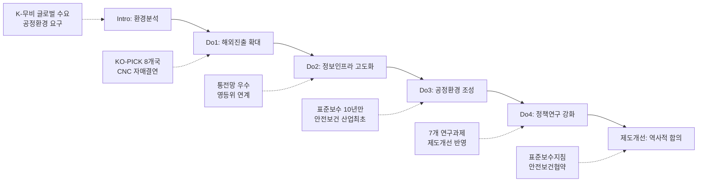

---
{"publish":true,"title":"2-2 한국영화 혁신성장 기반강화 지표 작성 방안","created":"2025-12-09","modified":"2025-12-09T15:26:55.901+09:00","tags":["#경영평가","#주요사업","#혁신성장기반강화","#비계량","#작성방안"],"cssclasses":""}
---


# [2-2 한국영화 혁신성장 기반강화] 세부평가내용 작성 방안

> [!abstract] 문서 개요
> 본 문서는 '2.2 한국영화 혁신성장 기반강화' 지표의 2025년도 경영평가보고서 작성을 위한 논리적 흐름(Storyline)과 문단별 세부 작성 방안을 제안합니다.
> 
> **핵심 목표**: [[25년 경평/2_지표별 자료/2-2_혁신성장_기반_강화/3_전년도_지적사항_및_개선실적\|전년도 지적사항(C 등급)]]을 극복하고, **'공정환경 제도화'**와 **'글로벌 네트워크 확대'**를 통해 목표 등급(B등급 이상)을 달성하는 데 중점을 두었습니다.

---

## 1️⃣ Storyline 구성안 비교

### 📌 Option A: 부서 중심 구조

| 구분 | 내용 |
|------|------|
| **구조** | 국제교류 → 디지털혁신 → 공정환경 → 정책개발 |
| **장점** | 부서별 성과 명확, 실적 누락 방지 |
| **단점** | 사업 연계성 약화, 단순 나열 우려 |
| **적합도** | ⭐⭐ |

```
국제교류 → 디지털혁신 → 공정환경 → 정책개발
```

### 📌 Option B: 성과목표 중심 구조

| 구분 | 내용 |
|------|------|
| **구조** | 해외진출 → 정보관리 → 공정환경 → 정책연구 |
| **장점** | 목표-실적 연계 명확, 평가위원 친화적 |
| **단점** | 부서 간 협업 성과 표현 어려움 |
| **적합도** | ⭐⭐⭐ |

```
해외진출 → 정보관리 → 공정환경 → 정책연구
```

### 📌 Option C: 하이브리드 구조 (추천)

| 구분 | 내용 |
|------|------|
| **구조** | 성과목표별 집행 + 제도개선 종합 섹션 |
| **장점** | 매뉴얼 평가착안사항 3가지 모두 반영, BP 가시화 |
| **단점** | 구조 다소 복잡 |
| **적합도** | ⭐⭐⭐ |

```
성과목표별 집행(해외·정보·공정·연구) + 제도개선 종합(표준보수·안전보건)
```

---

## 2️⃣ 추천 Storyline: 공정 생태계 & 글로벌 확장

> [!tip] 추천 구조
> **"10년 만의 노사정 합의(표준보수·안전보건)로 공정환경을 제도화하고, 글로벌 네트워크 확대(8개국)로 K-무비 경쟁력 강화"**하는 구조

### 전체 흐름



### 핵심 메시지

> **"법개정 10년 만의 노사정 합의로 영화산업 공정환경을 제도화하고, 글로벌 네트워크 167% 확대"**

---

## 3️⃣ 문단별 작성 방안 (Do 섹션)

### 세부평가내용② 계획의 적절한 집행

#### 문단 1: 해외진출 사업 집행 [국제교류팀]

| 항목 | 내용 |
|------|------|
| **Core Message** | KO-PICK 글로벌 네트워크 167% 확대 및 프랑스 CNC 자매결연 |
| **주요 근거** | 8개국 진출(3→8), 프로듀서 33인, 비즈매칭 289건 |
| **담당 부서** | 국제교류팀 |

| 증빙 요소 | 내용 |
|----------|------|
| KO-PICK 확대 | 3개국→8개국(167%↑): 독일·프랑스·네덜란드·캐나다·일본·인도네시아·홍콩·중국 |
| 후속지원 신설 | 프로듀서 후속지원 32건/5,300만원 (번역·법률·항공료) ⭐신규 |
| CNC 자매결연 | 프랑스 CNC 아시아 최초 자매결연, 2026년 파리 행사 확정 ⭐BP |
| 비즈매칭 | 총 289건 비즈매칭 (베를린 53, 홍콩 47, 칸 82, 부산 37, 일본 70) |
| 로케이션 유치 | 4편 유치, 국내집행 211.8억원, 경제효과 23.6배 |

#### 문단 2: 영화정보 인프라 사업 집행 [디지털혁신팀]

| 항목 | 내용 |
|------|------|
| **Core Message** | 통합전산망 재정사업 '우수' 및 영화정보 유관기관 연계 확대 |
| **주요 근거** | 재정사업 100점(우수), 영등위 업무협약 |
| **담당 부서** | 디지털혁신팀 |

| 증빙 요소 | 내용 |
|----------|------|
| 통전망 운영 | 570개 극장, 3,296개 스크린 실시간 연동 |
| 재정사업 평가 | 문체부 재정사업 자율평가 100점(우수), 전년 '보통'→'우수' 상향 ⭐BP |
| 영등위 연계 | 영진위-영등위 업무협약 체결('25.11.24.), 행정 간소화 ⭐신규 |
| 통합관리창구 | 영화정보통합관리창구 신설(4개 창구), 크레디트 수집체계 정비 |
| 데이터 증가 | 전년 대비 데이터 10.7%↑, OPEN-API 이용 35%↑ |

#### 문단 3: 공정환경 조성 사업 집행 [공정환경조성팀]

| 항목               | 내용                                |
| ---------------- | --------------------------------- |
| **Core Message** | 표준보수지침 10년 만 합의 및 안전보건협약 산업 최초 체결 |
| **주요 근거**        | 노사정 4자 합의, 노사정 공동협약               |
| **담당 부서**        | 공정환경조성팀                           |

| 증빙 요소 | 내용 |
|----------|------|
| 표준보수지침 | 2015년 법개정 이후 10년 만에 노사정 4자 합의('25.10.01. 공표) ⭐⭐⭐BP |
| 안전보건협약 | 산업단위 최초 노사정 공동협약 체결('25.11.20.) ⭐⭐⭐BP |
| 사업요강 반영 | 2026년 중예산 사업 표준보수액·안전관리비 의무조항 반영 |
| 영화인신문고 | 저작권파트 중재위원회 신설, 3심제 도입, 종결비율 91.2% |
| 성평등센터 | 피해자 지원 134건, 예방교육 63회/2,977명, 만족도 4.75점 |
| 불법유통 | 모니터링 367,059건, 삭제조치 230,149건, 참여작품 50%↑ |

#### 문단 4: 정책연구 사업 집행 [정책개발팀]

| 항목 | 내용 |
|------|------|
| **Core Message** | 정책연구 제도개선 직접 반영 및 통계 품질 강화 |
| **주요 근거** | 7개 연구과제, 통전망 매출액 기준 전환 확정 |
| **담당 부서** | 정책개발팀 |

| 증빙 요소 | 내용 |
|----------|------|
| 연구과제 | 7개 정책연구과제 수행 (북미진출, 통전망 개편, 홀드백 등) |
| 제도개선 | 통전망 매출액 기준 전환 '26년 확정, 미국사무소 설립 연계 ⭐ |
| 연구역량 | 담당자별 책임연구원 지정 체계 구축 (내부 연구 참여 확대) |
| 조사통계 | 수익성 분석 수급률 89.2% (2년 연속 상승) |
| 활용도 | 언론 인용 266건, 학술정보원 이용 19,881건 |

---

### 세부평가내용② 제도개선 성과 (종합)

#### 문단 5: 영화산업 표준 정립 ⭐⭐⭐

| 항목 | 내용 |
|------|------|
| **Core Message** | 10년 만의 역사적 노사정 합의로 영화산업 표준 제도화 |
| **주요 근거** | 표준보수지침 공표, 안전보건협약 체결 |
| **담당 부서** | 공정환경조성팀 |

| 증빙 요소 | 내용 |
|----------|------|
| 표준보수지침 | 노사정 4자 합의(영진위·노조·제작가협회·프로듀서조합), '25.10.01. 공표 |
| 안전보건협약 | 6개 기관 노사정 공동협약('25.11.20.), 협의회 구성 |
| 역사적 의의 | 법개정(2015) 이후 10년 만, 산업단위 최초 |
| 사업 연계 | 2026년 중예산 사업요강 의무조항 반영 완료 |
| 후속 계획 | 명예산업안전감독관 제도 2026년 시범 시행 |

---

## 4️⃣ 차별화 포인트

### 가. 전년도 C등급(지적사항) 개선 전략

| 지적사항 | 개선 방안 | 핵심 성과 |
|---------|----------|----------|
| 글로벌 진출 체계 미흡 | **KO-PICK 확대** | 3→8개국(167%↑), CNC 자매결연(아시아 최초) |
| 로케이션 경제효과 제고 | **인센티브 제도 개선** | 경제효과 23.6배(전년 9.6배), 한국스태프 644명 |
| 영화인 DB 관리 미흡 | **통합관리창구 신설** | 4개 창구 분리, 영등위 업무협약 |
| 정책연구 현장 연계 | **제도개선 반영** | 통전망 매출액 기준 전환 '26년 확정 |

### 나. 역사적 합의 및 제도화

| 영역 | 기존 상황 | 혁신 성과 |
|------|----------|----------|
| 표준보수 | 10년간 지침 부재 | **노사정 4자 합의** (2015년 이후 최초) |
| 안전보건 | 산업단위 체계 부재 | **노사정 공동협약** (산업 최초) |
| 국제협력 | 3개국 소규모 운영 | **8개국 확대, CNC 자매결연** (아시아 최초) |
| 데이터 인프라 | 재정사업 '보통' | **재정사업 '우수'** (문체부 2위) |

---

## 5️⃣ 작성 시 유의사항

### 가. 매뉴얼 평가착안사항 대응

> [!warning] 필수 확인
> Do 섹션은 3가지 평가착안사항을 모두 반영해야 함

| 평가착안사항        | 대응 내용                                    |
| ------------- | ---------------------------------------- |
| ① 추진계획 적절 집행  | KO-PICK 8개국, 통전망 운영, 표준보수·안전보건 합의, 7개 연구 |
| ② 경영자원 효율 활용  | 로케이션 경제효과 23.6배, 통전망 재정사업 100점           |
| ③ 현안과제 대응 적절성 | 노사정 합의 10년 만, 영등위 연계, 제도개선 반영            |

### 나. 정량 데이터 활용

> [!success] 핵심 정량지표
> - KO-PICK: **8개국** (167%↑), 비즈매칭 **289건**
> - 로케이션: 국내집행 **211.8억**, 경제효과 **23.6배**
> - 통전망: 재정사업 **100점(우수)**, 데이터 **10.7%↑**
> - 공정환경: 불법유통 **367,059건**, 성평등 **2,977명** 교육
> - 정책연구: **7개** 과제, 언론 인용 **266건**

### 다. BP(Best Practice) 강조

| BP 후보 | 내용 | 강조 포인트 |
|---------|------|-----------|
| 표준보수지침 | 노사정 4자 합의 | 법개정 **10년 만** 역사적 합의 |
| 안전보건협약 | 노사정 공동협약 | 산업단위 **최초** 안전보건 협약 |
| CNC 자매결연 | 프랑스 CNC 협력 | **아시아 최초** 자매결연 |
| 통전망 우수 | 재정사업 100점 | 전년 '보통'→'우수' **등급 상향** |

---

## 🔗 관련 자료

| 구분 | 문서명 | 비고 |
|------|--------|------|
| 편람 분석 | [[25년 경평/2_지표별 자료/1-9_노사관계/2_편람_내용_분석]] | 세부평가 요소별 가이드 |
| 지적사항 | [[25년 경평/2_지표별 자료/2-2_혁신성장_기반_강화/3_전년도_지적사항_및_개선실적]] | C등급 원인 및 개선방향 |
| 부서 매핑 | [[25년 경평/2_지표별 자료/2-2_혁신성장_기반_강화/부서별 실적 분석/국제교류팀 실적 분석]], [[25년 경평/2_지표별 자료/2-2_혁신성장_기반_강화/부서별 실적 분석/공정환경조성팀 실적 분석]], [[25년 경평/2_지표별 자료/2-2_혁신성장_기반_강화/부서별 실적 분석/디지털혁신팀 실적 분석]] | 부서별 실적 종합 |
| 핵심실적 | [[25년 경평/2_지표별 자료/2-2_혁신성장_기반_강화/2_핵심 실적 분석]] | 22개 테마 종합 |
| 목차구성안 | [[25년 경평/2_지표별 자료/1-9_노사관계/1_목차_구성안]] | 전체 목차 구조 |

---

*작성일: 2025-12-09*
*검증상태: 부서성과평가 원본 대조 완료*
