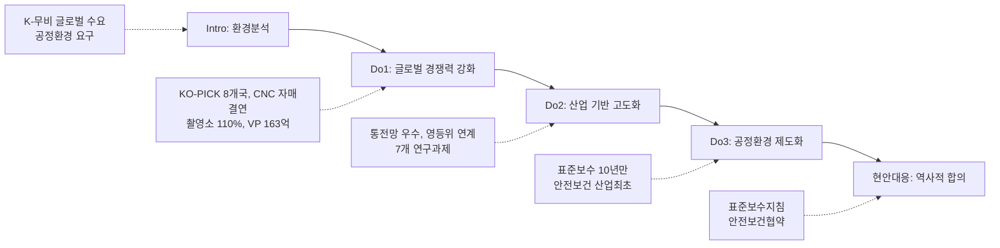

---
{"publish":true,"permalink":"/경영평가/주요사업2/실행","title":"6_실행(Do)","created":"2025-12-12","modified":"2025-12-16T15:22:16.544+09:00","tags":["#경영평가","#주요사업","#혁신성장기반강화","#비계량","#작성방안"],"cssclasses":""}
---


# [2-2 한국영화 혁신성장 기반강화] 세부평가내용 작성 방안

> [!abstract] 문서 개요
> 본 문서는 '2.2 한국영화 혁신성장 기반강화' 지표의 2025년도 경영평가보고서 작성을 위한 논리적 흐름(Storyline)과 문단별 세부 작성 방안을 제안합니다.
>
> **평가내용 02**: 주요사업별 추진활동은 적절히 수행되었는가?
> **핵심 목표**: [[25년 경평/2_지표별 자료/2-2_혁신성장_기반_강화/3_전년도_지적사항_및_개선실적\|전년도 지적사항(C 등급)]]을 극복하고, **'공정환경 제도화'**와 **'글로벌 네트워크 확대'**를 통해 목표 등급(B등급 이상)을 달성하는 데 중점을 두었습니다.

---

## 1. 개요

### 1.1 Do 세부 구조

> [!tip] Do 섹션 작성 가이드
> **이 섹션의 목적**: Plan에서 세운 계획을 **얼마나 잘 실행했는지** 보여주는 부분입니다.
> 
> **핵심 질문**: "계획대로 했나요? 효율적으로 했나요? 문제는 어떻게 해결했나요?"
> 
> **Do 섹션의 3가지 평가착안사항**:
> 1. **추진활동 실적**: 계획한 사업을 제대로 집행했는가?
> 2. **효율성 제고**: 자원(예산, 인력)을 효율적으로 활용했는가?
> 3. **긴급현안 대응**: 예상치 못한 문제에 적절히 대응했는가?
> 
> **작성 팁**: 숫자와 증빙이 핵심! 모든 실적에 **정량 데이터** 포함

| 구분 | 세부 항목 |
|------|----------|
| **1. 추진활동 실적** | 가. 글로벌 경쟁력 강화 (해외진출 + 첨단인프라)<br>나. 산업 기반 고도화 (영화정보 + 정책연구)<br>다. 공정환경 제도화 |
| **2. 효율성 제고 노력 및 성과** | 가. 프로세스 개선 노력과 성과<br>나. 예산절감 노력과 성과<br>다. 협업·참여·소통확대 노력과 성과 |
| **3. 모니터링 긴급현안 대응** | 가. 영화산업 표준보수지침 제정 (10년 만의 합의)<br>나. 영화산업 안전보건체계 구축 (산업 최초) |

---

### 1.2 Storyline 구성안 비교

> [!note] 작성 가이드
> **Storyline이란?**: 보고서 전체를 관통하는 **핵심 메시지**입니다.
> 
> **왜 중요한가?**: 평가위원이 30분 안에 보고서를 읽습니다. 명확한 스토리가 없으면 산만해 보입니다.
> 
> **좋은 Storyline의 조건**:
> - 한 문장으로 요약 가능해야 함
> - "문제 → 해결 → 성과" 흐름이 있어야 함
> - Plan-Do-Check-Act가 자연스럽게 연결되어야 함

#### Option A: 부서 중심 구조

| 구분 | 내용 |
|------|------|
| **구조** | 국제교류 → 디지털혁신 → 공정환경 → 정책개발 |
| **장점** | 부서별 성과 명확, 실적 누락 방지 |
| **단점** | 사업 연계성 약화, 단순 나열 우려 |
| **적합도** | ⭐⭐ |

```
국제교류 → 디지털혁신 → 공정환경 → 정책개발
```

#### Option B: 성과목표 중심 구조

| 구분 | 내용 |
|------|------|
| **구조** | 해외진출 → 정보관리 → 공정환경 → 정책연구 |
| **장점** | 목표-실적 연계 명확, 평가위원 친화적 |
| **단점** | 부서 간 협업 성과 표현 어려움 |
| **적합도** | ⭐⭐⭐ |

```
해외진출 → 정보관리 → 공정환경 → 정책연구
```

#### Option C: 하이브리드 구조 (추천)

| 구분 | 내용 |
|------|------|
| **구조** | 성과목표별 집행 + 제도개선 종합 섹션 |
| **장점** | 매뉴얼 평가착안사항 3가지 모두 반영, BP 가시화 |
| **단점** | 구조 다소 복잡 |
| **적합도** | ⭐⭐⭐ |

```
성과목표별 집행(해외·정보·공정·연구) + 제도개선 종합(표준보수·안전보건)
```

---

### 1.3 추천 Storyline: 공정 생태계 & 글로벌 확장

> [!tip] 추천 구조
> **"10년 만의 노사정 합의(표준보수·안전보건)로 공정환경을 제도화하고, 글로벌 네트워크 확대(8개국)로 K-무비 경쟁력 강화"**하는 구조

#### 전체 흐름



#### 핵심 메시지

> **"법개정 10년 만의 노사정 합의로 영화산업 공정환경을 제도화하고, 글로벌 네트워크 167% 확대"**

---

## 2. 추진활동 실적

> [!tip] 작성 가이드
> **이 섹션의 목적**: 각 사업별로 **무엇을 어떻게 했는지** 구체적으로 서술합니다.
> 
> **문단 구성 원칙**:
> 1. **Core Message**: 이 사업의 핵심 성과를 한 줄로 요약
> 2. **주요 근거**: 핵심 수치 (편수, 예산, 증감률 등)
> 3. **추진 실적 및 성과**: 세부 실적, 전년 대비, 효율성, 현안대응 등
> 
> **작성 팁**:
> - 모든 수치에 **전년대비 증감률** 포함
> - **신규** 사업은 반드시 강조 표시
> - **현안대응** 연결고리 명시 (왜 이 사업을 했는지)

> [!abstract] 성과목표별 문단 구조 (총 15개, 3개 성과목표)
> 
> **성과목표① 글로벌 경쟁력 강화** (7개 문단)
> - 문단 1: KO-PICK 글로벌 협력제작 확대 ⭐BP
> - 문단 2: 외국영화 로케이션 촬영 유치
> - 문단 3: 해외마켓 비즈매칭 강화
> - 문단 4: 아카데미 프로모션
> - 문단 5: 부산기장촬영소 건립 추진 ⭐BP
> - 문단 6: VP 스튜디오 구축 계획
> - 문단 7: AI 기반 스마트 안전관리
> 
> **성과목표② 산업 기반 고도화** (4개 문단)
> - 문단 8: 통합전산망 안정적 운영 ⭐BP
> - 문단 9: 영화인 경력정보관리체계 구축
> - 문단 10: 정책연구 고도화
> - 문단 11: 조사통계 품질 강화
> 
> **성과목표③ 공정환경 제도화** (4개 문단)
> - 문단 12: 영화산업 표준보수지침 제정 ⭐⭐⭐BP
> - 문단 13: 영화산업 안전보건체계 구축 ⭐⭐⭐BP
> - 문단 14: 영화인신문고 운영 고도화
> - 문단 15: 온라인 불법유통 대응

---

### 2.1 성과목표① 글로벌 경쟁력 강화 (문단 1~7)

> [!note] 성과목표① 개요
> **담당부서**: 국제교류팀, 영화기술인프라팀
> **핵심 목표**: K-무비 글로벌 경쟁력 강화 및 첨단 제작 인프라 구축
> **주요 사업**: KO-PICK 쇼케이스, 로케이션 인센티브, 해외마켓 운영, 부산기장촬영소 건립, VP 스튜디오 구축

---

#### 문단 1: KO-PICK 글로벌 협력제작 확대 [국제교류팀] ⭐BP

> [!quote] 📊 연구보고서 근거: 2024년 한국 영화산업 결산 (KOFIC 연구 2025-02)
> **해외 수출 현황**
> - 완성작 수출금액: **4,193만 달러** (전년대비 -32.5%)
> - 서비스 수출금액: **4,417만 달러** (전년대비 +158.9%)
> - 권역별 1위: 아시아(64.6%), 국가별 1위: 일본(16.1%)
> - 동남아 신흥 시장 부상: 베트남(4위), 인도네시아(7위), 필리핀(8위)
> 
> **시사점**: 완성작 수출 감소 → 국제공동제작 활성화로 글로벌 네트워크 확대 필요

| 항목 | 내용 |
|------|------|
| **Core Message** | KO-PICK 쇼케이스 8개국 진출 및 프랑스 CNC 자매결연 |
| **주요 근거** | 3개국→8개국(167%↑), 프로듀서 33인, 비즈매칭 289건 |
| **담당 부서** | 국제교류팀 |

| 구분 | 실적 | 성과 |
|------|------|------|
| KO-PICK 확대 | 8개국 진출 (독일·프랑스·네덜란드·캐나다·일본·인도네시아·홍콩·중국) | 전년대비 **167%↑** (3→8개국) |
| 프로듀서 선발 | 총 33인 국제협력제작 인력 선발 | 유럽 10인, 북미 3인, 아시아 20인 |
| 비즈매칭 | 총 289건 비즈매칭 달성 | 베를린 53, 홍콩 47, 칸 82, 부산 37, 일본 70 |
| 후속지원 신설 | 프로듀서 후속지원 32건/5,300만원 ⭐신규 | 번역·법률·항공료 지원 |
| CNC 자매결연 | 프랑스 CNC 아시아 최초 자매결연 ⭐BP | 2026년 파리 행사 확정 |
| 쇼케이스 네트워킹 | 총 **1,070명** 참가 | 토론토 200, 부산 300, 인니 200 등 |
| AFAN 협력 확대 | 태국 THACCA 신규 영입, 포럼 **113명**/비즈매칭 **57회** | 사무국 운영비 공동분담 결정 |
| 다낭아시안영화제 | **주빈국** 참여 ⭐신규 | 베트남 신흥시장 개척 교두보 확보 |

> [!example] 추천 스토리라인
> **"전년도 지적사항(글로벌 진출 체계 미흡) 개선 → KO-PICK 8개국 확대(167%↑) → 프랑스 CNC 자매결연(아시아 최초) → 2026년 ACFM 예산 2.5배 증액 확보"**
> 
> - 도입: 한국영화 글로벌 진출 수요 증가, 국제공동제작 활성화 필요
> - 전개: KO-PICK 쇼케이스 5개국 신규 확대, AFAN 협력 강화(태국 영입)
> - 성과: 289건 비즈매칭, 네트워킹 1,070명, CNC 자매결연으로 유럽 공동제작 기반 마련

---

#### 문단 2: 외국영화 로케이션 촬영 유치 [국제교류팀]

| 항목 | 내용 |
|------|------|
| **Core Message** | 로케이션 인센티브 제도 개선으로 경제효과 23.6배 달성 |
| **주요 근거** | 4편 유치, 국내집행 211.8억원, 한국스태프 644명 |
| **담당 부서** | 국제교류팀 |

| 구분 | 실적 | 성과 |
|------|------|------|
| 지원 작품 | 4편 유치 | 국제공동제작 3편(대만·인도·베트남) + 외국시리즈 1편 |
| 국내집행액 | **211.8억 원** | 전년대비 **67%↑** |
| 지원금 | 8.96억 원 | 경제효과 **23.6배** (전년 9.6배) |
| 한국인력 | **644명** 참여 | 고용 창출 효과 |
| 제도 개선 | 애니메이션 포함, 국제공동제작 최대 4억원 ⭐신규 | AFAN 특례(5천만원 이상) 신설 |

| 주요 유치 작품 | 제작국 | 국내집행액 | 한국인력 |
|---------------|:------:|:---------:|:-------:|
| 그 시절, 우리가 좋아했던 소녀 | 한국/대만 | 30억원 | 212명 |
| 엑스오 키티 3 | 미국 | 154.86억원 | 242명 |
| 메이드 인 코리아 | 한국/인도 | 15억원 | 94명 |
| 나는 여기에 있다 | 한국/베트남 | 11.94억원 | 96명 |

> [!example] 추천 스토리라인
> **"전년도 지적사항(경제효과 제고 필요) 개선 → 인센티브 제도 개선(애니메이션 포함, 4억원 확대) → 4편 유치/211.8억 국내집행 → 경제효과 23.6배 달성"**
> 
> - 도입: 외국영화 한국 촬영 수요 증가, 인센티브 제도 개선 필요
> - 전개: 신청시점 완화, 애니메이션 포함, 국제공동제작 지원금 확대
> - 성과: 경제효과 23.6배(전년 9.6배), 한국스태프 644명 고용 창출

---

#### 문단 3: 해외마켓 비즈매칭 강화 [국제교류팀]

| 항목 | 내용 |
|------|------|
| **Core Message** | 해외마켓 비즈매칭 상담 47%↑, 계약 21%↑ 달성, ACFM 예산 2.5배 확보 |
| **주요 근거** | 상담 3,949건(47%↑), 계약 1,151건(21%↑), ACFM 방문 30,006명(+13.5%) |
| **담당 부서** | 국제교류팀 |

| 구분 | 실적 | 성과 |
|------|------|------|
| 상담건수 | 3,949건 (상반기) | 전년대비 **47%↑** |
| 계약건수 | 1,151건 (상반기) | 전년대비 **21%↑** |
| 주요 마켓 | 베를린 EFM, 홍콩 FILMART, 칸 마르쉐뒤필름, TIFFCOM | 5대 마켓 참가 |
| JAFF 신규 | 인도네시아 JAFF마켓 참가 ⭐신규 | 동남아 시장 진출 |
| ACFM 방문 | **30,006명** 참가 | 전년대비 **+13.5%** |
| ACFM 예산 | 2026년 **15억** 확보 ⭐신규 | 전년(6억) 대비 **2.5배 증액** |
| KoBiz 영문 뉴스레터 | 14,155명 | 전년대비 **+27.24%** |

| 마켓명 | 시기 | 참가업체 | 상담건수 | 계약건수 |
|--------|:----:|:-------:|:-------:|:-------:|
| 베를린 EFM | 2월 | 15개사 | 1,189건 | 160건 |
| 홍콩 FILMART | 3월 | 19개사 | 621건 | 57건 |
| 도쿄 TIFFCOM | 10월 | 12개사 | 183건 | 27건 |

> [!example] 추천 스토리라인
> **"해외마켓 참가 지원 확대 → 상담 47%↑/계약 21%↑ → JAFF 신규 진출로 동남아 시장 개척"**

---

#### 문단 4: 아카데미 프로모션 [국제교류팀]

| 항목 | 내용 |
|------|------|
| **Core Message** | <어쩔수가없다> 아카데미 국제장편상 유력 후보 프로모션 |
| **주요 근거** | 토론토 국제관객상, 시체스 감독상 등 4개 수상 |
| **담당 부서** | 국제교류팀 |

| 구분 | 실적 | 성과 |
|------|------|------|
| 국제영화제 지원 | 75편 지원 | 전년대비 **10.29%↑** |
| 수상 실적 | **12건 수상**, 1건 특별언급 | 38개 영화제 참가 |
| <어쩔수가없다> | 토론토 국제관객상, 시체스 감독상, 마이애미 공로상, 뉴포트비치 글로벌임팩트상 | 아카데미 유력 후보 |

> [!example] 추천 스토리라인
> **"국제영화제 참가지원 75편(10%↑) → 12건 수상 → <어쩔수가없다> 아카데미 국제장편상 유력 후보 프로모션"**

---

#### 문단 5: 부산기장촬영소 건립 추진 [영화기술인프라팀] ⭐BP

> [!quote] 📊 연구보고서 근거: 부산기장촬영소 운영 활성화 방안 연구 (KOFIC 연구 2025-09)
> **국내 촬영 인프라 현황**
> - 전국 실내 스튜디오 분포: 수도권 **90%**, 중부권 6%, 남부권 **4%**
> - 남부권(영남·호남)에는 **600평형 이상 실내 스튜디오 전무**
> - 제작 관계자 설문(N=159): 남부권 촬영소 건립 필요 **89.0%** 긍정
> 
> **부산기장촬영소 기대효과**
> - 대지면적: 258,152㎡ (약 78,091평), 스튜디오 3개동 (1,000평/650평/450평)
> - 운영 활성화 최우선 과제: 제작진 숙박편의시설 (95.0%)
> 
> **시사점**: 남부권 촬영 인프라 불균형 해소 및 지역 영화산업 생태계 활성화 기대

| 항목 | 내용 |
|------|------|
| **Core Message** | 147일 공기 지연 극복, 공정률 110% 초과 달성 및 중대재해 ZERO |
| **주요 근거** | 공정률 42.98%(계획 대비 110%), 중대재해 ZERO, 안전점검 지적사항 ZERO |
| **담당 부서** | 영화기술인프라팀 |

| 구분 | 실적 | 성과 |
|------|------|------|
| 공기 지연 극복 | 대규모 암반 노출로 **147일** 공기 지연 발생 | 수정공정표 신속 도출, 준공 기한 **유지** |
| 공정률 달성 | 계획 39.07% 대비 **42.98%** 달성 ('25.11.24. 기준) | 계획 대비 **110% 초과 달성** |
| 중대재해 관리 | 중대재해 **ZERO** | 외부기관 안전점검 5회, 지적사항 **ZERO** |
| 협의체 구성 | 문체부·부산시·기장군 **3개 기관 협의체** 구성 | 위원회 주도 협력체계 구축 |

| 월별 공정률 달성 현황 |
|---------------------|
| 4월: 계획 14.27% → 실적 14.70% (103%) |
| 7월: 계획 21.08% → 실적 22.43% (106.4%) |
| 10월: 계획 32.59% → 실적 37.29% (**114.4%**) |
| 11월: 계획 40.9% → 실적 44.2% (108.1%) |

> [!example] 추천 스토리라인
> **"대규모 암반 노출로 147일 공기 지연 → 수정공정표 신속 도출 → 공정률 110% 초과 달성 → 중대재해 ZERO 달성"**

---

#### 문단 6: VP 스튜디오 구축 계획 [영화기술인프라팀]

> [!quote] 📊 연구보고서 근거: AI 영화기술 현황과 전망 (KOFIC 현안보고 2025-01)
> **글로벌 AI 시장 현황**
> - 2024년 전세계 AI 시장: **1,840억 달러** (약 237조 원)
> - 2030년 전망: **8,260억 달러**, 연평균 성장률 **18.6%**
> - 미디어·엔터테인먼트 AI 시장: 2030년까지 **994.8억 달러** (CAGR 26%)
> 
> **영화 제작 AI 활용 방향**
> - VFX 에셋 제작: 2D→2.5D→3D 변환, **버추얼 프로덕션 LED Wall 활용**
> - Utility AI: 반복 노동 자동화 (KMS 구축, 로컬라이제이션)
> 
> **시사점**: VP 스튜디오 구축으로 첨단기술 기반 제작 인프라 확보 필요

| 항목 | 내용 |
|------|------|
| **Core Message** | 2026년 VP 스튜디오 구축 예산 163억 확보, 해외 7개 스튜디오 벤치마킹 |
| **주요 근거** | 163억 예산 확보, 7개국 스튜디오 방문, 2027년 가동 목표 |
| **담당 부서** | 영화기술인프라팀 |

| 구분 | 실적 | 성과 |
|------|------|------|
| 예산 확보 | 2026년 **163억** 예산 확보 ⭐신규 | VP 스튜디오 및 에셋 라이브러리 구축 |
| 해외 벤치마킹 | **7개국 스튜디오** 방문 조사 | 헝가리, 영국, 네덜란드, 일본 등 |
| 구축 방향 | **다이나믹 LED Wall** (가변형) 도입 | 고정형 아닌 형태 변경 가능, R&D·테스트베드 활용 |
| 가동 목표 | **2027년** 가동 예정 | 스튜디오3 (450평형) 설치 |
| 수요 조사 | 관계자 **159명** 설문조사 | VP 스튜디오 구축 **1순위** (28%) |

> [!example] 추천 스토리라인
> **"VP 스튜디오 수요 조사(1순위 28%) → 해외 7개 스튜디오 벤치마킹 → 163억 예산 확보 → 2027년 가동 목표"**

---

#### 문단 7: AI 기반 스마트 안전관리 [영화기술인프라팀]

| 항목 | 내용 |
|------|------|
| **Core Message** | AI CCTV·5Gas 장비 도입 및 100G 네트워크 인프라 구축 확정 |
| **주요 근거** | AI 이동형 CCTV, 5Gas 장비 도입, 100G 네트워크 확정 |
| **담당 부서** | 영화기술인프라팀 |

| 구분 | 실적 | 성과 |
|------|------|------|
| AI CCTV 도입 | **AI 이동형 CCTV** 도입 ('25.11.~) ⭐신규 | VLM 기반 안전고리 미체결, 불꽃/연기, 중장비 감지 |
| 5Gas 장비 | **5Gas 장비** 도입 ⭐신규 | CO₂ 검출기능 추가, 네트워크 관제센터 경고 송출 |
| 100G 네트워크 | **100G 네트워크** 인프라 구축 확정 | 당초 1G → 100G 변경 (3개월 만에 확정) |
| 소방시설 확대 | 임시소방시설 **238%** 예산 증액 | 소화기 +83%, 대형분말소화기 +313% |

| 100G 네트워크 기대 효과 |
|----------------------|
| 대용량 데이터 전송: 원격 편집실, VFX업체, 믹싱실 막힘없는 전송 |
| VP 실시간 촬영: 에셋 결합 영상 데이터 지연 없는 처리 |
| AI 자동화 플랫폼: 원활한 사용으로 제작 효율성 향상 |
| 성능: 1G(125 MB/s) → **100G(12.5 GB/s)** |

> [!example] 추천 스토리라인
> **"촬영현장 안전관리 강화 필요 → AI CCTV·5Gas 장비 도입 → 100G 네트워크 확정 → 국내 최고 수준 인프라 구축"**

---

### 2.2 성과목표② 산업 기반 고도화 (문단 8~11)

> [!note] 성과목표② 개요
> **담당부서**: 디지털혁신팀, 정책개발팀
> **핵심 목표**: 영화산업 데이터 인프라 고도화 및 정책연구 혁신
> **주요 사업**: 통합전산망 운영, 영화인 경력정보관리체계 구축, 정책연구과제 수행, 조사통계 발간

---

#### 문단 8: 통합전산망 안정적 운영 [디지털혁신팀] ⭐BP

| 항목 | 내용 |
|------|------|
| **Core Message** | 재정사업 자율평가 100점(우수) 달성, 전년 '보통'→'우수' 상향 |
| **주요 근거** | 570개 극장, 3,296개 스크린, 데이터 10.7%↑ |
| **담당 부서** | 디지털혁신팀 |

| 구분 | 실적 | 성과 |
|------|------|------|
| 연동 극장 | **570개** | 전국 영화관 실시간 연동 |
| 연동 스크린 | **3,296개** | 발권정보 실시간 집계 |
| 전송사업자 | **16개** (신규: 빅브라더스) | 전송체계 확대 |
| 데이터 증가율 | 전년대비 **10.7%↑** | 데이터 품질 향상 |
| 재정사업 평가 | **100점 (우수)** | 문체부 전체 사업 중 **2위** |
| OPEN-API 이용 | **30,366건** | 전년대비 **35%↑** |
| 홈페이지 만족도 | **8.10점** | 전년대비 **+4.2%** |

| 재정사업 자율평가 결과 |
|---------------------|
| 평가대상: 영화관입장권통합전산망 사업 |
| 평가점수: **100.0점** |
| 평가등급: **우수** (전년 '보통' → '우수' 등급 상향) |
| 문체부 순위: **전체 사업 중 2위** |

> [!example] 추천 스토리라인
> **"전년도 지적사항(데이터 인프라 고도화 필요) 개선 → 통전망 운영개선 로드맵 이행 → 재정사업 100점(우수) 달성 → 문체부 2위"**
> 
> - 도입: 영화산업 데이터 품질 및 활용도 제고 필요
> - 전개: 4대 추진과제 1단계 이행(영화정보관리체계, 영화인경력정보, 유관기관연계, 통계정보확대)
> - 성과: 재정사업 '보통'→'우수' 등급 상향, 데이터 10.7%↑

---

#### 문단 9: 영화인 경력정보관리체계 구축 [디지털혁신팀]

| 항목 | 내용 |
|------|------|
| **Core Message** | 영화정보통합관리창구 신설 및 영등위 업무협약 체결 |
| **주요 근거** | 4개 창구 신설, 6개 기관 데이터 연계, 영등위 협약 |
| **담당 부서** | 디지털혁신팀 |

| 구분 | 실적 | 성과 |
|------|------|------|
| 통합관리창구 | **4개 창구** 신설 ('25.12.) ⭐신규 | FIMS 영화코드, 상영타입, 크레디트, 정보수정 |
| 영등위 연계 | 영진위-영등위 **업무협약** 체결 ('25.11.24.) ⭐신규 | API 개발 완료, 행정 간소화 |
| 유관기관 연계 | **6개 기관** 데이터 연계 | 콘진원, 저작권위, 저작권보호원, 문화정보원, 국립중앙도서관, 영등위 |
| 영화인 DB | 신규등록 2,728명, 신규가입 1,442명 | 경력정보 품질 향상 |

| 영화정보통합관리창구 (신규) |
|--------------------------|
| FIMS 영화코드 신청: 신규 영화정보 등록 |
| 상영타입 추가신청: 3D, 4D, IMAX 등 |
| 크레디트 파일 제출: 한국영화 참여인력 정보 |
| 정보수정요청: 영화·영화인·업체 정보 |

> [!example] 추천 스토리라인
> **"전년도 지적사항(영화인 DB 관리 미흡) 개선 → 영화정보통합관리창구 4개 신설 → 영등위 업무협약 체결 → 기관 간 칸막이 해소"**

---

#### 문단 10: 정책연구 고도화 [정책개발팀]

| 항목 | 내용 |
|------|------|
| **Core Message** | 7개 연구과제 수행, 연구결과 차년도 제도개선 직접 반영 |
| **주요 근거** | 통전망 매출액 기준 전환 '26년 확정, 북미진출 10대 핵심과제 |
| **담당 부서** | 정책개발팀 |

| 구분 | 실적 | 성과 |
|------|------|------|
| 연구과제 | **7개** 정책연구과제 수행 | 글로벌, 통전망, 소비자, 기획개발, 홀드백, 다양성 |
| 제도개선 반영 | 통전망 매출액 기준 전환 **'26년 확정** | 연구결과 직접 반영 |
| 북미진출 연구 | **10대 핵심과제** 발굴 | 미국사무소 설립 연계 |
| 홀드백 연구 | **8개년 1,192편** 대규모 실증분석 | 위원회 최초, KOBIS 통계 활용 전수 비교 |
| 연구역량 강화 | 담당자별 **책임연구원 지정** ⭐신규 | 내부 연구 참여 확대 |
| 연구보고서 생산 | **37건** (목표 28건) | **목표 초과 달성** |

> [!example] 추천 스토리라인
> **"전년도 지적사항(현장 연계성 강화 필요) 개선 → 담당자별 책임연구원 지정 → 7개 연구과제 수행 → 통전망 매출액 기준 전환 '26년 확정"**

---

#### 문단 11: 조사통계 품질 강화 [정책개발팀]

| 항목 | 내용 |
|------|------|
| **Core Message** | 수익성 분석 수급률 89.2% (2년 연속 상승), 언론 인용 266건 |
| **주요 근거** | 정기분석형 6종, 현안대응형 4건, 학술 활용 19,881건 |
| **담당 부서** | 정책개발팀 |

| 구분 | 실적 | 성과 |
|------|------|------|
| 정기분석형 | **6종** 발간 | 결산, 연감, 수익성 분석 등 |
| 현안대응형 | **4건** 동향조사 | 투자제작 현황, 한한령 대응 등 |
| 수급률 | **89.2%** | 2년 연속 상승 (82.9%→88.6%→89.2%) |
| 언론 인용 | **266건** ('25년 3분기) | 주요 언론사 인용 |
| 학술정보원 활용 | **19,881건** | DBpia 14,794건 + KISS 5,087건 |
| 해외통신원 | **76건** 발간 예정 | 9개 권역 14개 국가 |
| 성인지 결산 | **22건** 언론 보도 | 세계 여성의 날 타이밍 이슈화 |

> [!example] 추천 스토리라인
> **"조사방식 혁신(표본 기반 전환) → 수급률 89.2% 달성(2년 연속 상승) → 언론 인용 266건/학술 활용 19,881건"**

---

### 2.3 성과목표③ 공정환경 제도화 (문단 12~15)

> [!note] 성과목표③ 개요
> **담당부서**: 공정환경조성팀
> **핵심 목표**: 영화산업 공정환경 제도화 및 근로환경 개선
> **주요 사업**: 표준보수지침, 안전보건체계, 영화인신문고, 불법유통 대응

---

#### 문단 12: 영화산업 표준보수지침 제정 [공정환경조성팀] ⭐⭐⭐BP

> [!quote] 📊 연구보고서 근거: 2024년 영화스태프 근로환경 실태조사 (KOFIC 연구 2025-05)
> **표준보수지침 필요성** (N=537명)
> - "필요하다" 응답: **92.2%** (2022년 91.3% 대비 +0.9%p)
> - 표준보수 설정 방법: 부서별·직급별 평균수준 제시 32.2%, 최저-최고 범위 제시 30.0%
> 
> **근로환경 현황**
> - 연간 작품수입: 평균 **3,813만 원** (2022년 3,020만 원 대비 +26.3%)
> - 소득수준 부정적 인식: **55.5%** (만족 15.8%)
> 
> **시사점**: 영화산업 근로자 92.2%가 표준보수지침 필요 → 노사정 합의 추진 당위성

| 항목 | 내용 |
|------|------|
| **Core Message** | 2015년 법개정 이후 10년 만에 노사정 최초 합의 도출 |
| **주요 근거** | 노사정 4자 합의, 2025.10.01. 문체부 공식 공표 |
| **담당 부서** | 공정환경조성팀 |

| 구분 | 실적 | 성과 |
|------|------|------|
| 합의 도출 | **노사정 4자 합의** | 영진위, 전국영화산업노동조합, 한국영화제작가협회, 한국영화프로듀서조합 |
| 공표 | 2025.10.01. 문체부 공식 공표 | 법개정 **10년 만에 최초** |
| 사업요강 반영 | 2026년 중예산 사업요강 **의무조항 반영** | 표준보수액 준수 의무화 |

| 추진 경과 |
|----------|
| **[1단계]** 사전준비: 「영화근로자 표준보수지침 연구」 수행 |
| **[2단계]** 추진과정: 노사정 실무 협의회 개최 (4회) |
| **[3단계]** 실행결과: 노사정 4자 합의 및 문체부 공표 (2025.10.01.) |

> [!example] 추천 스토리라인
> **"영화산업 근로환경 불안정 → 노사정 실무협의회 4회 개최 → 10년 만의 역사적 합의 도출 → 2026년 사업요강 의무조항 반영"**
> 
> - 도입: 2015년 법개정 이후 10년간 표준보수지침 부재, 영화산업 근로자 처우 개선 필요
> - 전개: 노사정 4자(영진위·노조·제작가협회·프로듀서조합) 실무협의회 운영
> - 성과: **법개정 10년 만에 최초 노사정 합의**, 2026년 중예산 사업 의무조항 반영

---

#### 문단 13: 영화산업 안전보건체계 구축 [공정환경조성팀] ⭐⭐⭐BP

> [!quote] 📊 연구보고서 근거: 2024년 영화스태프 근로환경 실태조사 (KOFIC 연구 2025-05)
> **산업재해 현황** (N=537명)
> - 재해 경험률: **8.0%** (2022년 6.1% 대비 +1.9%p)
> - 산재보험 처리 비율: **18.6%** (본인부담 34.9%로 자비 치료 다수)
> - 재해 발생 형태: 넘어짐/미끄러짐 46.5%, 근골격계질환 32.6%, 추락 25.6%
> 
> **작업 중 위험요인**
> - 수면부족 **46.9%**, 폭염/추위 44.3%, 무거운 물건 운반 41.5%
> - 1주 평균 작업시간: **63.8시간** (법정근로 52시간 초과)
> 
> **시사점**: 재해율 증가 및 장시간 노동 → 산업단위 안전보건체계 구축 시급

| 항목 | 내용 |
|------|------|
| **Core Message** | 영화산업 단위 최초 안전보건 노사정 공동협약 체결 |
| **주요 근거** | 6개 기관 노사정 공동협약 (2025.11.20.) |
| **담당 부서** | 공정환경조성팀 |

| 구분 | 실적 | 성과 |
|------|------|------|
| 협약 체결 | **노사정 공동협약** 체결 (2025.11.20.) | 영화산업 **최초** 안전보건 협약 |
| 참여기관 | 6개 기관 | 문체부, 제작가협회, 프로듀서조합, 영화노조, 독립영화협회, 영진위 |
| 사업요강 반영 | 2026년 중예산 사업요강 **안전관리비 편성 의무화** | 제작지원 사업 연계 |
| 후속 조치 | 명예산업안전감독관 제도 | 2026년 시범 시행 협의 |

| 추진 경과 |
|----------|
| **[1단계]** 사전준비: 「영화산업 안전보건체계 구축방안 연구」 확인 → 우선 이행과제 도출 |
| **[2단계]** 추진과정: 노사정 실무 협의회 개최 (4월 국회 방문 → 5월 결과공유 → 10월 협의회 구축 협의) |
| **[3단계]** 실행결과: **안전보건협의회 구성을 위한 노사정 공동협약서 체결** (2025.11.20.) |

| 협약 참여기관 |
|-------------|
| 문화체육관광부 영상콘텐츠산업과 |
| (사)한국영화제작가협회 |
| (사)한국영화프로듀서조합 |
| 전국영화산업노동조합 |
| (사)한국독립영화협회 |
| 영화진흥위원회 |

> [!example] 추천 스토리라인
> **"중대재해처벌법 시행 → 영화산업 안전관리 체계 필요 → 노사정 실무협의회 4회 → 산업단위 최초 안전보건 협약 체결 → 2026년 안전관리비 의무화"**
> 
> - 도입: 영화 촬영현장 안전사고 위험, 중대재해처벌법 시행
> - 전개: 노사정 실무협의회 운영, 국회 환경노동위 협의
> - 성과: **영화산업 최초 안전보건 노사정 공동협약**, 2026년 안전관리비 편성 의무화

---

#### 문단 14: 영화인신문고 운영 고도화 [공정환경조성팀]

> [!quote] 📊 연구보고서 근거: 2024 한국 영화산업 주요 쟁점 연구 (KOFIC 연구 2025-04)
> **불공정 이슈 현황** (FGI 26명 대상)
> - 스크린 독과점: 대형 투배사의 스크린 독점, 개봉 주차 집중 편성
> - 깜깜이 정산: 통신사 할인, 할인 내역 비공개
> - 저작권 분쟁: 정당한 보상권, 시나리오 작가 권리 이슈
> 
> **임금체불 현황** (근로환경 실태조사)
> - 평균 체불 금액: **614만 원** (2022년 672만 원 대비 -58만 원)
> - 변제율: **81.3%** (2022년 78.0% 대비 +3.3%p)
> 
> **시사점**: 저작권 분쟁 증가 → 중재위원회 신설로 분쟁해결 전문성 강화 필요

| 항목 | 내용 |
|------|------|
| **Core Message** | 저작권파트 중재위원회 신설 및 3심제 도입으로 분쟁해결 전문성 강화 |
| **주요 근거** | 중재위원회 11회 개최, 누적 종결비율 91.2% |
| **담당 부서** | 공정환경조성팀 |

| 구분 | 실적 | 성과 |
|------|------|------|
| 중재위원회 신설 | 저작권파트 중재위원회 **신규 신설** ⭐신규 | 총 7인 위원 구성 |
| 3심제 도입 | 분쟁해결 **3심제** 마련 | 이의신청 권리 보장 |
| 회의 개최 | **11회** 진행 ('25.11.21. 기준) | 저작권 분쟁 전문 처리 |
| 2025년 실적 | 신고접수 110건, 종결 72건 | 종결비율 65% |
| 누적 실적 | 신고접수 1,738건, 종결 1,585건 | 종결비율 **91.2%** |

| 중재위원회 구성 |
|---------------|
| 저작권 단체 추천 2인 + 제작자 단체 추천 2인 + 영진위 추천 1인 = **총 7인** |
| 전문위원: 작가 및 제작사 측 각 1인으로 **공평성 제고** |

> [!example] 추천 스토리라인
> **"저작권 분쟁 증가 → 업계 의견수렴 3차 회의 → 저작권파트 중재위원회 신설 → 3심제 도입으로 분쟁해결 전문성 강화"**

---

#### 문단 15: 온라인 불법유통 대응 [공정환경조성팀]

| 항목 | 내용 |
|------|------|
| **Core Message** | 모니터링 367,059건, 삭제조치 230,149건으로 저작권 보호 강화 |
| **주요 근거** | 참여작품 50%↑, 모니터링 18%↑ |
| **담당 부서** | 공정환경조성팀 |

| 구분 | 실적 | 성과 |
|------|------|------|
| 참여사 | **16개사** | 전년대비 +1개사 |
| 참여작품 | **1,295편** | 전년대비 **50%↑** (861→1,295편) |
| 모니터링 | **367,059건** | 전년대비 **18%↑** |
| 삭제조치 | **230,149건** | 삭제 완료율 62.7% |
| 대상 사이트 | **692개** | 전년대비 +60개 |
| 중화권 확대 | 100개 사이트 | 전년대비 +40개 |
| **피해예방액** | **867억원** | 집행예산 5.37억 대비 **16,145%** 효과 |

| 유관기관 협력 |
|-------------|
| 불법유통대응협의체: 연 3회 확대 개최 (15~16개사, 11~15인 참석) |
| 한국저작권보호원: 업무협약 체결 예정 ('25.12월) |
| 해외지식재산보호협의체: 7개 부처, 9개 공공기관, 18개 민간단체 참석 |

> [!example] 추천 스토리라인
> **"온라인 불법유통 증가 → 참여작품 50%↑ 확대 → 모니터링 367,059건 → 한국저작권보호원 업무협약 추진"**

---

## 3. 효율성 제고 노력

> [!tip] 작성 가이드
> **이 섹션의 목적**: 사업을 **더 효율적으로** 수행하기 위해 어떤 노력을 했는지 보여줍니다.
>
> **핵심 질문**: "같은 자원으로 더 많은 성과를 냈나요? 어떻게?"
>
> **3가지 효율성 유형**:
> 1. **조직인력 효율성**: 업무 프로세스 개선, 인력 운용 효율화
> 2. **예산집행 효율성**: 예산 절감, 재원 환원 구조 마련
> 3. **외부 협업 확대**: 민간·기관과 협력하여 시너지 창출
>
> **작성 팁**: 반드시 **"노력 + 성과"** 구조로 작성

### 3.1 조직인력 효율성 제고 노력과 성과

| 구분 | 노력 | 성과 |
|------|------|------|
| **로케이션 인센티브 제도 개선** | **기존**: 촬영 1개월 전 신청<br>**개선**: 촬영 완료 전/후반작업 중 신청 가능 | • 촬영 중·후반작업 작품 유치 확대<br>• 경제효과 **23.6배** (전년 9.6배) |
| **영화정보통합관리창구 신설** | **기존**: 단일 창구로 모든 요청 수용<br>**개선**: 4개 전용 창구 분리 운영 | • 프로세스 표준화로 오류 감축<br>• 영화인 행정 편의성 향상 |
| **정책연구 추진체계 고도화** | **기존**: 외부 연구원 위촉 중심<br>**개선**: 담당자별 책임연구원 지정 | • 내부 연구역량 강화<br>• 연구보고서 신뢰도 증대 |
| **조사통계 품질 관리** | **기존**: 전수조사 중심<br>**개선**: 표본 기반 조사체계로 단계적 전환 | • 조사 효율성 향상<br>• 수급률 **89.2%** (2년 연속 상승) |
| **내부 행정AI 도입** ⭐신규 | **기존**: 문서검색 수동<br>**개선**: LLM Manager(RAG) 도입('25.12.~) | • 내부 연구자료 **256개+** 활용<br>• 업무 생산성·효율성 향상 |

### 3.2 예산집행 효율성 제고 노력과 성과

| 구분 | 노력 | 성과 |
|------|------|------|
| **로케이션 인센티브 효율화** | 인센티브 8.96억 투입 → 국내집행 211.8억 유도 | • 경제효과 **23.6배** 달성<br>• 한국스태프 **644명** 고용 창출 |
| **KO-PICK 후속지원 신설** | 프로듀서 후속지원 32건/5,300만원 신규 도입 | • 번역·법률·항공료 지원으로 실질적 성과 연계<br>• 비즈매칭 **289건** 달성 |
| **통전망 운영 효율화** | 재정사업 자율평가 대응 체계 강화 | • 평가점수 **100점 (우수)**<br>• 전년 '보통'→'우수' 등급 상향 |

### 3.3 외부 협업 확대 노력과 성과

| 구분 | 노력 | 성과 |
|------|------|------|
| **프랑스 CNC 자매결연** | 한-프 수교 140주년 기념 협력 공식화 | • **아시아 기관 최초** 자매결연<br>• 2026년 파리 행사 확정 |
| **영등위 데이터 연계** | 영진위-영등위 업무협약 체결 ('25.11.24.) | • API 개발 완료<br>• 기관 간 칸막이 해소 |
| **노사정 협의체 운영** | 공정환경조성특별위원회 6회, 노사정 실무협의회 4회 | • 표준보수지침 **10년 만 합의**<br>• 안전보건협약 **산업 최초** 체결 |
| **한국저작권보호원 협력** | 실무협의 + 워크숍 실시 | • 업무협약 체결 예정 ('25.12월)<br>• 불법유통 대응 협력 강화 |

---

## 4. 긴급현안 대응

> [!tip] 작성 가이드
> **이 섹션의 목적**: 예상치 못한 **긴급 상황**에 어떻게 대응했는지 보여줍니다.
> 
> **핵심 질문**: "문제가 생겼을 때 어떻게 발견하고, 어떻게 해결했나요?"
> 
> **작성 구조**:
> 1. **점검채널**: 어떻게 문제를 발견했는지 (간담회, 모니터링, 보고 등)
> 2. **점검내용 및 이슈**: 무엇이 문제였는지
> 3. **해결 노력**: 어떻게 해결했는지
> 4. **추진성과**: 해결 결과 어떤 성과가 있었는지

### 4.1 영화산업 표준보수지침 제정 ⭐⭐⭐BP

| 구분 | 내용 |
|------|------|
| **점검채널** | 공정환경조성특별위원회 6회, 노사정 실무협의회 4회, 업계 간담회 |
| **점검내용 및 이슈** | • (핵심이슈 인식) 2015년 법개정 이후 10년간 표준보수지침 부재<br>• (경영환경 변화) 영화산업 근로자 처우 개선 요구 증가 |

#### 긴급현안 발생 및 해결 노력

| 현안과제 | 해결 노력 |
|---------|---------|
| • 영화산업 근로자 표준보수 기준 부재<br>• 노사 간 합의 도출 어려움 | **노사정 협의체 운영**<br>• 노사정 실무협의회 4회 개최 (3월~11월)<br>• 영진위·노조·제작가협회·프로듀서조합 4자 협의<br><br>**합의 도출**<br>• 「영화근로자 표준보수지침 연구」 수행<br>• 노사정 4자 합의 도출 (2025.10.01. 공표) |

#### 추진성과

| 성과 | 내용 |
|------|------|
| 역사적 합의 | **법개정 10년 만에 최초** 노사정 합의 도출 |
| 제도 연계 | 2026년 중예산 사업요강 **표준보수액 의무조항** 반영 |
| 근로환경 개선 | 영화산업 근로자 처우 개선 기반 마련 |

---

### 4.2 영화산업 안전보건체계 구축 ⭐⭐⭐BP

| 구분 | 내용 |
|------|------|
| **점검채널** | 노사정 실무협의회 4회, 국회 환경노동위원회 협의, 「영화산업 안전보건체계 구축방안 연구」 |
| **점검내용 및 이슈** | • (핵심이슈 인식) 영화 촬영현장 안전사고 위험, 산업단위 안전관리 체계 부재<br>• (경영환경 변화) 중대재해처벌법 시행, 안전보건 요구 증가 |

#### 긴급현안 발생 및 해결 노력

| 현안과제 | 해결 노력 |
|---------|---------|
| • 영화산업 안전보건 협의체계 부재<br>• 중대재해처벌법 대응 필요 | **노사정 협의체 운영**<br>• 노사정 실무협의회 4회 개최<br>• 국회 환경노동위원회 협의 (안호영·김주영·김형동 의원실)<br><br>**협약 체결**<br>• 「영화산업 안전보건체계 구축방안 연구」 우선 이행과제 도출<br>• 6개 기관 노사정 공동협약 체결 (2025.11.20.) |

#### 추진성과

| 성과 | 내용 |
|------|------|
| 산업단위 최초 | 영화산업 **최초** 안전보건 노사정 공동협약 체결 |
| 사업요강 반영 | 2026년 중예산 사업요강 **안전관리비 편성 의무화** 반영 |
| 후속 조치 | 명예산업안전감독관 제도 2026년 시범 시행 협의 |

---

## 5. 차별화 포인트

> [!tip] 작성 가이드
> **이 섹션의 목적**: 다른 기관과 **차별화**되는 우리만의 강점을 보여줍니다.
> 
> **핵심 질문**: "우리가 특별히 잘한 것은? 다른 곳에서는 못하는 것은?"
> 
> **차별화 포인트 유형**:
> 1. **전년도 지적사항 개선**: 작년에 지적받은 것을 올해 어떻게 개선했는지
> 2. **역사적 합의/최초 성과**: 업계 최초, 10년 만 등 역사적 의미
> 3. **신규 사업/혁신**: 최초로 도입한 사업이나 제도

### 5.1 전년도 지적사항 개선

| 지적사항 | 개선 방안 | 핵심 성과 |
|---------|---------|---------|
| 글로벌 진출 체계 미흡 | **KO-PICK 확대** | 3→8개국(**167%↑**), CNC 자매결연(아시아 최초) |
| 로케이션 경제효과 제고 | **인센티브 제도 개선** | 경제효과 **23.6배**(전년 9.6배), 한국스태프 644명 |
| 영화인 DB 관리 미흡 | **통합관리창구 신설** | 4개 창구 분리, 영등위 업무협약 |
| 정책연구 현장 연계 | **제도개선 반영** | 통전망 매출액 기준 전환 '26년 확정 |

### 5.2 역사적 합의 및 제도화

| 영역 | 기존 상황 | 혁신 성과 |
|------|----------|----------|
| 표준보수 | 10년간 지침 부재 | **노사정 4자 합의** (2015년 이후 최초) |
| 안전보건 | 산업단위 체계 부재 | **노사정 공동협약** (산업 최초) |
| 국제협력 | 3개국 소규모 운영 | **8개국 확대, CNC 자매결연** (아시아 최초) |
| 데이터 인프라 | 재정사업 '보통' | **재정사업 '우수'** (문체부 2위) |

---

## 6. BP TOP 3

> [!tip] BP 선정 기준
> 경영평가에서 BP는 **타 기관의 모범이 될 만한 우수 사례**입니다.
> 
> **선정 기준**:
> - **최초/유일**: 국내 최초, 업계 유일, 아시아 최초
> - **역사적 의미**: 10년 만, 법개정 이후 최초
> - **혁신성**: 기존과 다른 새로운 방식
> - **파급효과**: 산업/사회에 미치는 영향
> - **정책 연계**: 정부정책과의 높은 정합도

### 6.1 영화산업 표준보수지침 제정 ⭐⭐⭐

> [!success] 핵심 성과
> **법개정 10년 만에 최초 노사정 합의 → 2026년 사업요강 의무조항 반영**

| 구분        | 내용                                     |
| --------- | -------------------------------------- |
| **사업 개요** | 영화산업 근로자 표준보수 기준 마련                    |
| **합의 참여** | 영진위, 전국영화산업노동조합, 한국영화제작가협회, 한국영화프로듀서조합 |
| **공표**    | 2025.10.01. 문체부 공식 공표                  |
| **사업 연계** | 2026년 중예산 사업요강 **표준보수액 의무조항** 반영       |

| BP 선정 이유                                      |
| --------------------------------------------- |
| **역사적 합의**: 2015년 법개정 이후 **10년 만에 최초** 노사정 합의 |
| **제도화**: 합의 결과를 2026년 사업요강에 **의무조항으로 반영**     |
| **파급효과**: 영화산업 근로자 처우 개선 기반 마련                |
| **정책 정합도**: 공정하고 사각지대 없는 예술인 지원체계 확립(문체부 정책)  |

---

### 6.2 영화산업 안전보건체계 구축 ⭐⭐⭐

> [!success] 핵심 성과
> **영화산업 최초 안전보건 노사정 공동협약 → 2026년 안전관리비 의무화**

| 구분 | 내용 |
|------|------|
| **사업 개요** | 영화산업 안전보건 협의체계 구축 |
| **협약 참여** | 문체부, 제작가협회, 프로듀서조합, 영화노조, 독립영화협회, 영진위 (6개 기관) |
| **협약 체결** | 2025.11.20. 노사정 공동협약 체결 |
| **사업 연계** | 2026년 중예산 사업요강 **안전관리비 편성 의무화** 반영 |

| BP 선정 이유 |
|-------------|
| **산업단위 최초**: 영화산업 **최초** 안전보건 관련 노사정 공동협약 |
| **제도화**: 2026년 사업요강에 **안전관리비 편성 의무화** 반영 |
| **후속 조치**: 명예산업안전감독관 제도 2026년 시범 시행 협의 |
| **정책 정합도**: 중대재해처벌법 대응, 안전한 근로환경 조성 |

---

### 6.3 프랑스 CNC 자매결연 ⭐⭐⭐

> [!success] 핵심 성과
> **아시아 기관 최초 프랑스 CNC 자매결연 → 2026년 파리 행사 확정**

| 구분 | 내용 |
|------|------|
| **사업 개요** | 프랑스 CNC(Centre National du Cinéma)와 자매결연 |
| **체결 의의** | **아시아 기관 최초** 프랑스 CNC 자매결연 |
| **계기** | 한-프 수교 **140주년** 기념 협력 공식화 |
| **후속 계획** | 2026년 국제공동협력제작 행사 개최 확정 (파리) |

| BP 선정 이유 |
|-------------|
| **아시아 최초**: 프랑스 CNC **아시아 기관 최초** 자매결연 |
| **글로벌 파트너십**: 세계적 영화기관과의 **공식 협력관계** 구축 |
| **후속 사업 확정**: 2026년 파리 국제공동협력제작 행사 개최 **확정** |
| **정책 정합도**: K-콘텐츠의 매력을 전 세계로 확산(국정과제) |

---

### 6.4 부산기장촬영소 건립 ⭐⭐

> [!success] 핵심 성과
> **147일 공기 지연 극복 → 공정률 110% 초과 달성 → 중대재해 ZERO**

| 구분 | 내용 |
|------|------|
| **사업 개요** | 부산기장촬영소 건립 추진 (스튜디오 3개동, 야외 촬영지) |
| **공정 관리** | 암반 노출 147일 지연 극복, 공정률 **110% 초과** 달성 |
| **안전 관리** | 중대재해 **ZERO**, 안전점검 지적사항 **ZERO** |
| **협력 체계** | 문체부·부산시·기장군 **3개 기관 협의체** 구성 |

| BP 선정 이유 |
|-------------|
| **위기 극복**: 147일 공기 지연을 수정공정표로 극복, 준공 기한 유지 |
| **목표 초과 달성**: 공정률 계획 대비 **110% 초과** 달성 |
| **안전 관리**: 중대재해 ZERO, 외부 안전점검 5회 지적사항 ZERO |
| **정책 정합도**: 영화 제작 인프라 확충, 지역 균형 발전 |

---

### 6.5 BP TOP 4 종합 비교

| 순위 | BP명 | 핵심 키워드 | 역사적 의미 | 정책 연계 |
|:---:|------|-----------|-----------|----------|
| **1** | 표준보수지침 제정 | 노사정 4자 합의 | **10년 만 최초** | 공정환경 제도화 |
| **2** | 안전보건체계 구축 | 노사정 공동협약 | **산업단위 최초** | 안전한 근로환경 |
| **3** | CNC 자매결연 | 글로벌 파트너십 | **아시아 최초** | K-무비 글로벌 확산 |
| **4** | 부산기장촬영소 건립 | 공정률 110% 초과 | **위기 극복** | 제작 인프라 확충 |

> [!tip] 경영평가 보고서 작성 시
> - **BP 1~2**: 노사정 합의를 중심으로 **공정환경 제도화** 강조
> - **BP 3**: 글로벌 네트워크 확대 관점에서 **K-무비 경쟁력 강화** 강조
> - **BP 4**: 위기 극복 및 안전관리 관점에서 **첨단 제작 인프라** 강조
> - 4개 BP 모두 **"역사적 최초"**와 **"제도화"** 프레임으로 연결

---

## 7. 작성 유의사항

### 7.1 평가착안사항 대응

> [!warning] 필수 확인
> Do 섹션은 3가지 평가착안사항을 모두 반영해야 함

| 평가착안사항 | 대응 내용 |
|-------------|---------|
| ① 추진계획 적절 집행 | KO-PICK 8개국, 통전망 운영, 표준보수·안전보건 합의, 7개 연구 |
| ② 경영자원 효율 활용 | 로케이션 경제효과 23.6배, 통전망 재정사업 100점 |
| ③ 현안과제 대응 적절성 | 노사정 합의 10년 만, 영등위 연계, 제도개선 반영 |

### 7.2 정량 데이터 활용

> [!success] 핵심 정량지표
> - KO-PICK: **8개국** (167%↑), 비즈매칭 **289건**, 네트워킹 **1,070명**
> - 로케이션: 국내집행 **211.8억**, 경제효과 **23.6배**
> - 통전망: 재정사업 **100점(우수)**, 데이터 **10.7%↑**, OPEN-API **35%↑**
> - 공정환경: 불법유통 **367,059건**, 성평등 **2,977명** 교육, 피해예방 **867억**
> - 정책연구: **37건** 생산(목표초과), 언론 인용 **266건**, 학술 **19,881건**
> - AI 교육: 촨단영화제작교육 **13명** 수료, AI 단편 **5편** 제작, 서울국제AI필름페스타 **대상**
> - 글로벌 교육: 한-프/한-일 워크숍 **30명**, TIFFCOM 피칭 **1등상**, 칸 라시네프 **1등상**

### 7.3 BP 강조

| BP 후보 | 내용 | 강조 포인트 |
|---------|------|-----------|
| 표준보수지침 | 노사정 4자 합의 | 법개정 **10년 만** 역사적 합의 |
| 안전보건협약 | 노사정 공동협약 | 산업단위 **최초** 안전보건 협약 |
| CNC 자매결연 | 프랑스 CNC 협력 | **아시아 최초** 자매결연 |
| 통전망 우수 | 재정사업 100점 | 전년 '보통'→'우수' **등급 상향** |

---

## [부록] 부서별 세부 실적

> [!tip] 작성 가이드
> **이 섹션의 목적**: 각 부서별로 **상세 실적 데이터**를 정리해 둔 참고자료입니다.
> 
> **활용 방법**:
> - 경영실적보고서 작성 시 필요한 수치를 여기서 찾아 사용
> - 증빙자료 요청 시 근거로 활용

### A. 국제교류팀

#### KO-PICK 쇼케이스 개최 현황 (8개국 진출)

| 권역 | 국가 | 개최시기 | 프로듀서 | 주요 추진내용 |
|------|------|:-------:|:-------:|---------------|
| **유럽** | 독일(베를린) | 2월 | 5인 | 베를린영화제 공동제작마켓 협력 **(신규)** |
| **유럽** | 프랑스(칸) | 5월 | 4인 | Producers' Network 협력, 20개국 기관 매칭 **(강화)** |
| **유럽** | 네덜란드(로테르담) | - | 1인 | 로테르담 탤런트LAB 참가, 리셉션 후원 **(신규)** |
| **북미** | 캐나다(토론토) | 9월 | 3인 | K-스토리 펀드 제2기 시상식 **(강화)** |
| **동아시아** | 일본 | 9~10월 | 5인 | VIPO 협력, 한일 프로듀서 10인 비즈매칭 **(신규)** |
| **동남아시아** | 인도네시아 | 11월 | 5인 | JAFF마켓 협력 **(확대)** |
| **동아시아** | 홍콩 | - | 3인 | Producers Connect 협력 **(신규)** |
| **동아시아** | 중국(베이징) | 12월 | 12인 | IP 및 프로젝트 발굴 B2B 네트워킹 **(신규)** |

#### 로케이션 인센티브 지원 현황

| 작품명 | 제작포맷 | 제작국 | 국내집행액 | 지원금 | 한국인력 |
|--------|----------|--------|-----------|--------|----------|
| 그 시절, 우리가 좋아했던 소녀 | 국제공동제작 | 한국/대만 | 30억원 | 3억원 | 212명 |
| 엑스오 키티 3 | 외국시리즈 | 미국 | 154.86억원 | 2.41억원 | 242명 |
| 메이드 인 코리아 | 국제공동제작 | 한국/인도 | 15억원 | 7.75억원 | 94명 |
| 나는 여기에 있다 | 국제공동제작 | 한국/베트남 | 11.94억원 | 1.61억원 | 96명 |
| **합계** | - | - | **211.8억원** | **8.96억원** | **644명** |

---

### B. 디지털혁신팀

#### 통합전산망 운영 현황

| 항목 | 실적 |
|------|------|
| 연동 극장 | **570개** |
| 연동 스크린 | **3,296개** |
| 전송사업자 | **16개** (신규: 빅브라더스) |
| 데이터 증가율 | 전년 대비 **10.7%↑** |
| 재정사업 평가 | **100점 (우수)** |
| OPEN-API 이용 | 전년대비 **35%↑** |

#### 유관기관 데이터 연계 현황

| 기관명 | 연계내용 | 활용목적 |
|--------|---------|---------|
| 한국콘텐츠진흥원 | 영화/영화인/영화사 정보 | 콘텐츠 가치판단 |
| 한국저작권위원회 | 영화메타정보 | 디지털저작권거래소 |
| 한국저작권보호원 | 영화메타정보 | 저작물 보호 |
| 한국문화정보원 | 박스오피스, 영화정보 | 소득공제 |
| 국립중앙도서관 | 영화인 메타정보 | ISNI |
| 영상물등급위원회 | 독립예술영화 정보 | 등급분류 |

---

### C. 공정환경조성팀

#### 표준보수지침·안전보건 실적

| 구분 | 성과 |
|------|------|
| 표준보수지침 제정 | **2025.10.01. 문체부 공식 공표** (법개정 10년 만) |
| 안전보건 협약 체결 | **2025.11.20. 노사정 공동협약** (산업단위 최초) |
| 노사정 협의회 개최 | **총 4회** (3월~11월) |
| 사업요강 반영 | 2026년 중예산 사업 **2개 의무조항** 반영 |

#### 영화인신문고 운영 실적

| 구분 | 2025년 | 누적 ('04~'25) |
|------|:------:|:------------:|
| 신고 접수 | 110건 | 1,738건 |
| 종결 건수 | 72건 | 1,585건 |
| 종결 비율 | 65% | 91.2% |
| 저작권 중재위 회의 | **11회** | - |

#### 성평등센터 운영 실적

| 구분 | 실적 |
|------|:----:|
| 피해자 지원 (법률+상담) | **134건** |
| 예방교육 수강인원 | **2,977명** |
| 예방교육 개최횟수 | **63회** |
| 예방교육 만족도 | **4.75점** |

#### 온라인 불법유통 대응 실적

| 구분 | 2024년 | 2025년 | 증감 |
|------|:------:|:------:|:----:|
| 참여작품 | 861편 | 1,295편 | **+50%** |
| 모니터링 | 311,235건 | **367,059건** | +18% |
| 삭제조치 | 231,956건 | **230,149건** | - |

---

### D. 영화기술인프라팀

#### 부산기장촬영소 건립 현황

| 항목 | 실적 |
|------|------|
| 공정률 달성 | **42.98%** (계획 대비 110%) |
| 지연공기 극복 | **147일** |
| 중대재해 | **ZERO** |
| 안전점검 지적사항 | **ZERO** |
| 외부기관 안전점검 | **5회** (문체부, 조달청, 부산시 등) |
| 협의체 구성 | **3개 기관** (문체부, 부산시, 기장군) |

#### VP 스튜디오 구축 현황

| 항목 | 실적 |
|------|------|
| 구축 예산 확보 | **163억** |
| 해외 스튜디오 방문 | **7곳** |
| 가동 목표 | **2027년** |
| 설치 위치 | 스튜디오3 (450평형) |
| LED Wall 형태 | **다이나믹 LED Wall** (가변형) |

#### AI 기반 안전관리 현황

| 항목 | 실적 |
|------|------|
| AI 이동형 CCTV | VLM 기반 안전고리 미체결, 불꽃/연기, 중장비 감지 |
| 5Gas 장비 | CO₂ 검출기능 추가, 네트워크 관제센터 경고 송출 |
| 네트워크 인프라 | **100G** 확정 (당초 1G → 100G) |
| 임시소방시설 예산 | **238%** 증액 (16백만원 → 54백만원) |

#### 운영 준비 현황

| 항목 | 실적 |
|------|------|
| 관계자 설문조사 | **159명** |
| 연구 배포처 | **91개처 144부수** |
| 전담 조직 신설 | **26년 1분기** 예정 |

---

### E. 정책개발팀

#### 정책연구과제 수행 현황

| 분야 | 연구과제명 | 완료여부 |
|------|---------|:------:|
| 글로벌 | 한국영화 북미지역 진출 및 공동제작 활성화 지원방안 연구 | ✅ |
| 통전망 | 영화관입장권통합전산망 통계집계기준 개편 타당성 연구 | ✅ |
| 소비자 | 영화콘텐츠 소비트렌드 연구 | 진행중 |
| 기획개발 | 한국영화 기획개발 현황 및 지원방안 연구 | 진행중 |
| 유통질서 | 한국영화 수익극대화를 위한 홀드백 분석 연구 | 진행중 |
| 다양성① | 독립예술영화 생태계 구축을 위한 수요 중심 정책연구 | 진행중 |
| 다양성② | 21세기형 지속가능한 영화제 발전방안 연구 | 진행중 |

#### 조사통계 활용 성과

| 구분 | 실적 |
|------|:----:|
| 언론사 인용 기사 | **266건** ('25년 3분기) |
| 학술정보원 이용건수 | **19,881건** |
| 타기관 정책자료 활용 | 4건 |
| 수익성 분석 수급률 | **89.2%** (2년 연속 상승) |

---

## 관련 자료

| 구분 | 문서명 | 비고 |
|------|--------|------|
| 편람 분석 | [[25년 경평/2_지표별 자료/1-9_노사관계/2_편람_내용_분석]] | 세부평가 요소별 가이드 |
| 지적사항 | [[25년 경평/2_지표별 자료/2-2_혁신성장_기반_강화/3_전년도_지적사항_및_개선실적]] | C등급 원인 및 개선방향 |
| 부서 매핑 | [[25년 경평/2_지표별 자료/2-2_혁신성장_기반_강화/부서별 실적 분석/국제교류팀 실적 분석]], [[25년 경평/2_지표별 자료/2-2_혁신성장_기반_강화/부서별 실적 분석/공정환경조성팀 실적 분석]], [[25년 경평/2_지표별 자료/2-2_혁신성장_기반_강화/부서별 실적 분석/디지털혁신팀 실적 분석]], [[25년 경평/2_지표별 자료/2-2_혁신성장_기반_강화/부서별 실적 분석/정책개발팀 실적 분석]], [[25년 경평/2_지표별 자료/2-2_혁신성장_기반_강화/부서별 실적 분석/영화기술인프라팀 실적 분석]] | 부서별 실적 종합 |
| 목차구성안 | [[25년 경평/2_지표별 자료/2-2_혁신성장_기반_강화/1_목차구성안]] | 전체 목차 구조 |
| 핵심실적 | [[25년 경평/2_지표별 자료/2-2_혁신성장_기반_강화/2_핵심 실적 분석]] | 22개 테마 종합 |

---

*작성일: 2025-12-16*
*수정일: 2025-12-16 (부서실적분석 기반 보완)*
*검증상태: 부서성과평가 원본 대조 완료*
*보완내역: AFAN 협력 확대, 다낭주빈국, 네트워킹 1,070명, ACFM 예산 2.5배, KoBiz 27%↑, 피해예방액 867억, 학술활용 19,881건, 내부AI 도입, 연구보고서 37건, AI/글로벌 교육 성과 반영*
