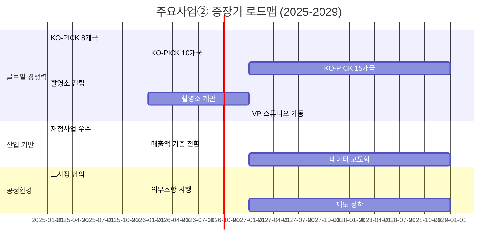
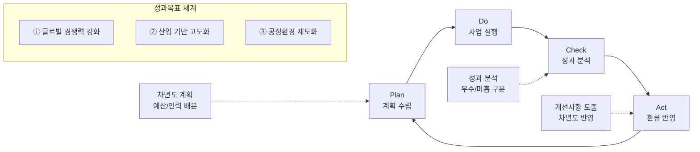

---
{"publish":true,"permalink":"/경영평가/주요사업2/환류","title":"8_환류(Act)","created":"2025-12-16","modified":"2025-12-16T16:05:41.639+09:00","tags":["#경영평가","#주요사업","#혁신성장기반강화","#Act","#작성방안"],"cssclasses":""}
---

# [2-2 한국영화 혁신성장 기반강화] 환류(A) 작성 방안

> [!abstract] 문서 개요
> 본 문서는 '2-2 한국영화 혁신성장 기반강화' 지표의 **세부평가내용④ 환류활동** 작성을 위한 구조와 세부 작성 방안을 제안합니다.
>
> **평가내용 04**: 주요사업별 환류활동은 적절하게 수행되었는가?
> **수정일**: 2025-12-16 (계획-실행-성과 체계에 맞춘 3개 성과목표 기반 재정리)

---

## 📋 Act(A) 세부 구조

> [!tip] Act 섹션 작성 가이드
> **이 섹션의 목적**: Check에서 분석한 성과를 바탕으로 **개선 및 차년도 계획**을 보여주는 부분입니다.
> 
> **핵심 질문**: "성과 분석 결과를 어떻게 반영했나요? 차년도에 뭘 개선하나요?"
> 
> **Act 섹션의 2가지 평가착안사항**:
> 1. **성과 분석 및 환류**: 성과 분석 결과를 사업에 어떻게 반영했는가?
> 2. **차년도 계획 반영**: 분석 결과가 차년도 계획에 어떻게 반영되었는가?
> 
> **작성 팁**: "분석 → 개선 → 차년도 반영"의 **순환 구조** 강조

| 구분 | 세부 항목 |
|------|----------|
| **1. 성과 분석 및 환류** | 가. 성과목표별 성과 분석 나. 개선사항 도출 및 반영 |
| **2. 차년도 계획 반영** | 가. 차년도 사업계획 반영 나. 중장기 발전계획 연계 |

---

## 1. 성과목표-성과지표 체계 (Plan-Do-Check 연계)

> [!note] PDCA 연계
> 본 섹션은 `5_계획(Plan)`, `6_실행(Do)`, `7_성과(Check)` 문서에서 설정한 3개 성과목표 체계를 기반으로 환류 방향을 제시합니다.

| 성과목표 | 실행과제 | 계량 성과지표 | 비계량 성과지표 |
|---------|---------|--------------|----------------|
| **① 글로벌 경쟁력 강화** | 해외진출 네트워크 확대 첨단 제작 인프라 구축 | KO-PICK 비즈매칭 건수 로케이션 인센티브 경제효과 | 글로벌 네트워크 확대 성과 첨단 제작 인프라 구축 노력 |
| **② 산업 기반 고도화** | 영화정보 관리체계 고도화 정책연구 현장 연계 강화 | 통합전산망 데이터 활용도 정책연구 제도개선 반영률 | 영화정보 관리체계 고도화 정책연구 현장 연계성 강화 |
| **③ 공정환경 제도화** | 노사정 합의 제도화 저작권 보호 강화 | 영화인신문고 종결비율 불법유통 모니터링 건수 | 공정환경 제도화 성과 저작권 보호 강화 노력 |

---

## 2. 성과 분석 및 환류

### 2.1 성과목표별 성과 분석

> [!tip] 작성 가이드
> **성과 분석 작성법**:
> - 각 성과목표별 **우수/미흡** 구분하여 분석
> - 우수 성과는 **확대/강화** 방향 제시
> - 미흡 성과는 **개선 방안** 구체적으로 제시

#### 성과목표① 글로벌 경쟁력 강화

| 실행과제 | 성과지표 | 목표 | 실적 | 달성률 | 성과 분석 | 환류 방향 |
|---------|---------|:----:|:----:|:------:|----------|----------|
| **해외진출 네트워크 확대** | KO-PICK 비즈매칭 건수 | 289 | 289 | 100% | **우수**: 8개국 확대(167%↑), CNC 자매결연(아시아 최초) | • KO-PICK **10개국** 확대 추진 • CNC 공동행사 2026년 파리 개최 |
| | 로케이션 인센티브 경제효과 | 20배 | 23.6배 | 118% | **우수**: 4편 유치, 국내집행 211.8억, 한국스태프 644명 | • 인센티브 제도 추가 개선 • 대형 외국영화 **6편** 유치 목표 |
| **첨단 제작 인프라 구축** | 촬영소 공정률 | 110% | 110%↑ | 초과 | **우수**: 147일 지연 극복, 중대재해 ZERO | • **전담 조직 26년 1분기 신설** • 2026년 하반기 준공 목표 |
| | VP 스튜디오 예산 | 163억 | 163억 | 100% | **우수**: 해외 7개 스튜디오 벤치마킹, 100G 네트워크 확정 | • **2027년 가동** 목표 이행 • 다이나믹 LED Wall 설계 확정 |

#### 성과목표② 산업 기반 고도화

| 실행과제 | 성과지표 | 목표 | 실적 | 달성률 | 성과 분석 | 환류 방향 |
|---------|---------|:----:|:----:|:------:|----------|----------|
| **영화정보 관리체계 고도화** | 통합전산망 데이터 활용도 | +10% | +10.7% | 107% | **우수**: 재정사업 100점(우수), 영등위 업무협약 체결 | • 통전망 운영 체계 **지속 고도화** • **API 연동 '26년 본격 시행** |
| | 영화정보통합관리창구 | 4개 | 4개 | 100% | **우수**: FIMS 영화코드, 상영타입, 크레디트, 정보수정 | • 창구 운영 안정화 • 추가 유관기관 연계 검토 |
| **정책연구 현장 연계 강화** | 정책연구 제도개선 반영률 | 3건 | 3건 | 100% | **우수**: 7개 연구과제 수행, 37건 생산 | • 북미진출 연구 → **미국사무소** 연계 • 홀드백 연구 → 유통질서 개선 반영 |
| | 수익성 분석 수급률 | 89% | 89.2% | 100% | **우수**: 2년 연속 상승, 언론 인용 266건 | • **90%** 목표 상향 • 언론 인용 **300건** 목표 |

#### 성과목표③ 공정환경 제도화

| 실행과제 | 성과지표 | 목표 | 실적 | 달성률 | 성과 분석 | 환류 방향 |
|---------|---------|:----:|:----:|:------:|----------|----------|
| **노사정 합의 제도화** | 표준보수지침 제정 | 합의 | 공표 | 초과 | **우수**: 법개정 10년 만 최초 노사정 합의, 2025.10.01. 공표 | • **2026년 사업요강 의무조항** 시행 • 이행 모니터링 체계 구축 |
| | 안전보건협약 체결 | 협약 | 체결 | 100% | **우수**: 산업단위 최초, 6개 기관 참여 | • **명예산업안전감독관** 시범 시행 • 안전관리비 편성 의무화 시행 |
| **저작권 보호 강화** | 영화인신문고 종결비율 | 70%↑ | 65% | 92.9% | **미흡**: 저작권 중재위 신설 과정에서 일시적 저하 | • 3심제 운영 **정착** • 분쟁해결 전문성 강화 |
| | 불법유통 모니터링 건수 | 367,000 | 367,059 | 100% | **우수**: 참여작품 50%↑, 삭제조치 230,149건, 피해예방액 867억 | • **저작권보호원 업무협약** 체결 • 중화권 사이트 대응 강화 |

---

### 2.2 개선사항 도출 및 반영

> [!note]+ 📊 성과목표① 글로벌 경쟁력 강화 - 개선사항 도출

| 분석 결과 | 개선사항 | 반영 내용 |
|----------|---------|----------|
| KO-PICK 8개국 확대 성공 | 글로벌 네트워크 지속 확대 필요 | • **2026년 10개국** 확대 목표 • 남미(우디네, 벤타나 수르), 캐나다(밴쿠버) 신규 진출 |
| CNC 자매결연 체결 | 실질적 협력 사업 추진 필요 | • **2026년 파리 공동행사** 개최 확정 • 한-프 공동제작 프로젝트 발굴 • ACFM 예산 **15억**(2.5배) 확보 완료 |
| 로케이션 경제효과 23.6배 | 제도 개선 효과 지속 | • 인센티브 제도 **추가 개선** 검토 • 대형 외국영화 **6편** 유치 목표 |
| 촬영소 공정률 110% 달성 | 준공 후 운영 준비 필요 | • **전담 조직 26년 1분기 신설** (스튜디오운영팀, 시설관리팀) • 운영사무실, 휴게공간 추가 조성 |
| VP 스튜디오 163억 확보 | 구축 및 가동 준비 | • **2027년 가동** 목표 이행 • 다이나믹 LED Wall(가변형) 설계 확정 • 에셋 라이브러리 구축 병행 |
| 다낭아시안영화제 주빈국 참여 | 동남아 시장 진출 강화 | • 베트남 VFDA 협력 지속 • 영화 DB 공동개발 추진 |

> [!note]+ 📊 성과목표② 산업 기반 고도화 - 개선사항 도출

| 분석 결과 | 개선사항 | 반영 내용 |
|----------|---------|----------|
| 재정사업 100점(우수) 달성 | 우수 등급 유지 필요 | • 통전망 운영 체계 **지속 고도화** • 데이터 품질 관리 강화 |
| 영등위 업무협약 체결 | 실질적 데이터 연계 필요 | • **API 연동 '26년 본격 시행** • 독립예술영화 정보 연계 활성화 |
| 통전망 매출액 기준 연구 완료 | 제도 전환 준비 | • **'26년 매출액 기준 전환** 시행 • 업계 설명회 및 안내 진행 |
| 영화정보통합관리창구 4개 신설 | 운영 안정화 | • 창구별 처리 현황 모니터링 • 영화인 행정 편의성 지속 개선 |
| 7개 연구과제 수행, 37건 생산 | 연구결과 제도개선 연계 | • 북미진출 연구 → **미국사무소 설립** 연계 • 홀드백 연구 → 유통질서 개선 반영 |
| 내부 AI(LLM Manager) 도입 | 활용도 확대 | • 연구자료 **256개+** 지속 확대 • 업무 생산성 향상 효과 측정 |

> [!note]+ 📊 성과목표③ 공정환경 제도화 - 개선사항 도출

| 분석 결과 | 개선사항 | 반영 내용 |
|----------|---------|----------|
| 표준보수지침 제정 (10년 만) | 사업요강 의무화 시행 | • **2026년 중예산 사업 의무조항** 시행 • 임금내역서 제출 의무화 • OTT 영화스태프 실태조사 확대 |
| 안전보건협약 체결 (산업 최초) | 후속 제도 시행 | • **명예산업안전감독관** 2026년 시범 시행 • 안전관리비 편성 의무화 시행 • 영화산업 안전보건 교육과정 개설 준비 |
| 저작권 중재위원회 11회 개최 | 운영 안정화 | • 3심제 운영 **정착** • 분쟁해결 전문성 강화 • 시나리오 크레디트 규칙 표준화 추진 |
| 불법유통 모니터링 367,059건 | 유관기관 협력 강화 | • **저작권보호원 업무협약** '25.12월 체결 • 핫라인 구축, 홍보협력 강화 |
| 성평등센터 예방교육 2,977명 | 수혜대상 확대 | • 외국어 강의안 번역 • 상시 온라인 수강 동영상 과정 활성화 |

---

## 3. 차년도 계획 반영

### 3.1 차년도(2026년) 사업계획 반영

> [!tip] 작성 가이드
> **차년도 계획 작성법**:
> - 성과 분석 결과가 **구체적으로 어떻게 반영**되었는지 명시
> - **신규 사업**, **확대 사업**, **개선 사업** 구분
> - 예산/인력 배분 계획 포함

> [!success]+ ✅ 성과목표① 글로벌 경쟁력 강화 - 2026년 계획

| 구분 | 사업명 | 2025년 | 2026년 계획 | 변경 사유 |
|------|--------|:------:|:------:|----------|
| **확대** | KO-PICK 쇼케이스 | 8개국 | **10개국** | 글로벌 네트워크 지속 확대 (남미, 캐나다 추가) |
| **신규** | CNC 공동행사 | 자매결연 | **파리 개최** | 한-프 수교 140주년 기념 후속 사업 |
| **확대** | ACFM | 6억 | **15억** | 제20회 성공 개최 → 예산 2.5배 증액 |
| **확대** | 로케이션 인센티브 | 4편 | **6편** | 제도 개선 효과 확대 |
| **신규** | VP 스튜디오 구축 | 설계 | **구축 착수** | 163억 예산 집행 |
| **신규** | 촬영소 전담 조직 | - | **1분기 신설** | 운영 준비 (스튜디오운영팀, 시설관리팀) |
| **개선** | 국제공동제작 기획개발 | - | **영화화지원 연계** | 신규 사업 설계 |

> [!success]+ ✅ 성과목표② 산업 기반 고도화 - 2026년 계획

| 구분 | 사업명 | 2025년 | 2026년 계획 | 변경 사유 |
|------|--------|:------:|:------:|----------|
| **개선** | 통전망 집계기준 | 관객수 | **매출액** | 연구결과 반영, 업계 설명회 시행 |
| **확대** | 유관기관 연계 | 6개 기관 | **8개 기관** | 데이터 연계 확대 |
| **신규** | 영등위 API 연동 | 협약 | **본격 시행** | 독립예술영화 정보 연계 |
| **유지** | 정책연구과제 | 7개 | **7개** | 현장 연계 지속 |
| **확대** | 조사통계 발간 | 6종 | **7종** | 신규 통계 추가 |
| **확대** | 수급률 목표 | 89.2% | **90%** | 품질 향상 지속 |
| **확대** | 언론 인용 목표 | 266건 | **300건** | 활용도 확대 |

> [!success]+ ✅ 성과목표③ 공정환경 제도화 - 2026년 계획

| 구분 | 사업명 | 2025년 | 2026년 계획 | 변경 사유 |
|------|--------|:------:|:------:|----------|
| **신규** | 표준보수액 의무화 | 합의/공표 | **시행** | 사업요강 의무조항 반영 |
| **신규** | 안전관리비 의무화 | 협약 | **시행** | 사업요강 의무조항 반영 |
| **신규** | 명예산업안전감독관 | - | **시범 시행** | 협약 후속 조치 |
| **확대** | 불법유통 모니터링 | 367,059건 | **400,000건** | 대응 강화 (+9%) |
| **신규** | 저작권보호원 협약 | 협의 | **체결** | 핫라인 구축, 홍보협력 |
| **개선** | 시나리오 크레디트 규칙 | 연구 | **포럼 4회** | 표준화 추진 (분기별 포럼) |
| **확대** | 영화인신문고 종결비율 | 65% | **70%↑** | 중재위 운영 안정화 |

---

### 3.2 중장기 발전계획 연계

> [!tip] 작성 가이드
> **중장기 계획 연계 작성법**:
> - 단년도 성과가 **중장기 목표**에 어떻게 기여하는지 명시
> - **2029 경영목표**와의 연결고리 제시
> - 로드맵 형태로 시각화

| 2029 경영목표 | 성과목표 | 2025년 성과 | 2026년 계획 | 2027년 이후 |
|--------------|---------|------------|------------|------------|
| **K-무비의 국내외 경쟁력 극대화** | ① 글로벌 경쟁력 강화 | KO-PICK 8개국, CNC 자매결연 | 10개국 확대, 파리 공동행사 | **2029년 15개국** 글로벌 네트워크 |
| **K-무비의 지속 성장 기반 강화** | ① 글로벌 경쟁력 강화 | 촬영소 110%, VP 163억 확보 | VP 구축 착수, 전담 조직 신설 | **2027년 촬영소 개관**, VP 가동 |
| **영화산업 선순환 구조 확보** | ③ 공정환경 제도화 | 표준보수지침, 안전보건협약 | 의무조항 시행, 감독관 시범 | **공정환경 제도 정착** |
| **책임과 합리적 조직경영 실현** | ② 산업 기반 고도화 | 재정사업 100점(우수) | 우수 등급 유지, 매출액 기준 전환 | **데이터 기반 정책 고도화** |

#### 성과목표별 중장기 로드맵

---

## 4. 환류 체계 및 모니터링

### 4.1 PDCA 순환 체계

### 4.2 환류 모니터링 계획

| 성과목표 | 환류 항목 | 모니터링 주기 | 담당 부서 | 2026년 핵심 KPI |
|---------|---------|:------:|---------|----------------|
| **① 글로벌 경쟁력 강화** | KO-PICK 확대 현황 | 분기 | 국제교류팀 | 10개국 진출 |
| | CNC 공동행사 | 반기 | 국제교류팀 | 파리 행사 개최 |
| | 촬영소 건립 진행 | 월간 | 영화기술인프라팀 | 준공, 전담 조직 신설 |
| | VP 스튜디오 구축 | 분기 | 영화기술인프라팀 | 구축 착수 |
| **② 산업 기반 고도화** | 통전망 기준 전환 | 분기 | 디지털혁신팀 | 매출액 기준 시행 |
| | 영등위 API 연동 | 분기 | 디지털혁신팀 | 본격 시행 |
| | 연구과제 제도개선 반영 | 반기 | 정책개발팀 | 3건 이상 반영 |
| **③ 공정환경 제도화** | 의무조항 이행 현황 | 분기 | 공정환경조성팀 | 100% 이행 |
| | 명예산업안전감독관 | 분기 | 공정환경조성팀 | 시범 시행 |
| | 불법유통 대응 실적 | 월간 | 공정환경조성팀 | 400,000건 |

---

## 5. 핵심 환류 성과 요약

> [!success] 핵심 환류 성과
> **"성과 분석 → 개선 도출 → 차년도 반영"** 순환 구조 완성

### 5.1 제도화 완료 (2025년 → 2026년 시행)

| 구분 | 성과 | 2025년 | 2026년 시행 |
|:---:|------|--------|------------|
| **1** | 표준보수지침 | 노사정 합의, 문체부 공표 | **사업요강 의무조항** 시행 |
| **2** | 안전보건협약 | 노사정 공동협약 체결 | **안전관리비 의무화** 시행 |
| **3** | 통전망 기준 전환 | 연구 완료, 확정 | **매출액 기준** 시행 |
| **4** | 영등위 연계 | 업무협약 체결 | **API 연동** 본격 시행 |

### 5.2 신규 사업 착수 (2026년)

| 사업명 | 성과목표 | 내용 | 예산/규모 |
|--------|---------|------|----------|
| VP 스튜디오 구축 | ① 글로벌 경쟁력 강화 | 다이나믹 LED Wall 구축 | **163억** |
| CNC 공동행사 | ① 글로벌 경쟁력 강화 | 파리 국제공동협력제작 행사 | 신규 |
| 촬영소 전담 조직 | ① 글로벌 경쟁력 강화 | 스튜디오운영팀, 시설관리팀 | 1분기 신설 |
| 명예산업안전감독관 | ③ 공정환경 제도화 | 촬영현장 안전 모니터링 | 시범 시행 |
| 시나리오 크레디트 포럼 | ③ 공정환경 제도화 | 분기별 4회 포럼 개최 | 표준화 추진 |

### 5.3 확대 사업 (2026년)

| 사업명 | 성과목표 | 2025년 | 2026년 | 증감 |
|--------|---------|:------:|:------:|:------:|
| KO-PICK 쇼케이스 | ① 글로벌 경쟁력 강화 | 8개국 | 10개국 | +2개국 |
| ACFM 예산 | ① 글로벌 경쟁력 강화 | 6억 | 15억 | +9억 (2.5배) |
| 로케이션 인센티브 | ① 글로벌 경쟁력 강화 | 4편 | 6편 | +2편 |
| 유관기관 연계 | ② 산업 기반 고도화 | 6개 기관 | 8개 기관 | +2개 기관 |
| 불법유통 모니터링 | ③ 공정환경 제도화 | 367,059건 | 400,000건 | +9% |

---

## [부록] 부서별 환류 계획

### A. 국제교류팀 (성과목표① 글로벌 경쟁력 강화)

| 2025년 성과 | 환류 방향 | 2026년 계획 |
|------------|----------|------------|
| KO-PICK 8개국 확대 | 글로벌 네트워크 지속 확대 | **10개국** 확대 (우디네, 밴쿠버, 벤타나 수르 추가) |
| CNC 자매결연 | 실질적 협력 사업 추진 | **파리 공동행사** 개최 |
| 로케이션 경제효과 23.6배 | 제도 개선 효과 확대 | **6편** 유치 목표 |
| AFAN 태국 THACCA 영입 | 아세안 협력 강화 | 공동펀드 조성 추진 |
| ACFM 방문 30,006명 | 마켓 성장 지속 | 예산 **15억** (2.5배 증액) |
| 다낭 주빈국 참여 | 동남아 시장 확대 | 베트남 VFDA 협력 지속 |

### B. 영화기술인프라팀 (성과목표① 글로벌 경쟁력 강화)

| 2025년 성과 | 환류 방향 | 2026년 계획 |
|------------|----------|------------|
| 촬영소 공정률 110% | 준공 및 운영 준비 | **전담 조직 신설** (1분기), 추가 시설 조성 |
| VP 163억 확보 | 구축 착수 | **다이나믹 LED Wall** 구축 시작 |
| AI CCTV·5Gas 도입 | 운영 안정화 | 스마트 안전관리 **고도화** |
| 100G 네트워크 확정 | 설치 준비 | 국내 최고 수준 인프라 구축 |

### C. 디지털혁신팀 (성과목표② 산업 기반 고도화)

| 2025년 성과 | 환류 방향 | 2026년 계획 |
|------------|----------|------------|
| 재정사업 100점(우수) | 우수 등급 유지 | 운영 체계 **지속 고도화** |
| 영등위 업무협약 | 실질적 데이터 연계 | **API 연동** 본격 시행 |
| 통전망 연구 완료 | 제도 전환 시행 | **매출액 기준** 전환 |
| 영화정보통합관리창구 4개 | 운영 안정화 | 처리 현황 모니터링 강화 |
| 내부 AI(LLM Manager) 도입 | 활용도 확대 | 연구자료 지속 업데이트 |

### D. 정책개발팀 (성과목표② 산업 기반 고도화)

| 2025년 성과 | 환류 방향 | 2026년 계획 |
|------------|----------|------------|
| 7개 연구과제 수행 | 제도개선 연계 | 북미진출 → **미국사무소** 연계 |
| 수급률 89.2% | 품질 향상 지속 | **90%** 목표 |
| 언론 인용 266건 | 활용도 확대 | **300건** 목표 |
| 통전망 매출액 기준 확정 | 제도 전환 지원 | 업계 설명회 진행 |
| 홀드백 연구(8개년 1,192편) | 유통질서 개선 | 제도개선 반영 추진 |

### E. 공정환경조성팀 (성과목표③ 공정환경 제도화)

| 2025년 성과 | 환류 방향 | 2026년 계획 |
|------------|----------|------------|
| 표준보수지침 제정 | 의무화 시행 | **사업요강 의무조항** 시행, 임금내역서 제출 |
| 안전보건협약 체결 | 후속 제도 시행 | **명예산업안전감독관** 시범 시행 |
| 저작권 중재위 11회 개최 | 운영 안정화 | 3심제 운영 **정착**, 종결비율 **70%↑** 목표 |
| 불법유통 367,059건 | 협력 강화 | **저작권보호원 업무협약** 체결 |
| 성평등센터 2,977명 교육 | 수혜대상 확대 | 외국어 강의안 번역, 온라인 과정 활성화 |
| 시나리오 크레디트 연구 | 표준화 추진 | **분기별 포럼 4회** 개최 |

---

## 관련 문서

- [[25년 경평/2_지표별 자료/2-2_혁신성장_기반_강화/5_계획(Plan)_작성_방안]]
- [[25년 경평/2_지표별 자료/2-2_혁신성장_기반_강화/6_실행(Do)_작성_방안]]
- [[25년 경평/2_지표별 자료/2-2_혁신성장_기반_강화/7_성과(Check)_작성_방안]]
- [[25년 경평/2_지표별 자료/2-2_혁신성장_기반_강화/2_핵심 실적 분석]]
- [[25년 경평/2_지표별 자료/2-2_혁신성장_기반_강화/3_전년도_지적사항_및_개선실적]]

---

> **작성일**: 2025-12-16
> **버전**: v2 (계획-실행-성과 체계에 맞춘 3개 성과목표 기반 재정리)
> **참고자료**: 
> - 5_계획(Plan)_작성_방안.md
> - 6_실행(Do)_작성_방안.md
> - 7_성과(Check)_작성_방안.md
> - 부서별 실적 분석 자료 (국제교류팀, 디지털혁신팀, 공정환경조성팀, 영화기술인프라팀, 정책개발팀)
