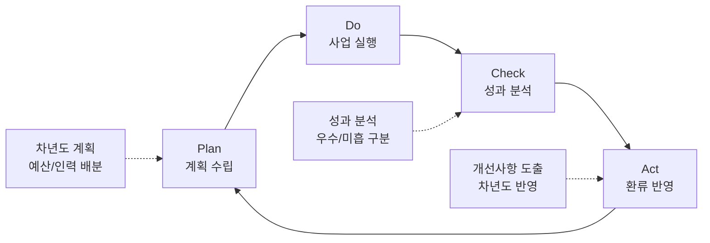

---
{"publish":true,"permalink":"경영평가/주요사업2/환류","title":"8_환류(Act) 작성 방안","created":"2025-12-12","modified":"2025-12-12T14:00:31.140+09:00","tags":["#경영평가","#주요사업","#혁신성장기반강화","#Act","#작성방안"],"cssclasses":""}
---

# [2-2 한국영화 혁신성장 기반강화] 환류(A) 작성 방안

> [!abstract] 문서 개요
> 본 문서는 '2-2 한국영화 혁신성장 기반강화' 지표의 **세부평가내용④ 환류활동** 작성을 위한 구조와 세부 작성 방안을 제안합니다.
>
> **평가내용 04**: 주요사업별 환류활동은 적절하게 수행되었는가?

---

## 1. 개요

### 1.1 Act 세부 구조

> [!tip] Act 섹션 작성 가이드
> **이 섹션의 목적**: Check에서 분석한 성과를 바탕으로 **개선 및 차년도 계획**을 보여주는 부분입니다.
> 
> **핵심 질문**: "성과 분석 결과를 어떻게 반영했나요? 차년도에 뭘 개선하나요?"
> 
> **Act 섹션의 2가지 평가착안사항**:
> 1. **성과 분석 및 환류**: 성과 분석 결과를 사업에 어떻게 반영했는가?
> 2. **차년도 계획 반영**: 분석 결과가 차년도 계획에 어떻게 반영되었는가?
> 
> **작성 팁**: "분석 → 개선 → 차년도 반영"의 **순환 구조** 강조

| 구분 | 세부 항목 |
|------|----------|
| **1. 성과 분석 및 환류** | 가. 성과목표별 성과 분석 나. 개선사항 도출 및 반영 |
| **2. 차년도 계획 반영** | 가. 차년도 사업계획 반영 나. 중장기 발전계획 연계 |

---

## 2. 성과 분석 및 환류

### 2.1 성과목표별 성과 분석

> [!tip] 작성 가이드
> **성과 분석 작성법**:
> - 각 성과목표별 **우수/미흡** 구분하여 분석
> - 우수 성과는 **확대/강화** 방향 제시
> - 미흡 성과는 **개선 방안** 구체적으로 제시

| 성과목표 | 성과 분석 | 환류 방향 |
|---------|----------|----------|
| **① 글로벌 경쟁력 강화** | **우수**: KO-PICK 8개국 확대(167%↑), CNC 자매결연(아시아 최초) **우수**: 로케이션 경제효과 23.6배, 촬영소 공정률 110% | • KO-PICK 10개국 확대 추진 • CNC 공동행사 2026년 파리 개최 • VP 스튜디오 2027년 가동 준비 |
| **② 산업 기반 고도화** | **우수**: 재정사업 100점(우수), 영등위 업무협약 체결 **우수**: 7개 연구과제 수행, 수급률 89.2% | • 통전망 매출액 기준 전환 '26년 시행 • 유관기관 연계 확대 • 연구결과 제도개선 지속 반영 |
| **③ 공정환경 제도화** | **우수**: 표준보수지침 제정(10년 만), 안전보건협약(산업 최초) **우수**: 불법유통 모니터링 367,059건(18%↑) | • 2026년 사업요강 의무조항 시행 • 명예산업안전감독관 제도 시범 시행 • 저작권보호원 업무협약 체결 |

---

### 2.2 개선사항 도출 및 반영

> [!note]+ 📊 성과목표① 글로벌 경쟁력 강화

| 분석 결과 | 개선사항 | 반영 내용 |
|----------|---------|----------|
| KO-PICK 8개국 확대 성공 | 글로벌 네트워크 지속 확대 필요 | • **2026년 10개국** 확대 목표 • 남미, 중동 권역 신규 진출 검토 |
| CNC 자매결연 체결 | 실질적 협력 사업 추진 필요 | • **2026년 파리 공동행사** 개최 확정 • 한-프 공동제작 프로젝트 발굴 |
| 로케이션 경제효과 23.6배 | 제도 개선 효과 지속 | • 인센티브 제도 **추가 개선** 검토 • 대형 외국영화 유치 강화 |
| 촬영소 공정률 110% 달성 | 준공 후 운영 준비 필요 | • **전담 조직 26년 1분기 신설** • 운영사무실, 휴게공간 추가 조성 |
| VP 스튜디오 163억 확보 | 구축 및 가동 준비 | • **2027년 가동** 목표 이행 • 다이나믹 LED Wall 설계 확정 |

> [!note]+ 📊 성과목표② 산업 기반 고도화

| 분석 결과 | 개선사항 | 반영 내용 |
|----------|---------|----------|
| 재정사업 100점(우수) 달성 | 우수 등급 유지 필요 | • 통전망 운영 체계 **지속 고도화** • 데이터 품질 관리 강화 |
| 영등위 업무협약 체결 | 실질적 데이터 연계 필요 | • **API 연동 '26년 본격 시행** • 추가 유관기관 연계 검토 |
| 통전망 매출액 기준 연구 완료 | 제도 전환 준비 | • **'26년 매출액 기준 전환** 시행 • 업계 설명회 및 안내 |
| 7개 연구과제 수행 | 연구결과 제도개선 연계 | • 북미진출 연구 → **미국사무소 설립** 연계 • 홀드백 연구 → 유통질서 개선 반영 |

> [!note]+ 📊 성과목표③ 공정환경 제도화

| 분석 결과 | 개선사항 | 반영 내용 |
|----------|---------|----------|
| 표준보수지침 제정 | 사업요강 의무화 시행 | • **2026년 중예산 사업 의무조항** 시행 • 이행 모니터링 체계 구축 |
| 안전보건협약 체결 | 후속 제도 시행 | • **명예산업안전감독관** 2026년 시범 시행 • 안전관리비 편성 의무화 시행 |
| 저작권 중재위원회 신설 | 운영 안정화 | • 3심제 운영 **정착** • 분쟁해결 전문성 강화 |
| 불법유통 모니터링 확대 | 유관기관 협력 강화 | • **저작권보호원 업무협약** '25.12월 체결 • 중화권 사이트 대응 강화 |

---

## 3. 차년도 계획 반영

### 3.1 차년도(2026년) 사업계획 반영

> [!tip] 작성 가이드
> **차년도 계획 작성법**:
> - 성과 분석 결과가 **구체적으로 어떻게 반영**되었는지 명시
> - **신규 사업**, **확대 사업**, **개선 사업** 구분
> - 예산/인력 배분 계획 포함

> [!success]+ ✅ 성과목표① 글로벌 경쟁력 강화 - 2026년 계획

| 구분 | 사업명 | 2025년 | 2026년 계획 | 변경 사유 |
|------|--------|:------:|:------:|----------|
| **확대** | KO-PICK 쇼케이스 | 8개국 | **10개국** | 글로벌 네트워크 지속 확대 |
| **신규** | CNC 공동행사 | - | **파리 개최** | 자매결연 후속 사업 |
| **확대** | 로케이션 인센티브 | 4편 | **6편** | 제도 개선 효과 확대 |
| **신규** | VP 스튜디오 구축 | 설계 | **구축 착수** | 163억 예산 집행 |
| **신규** | 촬영소 전담 조직 | - | **1분기 신설** | 운영 준비 |

> [!success]+ ✅ 성과목표② 산업 기반 고도화 - 2026년 계획

| 구분 | 사업명 | 2025년 | 2026년 계획 | 변경 사유 |
|------|--------|:------:|:------:|----------|
| **개선** | 통전망 집계기준 | 관객수 | **매출액** | 연구결과 반영 |
| **확대** | 유관기관 연계 | 6개 기관 | **8개 기관** | 데이터 연계 확대 |
| **유지** | 정책연구과제 | 7개 | **7개** | 현장 연계 지속 |
| **확대** | 조사통계 발간 | 6종 | **7종** | 신규 통계 추가 |

> [!success]+ ✅ 성과목표③ 공정환경 제도화 - 2026년 계획

| 구분 | 사업명 | 2025년 | 2026년 계획 | 변경 사유 |
|------|--------|:------:|:------:|----------|
| **신규** | 표준보수액 의무화 | 합의 | **시행** | 사업요강 반영 |
| **신규** | 안전관리비 의무화 | 협약 | **시행** | 사업요강 반영 |
| **신규** | 명예산업안전감독관 | - | **시범 시행** | 협약 후속 조치 |
| **확대** | 불법유통 모니터링 | 367,059건 | **400,000건** | 대응 강화 |
| **신규** | 저작권보호원 협약 | 협의 | **체결** | 협력 강화 |

---

### 3.2 중장기 발전계획 연계

> [!tip] 작성 가이드
> **중장기 계획 연계 작성법**:
> - 단년도 성과가 **중장기 목표**에 어떻게 기여하는지 명시
> - **2029 경영목표**와의 연결고리 제시
> - 로드맵 형태로 시각화

| 2029 경영목표 | 2025년 성과 | 2026년 계획 | 중장기 방향 |
|--------------|------------|------------|-----------|
| **K-무비의 국내외 경쟁력 극대화** | KO-PICK 8개국, CNC 자매결연 | 10개국 확대, 파리 공동행사 | **2029년 15개국** 글로벌 네트워크 |
| **K-무비의 지속 성장 기반 강화** | 촬영소 110%, VP 163억 확보 | VP 구축 착수, 전담 조직 신설 | **2027년 촬영소 개관**, VP 가동 |
| **영화산업 선순환 구조 확보** | 표준보수지침, 안전보건협약 | 의무조항 시행, 감독관 시범 | **공정환경 제도 정착** |
| **책임과 합리적 조직경영 실현** | 재정사업 100점(우수) | 우수 등급 유지 | **데이터 기반 정책 고도화** |

---

## 4. 환류 체계 및 모니터링

### 4.1 환류 체계

### 4.2 환류 모니터링 계획

| 성과목표 | 환류 항목 | 모니터링 주기 | 담당 부서 |
|---------|---------|:------:|---------|
| **글로벌 경쟁력 강화** | KO-PICK 확대 현황 | 분기 | 국제교류팀 |
| | 촬영소 건립 진행 | 월간 | 영화기술인프라팀 |
| | VP 스튜디오 구축 | 분기 | 영화기술인프라팀 |
| **산업 기반 고도화** | 통전망 기준 전환 | 분기 | 디지털혁신팀 |
| | 연구과제 제도개선 반영 | 반기 | 정책개발팀 |
| **공정환경 제도화** | 의무조항 이행 현황 | 분기 | 공정환경조성팀 |
| | 불법유통 대응 실적 | 월간 | 공정환경조성팀 |

---

## 5. 핵심 환류 성과 요약

> [!success] 핵심 환류 성과
> **"성과 분석 → 개선 도출 → 차년도 반영"** 순환 구조 완성

### 5.1 제도화 완료 (2025년 → 2026년 시행)

| 성과 | 2025년 | 2026년 시행 |
|------|--------|------------|
| 표준보수지침 | 노사정 합의, 문체부 공표 | **사업요강 의무조항** 시행 |
| 안전보건협약 | 노사정 공동협약 체결 | **안전관리비 의무화** 시행 |
| 통전망 기준 전환 | 연구 완료, 확정 | **매출액 기준** 시행 |

### 5.2 신규 사업 착수 (2026년)

| 사업명 | 내용 | 예산/규모 |
|--------|------|----------|
| VP 스튜디오 구축 | 다이나믹 LED Wall 구축 | **163억** |
| CNC 공동행사 | 파리 국제공동협력제작 행사 | 신규 |
| 촬영소 전담 조직 | 스튜디오운영팀, 시설관리팀 | 1분기 신설 |
| 명예산업안전감독관 | 촬영현장 안전 모니터링 | 시범 시행 |

### 5.3 확대 사업 (2026년)

| 사업명 | 2025년 | 2026년 | 증감 |
|--------|:------:|:------:|:------:|
| KO-PICK 쇼케이스 | 8개국 | 10개국 | +2개국 |
| 로케이션 인센티브 | 4편 | 6편 | +2편 |
| 유관기관 연계 | 6개 기관 | 8개 기관 | +2개 기관 |
| 불법유통 모니터링 | 367,059건 | 400,000건 | +9% |

---

## [부록] 부서별 환류 계획

### A. 국제교류팀

| 2025년 성과 | 환류 방향 | 2026년 계획 |
|------------|----------|------------|
| KO-PICK 8개국 확대 | 글로벌 네트워크 지속 확대 | **10개국** 확대 (남미, 중동 검토) |
| CNC 자매결연 | 실질적 협력 사업 추진 | **파리 공동행사** 개최 |
| 로케이션 경제효과 23.6배 | 제도 개선 효과 확대 | **6편** 유치 목표 |

### B. 디지털혁신팀

| 2025년 성과 | 환류 방향 | 2026년 계획 |
|------------|----------|------------|
| 재정사업 100점(우수) | 우수 등급 유지 | 운영 체계 **지속 고도화** |
| 영등위 업무협약 | 실질적 데이터 연계 | **API 연동** 본격 시행 |
| 통전망 연구 완료 | 제도 전환 시행 | **매출액 기준** 전환 |

### C. 공정환경조성팀

| 2025년 성과 | 환류 방향 | 2026년 계획 |
|------------|----------|------------|
| 표준보수지침 제정 | 의무화 시행 | **사업요강 의무조항** 시행 |
| 안전보건협약 체결 | 후속 제도 시행 | **명예산업안전감독관** 시범 시행 |
| 저작권 중재위 신설 | 운영 안정화 | 3심제 운영 **정착** |

### D. 영화기술인프라팀

| 2025년 성과 | 환류 방향 | 2026년 계획 |
|------------|----------|------------|
| 촬영소 공정률 110% | 준공 및 운영 준비 | **전담 조직 신설**, 추가 시설 조성 |
| VP 163억 확보 | 구축 착수 | **다이나믹 LED Wall** 구축 |
| AI 안전장비 도입 | 운영 안정화 | 스마트 안전관리 **고도화** |

### E. 정책개발팀

| 2025년 성과 | 환류 방향 | 2026년 계획 |
|------------|----------|------------|
| 7개 연구과제 수행 | 제도개선 연계 | 북미진출 → **미국사무소** 연계 |
| 수급률 89.2% | 품질 향상 지속 | **90%** 목표 |
| 언론 인용 266건 | 활용도 확대 | **300건** 목표 |

---

## 관련 문서

- [[25년 경평/2_지표별 자료/2-2_혁신성장_기반_강화/5_계획(Plan)_작성_방안]]
- [[25년 경평/2_지표별 자료/2-2_혁신성장_기반_강화/6_실행(Do)_작성_방안]]
- [[25년 경평/2_지표별 자료/2-2_혁신성장_기반_강화/7_성과(Check)_작성_방안]]
- [[25년 경평/2_지표별 자료/2-2_혁신성장_기반_강화/8_환류(Act)_작성_방안]]
- [[25년 경평/2_지표별 자료/2-2_혁신성장_기반_강화/2_핵심 실적 분석]]
- [[25년 경평/2_지표별 자료/2-2_혁신성장_기반_강화/3_전년도_지적사항_및_개선실적]]

---

> **작성일**: 2025-12-12
> **참고자료**: 
> - 6_실행(Do)_작성_방안.md
> - 7_성과(Check)_작성_방안.md
> - 부서별 실적 분석 자료
