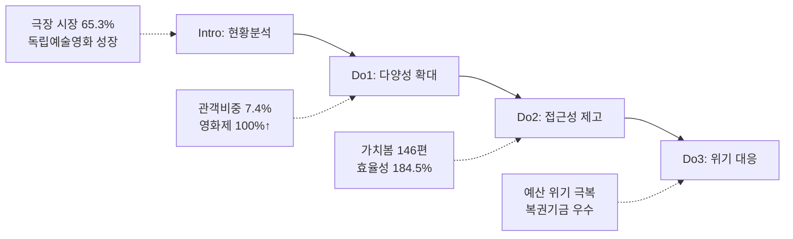

---
{"publish":true,"permalink":"/경영평가/주요사업3/실행","title":"6_실행(Do)","created":"2025-12-16","modified":"2025-12-16T10:42:57.699+09:00","tags":["#경영평가","#주요사업","#영화문화가치확산","#비계량","#작성방안"],"cssclasses":""}
---


# [2-3 영화문화 가치확산] 실행(D) 작성 방안

> [!abstract] 문서 개요
> 본 문서는 '2-3 영화문화 가치확산' 지표의 **세부평가내용② 추진활동 수행** 작성을 위한 구조와 세부 작성 방안을 제안합니다.
>
> **평가내용 02**: 주요사업별 추진활동은 적절히 수행되었는가?
> **핵심 목표**: 전년도 지적사항(C등급, 4.2점)을 극복하고, **'영화문화 다양성 확대'**와 **'영화문화 접근성 제고'**를 통해 목표 등급(B등급 이상) 달성
> **주관부서**: 영화문화팀
> **수정일**: 2025-12-16 (계획(P) v2 및 부서성과평가보고서 기반 업데이트)

---

## 1. 개요

### 1.1 Do 세부 구조

| 구분 | 세부 항목 |
|------|----------|
| **1. 추진활동 실적** | 가. 독립예술영화 유통 활성화 (개봉지원, 전용관, 영화제)<br>나. 장애인 동시관람 환경 구축 (가치봄)<br>다. 문화소외계층 관람환경 개선 (찾아가는 영화관)<br>라. 차세대 미래관객 육성 (청소년 교육)<br>마. 국민 영화관람 활성화 (할인권) |
| **2. 효율성 제고 노력 및 성과** | 가. 운영체계 개편 (직접/간접 이원화)<br>나. 예산 효율성 극대화 (184.5%)<br>다. 외부 협업 확대 (영상자료원, 상영관 3사) |
| **3. 모니터링 긴급현안 대응** | 가. 예산 61.5% 감소 위기 대응<br>나. 장애인 차별 소송 대응 |

---

### 1.2 Storyline 구성안 비교

#### Option A: 다양성·접근성 중심 구조 (추천)

| 구분 | 내용 |
|------|------|
| **구조** | 영화문화 다양성 확대 → 영화문화 접근성 제고 → 위기 대응 |
| **장점** | Plan v2 성과목표 체계와 일치, 독립예술영화 유통 성과 강조, 문화복지 실현 부각 |
| **적합도** | ⭐⭐⭐ |

```
다양성 확대(관객비중 7.4%) → 접근성 제고(가치봄 146편, 효율성 184.5%) → 미래관객 육성(71.7%↑)
```

#### Option B: 위기 극복 중심 구조

| 구분 | 내용 |
|------|------|
| **구조** | 예산 위기 극복 → 문화소외계층 접근성 → 장애인 접근성 |
| **장점** | 예산 감소에도 불구한 성과 강조, 위기 극복 스토리 부각 |
| **적합도** | ⭐⭐ |

---

### 1.3 추천 Storyline: 다양성 확대 & 접근성 제고

#### 전체 흐름



#### 핵심 메시지

> **"독립예술영화 관객 비중 7.4% 달성으로 영화문화 다양성 확대, 예산 61.5% 감소 위기 속에서도 효율성 184.5% 달성 및 가치봄 146편 제작으로 영화문화 접근성 제고"**

---

## 2. 추진활동 실적

> [!abstract] 성과목표별 문단 구조 (총 10개)
> 
> **성과목표① 영화문화 다양성 확대** (4개 문단)
> - 문단 1: 독립예술영화 개봉지원 ⭐BP
> - 문단 2: 독립예술영화 전용관 지원 ⭐BP
> - 문단 3: 영화제 개최 지원 ⭐BP
> - 문단 4: 독립예술영화 유통 종합
> 
> **성과목표② 영화문화 접근성 제고** (6개 문단)
> - 문단 5: 장애인 동시관람 환경 구축 (가치봄) ⭐BP
> - 문단 6: 문화소외계층 관람환경 개선 (찾아가는 영화관) ⭐BP
> - 문단 7: 차세대 미래관객 육성 (청소년 교육) ⭐BP
> - 문단 8: 국민 영화관람 활성화 (할인권) ⭐BP
> - 문단 9: 예산 위기 대응 종합
> - 문단 10: 장애인 소송 대응 종합

---

### 2.1 성과목표① 영화문화 다양성 확대 (문단 1~4)

> [!note] 성과목표① 개요
> **담당부서**: 영화문화팀
> **핵심 목표**: 독립예술영화 유통 활성화로 영화문화 다양성 확대
> **실행과제**: 독립예술영화 유통 활성화 + 영화제 지원 강화
> **성과지표**: 전체 대비 독립예술영화 관객 비중(%), 지원 영화제 수(개)

---

#### 문단 1: 독립예술영화 개봉지원 [영화문화팀] ⭐BP

> [!quote] 📊 연구보고서 근거: 2024년 한국 영화산업 결산 (KOFIC 연구 2025-02)
> **독립·예술영화 현황**
> - 개봉편수: **298편** (전년대비 +0.3%)
> - 한국 독립·예술영화 매출액: **237억 원** (+133.2%)
> - 한국 독립·예술영화 관객 수: **261만 명** (+129.4%)
> 
> **시사점**: 한국 독립예술영화 관객 수 2.3배 상승 → 유통지원 확대로 성장 모멘텀 지속 필요

| 항목 | 내용 |
|------|------|
| **Core Message** | 공모 연 2회 확대 등 제도 개선으로 독립예술영화 관객 비중 **7.4%** 달성 |
| **주요 근거** | 지원 28편(+16.7%), 공모 연 2회 확대, 관객 비중 7.4%(+1.4%p) |
| **담당 부서** | 영화문화팀 |

| 구분 | 실적 | 성과 |
|------|------|------|
| 지원 확대 | 24편→**28편** (+16.7%), **1,452백만원** | 독립예술영화 개봉 활성화 |
| 제도 개선 | 공모 연 1회→**연 2회**, 개봉기한 11월→**12월** | 사업수행 기간 확보 ⭐⭐BP |
| 공모 조기화 | 전년도 12월 공모, 약정체결 **2월(상반기)/7월(하반기)** | 보조사업자 부담 경감 |
| 개봉 전 지원 | 배급상담소 **53건**, 비즈매칭 **117건** | 배급아카데미 6기 **15명** 양성 |
| 흥행 성과 | 사람과 고기 **3.5만명**, 3670 등 2편 **2만명** 돌파 | 독립영화 흥행 기여 |
| 관객 비중 | 전체 대비 독립예술영화 관객 비중 **7.4%** | 목표 7.0% 대비 **105.7%** 달성 ⭐⭐⭐BP |
| 한국 독립예술영화 | 전체 대비 한국 독립예술영화 관객 비중 **2.7%** | 목표 2.5% 대비 **108.0%** 달성 |

> [!example] 추천 스토리라인
> **"현장 의견수렴 → 공모 연 2회 확대 + 조기공모 → 독립예술영화 관객 비중 7.4% 달성"**

---

#### 문단 2: 독립예술영화 전용관 지원 [영화문화팀] ⭐BP

| 항목 | 내용 |
|------|------|
| **Core Message** | 전국 전용관 전수방문 점검·간담회로 현장 밀착 지원 강화 |
| **주요 근거** | 27개관 지원(+1개관), 전수방문 점검, 현장 간담회 |
| **담당 부서** | 영화문화팀 |

| 구분 | 실적 | 성과 |
|------|------|------|
| 지원 확대 | 26개관→**27개관** (+1개관), 전체 **34개관** | 독립예술영화 상영 인프라 확충 |
| 전수방문 | 서울·수도권·광주·대구 등 **권역별 직접 방문** | 시설 현황 점검 ⭐⭐BP |
| 현장 소통 | 극장 운영자 1:1 간담회, 고충 청취 | **'25년 고객만족도 향상 기여** |
| 홍보 강화 | 인디그라운드 협업 전용관 프로그램 안내 | 전국 프로그램 확산 |

> [!example] 추천 스토리라인
> **"전국 전용관 전수방문 → 현장 고충 청취 + 소통 창구 활성화 → 고객만족도 향상 기여"**

---

#### 문단 3: 영화제 개최 지원 [영화문화팀] ⭐BP

| 항목 | 내용 |
|------|------|
| **Core Message** | 지원 영화제 수 100% 확대로 지역 영화문화 생태계 활성화 |
| **주요 근거** | 10개처→20개처(+100%), 3,196백만원 |
| **담당 부서** | 영화문화팀 |

| 구분 | 실적 | 성과 |
|------|------|------|
| 지원 확대 | 10개처→**20개처** (+100%) | 지역 영화문화 생태계 활성화 ⭐⭐⭐BP |
| 대규모 | 부산국제영화제 등 **6개처** | 2,198백만원 |
| 중소규모 | 무주산골영화제 등 **14개처** | 998백만원 |
| 의견수렴 | 영화제 관계자 간담회 **2회** (총 30여명) | 지원 구분·평가지표 개선 |

> [!example] 추천 스토리라인
> **"업계 예산 복원 요구 → 지원 영화제 100% 확대 → 중소규모 14개처 포함 지역 영화문화 활성화"**

---

#### 문단 4: 독립예술영화 유통 종합 [영화문화팀]

| 항목 | 내용 |
|------|------|
| **Core Message** | 개봉지원·전용관·영화제 지원 확대로 영화문화 다양성 확보 |
| **주요 근거** | 관객 비중 7.4%, 전용관 27개관, 영화제 20개처 |
| **담당 부서** | 영화문화팀 |

| 영역 | 성과 | 의미 |
|------|------|------|
| 개봉지원 | 28편, 공모 연 2회, 관객비중 7.4% | 개봉시기 다양화, 현장 요구 반영 |
| 전용관 | 27개관, 전수방문 | 현장 밀착 지원, 고객만족도 향상 |
| 영화제 | 20개처(+100%), 3,196백만원 | 지역 영화문화 활성화 |
| 유통 다변화 | 공동체상영 107회, 온라인 61,870회, KBS 방영 | 유통 방식 다변화 |

---

### 2.2 성과목표② 영화문화 접근성 제고 (문단 5~10)

> [!note] 성과목표② 개요
> **담당부서**: 영화문화팀
> **핵심 목표**: 장애인·문화소외계층·청소년 대상 영화문화 접근성 확대
> **실행과제**: 차별 없는 영화관람 환경 조성 + 국민 영화문화 저변 확대
> **성과지표**: 가치봄 영화 신규 제작편수(편), 예산 대비 찾아가는 영화관 관객 수(명/백만원), 할인권 기간 영화산업 매출액(원)

---

#### 문단 5: 장애인 동시관람 환경 구축 [영화문화팀] ⭐BP

> [!quote] 📊 연구보고서 근거: 2024년 한국 영화산업 결산 (KOFIC 연구 2025-02)
> **다양성 콘텐츠 성공 사례**
> - 〈건국전쟁〉: 109억 원 (다큐멘터리 최고 흥행)
> - 팬덤 기반 콘텐츠: 애니메이션, 공연실황, 다큐멘터리 성공
> 
> **시사점**: 다양성 영화 관객 증가 → 장애인 접근성 확대로 관람 저변 확대 필요

| 항목 | 내용 |
|------|------|
| **Core Message** | 가치봄 146편 제작, 동시개봉 12편으로 장애인 영화 접근성 확대 |
| **주요 근거** | 가치봄 146편 제작, 동시개봉작 12편, 오프라인 54,345명, 복권기금 우수등급 |
| **담당 부서** | 영화문화팀 |

| 구분 | 실적 | 성과 |
|------|------|------|
| 가치봄 제작 | **146편** 제작 (경영평가 계량지표 **만점**) | 장애인 영화 접근성 확대 ⭐⭐⭐BP |
| 동시개봉 | 결합형 **6편** + 폐쇄형 **6편** = **12편** | 동시개봉작 대폭 확대 |
| 관람 확대 | 오프라인 관람 **54,345명**, 한글자막CC **76개관** | 주요 상영관 3사 전국 편성 |
| 동시관람 장비 | **5,350대** 구축, 무인대여함 **15대** 신규 | 장애인 차별 소송 대응 ⭐⭐BP |
| 외부재원 | **복권기금 성과평가 80.78점(우수)** | '26년 1,300백만원 동일 확보 ⭐⭐BP |
| 가치봄플러스 | ('24) 69회 → ('25) **243회** (+252%) | 참여자 **9,232명** (+346%) |
| AI 한글자막 | 단편 2편, 장편 1편 시범 제작 | 제작예산 절감 기반 마련 |
| 노인인력개발원 협업 | 배리어프리 문화동행 시범사업 | '25년 9월 복지부 **전국화 심사 통과** |
| 영화제 협업 | **10개 영화제**, 30편 상영, 무대인사 6회 | 타기관 협업 관람인원 2,800명 증대 |
| IPTV 협업 | B tv, 지니tv **40편** 온라인 특별상영 | 온라인 관람환경 확대 |

> [!example] 추천 스토리라인
> **"장애인 차별 소송 발생 → 동시관람 장비 전국 보급 추진 → 가치봄 146편 제작 → 복권기금 우수등급으로 '26년 예산 확보"**

---

#### 문단 6: 문화소외계층 관람환경 개선 [영화문화팀] ⭐BP

> [!quote] 📊 연구보고서 근거: 2024년 한국 영화산업 결산 (KOFIC 연구 2025-02)
> **극장 시장 현황**
> - 전체 매출액: **1조 1,945억 원** (코로나 이전 대비 **65.3%**)
> - 1인당 관람횟수: **2.40회** (세계 8위, 2019년 4.37회 대비 -45.1%)
> - 회복 속도: **53.3%** (주요국 중 가장 더딘 회복)
> 
> **시사점**: 극장 시장 회복 지연 → 문화소외지역 영화 접근성 확대 정책 필요

| 항목 | 내용 |
|------|------|
| **Core Message** | 예산 61.5% 감소에도 효율성 극대화로 전국 17개 시도 문화복지 실현 |
| **주요 근거** | 예산 대비 효율성 184.5% 달성, 17개 행정구역 전수 방문, 영상자료원 협업 25회 |
| **담당 부서** | 영화문화팀 |

| 구분 | 실적 | 성과 |
|------|------|------|
| 찾아가는 영화관 | 예산 1,300→500백만원(-61.5%), 관객 49,734명(-14.9%) | **효율성 99.5명/백만원(+121.6%)** ⭐⭐⭐BP |
| 지역 전수 방문 | **17개 행정구역 전수 방문** | 도서·산간·북한접경지역 우선 ⭐⭐⭐BP |
| 협업 효율화 | 한국영상자료원 협업 30회 중 25회 동시 진행 | 직접/간접 운영 이원화 |
| 프로그램 혁신 | 찾아가는 옛날영화관(한국영화 100선) | 영화보고 사회탐구/경제알기 신규 |
| 작은영화관 | 기획전 15회 안정 운영 | 기획전 역할 강화 |
| 가치봄 연계 | 한국농아인협회 연계 가치봄 상영회 | 청각장애인 지역 문화 접근성 확대 |

> [!example] 추천 스토리라인
> **"예산 61.5% 감소 위기 → 직접/간접 운영 이원화 + 영상자료원 협업 → 효율성 184.5% 달성 → 17개 시도 전수 방문으로 문화복지 실현"**

---

#### 문단 7: 차세대 미래관객 육성 [영화문화팀] ⭐BP

> [!quote] 📊 연구보고서 근거: 2024년 영화스태프 근로환경 실태조사 (KOFIC 연구 2025-05)
> **교육훈련 참여 현황** (N=537명)
> - 교육훈련 경험률: **34.7%** (2022년 13.7% 대비 **+21.0%p**, 역대 최고치)
> - 영진위 현장영화인교육 비율: **29.4%**
> 
> **시사점**: 영화인 교육 수요 증가 → 청소년 대상 영화교육 확대로 미래관객 육성 필요

| 항목 | 내용 |
|------|------|
| **Core Message** | 극장 연계 교육 71.7% 확대로 극장 시장 회복 직접 기여 |
| **주요 근거** | 극장 연계 498건(71.7%↑), 비중 56.6%, 수혜자 92,000명 |
| **담당 부서** | 영화문화팀 |

| 구분 | 실적 | 성과 |
|------|------|------|
| 극장 교육 확대 | 극장 연계 교육 290건→**498건(+71.7%)** | 비중 28.7%→**56.6%** ⭐⭐⭐BP |
| 수혜 확대 | 청소년 **92,000명** 교육 수혜 | 전년 89,781명 대비 +2.5% |
| 형평성 제고 | 특수학교·인구감소지역·학교 외 주체 우선 지원 | 교육 사각지대 해소 |
| 교재 개발 | **영화 읽기 교재 3종** 개발 | 리터러시 교육 체계화 ⭐⭐BP |

> [!example] 추천 스토리라인
> **"극장 침체 속 극장 연계 교육 전략적 확대 → 290건→498건(71.7%↑) → 극장 비중 56.6%로 시장 회복 기여"**

---

#### 문단 8: 국민 영화관람 활성화 (할인권) [영화문화팀] ⭐BP

| 항목 | 내용 |
|------|------|
| **Core Message** | 배포방식 개선으로 민원 ZERO, 영화산업 매출액 107% 달성 |
| **주요 근거** | 매출액 3,470억원(107%), 관객수 3,444만명(104%), 소진율 99% |
| **담당 부서** | 영화문화팀 |

| 구분 | 실적 | 성과 |
|------|------|------|
| 매출액 | 목표 3,247억원 → 실적 **3,470억원** | **107%** 달성 ⭐⭐⭐BP |
| 관객수 | 목표 3,299만명 → 실적 **3,444만명** | **104%** 달성 |
| 소진 속도 | 문화소비 쿠폰 중 **압도적 1위** (10월 둘째 주 내 99% 소진) | 영화 최초 배포 (7.25.) |
| 전년 동기 대비 | 관객 수 **+9.6%**, 매출액 **+12.2%** | 영화산업 회복 기여 |
| 배포방식 개선 | 2차 배포 시 **자동생성** 방식 | 민원 **ZERO**, 소진량 +37.5% ⭐⭐BP |
| 취약계층 지원 | 전용 콜센터 운영 (회원가입 등 안내) | 접근성 확대 |

> [!example] 추천 스토리라인
> **"영화산업 침체 → 치밀한 사전준비 + 배포방식 개선 → 민원 ZERO + 매출액 107% 달성"**

---

#### 문단 9: 예산 위기 대응 종합 [영화문화팀]

| 항목 | 내용 |
|------|------|
| **Core Message** | 예산 61.5% 감소 위기를 효율성 혁신으로 극복, 문화복지 사각지대 해소 |
| **주요 근거** | 효율성 184.5%, 17개 시도 전수, 영상자료원 협업 25회 |
| **담당 부서** | 영화문화팀 |

| 위기 요인 | 대응 전략 | 성과 |
|----------|----------|------|
| 예산 61.5% 감소 | 직접/간접 운영 이원화 | 효율성 184.5% 달성 |
| 사업 축소 우려 | 영상자료원 협업 25회 | 17개 시도 전수 방문 유지 |
| 콘텐츠 다양성 | 옛날영화관 신규 프로그램 | 한국영화 100선 상영 |

---

#### 문단 10: 장애인 소송 대응 종합 [영화문화팀]

| 항목 | 내용 |
|------|------|
| **Core Message** | 장애인 차별 소송을 제도 개선 기회로 전환, 접근성 제도화 선도 |
| **주요 근거** | 동시관람 장비 보급, 가치봄 146편, 복권기금 우수 |
| **담당 부서** | 영화문화팀 |

| 위기 요인 | 대응 전략 | 성과 |
|----------|----------|------|
| 장애인 차별 소송 | 동시관람 장비 전국 보급 추진 | 5,350대 구축, 제도 개선 선도 |
| 콘텐츠 부족 | 가치봄 146편 제작 | 동시개봉작 12편 포함 |
| 재원 불안정 | 복권기금 성과관리 강화 | 80.78점(우수), '26년 예산 확보 |
| 상영관 부족 | 상영관 3사 협력 | 한글자막CC 76개관 편성 |
| 동시관람 저조 | 가치봄플러스 교육 확대 | 243회/9,232명 (+252%/+346%) |

---

## 3. 효율성 제고 노력

### 3.1 조직인력 효율성 제고 노력과 성과

| 구분 | 노력 | 성과 |
|------|------|------|
| **찾아가는 영화관 운영체계 개편** | **기존**: 직접 운영 중심<br>**개선**: 직접/간접 운영 이원화, 영상자료원 협업 25회 | • 예산 61.5% 감소에도 효율성 184.5% 달성<br>• 17개 시도 전수 방문 유지 |
| **청소년 교육 극장 연계 강화** | **기존**: 학교 중심 교육<br>**개선**: 극장 연계 교육 전략적 확대 | • 극장 연계 290건→498건(71.7%↑)<br>• 극장 비중 28.7%→56.6% |
| **가치봄 제작 효율화** | **기존**: 개별 제작 중심<br>**개선**: 동시개봉작 12편 집중 제작 | • 146편 제작, 오프라인 54,345명<br>• 한글자막CC 76개관 편성 |

### 3.2 예산집행 효율성 제고 노력과 성과

| 구분 | 노력 | 성과 |
|------|------|------|
| **찾아가는 영화관 효율성 극대화** | 예산 1,300→500백만원 감소 속 운영 효율화 | • 효율성 99.5명/백만원(목표 53.9)<br>• **184.5%** 달성 |
| **복권기금 성과관리 강화** | 복권기금 성과평가 체계적 관리 | • **80.78점(우수)** 달성<br>• '26년 1,300백만원 동일 확보 |

### 3.3 외부 협업 확대 노력과 성과

| 구분 | 노력 | 성과 |
|------|------|------|
| **한국영상자료원 협업** | 찾아가는 영화관 30회 중 25회 동시 진행 | • 운영 효율성 극대화<br>• 콘텐츠 다양성 확보 |
| **한국농아인협회 연계** | 가치봄 상영회 공동 개최 | • 청각장애인 접근성 확대<br>• 찾아가는 영화관 연계 |
| **주요 상영관 3사 협력** | CGV·롯데·메가박스 한글자막CC 편성 | • 전국 **76개관** 편성<br>• 장애인 동시관람 환경 확대 |
| **IPTV 협업** | B tv, 지니tv 가치봄 영화 온라인 상영 | • **40편** 편성<br>• 온라인 관람환경 확대 |
| **한국노인인력개발원 협업** | 배리어프리 문화동행 시범사업 | • 전국화 심사 통과<br>• 시니어 일자리 창출 |

---

## 4. 긴급현안 대응

### 4.1 예산 61.5% 감소 위기 대응

| 구분 | 내용 |
|------|------|
| **점검채널** | 예산 편성 과정, 문체부 업무협의, 지역영화문화진흥소위원회 |
| **점검내용 및 이슈** | • (핵심이슈) 찾아가는 영화관 예산 1,300→500백만원 대폭 삭감<br>• (경영환경 변화) 문화소외지역 서비스 축소 우려, 17개 시도 전수 방문 불가 위기 |

| 현안과제 | 해결 노력 |
|---------|----------|
| • 예산 61.5% 감소로 사업 축소 불가피<br>• 문화소외지역 서비스 사각지대 발생 우려 | **운영체계 개편**: 직접/간접 운영 이원화, 영상자료원 협업 25회<br>**프로그램 혁신**: 찾아가는 옛날영화관(한국영화 100선) 신규 |

| 추진성과 | 내용 |
|---------|------|
| 효율성 극대화 | 효율성 **184.5%** 달성 (목표 53.9 → 실적 99.5명/백만원) |
| 전국 방문 유지 | **17개 시도 전수 방문** 달성 (도서·산간·북한접경지역 포함) |

---

### 4.2 장애인 차별 소송 대응

| 구분 | 내용 |
|------|------|
| **점검채널** | 장애인 관람환경 개선 협의체, 복권기금 성과평가, 장애인 단체 간담회 |
| **점검내용 및 이슈** | • (핵심이슈) 장애인 동시관람 환경 미비로 차별 소송 발생<br>• (경영환경 변화) 장애인 영화 접근성 제도화 필요성 대두 |

| 현안과제 | 해결 노력 |
|---------|----------|
| • 장애인 동시관람 장비 전국 보급 필요<br>• 가치봄 콘텐츠 확대 필요 | **동시관람 장비 보급**: 5,350대 구축, 한글자막CC 76개관 편성<br>**가치봄 확대**: 146편 제작, 한국농아인협회 연계 상영회 |

| 추진성과 | 내용 |
|---------|------|
| 복권기금 우수 | **80.78점(우수)** 달성 → '26년 1,300백만원 동일 확보 |
| 가치봄 확대 | **146편** 제작, 오프라인 **54,345명** 관람 |

---

## 5. 차별화 포인트

### 5.1 전년도 지적사항 개선

| 지적사항 | 개선 방안 | 핵심 성과 |
|---------|----------|----------|
| 문화소외지역 확대 필요 | 효율성 혁신, 17개 시도 전수 방문 | 효율성 **184.5%**, 17개 시도 전수 |
| 장애인 접근성 개선 | 가치봄 확대, 동시관람 장비 보급 | 146편, 복권기금 우수, 76개관 |
| 청소년 교육 체계 강화 | 극장 연계 교육 확대, 교재 개발 | 71.7%↑, 교재 3종 |

### 5.2 위기 대응 모델

| 영역 | 위기 요인 | 대응 전략 | 성과 |
|------|----------|----------|------|
| 예산 | 61.5% 감소 | 직접/간접 이원화, 협업 | 효율성 184.5% |
| 장애인 | 차별 소송 | 장비 보급, 가치봄 확대 | 복권기금 우수 |
| 극장 | 침체 지속 | 극장 연계 교육 확대 | 71.7%↑ |

---

## 6. BP TOP 4

### 6.1 찾아가는 영화관 효율성 극대화

> [!success] 핵심 성과
> **예산 61.5% 감소에도 효율성 184.5% 달성 + 17개 시도 전수 방문**

| 구분 | 내용 |
|------|------|
| **예산 변화** | 1,300백만원 → 500백만원 (**-61.5%**) |
| **효율성** | 목표 53.9 → 실적 99.5명/백만원 (**184.5%**) |
| **전국 방문** | **17개 시도 전수 방문** (도서·산간·북한접경지역 포함) |

| BP 선정 이유 |
|-------------|
| **위기 극복 모델**: 예산 대폭 삭감 속에서도 효율성 혁신으로 서비스 유지 |
| **문화복지 실현**: 17개 시도 전수 방문으로 문화 사각지대 해소 |
| **협업 시너지**: 한국영상자료원 협업 25회로 운영 효율화 |

---

### 6.2 복권기금 우수등급 달성

> [!success] 핵심 성과
> **복권기금 성과평가 80.78점(우수) + '26년 예산 동일 확보**

| 구분 | 내용 |
|------|------|
| **성과평가** | **80.78점(우수)** 달성 |
| **예산 확보** | '26년 **1,300백만원** 동일 확보 |
| **가치봄** | **146편** 제작, 오프라인 **54,345명** |

| BP 선정 이유 |
|-------------|
| **외부재원 확보**: 기금 고갈 위기 속 외부재원 안정적 확보 |
| **장애인 접근성**: 가치봄 146편으로 장애인 영화 접근성 확대 |
| **제도화 선도**: 장애인 차별 소송 대응 → 제도 개선 기회로 전환 |

---

### 6.3 극장 연계 교육 71.7% 확대

> [!success] 핵심 성과
> **극장 연계 교육 290건→498건(71.7%↑) + 영화 읽기 교재 3종 개발**

| 구분 | 내용 |
|------|------|
| **극장 연계** | 290건 → **498건** (**+71.7%**) |
| **극장 비중** | 28.7% → **56.6%** |
| **교재 개발** | **영화 읽기 교재 3종** 개발 |
| **수혜 인원** | **92,000명** 교육 수혜 |

| BP 선정 이유 |
|-------------|
| **극장 시장 기여**: 극장 침체 속 극장 연계 교육으로 시장 회복 직접 기여 |
| **미래관객 육성**: 청소년 92,000명 교육으로 장기 관객 육성 기반 마련 |
| **교육 체계화**: 영화 읽기 교재 3종으로 리터러시 교육 체계 구축 |

---

### 6.4 할인권 사업 매출액 107% 달성

> [!success] 핵심 성과
> **영화산업 매출액 3,470억원(107%) + 민원 ZERO**

| 구분 | 내용 |
|------|------|
| **매출액** | 목표 3,247억원 → 실적 **3,470억원** (**107%**) |
| **관객수** | 목표 3,299만명 → 실적 **3,444만명** (**104%**) |
| **민원** | 2차 배포 시 **ZERO** (배포방식 개선) |

| BP 선정 이유 |
|-------------|
| **영화산업 회복**: 상반기 매출 -33.2% 침체 속 매출액 107% 달성 |
| **프로세스 혁신**: 자동생성 방식으로 민원 ZERO, 소진량 +37.5% |
| **최초 달성**: 문화소비 쿠폰 중 영화 최초 배포, 소진 속도 1위 |

---

### 6.5 BP TOP 4 종합 비교

| 순위 | BP명 | 핵심 키워드 | 정책 연계 |
|:---:|------|-----------|----------|
| **1** | 찾아가는 영화관 효율성 | 효율성 184.5%, 17개 시도 | 문화복지, 지역균형 |
| **2** | 복권기금 우수등급 | 80.78점, 146편 | 장애인 접근성 |
| **3** | 극장 연계 교육 확대 | 71.7%↑, 교재 3종 | 미래관객 육성 |
| **4** | 할인권 매출액 107% | 3,470억원, 민원 ZERO | 영화산업 회복 |

---

## 7. 작성 유의사항

### 7.1 평가착안사항 대응

| 평가착안사항 | 대응 내용 |
|-------------|----------|
| ① 추진계획 적절 집행 | 찾아가는 영화관 49,734명, 가치봄 146편, 청소년 92,000명, 할인권 3,470억원 등 집행실적 |
| ② 경영자원 효율 활용 | 효율성 184.5%, 복권기금 우수, 극장 연계 71.7%↑ 등 효율성 지표 |
| ③ 현안과제 대응 적절성 | 예산 위기 대응, 장애인 소송 대응 종합 섹션 |

### 7.2 핵심 정량지표

| 성과목표 | 지표 | 실적 | 비고 |
|---------|------|:----:|------|
| **① 영화문화 다양성** | 독립예술영화 관객 비중 | **7.4%** | 목표 7.0% 대비 105.7% |
| | 한국 독립예술영화 관객 비중 | **2.7%** | 목표 2.5% 대비 108.0% |
| | 개봉지원 편수 | **28편** | +16.7% |
| | 전용관 지원 | **27개관** | +1개관 |
| | 영화제 지원 | **20개처** | +100% |
| **② 영화문화 접근성** | 가치봄 제작 | **146편** | 계량지표 만점 |
| | 가치봄 관람인원 | **54,345명** | - |
| | 복권기금 평가 | **80.78점** | 우수등급 |
| | 찾아가는 효율성 | **184.5%** | 목표 53.9→실적 99.5 |
| | 17개 시도 전수 | **17개** | 전국 행정구역 |
| | 극장 교육 증가 | **+71.7%** | 290→498건 |
| | 극장 연계 비중 | **56.6%** | 전년 28.7% |
| | 청소년 수혜자 | **92,000명** | +2.5% |
| | 할인권 매출액 | **3,470억원** | 목표 대비 107% |
| | 할인권 관객수 | **3,444만명** | 목표 대비 104% |

### 7.3 BP 강조

| BP 후보 | 내용 | 강조 포인트 |
|---------|------|-----------| 
| 찾아가는 효율성 | 184.5%, 17개 시도 | 예산 위기 극복 핵심 모델 |
| 복권기금 우수 | 80.78점, 146편 | 외부재원 확보, 장애인 접근성 |
| 극장 교육 확대 | 71.7%↑, 교재 3종 | 미래관객 육성 체계화 |
| 할인권 107% | 3,470억원, 민원 ZERO | 영화산업 회복 기여 |

---

## [부록] 타 부서 연계 실적 (참고용)

> [!tip] 활용 가이드
> 아래 실적은 세부평가 작성 시 **부가적인 내용**으로만 활용합니다.
> 영화문화팀 성과를 보완하는 맥락에서 필요시 인용하세요.

### A. 창작제작팀 (독립예술영화)

| 구분 | 실적 | 활용 맥락 |
|------|------|----------|
| 독립예술영화 제작지원 | 79편 | 다양성 영화 생태계 유지 |
| 베를린 공식초청 | 〈내 이름은〉 | 세계 3대 영화제 진출 |

### B. 국제교류팀 (글로벌 확산)

| 구분 | 실적 | 활용 맥락 |
|------|------|----------|
| 국제영화제 지원 | 75편, 12건 수상 | 한국영화 글로벌 위상 |
| 아카데미 프로모션 | 4관왕, 유력 후보 | K-무비 글로벌 확산 |

### C. 정규교육팀·영화인교육팀 (교육)

| 구분 | 실적 | 활용 맥락 |
|------|------|----------|
| KAFA 극장개봉 | 6편, 32,741명 | 신진 창작자 데뷔 |
| AI 교육 | 5편 제작, 대상 수상 | 첨단기술 교육 혁신 |

---

## [부록] 영화문화팀 세부 실적

### 찾아가는 영화관 집행 실적

| 구분 | '24년 | '25년 | 증감 |
|------|-------|-------|------|
| 예산 | 1,300백만원 | 500백만원 | **-61.5%** |
| 관객 | 58,410명 | 49,734명 | -14.9% |
| 효율성 | 44.9명/백만원 | **99.5명/백만원** | **+121.6%** |
| 지역 방문 | 17개 시도 | **17개 시도** | 유지 |

### 가치봄 집행 실적

| 구분 | 실적 | 비고 |
|------|------|------|
| 제작 편수 | **146편** | 동시개봉작 12편 포함 |
| 오프라인 관람 | **54,345명** | 전년대비 증가 |
| 한글자막CC | **76개관** | CGV·롯데·메가박스 |
| 복권기금 평가 | **80.78점(우수)** | '26년 예산 동일 확보 |

### 청소년 교육 집행 실적

| 구분 | '24년 | '25년 | 증감 |
|------|-------|-------|------|
| 교육 수혜자 | 89,781명 | **92,000명** | +2.5% |
| 극장 연계 | 290건 | **498건** | **+71.7%** |
| 극장 비중 | 28.7% | **56.6%** | +27.9%p |
| 교재 개발 | - | **3종** | 신규 |

### 할인권 집행 실적

| 구분 | 목표 | 실적 | 달성률 |
|------|------|------|:------:|
| 영화산업 매출액 | 3,247억원 | **3,470억원** | **107%** |
| 영화산업 관객수 | 3,299만명 | **3,444만명** | **104%** |
| 전년 동기 대비 | - | 매출 +12.2%, 관객 +9.6% | - |

### 독립예술영화 집행 실적

| 구분 | '24년 | '25년 | 증감 |
|------|-------|-------|------|
| 개봉지원 편수 | 24편 | **28편** | +16.7% |
| 지원금액 | - | **1,452백만원** | - |
| 전용관 지원 | 26개관 | **27개관** | +1개관 |
| 영화제 지원 | 10개처 | **20개처** | +100% |
| 독립예술영화 관객비중 | 6.0% | **7.4%** | +1.4%p |
| 한국 독립예술영화 관객비중 | 2.1% | **2.7%** | +0.6%p |

---

## 관련 자료

| 구분 | 문서명 | 비고 |
|------|--------|------|
| 편람 분석 | [[25년 경평/2_지표별 자료/1-9_노사관계/2_편람_내용_분석]] | 세부평가 요소별 가이드 |
| 지적사항 | [[25년 경평/2_지표별 자료/2-3_영화문화_가치확산/3_전년도_지적사항_및_개선실적]] | C등급 원인 및 개선방향 |
| 부서 실적 | [[25년 경평/2_지표별 자료/2-3_영화문화_가치확산/부서별 실적 분석/영화문화팀 실적 분석]] | 주관부서 실적 종합 |
| 목차구성안 | [[25년 경평/2_지표별 자료/1-9_노사관계/1_목차_구성안]] | 전체 목차 구조 |
| Plan v2 | [[25년 경평/2_지표별 자료/2-3_영화문화_가치확산/5_계획(Plan)_작성_방안]] | 계획 문서 |

---

> **작성일**: 2025-12-16
> **주관부서**: 영화문화팀
> **검증상태**: 계획(P) v2 및 부서성과평가보고서 기반 업데이트 완료 (2개 성과목표 + 각 2개 실행과제)
> **참고자료**: 
> - 「2025년도 부서 성과평가 실적보고서 (사업본부-영화문화팀)」
> - 「5_계획(Plan)_작성_방안_v2」
> - 「2024년 한국 영화산업 결산」(KOFIC 연구 2025-02)
> - 「2024년 영화스태프 근로환경 실태조사」(KOFIC 연구 2025-05)
