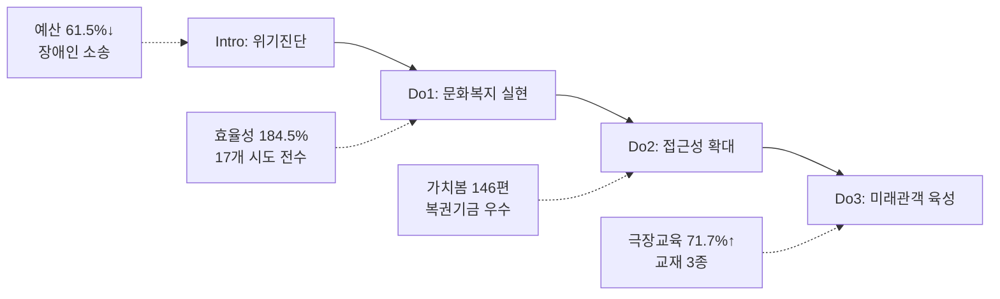

---
{"publish":true,"permalink":"경영평가/주요사업3/실행","title":"6_실행(Do) 작성 방안","created":"2025-12-12","modified":"2025-12-12T14:12:45.097+09:00","tags":["#경영평가","#주요사업","#영화문화가치확산","#비계량","#작성방안"],"cssclasses":""}
---


# [2-3 영화문화 가치확산] 세부평가내용 작성 방안

> [!abstract] 문서 개요
> 본 문서는 '2-3 영화문화 가치확산' 지표의 2025년도 경영평가보고서 작성을 위한 논리적 흐름(Storyline)과 문단별 세부 작성 방안을 제안합니다.
>
> **평가내용 02**: 주요사업별 추진활동은 적절히 수행되었는가?
> **핵심 목표**: 전년도 지적사항(C등급, 4.2점)을 극복하고, **'예산 위기 극복'**과 **'영화문화 접근성 확대'**를 통해 목표 등급(B등급 이상) 달성
> **주관부서**: 영화문화팀

---

## 1. 개요

### 1.1 Do 세부 구조

| 구분 | 세부 항목 |
|------|----------|
| **1. 추진활동 실적** | 가. 문화소외계층 관람환경 개선 (찾아가는 영화관)<br>나. 장애인 동시관람 환경 구축 (가치봄)<br>다. 차세대 미래관객 육성 (청소년 교육) |
| **2. 효율성 제고 노력 및 성과** | 가. 운영체계 개편 (직접/간접 이원화)<br>나. 예산 효율성 극대화 (184.5%)<br>다. 외부 협업 확대 (영상자료원, 상영관 3사) |
| **3. 모니터링 긴급현안 대응** | 가. 예산 61.5% 감소 위기 대응<br>나. 장애인 차별 소송 대응 |

---

### 1.2 Storyline 구성안 비교

#### Option A: 문화복지 중심 구조 (추천)

| 구분 | 내용 |
|------|------|
| **구조** | 예산 위기 극복 → 문화소외계층 접근성 확대 → 미래관객 육성 |
| **장점** | 예산 감소에도 불구한 성과 극대화 강조, 문화복지 실현이라는 공공기관 본질 부각 |
| **적합도** | ⭐⭐⭐ |

```
예산 위기(61.5%↓) → 효율성 혁신(184.5%) → 문화복지 실현(17개 시도) → 미래관객 육성(71.7%↑)
```

#### Option B: 접근성 확대 중심 구조

| 구분 | 내용 |
|------|------|
| **구조** | 장애인 접근성 → 문화소외지역 → 청소년 교육 |
| **장점** | 장애인 소송 대응 성과 부각, 복권기금 우수등급 강조 |
| **적합도** | ⭐⭐ |

---

### 1.3 추천 Storyline: 위기 극복 & 문화복지 실현

#### 전체 흐름



#### 핵심 메시지

> **"예산 61.5% 감소 위기 속에서도 운영 효율화로 전국 17개 시도 문화복지 달성, 장애인 접근성 제도화와 극장 연계 교육 71.7% 확대로 지속가능한 영화문화 생태계 구축"**


---

## 2. 추진활동 실적

> [!abstract] 성과목표별 문단 구조 (총 7개)
> 
> **성과목표① 문화복지 실현 및 소외계층 접근성 확대** (4개 문단)
> - 문단 1: 문화소외계층 관람환경 개선 (찾아가는 영화관) ⭐BP
> - 문단 2: 장애인 동시관람 환경 구축 (가치봄) ⭐BP
> - 문단 3: 예산 위기 대응 종합
> - 문단 4: 장애인 소송 대응 종합
> 
> **성과목표② 차세대 미래관객 육성** (3개 문단)
> - 문단 5: 극장 연계 교육 확대 ⭐BP
> - 문단 6: 영화 리터러시 교육 체계화
> - 문단 7: 미래관객 육성 종합

---

### 2.1 성과목표① 문화복지 실현 및 소외계층 접근성 확대 (문단 1~4)

> [!note] 성과목표① 개요
> **담당부서**: 영화문화팀
> **핵심 목표**: 예산 위기 속 문화소외계층·장애인 영화 접근성 확대
> **주요 사업**: 찾아가는 영화관, 가치봄, 작은영화관

---

#### 문단 1: 문화소외계층 관람환경 개선 [영화문화팀] ⭐BP

| 항목 | 내용 |
|------|------|
| **Core Message** | 예산 61.5% 감소에도 효율성 극대화로 전국 17개 시도 문화복지 실현 |
| **주요 근거** | 예산 대비 효율성 184.5% 달성, 17개 행정구역 전수 방문, 영상자료원 협업 25회 |
| **담당 부서** | 영화문화팀 |

| 구분 | 실적 | 성과 |
|------|------|------|
| 찾아가는 영화관 | 예산 1,300→500백만원(-61.5%), 관객 49,734명(-14.9%) | **효율성 99.5명/백만원(+121.6%)** ⭐⭐⭐BP |
| 지역 전수 방문 | **17개 행정구역 전수 방문** | 도서·산간·북한접경지역 우선 ⭐⭐⭐BP |
| 협업 효율화 | 한국영상자료원 협업 30회 중 25회 동시 진행 | 직접/간접 운영 이원화 |
| 프로그램 혁신 | 찾아가는 옛날영화관(한국영화 100선) | 영화보고 사회탐구/경제알기 신규 |
| 작은영화관 | 기획전 15회 안정 운영 | 기획전 역할 강화 |

> [!example] 추천 스토리라인
> **"예산 61.5% 감소 위기 → 직접/간접 운영 이원화 + 영상자료원 협업 → 효율성 184.5% 달성 → 17개 시도 전수 방문으로 문화복지 실현"**

---

#### 문단 2: 장애인 동시관람 환경 구축 [영화문화팀] ⭐BP

| 항목 | 내용 |
|------|------|
| **Core Message** | 장애인 차별 소송 대응 동시관람 장비 전국 보급 및 가치봄 확대 |
| **주요 근거** | 가치봄 146편 제작, 동시개봉작 12편, 오프라인 54,345명, 복권기금 우수등급 |
| **담당 부서** | 영화문화팀 |

| 구분 | 실적 | 성과 |
|------|------|------|
| 가치봄 제작 | **146편** 제작 (동시개봉작 12편 포함) | 장애인 영화 접근성 확대 |
| 관람 확대 | 오프라인 관람 **54,345명** | 주요 상영관 3사 한글자막CC 전국 76개관 편성 |
| 동시관람 장비 | 장애인 차별 소송 대응 전국 동시관람 장비 보급 추진 | ⭐⭐BP |
| 외부재원 | **복권기금 성과평가 80.78점(우수)** | '26년 1,300백만원 동일 확보 ⭐⭐BP |
| 신규 협력 | 한국농아인협회 연계 가치봄 상영회 | 찾아가는 영화관 연계 |

> [!example] 추천 스토리라인
> **"장애인 차별 소송 발생 → 동시관람 장비 전국 보급 추진 → 가치봄 146편 제작 → 복권기금 우수등급으로 '26년 예산 확보"**

---

#### 문단 3: 예산 위기 대응 종합 [영화문화팀]

| 항목 | 내용 |
|------|------|
| **Core Message** | 예산 61.5% 감소 위기를 효율성 혁신으로 극복, 문화복지 사각지대 해소 |
| **주요 근거** | 효율성 184.5%, 17개 시도 전수, 영상자료원 협업 25회 |
| **담당 부서** | 영화문화팀 |

| 위기 요인 | 대응 전략 | 성과 |
|----------|----------|------|
| 예산 61.5% 감소 | 직접/간접 운영 이원화 | 효율성 184.5% 달성 |
| 사업 축소 우려 | 영상자료원 협업 25회 | 17개 시도 전수 방문 유지 |
| 콘텐츠 다양성 | 옛날영화관 신규 프로그램 | 한국영화 100선 상영 |

---

#### 문단 4: 장애인 소송 대응 종합 [영화문화팀]

| 항목 | 내용 |
|------|------|
| **Core Message** | 장애인 차별 소송을 제도 개선 기회로 전환, 접근성 제도화 선도 |
| **주요 근거** | 동시관람 장비 보급, 가치봄 146편, 복권기금 우수 |
| **담당 부서** | 영화문화팀 |

| 위기 요인 | 대응 전략 | 성과 |
|----------|----------|------|
| 장애인 차별 소송 | 동시관람 장비 전국 보급 추진 | 제도 개선 선도 |
| 콘텐츠 부족 | 가치봄 146편 제작 | 동시개봉작 12편 포함 |
| 재원 불안정 | 복권기금 성과관리 강화 | 80.78점(우수), '26년 예산 확보 |
| 상영관 부족 | 상영관 3사 협력 | 한글자막CC 76개관 편성 |


---

### 2.2 성과목표② 차세대 미래관객 육성 (문단 5~7)

> [!note] 성과목표② 개요
> **담당부서**: 영화문화팀
> **핵심 목표**: 극장 연계 교육 확대로 미래관객 육성 및 극장 시장 회복 기여
> **주요 사업**: 청소년 영화교육, 영화 읽기 교재 개발

---

#### 문단 5: 극장 연계 교육 확대 [영화문화팀] ⭐BP

| 항목 | 내용 |
|------|------|
| **Core Message** | 극장 연계 교육 71.7% 확대로 극장 시장 회복 직접 기여 |
| **주요 근거** | 극장 연계 498건(71.7%↑), 비중 56.6%, 수혜자 92,000명 |
| **담당 부서** | 영화문화팀 |

| 구분 | 실적 | 성과 |
|------|------|------|
| 극장 교육 확대 | 극장 연계 교육 290건→**498건(+71.7%)** | 비중 28.7%→**56.6%** ⭐⭐⭐BP |
| 수혜 확대 | 청소년 **92,000명** 교육 수혜 | 전년 89,781명 대비 +2.5% |
| 형평성 제고 | 특수학교·인구감소지역·학교 외 주체 우선 지원 | 교육 사각지대 해소 |

> [!example] 추천 스토리라인
> **"극장 침체 속 극장 연계 교육 전략적 확대 → 290건→498건(71.7%↑) → 극장 비중 56.6%로 시장 회복 기여"**

---

#### 문단 6: 영화 리터러시 교육 체계화 [영화문화팀] ⭐BP

| 항목 | 내용 |
|------|------|
| **Core Message** | 영화 읽기 교재 3종 개발로 리터러시 교육 체계 구축 |
| **주요 근거** | 교재 3종 개발, 시범 운영, 교육 콘텐츠 표준화 |
| **담당 부서** | 영화문화팀 |

| 구분 | 실적 | 성과 |
|------|------|------|
| 교재 개발 | **영화 읽기 교재 3종** 개발 | 리터러시 교육 체계화 ⭐⭐BP |
| 시범 운영 | 교재 기반 시범 교육 실시 | 현장 적용성 검증 |
| 콘텐츠 표준화 | 교육 콘텐츠 표준화 추진 | 전국 확산 기반 마련 |

---

#### 문단 7: 미래관객 육성 종합 [영화문화팀]

| 항목 | 내용 |
|------|------|
| **Core Message** | 극장 연계 교육과 리터러시 체계화로 장기 관객 육성 기반 마련 |
| **주요 근거** | 극장 연계 71.7%↑, 교재 3종, 92,000명 수혜 |
| **담당 부서** | 영화문화팀 |

| 영역 | 성과 | 의미 |
|------|------|------|
| 극장 연계 | 498건(71.7%↑), 비중 56.6% | 극장 시장 회복 직접 기여 |
| 교육 체계 | 교재 3종 개발 | 리터러시 교육 표준화 |
| 수혜 확대 | 92,000명 | 장기 관객 육성 기반 |
| 형평성 | 특수학교·인구감소지역 우선 | 교육 사각지대 해소 |

---

## 3. 효율성 제고 노력

### 3.1 조직인력 효율성 제고 노력과 성과

| 구분 | 노력 | 성과 |
|------|------|------|
| **찾아가는 영화관 운영체계 개편** | **기존**: 직접 운영 중심<br>**개선**: 직접/간접 운영 이원화, 영상자료원 협업 25회 | • 예산 61.5% 감소에도 효율성 184.5% 달성<br>• 17개 시도 전수 방문 유지 |
| **청소년 교육 극장 연계 강화** | **기존**: 학교 중심 교육<br>**개선**: 극장 연계 교육 전략적 확대 | • 극장 연계 290건→498건(71.7%↑)<br>• 극장 비중 28.7%→56.6% |
| **가치봄 제작 효율화** | **기존**: 개별 제작 중심<br>**개선**: 동시개봉작 12편 집중 제작 | • 146편 제작, 오프라인 54,345명<br>• 한글자막CC 76개관 편성 |

### 3.2 예산집행 효율성 제고 노력과 성과

| 구분 | 노력 | 성과 |
|------|------|------|
| **찾아가는 영화관 효율성 극대화** | 예산 1,300→500백만원 감소 속 운영 효율화 | • 효율성 99.5명/백만원(목표 53.9)<br>• **184.5%** 달성 |
| **복권기금 성과관리 강화** | 복권기금 성과평가 체계적 관리 | • **80.78점(우수)** 달성<br>• '26년 1,300백만원 동일 확보 |

### 3.3 외부 협업 확대 노력과 성과

| 구분 | 노력 | 성과 |
|------|------|------|
| **한국영상자료원 협업** | 찾아가는 영화관 30회 중 25회 동시 진행 | • 운영 효율성 극대화<br>• 콘텐츠 다양성 확보 |
| **한국농아인협회 연계** | 가치봄 상영회 공동 개최 | • 청각장애인 접근성 확대<br>• 찾아가는 영화관 연계 |
| **주요 상영관 3사 협력** | CGV·롯데·메가박스 한글자막CC 편성 | • 전국 **76개관** 편성<br>• 장애인 동시관람 환경 확대 |


---

## 4. 긴급현안 대응

### 4.1 예산 61.5% 감소 위기 대응

| 구분 | 내용 |
|------|------|
| **점검채널** | 예산 편성 과정, 문체부 업무협의, 지역영화문화진흥소위원회 |
| **점검내용 및 이슈** | • (핵심이슈) 찾아가는 영화관 예산 1,300→500백만원 대폭 삭감<br>• (경영환경 변화) 문화소외지역 서비스 축소 우려, 17개 시도 전수 방문 불가 위기 |

| 현안과제 | 해결 노력 |
|---------|----------|
| • 예산 61.5% 감소로 사업 축소 불가피<br>• 문화소외지역 서비스 사각지대 발생 우려 | **운영체계 개편**: 직접/간접 운영 이원화, 영상자료원 협업 25회<br>**프로그램 혁신**: 찾아가는 옛날영화관(한국영화 100선) 신규 |

| 추진성과 | 내용 |
|---------|------|
| 효율성 극대화 | 효율성 **184.5%** 달성 (목표 53.9 → 실적 99.5명/백만원) |
| 전국 방문 유지 | **17개 시도 전수 방문** 달성 (도서·산간·북한접경지역 포함) |

---

### 4.2 장애인 차별 소송 대응

| 구분 | 내용 |
|------|------|
| **점검채널** | 장애인 관람환경 개선 협의체, 복권기금 성과평가, 장애인 단체 간담회 |
| **점검내용 및 이슈** | • (핵심이슈) 장애인 동시관람 환경 미비로 차별 소송 발생<br>• (경영환경 변화) 장애인 영화 접근성 제도화 필요성 대두 |

| 현안과제 | 해결 노력 |
|---------|----------|
| • 장애인 동시관람 장비 전국 보급 필요<br>• 가치봄 콘텐츠 확대 필요 | **동시관람 장비 보급**: 전국 보급 추진, 한글자막CC 76개관 편성<br>**가치봄 확대**: 146편 제작, 한국농아인협회 연계 상영회 |

| 추진성과 | 내용 |
|---------|------|
| 복권기금 우수 | **80.78점(우수)** 달성 → '26년 1,300백만원 동일 확보 |
| 가치봄 확대 | **146편** 제작, 오프라인 **54,345명** 관람 |

---

## 5. 차별화 포인트

### 5.1 전년도 지적사항 개선

| 지적사항 | 개선 방안 | 핵심 성과 |
|---------|----------|----------|
| 문화소외지역 확대 필요 | 효율성 혁신, 17개 시도 전수 방문 | 효율성 **184.5%**, 17개 시도 전수 |
| 장애인 접근성 개선 | 가치봄 확대, 동시관람 장비 보급 | 146편, 복권기금 우수, 76개관 |
| 청소년 교육 체계 강화 | 극장 연계 교육 확대, 교재 개발 | 71.7%↑, 교재 3종 |

### 5.2 위기 대응 모델

| 영역 | 위기 요인 | 대응 전략 | 성과 |
|------|----------|----------|------|
| 예산 | 61.5% 감소 | 직접/간접 이원화, 협업 | 효율성 184.5% |
| 장애인 | 차별 소송 | 장비 보급, 가치봄 확대 | 복권기금 우수 |
| 극장 | 침체 지속 | 극장 연계 교육 확대 | 71.7%↑ |

---

## 6. BP TOP 3

### 6.1 찾아가는 영화관 효율성 극대화

> [!success] 핵심 성과
> **예산 61.5% 감소에도 효율성 184.5% 달성 + 17개 시도 전수 방문**

| 구분 | 내용 |
|------|------|
| **예산 변화** | 1,300백만원 → 500백만원 (**-61.5%**) |
| **효율성** | 목표 53.9 → 실적 99.5명/백만원 (**184.5%**) |
| **전국 방문** | **17개 시도 전수 방문** (도서·산간·북한접경지역 포함) |

| BP 선정 이유 |
|-------------|
| **위기 극복 모델**: 예산 대폭 삭감 속에서도 효율성 혁신으로 서비스 유지 |
| **문화복지 실현**: 17개 시도 전수 방문으로 문화 사각지대 해소 |
| **협업 시너지**: 한국영상자료원 협업 25회로 운영 효율화 |

---

### 6.2 복권기금 우수등급 달성

> [!success] 핵심 성과
> **복권기금 성과평가 80.78점(우수) + '26년 예산 동일 확보**

| 구분 | 내용 |
|------|------|
| **성과평가** | **80.78점(우수)** 달성 |
| **예산 확보** | '26년 **1,300백만원** 동일 확보 |
| **가치봄** | **146편** 제작, 오프라인 **54,345명** |

| BP 선정 이유 |
|-------------|
| **외부재원 확보**: 기금 고갈 위기 속 외부재원 안정적 확보 |
| **장애인 접근성**: 가치봄 146편으로 장애인 영화 접근성 확대 |
| **제도화 선도**: 장애인 차별 소송 대응 → 제도 개선 기회로 전환 |

---

### 6.3 극장 연계 교육 71.7% 확대

> [!success] 핵심 성과
> **극장 연계 교육 290건→498건(71.7%↑) + 영화 읽기 교재 3종 개발**

| 구분 | 내용 |
|------|------|
| **극장 연계** | 290건 → **498건** (**+71.7%**) |
| **극장 비중** | 28.7% → **56.6%** |
| **교재 개발** | **영화 읽기 교재 3종** 개발 |
| **수혜 인원** | **92,000명** 교육 수혜 |

| BP 선정 이유 |
|-------------|
| **극장 시장 기여**: 극장 침체 속 극장 연계 교육으로 시장 회복 직접 기여 |
| **미래관객 육성**: 청소년 92,000명 교육으로 장기 관객 육성 기반 마련 |
| **교육 체계화**: 영화 읽기 교재 3종으로 리터러시 교육 체계 구축 |

---

### 6.4 BP TOP 3 종합 비교

| 순위 | BP명 | 핵심 키워드 | 정책 연계 |
|:---:|------|-----------|----------|
| **1** | 찾아가는 영화관 효율성 | 효율성 184.5%, 17개 시도 | 문화복지, 지역균형 |
| **2** | 복권기금 우수등급 | 80.78점, 146편 | 장애인 접근성 |
| **3** | 극장 연계 교육 확대 | 71.7%↑, 교재 3종 | 미래관객 육성 |


---

## 7. 작성 유의사항

### 7.1 평가착안사항 대응

| 평가착안사항 | 대응 내용 |
|-------------|----------|
| ① 추진계획 적절 집행 | 찾아가는 영화관 49,734명, 가치봄 146편, 청소년 92,000명 등 집행실적 |
| ② 경영자원 효율 활용 | 효율성 184.5%, 복권기금 우수, 극장 연계 71.7%↑ 등 효율성 지표 |
| ③ 현안과제 대응 적절성 | 예산 위기 대응, 장애인 소송 대응 종합 섹션 |

### 7.2 핵심 정량지표

| 지표 | 수치 | 비고 |
|------|:----:|------|
| 찾아가는 예산 감소 | **-61.5%** | (1,300→500백만원) |
| 효율성 달성률 | **184.5%** | (목표 53.9 → 실적 99.5) |
| 17개 시도 전수 | **17개** | 전국 행정구역 |
| 가치봄 제작 | **146편** | 동시개봉작 12편 포함 |
| 복권기금 평가 | **80.78점** | 우수등급 |
| 극장 교육 증가 | **+71.7%** | (290→498건) |
| 극장 연계 비중 | **56.6%** | (전년 28.7%) |
| 청소년 수혜자 | **92,000명** | 전년대비 +2.5% |

### 7.3 BP 강조

| BP 후보 | 내용 | 강조 포인트 |
|---------|------|-----------|
| 찾아가는 효율성 | 184.5%, 17개 시도 | 예산 위기 극복 핵심 모델 |
| 복권기금 우수 | 80.78점, 146편 | 외부재원 확보, 장애인 접근성 |
| 극장 교육 확대 | 71.7%↑, 교재 3종 | 미래관객 육성 체계화 |

---

## [부록] 타 부서 연계 실적 (참고용)

> [!tip] 활용 가이드
> 아래 실적은 세부평가 작성 시 **부가적인 내용**으로만 활용합니다.
> 영화문화팀 성과를 보완하는 맥락에서 필요시 인용하세요.

### A. 창작제작팀 (독립예술영화)

| 구분 | 실적 | 활용 맥락 |
|------|------|----------|
| 독립예술영화 제작지원 | 79편 | 다양성 영화 생태계 유지 |
| 베를린 공식초청 | <내 이름은> | 세계 3대 영화제 진출 |

### B. 국제교류팀 (글로벌 확산)

| 구분 | 실적 | 활용 맥락 |
|------|------|----------|
| 국제영화제 지원 | 75편, 12건 수상 | 한국영화 글로벌 위상 |
| 아카데미 프로모션 | 4관왕, 유력 후보 | K-무비 글로벌 확산 |

### C. 정규교육팀·영화인교육팀 (교육)

| 구분 | 실적 | 활용 맥락 |
|------|------|----------|
| KAFA 극장개봉 | 6편, 32,741명 | 신진 창작자 데뷔 |
| AI 교육 | 5편 제작, 대상 수상 | 첨단기술 교육 혁신 |

---

## [부록] 영화문화팀 세부 실적

### 찾아가는 영화관 집행 실적

| 구분 | '24년 | '25년 | 증감 |
|------|-------|-------|------|
| 예산 | 1,300백만원 | 500백만원 | **-61.5%** |
| 관객 | 58,440명 | 49,734명 | -14.9% |
| 효율성 | 44.9명/백만원 | **99.5명/백만원** | **+121.6%** |
| 지역 방문 | 17개 시도 | **17개 시도** | 유지 |

### 가치봄 집행 실적

| 구분 | 실적 | 비고 |
|------|------|------|
| 제작 편수 | **146편** | 동시개봉작 12편 포함 |
| 오프라인 관람 | **54,345명** | 전년대비 증가 |
| 한글자막CC | **76개관** | CGV·롯데·메가박스 |
| 복권기금 평가 | **80.78점(우수)** | '26년 예산 동일 확보 |

### 청소년 교육 집행 실적

| 구분 | '24년 | '25년 | 증감 |
|------|-------|-------|------|
| 교육 수혜자 | 89,781명 | **92,000명** | +2.5% |
| 극장 연계 | 290건 | **498건** | **+71.7%** |
| 극장 비중 | 28.7% | **56.6%** | +27.9%p |
| 교재 개발 | - | **3종** | 신규 |

---

## 관련 자료

| 구분 | 문서명 | 비고 |
|------|--------|------|
| 편람 분석 | [[25년 경평/2_지표별 자료/1-9_노사관계/2_편람_내용_분석]] | 세부평가 요소별 가이드 |
| 지적사항 | [[25년 경평/2_지표별 자료/2-3_영화문화_가치확산/3_전년도_지적사항_및_개선실적]] | C등급 원인 및 개선방향 |
| 부서 실적 | [[25년 경평/2_지표별 자료/2-3_영화문화_가치확산/부서별 실적 분석/영화문화팀 실적 분석]] | 주관부서 실적 종합 |
| 목차구성안 | [[25년 경평/2_지표별 자료/1-9_노사관계/1_목차_구성안]] | 전체 목차 구조 |

---

*작성일: 2025-12-12*
*검증상태: 영화문화팀 중심 재구성 완료*

