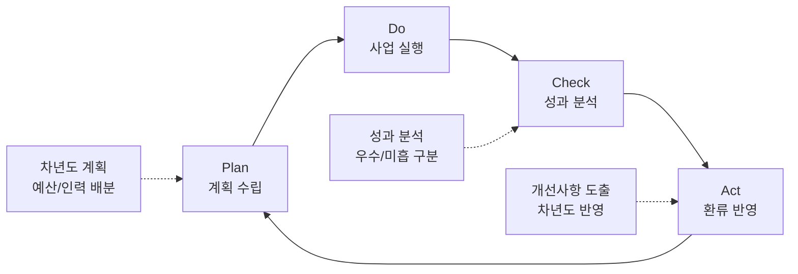

---
{"publish":true,"permalink":"/경영평가/2-3/8_환류작성방안","title":"8_환류(Act) 작성 방안","created":"2025-12-12","modified":"2025-12-12T14:40:29.116+09:00","tags":["#경영평가","#주요사업","#영화문화가치확산","#Act","#작성방안"],"cssclasses":""}
---

# [2-3 영화문화 가치확산] 환류(A) 작성 방안

> [!abstract] 문서 개요
> 본 문서는 '2-3 영화문화 가치확산' 지표의 **세부평가내용④ 환류활동** 작성을 위한 구조와 세부 작성 방안을 제안합니다.
>
> **평가내용 04**: 주요사업별 환류활동은 적절하게 수행되었는가?
> **주관부서**: 영화문화팀

---

## 1. 개요

### 1.1 Act 세부 구조

| 구분 | 세부 항목 |
|------|----------|
| **1. 성과 분석 및 환류** | 가. 성과목표별 성과 분석 나. 개선사항 도출 및 반영 |
| **2. 차년도 계획 반영** | 가. 차년도 사업계획 반영 나. 중장기 발전계획 연계 |

---

## 2. 성과 분석 및 환류

### 2.1 성과목표별 성과 분석

| 성과목표 | 성과 분석 | 환류 방향 |
|---------|----------|----------|
| **① 문화복지 실현 및 소외계층 접근성 확대** | **우수**: 효율성 184.5% 달성, 17개 시도 전수 방문 **우수**: 가치봄 146편, 복권기금 우수등급 | • 효율성 혁신 모델 지속 적용 • 복권기금 우수등급 유지 • 동시관람 장비 전국 확대 |
| **② 차세대 미래관객 육성** | **우수**: 극장 연계 71.7%↑, 극장 비중 56.6% **우수**: 교재 3종 개발, 92,000명 수혜 | • 극장 연계 교육 60% 목표 • 교재 전국 확산 • 인구감소지역 우선 지원 |

---

### 2.2 개선사항 도출 및 반영

> [!note]+ 📊 성과목표① 문화복지 실현 및 소외계층 접근성 확대

| 분석 결과 | 개선사항 | 반영 내용 |
|----------|---------|----------|
| 효율성 184.5% 달성 | 효율성 혁신 모델 지속 | • 직접/간접 운영 이원화 **정착** • 영상자료원 협업 **30회** 확대 |
| 17개 시도 전수 방문 | 문화복지 사각지대 해소 지속 | • **17개 시도 전수 방문** 유지 • 인구감소지역 우선 방문 강화 |
| 가치봄 146편 제작 | 장애인 접근성 확대 지속 | • 가치봄 **150편** 목표 • 동시개봉작 **15편** 확대 |
| 복권기금 우수등급 | 외부재원 안정화 | • 복권기금 **우수등급 유지** • '27년 예산 확보 추진 |
| 장애인 소송 대응 | 제도화 완료 | • 동시관람 장비 **전국 확대** • 한글자막CC **100개관** 목표 |

> [!note]+ 📊 성과목표② 차세대 미래관객 육성

| 분석 결과 | 개선사항 | 반영 내용 |
|----------|---------|----------|
| 극장 연계 71.7%↑ | 극장 연계 교육 지속 확대 | • 극장 연계 **600건** 목표 • 극장 비중 **60%** 목표 |
| 교재 3종 개발 | 전국 확산 추진 | • 교재 기반 교육 **전국 확산** • 교육 콘텐츠 표준화 완료 |
| 92,000명 수혜 | 수혜 인원 확대 | • **95,000명** 목표 • 특수학교·인구감소지역 우선 |

---

## 3. 차년도 계획 반영

### 3.1 차년도(2026년) 사업계획 반영

> [!success]+ ✅ 성과목표① 문화복지 실현 및 소외계층 접근성 확대 - 2026년 계획

| 구분 | 사업명 | 2025년 | 2026년 계획 | 변경 사유 |
|------|--------|:------:|:------:|----------|
| **유지** | 찾아가는 영화관 | 17개 시도 | **17개 시도** | 전수 방문 유지 |
| **확대** | 영상자료원 협업 | 25회 | **30회** | 협업 효율화 확대 |
| **확대** | 가치봄 제작 | 146편 | **150편** | 장애인 접근성 확대 |
| **확대** | 동시개봉작 | 12편 | **15편** | 동시관람 강화 |
| **확대** | 한글자막CC | 76개관 | **100개관** | 전국 확대 |
| **유지** | 복권기금 | 우수 | **우수 유지** | 외부재원 안정화 |

> [!success]+ ✅ 성과목표② 차세대 미래관객 육성 - 2026년 계획

| 구분 | 사업명 | 2025년 | 2026년 계획 | 변경 사유 |
|------|--------|:------:|:------:|----------|
| **확대** | 극장 연계 교육 | 498건 | **600건** | 극장 시장 기여 확대 |
| **확대** | 극장 비중 | 56.6% | **60%** | 극장 중심 전환 |
| **확대** | 교육 수혜자 | 92,000명 | **95,000명** | 수혜 확대 |
| **확대** | 교재 활용 | 시범 운영 | **전국 확산** | 교육 체계화 |
| **강화** | 인구감소지역 | 우선 지원 | **우선 지원 강화** | 형평성 제고 |

---

### 3.2 중장기 발전계획 연계

| 2029 경영목표 | 2025년 성과 | 2026년 계획 | 중장기 방향 |
|--------------|------------|------------|-----------|
| **영화문화 사회적 가치 실현** | 효율성 184.5%, 17개 시도 | 효율성 유지, 17개 시도 | **문화복지 사각지대 ZERO** |
| **장애인 영화 접근성 제도화** | 가치봄 146편, 복권기금 우수 | 150편, 우수 유지 | **동시관람 환경 전국화** |
| **미래관객 육성 체계 구축** | 극장 연계 71.7%↑, 교재 3종 | 600건, 전국 확산 | **극장 중심 교육 정착** |

---

## 4. 환류 체계 및 모니터링

### 4.1 환류 체계

### 4.2 환류 모니터링 계획

| 성과목표 | 환류 항목 | 모니터링 주기 | 담당 부서 |
|---------|---------|:------:|---------|
| **문화복지 실현** | 찾아가는 영화관 운영 | 월간 | 영화문화팀 |
| | 효율성 지표 관리 | 분기 | 영화문화팀 |
| | 가치봄 제작 현황 | 분기 | 영화문화팀 |
| | 복권기금 성과관리 | 반기 | 영화문화팀 |
| **미래관객 육성** | 극장 연계 교육 현황 | 월간 | 영화문화팀 |
| | 교재 활용 현황 | 분기 | 영화문화팀 |
| | 수혜자 현황 | 분기 | 영화문화팀 |

---

## 5. 핵심 환류 성과 요약

> [!success] 핵심 환류 성과
> **"성과 분석 → 개선 도출 → 차년도 반영"** 순환 구조 완성

### 5.1 효율성 혁신 모델 정착 (2025년 → 2026년 지속)

| 성과 | 2025년 | 2026년 계획 |
|------|--------|------------|
| 효율성 달성 | 184.5% | **유지** |
| 17개 시도 전수 | 달성 | **유지** |
| 영상자료원 협업 | 25회 | **30회** 확대 |

### 5.2 장애인 접근성 확대 (2026년)

| 사업명 | 2025년 | 2026년 | 증감 |
|--------|:------:|:------:|:------:|
| 가치봄 제작 | 146편 | 150편 | +4편 |
| 동시개봉작 | 12편 | 15편 | +3편 |
| 한글자막CC | 76개관 | 100개관 | +24개관 |

### 5.3 미래관객 육성 확대 (2026년)

| 사업명 | 2025년 | 2026년 | 증감 |
|--------|:------:|:------:|:------:|
| 극장 연계 교육 | 498건 | 600건 | +102건 |
| 극장 비중 | 56.6% | 60% | +3.4%p |
| 교육 수혜자 | 92,000명 | 95,000명 | +3,000명 |
| 교재 활용 | 시범 운영 | 전국 확산 | 확대 |

---

## [부록] 영화문화팀 환류 계획

### 찾아가는 영화관 환류

| 2025년 성과 | 환류 방향 | 2026년 계획 |
|------------|----------|------------|
| 효율성 184.5% | 효율성 혁신 모델 정착 | 직접/간접 이원화 **유지** |
| 17개 시도 전수 | 문화복지 사각지대 해소 | **17개 시도** 유지 |
| 영상자료원 협업 25회 | 협업 확대 | **30회** 확대 |

### 가치봄 환류

| 2025년 성과 | 환류 방향 | 2026년 계획 |
|------------|----------|------------|
| 146편 제작 | 장애인 접근성 확대 | **150편** 제작 |
| 동시개봉작 12편 | 동시관람 강화 | **15편** 확대 |
| 복권기금 우수 | 외부재원 안정화 | **우수등급 유지** |
| 한글자막CC 76개관 | 전국 확대 | **100개관** 목표 |

### 청소년 교육 환류

| 2025년 성과 | 환류 방향 | 2026년 계획 |
|------------|----------|------------|
| 극장 연계 498건 | 극장 시장 기여 확대 | **600건** 목표 |
| 극장 비중 56.6% | 극장 중심 전환 | **60%** 목표 |
| 92,000명 수혜 | 수혜 확대 | **95,000명** 목표 |
| 교재 3종 개발 | 전국 확산 | **전국 확산** 시행 |

---

## 관련 문서

- [[25년 경평/2_지표별 자료/2-3_영화문화_가치확산/5_계획(Plan)_작성_방안]]
- [[25년 경평/2_지표별 자료/2-3_영화문화_가치확산/6_실행(Do)_작성_방안]]
- [[25년 경평/2_지표별 자료/2-3_영화문화_가치확산/7_성과(Check)_작성_방안]]
- [[25년 경평/2_지표별 자료/1-9_노사관계/2_편람_내용_분석]]
- [[25년 경평/2_지표별 자료/2-3_영화문화_가치확산/3_전년도_지적사항_및_개선실적]]

---

*작성일: 2025-12-12*
*검증상태: 영화문화팀 중심 재구성 완료*
