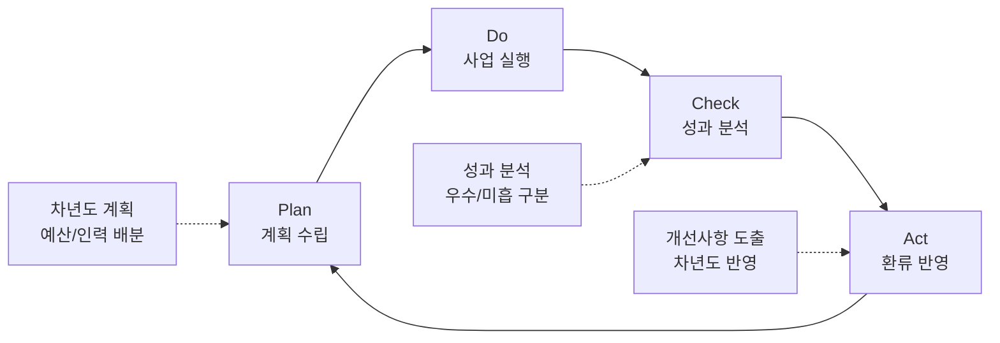

---
{"publish":true,"permalink":"/경영평가/주요사업3/환류","title":"8_환류(Act)","created":"2025-12-16","modified":"2025-12-16T10:53:47.109+09:00","tags":["#경영평가","#주요사업","#영화문화가치확산","#Act","#작성방안"],"cssclasses":""}
---

# [2-3 영화문화 가치확산] 환류(A) 작성 방안

> [!abstract] 문서 개요
> 본 문서는 '2-3 영화문화 가치확산' 지표의 **세부평가내용④ 환류활동** 작성을 위한 구조와 세부 작성 방안을 제안합니다.
>
> **평가내용 04**: 주요사업별 환류활동은 적절하게 수행되었는가?
> **핵심 목표**: 2개 성과목표(영화문화 다양성 확대 + 영화문화 접근성 제고) 체계 기반 환류 방안 제시
> **주관부서**: 영화문화팀
> **수정일**: 2025-12-16 (계획(P) v2 / 실행(D) / 성과(C) 기반 업데이트)

---

## 1. 개요

### 1.1 Act 세부 구조

| 구분 | 세부 항목 |
|------|----------|
| **1. 성과 분석 및 환류** | 가. 성과목표별 성과 분석 나. 개선사항 도출 및 반영 |
| **2. 차년도 계획 반영** | 가. 차년도 사업계획 반영 나. 중장기 발전계획 연계 |

### 1.2 환류 Storyline

> **"2025년 성과 분석 → 우수/미흡 분류 → 개선사항 도출 → 차년도 반영으로 영화문화 다양성 확대 및 접근성 제고 선순환 구축"**

---

## 2. 성과 분석 및 환류

### 2.1 성과목표별 성과 분석

#### 성과목표① 영화문화 다양성 확대

| 실행과제 | 성과 분석 | 환류 방향 |
|----------|----------|----------|
| **독립예술영화 유통 활성화** | **우수**: 관객 비중 7.4%(목표 7.0% 초과) **우수**: 개봉지원 28편(+16.7%), 공모 연 2회 확대 **우수**: 전용관 27개관 전수방문 점검 | • 개봉지원 **30편** 확대 목표 • 공모 연 2회 체제 **정착** • 전용관 현장 소통 **지속 강화** |
| **영화제 지원 강화** | **우수**: 지원 영화제 20개처(+100%) **우수**: 3,196백만원 지원 (대규모 6개처 + 중소규모 14개처) **우수**: 간담회 2회 의견 반영 | • 지원 영화제 **22개처** 확대 • 중소규모 영화제 지원 **강화** • 지역 영화제 신규 발굴 |

#### 성과목표② 영화문화 접근성 제고

| 실행과제 | 성과 분석 | 환류 방향 |
|----------|----------|----------|
| **차별 없는 관람환경 조성** | **우수**: 가치봄 146편 제작 (계량지표 만점) **우수**: 복권기금 80.78점(우수등급) **우수**: 한글자막CC 76개관, 동시개봉작 12편 | • 가치봄 **150편** 제작 목표 • 복권기금 **우수등급 유지** • 동시개봉작 **15편** 확대 • 한글자막CC **100개관** 목표 |
| **국민 영화문화 저변 확대** | **우수**: 효율성 184.5% 달성 (목표 53.9→실적 99.5) **우수**: 17개 시도 전수 방문 **우수**: 극장 연계 71.7%↑, 극장 비중 56.6% **우수**: 할인권 매출 107%, 민원 ZERO | • 효율성 혁신 모델 **정착** • 17개 시도 전수 방문 **유지** • 극장 연계 **60%** 목표 • 할인권 배포방식 개선 **지속** |

---

### 2.2 개선사항 도출 및 반영

> [!note]+ 📊 성과목표① 영화문화 다양성 확대

#### 실행과제 1-1. 독립예술영화 유통 활성화

| 분석 결과 | 개선사항 | 반영 내용 |
|----------|---------|----------|
| 관객 비중 7.4% 달성 | 유통지원 확대 지속 | • 목표 **8.0%** 상향 설정 • 한국 독립예술영화 비중 **3.0%** 목표 |
| 개봉지원 28편 | 지원 규모 확대 | • 지원 편수 **30편** 확대 • 지원금액 비례 증가 |
| 공모 연 2회 확대 | 제도 개선 정착 | • 연 2회 공모 체제 **정착** • 조기 약정체결 **유지** (2월/7월) |
| 전용관 27개관 지원 | 현장 소통 강화 | • 전수방문 점검 **지속** • 권역별 간담회 **정례화** |

#### 실행과제 1-2. 영화제 지원 강화

| 분석 결과 | 개선사항 | 반영 내용 |
|----------|---------|----------|
| 지원 영화제 20개처 | 지역 영화제 확대 | • 지원 영화제 **22개처** 확대 • 중소규모 영화제 **16개처** 목표 |
| 3,196백만원 지원 | 예산 확보 노력 | • 예산 **3,500백만원** 목표 • 대규모 영화제 지원 안정화 |
| 간담회 2회 개최 | 의견수렴 강화 | • 간담회 **3회** 확대 • 평가지표 개선 지속 |

> [!note]+ 📊 성과목표② 영화문화 접근성 제고

#### 실행과제 2-1. 차별 없는 영화관람 환경 조성

| 분석 결과 | 개선사항 | 반영 내용 |
|----------|---------|----------|
| 가치봄 146편 제작 | 제작 규모 확대 | • 가치봄 **150편** 제작 목표 • 제작 효율화 지속 |
| 동시개봉작 12편 | 동시개봉 확대 | • 동시개봉작 **15편** 확대 • 결합형 + 폐쇄형 병행 유지 |
| 복권기금 우수등급 | 외부재원 안정화 | • **우수등급 유지** 목표 • '27년 예산 확보 추진 |
| 한글자막CC 76개관 | 전국 확대 | • 한글자막CC **100개관** 목표 • 상영관 3사 협력 강화 |
| 가치봄플러스 243회 | 동시관람 활성화 | • 가치봄플러스 **300회** 목표 • 홍보·교육 강화 |
| AI 한글자막 시범 | 제작 효율화 | • AI 한글자막 **본격 도입** • 제작비 절감 효과 검증 |
| 노인인력개발원 협업 | 전국화 추진 | • '26년 **전국 확대** 시행 • 시니어 일자리 창출 확대 |

#### 실행과제 2-2. 국민 영화문화 저변 확대

| 분석 결과 | 개선사항 | 반영 내용 |
|----------|---------|----------|
| 효율성 184.5% 달성 | 효율성 혁신 모델 정착 | • 직접/간접 운영 이원화 **유지** • 효율성 목표 **100명/백만원** 설정 |
| 17개 시도 전수 | 문화복지 사각지대 해소 | • **17개 시도 전수 방문** 유지 • 인구감소지역 우선 강화 |
| 영상자료원 협업 25회 | 협업 확대 | • 영상자료원 협업 **30회** 확대 • 콘텐츠 다양성 확보 |
| 극장 연계 71.7%↑ | 극장 중심 교육 확대 | • 극장 연계 **600건** 목표 • 극장 비중 **60%** 목표 |
| 교재 3종 개발 | 전국 확산 | • 교재 기반 교육 **전국 확산** • 교육 콘텐츠 표준화 완료 |
| 92,000명 수혜 | 수혜 인원 확대 | • 교육 수혜자 **95,000명** 목표 • 특수학교·인구감소지역 우선 |
| 할인권 매출 107% | 프로세스 혁신 지속 | • 자동생성 방식 **확산** • 민원 ZERO 유지 |

---

## 3. 차년도 계획 반영

### 3.1 차년도(2026년) 사업계획 반영

> [!success]+ ✅ 성과목표① 영화문화 다양성 확대 - 2026년 계획

| 구분 | 실행과제/사업명 | 2025년 | 2026년 계획 | 변경 사유 |
|------|----------------|:------:|:------:|----------|
| **확대** | 독립예술영화 개봉지원 | 28편 | **30편** | 유통 활성화 지속 |
| **유지** | 공모횟수 | 연 2회 | **연 2회** | 제도 개선 정착 |
| **확대** | 전용관 지원 | 27개관 | **28개관** | 인프라 확충 |
| **유지** | 전용관 전수방문 | 전수방문 | **전수방문** | 현장 소통 유지 |
| **상향** | 독립예술영화 관객 비중 목표 | 7.0% | **8.0%** | 도전적 목표 |
| **확대** | 영화제 지원 | 20개처 | **22개처** | 지역 영화문화 확대 |
| **확대** | 영화제 지원금액 | 3,196백만원 | **3,500백만원** | 예산 확보 |
| **확대** | 중소규모 영화제 | 14개처 | **16개처** | 지역 확대 |

> [!success]+ ✅ 성과목표② 영화문화 접근성 제고 - 2026년 계획

| 구분 | 실행과제/사업명 | 2025년 | 2026년 계획 | 변경 사유 |
|------|----------------|:------:|:------:|----------|
| **확대** | 가치봄 제작 | 146편 | **150편** | 장애인 접근성 확대 |
| **확대** | 동시개봉작 | 12편 | **15편** | 동시관람 강화 |
| **유지** | 복권기금 평가 | 우수 | **우수 유지** | 외부재원 안정화 |
| **확대** | 한글자막CC | 76개관 | **100개관** | 전국 확대 |
| **확대** | 가치봄플러스 | 243회 | **300회** | 동시관람 활성화 |
| **신규** | AI 한글자막 | 시범 3편 | **본격 10편** | 제작 효율화 |
| **확대** | 노인인력개발원 협업 | 경남 3개처 | **전국 확대** | 협업 확대 |
| **유지** | 찾아가는 영화관 지역 | 17개 시도 | **17개 시도** | 전수 방문 유지 |
| **유지** | 효율성 목표 | 99.5명/백만원 | **100명/백만원** | 효율성 유지 |
| **확대** | 영상자료원 협업 | 25회 | **30회** | 협업 확대 |
| **확대** | 극장 연계 교육 | 498건 | **600건** | 극장 시장 기여 |
| **상향** | 극장 비중 | 56.6% | **60%** | 극장 중심 전환 |
| **확대** | 교육 수혜자 | 92,000명 | **95,000명** | 수혜 확대 |
| **확대** | 교재 활용 | 시범 운영 | **전국 확산** | 교육 체계화 |
| **상향** | 할인권 매출액 목표 | 3,247억원 | **3,400억원** | 도전적 목표 |

---

### 3.2 중장기 발전계획 연계

| 2029 경영목표 | 성과목표 | 2025년 성과 | 2026년 계획 | 중장기 방향 |
|--------------|----------|------------|------------|------------|
| **K-무비의 국내외 경쟁력 극대화** | ① 다양성 확대 | 관객비중 7.4%, 영화제 20개처 | 8.0%, 22개처 | **독립예술영화 생태계 자생력 강화** |
| **영화산업 선순환 구조 확보** | ① 다양성 확대 | 개봉지원 28편, 전용관 27개관 | 30편, 28개관 | **유통 다변화 및 인프라 확충** |
| **K-무비의 지속 성장 기반 강화** | ② 접근성 제고 | 가치봄 146편, 복권기금 우수 | 150편, 우수 유지 | **장애인 영화 접근성 제도화 완료** |
| **책임과 합리적 조직경영 실현** | ② 접근성 제고 | 효율성 184.5%, 17개 시도 | 100명/백만원, 17개 시도 | **문화복지 사각지대 ZERO** |
| **K-무비의 지속 성장 기반 강화** | ② 접근성 제고 | 극장 연계 71.7%↑, 할인권 107% | 60%, 3,400억원 | **미래관객 육성 및 극장 활성화** |

---

## 4. 환류 체계 및 모니터링

### 4.1 환류 체계

### 4.2 환류 모니터링 계획

#### 성과목표① 영화문화 다양성 확대

| 실행과제 | 환류 항목 | 모니터링 주기 | 담당 부서 |
|----------|---------|:------:|---------|
| **독립예술영화 유통 활성화** | 개봉지원 현황 | 분기 | 영화문화팀 |
| | 관객 비중 추이 | 월간 | 영화문화팀 |
| | 전용관 운영 현황 | 반기 | 영화문화팀 |
| **영화제 지원 강화** | 영화제 지원 현황 | 반기 | 영화문화팀 |
| | 영화제 간담회 | 반기 | 영화문화팀 |

#### 성과목표② 영화문화 접근성 제고

| 실행과제 | 환류 항목 | 모니터링 주기 | 담당 부서 |
|----------|---------|:------:|---------|
| **차별 없는 관람환경 조성** | 가치봄 제작 현황 | 분기 | 영화문화팀 |
| | 동시개봉작 현황 | 분기 | 영화문화팀 |
| | 복권기금 성과관리 | 반기 | 영화문화팀 |
| | 한글자막CC 현황 | 분기 | 영화문화팀 |
| | 가치봄플러스 현황 | 월간 | 영화문화팀 |
| **국민 영화문화 저변 확대** | 찾아가는 영화관 운영 | 월간 | 영화문화팀 |
| | 효율성 지표 관리 | 분기 | 영화문화팀 |
| | 극장 연계 교육 현황 | 월간 | 영화문화팀 |
| | 교재 활용 현황 | 분기 | 영화문화팀 |
| | 할인권 운영 현황 | 사업 기간 | 영화문화팀 |

---

## 5. 핵심 환류 성과 요약

> [!success] 핵심 환류 성과
> **"성과 분석 → 개선 도출 → 차년도 반영"** 순환 구조 완성

### 5.1 성과목표① 영화문화 다양성 확대 환류 요약

| 실행과제 | 2025년 성과 | 2026년 계획 | 증감 |
|----------|------------|------------|:----:|
| **독립예술영화 유통 활성화** | | | |
| - 개봉지원 | 28편 | **30편** | +2편 |
| - 관객 비중 목표 | 7.0% | **8.0%** | +1.0%p |
| - 전용관 지원 | 27개관 | **28개관** | +1개관 |
| **영화제 지원 강화** | | | |
| - 지원 영화제 수 | 20개처 | **22개처** | +2개처 |
| - 지원금액 | 3,196백만원 | **3,500백만원** | +304백만원 |
| - 중소규모 영화제 | 14개처 | **16개처** | +2개처 |

### 5.2 성과목표② 영화문화 접근성 제고 환류 요약

| 실행과제 | 2025년 성과 | 2026년 계획 | 증감 |
|----------|------------|------------|:----:|
| **차별 없는 관람환경 조성** | | | |
| - 가치봄 제작 | 146편 | **150편** | +4편 |
| - 동시개봉작 | 12편 | **15편** | +3편 |
| - 복권기금 | 우수 | **우수 유지** | - |
| - 한글자막CC | 76개관 | **100개관** | +24개관 |
| - 가치봄플러스 | 243회 | **300회** | +57회 |
| **국민 영화문화 저변 확대** | | | |
| - 찾아가는 영화관 | 17개 시도 | **17개 시도** | 유지 |
| - 효율성 | 99.5명/백만원 | **100명/백만원** | 유지 |
| - 영상자료원 협업 | 25회 | **30회** | +5회 |
| - 극장 연계 교육 | 498건 | **600건** | +102건 |
| - 극장 비중 | 56.6% | **60%** | +3.4%p |
| - 교육 수혜자 | 92,000명 | **95,000명** | +3,000명 |
| - 교재 활용 | 시범 운영 | **전국 확산** | 확대 |
| - 할인권 매출액 목표 | 3,247억원 | **3,400억원** | +153억원 |

---

## [부록] 영화문화팀 환류 계획

### 성과목표① 영화문화 다양성 확대

#### 독립예술영화 유통 활성화 환류

| 2025년 성과 | 환류 방향 | 2026년 계획 |
|------------|----------|------------|
| 관객 비중 7.4% | 도전적 목표 상향 | 목표 **8.0%** 설정 |
| 개봉지원 28편 | 지원 규모 확대 | **30편** 지원 |
| 공모 연 2회 | 제도 개선 정착 | 연 2회 **유지** |
| 전용관 27개관 | 인프라 확충 | **28개관** 확대 |
| 전수방문 점검 | 현장 소통 지속 | 전수방문 **유지** |

#### 영화제 지원 강화 환류

| 2025년 성과 | 환류 방향 | 2026년 계획 |
|------------|----------|------------|
| 지원 영화제 20개처 | 지역 확대 | **22개처** 확대 |
| 3,196백만원 | 예산 확보 | **3,500백만원** 목표 |
| 중소규모 14개처 | 중소규모 강화 | **16개처** 확대 |
| 간담회 2회 | 의견수렴 강화 | **3회** 확대 |

---

### 성과목표② 영화문화 접근성 제고

#### 차별 없는 관람환경 조성 환류

| 2025년 성과 | 환류 방향 | 2026년 계획 |
|------------|----------|------------|
| 가치봄 146편 | 제작 규모 확대 | **150편** 제작 |
| 동시개봉작 12편 | 동시관람 강화 | **15편** 확대 |
| 복권기금 우수 | 외부재원 안정화 | **우수등급 유지** |
| 한글자막CC 76개관 | 전국 확대 | **100개관** 목표 |
| 가치봄플러스 243회 | 동시관람 활성화 | **300회** 목표 |
| AI 한글자막 시범 | 본격 도입 | **10편** 제작 |
| 노인인력개발원 경남 3개처 | 전국화 추진 | **전국 확대** |

#### 국민 영화문화 저변 확대 환류

| 2025년 성과 | 환류 방향 | 2026년 계획 |
|------------|----------|------------|
| 효율성 184.5% | 효율성 모델 정착 | 목표 **100명/백만원** |
| 17개 시도 전수 | 문화복지 사각지대 해소 | **17개 시도** 유지 |
| 영상자료원 협업 25회 | 협업 확대 | **30회** 확대 |
| 극장 연계 498건 | 극장 시장 기여 | **600건** 목표 |
| 극장 비중 56.6% | 극장 중심 전환 | **60%** 목표 |
| 92,000명 수혜 | 수혜 확대 | **95,000명** 목표 |
| 교재 3종 개발 | 전국 확산 | **전국 확산** 시행 |
| 할인권 매출 107% | 프로세스 혁신 지속 | 목표 **3,400억원** |

---

## 관련 문서

| 구분 | 문서명 | 비고 |
|------|--------|------|
| 계획 | [[25년 경평/2_지표별 자료/2-3_영화문화_가치확산/5_계획(Plan)_작성_방안]] | Plan 세부 구조 |
| 실행 | [[25년 경평/2_지표별 자료/2-3_영화문화_가치확산/6_실행(Do)_작성_방안]] | Do 세부 구조 |
| 성과 | [[25년 경평/2_지표별 자료/2-3_영화문화_가치확산/7_성과(Check)_작성_방안]] | Check 세부 구조 |
| 부서 실적 | [[25년 경평/2_지표별 자료/2-3_영화문화_가치확산/부서별 실적 분석/영화문화팀 실적 분석]] | 주관부서 실적 종합 |
| 편람 분석 | [[25년 경평/2_지표별 자료/1-9_노사관계/2_편람_내용_분석]] | 세부평가 요소별 가이드 |
| 지적사항 | [[25년 경평/2_지표별 자료/2-3_영화문화_가치확산/3_전년도_지적사항_및_개선실적]] | C등급 원인 및 개선방향 |

---

> **작성일**: 2025-12-16
> **주관부서**: 영화문화팀
> **검증상태**: 계획(P) v2 / 실행(D) / 성과(C) 기반 업데이트 완료 (2개 성과목표 + 각 2개 실행과제)
> **참고자료**: 
> - 「2025년도 부서 성과평가 실적보고서 (사업본부-영화문화팀)」
> - 「5_계획(Plan)_작성_방안」
> - 「6_실행(Do)_작성_방안」
> - 「7_성과(Check)_작성_방안」
